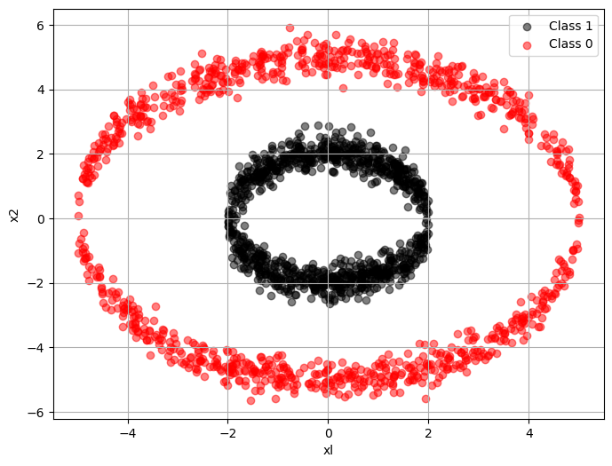

# Pytourch Deep Neuron Network

## 1. Fire up


```python
import torch
from torch.autograd import Variable
import torch.nn as nn 
import numpy as np
import pandas as pd
import matplotlib.pyplot as plt
from sklearn.metrics import accuracy_score
```

## 2. Data generating


```python
x1_Pos = []
x2_Pos = []
y_Pos = []

for i in range(1000):
    temp = 4.0 * np.random.rand() - 2.0
    y_Pos.append(1)
    x1_Pos.append(temp)
    if i % 2 == 0:
        x2_Pos.append(np.sqrt(4.0 - temp ** 2) + 0.3 * np.random.randn ( ))
    elif i % 2 == 1:
        x2_Pos.append(- np.sqrt(4.0 - temp ** 2) + 0.3 * np.random.randn () )
```

这段代码生成了一个包含1000个数据点的数据集，其中每个数据点有三个特征：`x1_Pos`，`x2_Pos`和`y_Pos`。

- 对于每个数据点，首先生成一个在区间[-2.0, 2.0]上均匀分布的随机数`temp`。
- 对于`y_Pos`特征，将其设置为常数1，表示正例。
- 对于`x1_Pos`特征，将其设置为temp的值。
- 对于`x2_Pos`特征，根据以下规则进行设置：
  - 如果当前数据点的索引i是偶数，则将`x2_Pos`设置为`sqrt(4.0 - temp^2) + 0.3 * 随机正态分布的随机数`。
  - 如果当前数据点的索引i是奇数，则将`x2_Pos`设置为`- sqrt(4.0 - temp^2) + 0.3 * 随机正态分布的随机数`。

综合起来，这段代码生成了一个具有两个特征（x1_Pos和x2_Pos）和一个标签（y_Pos）的二分类数据集，其中x1_Pos和x2_Pos的取值与彼此相关，并且存在一定的噪声。


```python
x1_Neg = []
x2_Neg = []
y_Neg = []

for i in range (1000):
    temp = 10.0 * np.random.rand() - 5.0
    y_Neg.append(0)
    x1_Neg. append (temp)
    if i % 2 == 0:
        x2_Neg.append(np.sqrt(25.0 - temp ** 2) + 0.3 * np.random.randn ())
    elif i % 2 == 1:
        x2_Neg.append(- np.sqrt (25.0 - temp ** 2) + 0.3 * np.random.randn ())
```


```python
plt.figure(figsize = (8, 6))
plt.scatter(x1_Pos, x2_Pos, color = "black", label = "Class 1", alpha = 0.5)
plt.scatter(x1_Neg, x2_Neg, color = "red", label = "Class 0", alpha = 0.5)
plt.xlabel("xl")
plt.ylabel("x2")
plt.legend ()
plt.grid()
plt.show()
```





```python
Dict = {"x1": x1_Pos + x1_Neg, "x2": x2_Pos + x2_Neg, "y": y_Pos + y_Neg}
DataTrain = pd.DataFrame(Dict)
DataTrain
```


<div>
<style scoped>
    .dataframe tbody tr th:only-of-type {
        vertical-align: middle;
    }

    .dataframe tbody tr th {
        vertical-align: top;
    }

    .dataframe thead th {
        text-align: right;
    }
</style>
<table border="1" class="dataframe">
  <thead>
    <tr style="text-align: right;">
      <th></th>
      <th>x1</th>
      <th>x2</th>
      <th>y</th>
    </tr>
  </thead>
  <tbody>
    <tr>
      <th>0</th>
      <td>0.117529</td>
      <td>1.440490</td>
      <td>1</td>
    </tr>
    <tr>
      <th>1</th>
      <td>-1.255701</td>
      <td>-1.325910</td>
      <td>1</td>
    </tr>
    <tr>
      <th>2</th>
      <td>1.950944</td>
      <td>0.462942</td>
      <td>1</td>
    </tr>
    <tr>
      <th>3</th>
      <td>0.744222</td>
      <td>-1.889267</td>
      <td>1</td>
    </tr>
    <tr>
      <th>4</th>
      <td>-0.637758</td>
      <td>1.741075</td>
      <td>1</td>
    </tr>
    <tr>
      <th>...</th>
      <td>...</td>
      <td>...</td>
      <td>...</td>
    </tr>
    <tr>
      <th>1995</th>
      <td>-4.094008</td>
      <td>-3.365285</td>
      <td>0</td>
    </tr>
    <tr>
      <th>1996</th>
      <td>-4.273857</td>
      <td>3.205604</td>
      <td>0</td>
    </tr>
    <tr>
      <th>1997</th>
      <td>1.081440</td>
      <td>-4.366669</td>
      <td>0</td>
    </tr>
    <tr>
      <th>1998</th>
      <td>3.146540</td>
      <td>4.072895</td>
      <td>0</td>
    </tr>
    <tr>
      <th>1999</th>
      <td>2.274089</td>
      <td>-4.855089</td>
      <td>0</td>
    </tr>
  </tbody>
</table>
<p>2000 rows × 3 columns</p>
</div>


```python
x1_Pos = []
x2_Pos = []
y_Pos = []

for i in range(250):
    temp = 4.0 * np.random.rand() - 2.0
    y_Pos.append(1)
    x1_Pos.append(temp)
    if i % 2 == 0:
        x2_Pos.append(np.sqrt(4.0 - temp ** 2) + 0.3 * np.random.randn ( ))
    elif i % 2 == 1:
        x2_Pos.append(- np.sqrt(4.0 - temp ** 2) + 0.3 * np.random.randn () )
```


```python
x1_Neg = []
x2_Neg = []
y_Neg = []

for i in range (250):
    temp = 10.0 * np.random.rand() - 5.0
    y_Neg.append(0)
    x1_Neg. append (temp)
    if i % 2 == 0:
        x2_Neg.append(np.sqrt(25.0 - temp ** 2) + 0.3 * np.random.randn ())
    elif i % 2 == 1:
        x2_Neg.append(- np.sqrt (25.0 - temp ** 2) + 0.3 * np.random.randn ())
```


```python
Dict = {"x1": x1_Pos + x1_Neg, "x2": x2_Pos + x2_Neg, "y": y_Pos + y_Neg}
DataTest = pd.DataFrame(Dict)
DataTest
```


<div>
<style scoped>
    .dataframe tbody tr th:only-of-type {
        vertical-align: middle;
    }

    .dataframe tbody tr th {
        vertical-align: top;
    }

    .dataframe thead th {
        text-align: right;
    }
</style>
<table border="1" class="dataframe">
  <thead>
    <tr style="text-align: right;">
      <th></th>
      <th>x1</th>
      <th>x2</th>
      <th>y</th>
    </tr>
  </thead>
  <tbody>
    <tr>
      <th>0</th>
      <td>1.620214</td>
      <td>1.175676</td>
      <td>1</td>
    </tr>
    <tr>
      <th>1</th>
      <td>-0.509711</td>
      <td>-1.657162</td>
      <td>1</td>
    </tr>
    <tr>
      <th>2</th>
      <td>-0.471200</td>
      <td>2.130239</td>
      <td>1</td>
    </tr>
    <tr>
      <th>3</th>
      <td>0.906513</td>
      <td>-1.790748</td>
      <td>1</td>
    </tr>
    <tr>
      <th>4</th>
      <td>-1.163231</td>
      <td>1.673213</td>
      <td>1</td>
    </tr>
    <tr>
      <th>...</th>
      <td>...</td>
      <td>...</td>
      <td>...</td>
    </tr>
    <tr>
      <th>495</th>
      <td>3.438152</td>
      <td>-3.321079</td>
      <td>0</td>
    </tr>
    <tr>
      <th>496</th>
      <td>-3.602392</td>
      <td>3.356225</td>
      <td>0</td>
    </tr>
    <tr>
      <th>497</th>
      <td>-3.557373</td>
      <td>-3.948084</td>
      <td>0</td>
    </tr>
    <tr>
      <th>498</th>
      <td>-0.313884</td>
      <td>4.804572</td>
      <td>0</td>
    </tr>
    <tr>
      <th>499</th>
      <td>4.260027</td>
      <td>-2.314735</td>
      <td>0</td>
    </tr>
  </tbody>
</table>
<p>500 rows × 3 columns</p>
</div>


# 3. Model training

$$\vec{x}\in\mathbb{R}^{1\times 2}$$

$$W_1\in\mathbb{R}^{2\times 10}; b_1\in\mathbb{R}^{1\times 10}$$

$$W_2\in\mathbb{R}^{10\times 2}; b_2\in\mathbb{R}^{1\times 2}$$

$$z_1 = \sigma(\vec{x}W_1+b_1)$$

$$z_2 = \sigma(z_1W_2+b_2)$$

$$\hat{y} = {\rm{softmax}}(z_2)$$
*****

$$Loss (W_1, W_2, b_1, b_2) = -\frac{1}{N}\sum_{i=1}^{N}[y_i\log\hat{y} +（1-y_1)\log(1-\hat{y})]$$

*****
$$k = 0,1,2,...$$

$$W_1^{(k+1)} = W_1^{(k)} - \alpha_k\frac{\partial Loss(W_1^{(k)}, W_2^{(k)}, b_1^{(k)}, b_2^{(k})}{\partial
W_1}$$

$$W_2^{(k+1)} = W_2^{(k)} - \alpha_k\frac{\partial Loss(W_1^{(k)}, W_2^{(k)}, b_1^{(k)}, b_2^{(k})}{\partial
W_2}$$

$$b_1^{(k+1)} = b_1^{(k)} - \alpha_k\frac{\partial Loss(W_1^{(k)}, W_2^{(k)}, b_1^{(k)}, b_2^{(k})}{\partial
b_1}$$

$$b_2^{(k+1)} = b_2^{(k)} - \alpha_k\frac{\partial Loss(W_1^{(k)}, W_2^{(k)}, b_1^{(k)}, b_2^{(k})}{\partial
b_2}$$


```python
class DeepNeuralNetworkModel(nn.Module):
    
    # Constructor of the class
    def __init__(self, input_dim1, output_dim1, input_dim2, output_dim2):   # output_dim1 = input_dim2
        super(DeepNeuralNetworkModel, self).__init__()
        
        # Fully Connected Layer 1
        self.FC_layer1 = nn.Linear(input_dim1, output_dim1)
        
        # nn.init.constant_(self.FC_layerl.weight, 0.1)
        # nn.init.constant_(self.FC_layer1.bias, -0.1)
        
        # Fully Connected Layer 2
        self.FC_layer2 = nn.Linear(input_dim2, output_dim2)
        # nn.init.constant_(self.FC_layer2.weight, 0.1)
        # nn.init.constant_(self.FC_layer2.bias, -0.1)

        # Activation Function Sigmoid()
        self.act_sig = nn.Sigmoid()
        
    # Forward propagation function
    def forward(self, x):     # dim of x: N*2
        z1_ = self.FC_layer1(x)
        z1  = self.act_sig(z1_)
        
        z2_ = self.FC_layer2(z1)
        z2  = self.act_sig(z2_)
        
        return z2
```

这段代码定义了一个名为`DeepNeuralNetworkModel`的神经网络模型类。该类继承自`nn.Module`，是PyTorch中构建神经网络模型的基类。

在该类中，包含以下几个主要部分：

1. 构造函数`__init__`：初始化模型的参数和层结构。它接收输入维度和输出维度作为参数，并定义了两个全连接层（`self.FC_layer1`和`self.FC_layer2`），以及一个Sigmoid激活函数（`self.act_sig`）。

2. 前向传播函数`forward`：定义了数据在模型中前向传播的流程。输入数据x首先通过第一个全连接层（`self.FC_layer1`）进行线性变换，然后经过Sigmoid激活函数（`self.act_sig`）。接着，输出结果再通过第二个全连接层（`self.FC_layer2`）进行线性变换，最后再经过一次Sigmoid激活函数得到最终的输出结果。

该模型的结构是一个两层的全连接神经网络:

- 第一层输入维度为`input_dim1`，第一层输出维度为`output_dim1`
- 第二层的输入维度为`output_dim1`（即第一层的输出维度），第二层的输出维度为`output_dim2`。

整个模型的作用是将输入数据映射到一个输出结果，通过两个全连接层和激活函数的组合来实现非线性映射和特征提取。


```python
X_vec = torch.tensor(DataTrain[["x1", "x2"]].values, dtype=torch.float32)  # N*2
y_vec = torch.tensor(DataTrain["y"].values, dtype=torch.int64).reshape(-1, 1)  # N*1
```


```python
alpha = 0.2
DNN_Model = DeepNeuralNetworkModel(2, 10, 10, 2)

# 优化DNN model里的所有参数，lr:learning rate 学习率（动态变化）
optimizer = torch.optim.SGD(DNN_Model.parameters(), lr = alpha)
# 损失函数
loss_function = nn.CrossEntropyLoss ()

# Dynamically Change the learning rate
def adjust_learning_rate(optimizer, epoch):   # epoch就可以理解为是一次迭代
    lr = alpha / (1 + 0.00001 * epoch)
    for param_group in optimizer.param_groups:
        param_group['lr'] = lr
```


```python
Iter_times = 200000
loss_list = []

for i in range(Iter_times):
    
    outputs = DNN_Model.forward(X_vec)  # forward propagation
    
    loss = loss_function(outputs, torch.squeeze(y_vec))  # compute loss
    
    loss.backward() # backward propagation 
    
    optimizer.step() # update parameters
    
    optimizer.zero_grad() # Reset grad to 0
    
    if (i + 1) % 500 == 0:
        print(i + 1, "iterations have been completed!")
        print("-> Now loss =", loss)
        print("=========================================")
        
    adjust_learning_rate(optimizer, i)
    
    loss_list.append(loss)
    # length = loss_list.__len__()
    # if(torch.abs(loss_listrlength - 11 - loss_list rlength - 21)<10** 1-15) and length >=2):
        # break
```

    500 iterations have been completed!
    -> Now loss = tensor(0.6814, grad_fn=<NllLossBackward0>)
    =========================================
    1000 iterations have been completed!
    -> Now loss = tensor(0.6406, grad_fn=<NllLossBackward0>)
    =========================================
    1500 iterations have been completed!
    -> Now loss = tensor(0.5620, grad_fn=<NllLossBackward0>)
    =========================================
    2000 iterations have been completed!
    -> Now loss = tensor(0.4912, grad_fn=<NllLossBackward0>)
    =========================================
    2500 iterations have been completed!
    -> Now loss = tensor(0.4461, grad_fn=<NllLossBackward0>)
    =========================================
    3000 iterations have been completed!
    -> Now loss = tensor(0.4169, grad_fn=<NllLossBackward0>)
    =========================================
    3500 iterations have been completed!
    -> Now loss = tensor(0.3933, grad_fn=<NllLossBackward0>)
    =========================================
    4000 iterations have been completed!
    -> Now loss = tensor(0.3756, grad_fn=<NllLossBackward0>)
    =========================================
    4500 iterations have been completed!
    -> Now loss = tensor(0.3634, grad_fn=<NllLossBackward0>)
    =========================================
    5000 iterations have been completed!
    -> Now loss = tensor(0.3549, grad_fn=<NllLossBackward0>)
    =========================================
    5500 iterations have been completed!
    -> Now loss = tensor(0.3486, grad_fn=<NllLossBackward0>)
    =========================================
    6000 iterations have been completed!
    -> Now loss = tensor(0.3439, grad_fn=<NllLossBackward0>)
    =========================================
    6500 iterations have been completed!
    -> Now loss = tensor(0.3403, grad_fn=<NllLossBackward0>)
    =========================================
    7000 iterations have been completed!
    -> Now loss = tensor(0.3374, grad_fn=<NllLossBackward0>)
    =========================================
    7500 iterations have been completed!
    -> Now loss = tensor(0.3350, grad_fn=<NllLossBackward0>)
    =========================================
    8000 iterations have been completed!
    -> Now loss = tensor(0.3331, grad_fn=<NllLossBackward0>)
    =========================================
    8500 iterations have been completed!
    -> Now loss = tensor(0.3314, grad_fn=<NllLossBackward0>)
    =========================================
    9000 iterations have been completed!
    -> Now loss = tensor(0.3300, grad_fn=<NllLossBackward0>)
    =========================================
    9500 iterations have been completed!
    -> Now loss = tensor(0.3289, grad_fn=<NllLossBackward0>)
    =========================================
    10000 iterations have been completed!
    -> Now loss = tensor(0.3278, grad_fn=<NllLossBackward0>)
    =========================================
    10500 iterations have been completed!
    -> Now loss = tensor(0.3269, grad_fn=<NllLossBackward0>)
    =========================================
    11000 iterations have been completed!
    -> Now loss = tensor(0.3261, grad_fn=<NllLossBackward0>)
    =========================================
    11500 iterations have been completed!
    -> Now loss = tensor(0.3254, grad_fn=<NllLossBackward0>)
    =========================================
    12000 iterations have been completed!
    -> Now loss = tensor(0.3248, grad_fn=<NllLossBackward0>)
    =========================================
    12500 iterations have been completed!
    -> Now loss = tensor(0.3242, grad_fn=<NllLossBackward0>)
    =========================================
    13000 iterations have been completed!
    -> Now loss = tensor(0.3237, grad_fn=<NllLossBackward0>)
    =========================================
    13500 iterations have been completed!
    -> Now loss = tensor(0.3232, grad_fn=<NllLossBackward0>)
    =========================================
    14000 iterations have been completed!
    -> Now loss = tensor(0.3228, grad_fn=<NllLossBackward0>)
    =========================================
    14500 iterations have been completed!
    -> Now loss = tensor(0.3224, grad_fn=<NllLossBackward0>)
    =========================================
    15000 iterations have been completed!
    -> Now loss = tensor(0.3220, grad_fn=<NllLossBackward0>)
    =========================================
    15500 iterations have been completed!
    -> Now loss = tensor(0.3217, grad_fn=<NllLossBackward0>)
    =========================================
    16000 iterations have been completed!
    -> Now loss = tensor(0.3214, grad_fn=<NllLossBackward0>)
    =========================================
    16500 iterations have been completed!
    -> Now loss = tensor(0.3211, grad_fn=<NllLossBackward0>)
    =========================================
    17000 iterations have been completed!
    -> Now loss = tensor(0.3208, grad_fn=<NllLossBackward0>)
    =========================================
    17500 iterations have been completed!
    -> Now loss = tensor(0.3206, grad_fn=<NllLossBackward0>)
    =========================================
    18000 iterations have been completed!
    -> Now loss = tensor(0.3204, grad_fn=<NllLossBackward0>)
    =========================================
    18500 iterations have been completed!
    -> Now loss = tensor(0.3202, grad_fn=<NllLossBackward0>)
    =========================================
    19000 iterations have been completed!
    -> Now loss = tensor(0.3200, grad_fn=<NllLossBackward0>)
    =========================================
    19500 iterations have been completed!
    -> Now loss = tensor(0.3198, grad_fn=<NllLossBackward0>)
    =========================================
    20000 iterations have been completed!
    -> Now loss = tensor(0.3196, grad_fn=<NllLossBackward0>)
    =========================================
    20500 iterations have been completed!
    -> Now loss = tensor(0.3194, grad_fn=<NllLossBackward0>)
    =========================================
    21000 iterations have been completed!
    -> Now loss = tensor(0.3193, grad_fn=<NllLossBackward0>)
    =========================================
    21500 iterations have been completed!
    -> Now loss = tensor(0.3191, grad_fn=<NllLossBackward0>)
    =========================================
    22000 iterations have been completed!
    -> Now loss = tensor(0.3190, grad_fn=<NllLossBackward0>)
    =========================================
    22500 iterations have been completed!
    -> Now loss = tensor(0.3188, grad_fn=<NllLossBackward0>)
    =========================================
    23000 iterations have been completed!
    -> Now loss = tensor(0.3187, grad_fn=<NllLossBackward0>)
    =========================================
    23500 iterations have been completed!
    -> Now loss = tensor(0.3186, grad_fn=<NllLossBackward0>)
    =========================================
    24000 iterations have been completed!
    -> Now loss = tensor(0.3185, grad_fn=<NllLossBackward0>)
    =========================================
    24500 iterations have been completed!
    -> Now loss = tensor(0.3184, grad_fn=<NllLossBackward0>)
    =========================================
    25000 iterations have been completed!
    -> Now loss = tensor(0.3182, grad_fn=<NllLossBackward0>)
    =========================================
    25500 iterations have been completed!
    -> Now loss = tensor(0.3181, grad_fn=<NllLossBackward0>)
    =========================================
    26000 iterations have been completed!
    -> Now loss = tensor(0.3180, grad_fn=<NllLossBackward0>)
    =========================================
    26500 iterations have been completed!
    -> Now loss = tensor(0.3180, grad_fn=<NllLossBackward0>)
    =========================================
    27000 iterations have been completed!
    -> Now loss = tensor(0.3179, grad_fn=<NllLossBackward0>)
    =========================================
    27500 iterations have been completed!
    -> Now loss = tensor(0.3178, grad_fn=<NllLossBackward0>)
    =========================================
    28000 iterations have been completed!
    -> Now loss = tensor(0.3177, grad_fn=<NllLossBackward0>)
    =========================================
    28500 iterations have been completed!
    -> Now loss = tensor(0.3176, grad_fn=<NllLossBackward0>)
    =========================================
    29000 iterations have been completed!
    -> Now loss = tensor(0.3175, grad_fn=<NllLossBackward0>)
    =========================================
    29500 iterations have been completed!
    -> Now loss = tensor(0.3175, grad_fn=<NllLossBackward0>)
    =========================================
    30000 iterations have been completed!
    -> Now loss = tensor(0.3174, grad_fn=<NllLossBackward0>)
    =========================================
    30500 iterations have been completed!
    -> Now loss = tensor(0.3173, grad_fn=<NllLossBackward0>)
    =========================================
    31000 iterations have been completed!
    -> Now loss = tensor(0.3173, grad_fn=<NllLossBackward0>)
    =========================================
    31500 iterations have been completed!
    -> Now loss = tensor(0.3172, grad_fn=<NllLossBackward0>)
    =========================================
    32000 iterations have been completed!
    -> Now loss = tensor(0.3171, grad_fn=<NllLossBackward0>)
    =========================================
    32500 iterations have been completed!
    -> Now loss = tensor(0.3171, grad_fn=<NllLossBackward0>)
    =========================================
    33000 iterations have been completed!
    -> Now loss = tensor(0.3170, grad_fn=<NllLossBackward0>)
    =========================================
    33500 iterations have been completed!
    -> Now loss = tensor(0.3170, grad_fn=<NllLossBackward0>)
    =========================================
    34000 iterations have been completed!
    -> Now loss = tensor(0.3169, grad_fn=<NllLossBackward0>)
    =========================================
    34500 iterations have been completed!
    -> Now loss = tensor(0.3169, grad_fn=<NllLossBackward0>)
    =========================================
    35000 iterations have been completed!
    -> Now loss = tensor(0.3168, grad_fn=<NllLossBackward0>)
    =========================================
    35500 iterations have been completed!
    -> Now loss = tensor(0.3168, grad_fn=<NllLossBackward0>)
    =========================================
    36000 iterations have been completed!
    -> Now loss = tensor(0.3167, grad_fn=<NllLossBackward0>)
    =========================================
    36500 iterations have been completed!
    -> Now loss = tensor(0.3167, grad_fn=<NllLossBackward0>)
    =========================================
    37000 iterations have been completed!
    -> Now loss = tensor(0.3166, grad_fn=<NllLossBackward0>)
    =========================================
    37500 iterations have been completed!
    -> Now loss = tensor(0.3166, grad_fn=<NllLossBackward0>)
    =========================================
    38000 iterations have been completed!
    -> Now loss = tensor(0.3165, grad_fn=<NllLossBackward0>)
    =========================================
    38500 iterations have been completed!
    -> Now loss = tensor(0.3165, grad_fn=<NllLossBackward0>)
    =========================================
    39000 iterations have been completed!
    -> Now loss = tensor(0.3165, grad_fn=<NllLossBackward0>)
    =========================================
    39500 iterations have been completed!
    -> Now loss = tensor(0.3164, grad_fn=<NllLossBackward0>)
    =========================================
    40000 iterations have been completed!
    -> Now loss = tensor(0.3164, grad_fn=<NllLossBackward0>)
    =========================================
    40500 iterations have been completed!
    -> Now loss = tensor(0.3164, grad_fn=<NllLossBackward0>)
    =========================================
    41000 iterations have been completed!
    -> Now loss = tensor(0.3163, grad_fn=<NllLossBackward0>)
    =========================================
    41500 iterations have been completed!
    -> Now loss = tensor(0.3163, grad_fn=<NllLossBackward0>)
    =========================================
    42000 iterations have been completed!
    -> Now loss = tensor(0.3163, grad_fn=<NllLossBackward0>)
    =========================================
    42500 iterations have been completed!
    -> Now loss = tensor(0.3162, grad_fn=<NllLossBackward0>)
    =========================================
    43000 iterations have been completed!
    -> Now loss = tensor(0.3162, grad_fn=<NllLossBackward0>)
    =========================================
    43500 iterations have been completed!
    -> Now loss = tensor(0.3162, grad_fn=<NllLossBackward0>)
    =========================================
    44000 iterations have been completed!
    -> Now loss = tensor(0.3161, grad_fn=<NllLossBackward0>)
    =========================================
    44500 iterations have been completed!
    -> Now loss = tensor(0.3161, grad_fn=<NllLossBackward0>)
    =========================================
    45000 iterations have been completed!
    -> Now loss = tensor(0.3161, grad_fn=<NllLossBackward0>)
    =========================================
    45500 iterations have been completed!
    -> Now loss = tensor(0.3160, grad_fn=<NllLossBackward0>)
    =========================================
    46000 iterations have been completed!
    -> Now loss = tensor(0.3160, grad_fn=<NllLossBackward0>)
    =========================================
    46500 iterations have been completed!
    -> Now loss = tensor(0.3160, grad_fn=<NllLossBackward0>)
    =========================================
    47000 iterations have been completed!
    -> Now loss = tensor(0.3160, grad_fn=<NllLossBackward0>)
    =========================================
    47500 iterations have been completed!
    -> Now loss = tensor(0.3159, grad_fn=<NllLossBackward0>)
    =========================================
    48000 iterations have been completed!
    -> Now loss = tensor(0.3159, grad_fn=<NllLossBackward0>)
    =========================================
    48500 iterations have been completed!
    -> Now loss = tensor(0.3159, grad_fn=<NllLossBackward0>)
    =========================================
    49000 iterations have been completed!
    -> Now loss = tensor(0.3159, grad_fn=<NllLossBackward0>)
    =========================================
    49500 iterations have been completed!
    -> Now loss = tensor(0.3158, grad_fn=<NllLossBackward0>)
    =========================================
    50000 iterations have been completed!
    -> Now loss = tensor(0.3158, grad_fn=<NllLossBackward0>)
    =========================================
    50500 iterations have been completed!
    -> Now loss = tensor(0.3158, grad_fn=<NllLossBackward0>)
    =========================================
    51000 iterations have been completed!
    -> Now loss = tensor(0.3158, grad_fn=<NllLossBackward0>)
    =========================================
    51500 iterations have been completed!
    -> Now loss = tensor(0.3157, grad_fn=<NllLossBackward0>)
    =========================================
    52000 iterations have been completed!
    -> Now loss = tensor(0.3157, grad_fn=<NllLossBackward0>)
    =========================================
    52500 iterations have been completed!
    -> Now loss = tensor(0.3157, grad_fn=<NllLossBackward0>)
    =========================================
    53000 iterations have been completed!
    -> Now loss = tensor(0.3157, grad_fn=<NllLossBackward0>)
    =========================================
    53500 iterations have been completed!
    -> Now loss = tensor(0.3157, grad_fn=<NllLossBackward0>)
    =========================================
    54000 iterations have been completed!
    -> Now loss = tensor(0.3156, grad_fn=<NllLossBackward0>)
    =========================================
    54500 iterations have been completed!
    -> Now loss = tensor(0.3156, grad_fn=<NllLossBackward0>)
    =========================================
    55000 iterations have been completed!
    -> Now loss = tensor(0.3156, grad_fn=<NllLossBackward0>)
    =========================================
    55500 iterations have been completed!
    -> Now loss = tensor(0.3156, grad_fn=<NllLossBackward0>)
    =========================================
    56000 iterations have been completed!
    -> Now loss = tensor(0.3156, grad_fn=<NllLossBackward0>)
    =========================================
    56500 iterations have been completed!
    -> Now loss = tensor(0.3156, grad_fn=<NllLossBackward0>)
    =========================================
    57000 iterations have been completed!
    -> Now loss = tensor(0.3155, grad_fn=<NllLossBackward0>)
    =========================================
    57500 iterations have been completed!
    -> Now loss = tensor(0.3155, grad_fn=<NllLossBackward0>)
    =========================================
    58000 iterations have been completed!
    -> Now loss = tensor(0.3155, grad_fn=<NllLossBackward0>)
    =========================================
    58500 iterations have been completed!
    -> Now loss = tensor(0.3155, grad_fn=<NllLossBackward0>)
    =========================================
    59000 iterations have been completed!
    -> Now loss = tensor(0.3155, grad_fn=<NllLossBackward0>)
    =========================================
    59500 iterations have been completed!
    -> Now loss = tensor(0.3155, grad_fn=<NllLossBackward0>)
    =========================================
    60000 iterations have been completed!
    -> Now loss = tensor(0.3154, grad_fn=<NllLossBackward0>)
    =========================================
    60500 iterations have been completed!
    -> Now loss = tensor(0.3154, grad_fn=<NllLossBackward0>)
    =========================================
    61000 iterations have been completed!
    -> Now loss = tensor(0.3154, grad_fn=<NllLossBackward0>)
    =========================================
    61500 iterations have been completed!
    -> Now loss = tensor(0.3154, grad_fn=<NllLossBackward0>)
    =========================================
    62000 iterations have been completed!
    -> Now loss = tensor(0.3154, grad_fn=<NllLossBackward0>)
    =========================================
    62500 iterations have been completed!
    -> Now loss = tensor(0.3154, grad_fn=<NllLossBackward0>)
    =========================================
    63000 iterations have been completed!
    -> Now loss = tensor(0.3153, grad_fn=<NllLossBackward0>)
    =========================================
    63500 iterations have been completed!
    -> Now loss = tensor(0.3153, grad_fn=<NllLossBackward0>)
    =========================================
    64000 iterations have been completed!
    -> Now loss = tensor(0.3153, grad_fn=<NllLossBackward0>)
    =========================================
    64500 iterations have been completed!
    -> Now loss = tensor(0.3153, grad_fn=<NllLossBackward0>)
    =========================================
    65000 iterations have been completed!
    -> Now loss = tensor(0.3153, grad_fn=<NllLossBackward0>)
    =========================================
    65500 iterations have been completed!
    -> Now loss = tensor(0.3153, grad_fn=<NllLossBackward0>)
    =========================================
    66000 iterations have been completed!
    -> Now loss = tensor(0.3153, grad_fn=<NllLossBackward0>)
    =========================================
    66500 iterations have been completed!
    -> Now loss = tensor(0.3153, grad_fn=<NllLossBackward0>)
    =========================================
    67000 iterations have been completed!
    -> Now loss = tensor(0.3152, grad_fn=<NllLossBackward0>)
    =========================================
    67500 iterations have been completed!
    -> Now loss = tensor(0.3152, grad_fn=<NllLossBackward0>)
    =========================================
    68000 iterations have been completed!
    -> Now loss = tensor(0.3152, grad_fn=<NllLossBackward0>)
    =========================================
    68500 iterations have been completed!
    -> Now loss = tensor(0.3152, grad_fn=<NllLossBackward0>)
    =========================================
    69000 iterations have been completed!
    -> Now loss = tensor(0.3152, grad_fn=<NllLossBackward0>)
    =========================================
    69500 iterations have been completed!
    -> Now loss = tensor(0.3152, grad_fn=<NllLossBackward0>)
    =========================================
    70000 iterations have been completed!
    -> Now loss = tensor(0.3152, grad_fn=<NllLossBackward0>)
    =========================================
    70500 iterations have been completed!
    -> Now loss = tensor(0.3152, grad_fn=<NllLossBackward0>)
    =========================================
    71000 iterations have been completed!
    -> Now loss = tensor(0.3151, grad_fn=<NllLossBackward0>)
    =========================================
    71500 iterations have been completed!
    -> Now loss = tensor(0.3151, grad_fn=<NllLossBackward0>)
    =========================================
    72000 iterations have been completed!
    -> Now loss = tensor(0.3151, grad_fn=<NllLossBackward0>)
    =========================================
    72500 iterations have been completed!
    -> Now loss = tensor(0.3151, grad_fn=<NllLossBackward0>)
    =========================================
    73000 iterations have been completed!
    -> Now loss = tensor(0.3151, grad_fn=<NllLossBackward0>)
    =========================================
    73500 iterations have been completed!
    -> Now loss = tensor(0.3151, grad_fn=<NllLossBackward0>)
    =========================================
    74000 iterations have been completed!
    -> Now loss = tensor(0.3151, grad_fn=<NllLossBackward0>)
    =========================================
    74500 iterations have been completed!
    -> Now loss = tensor(0.3151, grad_fn=<NllLossBackward0>)
    =========================================
    75000 iterations have been completed!
    -> Now loss = tensor(0.3151, grad_fn=<NllLossBackward0>)
    =========================================
    75500 iterations have been completed!
    -> Now loss = tensor(0.3151, grad_fn=<NllLossBackward0>)
    =========================================
    76000 iterations have been completed!
    -> Now loss = tensor(0.3150, grad_fn=<NllLossBackward0>)
    =========================================
    76500 iterations have been completed!
    -> Now loss = tensor(0.3150, grad_fn=<NllLossBackward0>)
    =========================================
    77000 iterations have been completed!
    -> Now loss = tensor(0.3150, grad_fn=<NllLossBackward0>)
    =========================================
    77500 iterations have been completed!
    -> Now loss = tensor(0.3150, grad_fn=<NllLossBackward0>)
    =========================================
    78000 iterations have been completed!
    -> Now loss = tensor(0.3150, grad_fn=<NllLossBackward0>)
    =========================================
    78500 iterations have been completed!
    -> Now loss = tensor(0.3150, grad_fn=<NllLossBackward0>)
    =========================================
    79000 iterations have been completed!
    -> Now loss = tensor(0.3150, grad_fn=<NllLossBackward0>)
    =========================================
    79500 iterations have been completed!
    -> Now loss = tensor(0.3150, grad_fn=<NllLossBackward0>)
    =========================================
    80000 iterations have been completed!
    -> Now loss = tensor(0.3150, grad_fn=<NllLossBackward0>)
    =========================================
    80500 iterations have been completed!
    -> Now loss = tensor(0.3150, grad_fn=<NllLossBackward0>)
    =========================================
    81000 iterations have been completed!
    -> Now loss = tensor(0.3150, grad_fn=<NllLossBackward0>)
    =========================================
    81500 iterations have been completed!
    -> Now loss = tensor(0.3149, grad_fn=<NllLossBackward0>)
    =========================================
    82000 iterations have been completed!
    -> Now loss = tensor(0.3149, grad_fn=<NllLossBackward0>)
    =========================================
    82500 iterations have been completed!
    -> Now loss = tensor(0.3149, grad_fn=<NllLossBackward0>)
    =========================================
    83000 iterations have been completed!
    -> Now loss = tensor(0.3149, grad_fn=<NllLossBackward0>)
    =========================================
    83500 iterations have been completed!
    -> Now loss = tensor(0.3149, grad_fn=<NllLossBackward0>)
    =========================================
    84000 iterations have been completed!
    -> Now loss = tensor(0.3149, grad_fn=<NllLossBackward0>)
    =========================================
    84500 iterations have been completed!
    -> Now loss = tensor(0.3149, grad_fn=<NllLossBackward0>)
    =========================================
    85000 iterations have been completed!
    -> Now loss = tensor(0.3149, grad_fn=<NllLossBackward0>)
    =========================================
    85500 iterations have been completed!
    -> Now loss = tensor(0.3149, grad_fn=<NllLossBackward0>)
    =========================================
    86000 iterations have been completed!
    -> Now loss = tensor(0.3149, grad_fn=<NllLossBackward0>)
    =========================================
    86500 iterations have been completed!
    -> Now loss = tensor(0.3149, grad_fn=<NllLossBackward0>)
    =========================================
    87000 iterations have been completed!
    -> Now loss = tensor(0.3149, grad_fn=<NllLossBackward0>)
    =========================================
    87500 iterations have been completed!
    -> Now loss = tensor(0.3149, grad_fn=<NllLossBackward0>)
    =========================================
    88000 iterations have been completed!
    -> Now loss = tensor(0.3148, grad_fn=<NllLossBackward0>)
    =========================================
    88500 iterations have been completed!
    -> Now loss = tensor(0.3148, grad_fn=<NllLossBackward0>)
    =========================================
    89000 iterations have been completed!
    -> Now loss = tensor(0.3148, grad_fn=<NllLossBackward0>)
    =========================================
    89500 iterations have been completed!
    -> Now loss = tensor(0.3148, grad_fn=<NllLossBackward0>)
    =========================================
    90000 iterations have been completed!
    -> Now loss = tensor(0.3148, grad_fn=<NllLossBackward0>)
    =========================================
    90500 iterations have been completed!
    -> Now loss = tensor(0.3148, grad_fn=<NllLossBackward0>)
    =========================================
    91000 iterations have been completed!
    -> Now loss = tensor(0.3148, grad_fn=<NllLossBackward0>)
    =========================================
    91500 iterations have been completed!
    -> Now loss = tensor(0.3148, grad_fn=<NllLossBackward0>)
    =========================================
    92000 iterations have been completed!
    -> Now loss = tensor(0.3148, grad_fn=<NllLossBackward0>)
    =========================================
    92500 iterations have been completed!
    -> Now loss = tensor(0.3148, grad_fn=<NllLossBackward0>)
    =========================================
    93000 iterations have been completed!
    -> Now loss = tensor(0.3148, grad_fn=<NllLossBackward0>)
    =========================================
    93500 iterations have been completed!
    -> Now loss = tensor(0.3148, grad_fn=<NllLossBackward0>)
    =========================================
    94000 iterations have been completed!
    -> Now loss = tensor(0.3148, grad_fn=<NllLossBackward0>)
    =========================================
    94500 iterations have been completed!
    -> Now loss = tensor(0.3148, grad_fn=<NllLossBackward0>)
    =========================================
    95000 iterations have been completed!
    -> Now loss = tensor(0.3148, grad_fn=<NllLossBackward0>)
    =========================================
    95500 iterations have been completed!
    -> Now loss = tensor(0.3147, grad_fn=<NllLossBackward0>)
    =========================================
    96000 iterations have been completed!
    -> Now loss = tensor(0.3147, grad_fn=<NllLossBackward0>)
    =========================================
    96500 iterations have been completed!
    -> Now loss = tensor(0.3147, grad_fn=<NllLossBackward0>)
    =========================================
    97000 iterations have been completed!
    -> Now loss = tensor(0.3147, grad_fn=<NllLossBackward0>)
    =========================================
    97500 iterations have been completed!
    -> Now loss = tensor(0.3147, grad_fn=<NllLossBackward0>)
    =========================================
    98000 iterations have been completed!
    -> Now loss = tensor(0.3147, grad_fn=<NllLossBackward0>)
    =========================================
    98500 iterations have been completed!
    -> Now loss = tensor(0.3147, grad_fn=<NllLossBackward0>)
    =========================================
    99000 iterations have been completed!
    -> Now loss = tensor(0.3147, grad_fn=<NllLossBackward0>)
    =========================================
    99500 iterations have been completed!
    -> Now loss = tensor(0.3147, grad_fn=<NllLossBackward0>)
    =========================================
    100000 iterations have been completed!
    -> Now loss = tensor(0.3147, grad_fn=<NllLossBackward0>)
    =========================================
    100500 iterations have been completed!
    -> Now loss = tensor(0.3147, grad_fn=<NllLossBackward0>)
    =========================================
    101000 iterations have been completed!
    -> Now loss = tensor(0.3147, grad_fn=<NllLossBackward0>)
    =========================================
    101500 iterations have been completed!
    -> Now loss = tensor(0.3147, grad_fn=<NllLossBackward0>)
    =========================================
    102000 iterations have been completed!
    -> Now loss = tensor(0.3147, grad_fn=<NllLossBackward0>)
    =========================================
    102500 iterations have been completed!
    -> Now loss = tensor(0.3147, grad_fn=<NllLossBackward0>)
    =========================================
    103000 iterations have been completed!
    -> Now loss = tensor(0.3147, grad_fn=<NllLossBackward0>)
    =========================================
    103500 iterations have been completed!
    -> Now loss = tensor(0.3147, grad_fn=<NllLossBackward0>)
    =========================================
    104000 iterations have been completed!
    -> Now loss = tensor(0.3147, grad_fn=<NllLossBackward0>)
    =========================================
    104500 iterations have been completed!
    -> Now loss = tensor(0.3146, grad_fn=<NllLossBackward0>)
    =========================================
    105000 iterations have been completed!
    -> Now loss = tensor(0.3146, grad_fn=<NllLossBackward0>)
    =========================================
    105500 iterations have been completed!
    -> Now loss = tensor(0.3146, grad_fn=<NllLossBackward0>)
    =========================================
    106000 iterations have been completed!
    -> Now loss = tensor(0.3146, grad_fn=<NllLossBackward0>)
    =========================================
    106500 iterations have been completed!
    -> Now loss = tensor(0.3146, grad_fn=<NllLossBackward0>)
    =========================================
    107000 iterations have been completed!
    -> Now loss = tensor(0.3146, grad_fn=<NllLossBackward0>)
    =========================================
    107500 iterations have been completed!
    -> Now loss = tensor(0.3146, grad_fn=<NllLossBackward0>)
    =========================================
    108000 iterations have been completed!
    -> Now loss = tensor(0.3146, grad_fn=<NllLossBackward0>)
    =========================================
    108500 iterations have been completed!
    -> Now loss = tensor(0.3146, grad_fn=<NllLossBackward0>)
    =========================================
    109000 iterations have been completed!
    -> Now loss = tensor(0.3146, grad_fn=<NllLossBackward0>)
    =========================================
    109500 iterations have been completed!
    -> Now loss = tensor(0.3146, grad_fn=<NllLossBackward0>)
    =========================================
    110000 iterations have been completed!
    -> Now loss = tensor(0.3146, grad_fn=<NllLossBackward0>)
    =========================================
    110500 iterations have been completed!
    -> Now loss = tensor(0.3146, grad_fn=<NllLossBackward0>)
    =========================================
    111000 iterations have been completed!
    -> Now loss = tensor(0.3146, grad_fn=<NllLossBackward0>)
    =========================================
    111500 iterations have been completed!
    -> Now loss = tensor(0.3146, grad_fn=<NllLossBackward0>)
    =========================================
    112000 iterations have been completed!
    -> Now loss = tensor(0.3146, grad_fn=<NllLossBackward0>)
    =========================================
    112500 iterations have been completed!
    -> Now loss = tensor(0.3146, grad_fn=<NllLossBackward0>)
    =========================================
    113000 iterations have been completed!
    -> Now loss = tensor(0.3146, grad_fn=<NllLossBackward0>)
    =========================================
    113500 iterations have been completed!
    -> Now loss = tensor(0.3146, grad_fn=<NllLossBackward0>)
    =========================================
    114000 iterations have been completed!
    -> Now loss = tensor(0.3146, grad_fn=<NllLossBackward0>)
    =========================================
    114500 iterations have been completed!
    -> Now loss = tensor(0.3146, grad_fn=<NllLossBackward0>)
    =========================================
    115000 iterations have been completed!
    -> Now loss = tensor(0.3146, grad_fn=<NllLossBackward0>)
    =========================================
    115500 iterations have been completed!
    -> Now loss = tensor(0.3145, grad_fn=<NllLossBackward0>)
    =========================================
    116000 iterations have been completed!
    -> Now loss = tensor(0.3145, grad_fn=<NllLossBackward0>)
    =========================================
    116500 iterations have been completed!
    -> Now loss = tensor(0.3145, grad_fn=<NllLossBackward0>)
    =========================================
    117000 iterations have been completed!
    -> Now loss = tensor(0.3145, grad_fn=<NllLossBackward0>)
    =========================================
    117500 iterations have been completed!
    -> Now loss = tensor(0.3145, grad_fn=<NllLossBackward0>)
    =========================================
    118000 iterations have been completed!
    -> Now loss = tensor(0.3145, grad_fn=<NllLossBackward0>)
    =========================================
    118500 iterations have been completed!
    -> Now loss = tensor(0.3145, grad_fn=<NllLossBackward0>)
    =========================================
    119000 iterations have been completed!
    -> Now loss = tensor(0.3145, grad_fn=<NllLossBackward0>)
    =========================================
    119500 iterations have been completed!
    -> Now loss = tensor(0.3145, grad_fn=<NllLossBackward0>)
    =========================================
    120000 iterations have been completed!
    -> Now loss = tensor(0.3145, grad_fn=<NllLossBackward0>)
    =========================================
    120500 iterations have been completed!
    -> Now loss = tensor(0.3145, grad_fn=<NllLossBackward0>)
    =========================================
    121000 iterations have been completed!
    -> Now loss = tensor(0.3145, grad_fn=<NllLossBackward0>)
    =========================================
    121500 iterations have been completed!
    -> Now loss = tensor(0.3145, grad_fn=<NllLossBackward0>)
    =========================================
    122000 iterations have been completed!
    -> Now loss = tensor(0.3145, grad_fn=<NllLossBackward0>)
    =========================================
    122500 iterations have been completed!
    -> Now loss = tensor(0.3145, grad_fn=<NllLossBackward0>)
    =========================================
    123000 iterations have been completed!
    -> Now loss = tensor(0.3145, grad_fn=<NllLossBackward0>)
    =========================================
    123500 iterations have been completed!
    -> Now loss = tensor(0.3145, grad_fn=<NllLossBackward0>)
    =========================================
    124000 iterations have been completed!
    -> Now loss = tensor(0.3145, grad_fn=<NllLossBackward0>)
    =========================================
    124500 iterations have been completed!
    -> Now loss = tensor(0.3145, grad_fn=<NllLossBackward0>)
    =========================================
    125000 iterations have been completed!
    -> Now loss = tensor(0.3145, grad_fn=<NllLossBackward0>)
    =========================================
    125500 iterations have been completed!
    -> Now loss = tensor(0.3145, grad_fn=<NllLossBackward0>)
    =========================================
    126000 iterations have been completed!
    -> Now loss = tensor(0.3145, grad_fn=<NllLossBackward0>)
    =========================================
    126500 iterations have been completed!
    -> Now loss = tensor(0.3145, grad_fn=<NllLossBackward0>)
    =========================================
    127000 iterations have been completed!
    -> Now loss = tensor(0.3145, grad_fn=<NllLossBackward0>)
    =========================================
    127500 iterations have been completed!
    -> Now loss = tensor(0.3145, grad_fn=<NllLossBackward0>)
    =========================================
    128000 iterations have been completed!
    -> Now loss = tensor(0.3145, grad_fn=<NllLossBackward0>)
    =========================================
    128500 iterations have been completed!
    -> Now loss = tensor(0.3145, grad_fn=<NllLossBackward0>)
    =========================================
    129000 iterations have been completed!
    -> Now loss = tensor(0.3145, grad_fn=<NllLossBackward0>)
    =========================================
    129500 iterations have been completed!
    -> Now loss = tensor(0.3144, grad_fn=<NllLossBackward0>)
    =========================================
    130000 iterations have been completed!
    -> Now loss = tensor(0.3144, grad_fn=<NllLossBackward0>)
    =========================================
    130500 iterations have been completed!
    -> Now loss = tensor(0.3144, grad_fn=<NllLossBackward0>)
    =========================================
    131000 iterations have been completed!
    -> Now loss = tensor(0.3144, grad_fn=<NllLossBackward0>)
    =========================================
    131500 iterations have been completed!
    -> Now loss = tensor(0.3144, grad_fn=<NllLossBackward0>)
    =========================================
    132000 iterations have been completed!
    -> Now loss = tensor(0.3144, grad_fn=<NllLossBackward0>)
    =========================================
    132500 iterations have been completed!
    -> Now loss = tensor(0.3144, grad_fn=<NllLossBackward0>)
    =========================================
    133000 iterations have been completed!
    -> Now loss = tensor(0.3144, grad_fn=<NllLossBackward0>)
    =========================================
    133500 iterations have been completed!
    -> Now loss = tensor(0.3144, grad_fn=<NllLossBackward0>)
    =========================================
    134000 iterations have been completed!
    -> Now loss = tensor(0.3144, grad_fn=<NllLossBackward0>)
    =========================================
    134500 iterations have been completed!
    -> Now loss = tensor(0.3144, grad_fn=<NllLossBackward0>)
    =========================================
    135000 iterations have been completed!
    -> Now loss = tensor(0.3144, grad_fn=<NllLossBackward0>)
    =========================================
    135500 iterations have been completed!
    -> Now loss = tensor(0.3144, grad_fn=<NllLossBackward0>)
    =========================================
    136000 iterations have been completed!
    -> Now loss = tensor(0.3144, grad_fn=<NllLossBackward0>)
    =========================================
    136500 iterations have been completed!
    -> Now loss = tensor(0.3144, grad_fn=<NllLossBackward0>)
    =========================================
    137000 iterations have been completed!
    -> Now loss = tensor(0.3144, grad_fn=<NllLossBackward0>)
    =========================================
    137500 iterations have been completed!
    -> Now loss = tensor(0.3144, grad_fn=<NllLossBackward0>)
    =========================================
    138000 iterations have been completed!
    -> Now loss = tensor(0.3144, grad_fn=<NllLossBackward0>)
    =========================================
    138500 iterations have been completed!
    -> Now loss = tensor(0.3144, grad_fn=<NllLossBackward0>)
    =========================================
    139000 iterations have been completed!
    -> Now loss = tensor(0.3144, grad_fn=<NllLossBackward0>)
    =========================================
    139500 iterations have been completed!
    -> Now loss = tensor(0.3144, grad_fn=<NllLossBackward0>)
    =========================================
    140000 iterations have been completed!
    -> Now loss = tensor(0.3144, grad_fn=<NllLossBackward0>)
    =========================================
    140500 iterations have been completed!
    -> Now loss = tensor(0.3144, grad_fn=<NllLossBackward0>)
    =========================================
    141000 iterations have been completed!
    -> Now loss = tensor(0.3144, grad_fn=<NllLossBackward0>)
    =========================================
    141500 iterations have been completed!
    -> Now loss = tensor(0.3144, grad_fn=<NllLossBackward0>)
    =========================================
    142000 iterations have been completed!
    -> Now loss = tensor(0.3144, grad_fn=<NllLossBackward0>)
    =========================================
    142500 iterations have been completed!
    -> Now loss = tensor(0.3144, grad_fn=<NllLossBackward0>)
    =========================================
    143000 iterations have been completed!
    -> Now loss = tensor(0.3144, grad_fn=<NllLossBackward0>)
    =========================================
    143500 iterations have been completed!
    -> Now loss = tensor(0.3144, grad_fn=<NllLossBackward0>)
    =========================================
    144000 iterations have been completed!
    -> Now loss = tensor(0.3144, grad_fn=<NllLossBackward0>)
    =========================================
    144500 iterations have been completed!
    -> Now loss = tensor(0.3144, grad_fn=<NllLossBackward0>)
    =========================================
    145000 iterations have been completed!
    -> Now loss = tensor(0.3144, grad_fn=<NllLossBackward0>)
    =========================================
    145500 iterations have been completed!
    -> Now loss = tensor(0.3144, grad_fn=<NllLossBackward0>)
    =========================================
    146000 iterations have been completed!
    -> Now loss = tensor(0.3144, grad_fn=<NllLossBackward0>)
    =========================================
    146500 iterations have been completed!
    -> Now loss = tensor(0.3143, grad_fn=<NllLossBackward0>)
    =========================================
    147000 iterations have been completed!
    -> Now loss = tensor(0.3143, grad_fn=<NllLossBackward0>)
    =========================================
    147500 iterations have been completed!
    -> Now loss = tensor(0.3143, grad_fn=<NllLossBackward0>)
    =========================================
    148000 iterations have been completed!
    -> Now loss = tensor(0.3143, grad_fn=<NllLossBackward0>)
    =========================================
    148500 iterations have been completed!
    -> Now loss = tensor(0.3143, grad_fn=<NllLossBackward0>)
    =========================================
    149000 iterations have been completed!
    -> Now loss = tensor(0.3143, grad_fn=<NllLossBackward0>)
    =========================================
    149500 iterations have been completed!
    -> Now loss = tensor(0.3143, grad_fn=<NllLossBackward0>)
    =========================================
    150000 iterations have been completed!
    -> Now loss = tensor(0.3143, grad_fn=<NllLossBackward0>)
    =========================================
    150500 iterations have been completed!
    -> Now loss = tensor(0.3143, grad_fn=<NllLossBackward0>)
    =========================================
    151000 iterations have been completed!
    -> Now loss = tensor(0.3143, grad_fn=<NllLossBackward0>)
    =========================================
    151500 iterations have been completed!
    -> Now loss = tensor(0.3143, grad_fn=<NllLossBackward0>)
    =========================================
    152000 iterations have been completed!
    -> Now loss = tensor(0.3143, grad_fn=<NllLossBackward0>)
    =========================================
    152500 iterations have been completed!
    -> Now loss = tensor(0.3143, grad_fn=<NllLossBackward0>)
    =========================================
    153000 iterations have been completed!
    -> Now loss = tensor(0.3143, grad_fn=<NllLossBackward0>)
    =========================================
    153500 iterations have been completed!
    -> Now loss = tensor(0.3143, grad_fn=<NllLossBackward0>)
    =========================================
    154000 iterations have been completed!
    -> Now loss = tensor(0.3143, grad_fn=<NllLossBackward0>)
    =========================================
    154500 iterations have been completed!
    -> Now loss = tensor(0.3143, grad_fn=<NllLossBackward0>)
    =========================================
    155000 iterations have been completed!
    -> Now loss = tensor(0.3143, grad_fn=<NllLossBackward0>)
    =========================================
    155500 iterations have been completed!
    -> Now loss = tensor(0.3143, grad_fn=<NllLossBackward0>)
    =========================================
    156000 iterations have been completed!
    -> Now loss = tensor(0.3143, grad_fn=<NllLossBackward0>)
    =========================================
    156500 iterations have been completed!
    -> Now loss = tensor(0.3143, grad_fn=<NllLossBackward0>)
    =========================================
    157000 iterations have been completed!
    -> Now loss = tensor(0.3143, grad_fn=<NllLossBackward0>)
    =========================================
    157500 iterations have been completed!
    -> Now loss = tensor(0.3143, grad_fn=<NllLossBackward0>)
    =========================================
    158000 iterations have been completed!
    -> Now loss = tensor(0.3143, grad_fn=<NllLossBackward0>)
    =========================================
    158500 iterations have been completed!
    -> Now loss = tensor(0.3143, grad_fn=<NllLossBackward0>)
    =========================================
    159000 iterations have been completed!
    -> Now loss = tensor(0.3143, grad_fn=<NllLossBackward0>)
    =========================================
    159500 iterations have been completed!
    -> Now loss = tensor(0.3143, grad_fn=<NllLossBackward0>)
    =========================================
    160000 iterations have been completed!
    -> Now loss = tensor(0.3143, grad_fn=<NllLossBackward0>)
    =========================================
    160500 iterations have been completed!
    -> Now loss = tensor(0.3143, grad_fn=<NllLossBackward0>)
    =========================================
    161000 iterations have been completed!
    -> Now loss = tensor(0.3143, grad_fn=<NllLossBackward0>)
    =========================================
    161500 iterations have been completed!
    -> Now loss = tensor(0.3143, grad_fn=<NllLossBackward0>)
    =========================================
    162000 iterations have been completed!
    -> Now loss = tensor(0.3143, grad_fn=<NllLossBackward0>)
    =========================================
    162500 iterations have been completed!
    -> Now loss = tensor(0.3143, grad_fn=<NllLossBackward0>)
    =========================================
    163000 iterations have been completed!
    -> Now loss = tensor(0.3143, grad_fn=<NllLossBackward0>)
    =========================================
    163500 iterations have been completed!
    -> Now loss = tensor(0.3143, grad_fn=<NllLossBackward0>)
    =========================================
    164000 iterations have been completed!
    -> Now loss = tensor(0.3143, grad_fn=<NllLossBackward0>)
    =========================================
    164500 iterations have been completed!
    -> Now loss = tensor(0.3143, grad_fn=<NllLossBackward0>)
    =========================================
    165000 iterations have been completed!
    -> Now loss = tensor(0.3143, grad_fn=<NllLossBackward0>)
    =========================================
    165500 iterations have been completed!
    -> Now loss = tensor(0.3143, grad_fn=<NllLossBackward0>)
    =========================================
    166000 iterations have been completed!
    -> Now loss = tensor(0.3143, grad_fn=<NllLossBackward0>)
    =========================================
    166500 iterations have been completed!
    -> Now loss = tensor(0.3143, grad_fn=<NllLossBackward0>)
    =========================================
    167000 iterations have been completed!
    -> Now loss = tensor(0.3143, grad_fn=<NllLossBackward0>)
    =========================================
    167500 iterations have been completed!
    -> Now loss = tensor(0.3143, grad_fn=<NllLossBackward0>)
    =========================================
    168000 iterations have been completed!
    -> Now loss = tensor(0.3143, grad_fn=<NllLossBackward0>)
    =========================================
    168500 iterations have been completed!
    -> Now loss = tensor(0.3143, grad_fn=<NllLossBackward0>)
    =========================================
    169000 iterations have been completed!
    -> Now loss = tensor(0.3142, grad_fn=<NllLossBackward0>)
    =========================================
    169500 iterations have been completed!
    -> Now loss = tensor(0.3142, grad_fn=<NllLossBackward0>)
    =========================================
    170000 iterations have been completed!
    -> Now loss = tensor(0.3142, grad_fn=<NllLossBackward0>)
    =========================================
    170500 iterations have been completed!
    -> Now loss = tensor(0.3142, grad_fn=<NllLossBackward0>)
    =========================================
    171000 iterations have been completed!
    -> Now loss = tensor(0.3142, grad_fn=<NllLossBackward0>)
    =========================================
    171500 iterations have been completed!
    -> Now loss = tensor(0.3142, grad_fn=<NllLossBackward0>)
    =========================================
    172000 iterations have been completed!
    -> Now loss = tensor(0.3142, grad_fn=<NllLossBackward0>)
    =========================================
    172500 iterations have been completed!
    -> Now loss = tensor(0.3142, grad_fn=<NllLossBackward0>)
    =========================================
    173000 iterations have been completed!
    -> Now loss = tensor(0.3142, grad_fn=<NllLossBackward0>)
    =========================================
    173500 iterations have been completed!
    -> Now loss = tensor(0.3142, grad_fn=<NllLossBackward0>)
    =========================================
    174000 iterations have been completed!
    -> Now loss = tensor(0.3142, grad_fn=<NllLossBackward0>)
    =========================================
    174500 iterations have been completed!
    -> Now loss = tensor(0.3142, grad_fn=<NllLossBackward0>)
    =========================================
    175000 iterations have been completed!
    -> Now loss = tensor(0.3142, grad_fn=<NllLossBackward0>)
    =========================================
    175500 iterations have been completed!
    -> Now loss = tensor(0.3142, grad_fn=<NllLossBackward0>)
    =========================================
    176000 iterations have been completed!
    -> Now loss = tensor(0.3142, grad_fn=<NllLossBackward0>)
    =========================================
    176500 iterations have been completed!
    -> Now loss = tensor(0.3142, grad_fn=<NllLossBackward0>)
    =========================================
    177000 iterations have been completed!
    -> Now loss = tensor(0.3142, grad_fn=<NllLossBackward0>)
    =========================================
    177500 iterations have been completed!
    -> Now loss = tensor(0.3142, grad_fn=<NllLossBackward0>)
    =========================================
    178000 iterations have been completed!
    -> Now loss = tensor(0.3142, grad_fn=<NllLossBackward0>)
    =========================================
    178500 iterations have been completed!
    -> Now loss = tensor(0.3142, grad_fn=<NllLossBackward0>)
    =========================================
    179000 iterations have been completed!
    -> Now loss = tensor(0.3142, grad_fn=<NllLossBackward0>)
    =========================================
    179500 iterations have been completed!
    -> Now loss = tensor(0.3142, grad_fn=<NllLossBackward0>)
    =========================================
    180000 iterations have been completed!
    -> Now loss = tensor(0.3142, grad_fn=<NllLossBackward0>)
    =========================================
    180500 iterations have been completed!
    -> Now loss = tensor(0.3142, grad_fn=<NllLossBackward0>)
    =========================================
    181000 iterations have been completed!
    -> Now loss = tensor(0.3142, grad_fn=<NllLossBackward0>)
    =========================================
    181500 iterations have been completed!
    -> Now loss = tensor(0.3142, grad_fn=<NllLossBackward0>)
    =========================================
    182000 iterations have been completed!
    -> Now loss = tensor(0.3142, grad_fn=<NllLossBackward0>)
    =========================================
    182500 iterations have been completed!
    -> Now loss = tensor(0.3142, grad_fn=<NllLossBackward0>)
    =========================================
    183000 iterations have been completed!
    -> Now loss = tensor(0.3142, grad_fn=<NllLossBackward0>)
    =========================================
    183500 iterations have been completed!
    -> Now loss = tensor(0.3142, grad_fn=<NllLossBackward0>)
    =========================================
    184000 iterations have been completed!
    -> Now loss = tensor(0.3142, grad_fn=<NllLossBackward0>)
    =========================================
    184500 iterations have been completed!
    -> Now loss = tensor(0.3142, grad_fn=<NllLossBackward0>)
    =========================================
    185000 iterations have been completed!
    -> Now loss = tensor(0.3142, grad_fn=<NllLossBackward0>)
    =========================================
    185500 iterations have been completed!
    -> Now loss = tensor(0.3142, grad_fn=<NllLossBackward0>)
    =========================================
    186000 iterations have been completed!
    -> Now loss = tensor(0.3142, grad_fn=<NllLossBackward0>)
    =========================================
    186500 iterations have been completed!
    -> Now loss = tensor(0.3142, grad_fn=<NllLossBackward0>)
    =========================================
    187000 iterations have been completed!
    -> Now loss = tensor(0.3142, grad_fn=<NllLossBackward0>)
    =========================================
    187500 iterations have been completed!
    -> Now loss = tensor(0.3142, grad_fn=<NllLossBackward0>)
    =========================================
    188000 iterations have been completed!
    -> Now loss = tensor(0.3142, grad_fn=<NllLossBackward0>)
    =========================================
    188500 iterations have been completed!
    -> Now loss = tensor(0.3142, grad_fn=<NllLossBackward0>)
    =========================================
    189000 iterations have been completed!
    -> Now loss = tensor(0.3142, grad_fn=<NllLossBackward0>)
    =========================================
    189500 iterations have been completed!
    -> Now loss = tensor(0.3142, grad_fn=<NllLossBackward0>)
    =========================================
    190000 iterations have been completed!
    -> Now loss = tensor(0.3142, grad_fn=<NllLossBackward0>)
    =========================================
    190500 iterations have been completed!
    -> Now loss = tensor(0.3142, grad_fn=<NllLossBackward0>)
    =========================================
    191000 iterations have been completed!
    -> Now loss = tensor(0.3142, grad_fn=<NllLossBackward0>)
    =========================================
    191500 iterations have been completed!
    -> Now loss = tensor(0.3142, grad_fn=<NllLossBackward0>)
    =========================================
    192000 iterations have been completed!
    -> Now loss = tensor(0.3142, grad_fn=<NllLossBackward0>)
    =========================================
    192500 iterations have been completed!
    -> Now loss = tensor(0.3142, grad_fn=<NllLossBackward0>)
    =========================================
    193000 iterations have been completed!
    -> Now loss = tensor(0.3142, grad_fn=<NllLossBackward0>)
    =========================================
    193500 iterations have been completed!
    -> Now loss = tensor(0.3142, grad_fn=<NllLossBackward0>)
    =========================================
    194000 iterations have been completed!
    -> Now loss = tensor(0.3142, grad_fn=<NllLossBackward0>)
    =========================================
    194500 iterations have been completed!
    -> Now loss = tensor(0.3142, grad_fn=<NllLossBackward0>)
    =========================================
    195000 iterations have been completed!
    -> Now loss = tensor(0.3142, grad_fn=<NllLossBackward0>)
    =========================================
    195500 iterations have been completed!
    -> Now loss = tensor(0.3142, grad_fn=<NllLossBackward0>)
    =========================================
    196000 iterations have been completed!
    -> Now loss = tensor(0.3142, grad_fn=<NllLossBackward0>)
    =========================================
    196500 iterations have been completed!
    -> Now loss = tensor(0.3142, grad_fn=<NllLossBackward0>)
    =========================================
    197000 iterations have been completed!
    -> Now loss = tensor(0.3142, grad_fn=<NllLossBackward0>)
    =========================================
    197500 iterations have been completed!
    -> Now loss = tensor(0.3142, grad_fn=<NllLossBackward0>)
    =========================================
    198000 iterations have been completed!
    -> Now loss = tensor(0.3142, grad_fn=<NllLossBackward0>)
    =========================================
    198500 iterations have been completed!
    -> Now loss = tensor(0.3142, grad_fn=<NllLossBackward0>)
    =========================================
    199000 iterations have been completed!
    -> Now loss = tensor(0.3142, grad_fn=<NllLossBackward0>)
    =========================================
    199500 iterations have been completed!
    -> Now loss = tensor(0.3142, grad_fn=<NllLossBackward0>)
    =========================================
    200000 iterations have been completed!
    -> Now loss = tensor(0.3141, grad_fn=<NllLossBackward0>)
    =========================================


## 4. Visualization of the Cross Entropy Loss Function


```python
plt.figure(figsize = (12, 6))
length = len(loss_list)
print("The length of loss_list is:", length)
plt.plot(np.arange(1, 20001, 1), [loss.detach().numpy() for loss in loss_list[0:20000]], "black") 
plt.xlabel("epoch") 
plt.ylabel("loss")
plt.show()
```

    The length of loss_list is: 200000


```python
# 开始测试
X_vec_test = torch.tensor(DataTest[["x1","x2"]].values, dtype=torch.float32)  # N*2
y_vec_test = torch.tensor(DataTest["y"].values, dtype=torch.int64).reshape(-1, 1)  # N*1

pred = DNN_Model.forward(X_vec_test)
pred_vec = pred [:, 1]
pred_vec[pred_vec > 0.50] = 1
pred_vec[pred_vec <= 0.50 ] = 0
```


```python
pred_vec
```


    tensor([1., 1., 1., 1., 1., 1., 1., 1., 1., 1., 1., 1., 1., 1., 1., 1., 1., 1.,
            1., 1., 1., 1., 1., 1., 1., 1., 1., 1., 1., 1., 1., 1., 1., 1., 1., 1.,
            1., 1., 1., 1., 1., 1., 1., 1., 1., 1., 1., 1., 1., 1., 1., 1., 1., 1.,
            1., 1., 1., 1., 1., 1., 1., 1., 1., 1., 1., 1., 1., 1., 1., 1., 1., 1.,
            1., 1., 1., 1., 1., 1., 1., 1., 1., 1., 1., 1., 1., 1., 1., 1., 1., 1.,
            1., 1., 1., 1., 1., 1., 1., 1., 1., 1., 1., 1., 1., 1., 1., 1., 1., 1.,
            1., 1., 1., 1., 1., 1., 1., 1., 1., 1., 1., 1., 1., 1., 1., 1., 1., 1.,
            1., 1., 1., 1., 1., 1., 1., 1., 1., 1., 1., 1., 1., 1., 1., 1., 1., 1.,
            1., 1., 1., 1., 1., 1., 1., 1., 1., 1., 1., 1., 1., 1., 1., 1., 1., 1.,
            1., 1., 1., 1., 1., 1., 1., 1., 1., 1., 1., 1., 1., 1., 1., 1., 1., 1.,
            1., 1., 1., 1., 1., 1., 1., 1., 1., 1., 1., 1., 1., 1., 1., 1., 1., 1.,
            1., 1., 1., 1., 1., 1., 1., 1., 1., 1., 1., 1., 1., 1., 1., 1., 1., 1.,
            1., 1., 1., 1., 1., 1., 1., 1., 1., 1., 1., 1., 1., 1., 1., 1., 1., 1.,
            1., 1., 1., 1., 1., 1., 1., 1., 1., 1., 1., 1., 1., 1., 1., 1., 0., 0.,
            0., 0., 0., 0., 0., 0., 0., 0., 0., 0., 0., 0., 0., 0., 0., 0., 0., 0.,
            0., 0., 0., 0., 0., 0., 0., 0., 0., 0., 0., 0., 0., 0., 0., 0., 0., 0.,
            0., 0., 0., 0., 0., 0., 0., 0., 0., 0., 0., 0., 0., 0., 0., 0., 0., 0.,
            0., 0., 0., 0., 0., 0., 0., 0., 0., 0., 0., 0., 0., 0., 0., 0., 0., 0.,
            0., 0., 0., 0., 0., 0., 0., 0., 0., 0., 0., 0., 0., 0., 0., 0., 0., 0.,
            0., 0., 0., 0., 0., 0., 0., 0., 0., 0., 0., 0., 0., 0., 0., 0., 0., 0.,
            0., 0., 0., 0., 0., 0., 0., 0., 0., 0., 0., 0., 0., 0., 0., 0., 0., 0.,
            0., 0., 0., 0., 0., 0., 0., 0., 0., 0., 0., 0., 0., 0., 0., 0., 0., 0.,
            0., 0., 0., 0., 0., 0., 0., 0., 0., 0., 0., 0., 0., 0., 0., 0., 0., 0.,
            0., 0., 0., 0., 0., 0., 0., 0., 0., 0., 0., 0., 0., 0., 0., 0., 0., 0.,
            0., 0., 0., 0., 0., 0., 0., 0., 0., 0., 0., 0., 0., 0., 0., 0., 0., 0.,
            0., 0., 0., 0., 0., 0., 0., 0., 0., 0., 0., 0., 0., 0., 0., 0., 0., 0.,
            0., 0., 0., 0., 0., 0., 0., 0., 0., 0., 0., 0., 0., 0., 0., 0., 0., 0.,
            0., 0., 0., 0., 0., 0., 0., 0., 0., 0., 0., 0., 0., 0.],
           grad_fn=<AsStridedBackward0>)


```python
y_pred_np = y_vec_test.detach().numpy()
y_pred_np = np.squeeze(y_pred_np)
print("Shape of y_pred_p:", y_pred_np.shape)

pred_vec_np = pred_vec.detach().numpy()
pred_vec_np = np. squeeze (pred_vec_np)
print ("Shape of y_pred_p:", pred_vec_np.shape)
```

    Shape of y_pred_p: (500,)
    Shape of y_pred_p: (500,)


```python
accuracy = accuracy_score (y_vec_test, y_pred_np)
print ("The accuracy score is:", accuracy)
```

    The accuracy score is: 1.0


```python

```
