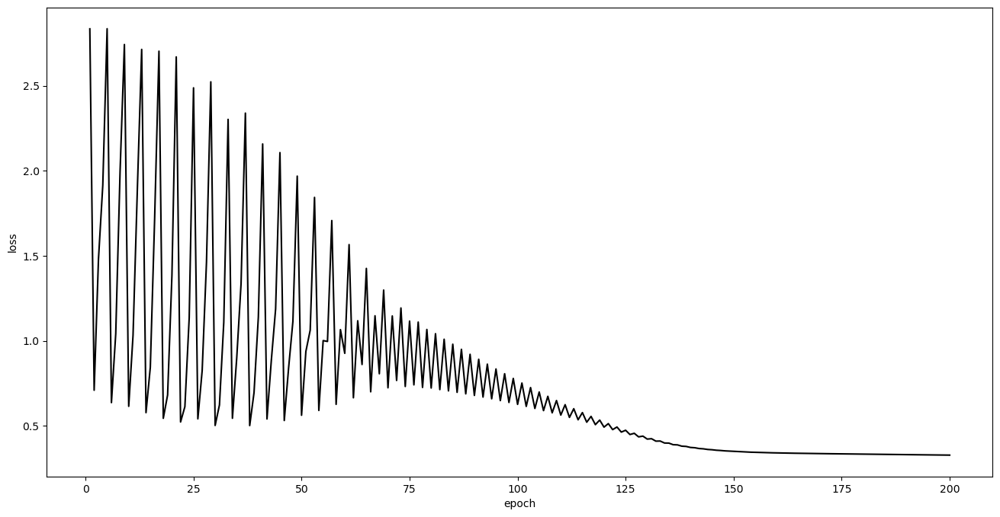

# Pytorch logistic regression

## 1. Fire up


```python
import torch
from torch.autograd import Variable
import torch.nn as nn
import numpy as np
import pandas as pd
import matplotlib.pyplot as plt
from sklearn.metrics import accuracy_score
```

## 2. Data generating


```python
from sklearn.datasets import load_breast_cancer
```


```python
data = load_breast_cancer()
```


```python
X = data.data # extract target
y = data.target.reshape(-1, 1) # extract label
```

`reshape(-1, 1)`将目标变量从一维数组转换为二维数组的列向量形式,是NumPy数组的一种形状变换操作。它的作用是将数组从原始形状转换为新的形状，其中的 -1 表示自动推断维度大小。

这样处理是因为在scikit-learn中，目标变量通常需要是一个二维数组的列向量，其中每行对应一个样本的标签。

具体地，`reshape(-1, 1)`会将数组的第一个维度设为自动推断的值，而将第二个维度设为1。这样的操作实际上是将原始数组转换为一个列向量，其中每个元素独立占据一行。

举个例子，假设有一个一维数组 `arr = [1, 2, 3, 4, 5]`，通过 `arr.reshape(-1, 1)` 操作，可以得到一个列向量：

```
[[1],
 [2],
 [3],
 [4],
 [5]]
```


```python
print(X.shape) # 569个30维向量
print(y.shape) # 569个1维向量
```

    (569, 30)
    (569, 1)


```python
# 将数组或矩阵进行切片操作，用于将数据集分割为训练集和测试集
X_train = X[:500,:] # 对矩阵X进行切片，选择第0行到第499行（共500行）的所有列，即选取X的前500行作为训练集
y_train = y[:500,:]

X_test = X[500:,:] # 对矩阵X进行切片，选择从第500行开始到最后一行的所有列，即选取X的第500行及以后的所有行作为测试集
y_test = y[500:,:]
```

在这里，`:`表示选取所有元素的范围，用于指定切片的起始和结束位置，如`a[:500]`表示选取数组a的前500个元素。

对于二维数组或矩阵，可以使用`:`对行和列同时进行切片操作，如`a[:500, :]`表示选取前500行的所有列。


```python
# 将 NumPy 数组转换为 Pandas DataFrame 对象
training_X = pd.DataFrame(X_train)
training_y = pd.DataFrame(y_train)
test_X = pd.DataFrame(X_test)
test_y = pd.DataFrame(y_test)
```

DataFrame类似于表格或电子表格，可以存储和操作二维数据。

这样做的目的可能是为了方便后续使用 Pandas 提供的数据分析和处理功能，比如进行数据预处理、特征工程、模型训练等。

Pandas 的 DataFrame 提供了更多灵活的数据操作和分析方法，能够更方便地处理和探索数据。


```python
training_X
```


<div>
<style scoped>
    .dataframe tbody tr th:only-of-type {
        vertical-align: middle;
    }

    .dataframe tbody tr th {
        vertical-align: top;
    }

    .dataframe thead th {
        text-align: right;
    }
</style>
<table border="1" class="dataframe">
  <thead>
    <tr style="text-align: right;">
      <th></th>
      <th>0</th>
      <th>1</th>
      <th>2</th>
      <th>3</th>
      <th>4</th>
      <th>5</th>
      <th>6</th>
      <th>7</th>
      <th>8</th>
      <th>9</th>
      <th>...</th>
      <th>20</th>
      <th>21</th>
      <th>22</th>
      <th>23</th>
      <th>24</th>
      <th>25</th>
      <th>26</th>
      <th>27</th>
      <th>28</th>
      <th>29</th>
    </tr>
  </thead>
  <tbody>
    <tr>
      <th>0</th>
      <td>17.99</td>
      <td>10.38</td>
      <td>122.80</td>
      <td>1001.0</td>
      <td>0.11840</td>
      <td>0.27760</td>
      <td>0.30010</td>
      <td>0.14710</td>
      <td>0.2419</td>
      <td>0.07871</td>
      <td>...</td>
      <td>25.38</td>
      <td>17.33</td>
      <td>184.60</td>
      <td>2019.0</td>
      <td>0.1622</td>
      <td>0.6656</td>
      <td>0.7119</td>
      <td>0.2654</td>
      <td>0.4601</td>
      <td>0.11890</td>
    </tr>
    <tr>
      <th>1</th>
      <td>20.57</td>
      <td>17.77</td>
      <td>132.90</td>
      <td>1326.0</td>
      <td>0.08474</td>
      <td>0.07864</td>
      <td>0.08690</td>
      <td>0.07017</td>
      <td>0.1812</td>
      <td>0.05667</td>
      <td>...</td>
      <td>24.99</td>
      <td>23.41</td>
      <td>158.80</td>
      <td>1956.0</td>
      <td>0.1238</td>
      <td>0.1866</td>
      <td>0.2416</td>
      <td>0.1860</td>
      <td>0.2750</td>
      <td>0.08902</td>
    </tr>
    <tr>
      <th>2</th>
      <td>19.69</td>
      <td>21.25</td>
      <td>130.00</td>
      <td>1203.0</td>
      <td>0.10960</td>
      <td>0.15990</td>
      <td>0.19740</td>
      <td>0.12790</td>
      <td>0.2069</td>
      <td>0.05999</td>
      <td>...</td>
      <td>23.57</td>
      <td>25.53</td>
      <td>152.50</td>
      <td>1709.0</td>
      <td>0.1444</td>
      <td>0.4245</td>
      <td>0.4504</td>
      <td>0.2430</td>
      <td>0.3613</td>
      <td>0.08758</td>
    </tr>
    <tr>
      <th>3</th>
      <td>11.42</td>
      <td>20.38</td>
      <td>77.58</td>
      <td>386.1</td>
      <td>0.14250</td>
      <td>0.28390</td>
      <td>0.24140</td>
      <td>0.10520</td>
      <td>0.2597</td>
      <td>0.09744</td>
      <td>...</td>
      <td>14.91</td>
      <td>26.50</td>
      <td>98.87</td>
      <td>567.7</td>
      <td>0.2098</td>
      <td>0.8663</td>
      <td>0.6869</td>
      <td>0.2575</td>
      <td>0.6638</td>
      <td>0.17300</td>
    </tr>
    <tr>
      <th>4</th>
      <td>20.29</td>
      <td>14.34</td>
      <td>135.10</td>
      <td>1297.0</td>
      <td>0.10030</td>
      <td>0.13280</td>
      <td>0.19800</td>
      <td>0.10430</td>
      <td>0.1809</td>
      <td>0.05883</td>
      <td>...</td>
      <td>22.54</td>
      <td>16.67</td>
      <td>152.20</td>
      <td>1575.0</td>
      <td>0.1374</td>
      <td>0.2050</td>
      <td>0.4000</td>
      <td>0.1625</td>
      <td>0.2364</td>
      <td>0.07678</td>
    </tr>
    <tr>
      <th>...</th>
      <td>...</td>
      <td>...</td>
      <td>...</td>
      <td>...</td>
      <td>...</td>
      <td>...</td>
      <td>...</td>
      <td>...</td>
      <td>...</td>
      <td>...</td>
      <td>...</td>
      <td>...</td>
      <td>...</td>
      <td>...</td>
      <td>...</td>
      <td>...</td>
      <td>...</td>
      <td>...</td>
      <td>...</td>
      <td>...</td>
      <td>...</td>
    </tr>
    <tr>
      <th>495</th>
      <td>14.87</td>
      <td>20.21</td>
      <td>96.12</td>
      <td>680.9</td>
      <td>0.09587</td>
      <td>0.08345</td>
      <td>0.06824</td>
      <td>0.04951</td>
      <td>0.1487</td>
      <td>0.05748</td>
      <td>...</td>
      <td>16.01</td>
      <td>28.48</td>
      <td>103.90</td>
      <td>783.6</td>
      <td>0.1216</td>
      <td>0.1388</td>
      <td>0.1700</td>
      <td>0.1017</td>
      <td>0.2369</td>
      <td>0.06599</td>
    </tr>
    <tr>
      <th>496</th>
      <td>12.65</td>
      <td>18.17</td>
      <td>82.69</td>
      <td>485.6</td>
      <td>0.10760</td>
      <td>0.13340</td>
      <td>0.08017</td>
      <td>0.05074</td>
      <td>0.1641</td>
      <td>0.06854</td>
      <td>...</td>
      <td>14.38</td>
      <td>22.15</td>
      <td>95.29</td>
      <td>633.7</td>
      <td>0.1533</td>
      <td>0.3842</td>
      <td>0.3582</td>
      <td>0.1407</td>
      <td>0.3230</td>
      <td>0.10330</td>
    </tr>
    <tr>
      <th>497</th>
      <td>12.47</td>
      <td>17.31</td>
      <td>80.45</td>
      <td>480.1</td>
      <td>0.08928</td>
      <td>0.07630</td>
      <td>0.03609</td>
      <td>0.02369</td>
      <td>0.1526</td>
      <td>0.06046</td>
      <td>...</td>
      <td>14.06</td>
      <td>24.34</td>
      <td>92.82</td>
      <td>607.3</td>
      <td>0.1276</td>
      <td>0.2506</td>
      <td>0.2028</td>
      <td>0.1053</td>
      <td>0.3035</td>
      <td>0.07661</td>
    </tr>
    <tr>
      <th>498</th>
      <td>18.49</td>
      <td>17.52</td>
      <td>121.30</td>
      <td>1068.0</td>
      <td>0.10120</td>
      <td>0.13170</td>
      <td>0.14910</td>
      <td>0.09183</td>
      <td>0.1832</td>
      <td>0.06697</td>
      <td>...</td>
      <td>22.75</td>
      <td>22.88</td>
      <td>146.40</td>
      <td>1600.0</td>
      <td>0.1412</td>
      <td>0.3089</td>
      <td>0.3533</td>
      <td>0.1663</td>
      <td>0.2510</td>
      <td>0.09445</td>
    </tr>
    <tr>
      <th>499</th>
      <td>20.59</td>
      <td>21.24</td>
      <td>137.80</td>
      <td>1320.0</td>
      <td>0.10850</td>
      <td>0.16440</td>
      <td>0.21880</td>
      <td>0.11210</td>
      <td>0.1848</td>
      <td>0.06222</td>
      <td>...</td>
      <td>23.86</td>
      <td>30.76</td>
      <td>163.20</td>
      <td>1760.0</td>
      <td>0.1464</td>
      <td>0.3597</td>
      <td>0.5179</td>
      <td>0.2113</td>
      <td>0.2480</td>
      <td>0.08999</td>
    </tr>
  </tbody>
</table>
<p>500 rows × 30 columns</p>
</div>


```python
test_X
```


<div>
<style scoped>
    .dataframe tbody tr th:only-of-type {
        vertical-align: middle;
    }

    .dataframe tbody tr th {
        vertical-align: top;
    }

    .dataframe thead th {
        text-align: right;
    }
</style>
<table border="1" class="dataframe">
  <thead>
    <tr style="text-align: right;">
      <th></th>
      <th>0</th>
      <th>1</th>
      <th>2</th>
      <th>3</th>
      <th>4</th>
      <th>5</th>
      <th>6</th>
      <th>7</th>
      <th>8</th>
      <th>9</th>
      <th>...</th>
      <th>20</th>
      <th>21</th>
      <th>22</th>
      <th>23</th>
      <th>24</th>
      <th>25</th>
      <th>26</th>
      <th>27</th>
      <th>28</th>
      <th>29</th>
    </tr>
  </thead>
  <tbody>
    <tr>
      <th>0</th>
      <td>15.040</td>
      <td>16.74</td>
      <td>98.73</td>
      <td>689.4</td>
      <td>0.09883</td>
      <td>0.13640</td>
      <td>0.07721</td>
      <td>0.06142</td>
      <td>0.1668</td>
      <td>0.06869</td>
      <td>...</td>
      <td>16.760</td>
      <td>20.43</td>
      <td>109.70</td>
      <td>856.9</td>
      <td>0.11350</td>
      <td>0.21760</td>
      <td>0.1856</td>
      <td>0.10180</td>
      <td>0.2177</td>
      <td>0.08549</td>
    </tr>
    <tr>
      <th>1</th>
      <td>13.820</td>
      <td>24.49</td>
      <td>92.33</td>
      <td>595.9</td>
      <td>0.11620</td>
      <td>0.16810</td>
      <td>0.13570</td>
      <td>0.06759</td>
      <td>0.2275</td>
      <td>0.07237</td>
      <td>...</td>
      <td>16.010</td>
      <td>32.94</td>
      <td>106.00</td>
      <td>788.0</td>
      <td>0.17940</td>
      <td>0.39660</td>
      <td>0.3381</td>
      <td>0.15210</td>
      <td>0.3651</td>
      <td>0.11830</td>
    </tr>
    <tr>
      <th>2</th>
      <td>12.540</td>
      <td>16.32</td>
      <td>81.25</td>
      <td>476.3</td>
      <td>0.11580</td>
      <td>0.10850</td>
      <td>0.05928</td>
      <td>0.03279</td>
      <td>0.1943</td>
      <td>0.06612</td>
      <td>...</td>
      <td>13.570</td>
      <td>21.40</td>
      <td>86.67</td>
      <td>552.0</td>
      <td>0.15800</td>
      <td>0.17510</td>
      <td>0.1889</td>
      <td>0.08411</td>
      <td>0.3155</td>
      <td>0.07538</td>
    </tr>
    <tr>
      <th>3</th>
      <td>23.090</td>
      <td>19.83</td>
      <td>152.10</td>
      <td>1682.0</td>
      <td>0.09342</td>
      <td>0.12750</td>
      <td>0.16760</td>
      <td>0.10030</td>
      <td>0.1505</td>
      <td>0.05484</td>
      <td>...</td>
      <td>30.790</td>
      <td>23.87</td>
      <td>211.50</td>
      <td>2782.0</td>
      <td>0.11990</td>
      <td>0.36250</td>
      <td>0.3794</td>
      <td>0.22640</td>
      <td>0.2908</td>
      <td>0.07277</td>
    </tr>
    <tr>
      <th>4</th>
      <td>9.268</td>
      <td>12.87</td>
      <td>61.49</td>
      <td>248.7</td>
      <td>0.16340</td>
      <td>0.22390</td>
      <td>0.09730</td>
      <td>0.05252</td>
      <td>0.2378</td>
      <td>0.09502</td>
      <td>...</td>
      <td>10.280</td>
      <td>16.38</td>
      <td>69.05</td>
      <td>300.2</td>
      <td>0.19020</td>
      <td>0.34410</td>
      <td>0.2099</td>
      <td>0.10250</td>
      <td>0.3038</td>
      <td>0.12520</td>
    </tr>
    <tr>
      <th>...</th>
      <td>...</td>
      <td>...</td>
      <td>...</td>
      <td>...</td>
      <td>...</td>
      <td>...</td>
      <td>...</td>
      <td>...</td>
      <td>...</td>
      <td>...</td>
      <td>...</td>
      <td>...</td>
      <td>...</td>
      <td>...</td>
      <td>...</td>
      <td>...</td>
      <td>...</td>
      <td>...</td>
      <td>...</td>
      <td>...</td>
      <td>...</td>
    </tr>
    <tr>
      <th>64</th>
      <td>21.560</td>
      <td>22.39</td>
      <td>142.00</td>
      <td>1479.0</td>
      <td>0.11100</td>
      <td>0.11590</td>
      <td>0.24390</td>
      <td>0.13890</td>
      <td>0.1726</td>
      <td>0.05623</td>
      <td>...</td>
      <td>25.450</td>
      <td>26.40</td>
      <td>166.10</td>
      <td>2027.0</td>
      <td>0.14100</td>
      <td>0.21130</td>
      <td>0.4107</td>
      <td>0.22160</td>
      <td>0.2060</td>
      <td>0.07115</td>
    </tr>
    <tr>
      <th>65</th>
      <td>20.130</td>
      <td>28.25</td>
      <td>131.20</td>
      <td>1261.0</td>
      <td>0.09780</td>
      <td>0.10340</td>
      <td>0.14400</td>
      <td>0.09791</td>
      <td>0.1752</td>
      <td>0.05533</td>
      <td>...</td>
      <td>23.690</td>
      <td>38.25</td>
      <td>155.00</td>
      <td>1731.0</td>
      <td>0.11660</td>
      <td>0.19220</td>
      <td>0.3215</td>
      <td>0.16280</td>
      <td>0.2572</td>
      <td>0.06637</td>
    </tr>
    <tr>
      <th>66</th>
      <td>16.600</td>
      <td>28.08</td>
      <td>108.30</td>
      <td>858.1</td>
      <td>0.08455</td>
      <td>0.10230</td>
      <td>0.09251</td>
      <td>0.05302</td>
      <td>0.1590</td>
      <td>0.05648</td>
      <td>...</td>
      <td>18.980</td>
      <td>34.12</td>
      <td>126.70</td>
      <td>1124.0</td>
      <td>0.11390</td>
      <td>0.30940</td>
      <td>0.3403</td>
      <td>0.14180</td>
      <td>0.2218</td>
      <td>0.07820</td>
    </tr>
    <tr>
      <th>67</th>
      <td>20.600</td>
      <td>29.33</td>
      <td>140.10</td>
      <td>1265.0</td>
      <td>0.11780</td>
      <td>0.27700</td>
      <td>0.35140</td>
      <td>0.15200</td>
      <td>0.2397</td>
      <td>0.07016</td>
      <td>...</td>
      <td>25.740</td>
      <td>39.42</td>
      <td>184.60</td>
      <td>1821.0</td>
      <td>0.16500</td>
      <td>0.86810</td>
      <td>0.9387</td>
      <td>0.26500</td>
      <td>0.4087</td>
      <td>0.12400</td>
    </tr>
    <tr>
      <th>68</th>
      <td>7.760</td>
      <td>24.54</td>
      <td>47.92</td>
      <td>181.0</td>
      <td>0.05263</td>
      <td>0.04362</td>
      <td>0.00000</td>
      <td>0.00000</td>
      <td>0.1587</td>
      <td>0.05884</td>
      <td>...</td>
      <td>9.456</td>
      <td>30.37</td>
      <td>59.16</td>
      <td>268.6</td>
      <td>0.08996</td>
      <td>0.06444</td>
      <td>0.0000</td>
      <td>0.00000</td>
      <td>0.2871</td>
      <td>0.07039</td>
    </tr>
  </tbody>
</table>
<p>69 rows × 30 columns</p>
</div>


## 3. Model training

$$\vec{x}\in\mathbb{R}^{1\times 30}$$

$$W\in\mathbb{R}^{30\times 1}$$

$$b\in\mathbb{R}$$

$$z = \vec{x}W+b$$

$$\hat{y} = \sigma(z) = \frac{1}{1+e^{-z}}$$

***
**Cross Entropy Loss Function**

$$Loss(W，b) = -\frac{1}{N}\sum_{i = 1}^{N}[y_i\log\hat{y_i} + (1 - y_i)\log (1-\hat{y_i})]$$

***
$$k = 0,1,2,...$$

$$W^{(k+1)}= W^{(k)} - \alpha_k\frac{\partial Loss (W^{(k)}, b^{(k)})}{\partial W}$$

$$b^{(k+1)}= b^{(k)} - \alpha_k\frac{\partial Loss (W^{(k)}, b^{(k)})}{\partial b}$$


```python
# 使用 PyTorch 定义了两个可训练的变量（参数）：W 和 b
W = torch.tensor(np.zeros((30, 1)), dtype = torch.float32, requires_grad = True)
b = torch.tensor(np.array([0]), dtype = torch.float32, requires_grad = True)
```

使用 `torch.tensor` 创建张量，并传入 `np.zeros((30, 1))` 来初始化权重 W，表示一个大小为 30x1 的全零张量。

使用 `dtype=torch.float32` 设置张量的数据类型为 float32。

设置 `requires_grad = True`，以便在计算中跟踪并计算梯度。

注意：在新版本的 PyTorch 中，`Variable` 被废弃了，直接使用 `torch.tensor` 创建张量即可。


```python
print("Initial value of w =", W.T)
print("---------------------------------------------------------")
print("Initial value of b =", b)
```

    Initial value of w = tensor([[0., 0., 0., 0., 0., 0., 0., 0., 0., 0., 0., 0., 0., 0., 0., 0., 0., 0., 0., 0., 0., 0., 0., 0.,
             0., 0., 0., 0., 0., 0.]], grad_fn=<PermuteBackward0>)
    ---------------------------------------------------------
    Initial value of b = tensor([0.], requires_grad=True)


```python
# 将 training_X 和 training_y 向量化（vertorization）处理
X_vec = torch.tensor(training_X.values, dtype=torch.float32)  # N*30
y_vec = torch.tensor(training_y.values, dtype=torch.float32).reshape(-1, 1)  # N*1
```

使用 `torch.tensor` 创建张量，并传入 `training_X.values` 将 `training_X` 转换为张量 `X_vec`，数据类型设置为 float32。

使用 `torch.tensor` 创建张量，并传入 `training_y.values` 将 `training_y` 转换为张量 `y_vec`，数据类型设置为 float32，并使用 `reshape(-1, 1)` 将其形状改为 `N*1`，其中 N 表示样本数量。


```python
X_vec.shape
```


    torch.Size([500, 30])


```python
y_vec.shape
```


    torch.Size([500, 1])


```python
Iter_times = 100000 # 迭代次数
alpha = 0.000015 # 设置初始学习率
loss_list = [] # 储存每一次迭代后的损失函数（如果递减，说明梯度下降是成功的）

for i in range(Iter_times):
    z = torch.mm(X_vec, w) + b # mm：矩阵乘法，500*1
    y_hat = torch.sigmoid(z) # 500*1
    
    # 交叉熵损失函数
    loss_vec = -(y_vec * torch.log(y_hat) + (1.0 - y_vec) * torch.log (1.0 - y_hat))
    loss = torch.mean(loss_vec) # 取平均
    
    # 求导
    loss.backward()
    
    # 获取梯度
    grad_w = w.grad.data
    grad_b = b.grad.data
    
    # 学习率
    alpha_temp = alpha / (1 + 0.001 * i)
    
    # 用alpha调整梯度
    w.data = w.data - alpha_temp * grad_w
    b.data = b.data - alpha_temp * grad_b
     
    # 开始下次梯度之前要清零（否则会不收敛）
    w.grad.data.zero_()
    b.grad.data.zero_()
    
    # 输出
    print(i + 1, "iterations have been completed!")
    print("      -> Now w1 =", w[0,0])
    print("      -> Now w2 =", w[1,0])
    print("      -> Now b =", b[0])
    print("      -> Now Loss =", loss)
    print("---------------------------------------------------------")
    
    loss_list.append(loss)
    length = len(loss_list)

    # 当损失函数的变化 < 10^-5 时，认为模型已经收敛到一个较好的解，无需继续迭代
    if(torch.abs(loss_list[length - 1] - loss_list[length - 2]) < 10 ** (-5) and length >= 2):
        break
```

    1 iterations have been completed!
          -> Now w1 = tensor(0.0001, grad_fn=<SelectBackward0>)
          -> Now w2 = tensor(0.0002, grad_fn=<SelectBackward0>)
          -> Now b = tensor(1.2350e-05, grad_fn=<SelectBackward0>)
          -> Now Loss = tensor(2.8345, grad_fn=<MeanBackward0>)
    ---------------------------------------------------------
    2 iterations have been completed!
          -> Now w1 = tensor(8.6309e-05, grad_fn=<SelectBackward0>)
          -> Now w2 = tensor(0.0002, grad_fn=<SelectBackward0>)
          -> Now b = tensor(1.2469e-05, grad_fn=<SelectBackward0>)
          -> Now Loss = tensor(0.7095, grad_fn=<MeanBackward0>)
    ---------------------------------------------------------
    3 iterations have been completed!
          -> Now w1 = tensor(0.0002, grad_fn=<SelectBackward0>)
          -> Now w2 = tensor(0.0003, grad_fn=<SelectBackward0>)
          -> Now b = tensor(2.0564e-05, grad_fn=<SelectBackward0>)
          -> Now Loss = tensor(1.4803, grad_fn=<MeanBackward0>)
    ---------------------------------------------------------
    4 iterations have been completed!
          -> Now w1 = tensor(9.7714e-05, grad_fn=<SelectBackward0>)
          -> Now w2 = tensor(0.0002, grad_fn=<SelectBackward0>)
          -> Now b = tensor(1.5858e-05, grad_fn=<SelectBackward0>)
          -> Now Loss = tensor(1.9152, grad_fn=<MeanBackward0>)
    ---------------------------------------------------------
    5 iterations have been completed!
          -> Now w1 = tensor(0.0002, grad_fn=<SelectBackward0>)
          -> Now w2 = tensor(0.0004, grad_fn=<SelectBackward0>)
          -> Now b = tensor(2.4791e-05, grad_fn=<SelectBackward0>)
          -> Now Loss = tensor(2.8352, grad_fn=<MeanBackward0>)
    ---------------------------------------------------------
    6 iterations have been completed!
          -> Now w1 = tensor(0.0002, grad_fn=<SelectBackward0>)
          -> Now w2 = tensor(0.0004, grad_fn=<SelectBackward0>)
          -> Now b = tensor(2.5471e-05, grad_fn=<SelectBackward0>)
          -> Now Loss = tensor(0.6368, grad_fn=<MeanBackward0>)
    ---------------------------------------------------------
    7 iterations have been completed!
          -> Now w1 = tensor(0.0003, grad_fn=<SelectBackward0>)
          -> Now w2 = tensor(0.0005, grad_fn=<SelectBackward0>)
          -> Now b = tensor(3.2530e-05, grad_fn=<SelectBackward0>)
          -> Now Loss = tensor(1.0426, grad_fn=<MeanBackward0>)
    ---------------------------------------------------------
    8 iterations have been completed!
          -> Now w1 = tensor(0.0002, grad_fn=<SelectBackward0>)
          -> Now w2 = tensor(0.0004, grad_fn=<SelectBackward0>)
          -> Now b = tensor(2.7652e-05, grad_fn=<SelectBackward0>)
          -> Now Loss = tensor(1.9973, grad_fn=<MeanBackward0>)
    ---------------------------------------------------------
    9 iterations have been completed!
          -> Now w1 = tensor(0.0003, grad_fn=<SelectBackward0>)
          -> Now w2 = tensor(0.0005, grad_fn=<SelectBackward0>)
          -> Now b = tensor(3.6527e-05, grad_fn=<SelectBackward0>)
          -> Now Loss = tensor(2.7423, grad_fn=<MeanBackward0>)
    ---------------------------------------------------------
    10 iterations have been completed!
          -> Now w1 = tensor(0.0003, grad_fn=<SelectBackward0>)
          -> Now w2 = tensor(0.0005, grad_fn=<SelectBackward0>)
          -> Now b = tensor(3.6926e-05, grad_fn=<SelectBackward0>)
          -> Now Loss = tensor(0.6151, grad_fn=<MeanBackward0>)
    ---------------------------------------------------------
    11 iterations have been completed!
          -> Now w1 = tensor(0.0004, grad_fn=<SelectBackward0>)
          -> Now w2 = tensor(0.0007, grad_fn=<SelectBackward0>)
          -> Now b = tensor(4.3940e-05, grad_fn=<SelectBackward0>)
          -> Now Loss = tensor(1.0319, grad_fn=<MeanBackward0>)
    ---------------------------------------------------------
    12 iterations have been completed!
          -> Now w1 = tensor(0.0003, grad_fn=<SelectBackward0>)
          -> Now w2 = tensor(0.0005, grad_fn=<SelectBackward0>)
          -> Now b = tensor(3.9090e-05, grad_fn=<SelectBackward0>)
          -> Now Loss = tensor(1.8925, grad_fn=<MeanBackward0>)
    ---------------------------------------------------------
    13 iterations have been completed!
          -> Now w1 = tensor(0.0004, grad_fn=<SelectBackward0>)
          -> Now w2 = tensor(0.0007, grad_fn=<SelectBackward0>)
          -> Now b = tensor(4.7919e-05, grad_fn=<SelectBackward0>)
          -> Now Loss = tensor(2.7136, grad_fn=<MeanBackward0>)
    ---------------------------------------------------------
    14 iterations have been completed!
          -> Now w1 = tensor(0.0004, grad_fn=<SelectBackward0>)
          -> Now w2 = tensor(0.0007, grad_fn=<SelectBackward0>)
          -> Now b = tensor(4.8531e-05, grad_fn=<SelectBackward0>)
          -> Now Loss = tensor(0.5777, grad_fn=<MeanBackward0>)
    ---------------------------------------------------------
    15 iterations have been completed!
          -> Now w1 = tensor(0.0005, grad_fn=<SelectBackward0>)
          -> Now w2 = tensor(0.0008, grad_fn=<SelectBackward0>)
          -> Now b = tensor(5.4751e-05, grad_fn=<SelectBackward0>)
          -> Now Loss = tensor(0.8452, grad_fn=<MeanBackward0>)
    ---------------------------------------------------------
    16 iterations have been completed!
          -> Now w1 = tensor(0.0004, grad_fn=<SelectBackward0>)
          -> Now w2 = tensor(0.0007, grad_fn=<SelectBackward0>)
          -> Now b = tensor(5.0012e-05, grad_fn=<SelectBackward0>)
          -> Now Loss = tensor(1.7197, grad_fn=<MeanBackward0>)
    ---------------------------------------------------------
    17 iterations have been completed!
          -> Now w1 = tensor(0.0005, grad_fn=<SelectBackward0>)
          -> Now w2 = tensor(0.0009, grad_fn=<SelectBackward0>)
          -> Now b = tensor(5.8802e-05, grad_fn=<SelectBackward0>)
          -> Now Loss = tensor(2.7031, grad_fn=<MeanBackward0>)
    ---------------------------------------------------------
    18 iterations have been completed!
          -> Now w1 = tensor(0.0005, grad_fn=<SelectBackward0>)
          -> Now w2 = tensor(0.0009, grad_fn=<SelectBackward0>)
          -> Now b = tensor(5.9709e-05, grad_fn=<SelectBackward0>)
          -> Now Loss = tensor(0.5445, grad_fn=<MeanBackward0>)
    ---------------------------------------------------------
    19 iterations have been completed!
          -> Now w1 = tensor(0.0005, grad_fn=<SelectBackward0>)
          -> Now w2 = tensor(0.0010, grad_fn=<SelectBackward0>)
          -> Now b = tensor(6.4862e-05, grad_fn=<SelectBackward0>)
          -> Now Loss = tensor(0.6815, grad_fn=<MeanBackward0>)
    ---------------------------------------------------------
    20 iterations have been completed!
          -> Now w1 = tensor(0.0005, grad_fn=<SelectBackward0>)
          -> Now w2 = tensor(0.0009, grad_fn=<SelectBackward0>)
          -> Now b = tensor(6.0524e-05, grad_fn=<SelectBackward0>)
          -> Now Loss = tensor(1.3842, grad_fn=<MeanBackward0>)
    ---------------------------------------------------------
    21 iterations have been completed!
          -> Now w1 = tensor(0.0006, grad_fn=<SelectBackward0>)
          -> Now w2 = tensor(0.0010, grad_fn=<SelectBackward0>)
          -> Now b = tensor(6.9268e-05, grad_fn=<SelectBackward0>)
          -> Now Loss = tensor(2.6696, grad_fn=<MeanBackward0>)
    ---------------------------------------------------------
    22 iterations have been completed!
          -> Now w1 = tensor(0.0006, grad_fn=<SelectBackward0>)
          -> Now w2 = tensor(0.0010, grad_fn=<SelectBackward0>)
          -> Now b = tensor(7.0253e-05, grad_fn=<SelectBackward0>)
          -> Now Loss = tensor(0.5230, grad_fn=<MeanBackward0>)
    ---------------------------------------------------------
    23 iterations have been completed!
          -> Now w1 = tensor(0.0006, grad_fn=<SelectBackward0>)
          -> Now w2 = tensor(0.0011, grad_fn=<SelectBackward0>)
          -> Now b = tensor(7.4795e-05, grad_fn=<SelectBackward0>)
          -> Now Loss = tensor(0.6129, grad_fn=<MeanBackward0>)
    ---------------------------------------------------------
    24 iterations have been completed!
          -> Now w1 = tensor(0.0006, grad_fn=<SelectBackward0>)
          -> Now w2 = tensor(0.0010, grad_fn=<SelectBackward0>)
          -> Now b = tensor(7.0936e-05, grad_fn=<SelectBackward0>)
          -> Now Loss = tensor(1.1365, grad_fn=<MeanBackward0>)
    ---------------------------------------------------------
    25 iterations have been completed!
          -> Now w1 = tensor(0.0007, grad_fn=<SelectBackward0>)
          -> Now w2 = tensor(0.0012, grad_fn=<SelectBackward0>)
          -> Now b = tensor(7.9587e-05, grad_fn=<SelectBackward0>)
          -> Now Loss = tensor(2.4876, grad_fn=<MeanBackward0>)
    ---------------------------------------------------------
    26 iterations have been completed!
          -> Now w1 = tensor(0.0006, grad_fn=<SelectBackward0>)
          -> Now w2 = tensor(0.0012, grad_fn=<SelectBackward0>)
          -> Now b = tensor(7.9610e-05, grad_fn=<SelectBackward0>)
          -> Now Loss = tensor(0.5413, grad_fn=<MeanBackward0>)
    ---------------------------------------------------------
    27 iterations have been completed!
          -> Now w1 = tensor(0.0007, grad_fn=<SelectBackward0>)
          -> Now w2 = tensor(0.0013, grad_fn=<SelectBackward0>)
          -> Now b = tensor(8.5724e-05, grad_fn=<SelectBackward0>)
          -> Now Loss = tensor(0.8255, grad_fn=<MeanBackward0>)
    ---------------------------------------------------------
    28 iterations have been completed!
          -> Now w1 = tensor(0.0006, grad_fn=<SelectBackward0>)
          -> Now w2 = tensor(0.0012, grad_fn=<SelectBackward0>)
          -> Now b = tensor(8.1163e-05, grad_fn=<SelectBackward0>)
          -> Now Loss = tensor(1.4633, grad_fn=<MeanBackward0>)
    ---------------------------------------------------------
    29 iterations have been completed!
          -> Now w1 = tensor(0.0007, grad_fn=<SelectBackward0>)
          -> Now w2 = tensor(0.0013, grad_fn=<SelectBackward0>)
          -> Now b = tensor(8.9789e-05, grad_fn=<SelectBackward0>)
          -> Now Loss = tensor(2.5229, grad_fn=<MeanBackward0>)
    ---------------------------------------------------------
    30 iterations have been completed!
          -> Now w1 = tensor(0.0007, grad_fn=<SelectBackward0>)
          -> Now w2 = tensor(0.0013, grad_fn=<SelectBackward0>)
          -> Now b = tensor(9.0345e-05, grad_fn=<SelectBackward0>)
          -> Now Loss = tensor(0.5025, grad_fn=<MeanBackward0>)
    ---------------------------------------------------------
    31 iterations have been completed!
          -> Now w1 = tensor(0.0008, grad_fn=<SelectBackward0>)
          -> Now w2 = tensor(0.0014, grad_fn=<SelectBackward0>)
          -> Now b = tensor(9.5107e-05, grad_fn=<SelectBackward0>)
          -> Now Loss = tensor(0.6230, grad_fn=<MeanBackward0>)
    ---------------------------------------------------------
    32 iterations have been completed!
          -> Now w1 = tensor(0.0007, grad_fn=<SelectBackward0>)
          -> Now w2 = tensor(0.0013, grad_fn=<SelectBackward0>)
          -> Now b = tensor(9.1218e-05, grad_fn=<SelectBackward0>)
          -> Now Loss = tensor(1.1088, grad_fn=<MeanBackward0>)
    ---------------------------------------------------------
    33 iterations have been completed!
          -> Now w1 = tensor(0.0008, grad_fn=<SelectBackward0>)
          -> Now w2 = tensor(0.0015, grad_fn=<SelectBackward0>)
          -> Now b = tensor(9.9724e-05, grad_fn=<SelectBackward0>)
          -> Now Loss = tensor(2.3022, grad_fn=<MeanBackward0>)
    ---------------------------------------------------------
    34 iterations have been completed!
          -> Now w1 = tensor(0.0008, grad_fn=<SelectBackward0>)
          -> Now w2 = tensor(0.0014, grad_fn=<SelectBackward0>)
          -> Now b = tensor(9.9157e-05, grad_fn=<SelectBackward0>)
          -> Now Loss = tensor(0.5447, grad_fn=<MeanBackward0>)
    ---------------------------------------------------------
    35 iterations have been completed!
          -> Now w1 = tensor(0.0009, grad_fn=<SelectBackward0>)
          -> Now w2 = tensor(0.0015, grad_fn=<SelectBackward0>)
          -> Now b = tensor(0.0001, grad_fn=<SelectBackward0>)
          -> Now Loss = tensor(0.9003, grad_fn=<MeanBackward0>)
    ---------------------------------------------------------
    36 iterations have been completed!
          -> Now w1 = tensor(0.0008, grad_fn=<SelectBackward0>)
          -> Now w2 = tensor(0.0014, grad_fn=<SelectBackward0>)
          -> Now b = tensor(0.0001, grad_fn=<SelectBackward0>)
          -> Now Loss = tensor(1.3358, grad_fn=<MeanBackward0>)
    ---------------------------------------------------------
    37 iterations have been completed!
          -> Now w1 = tensor(0.0009, grad_fn=<SelectBackward0>)
          -> Now w2 = tensor(0.0016, grad_fn=<SelectBackward0>)
          -> Now b = tensor(0.0001, grad_fn=<SelectBackward0>)
          -> Now Loss = tensor(2.3390, grad_fn=<MeanBackward0>)
    ---------------------------------------------------------
    38 iterations have been completed!
          -> Now w1 = tensor(0.0009, grad_fn=<SelectBackward0>)
          -> Now w2 = tensor(0.0016, grad_fn=<SelectBackward0>)
          -> Now b = tensor(0.0001, grad_fn=<SelectBackward0>)
          -> Now Loss = tensor(0.5018, grad_fn=<MeanBackward0>)
    ---------------------------------------------------------
    39 iterations have been completed!
          -> Now w1 = tensor(0.0010, grad_fn=<SelectBackward0>)
          -> Now w2 = tensor(0.0017, grad_fn=<SelectBackward0>)
          -> Now b = tensor(0.0001, grad_fn=<SelectBackward0>)
          -> Now Loss = tensor(0.6953, grad_fn=<MeanBackward0>)
    ---------------------------------------------------------
    40 iterations have been completed!
          -> Now w1 = tensor(0.0009, grad_fn=<SelectBackward0>)
          -> Now w2 = tensor(0.0016, grad_fn=<SelectBackward0>)
          -> Now b = tensor(0.0001, grad_fn=<SelectBackward0>)
          -> Now Loss = tensor(1.1394, grad_fn=<MeanBackward0>)
    ---------------------------------------------------------
    41 iterations have been completed!
          -> Now w1 = tensor(0.0010, grad_fn=<SelectBackward0>)
          -> Now w2 = tensor(0.0017, grad_fn=<SelectBackward0>)
          -> Now b = tensor(0.0001, grad_fn=<SelectBackward0>)
          -> Now Loss = tensor(2.1576, grad_fn=<MeanBackward0>)
    ---------------------------------------------------------
    42 iterations have been completed!
          -> Now w1 = tensor(0.0010, grad_fn=<SelectBackward0>)
          -> Now w2 = tensor(0.0017, grad_fn=<SelectBackward0>)
          -> Now b = tensor(0.0001, grad_fn=<SelectBackward0>)
          -> Now Loss = tensor(0.5405, grad_fn=<MeanBackward0>)
    ---------------------------------------------------------
    43 iterations have been completed!
          -> Now w1 = tensor(0.0010, grad_fn=<SelectBackward0>)
          -> Now w2 = tensor(0.0018, grad_fn=<SelectBackward0>)
          -> Now b = tensor(0.0001, grad_fn=<SelectBackward0>)
          -> Now Loss = tensor(0.8840, grad_fn=<MeanBackward0>)
    ---------------------------------------------------------
    44 iterations have been completed!
          -> Now w1 = tensor(0.0010, grad_fn=<SelectBackward0>)
          -> Now w2 = tensor(0.0017, grad_fn=<SelectBackward0>)
          -> Now b = tensor(0.0001, grad_fn=<SelectBackward0>)
          -> Now Loss = tensor(1.1882, grad_fn=<MeanBackward0>)
    ---------------------------------------------------------
    45 iterations have been completed!
          -> Now w1 = tensor(0.0011, grad_fn=<SelectBackward0>)
          -> Now w2 = tensor(0.0019, grad_fn=<SelectBackward0>)
          -> Now b = tensor(0.0001, grad_fn=<SelectBackward0>)
          -> Now Loss = tensor(2.1067, grad_fn=<MeanBackward0>)
    ---------------------------------------------------------
    46 iterations have been completed!
          -> Now w1 = tensor(0.0010, grad_fn=<SelectBackward0>)
          -> Now w2 = tensor(0.0018, grad_fn=<SelectBackward0>)
          -> Now b = tensor(0.0001, grad_fn=<SelectBackward0>)
          -> Now Loss = tensor(0.5315, grad_fn=<MeanBackward0>)
    ---------------------------------------------------------
    47 iterations have been completed!
          -> Now w1 = tensor(0.0011, grad_fn=<SelectBackward0>)
          -> Now w2 = tensor(0.0020, grad_fn=<SelectBackward0>)
          -> Now b = tensor(0.0001, grad_fn=<SelectBackward0>)
          -> Now Loss = tensor(0.8397, grad_fn=<MeanBackward0>)
    ---------------------------------------------------------
    48 iterations have been completed!
          -> Now w1 = tensor(0.0010, grad_fn=<SelectBackward0>)
          -> Now w2 = tensor(0.0019, grad_fn=<SelectBackward0>)
          -> Now b = tensor(0.0001, grad_fn=<SelectBackward0>)
          -> Now Loss = tensor(1.1149, grad_fn=<MeanBackward0>)
    ---------------------------------------------------------
    49 iterations have been completed!
          -> Now w1 = tensor(0.0011, grad_fn=<SelectBackward0>)
          -> Now w2 = tensor(0.0020, grad_fn=<SelectBackward0>)
          -> Now b = tensor(0.0001, grad_fn=<SelectBackward0>)
          -> Now Loss = tensor(1.9685, grad_fn=<MeanBackward0>)
    ---------------------------------------------------------
    50 iterations have been completed!
          -> Now w1 = tensor(0.0011, grad_fn=<SelectBackward0>)
          -> Now w2 = tensor(0.0020, grad_fn=<SelectBackward0>)
          -> Now b = tensor(0.0001, grad_fn=<SelectBackward0>)
          -> Now Loss = tensor(0.5624, grad_fn=<MeanBackward0>)
    ---------------------------------------------------------
    51 iterations have been completed!
          -> Now w1 = tensor(0.0012, grad_fn=<SelectBackward0>)
          -> Now w2 = tensor(0.0021, grad_fn=<SelectBackward0>)
          -> Now b = tensor(0.0001, grad_fn=<SelectBackward0>)
          -> Now Loss = tensor(0.9378, grad_fn=<MeanBackward0>)
    ---------------------------------------------------------
    52 iterations have been completed!
          -> Now w1 = tensor(0.0011, grad_fn=<SelectBackward0>)
          -> Now w2 = tensor(0.0020, grad_fn=<SelectBackward0>)
          -> Now b = tensor(0.0001, grad_fn=<SelectBackward0>)
          -> Now Loss = tensor(1.0626, grad_fn=<MeanBackward0>)
    ---------------------------------------------------------
    53 iterations have been completed!
          -> Now w1 = tensor(0.0012, grad_fn=<SelectBackward0>)
          -> Now w2 = tensor(0.0021, grad_fn=<SelectBackward0>)
          -> Now b = tensor(0.0001, grad_fn=<SelectBackward0>)
          -> Now Loss = tensor(1.8434, grad_fn=<MeanBackward0>)
    ---------------------------------------------------------
    54 iterations have been completed!
          -> Now w1 = tensor(0.0012, grad_fn=<SelectBackward0>)
          -> Now w2 = tensor(0.0021, grad_fn=<SelectBackward0>)
          -> Now b = tensor(0.0001, grad_fn=<SelectBackward0>)
          -> Now Loss = tensor(0.5908, grad_fn=<MeanBackward0>)
    ---------------------------------------------------------
    55 iterations have been completed!
          -> Now w1 = tensor(0.0013, grad_fn=<SelectBackward0>)
          -> Now w2 = tensor(0.0022, grad_fn=<SelectBackward0>)
          -> Now b = tensor(0.0002, grad_fn=<SelectBackward0>)
          -> Now Loss = tensor(1.0015, grad_fn=<MeanBackward0>)
    ---------------------------------------------------------
    56 iterations have been completed!
          -> Now w1 = tensor(0.0012, grad_fn=<SelectBackward0>)
          -> Now w2 = tensor(0.0021, grad_fn=<SelectBackward0>)
          -> Now b = tensor(0.0001, grad_fn=<SelectBackward0>)
          -> Now Loss = tensor(0.9963, grad_fn=<MeanBackward0>)
    ---------------------------------------------------------
    57 iterations have been completed!
          -> Now w1 = tensor(0.0013, grad_fn=<SelectBackward0>)
          -> Now w2 = tensor(0.0023, grad_fn=<SelectBackward0>)
          -> Now b = tensor(0.0002, grad_fn=<SelectBackward0>)
          -> Now Loss = tensor(1.7073, grad_fn=<MeanBackward0>)
    ---------------------------------------------------------
    58 iterations have been completed!
          -> Now w1 = tensor(0.0012, grad_fn=<SelectBackward0>)
          -> Now w2 = tensor(0.0022, grad_fn=<SelectBackward0>)
          -> Now b = tensor(0.0002, grad_fn=<SelectBackward0>)
          -> Now Loss = tensor(0.6266, grad_fn=<MeanBackward0>)
    ---------------------------------------------------------
    59 iterations have been completed!
          -> Now w1 = tensor(0.0013, grad_fn=<SelectBackward0>)
          -> Now w2 = tensor(0.0023, grad_fn=<SelectBackward0>)
          -> Now b = tensor(0.0002, grad_fn=<SelectBackward0>)
          -> Now Loss = tensor(1.0660, grad_fn=<MeanBackward0>)
    ---------------------------------------------------------
    60 iterations have been completed!
          -> Now w1 = tensor(0.0013, grad_fn=<SelectBackward0>)
          -> Now w2 = tensor(0.0023, grad_fn=<SelectBackward0>)
          -> Now b = tensor(0.0002, grad_fn=<SelectBackward0>)
          -> Now Loss = tensor(0.9267, grad_fn=<MeanBackward0>)
    ---------------------------------------------------------
    61 iterations have been completed!
          -> Now w1 = tensor(0.0014, grad_fn=<SelectBackward0>)
          -> Now w2 = tensor(0.0024, grad_fn=<SelectBackward0>)
          -> Now b = tensor(0.0002, grad_fn=<SelectBackward0>)
          -> Now Loss = tensor(1.5658, grad_fn=<MeanBackward0>)
    ---------------------------------------------------------
    62 iterations have been completed!
          -> Now w1 = tensor(0.0013, grad_fn=<SelectBackward0>)
          -> Now w2 = tensor(0.0023, grad_fn=<SelectBackward0>)
          -> Now b = tensor(0.0002, grad_fn=<SelectBackward0>)
          -> Now Loss = tensor(0.6652, grad_fn=<MeanBackward0>)
    ---------------------------------------------------------
    63 iterations have been completed!
          -> Now w1 = tensor(0.0014, grad_fn=<SelectBackward0>)
          -> Now w2 = tensor(0.0025, grad_fn=<SelectBackward0>)
          -> Now b = tensor(0.0002, grad_fn=<SelectBackward0>)
          -> Now Loss = tensor(1.1180, grad_fn=<MeanBackward0>)
    ---------------------------------------------------------
    64 iterations have been completed!
          -> Now w1 = tensor(0.0013, grad_fn=<SelectBackward0>)
          -> Now w2 = tensor(0.0024, grad_fn=<SelectBackward0>)
          -> Now b = tensor(0.0002, grad_fn=<SelectBackward0>)
          -> Now Loss = tensor(0.8610, grad_fn=<MeanBackward0>)
    ---------------------------------------------------------
    65 iterations have been completed!
          -> Now w1 = tensor(0.0014, grad_fn=<SelectBackward0>)
          -> Now w2 = tensor(0.0025, grad_fn=<SelectBackward0>)
          -> Now b = tensor(0.0002, grad_fn=<SelectBackward0>)
          -> Now Loss = tensor(1.4258, grad_fn=<MeanBackward0>)
    ---------------------------------------------------------
    66 iterations have been completed!
          -> Now w1 = tensor(0.0014, grad_fn=<SelectBackward0>)
          -> Now w2 = tensor(0.0025, grad_fn=<SelectBackward0>)
          -> Now b = tensor(0.0002, grad_fn=<SelectBackward0>)
          -> Now Loss = tensor(0.7004, grad_fn=<MeanBackward0>)
    ---------------------------------------------------------
    67 iterations have been completed!
          -> Now w1 = tensor(0.0015, grad_fn=<SelectBackward0>)
          -> Now w2 = tensor(0.0026, grad_fn=<SelectBackward0>)
          -> Now b = tensor(0.0002, grad_fn=<SelectBackward0>)
          -> Now Loss = tensor(1.1473, grad_fn=<MeanBackward0>)
    ---------------------------------------------------------
    68 iterations have been completed!
          -> Now w1 = tensor(0.0014, grad_fn=<SelectBackward0>)
          -> Now w2 = tensor(0.0025, grad_fn=<SelectBackward0>)
          -> Now b = tensor(0.0002, grad_fn=<SelectBackward0>)
          -> Now Loss = tensor(0.8065, grad_fn=<MeanBackward0>)
    ---------------------------------------------------------
    69 iterations have been completed!
          -> Now w1 = tensor(0.0015, grad_fn=<SelectBackward0>)
          -> Now w2 = tensor(0.0026, grad_fn=<SelectBackward0>)
          -> Now b = tensor(0.0002, grad_fn=<SelectBackward0>)
          -> Now Loss = tensor(1.2985, grad_fn=<MeanBackward0>)
    ---------------------------------------------------------
    70 iterations have been completed!
          -> Now w1 = tensor(0.0014, grad_fn=<SelectBackward0>)
          -> Now w2 = tensor(0.0026, grad_fn=<SelectBackward0>)
          -> Now b = tensor(0.0002, grad_fn=<SelectBackward0>)
          -> Now Loss = tensor(0.7239, grad_fn=<MeanBackward0>)
    ---------------------------------------------------------
    71 iterations have been completed!
          -> Now w1 = tensor(0.0015, grad_fn=<SelectBackward0>)
          -> Now w2 = tensor(0.0027, grad_fn=<SelectBackward0>)
          -> Now b = tensor(0.0002, grad_fn=<SelectBackward0>)
          -> Now Loss = tensor(1.1463, grad_fn=<MeanBackward0>)
    ---------------------------------------------------------
    72 iterations have been completed!
          -> Now w1 = tensor(0.0015, grad_fn=<SelectBackward0>)
          -> Now w2 = tensor(0.0026, grad_fn=<SelectBackward0>)
          -> Now b = tensor(0.0002, grad_fn=<SelectBackward0>)
          -> Now Loss = tensor(0.7671, grad_fn=<MeanBackward0>)
    ---------------------------------------------------------
    73 iterations have been completed!
          -> Now w1 = tensor(0.0016, grad_fn=<SelectBackward0>)
          -> Now w2 = tensor(0.0028, grad_fn=<SelectBackward0>)
          -> Now b = tensor(0.0002, grad_fn=<SelectBackward0>)
          -> Now Loss = tensor(1.1932, grad_fn=<MeanBackward0>)
    ---------------------------------------------------------
    74 iterations have been completed!
          -> Now w1 = tensor(0.0015, grad_fn=<SelectBackward0>)
          -> Now w2 = tensor(0.0027, grad_fn=<SelectBackward0>)
          -> Now b = tensor(0.0002, grad_fn=<SelectBackward0>)
          -> Now Loss = tensor(0.7316, grad_fn=<MeanBackward0>)
    ---------------------------------------------------------
    75 iterations have been completed!
          -> Now w1 = tensor(0.0016, grad_fn=<SelectBackward0>)
          -> Now w2 = tensor(0.0028, grad_fn=<SelectBackward0>)
          -> Now b = tensor(0.0002, grad_fn=<SelectBackward0>)
          -> Now Loss = tensor(1.1162, grad_fn=<MeanBackward0>)
    ---------------------------------------------------------
    76 iterations have been completed!
          -> Now w1 = tensor(0.0015, grad_fn=<SelectBackward0>)
          -> Now w2 = tensor(0.0028, grad_fn=<SelectBackward0>)
          -> Now b = tensor(0.0002, grad_fn=<SelectBackward0>)
          -> Now Loss = tensor(0.7412, grad_fn=<MeanBackward0>)
    ---------------------------------------------------------
    77 iterations have been completed!
          -> Now w1 = tensor(0.0016, grad_fn=<SelectBackward0>)
          -> Now w2 = tensor(0.0029, grad_fn=<SelectBackward0>)
          -> Now b = tensor(0.0002, grad_fn=<SelectBackward0>)
          -> Now Loss = tensor(1.1103, grad_fn=<MeanBackward0>)
    ---------------------------------------------------------
    78 iterations have been completed!
          -> Now w1 = tensor(0.0016, grad_fn=<SelectBackward0>)
          -> Now w2 = tensor(0.0028, grad_fn=<SelectBackward0>)
          -> Now b = tensor(0.0002, grad_fn=<SelectBackward0>)
          -> Now Loss = tensor(0.7261, grad_fn=<MeanBackward0>)
    ---------------------------------------------------------
    79 iterations have been completed!
          -> Now w1 = tensor(0.0017, grad_fn=<SelectBackward0>)
          -> Now w2 = tensor(0.0029, grad_fn=<SelectBackward0>)
          -> Now b = tensor(0.0002, grad_fn=<SelectBackward0>)
          -> Now Loss = tensor(1.0669, grad_fn=<MeanBackward0>)
    ---------------------------------------------------------
    80 iterations have been completed!
          -> Now w1 = tensor(0.0016, grad_fn=<SelectBackward0>)
          -> Now w2 = tensor(0.0029, grad_fn=<SelectBackward0>)
          -> Now b = tensor(0.0002, grad_fn=<SelectBackward0>)
          -> Now Loss = tensor(0.7225, grad_fn=<MeanBackward0>)
    ---------------------------------------------------------
    81 iterations have been completed!
          -> Now w1 = tensor(0.0017, grad_fn=<SelectBackward0>)
          -> Now w2 = tensor(0.0030, grad_fn=<SelectBackward0>)
          -> Now b = tensor(0.0002, grad_fn=<SelectBackward0>)
          -> Now Loss = tensor(1.0420, grad_fn=<MeanBackward0>)
    ---------------------------------------------------------
    82 iterations have been completed!
          -> Now w1 = tensor(0.0016, grad_fn=<SelectBackward0>)
          -> Now w2 = tensor(0.0029, grad_fn=<SelectBackward0>)
          -> Now b = tensor(0.0002, grad_fn=<SelectBackward0>)
          -> Now Loss = tensor(0.7133, grad_fn=<MeanBackward0>)
    ---------------------------------------------------------
    83 iterations have been completed!
          -> Now w1 = tensor(0.0017, grad_fn=<SelectBackward0>)
          -> Now w2 = tensor(0.0030, grad_fn=<SelectBackward0>)
          -> Now b = tensor(0.0002, grad_fn=<SelectBackward0>)
          -> Now Loss = tensor(1.0094, grad_fn=<MeanBackward0>)
    ---------------------------------------------------------
    84 iterations have been completed!
          -> Now w1 = tensor(0.0017, grad_fn=<SelectBackward0>)
          -> Now w2 = tensor(0.0030, grad_fn=<SelectBackward0>)
          -> Now b = tensor(0.0002, grad_fn=<SelectBackward0>)
          -> Now Loss = tensor(0.7058, grad_fn=<MeanBackward0>)
    ---------------------------------------------------------
    85 iterations have been completed!
          -> Now w1 = tensor(0.0017, grad_fn=<SelectBackward0>)
          -> Now w2 = tensor(0.0031, grad_fn=<SelectBackward0>)
          -> Now b = tensor(0.0002, grad_fn=<SelectBackward0>)
          -> Now Loss = tensor(0.9801, grad_fn=<MeanBackward0>)
    ---------------------------------------------------------
    86 iterations have been completed!
          -> Now w1 = tensor(0.0017, grad_fn=<SelectBackward0>)
          -> Now w2 = tensor(0.0030, grad_fn=<SelectBackward0>)
          -> Now b = tensor(0.0002, grad_fn=<SelectBackward0>)
          -> Now Loss = tensor(0.6972, grad_fn=<MeanBackward0>)
    ---------------------------------------------------------
    87 iterations have been completed!
          -> Now w1 = tensor(0.0018, grad_fn=<SelectBackward0>)
          -> Now w2 = tensor(0.0031, grad_fn=<SelectBackward0>)
          -> Now b = tensor(0.0002, grad_fn=<SelectBackward0>)
          -> Now Loss = tensor(0.9502, grad_fn=<MeanBackward0>)
    ---------------------------------------------------------
    88 iterations have been completed!
          -> Now w1 = tensor(0.0017, grad_fn=<SelectBackward0>)
          -> Now w2 = tensor(0.0031, grad_fn=<SelectBackward0>)
          -> Now b = tensor(0.0002, grad_fn=<SelectBackward0>)
          -> Now Loss = tensor(0.6883, grad_fn=<MeanBackward0>)
    ---------------------------------------------------------
    89 iterations have been completed!
          -> Now w1 = tensor(0.0018, grad_fn=<SelectBackward0>)
          -> Now w2 = tensor(0.0032, grad_fn=<SelectBackward0>)
          -> Now b = tensor(0.0002, grad_fn=<SelectBackward0>)
          -> Now Loss = tensor(0.9208, grad_fn=<MeanBackward0>)
    ---------------------------------------------------------
    90 iterations have been completed!
          -> Now w1 = tensor(0.0018, grad_fn=<SelectBackward0>)
          -> Now w2 = tensor(0.0031, grad_fn=<SelectBackward0>)
          -> Now b = tensor(0.0002, grad_fn=<SelectBackward0>)
          -> Now Loss = tensor(0.6791, grad_fn=<MeanBackward0>)
    ---------------------------------------------------------
    91 iterations have been completed!
          -> Now w1 = tensor(0.0018, grad_fn=<SelectBackward0>)
          -> Now w2 = tensor(0.0032, grad_fn=<SelectBackward0>)
          -> Now b = tensor(0.0002, grad_fn=<SelectBackward0>)
          -> Now Loss = tensor(0.8917, grad_fn=<MeanBackward0>)
    ---------------------------------------------------------
    92 iterations have been completed!
          -> Now w1 = tensor(0.0018, grad_fn=<SelectBackward0>)
          -> Now w2 = tensor(0.0032, grad_fn=<SelectBackward0>)
          -> Now b = tensor(0.0002, grad_fn=<SelectBackward0>)
          -> Now Loss = tensor(0.6694, grad_fn=<MeanBackward0>)
    ---------------------------------------------------------
    93 iterations have been completed!
          -> Now w1 = tensor(0.0019, grad_fn=<SelectBackward0>)
          -> Now w2 = tensor(0.0033, grad_fn=<SelectBackward0>)
          -> Now b = tensor(0.0002, grad_fn=<SelectBackward0>)
          -> Now Loss = tensor(0.8629, grad_fn=<MeanBackward0>)
    ---------------------------------------------------------
    94 iterations have been completed!
          -> Now w1 = tensor(0.0018, grad_fn=<SelectBackward0>)
          -> Now w2 = tensor(0.0032, grad_fn=<SelectBackward0>)
          -> Now b = tensor(0.0002, grad_fn=<SelectBackward0>)
          -> Now Loss = tensor(0.6592, grad_fn=<MeanBackward0>)
    ---------------------------------------------------------
    95 iterations have been completed!
          -> Now w1 = tensor(0.0019, grad_fn=<SelectBackward0>)
          -> Now w2 = tensor(0.0033, grad_fn=<SelectBackward0>)
          -> Now b = tensor(0.0002, grad_fn=<SelectBackward0>)
          -> Now Loss = tensor(0.8346, grad_fn=<MeanBackward0>)
    ---------------------------------------------------------
    96 iterations have been completed!
          -> Now w1 = tensor(0.0018, grad_fn=<SelectBackward0>)
          -> Now w2 = tensor(0.0033, grad_fn=<SelectBackward0>)
          -> Now b = tensor(0.0002, grad_fn=<SelectBackward0>)
          -> Now Loss = tensor(0.6487, grad_fn=<MeanBackward0>)
    ---------------------------------------------------------
    97 iterations have been completed!
          -> Now w1 = tensor(0.0019, grad_fn=<SelectBackward0>)
          -> Now w2 = tensor(0.0034, grad_fn=<SelectBackward0>)
          -> Now b = tensor(0.0002, grad_fn=<SelectBackward0>)
          -> Now Loss = tensor(0.8066, grad_fn=<MeanBackward0>)
    ---------------------------------------------------------
    98 iterations have been completed!
          -> Now w1 = tensor(0.0019, grad_fn=<SelectBackward0>)
          -> Now w2 = tensor(0.0033, grad_fn=<SelectBackward0>)
          -> Now b = tensor(0.0002, grad_fn=<SelectBackward0>)
          -> Now Loss = tensor(0.6377, grad_fn=<MeanBackward0>)
    ---------------------------------------------------------
    99 iterations have been completed!
          -> Now w1 = tensor(0.0019, grad_fn=<SelectBackward0>)
          -> Now w2 = tensor(0.0034, grad_fn=<SelectBackward0>)
          -> Now b = tensor(0.0002, grad_fn=<SelectBackward0>)
          -> Now Loss = tensor(0.7790, grad_fn=<MeanBackward0>)
    ---------------------------------------------------------
    100 iterations have been completed!
          -> Now w1 = tensor(0.0019, grad_fn=<SelectBackward0>)
          -> Now w2 = tensor(0.0034, grad_fn=<SelectBackward0>)
          -> Now b = tensor(0.0002, grad_fn=<SelectBackward0>)
          -> Now Loss = tensor(0.6263, grad_fn=<MeanBackward0>)
    ---------------------------------------------------------
    101 iterations have been completed!
          -> Now w1 = tensor(0.0020, grad_fn=<SelectBackward0>)
          -> Now w2 = tensor(0.0035, grad_fn=<SelectBackward0>)
          -> Now b = tensor(0.0002, grad_fn=<SelectBackward0>)
          -> Now Loss = tensor(0.7519, grad_fn=<MeanBackward0>)
    ---------------------------------------------------------
    102 iterations have been completed!
          -> Now w1 = tensor(0.0019, grad_fn=<SelectBackward0>)
          -> Now w2 = tensor(0.0034, grad_fn=<SelectBackward0>)
          -> Now b = tensor(0.0002, grad_fn=<SelectBackward0>)
          -> Now Loss = tensor(0.6145, grad_fn=<MeanBackward0>)
    ---------------------------------------------------------
    103 iterations have been completed!
          -> Now w1 = tensor(0.0020, grad_fn=<SelectBackward0>)
          -> Now w2 = tensor(0.0035, grad_fn=<SelectBackward0>)
          -> Now b = tensor(0.0002, grad_fn=<SelectBackward0>)
          -> Now Loss = tensor(0.7254, grad_fn=<MeanBackward0>)
    ---------------------------------------------------------
    104 iterations have been completed!
          -> Now w1 = tensor(0.0019, grad_fn=<SelectBackward0>)
          -> Now w2 = tensor(0.0035, grad_fn=<SelectBackward0>)
          -> Now b = tensor(0.0002, grad_fn=<SelectBackward0>)
          -> Now Loss = tensor(0.6023, grad_fn=<MeanBackward0>)
    ---------------------------------------------------------
    105 iterations have been completed!
          -> Now w1 = tensor(0.0020, grad_fn=<SelectBackward0>)
          -> Now w2 = tensor(0.0036, grad_fn=<SelectBackward0>)
          -> Now b = tensor(0.0002, grad_fn=<SelectBackward0>)
          -> Now Loss = tensor(0.6993, grad_fn=<MeanBackward0>)
    ---------------------------------------------------------
    106 iterations have been completed!
          -> Now w1 = tensor(0.0020, grad_fn=<SelectBackward0>)
          -> Now w2 = tensor(0.0035, grad_fn=<SelectBackward0>)
          -> Now b = tensor(0.0002, grad_fn=<SelectBackward0>)
          -> Now Loss = tensor(0.5897, grad_fn=<MeanBackward0>)
    ---------------------------------------------------------
    107 iterations have been completed!
          -> Now w1 = tensor(0.0020, grad_fn=<SelectBackward0>)
          -> Now w2 = tensor(0.0036, grad_fn=<SelectBackward0>)
          -> Now b = tensor(0.0003, grad_fn=<SelectBackward0>)
          -> Now Loss = tensor(0.6739, grad_fn=<MeanBackward0>)
    ---------------------------------------------------------
    108 iterations have been completed!
          -> Now w1 = tensor(0.0020, grad_fn=<SelectBackward0>)
          -> Now w2 = tensor(0.0036, grad_fn=<SelectBackward0>)
          -> Now b = tensor(0.0002, grad_fn=<SelectBackward0>)
          -> Now Loss = tensor(0.5767, grad_fn=<MeanBackward0>)
    ---------------------------------------------------------
    109 iterations have been completed!
          -> Now w1 = tensor(0.0020, grad_fn=<SelectBackward0>)
          -> Now w2 = tensor(0.0036, grad_fn=<SelectBackward0>)
          -> Now b = tensor(0.0003, grad_fn=<SelectBackward0>)
          -> Now Loss = tensor(0.6490, grad_fn=<MeanBackward0>)
    ---------------------------------------------------------
    110 iterations have been completed!
          -> Now w1 = tensor(0.0020, grad_fn=<SelectBackward0>)
          -> Now w2 = tensor(0.0036, grad_fn=<SelectBackward0>)
          -> Now b = tensor(0.0003, grad_fn=<SelectBackward0>)
          -> Now Loss = tensor(0.5634, grad_fn=<MeanBackward0>)
    ---------------------------------------------------------
    111 iterations have been completed!
          -> Now w1 = tensor(0.0021, grad_fn=<SelectBackward0>)
          -> Now w2 = tensor(0.0037, grad_fn=<SelectBackward0>)
          -> Now b = tensor(0.0003, grad_fn=<SelectBackward0>)
          -> Now Loss = tensor(0.6247, grad_fn=<MeanBackward0>)
    ---------------------------------------------------------
    112 iterations have been completed!
          -> Now w1 = tensor(0.0020, grad_fn=<SelectBackward0>)
          -> Now w2 = tensor(0.0036, grad_fn=<SelectBackward0>)
          -> Now b = tensor(0.0003, grad_fn=<SelectBackward0>)
          -> Now Loss = tensor(0.5498, grad_fn=<MeanBackward0>)
    ---------------------------------------------------------
    113 iterations have been completed!
          -> Now w1 = tensor(0.0021, grad_fn=<SelectBackward0>)
          -> Now w2 = tensor(0.0037, grad_fn=<SelectBackward0>)
          -> Now b = tensor(0.0003, grad_fn=<SelectBackward0>)
          -> Now Loss = tensor(0.6011, grad_fn=<MeanBackward0>)
    ---------------------------------------------------------
    114 iterations have been completed!
          -> Now w1 = tensor(0.0021, grad_fn=<SelectBackward0>)
          -> Now w2 = tensor(0.0037, grad_fn=<SelectBackward0>)
          -> Now b = tensor(0.0003, grad_fn=<SelectBackward0>)
          -> Now Loss = tensor(0.5359, grad_fn=<MeanBackward0>)
    ---------------------------------------------------------
    115 iterations have been completed!
          -> Now w1 = tensor(0.0021, grad_fn=<SelectBackward0>)
          -> Now w2 = tensor(0.0037, grad_fn=<SelectBackward0>)
          -> Now b = tensor(0.0003, grad_fn=<SelectBackward0>)
          -> Now Loss = tensor(0.5781, grad_fn=<MeanBackward0>)
    ---------------------------------------------------------
    116 iterations have been completed!
          -> Now w1 = tensor(0.0021, grad_fn=<SelectBackward0>)
          -> Now w2 = tensor(0.0037, grad_fn=<SelectBackward0>)
          -> Now b = tensor(0.0003, grad_fn=<SelectBackward0>)
          -> Now Loss = tensor(0.5216, grad_fn=<MeanBackward0>)
    ---------------------------------------------------------
    117 iterations have been completed!
          -> Now w1 = tensor(0.0021, grad_fn=<SelectBackward0>)
          -> Now w2 = tensor(0.0038, grad_fn=<SelectBackward0>)
          -> Now b = tensor(0.0003, grad_fn=<SelectBackward0>)
          -> Now Loss = tensor(0.5558, grad_fn=<MeanBackward0>)
    ---------------------------------------------------------
    118 iterations have been completed!
          -> Now w1 = tensor(0.0021, grad_fn=<SelectBackward0>)
          -> Now w2 = tensor(0.0037, grad_fn=<SelectBackward0>)
          -> Now b = tensor(0.0003, grad_fn=<SelectBackward0>)
          -> Now Loss = tensor(0.5072, grad_fn=<MeanBackward0>)
    ---------------------------------------------------------
    119 iterations have been completed!
          -> Now w1 = tensor(0.0021, grad_fn=<SelectBackward0>)
          -> Now w2 = tensor(0.0038, grad_fn=<SelectBackward0>)
          -> Now b = tensor(0.0003, grad_fn=<SelectBackward0>)
          -> Now Loss = tensor(0.5342, grad_fn=<MeanBackward0>)
    ---------------------------------------------------------
    120 iterations have been completed!
          -> Now w1 = tensor(0.0021, grad_fn=<SelectBackward0>)
          -> Now w2 = tensor(0.0038, grad_fn=<SelectBackward0>)
          -> Now b = tensor(0.0003, grad_fn=<SelectBackward0>)
          -> Now Loss = tensor(0.4926, grad_fn=<MeanBackward0>)
    ---------------------------------------------------------
    121 iterations have been completed!
          -> Now w1 = tensor(0.0022, grad_fn=<SelectBackward0>)
          -> Now w2 = tensor(0.0038, grad_fn=<SelectBackward0>)
          -> Now b = tensor(0.0003, grad_fn=<SelectBackward0>)
          -> Now Loss = tensor(0.5133, grad_fn=<MeanBackward0>)
    ---------------------------------------------------------
    122 iterations have been completed!
          -> Now w1 = tensor(0.0021, grad_fn=<SelectBackward0>)
          -> Now w2 = tensor(0.0038, grad_fn=<SelectBackward0>)
          -> Now b = tensor(0.0003, grad_fn=<SelectBackward0>)
          -> Now Loss = tensor(0.4780, grad_fn=<MeanBackward0>)
    ---------------------------------------------------------
    123 iterations have been completed!
          -> Now w1 = tensor(0.0022, grad_fn=<SelectBackward0>)
          -> Now w2 = tensor(0.0039, grad_fn=<SelectBackward0>)
          -> Now b = tensor(0.0003, grad_fn=<SelectBackward0>)
          -> Now Loss = tensor(0.4933, grad_fn=<MeanBackward0>)
    ---------------------------------------------------------
    124 iterations have been completed!
          -> Now w1 = tensor(0.0022, grad_fn=<SelectBackward0>)
          -> Now w2 = tensor(0.0038, grad_fn=<SelectBackward0>)
          -> Now b = tensor(0.0003, grad_fn=<SelectBackward0>)
          -> Now Loss = tensor(0.4634, grad_fn=<MeanBackward0>)
    ---------------------------------------------------------
    125 iterations have been completed!
          -> Now w1 = tensor(0.0022, grad_fn=<SelectBackward0>)
          -> Now w2 = tensor(0.0039, grad_fn=<SelectBackward0>)
          -> Now b = tensor(0.0003, grad_fn=<SelectBackward0>)
          -> Now Loss = tensor(0.4743, grad_fn=<MeanBackward0>)
    ---------------------------------------------------------
    126 iterations have been completed!
          -> Now w1 = tensor(0.0022, grad_fn=<SelectBackward0>)
          -> Now w2 = tensor(0.0039, grad_fn=<SelectBackward0>)
          -> Now b = tensor(0.0003, grad_fn=<SelectBackward0>)
          -> Now Loss = tensor(0.4492, grad_fn=<MeanBackward0>)
    ---------------------------------------------------------
    127 iterations have been completed!
          -> Now w1 = tensor(0.0022, grad_fn=<SelectBackward0>)
          -> Now w2 = tensor(0.0039, grad_fn=<SelectBackward0>)
          -> Now b = tensor(0.0003, grad_fn=<SelectBackward0>)
          -> Now Loss = tensor(0.4564, grad_fn=<MeanBackward0>)
    ---------------------------------------------------------
    128 iterations have been completed!
          -> Now w1 = tensor(0.0022, grad_fn=<SelectBackward0>)
          -> Now w2 = tensor(0.0039, grad_fn=<SelectBackward0>)
          -> Now b = tensor(0.0003, grad_fn=<SelectBackward0>)
          -> Now Loss = tensor(0.4354, grad_fn=<MeanBackward0>)
    ---------------------------------------------------------
    129 iterations have been completed!
          -> Now w1 = tensor(0.0022, grad_fn=<SelectBackward0>)
          -> Now w2 = tensor(0.0040, grad_fn=<SelectBackward0>)
          -> Now b = tensor(0.0003, grad_fn=<SelectBackward0>)
          -> Now Loss = tensor(0.4398, grad_fn=<MeanBackward0>)
    ---------------------------------------------------------
    130 iterations have been completed!
          -> Now w1 = tensor(0.0022, grad_fn=<SelectBackward0>)
          -> Now w2 = tensor(0.0039, grad_fn=<SelectBackward0>)
          -> Now b = tensor(0.0003, grad_fn=<SelectBackward0>)
          -> Now Loss = tensor(0.4224, grad_fn=<MeanBackward0>)
    ---------------------------------------------------------
    131 iterations have been completed!
          -> Now w1 = tensor(0.0022, grad_fn=<SelectBackward0>)
          -> Now w2 = tensor(0.0040, grad_fn=<SelectBackward0>)
          -> Now b = tensor(0.0003, grad_fn=<SelectBackward0>)
          -> Now Loss = tensor(0.4245, grad_fn=<MeanBackward0>)
    ---------------------------------------------------------
    132 iterations have been completed!
          -> Now w1 = tensor(0.0022, grad_fn=<SelectBackward0>)
          -> Now w2 = tensor(0.0040, grad_fn=<SelectBackward0>)
          -> Now b = tensor(0.0003, grad_fn=<SelectBackward0>)
          -> Now Loss = tensor(0.4103, grad_fn=<MeanBackward0>)
    ---------------------------------------------------------
    133 iterations have been completed!
          -> Now w1 = tensor(0.0023, grad_fn=<SelectBackward0>)
          -> Now w2 = tensor(0.0040, grad_fn=<SelectBackward0>)
          -> Now b = tensor(0.0003, grad_fn=<SelectBackward0>)
          -> Now Loss = tensor(0.4109, grad_fn=<MeanBackward0>)
    ---------------------------------------------------------
    134 iterations have been completed!
          -> Now w1 = tensor(0.0022, grad_fn=<SelectBackward0>)
          -> Now w2 = tensor(0.0040, grad_fn=<SelectBackward0>)
          -> Now b = tensor(0.0003, grad_fn=<SelectBackward0>)
          -> Now Loss = tensor(0.3992, grad_fn=<MeanBackward0>)
    ---------------------------------------------------------
    135 iterations have been completed!
          -> Now w1 = tensor(0.0023, grad_fn=<SelectBackward0>)
          -> Now w2 = tensor(0.0040, grad_fn=<SelectBackward0>)
          -> Now b = tensor(0.0003, grad_fn=<SelectBackward0>)
          -> Now Loss = tensor(0.3988, grad_fn=<MeanBackward0>)
    ---------------------------------------------------------
    136 iterations have been completed!
          -> Now w1 = tensor(0.0023, grad_fn=<SelectBackward0>)
          -> Now w2 = tensor(0.0040, grad_fn=<SelectBackward0>)
          -> Now b = tensor(0.0003, grad_fn=<SelectBackward0>)
          -> Now Loss = tensor(0.3894, grad_fn=<MeanBackward0>)
    ---------------------------------------------------------
    137 iterations have been completed!
          -> Now w1 = tensor(0.0023, grad_fn=<SelectBackward0>)
          -> Now w2 = tensor(0.0041, grad_fn=<SelectBackward0>)
          -> Now b = tensor(0.0003, grad_fn=<SelectBackward0>)
          -> Now Loss = tensor(0.3882, grad_fn=<MeanBackward0>)
    ---------------------------------------------------------
    138 iterations have been completed!
          -> Now w1 = tensor(0.0023, grad_fn=<SelectBackward0>)
          -> Now w2 = tensor(0.0041, grad_fn=<SelectBackward0>)
          -> Now b = tensor(0.0003, grad_fn=<SelectBackward0>)
          -> Now Loss = tensor(0.3807, grad_fn=<MeanBackward0>)
    ---------------------------------------------------------
    139 iterations have been completed!
          -> Now w1 = tensor(0.0023, grad_fn=<SelectBackward0>)
          -> Now w2 = tensor(0.0041, grad_fn=<SelectBackward0>)
          -> Now b = tensor(0.0003, grad_fn=<SelectBackward0>)
          -> Now Loss = tensor(0.3792, grad_fn=<MeanBackward0>)
    ---------------------------------------------------------
    140 iterations have been completed!
          -> Now w1 = tensor(0.0023, grad_fn=<SelectBackward0>)
          -> Now w2 = tensor(0.0041, grad_fn=<SelectBackward0>)
          -> Now b = tensor(0.0003, grad_fn=<SelectBackward0>)
          -> Now Loss = tensor(0.3732, grad_fn=<MeanBackward0>)
    ---------------------------------------------------------
    141 iterations have been completed!
          -> Now w1 = tensor(0.0023, grad_fn=<SelectBackward0>)
          -> Now w2 = tensor(0.0041, grad_fn=<SelectBackward0>)
          -> Now b = tensor(0.0003, grad_fn=<SelectBackward0>)
          -> Now Loss = tensor(0.3715, grad_fn=<MeanBackward0>)
    ---------------------------------------------------------
    142 iterations have been completed!
          -> Now w1 = tensor(0.0023, grad_fn=<SelectBackward0>)
          -> Now w2 = tensor(0.0041, grad_fn=<SelectBackward0>)
          -> Now b = tensor(0.0003, grad_fn=<SelectBackward0>)
          -> Now Loss = tensor(0.3668, grad_fn=<MeanBackward0>)
    ---------------------------------------------------------
    143 iterations have been completed!
          -> Now w1 = tensor(0.0023, grad_fn=<SelectBackward0>)
          -> Now w2 = tensor(0.0041, grad_fn=<SelectBackward0>)
          -> Now b = tensor(0.0003, grad_fn=<SelectBackward0>)
          -> Now Loss = tensor(0.3650, grad_fn=<MeanBackward0>)
    ---------------------------------------------------------
    144 iterations have been completed!
          -> Now w1 = tensor(0.0023, grad_fn=<SelectBackward0>)
          -> Now w2 = tensor(0.0041, grad_fn=<SelectBackward0>)
          -> Now b = tensor(0.0003, grad_fn=<SelectBackward0>)
          -> Now Loss = tensor(0.3613, grad_fn=<MeanBackward0>)
    ---------------------------------------------------------
    145 iterations have been completed!
          -> Now w1 = tensor(0.0023, grad_fn=<SelectBackward0>)
          -> Now w2 = tensor(0.0042, grad_fn=<SelectBackward0>)
          -> Now b = tensor(0.0003, grad_fn=<SelectBackward0>)
          -> Now Loss = tensor(0.3597, grad_fn=<MeanBackward0>)
    ---------------------------------------------------------
    146 iterations have been completed!
          -> Now w1 = tensor(0.0023, grad_fn=<SelectBackward0>)
          -> Now w2 = tensor(0.0042, grad_fn=<SelectBackward0>)
          -> Now b = tensor(0.0003, grad_fn=<SelectBackward0>)
          -> Now Loss = tensor(0.3568, grad_fn=<MeanBackward0>)
    ---------------------------------------------------------
    147 iterations have been completed!
          -> Now w1 = tensor(0.0024, grad_fn=<SelectBackward0>)
          -> Now w2 = tensor(0.0042, grad_fn=<SelectBackward0>)
          -> Now b = tensor(0.0003, grad_fn=<SelectBackward0>)
          -> Now Loss = tensor(0.3553, grad_fn=<MeanBackward0>)
    ---------------------------------------------------------
    148 iterations have been completed!
          -> Now w1 = tensor(0.0024, grad_fn=<SelectBackward0>)
          -> Now w2 = tensor(0.0042, grad_fn=<SelectBackward0>)
          -> Now b = tensor(0.0003, grad_fn=<SelectBackward0>)
          -> Now Loss = tensor(0.3530, grad_fn=<MeanBackward0>)
    ---------------------------------------------------------
    149 iterations have been completed!
          -> Now w1 = tensor(0.0024, grad_fn=<SelectBackward0>)
          -> Now w2 = tensor(0.0042, grad_fn=<SelectBackward0>)
          -> Now b = tensor(0.0003, grad_fn=<SelectBackward0>)
          -> Now Loss = tensor(0.3517, grad_fn=<MeanBackward0>)
    ---------------------------------------------------------
    150 iterations have been completed!
          -> Now w1 = tensor(0.0024, grad_fn=<SelectBackward0>)
          -> Now w2 = tensor(0.0042, grad_fn=<SelectBackward0>)
          -> Now b = tensor(0.0003, grad_fn=<SelectBackward0>)
          -> Now Loss = tensor(0.3499, grad_fn=<MeanBackward0>)
    ---------------------------------------------------------
    151 iterations have been completed!
          -> Now w1 = tensor(0.0024, grad_fn=<SelectBackward0>)
          -> Now w2 = tensor(0.0042, grad_fn=<SelectBackward0>)
          -> Now b = tensor(0.0003, grad_fn=<SelectBackward0>)
          -> Now Loss = tensor(0.3488, grad_fn=<MeanBackward0>)
    ---------------------------------------------------------
    152 iterations have been completed!
          -> Now w1 = tensor(0.0024, grad_fn=<SelectBackward0>)
          -> Now w2 = tensor(0.0042, grad_fn=<SelectBackward0>)
          -> Now b = tensor(0.0003, grad_fn=<SelectBackward0>)
          -> Now Loss = tensor(0.3474, grad_fn=<MeanBackward0>)
    ---------------------------------------------------------
    153 iterations have been completed!
          -> Now w1 = tensor(0.0024, grad_fn=<SelectBackward0>)
          -> Now w2 = tensor(0.0043, grad_fn=<SelectBackward0>)
          -> Now b = tensor(0.0003, grad_fn=<SelectBackward0>)
          -> Now Loss = tensor(0.3464, grad_fn=<MeanBackward0>)
    ---------------------------------------------------------
    154 iterations have been completed!
          -> Now w1 = tensor(0.0024, grad_fn=<SelectBackward0>)
          -> Now w2 = tensor(0.0043, grad_fn=<SelectBackward0>)
          -> Now b = tensor(0.0003, grad_fn=<SelectBackward0>)
          -> Now Loss = tensor(0.3453, grad_fn=<MeanBackward0>)
    ---------------------------------------------------------
    155 iterations have been completed!
          -> Now w1 = tensor(0.0024, grad_fn=<SelectBackward0>)
          -> Now w2 = tensor(0.0043, grad_fn=<SelectBackward0>)
          -> Now b = tensor(0.0003, grad_fn=<SelectBackward0>)
          -> Now Loss = tensor(0.3445, grad_fn=<MeanBackward0>)
    ---------------------------------------------------------
    156 iterations have been completed!
          -> Now w1 = tensor(0.0024, grad_fn=<SelectBackward0>)
          -> Now w2 = tensor(0.0043, grad_fn=<SelectBackward0>)
          -> Now b = tensor(0.0003, grad_fn=<SelectBackward0>)
          -> Now Loss = tensor(0.3436, grad_fn=<MeanBackward0>)
    ---------------------------------------------------------
    157 iterations have been completed!
          -> Now w1 = tensor(0.0024, grad_fn=<SelectBackward0>)
          -> Now w2 = tensor(0.0043, grad_fn=<SelectBackward0>)
          -> Now b = tensor(0.0003, grad_fn=<SelectBackward0>)
          -> Now Loss = tensor(0.3429, grad_fn=<MeanBackward0>)
    ---------------------------------------------------------
    158 iterations have been completed!
          -> Now w1 = tensor(0.0024, grad_fn=<SelectBackward0>)
          -> Now w2 = tensor(0.0043, grad_fn=<SelectBackward0>)
          -> Now b = tensor(0.0003, grad_fn=<SelectBackward0>)
          -> Now Loss = tensor(0.3422, grad_fn=<MeanBackward0>)
    ---------------------------------------------------------
    159 iterations have been completed!
          -> Now w1 = tensor(0.0024, grad_fn=<SelectBackward0>)
          -> Now w2 = tensor(0.0043, grad_fn=<SelectBackward0>)
          -> Now b = tensor(0.0003, grad_fn=<SelectBackward0>)
          -> Now Loss = tensor(0.3416, grad_fn=<MeanBackward0>)
    ---------------------------------------------------------
    160 iterations have been completed!
          -> Now w1 = tensor(0.0024, grad_fn=<SelectBackward0>)
          -> Now w2 = tensor(0.0043, grad_fn=<SelectBackward0>)
          -> Now b = tensor(0.0003, grad_fn=<SelectBackward0>)
          -> Now Loss = tensor(0.3411, grad_fn=<MeanBackward0>)
    ---------------------------------------------------------
    161 iterations have been completed!
          -> Now w1 = tensor(0.0024, grad_fn=<SelectBackward0>)
          -> Now w2 = tensor(0.0044, grad_fn=<SelectBackward0>)
          -> Now b = tensor(0.0003, grad_fn=<SelectBackward0>)
          -> Now Loss = tensor(0.3405, grad_fn=<MeanBackward0>)
    ---------------------------------------------------------
    162 iterations have been completed!
          -> Now w1 = tensor(0.0025, grad_fn=<SelectBackward0>)
          -> Now w2 = tensor(0.0044, grad_fn=<SelectBackward0>)
          -> Now b = tensor(0.0003, grad_fn=<SelectBackward0>)
          -> Now Loss = tensor(0.3401, grad_fn=<MeanBackward0>)
    ---------------------------------------------------------
    163 iterations have been completed!
          -> Now w1 = tensor(0.0025, grad_fn=<SelectBackward0>)
          -> Now w2 = tensor(0.0044, grad_fn=<SelectBackward0>)
          -> Now b = tensor(0.0003, grad_fn=<SelectBackward0>)
          -> Now Loss = tensor(0.3396, grad_fn=<MeanBackward0>)
    ---------------------------------------------------------
    164 iterations have been completed!
          -> Now w1 = tensor(0.0025, grad_fn=<SelectBackward0>)
          -> Now w2 = tensor(0.0044, grad_fn=<SelectBackward0>)
          -> Now b = tensor(0.0003, grad_fn=<SelectBackward0>)
          -> Now Loss = tensor(0.3392, grad_fn=<MeanBackward0>)
    ---------------------------------------------------------
    165 iterations have been completed!
          -> Now w1 = tensor(0.0025, grad_fn=<SelectBackward0>)
          -> Now w2 = tensor(0.0044, grad_fn=<SelectBackward0>)
          -> Now b = tensor(0.0003, grad_fn=<SelectBackward0>)
          -> Now Loss = tensor(0.3388, grad_fn=<MeanBackward0>)
    ---------------------------------------------------------
    166 iterations have been completed!
          -> Now w1 = tensor(0.0025, grad_fn=<SelectBackward0>)
          -> Now w2 = tensor(0.0044, grad_fn=<SelectBackward0>)
          -> Now b = tensor(0.0003, grad_fn=<SelectBackward0>)
          -> Now Loss = tensor(0.3384, grad_fn=<MeanBackward0>)
    ---------------------------------------------------------
    167 iterations have been completed!
          -> Now w1 = tensor(0.0025, grad_fn=<SelectBackward0>)
          -> Now w2 = tensor(0.0044, grad_fn=<SelectBackward0>)
          -> Now b = tensor(0.0003, grad_fn=<SelectBackward0>)
          -> Now Loss = tensor(0.3380, grad_fn=<MeanBackward0>)
    ---------------------------------------------------------
    168 iterations have been completed!
          -> Now w1 = tensor(0.0025, grad_fn=<SelectBackward0>)
          -> Now w2 = tensor(0.0044, grad_fn=<SelectBackward0>)
          -> Now b = tensor(0.0003, grad_fn=<SelectBackward0>)
          -> Now Loss = tensor(0.3377, grad_fn=<MeanBackward0>)
    ---------------------------------------------------------
    169 iterations have been completed!
          -> Now w1 = tensor(0.0025, grad_fn=<SelectBackward0>)
          -> Now w2 = tensor(0.0045, grad_fn=<SelectBackward0>)
          -> Now b = tensor(0.0003, grad_fn=<SelectBackward0>)
          -> Now Loss = tensor(0.3373, grad_fn=<MeanBackward0>)
    ---------------------------------------------------------
    170 iterations have been completed!
          -> Now w1 = tensor(0.0025, grad_fn=<SelectBackward0>)
          -> Now w2 = tensor(0.0045, grad_fn=<SelectBackward0>)
          -> Now b = tensor(0.0003, grad_fn=<SelectBackward0>)
          -> Now Loss = tensor(0.3370, grad_fn=<MeanBackward0>)
    ---------------------------------------------------------
    171 iterations have been completed!
          -> Now w1 = tensor(0.0025, grad_fn=<SelectBackward0>)
          -> Now w2 = tensor(0.0045, grad_fn=<SelectBackward0>)
          -> Now b = tensor(0.0003, grad_fn=<SelectBackward0>)
          -> Now Loss = tensor(0.3367, grad_fn=<MeanBackward0>)
    ---------------------------------------------------------
    172 iterations have been completed!
          -> Now w1 = tensor(0.0025, grad_fn=<SelectBackward0>)
          -> Now w2 = tensor(0.0045, grad_fn=<SelectBackward0>)
          -> Now b = tensor(0.0003, grad_fn=<SelectBackward0>)
          -> Now Loss = tensor(0.3363, grad_fn=<MeanBackward0>)
    ---------------------------------------------------------
    173 iterations have been completed!
          -> Now w1 = tensor(0.0025, grad_fn=<SelectBackward0>)
          -> Now w2 = tensor(0.0045, grad_fn=<SelectBackward0>)
          -> Now b = tensor(0.0003, grad_fn=<SelectBackward0>)
          -> Now Loss = tensor(0.3360, grad_fn=<MeanBackward0>)
    ---------------------------------------------------------
    174 iterations have been completed!
          -> Now w1 = tensor(0.0025, grad_fn=<SelectBackward0>)
          -> Now w2 = tensor(0.0045, grad_fn=<SelectBackward0>)
          -> Now b = tensor(0.0003, grad_fn=<SelectBackward0>)
          -> Now Loss = tensor(0.3357, grad_fn=<MeanBackward0>)
    ---------------------------------------------------------
    175 iterations have been completed!
          -> Now w1 = tensor(0.0025, grad_fn=<SelectBackward0>)
          -> Now w2 = tensor(0.0045, grad_fn=<SelectBackward0>)
          -> Now b = tensor(0.0003, grad_fn=<SelectBackward0>)
          -> Now Loss = tensor(0.3354, grad_fn=<MeanBackward0>)
    ---------------------------------------------------------
    176 iterations have been completed!
          -> Now w1 = tensor(0.0025, grad_fn=<SelectBackward0>)
          -> Now w2 = tensor(0.0045, grad_fn=<SelectBackward0>)
          -> Now b = tensor(0.0003, grad_fn=<SelectBackward0>)
          -> Now Loss = tensor(0.3351, grad_fn=<MeanBackward0>)
    ---------------------------------------------------------
    177 iterations have been completed!
          -> Now w1 = tensor(0.0025, grad_fn=<SelectBackward0>)
          -> Now w2 = tensor(0.0045, grad_fn=<SelectBackward0>)
          -> Now b = tensor(0.0003, grad_fn=<SelectBackward0>)
          -> Now Loss = tensor(0.3348, grad_fn=<MeanBackward0>)
    ---------------------------------------------------------
    178 iterations have been completed!
          -> Now w1 = tensor(0.0026, grad_fn=<SelectBackward0>)
          -> Now w2 = tensor(0.0046, grad_fn=<SelectBackward0>)
          -> Now b = tensor(0.0003, grad_fn=<SelectBackward0>)
          -> Now Loss = tensor(0.3345, grad_fn=<MeanBackward0>)
    ---------------------------------------------------------
    179 iterations have been completed!
          -> Now w1 = tensor(0.0026, grad_fn=<SelectBackward0>)
          -> Now w2 = tensor(0.0046, grad_fn=<SelectBackward0>)
          -> Now b = tensor(0.0003, grad_fn=<SelectBackward0>)
          -> Now Loss = tensor(0.3341, grad_fn=<MeanBackward0>)
    ---------------------------------------------------------
    180 iterations have been completed!
          -> Now w1 = tensor(0.0026, grad_fn=<SelectBackward0>)
          -> Now w2 = tensor(0.0046, grad_fn=<SelectBackward0>)
          -> Now b = tensor(0.0003, grad_fn=<SelectBackward0>)
          -> Now Loss = tensor(0.3338, grad_fn=<MeanBackward0>)
    ---------------------------------------------------------
    181 iterations have been completed!
          -> Now w1 = tensor(0.0026, grad_fn=<SelectBackward0>)
          -> Now w2 = tensor(0.0046, grad_fn=<SelectBackward0>)
          -> Now b = tensor(0.0003, grad_fn=<SelectBackward0>)
          -> Now Loss = tensor(0.3335, grad_fn=<MeanBackward0>)
    ---------------------------------------------------------
    182 iterations have been completed!
          -> Now w1 = tensor(0.0026, grad_fn=<SelectBackward0>)
          -> Now w2 = tensor(0.0046, grad_fn=<SelectBackward0>)
          -> Now b = tensor(0.0003, grad_fn=<SelectBackward0>)
          -> Now Loss = tensor(0.3332, grad_fn=<MeanBackward0>)
    ---------------------------------------------------------
    183 iterations have been completed!
          -> Now w1 = tensor(0.0026, grad_fn=<SelectBackward0>)
          -> Now w2 = tensor(0.0046, grad_fn=<SelectBackward0>)
          -> Now b = tensor(0.0003, grad_fn=<SelectBackward0>)
          -> Now Loss = tensor(0.3330, grad_fn=<MeanBackward0>)
    ---------------------------------------------------------
    184 iterations have been completed!
          -> Now w1 = tensor(0.0026, grad_fn=<SelectBackward0>)
          -> Now w2 = tensor(0.0046, grad_fn=<SelectBackward0>)
          -> Now b = tensor(0.0003, grad_fn=<SelectBackward0>)
          -> Now Loss = tensor(0.3327, grad_fn=<MeanBackward0>)
    ---------------------------------------------------------
    185 iterations have been completed!
          -> Now w1 = tensor(0.0026, grad_fn=<SelectBackward0>)
          -> Now w2 = tensor(0.0046, grad_fn=<SelectBackward0>)
          -> Now b = tensor(0.0003, grad_fn=<SelectBackward0>)
          -> Now Loss = tensor(0.3324, grad_fn=<MeanBackward0>)
    ---------------------------------------------------------
    186 iterations have been completed!
          -> Now w1 = tensor(0.0026, grad_fn=<SelectBackward0>)
          -> Now w2 = tensor(0.0046, grad_fn=<SelectBackward0>)
          -> Now b = tensor(0.0003, grad_fn=<SelectBackward0>)
          -> Now Loss = tensor(0.3321, grad_fn=<MeanBackward0>)
    ---------------------------------------------------------
    187 iterations have been completed!
          -> Now w1 = tensor(0.0026, grad_fn=<SelectBackward0>)
          -> Now w2 = tensor(0.0047, grad_fn=<SelectBackward0>)
          -> Now b = tensor(0.0003, grad_fn=<SelectBackward0>)
          -> Now Loss = tensor(0.3318, grad_fn=<MeanBackward0>)
    ---------------------------------------------------------
    188 iterations have been completed!
          -> Now w1 = tensor(0.0026, grad_fn=<SelectBackward0>)
          -> Now w2 = tensor(0.0047, grad_fn=<SelectBackward0>)
          -> Now b = tensor(0.0003, grad_fn=<SelectBackward0>)
          -> Now Loss = tensor(0.3315, grad_fn=<MeanBackward0>)
    ---------------------------------------------------------
    189 iterations have been completed!
          -> Now w1 = tensor(0.0026, grad_fn=<SelectBackward0>)
          -> Now w2 = tensor(0.0047, grad_fn=<SelectBackward0>)
          -> Now b = tensor(0.0003, grad_fn=<SelectBackward0>)
          -> Now Loss = tensor(0.3312, grad_fn=<MeanBackward0>)
    ---------------------------------------------------------
    190 iterations have been completed!
          -> Now w1 = tensor(0.0026, grad_fn=<SelectBackward0>)
          -> Now w2 = tensor(0.0047, grad_fn=<SelectBackward0>)
          -> Now b = tensor(0.0003, grad_fn=<SelectBackward0>)
          -> Now Loss = tensor(0.3309, grad_fn=<MeanBackward0>)
    ---------------------------------------------------------
    191 iterations have been completed!
          -> Now w1 = tensor(0.0026, grad_fn=<SelectBackward0>)
          -> Now w2 = tensor(0.0047, grad_fn=<SelectBackward0>)
          -> Now b = tensor(0.0003, grad_fn=<SelectBackward0>)
          -> Now Loss = tensor(0.3306, grad_fn=<MeanBackward0>)
    ---------------------------------------------------------
    192 iterations have been completed!
          -> Now w1 = tensor(0.0026, grad_fn=<SelectBackward0>)
          -> Now w2 = tensor(0.0047, grad_fn=<SelectBackward0>)
          -> Now b = tensor(0.0003, grad_fn=<SelectBackward0>)
          -> Now Loss = tensor(0.3303, grad_fn=<MeanBackward0>)
    ---------------------------------------------------------
    193 iterations have been completed!
          -> Now w1 = tensor(0.0026, grad_fn=<SelectBackward0>)
          -> Now w2 = tensor(0.0047, grad_fn=<SelectBackward0>)
          -> Now b = tensor(0.0003, grad_fn=<SelectBackward0>)
          -> Now Loss = tensor(0.3301, grad_fn=<MeanBackward0>)
    ---------------------------------------------------------
    194 iterations have been completed!
          -> Now w1 = tensor(0.0027, grad_fn=<SelectBackward0>)
          -> Now w2 = tensor(0.0047, grad_fn=<SelectBackward0>)
          -> Now b = tensor(0.0003, grad_fn=<SelectBackward0>)
          -> Now Loss = tensor(0.3298, grad_fn=<MeanBackward0>)
    ---------------------------------------------------------
    195 iterations have been completed!
          -> Now w1 = tensor(0.0027, grad_fn=<SelectBackward0>)
          -> Now w2 = tensor(0.0047, grad_fn=<SelectBackward0>)
          -> Now b = tensor(0.0003, grad_fn=<SelectBackward0>)
          -> Now Loss = tensor(0.3295, grad_fn=<MeanBackward0>)
    ---------------------------------------------------------
    196 iterations have been completed!
          -> Now w1 = tensor(0.0027, grad_fn=<SelectBackward0>)
          -> Now w2 = tensor(0.0048, grad_fn=<SelectBackward0>)
          -> Now b = tensor(0.0003, grad_fn=<SelectBackward0>)
          -> Now Loss = tensor(0.3292, grad_fn=<MeanBackward0>)
    ---------------------------------------------------------
    197 iterations have been completed!
          -> Now w1 = tensor(0.0027, grad_fn=<SelectBackward0>)
          -> Now w2 = tensor(0.0048, grad_fn=<SelectBackward0>)
          -> Now b = tensor(0.0003, grad_fn=<SelectBackward0>)
          -> Now Loss = tensor(0.3289, grad_fn=<MeanBackward0>)
    ---------------------------------------------------------
    198 iterations have been completed!
          -> Now w1 = tensor(0.0027, grad_fn=<SelectBackward0>)
          -> Now w2 = tensor(0.0048, grad_fn=<SelectBackward0>)
          -> Now b = tensor(0.0003, grad_fn=<SelectBackward0>)
          -> Now Loss = tensor(0.3286, grad_fn=<MeanBackward0>)
    ---------------------------------------------------------
    199 iterations have been completed!
          -> Now w1 = tensor(0.0027, grad_fn=<SelectBackward0>)
          -> Now w2 = tensor(0.0048, grad_fn=<SelectBackward0>)
          -> Now b = tensor(0.0003, grad_fn=<SelectBackward0>)
          -> Now Loss = tensor(0.3284, grad_fn=<MeanBackward0>)
    ---------------------------------------------------------
    200 iterations have been completed!
          -> Now w1 = tensor(0.0027, grad_fn=<SelectBackward0>)
          -> Now w2 = tensor(0.0048, grad_fn=<SelectBackward0>)
          -> Now b = tensor(0.0003, grad_fn=<SelectBackward0>)
          -> Now Loss = tensor(0.3281, grad_fn=<MeanBackward0>)
    ---------------------------------------------------------
    201 iterations have been completed!
          -> Now w1 = tensor(0.0027, grad_fn=<SelectBackward0>)
          -> Now w2 = tensor(0.0048, grad_fn=<SelectBackward0>)
          -> Now b = tensor(0.0003, grad_fn=<SelectBackward0>)
          -> Now Loss = tensor(0.3278, grad_fn=<MeanBackward0>)
    ---------------------------------------------------------
    202 iterations have been completed!
          -> Now w1 = tensor(0.0027, grad_fn=<SelectBackward0>)
          -> Now w2 = tensor(0.0048, grad_fn=<SelectBackward0>)
          -> Now b = tensor(0.0003, grad_fn=<SelectBackward0>)
          -> Now Loss = tensor(0.3275, grad_fn=<MeanBackward0>)
    ---------------------------------------------------------
    203 iterations have been completed!
          -> Now w1 = tensor(0.0027, grad_fn=<SelectBackward0>)
          -> Now w2 = tensor(0.0048, grad_fn=<SelectBackward0>)
          -> Now b = tensor(0.0003, grad_fn=<SelectBackward0>)
          -> Now Loss = tensor(0.3273, grad_fn=<MeanBackward0>)
    ---------------------------------------------------------
    204 iterations have been completed!
          -> Now w1 = tensor(0.0027, grad_fn=<SelectBackward0>)
          -> Now w2 = tensor(0.0048, grad_fn=<SelectBackward0>)
          -> Now b = tensor(0.0003, grad_fn=<SelectBackward0>)
          -> Now Loss = tensor(0.3270, grad_fn=<MeanBackward0>)
    ---------------------------------------------------------
    205 iterations have been completed!
          -> Now w1 = tensor(0.0027, grad_fn=<SelectBackward0>)
          -> Now w2 = tensor(0.0048, grad_fn=<SelectBackward0>)
          -> Now b = tensor(0.0003, grad_fn=<SelectBackward0>)
          -> Now Loss = tensor(0.3267, grad_fn=<MeanBackward0>)
    ---------------------------------------------------------
    206 iterations have been completed!
          -> Now w1 = tensor(0.0027, grad_fn=<SelectBackward0>)
          -> Now w2 = tensor(0.0049, grad_fn=<SelectBackward0>)
          -> Now b = tensor(0.0003, grad_fn=<SelectBackward0>)
          -> Now Loss = tensor(0.3265, grad_fn=<MeanBackward0>)
    ---------------------------------------------------------
    207 iterations have been completed!
          -> Now w1 = tensor(0.0027, grad_fn=<SelectBackward0>)
          -> Now w2 = tensor(0.0049, grad_fn=<SelectBackward0>)
          -> Now b = tensor(0.0003, grad_fn=<SelectBackward0>)
          -> Now Loss = tensor(0.3262, grad_fn=<MeanBackward0>)
    ---------------------------------------------------------
    208 iterations have been completed!
          -> Now w1 = tensor(0.0027, grad_fn=<SelectBackward0>)
          -> Now w2 = tensor(0.0049, grad_fn=<SelectBackward0>)
          -> Now b = tensor(0.0004, grad_fn=<SelectBackward0>)
          -> Now Loss = tensor(0.3259, grad_fn=<MeanBackward0>)
    ---------------------------------------------------------
    209 iterations have been completed!
          -> Now w1 = tensor(0.0027, grad_fn=<SelectBackward0>)
          -> Now w2 = tensor(0.0049, grad_fn=<SelectBackward0>)
          -> Now b = tensor(0.0004, grad_fn=<SelectBackward0>)
          -> Now Loss = tensor(0.3257, grad_fn=<MeanBackward0>)
    ---------------------------------------------------------
    210 iterations have been completed!
          -> Now w1 = tensor(0.0027, grad_fn=<SelectBackward0>)
          -> Now w2 = tensor(0.0049, grad_fn=<SelectBackward0>)
          -> Now b = tensor(0.0004, grad_fn=<SelectBackward0>)
          -> Now Loss = tensor(0.3254, grad_fn=<MeanBackward0>)
    ---------------------------------------------------------
    211 iterations have been completed!
          -> Now w1 = tensor(0.0028, grad_fn=<SelectBackward0>)
          -> Now w2 = tensor(0.0049, grad_fn=<SelectBackward0>)
          -> Now b = tensor(0.0004, grad_fn=<SelectBackward0>)
          -> Now Loss = tensor(0.3251, grad_fn=<MeanBackward0>)
    ---------------------------------------------------------
    212 iterations have been completed!
          -> Now w1 = tensor(0.0028, grad_fn=<SelectBackward0>)
          -> Now w2 = tensor(0.0049, grad_fn=<SelectBackward0>)
          -> Now b = tensor(0.0004, grad_fn=<SelectBackward0>)
          -> Now Loss = tensor(0.3249, grad_fn=<MeanBackward0>)
    ---------------------------------------------------------
    213 iterations have been completed!
          -> Now w1 = tensor(0.0028, grad_fn=<SelectBackward0>)
          -> Now w2 = tensor(0.0049, grad_fn=<SelectBackward0>)
          -> Now b = tensor(0.0004, grad_fn=<SelectBackward0>)
          -> Now Loss = tensor(0.3246, grad_fn=<MeanBackward0>)
    ---------------------------------------------------------
    214 iterations have been completed!
          -> Now w1 = tensor(0.0028, grad_fn=<SelectBackward0>)
          -> Now w2 = tensor(0.0049, grad_fn=<SelectBackward0>)
          -> Now b = tensor(0.0004, grad_fn=<SelectBackward0>)
          -> Now Loss = tensor(0.3243, grad_fn=<MeanBackward0>)
    ---------------------------------------------------------
    215 iterations have been completed!
          -> Now w1 = tensor(0.0028, grad_fn=<SelectBackward0>)
          -> Now w2 = tensor(0.0050, grad_fn=<SelectBackward0>)
          -> Now b = tensor(0.0004, grad_fn=<SelectBackward0>)
          -> Now Loss = tensor(0.3241, grad_fn=<MeanBackward0>)
    ---------------------------------------------------------
    216 iterations have been completed!
          -> Now w1 = tensor(0.0028, grad_fn=<SelectBackward0>)
          -> Now w2 = tensor(0.0050, grad_fn=<SelectBackward0>)
          -> Now b = tensor(0.0004, grad_fn=<SelectBackward0>)
          -> Now Loss = tensor(0.3238, grad_fn=<MeanBackward0>)
    ---------------------------------------------------------
    217 iterations have been completed!
          -> Now w1 = tensor(0.0028, grad_fn=<SelectBackward0>)
          -> Now w2 = tensor(0.0050, grad_fn=<SelectBackward0>)
          -> Now b = tensor(0.0004, grad_fn=<SelectBackward0>)
          -> Now Loss = tensor(0.3236, grad_fn=<MeanBackward0>)
    ---------------------------------------------------------
    218 iterations have been completed!
          -> Now w1 = tensor(0.0028, grad_fn=<SelectBackward0>)
          -> Now w2 = tensor(0.0050, grad_fn=<SelectBackward0>)
          -> Now b = tensor(0.0004, grad_fn=<SelectBackward0>)
          -> Now Loss = tensor(0.3233, grad_fn=<MeanBackward0>)
    ---------------------------------------------------------
    219 iterations have been completed!
          -> Now w1 = tensor(0.0028, grad_fn=<SelectBackward0>)
          -> Now w2 = tensor(0.0050, grad_fn=<SelectBackward0>)
          -> Now b = tensor(0.0004, grad_fn=<SelectBackward0>)
          -> Now Loss = tensor(0.3230, grad_fn=<MeanBackward0>)
    ---------------------------------------------------------
    220 iterations have been completed!
          -> Now w1 = tensor(0.0028, grad_fn=<SelectBackward0>)
          -> Now w2 = tensor(0.0050, grad_fn=<SelectBackward0>)
          -> Now b = tensor(0.0004, grad_fn=<SelectBackward0>)
          -> Now Loss = tensor(0.3228, grad_fn=<MeanBackward0>)
    ---------------------------------------------------------
    221 iterations have been completed!
          -> Now w1 = tensor(0.0028, grad_fn=<SelectBackward0>)
          -> Now w2 = tensor(0.0050, grad_fn=<SelectBackward0>)
          -> Now b = tensor(0.0004, grad_fn=<SelectBackward0>)
          -> Now Loss = tensor(0.3225, grad_fn=<MeanBackward0>)
    ---------------------------------------------------------
    222 iterations have been completed!
          -> Now w1 = tensor(0.0028, grad_fn=<SelectBackward0>)
          -> Now w2 = tensor(0.0050, grad_fn=<SelectBackward0>)
          -> Now b = tensor(0.0004, grad_fn=<SelectBackward0>)
          -> Now Loss = tensor(0.3223, grad_fn=<MeanBackward0>)
    ---------------------------------------------------------
    223 iterations have been completed!
          -> Now w1 = tensor(0.0028, grad_fn=<SelectBackward0>)
          -> Now w2 = tensor(0.0050, grad_fn=<SelectBackward0>)
          -> Now b = tensor(0.0004, grad_fn=<SelectBackward0>)
          -> Now Loss = tensor(0.3220, grad_fn=<MeanBackward0>)
    ---------------------------------------------------------
    224 iterations have been completed!
          -> Now w1 = tensor(0.0028, grad_fn=<SelectBackward0>)
          -> Now w2 = tensor(0.0050, grad_fn=<SelectBackward0>)
          -> Now b = tensor(0.0004, grad_fn=<SelectBackward0>)
          -> Now Loss = tensor(0.3218, grad_fn=<MeanBackward0>)
    ---------------------------------------------------------
    225 iterations have been completed!
          -> Now w1 = tensor(0.0028, grad_fn=<SelectBackward0>)
          -> Now w2 = tensor(0.0051, grad_fn=<SelectBackward0>)
          -> Now b = tensor(0.0004, grad_fn=<SelectBackward0>)
          -> Now Loss = tensor(0.3215, grad_fn=<MeanBackward0>)
    ---------------------------------------------------------
    226 iterations have been completed!
          -> Now w1 = tensor(0.0028, grad_fn=<SelectBackward0>)
          -> Now w2 = tensor(0.0051, grad_fn=<SelectBackward0>)
          -> Now b = tensor(0.0004, grad_fn=<SelectBackward0>)
          -> Now Loss = tensor(0.3213, grad_fn=<MeanBackward0>)
    ---------------------------------------------------------
    227 iterations have been completed!
          -> Now w1 = tensor(0.0028, grad_fn=<SelectBackward0>)
          -> Now w2 = tensor(0.0051, grad_fn=<SelectBackward0>)
          -> Now b = tensor(0.0004, grad_fn=<SelectBackward0>)
          -> Now Loss = tensor(0.3210, grad_fn=<MeanBackward0>)
    ---------------------------------------------------------
    228 iterations have been completed!
          -> Now w1 = tensor(0.0029, grad_fn=<SelectBackward0>)
          -> Now w2 = tensor(0.0051, grad_fn=<SelectBackward0>)
          -> Now b = tensor(0.0004, grad_fn=<SelectBackward0>)
          -> Now Loss = tensor(0.3208, grad_fn=<MeanBackward0>)
    ---------------------------------------------------------
    229 iterations have been completed!
          -> Now w1 = tensor(0.0029, grad_fn=<SelectBackward0>)
          -> Now w2 = tensor(0.0051, grad_fn=<SelectBackward0>)
          -> Now b = tensor(0.0004, grad_fn=<SelectBackward0>)
          -> Now Loss = tensor(0.3205, grad_fn=<MeanBackward0>)
    ---------------------------------------------------------
    230 iterations have been completed!
          -> Now w1 = tensor(0.0029, grad_fn=<SelectBackward0>)
          -> Now w2 = tensor(0.0051, grad_fn=<SelectBackward0>)
          -> Now b = tensor(0.0004, grad_fn=<SelectBackward0>)
          -> Now Loss = tensor(0.3203, grad_fn=<MeanBackward0>)
    ---------------------------------------------------------
    231 iterations have been completed!
          -> Now w1 = tensor(0.0029, grad_fn=<SelectBackward0>)
          -> Now w2 = tensor(0.0051, grad_fn=<SelectBackward0>)
          -> Now b = tensor(0.0004, grad_fn=<SelectBackward0>)
          -> Now Loss = tensor(0.3200, grad_fn=<MeanBackward0>)
    ---------------------------------------------------------
    232 iterations have been completed!
          -> Now w1 = tensor(0.0029, grad_fn=<SelectBackward0>)
          -> Now w2 = tensor(0.0051, grad_fn=<SelectBackward0>)
          -> Now b = tensor(0.0004, grad_fn=<SelectBackward0>)
          -> Now Loss = tensor(0.3198, grad_fn=<MeanBackward0>)
    ---------------------------------------------------------
    233 iterations have been completed!
          -> Now w1 = tensor(0.0029, grad_fn=<SelectBackward0>)
          -> Now w2 = tensor(0.0051, grad_fn=<SelectBackward0>)
          -> Now b = tensor(0.0004, grad_fn=<SelectBackward0>)
          -> Now Loss = tensor(0.3196, grad_fn=<MeanBackward0>)
    ---------------------------------------------------------
    234 iterations have been completed!
          -> Now w1 = tensor(0.0029, grad_fn=<SelectBackward0>)
          -> Now w2 = tensor(0.0051, grad_fn=<SelectBackward0>)
          -> Now b = tensor(0.0004, grad_fn=<SelectBackward0>)
          -> Now Loss = tensor(0.3193, grad_fn=<MeanBackward0>)
    ---------------------------------------------------------
    235 iterations have been completed!
          -> Now w1 = tensor(0.0029, grad_fn=<SelectBackward0>)
          -> Now w2 = tensor(0.0052, grad_fn=<SelectBackward0>)
          -> Now b = tensor(0.0004, grad_fn=<SelectBackward0>)
          -> Now Loss = tensor(0.3191, grad_fn=<MeanBackward0>)
    ---------------------------------------------------------
    236 iterations have been completed!
          -> Now w1 = tensor(0.0029, grad_fn=<SelectBackward0>)
          -> Now w2 = tensor(0.0052, grad_fn=<SelectBackward0>)
          -> Now b = tensor(0.0004, grad_fn=<SelectBackward0>)
          -> Now Loss = tensor(0.3188, grad_fn=<MeanBackward0>)
    ---------------------------------------------------------
    237 iterations have been completed!
          -> Now w1 = tensor(0.0029, grad_fn=<SelectBackward0>)
          -> Now w2 = tensor(0.0052, grad_fn=<SelectBackward0>)
          -> Now b = tensor(0.0004, grad_fn=<SelectBackward0>)
          -> Now Loss = tensor(0.3186, grad_fn=<MeanBackward0>)
    ---------------------------------------------------------
    238 iterations have been completed!
          -> Now w1 = tensor(0.0029, grad_fn=<SelectBackward0>)
          -> Now w2 = tensor(0.0052, grad_fn=<SelectBackward0>)
          -> Now b = tensor(0.0004, grad_fn=<SelectBackward0>)
          -> Now Loss = tensor(0.3184, grad_fn=<MeanBackward0>)
    ---------------------------------------------------------
    239 iterations have been completed!
          -> Now w1 = tensor(0.0029, grad_fn=<SelectBackward0>)
          -> Now w2 = tensor(0.0052, grad_fn=<SelectBackward0>)
          -> Now b = tensor(0.0004, grad_fn=<SelectBackward0>)
          -> Now Loss = tensor(0.3181, grad_fn=<MeanBackward0>)
    ---------------------------------------------------------
    240 iterations have been completed!
          -> Now w1 = tensor(0.0029, grad_fn=<SelectBackward0>)
          -> Now w2 = tensor(0.0052, grad_fn=<SelectBackward0>)
          -> Now b = tensor(0.0004, grad_fn=<SelectBackward0>)
          -> Now Loss = tensor(0.3179, grad_fn=<MeanBackward0>)
    ---------------------------------------------------------
    241 iterations have been completed!
          -> Now w1 = tensor(0.0029, grad_fn=<SelectBackward0>)
          -> Now w2 = tensor(0.0052, grad_fn=<SelectBackward0>)
          -> Now b = tensor(0.0004, grad_fn=<SelectBackward0>)
          -> Now Loss = tensor(0.3176, grad_fn=<MeanBackward0>)
    ---------------------------------------------------------
    242 iterations have been completed!
          -> Now w1 = tensor(0.0029, grad_fn=<SelectBackward0>)
          -> Now w2 = tensor(0.0052, grad_fn=<SelectBackward0>)
          -> Now b = tensor(0.0004, grad_fn=<SelectBackward0>)
          -> Now Loss = tensor(0.3174, grad_fn=<MeanBackward0>)
    ---------------------------------------------------------
    243 iterations have been completed!
          -> Now w1 = tensor(0.0029, grad_fn=<SelectBackward0>)
          -> Now w2 = tensor(0.0052, grad_fn=<SelectBackward0>)
          -> Now b = tensor(0.0004, grad_fn=<SelectBackward0>)
          -> Now Loss = tensor(0.3172, grad_fn=<MeanBackward0>)
    ---------------------------------------------------------
    244 iterations have been completed!
          -> Now w1 = tensor(0.0029, grad_fn=<SelectBackward0>)
          -> Now w2 = tensor(0.0052, grad_fn=<SelectBackward0>)
          -> Now b = tensor(0.0004, grad_fn=<SelectBackward0>)
          -> Now Loss = tensor(0.3169, grad_fn=<MeanBackward0>)
    ---------------------------------------------------------
    245 iterations have been completed!
          -> Now w1 = tensor(0.0029, grad_fn=<SelectBackward0>)
          -> Now w2 = tensor(0.0052, grad_fn=<SelectBackward0>)
          -> Now b = tensor(0.0004, grad_fn=<SelectBackward0>)
          -> Now Loss = tensor(0.3167, grad_fn=<MeanBackward0>)
    ---------------------------------------------------------
    246 iterations have been completed!
          -> Now w1 = tensor(0.0030, grad_fn=<SelectBackward0>)
          -> Now w2 = tensor(0.0053, grad_fn=<SelectBackward0>)
          -> Now b = tensor(0.0004, grad_fn=<SelectBackward0>)
          -> Now Loss = tensor(0.3165, grad_fn=<MeanBackward0>)
    ---------------------------------------------------------
    247 iterations have been completed!
          -> Now w1 = tensor(0.0030, grad_fn=<SelectBackward0>)
          -> Now w2 = tensor(0.0053, grad_fn=<SelectBackward0>)
          -> Now b = tensor(0.0004, grad_fn=<SelectBackward0>)
          -> Now Loss = tensor(0.3163, grad_fn=<MeanBackward0>)
    ---------------------------------------------------------
    248 iterations have been completed!
          -> Now w1 = tensor(0.0030, grad_fn=<SelectBackward0>)
          -> Now w2 = tensor(0.0053, grad_fn=<SelectBackward0>)
          -> Now b = tensor(0.0004, grad_fn=<SelectBackward0>)
          -> Now Loss = tensor(0.3160, grad_fn=<MeanBackward0>)
    ---------------------------------------------------------
    249 iterations have been completed!
          -> Now w1 = tensor(0.0030, grad_fn=<SelectBackward0>)
          -> Now w2 = tensor(0.0053, grad_fn=<SelectBackward0>)
          -> Now b = tensor(0.0004, grad_fn=<SelectBackward0>)
          -> Now Loss = tensor(0.3158, grad_fn=<MeanBackward0>)
    ---------------------------------------------------------
    250 iterations have been completed!
          -> Now w1 = tensor(0.0030, grad_fn=<SelectBackward0>)
          -> Now w2 = tensor(0.0053, grad_fn=<SelectBackward0>)
          -> Now b = tensor(0.0004, grad_fn=<SelectBackward0>)
          -> Now Loss = tensor(0.3156, grad_fn=<MeanBackward0>)
    ---------------------------------------------------------
    251 iterations have been completed!
          -> Now w1 = tensor(0.0030, grad_fn=<SelectBackward0>)
          -> Now w2 = tensor(0.0053, grad_fn=<SelectBackward0>)
          -> Now b = tensor(0.0004, grad_fn=<SelectBackward0>)
          -> Now Loss = tensor(0.3153, grad_fn=<MeanBackward0>)
    ---------------------------------------------------------
    252 iterations have been completed!
          -> Now w1 = tensor(0.0030, grad_fn=<SelectBackward0>)
          -> Now w2 = tensor(0.0053, grad_fn=<SelectBackward0>)
          -> Now b = tensor(0.0004, grad_fn=<SelectBackward0>)
          -> Now Loss = tensor(0.3151, grad_fn=<MeanBackward0>)
    ---------------------------------------------------------
    253 iterations have been completed!
          -> Now w1 = tensor(0.0030, grad_fn=<SelectBackward0>)
          -> Now w2 = tensor(0.0053, grad_fn=<SelectBackward0>)
          -> Now b = tensor(0.0004, grad_fn=<SelectBackward0>)
          -> Now Loss = tensor(0.3149, grad_fn=<MeanBackward0>)
    ---------------------------------------------------------
    254 iterations have been completed!
          -> Now w1 = tensor(0.0030, grad_fn=<SelectBackward0>)
          -> Now w2 = tensor(0.0053, grad_fn=<SelectBackward0>)
          -> Now b = tensor(0.0004, grad_fn=<SelectBackward0>)
          -> Now Loss = tensor(0.3147, grad_fn=<MeanBackward0>)
    ---------------------------------------------------------
    255 iterations have been completed!
          -> Now w1 = tensor(0.0030, grad_fn=<SelectBackward0>)
          -> Now w2 = tensor(0.0053, grad_fn=<SelectBackward0>)
          -> Now b = tensor(0.0004, grad_fn=<SelectBackward0>)
          -> Now Loss = tensor(0.3145, grad_fn=<MeanBackward0>)
    ---------------------------------------------------------
    256 iterations have been completed!
          -> Now w1 = tensor(0.0030, grad_fn=<SelectBackward0>)
          -> Now w2 = tensor(0.0053, grad_fn=<SelectBackward0>)
          -> Now b = tensor(0.0004, grad_fn=<SelectBackward0>)
          -> Now Loss = tensor(0.3142, grad_fn=<MeanBackward0>)
    ---------------------------------------------------------
    257 iterations have been completed!
          -> Now w1 = tensor(0.0030, grad_fn=<SelectBackward0>)
          -> Now w2 = tensor(0.0054, grad_fn=<SelectBackward0>)
          -> Now b = tensor(0.0004, grad_fn=<SelectBackward0>)
          -> Now Loss = tensor(0.3140, grad_fn=<MeanBackward0>)
    ---------------------------------------------------------
    258 iterations have been completed!
          -> Now w1 = tensor(0.0030, grad_fn=<SelectBackward0>)
          -> Now w2 = tensor(0.0054, grad_fn=<SelectBackward0>)
          -> Now b = tensor(0.0004, grad_fn=<SelectBackward0>)
          -> Now Loss = tensor(0.3138, grad_fn=<MeanBackward0>)
    ---------------------------------------------------------
    259 iterations have been completed!
          -> Now w1 = tensor(0.0030, grad_fn=<SelectBackward0>)
          -> Now w2 = tensor(0.0054, grad_fn=<SelectBackward0>)
          -> Now b = tensor(0.0004, grad_fn=<SelectBackward0>)
          -> Now Loss = tensor(0.3136, grad_fn=<MeanBackward0>)
    ---------------------------------------------------------
    260 iterations have been completed!
          -> Now w1 = tensor(0.0030, grad_fn=<SelectBackward0>)
          -> Now w2 = tensor(0.0054, grad_fn=<SelectBackward0>)
          -> Now b = tensor(0.0004, grad_fn=<SelectBackward0>)
          -> Now Loss = tensor(0.3134, grad_fn=<MeanBackward0>)
    ---------------------------------------------------------
    261 iterations have been completed!
          -> Now w1 = tensor(0.0030, grad_fn=<SelectBackward0>)
          -> Now w2 = tensor(0.0054, grad_fn=<SelectBackward0>)
          -> Now b = tensor(0.0004, grad_fn=<SelectBackward0>)
          -> Now Loss = tensor(0.3131, grad_fn=<MeanBackward0>)
    ---------------------------------------------------------
    262 iterations have been completed!
          -> Now w1 = tensor(0.0030, grad_fn=<SelectBackward0>)
          -> Now w2 = tensor(0.0054, grad_fn=<SelectBackward0>)
          -> Now b = tensor(0.0004, grad_fn=<SelectBackward0>)
          -> Now Loss = tensor(0.3129, grad_fn=<MeanBackward0>)
    ---------------------------------------------------------
    263 iterations have been completed!
          -> Now w1 = tensor(0.0030, grad_fn=<SelectBackward0>)
          -> Now w2 = tensor(0.0054, grad_fn=<SelectBackward0>)
          -> Now b = tensor(0.0004, grad_fn=<SelectBackward0>)
          -> Now Loss = tensor(0.3127, grad_fn=<MeanBackward0>)
    ---------------------------------------------------------
    264 iterations have been completed!
          -> Now w1 = tensor(0.0030, grad_fn=<SelectBackward0>)
          -> Now w2 = tensor(0.0054, grad_fn=<SelectBackward0>)
          -> Now b = tensor(0.0004, grad_fn=<SelectBackward0>)
          -> Now Loss = tensor(0.3125, grad_fn=<MeanBackward0>)
    ---------------------------------------------------------
    265 iterations have been completed!
          -> Now w1 = tensor(0.0031, grad_fn=<SelectBackward0>)
          -> Now w2 = tensor(0.0054, grad_fn=<SelectBackward0>)
          -> Now b = tensor(0.0004, grad_fn=<SelectBackward0>)
          -> Now Loss = tensor(0.3123, grad_fn=<MeanBackward0>)
    ---------------------------------------------------------
    266 iterations have been completed!
          -> Now w1 = tensor(0.0031, grad_fn=<SelectBackward0>)
          -> Now w2 = tensor(0.0054, grad_fn=<SelectBackward0>)
          -> Now b = tensor(0.0004, grad_fn=<SelectBackward0>)
          -> Now Loss = tensor(0.3121, grad_fn=<MeanBackward0>)
    ---------------------------------------------------------
    267 iterations have been completed!
          -> Now w1 = tensor(0.0031, grad_fn=<SelectBackward0>)
          -> Now w2 = tensor(0.0054, grad_fn=<SelectBackward0>)
          -> Now b = tensor(0.0004, grad_fn=<SelectBackward0>)
          -> Now Loss = tensor(0.3119, grad_fn=<MeanBackward0>)
    ---------------------------------------------------------
    268 iterations have been completed!
          -> Now w1 = tensor(0.0031, grad_fn=<SelectBackward0>)
          -> Now w2 = tensor(0.0055, grad_fn=<SelectBackward0>)
          -> Now b = tensor(0.0004, grad_fn=<SelectBackward0>)
          -> Now Loss = tensor(0.3116, grad_fn=<MeanBackward0>)
    ---------------------------------------------------------
    269 iterations have been completed!
          -> Now w1 = tensor(0.0031, grad_fn=<SelectBackward0>)
          -> Now w2 = tensor(0.0055, grad_fn=<SelectBackward0>)
          -> Now b = tensor(0.0004, grad_fn=<SelectBackward0>)
          -> Now Loss = tensor(0.3114, grad_fn=<MeanBackward0>)
    ---------------------------------------------------------
    270 iterations have been completed!
          -> Now w1 = tensor(0.0031, grad_fn=<SelectBackward0>)
          -> Now w2 = tensor(0.0055, grad_fn=<SelectBackward0>)
          -> Now b = tensor(0.0004, grad_fn=<SelectBackward0>)
          -> Now Loss = tensor(0.3112, grad_fn=<MeanBackward0>)
    ---------------------------------------------------------
    271 iterations have been completed!
          -> Now w1 = tensor(0.0031, grad_fn=<SelectBackward0>)
          -> Now w2 = tensor(0.0055, grad_fn=<SelectBackward0>)
          -> Now b = tensor(0.0004, grad_fn=<SelectBackward0>)
          -> Now Loss = tensor(0.3110, grad_fn=<MeanBackward0>)
    ---------------------------------------------------------
    272 iterations have been completed!
          -> Now w1 = tensor(0.0031, grad_fn=<SelectBackward0>)
          -> Now w2 = tensor(0.0055, grad_fn=<SelectBackward0>)
          -> Now b = tensor(0.0004, grad_fn=<SelectBackward0>)
          -> Now Loss = tensor(0.3108, grad_fn=<MeanBackward0>)
    ---------------------------------------------------------
    273 iterations have been completed!
          -> Now w1 = tensor(0.0031, grad_fn=<SelectBackward0>)
          -> Now w2 = tensor(0.0055, grad_fn=<SelectBackward0>)
          -> Now b = tensor(0.0004, grad_fn=<SelectBackward0>)
          -> Now Loss = tensor(0.3106, grad_fn=<MeanBackward0>)
    ---------------------------------------------------------
    274 iterations have been completed!
          -> Now w1 = tensor(0.0031, grad_fn=<SelectBackward0>)
          -> Now w2 = tensor(0.0055, grad_fn=<SelectBackward0>)
          -> Now b = tensor(0.0004, grad_fn=<SelectBackward0>)
          -> Now Loss = tensor(0.3104, grad_fn=<MeanBackward0>)
    ---------------------------------------------------------
    275 iterations have been completed!
          -> Now w1 = tensor(0.0031, grad_fn=<SelectBackward0>)
          -> Now w2 = tensor(0.0055, grad_fn=<SelectBackward0>)
          -> Now b = tensor(0.0004, grad_fn=<SelectBackward0>)
          -> Now Loss = tensor(0.3102, grad_fn=<MeanBackward0>)
    ---------------------------------------------------------
    276 iterations have been completed!
          -> Now w1 = tensor(0.0031, grad_fn=<SelectBackward0>)
          -> Now w2 = tensor(0.0055, grad_fn=<SelectBackward0>)
          -> Now b = tensor(0.0004, grad_fn=<SelectBackward0>)
          -> Now Loss = tensor(0.3100, grad_fn=<MeanBackward0>)
    ---------------------------------------------------------
    277 iterations have been completed!
          -> Now w1 = tensor(0.0031, grad_fn=<SelectBackward0>)
          -> Now w2 = tensor(0.0055, grad_fn=<SelectBackward0>)
          -> Now b = tensor(0.0004, grad_fn=<SelectBackward0>)
          -> Now Loss = tensor(0.3098, grad_fn=<MeanBackward0>)
    ---------------------------------------------------------
    278 iterations have been completed!
          -> Now w1 = tensor(0.0031, grad_fn=<SelectBackward0>)
          -> Now w2 = tensor(0.0055, grad_fn=<SelectBackward0>)
          -> Now b = tensor(0.0004, grad_fn=<SelectBackward0>)
          -> Now Loss = tensor(0.3096, grad_fn=<MeanBackward0>)
    ---------------------------------------------------------
    279 iterations have been completed!
          -> Now w1 = tensor(0.0031, grad_fn=<SelectBackward0>)
          -> Now w2 = tensor(0.0056, grad_fn=<SelectBackward0>)
          -> Now b = tensor(0.0004, grad_fn=<SelectBackward0>)
          -> Now Loss = tensor(0.3094, grad_fn=<MeanBackward0>)
    ---------------------------------------------------------
    280 iterations have been completed!
          -> Now w1 = tensor(0.0031, grad_fn=<SelectBackward0>)
          -> Now w2 = tensor(0.0056, grad_fn=<SelectBackward0>)
          -> Now b = tensor(0.0004, grad_fn=<SelectBackward0>)
          -> Now Loss = tensor(0.3092, grad_fn=<MeanBackward0>)
    ---------------------------------------------------------
    281 iterations have been completed!
          -> Now w1 = tensor(0.0031, grad_fn=<SelectBackward0>)
          -> Now w2 = tensor(0.0056, grad_fn=<SelectBackward0>)
          -> Now b = tensor(0.0004, grad_fn=<SelectBackward0>)
          -> Now Loss = tensor(0.3090, grad_fn=<MeanBackward0>)
    ---------------------------------------------------------
    282 iterations have been completed!
          -> Now w1 = tensor(0.0031, grad_fn=<SelectBackward0>)
          -> Now w2 = tensor(0.0056, grad_fn=<SelectBackward0>)
          -> Now b = tensor(0.0004, grad_fn=<SelectBackward0>)
          -> Now Loss = tensor(0.3088, grad_fn=<MeanBackward0>)
    ---------------------------------------------------------
    283 iterations have been completed!
          -> Now w1 = tensor(0.0031, grad_fn=<SelectBackward0>)
          -> Now w2 = tensor(0.0056, grad_fn=<SelectBackward0>)
          -> Now b = tensor(0.0004, grad_fn=<SelectBackward0>)
          -> Now Loss = tensor(0.3086, grad_fn=<MeanBackward0>)
    ---------------------------------------------------------
    284 iterations have been completed!
          -> Now w1 = tensor(0.0032, grad_fn=<SelectBackward0>)
          -> Now w2 = tensor(0.0056, grad_fn=<SelectBackward0>)
          -> Now b = tensor(0.0004, grad_fn=<SelectBackward0>)
          -> Now Loss = tensor(0.3084, grad_fn=<MeanBackward0>)
    ---------------------------------------------------------
    285 iterations have been completed!
          -> Now w1 = tensor(0.0032, grad_fn=<SelectBackward0>)
          -> Now w2 = tensor(0.0056, grad_fn=<SelectBackward0>)
          -> Now b = tensor(0.0004, grad_fn=<SelectBackward0>)
          -> Now Loss = tensor(0.3082, grad_fn=<MeanBackward0>)
    ---------------------------------------------------------
    286 iterations have been completed!
          -> Now w1 = tensor(0.0032, grad_fn=<SelectBackward0>)
          -> Now w2 = tensor(0.0056, grad_fn=<SelectBackward0>)
          -> Now b = tensor(0.0004, grad_fn=<SelectBackward0>)
          -> Now Loss = tensor(0.3080, grad_fn=<MeanBackward0>)
    ---------------------------------------------------------
    287 iterations have been completed!
          -> Now w1 = tensor(0.0032, grad_fn=<SelectBackward0>)
          -> Now w2 = tensor(0.0056, grad_fn=<SelectBackward0>)
          -> Now b = tensor(0.0004, grad_fn=<SelectBackward0>)
          -> Now Loss = tensor(0.3078, grad_fn=<MeanBackward0>)
    ---------------------------------------------------------
    288 iterations have been completed!
          -> Now w1 = tensor(0.0032, grad_fn=<SelectBackward0>)
          -> Now w2 = tensor(0.0056, grad_fn=<SelectBackward0>)
          -> Now b = tensor(0.0004, grad_fn=<SelectBackward0>)
          -> Now Loss = tensor(0.3076, grad_fn=<MeanBackward0>)
    ---------------------------------------------------------
    289 iterations have been completed!
          -> Now w1 = tensor(0.0032, grad_fn=<SelectBackward0>)
          -> Now w2 = tensor(0.0056, grad_fn=<SelectBackward0>)
          -> Now b = tensor(0.0004, grad_fn=<SelectBackward0>)
          -> Now Loss = tensor(0.3074, grad_fn=<MeanBackward0>)
    ---------------------------------------------------------
    290 iterations have been completed!
          -> Now w1 = tensor(0.0032, grad_fn=<SelectBackward0>)
          -> Now w2 = tensor(0.0056, grad_fn=<SelectBackward0>)
          -> Now b = tensor(0.0004, grad_fn=<SelectBackward0>)
          -> Now Loss = tensor(0.3072, grad_fn=<MeanBackward0>)
    ---------------------------------------------------------
    291 iterations have been completed!
          -> Now w1 = tensor(0.0032, grad_fn=<SelectBackward0>)
          -> Now w2 = tensor(0.0057, grad_fn=<SelectBackward0>)
          -> Now b = tensor(0.0004, grad_fn=<SelectBackward0>)
          -> Now Loss = tensor(0.3070, grad_fn=<MeanBackward0>)
    ---------------------------------------------------------
    292 iterations have been completed!
          -> Now w1 = tensor(0.0032, grad_fn=<SelectBackward0>)
          -> Now w2 = tensor(0.0057, grad_fn=<SelectBackward0>)
          -> Now b = tensor(0.0004, grad_fn=<SelectBackward0>)
          -> Now Loss = tensor(0.3068, grad_fn=<MeanBackward0>)
    ---------------------------------------------------------
    293 iterations have been completed!
          -> Now w1 = tensor(0.0032, grad_fn=<SelectBackward0>)
          -> Now w2 = tensor(0.0057, grad_fn=<SelectBackward0>)
          -> Now b = tensor(0.0004, grad_fn=<SelectBackward0>)
          -> Now Loss = tensor(0.3066, grad_fn=<MeanBackward0>)
    ---------------------------------------------------------
    294 iterations have been completed!
          -> Now w1 = tensor(0.0032, grad_fn=<SelectBackward0>)
          -> Now w2 = tensor(0.0057, grad_fn=<SelectBackward0>)
          -> Now b = tensor(0.0004, grad_fn=<SelectBackward0>)
          -> Now Loss = tensor(0.3064, grad_fn=<MeanBackward0>)
    ---------------------------------------------------------
    295 iterations have been completed!
          -> Now w1 = tensor(0.0032, grad_fn=<SelectBackward0>)
          -> Now w2 = tensor(0.0057, grad_fn=<SelectBackward0>)
          -> Now b = tensor(0.0004, grad_fn=<SelectBackward0>)
          -> Now Loss = tensor(0.3062, grad_fn=<MeanBackward0>)
    ---------------------------------------------------------
    296 iterations have been completed!
          -> Now w1 = tensor(0.0032, grad_fn=<SelectBackward0>)
          -> Now w2 = tensor(0.0057, grad_fn=<SelectBackward0>)
          -> Now b = tensor(0.0004, grad_fn=<SelectBackward0>)
          -> Now Loss = tensor(0.3061, grad_fn=<MeanBackward0>)
    ---------------------------------------------------------
    297 iterations have been completed!
          -> Now w1 = tensor(0.0032, grad_fn=<SelectBackward0>)
          -> Now w2 = tensor(0.0057, grad_fn=<SelectBackward0>)
          -> Now b = tensor(0.0004, grad_fn=<SelectBackward0>)
          -> Now Loss = tensor(0.3059, grad_fn=<MeanBackward0>)
    ---------------------------------------------------------
    298 iterations have been completed!
          -> Now w1 = tensor(0.0032, grad_fn=<SelectBackward0>)
          -> Now w2 = tensor(0.0057, grad_fn=<SelectBackward0>)
          -> Now b = tensor(0.0004, grad_fn=<SelectBackward0>)
          -> Now Loss = tensor(0.3057, grad_fn=<MeanBackward0>)
    ---------------------------------------------------------
    299 iterations have been completed!
          -> Now w1 = tensor(0.0032, grad_fn=<SelectBackward0>)
          -> Now w2 = tensor(0.0057, grad_fn=<SelectBackward0>)
          -> Now b = tensor(0.0004, grad_fn=<SelectBackward0>)
          -> Now Loss = tensor(0.3055, grad_fn=<MeanBackward0>)
    ---------------------------------------------------------
    300 iterations have been completed!
          -> Now w1 = tensor(0.0032, grad_fn=<SelectBackward0>)
          -> Now w2 = tensor(0.0057, grad_fn=<SelectBackward0>)
          -> Now b = tensor(0.0004, grad_fn=<SelectBackward0>)
          -> Now Loss = tensor(0.3053, grad_fn=<MeanBackward0>)
    ---------------------------------------------------------
    301 iterations have been completed!
          -> Now w1 = tensor(0.0032, grad_fn=<SelectBackward0>)
          -> Now w2 = tensor(0.0057, grad_fn=<SelectBackward0>)
          -> Now b = tensor(0.0004, grad_fn=<SelectBackward0>)
          -> Now Loss = tensor(0.3051, grad_fn=<MeanBackward0>)
    ---------------------------------------------------------
    302 iterations have been completed!
          -> Now w1 = tensor(0.0032, grad_fn=<SelectBackward0>)
          -> Now w2 = tensor(0.0057, grad_fn=<SelectBackward0>)
          -> Now b = tensor(0.0004, grad_fn=<SelectBackward0>)
          -> Now Loss = tensor(0.3049, grad_fn=<MeanBackward0>)
    ---------------------------------------------------------
    303 iterations have been completed!
          -> Now w1 = tensor(0.0032, grad_fn=<SelectBackward0>)
          -> Now w2 = tensor(0.0057, grad_fn=<SelectBackward0>)
          -> Now b = tensor(0.0004, grad_fn=<SelectBackward0>)
          -> Now Loss = tensor(0.3047, grad_fn=<MeanBackward0>)
    ---------------------------------------------------------
    304 iterations have been completed!
          -> Now w1 = tensor(0.0032, grad_fn=<SelectBackward0>)
          -> Now w2 = tensor(0.0058, grad_fn=<SelectBackward0>)
          -> Now b = tensor(0.0004, grad_fn=<SelectBackward0>)
          -> Now Loss = tensor(0.3046, grad_fn=<MeanBackward0>)
    ---------------------------------------------------------
    305 iterations have been completed!
          -> Now w1 = tensor(0.0033, grad_fn=<SelectBackward0>)
          -> Now w2 = tensor(0.0058, grad_fn=<SelectBackward0>)
          -> Now b = tensor(0.0004, grad_fn=<SelectBackward0>)
          -> Now Loss = tensor(0.3044, grad_fn=<MeanBackward0>)
    ---------------------------------------------------------
    306 iterations have been completed!
          -> Now w1 = tensor(0.0033, grad_fn=<SelectBackward0>)
          -> Now w2 = tensor(0.0058, grad_fn=<SelectBackward0>)
          -> Now b = tensor(0.0004, grad_fn=<SelectBackward0>)
          -> Now Loss = tensor(0.3042, grad_fn=<MeanBackward0>)
    ---------------------------------------------------------
    307 iterations have been completed!
          -> Now w1 = tensor(0.0033, grad_fn=<SelectBackward0>)
          -> Now w2 = tensor(0.0058, grad_fn=<SelectBackward0>)
          -> Now b = tensor(0.0004, grad_fn=<SelectBackward0>)
          -> Now Loss = tensor(0.3040, grad_fn=<MeanBackward0>)
    ---------------------------------------------------------
    308 iterations have been completed!
          -> Now w1 = tensor(0.0033, grad_fn=<SelectBackward0>)
          -> Now w2 = tensor(0.0058, grad_fn=<SelectBackward0>)
          -> Now b = tensor(0.0004, grad_fn=<SelectBackward0>)
          -> Now Loss = tensor(0.3038, grad_fn=<MeanBackward0>)
    ---------------------------------------------------------
    309 iterations have been completed!
          -> Now w1 = tensor(0.0033, grad_fn=<SelectBackward0>)
          -> Now w2 = tensor(0.0058, grad_fn=<SelectBackward0>)
          -> Now b = tensor(0.0004, grad_fn=<SelectBackward0>)
          -> Now Loss = tensor(0.3037, grad_fn=<MeanBackward0>)
    ---------------------------------------------------------
    310 iterations have been completed!
          -> Now w1 = tensor(0.0033, grad_fn=<SelectBackward0>)
          -> Now w2 = tensor(0.0058, grad_fn=<SelectBackward0>)
          -> Now b = tensor(0.0004, grad_fn=<SelectBackward0>)
          -> Now Loss = tensor(0.3035, grad_fn=<MeanBackward0>)
    ---------------------------------------------------------
    311 iterations have been completed!
          -> Now w1 = tensor(0.0033, grad_fn=<SelectBackward0>)
          -> Now w2 = tensor(0.0058, grad_fn=<SelectBackward0>)
          -> Now b = tensor(0.0004, grad_fn=<SelectBackward0>)
          -> Now Loss = tensor(0.3033, grad_fn=<MeanBackward0>)
    ---------------------------------------------------------
    312 iterations have been completed!
          -> Now w1 = tensor(0.0033, grad_fn=<SelectBackward0>)
          -> Now w2 = tensor(0.0058, grad_fn=<SelectBackward0>)
          -> Now b = tensor(0.0004, grad_fn=<SelectBackward0>)
          -> Now Loss = tensor(0.3031, grad_fn=<MeanBackward0>)
    ---------------------------------------------------------
    313 iterations have been completed!
          -> Now w1 = tensor(0.0033, grad_fn=<SelectBackward0>)
          -> Now w2 = tensor(0.0058, grad_fn=<SelectBackward0>)
          -> Now b = tensor(0.0004, grad_fn=<SelectBackward0>)
          -> Now Loss = tensor(0.3029, grad_fn=<MeanBackward0>)
    ---------------------------------------------------------
    314 iterations have been completed!
          -> Now w1 = tensor(0.0033, grad_fn=<SelectBackward0>)
          -> Now w2 = tensor(0.0058, grad_fn=<SelectBackward0>)
          -> Now b = tensor(0.0004, grad_fn=<SelectBackward0>)
          -> Now Loss = tensor(0.3028, grad_fn=<MeanBackward0>)
    ---------------------------------------------------------
    315 iterations have been completed!
          -> Now w1 = tensor(0.0033, grad_fn=<SelectBackward0>)
          -> Now w2 = tensor(0.0058, grad_fn=<SelectBackward0>)
          -> Now b = tensor(0.0004, grad_fn=<SelectBackward0>)
          -> Now Loss = tensor(0.3026, grad_fn=<MeanBackward0>)
    ---------------------------------------------------------
    316 iterations have been completed!
          -> Now w1 = tensor(0.0033, grad_fn=<SelectBackward0>)
          -> Now w2 = tensor(0.0059, grad_fn=<SelectBackward0>)
          -> Now b = tensor(0.0004, grad_fn=<SelectBackward0>)
          -> Now Loss = tensor(0.3024, grad_fn=<MeanBackward0>)
    ---------------------------------------------------------
    317 iterations have been completed!
          -> Now w1 = tensor(0.0033, grad_fn=<SelectBackward0>)
          -> Now w2 = tensor(0.0059, grad_fn=<SelectBackward0>)
          -> Now b = tensor(0.0004, grad_fn=<SelectBackward0>)
          -> Now Loss = tensor(0.3022, grad_fn=<MeanBackward0>)
    ---------------------------------------------------------
    318 iterations have been completed!
          -> Now w1 = tensor(0.0033, grad_fn=<SelectBackward0>)
          -> Now w2 = tensor(0.0059, grad_fn=<SelectBackward0>)
          -> Now b = tensor(0.0004, grad_fn=<SelectBackward0>)
          -> Now Loss = tensor(0.3021, grad_fn=<MeanBackward0>)
    ---------------------------------------------------------
    319 iterations have been completed!
          -> Now w1 = tensor(0.0033, grad_fn=<SelectBackward0>)
          -> Now w2 = tensor(0.0059, grad_fn=<SelectBackward0>)
          -> Now b = tensor(0.0004, grad_fn=<SelectBackward0>)
          -> Now Loss = tensor(0.3019, grad_fn=<MeanBackward0>)
    ---------------------------------------------------------
    320 iterations have been completed!
          -> Now w1 = tensor(0.0033, grad_fn=<SelectBackward0>)
          -> Now w2 = tensor(0.0059, grad_fn=<SelectBackward0>)
          -> Now b = tensor(0.0004, grad_fn=<SelectBackward0>)
          -> Now Loss = tensor(0.3017, grad_fn=<MeanBackward0>)
    ---------------------------------------------------------
    321 iterations have been completed!
          -> Now w1 = tensor(0.0033, grad_fn=<SelectBackward0>)
          -> Now w2 = tensor(0.0059, grad_fn=<SelectBackward0>)
          -> Now b = tensor(0.0004, grad_fn=<SelectBackward0>)
          -> Now Loss = tensor(0.3016, grad_fn=<MeanBackward0>)
    ---------------------------------------------------------
    322 iterations have been completed!
          -> Now w1 = tensor(0.0033, grad_fn=<SelectBackward0>)
          -> Now w2 = tensor(0.0059, grad_fn=<SelectBackward0>)
          -> Now b = tensor(0.0004, grad_fn=<SelectBackward0>)
          -> Now Loss = tensor(0.3014, grad_fn=<MeanBackward0>)
    ---------------------------------------------------------
    323 iterations have been completed!
          -> Now w1 = tensor(0.0033, grad_fn=<SelectBackward0>)
          -> Now w2 = tensor(0.0059, grad_fn=<SelectBackward0>)
          -> Now b = tensor(0.0004, grad_fn=<SelectBackward0>)
          -> Now Loss = tensor(0.3012, grad_fn=<MeanBackward0>)
    ---------------------------------------------------------
    324 iterations have been completed!
          -> Now w1 = tensor(0.0033, grad_fn=<SelectBackward0>)
          -> Now w2 = tensor(0.0059, grad_fn=<SelectBackward0>)
          -> Now b = tensor(0.0004, grad_fn=<SelectBackward0>)
          -> Now Loss = tensor(0.3010, grad_fn=<MeanBackward0>)
    ---------------------------------------------------------
    325 iterations have been completed!
          -> Now w1 = tensor(0.0033, grad_fn=<SelectBackward0>)
          -> Now w2 = tensor(0.0059, grad_fn=<SelectBackward0>)
          -> Now b = tensor(0.0004, grad_fn=<SelectBackward0>)
          -> Now Loss = tensor(0.3009, grad_fn=<MeanBackward0>)
    ---------------------------------------------------------
    326 iterations have been completed!
          -> Now w1 = tensor(0.0034, grad_fn=<SelectBackward0>)
          -> Now w2 = tensor(0.0059, grad_fn=<SelectBackward0>)
          -> Now b = tensor(0.0004, grad_fn=<SelectBackward0>)
          -> Now Loss = tensor(0.3007, grad_fn=<MeanBackward0>)
    ---------------------------------------------------------
    327 iterations have been completed!
          -> Now w1 = tensor(0.0034, grad_fn=<SelectBackward0>)
          -> Now w2 = tensor(0.0059, grad_fn=<SelectBackward0>)
          -> Now b = tensor(0.0004, grad_fn=<SelectBackward0>)
          -> Now Loss = tensor(0.3005, grad_fn=<MeanBackward0>)
    ---------------------------------------------------------
    328 iterations have been completed!
          -> Now w1 = tensor(0.0034, grad_fn=<SelectBackward0>)
          -> Now w2 = tensor(0.0059, grad_fn=<SelectBackward0>)
          -> Now b = tensor(0.0004, grad_fn=<SelectBackward0>)
          -> Now Loss = tensor(0.3004, grad_fn=<MeanBackward0>)
    ---------------------------------------------------------
    329 iterations have been completed!
          -> Now w1 = tensor(0.0034, grad_fn=<SelectBackward0>)
          -> Now w2 = tensor(0.0060, grad_fn=<SelectBackward0>)
          -> Now b = tensor(0.0004, grad_fn=<SelectBackward0>)
          -> Now Loss = tensor(0.3002, grad_fn=<MeanBackward0>)
    ---------------------------------------------------------
    330 iterations have been completed!
          -> Now w1 = tensor(0.0034, grad_fn=<SelectBackward0>)
          -> Now w2 = tensor(0.0060, grad_fn=<SelectBackward0>)
          -> Now b = tensor(0.0004, grad_fn=<SelectBackward0>)
          -> Now Loss = tensor(0.3000, grad_fn=<MeanBackward0>)
    ---------------------------------------------------------
    331 iterations have been completed!
          -> Now w1 = tensor(0.0034, grad_fn=<SelectBackward0>)
          -> Now w2 = tensor(0.0060, grad_fn=<SelectBackward0>)
          -> Now b = tensor(0.0004, grad_fn=<SelectBackward0>)
          -> Now Loss = tensor(0.2999, grad_fn=<MeanBackward0>)
    ---------------------------------------------------------
    332 iterations have been completed!
          -> Now w1 = tensor(0.0034, grad_fn=<SelectBackward0>)
          -> Now w2 = tensor(0.0060, grad_fn=<SelectBackward0>)
          -> Now b = tensor(0.0004, grad_fn=<SelectBackward0>)
          -> Now Loss = tensor(0.2997, grad_fn=<MeanBackward0>)
    ---------------------------------------------------------
    333 iterations have been completed!
          -> Now w1 = tensor(0.0034, grad_fn=<SelectBackward0>)
          -> Now w2 = tensor(0.0060, grad_fn=<SelectBackward0>)
          -> Now b = tensor(0.0004, grad_fn=<SelectBackward0>)
          -> Now Loss = tensor(0.2996, grad_fn=<MeanBackward0>)
    ---------------------------------------------------------
    334 iterations have been completed!
          -> Now w1 = tensor(0.0034, grad_fn=<SelectBackward0>)
          -> Now w2 = tensor(0.0060, grad_fn=<SelectBackward0>)
          -> Now b = tensor(0.0004, grad_fn=<SelectBackward0>)
          -> Now Loss = tensor(0.2994, grad_fn=<MeanBackward0>)
    ---------------------------------------------------------
    335 iterations have been completed!
          -> Now w1 = tensor(0.0034, grad_fn=<SelectBackward0>)
          -> Now w2 = tensor(0.0060, grad_fn=<SelectBackward0>)
          -> Now b = tensor(0.0004, grad_fn=<SelectBackward0>)
          -> Now Loss = tensor(0.2992, grad_fn=<MeanBackward0>)
    ---------------------------------------------------------
    336 iterations have been completed!
          -> Now w1 = tensor(0.0034, grad_fn=<SelectBackward0>)
          -> Now w2 = tensor(0.0060, grad_fn=<SelectBackward0>)
          -> Now b = tensor(0.0004, grad_fn=<SelectBackward0>)
          -> Now Loss = tensor(0.2991, grad_fn=<MeanBackward0>)
    ---------------------------------------------------------
    337 iterations have been completed!
          -> Now w1 = tensor(0.0034, grad_fn=<SelectBackward0>)
          -> Now w2 = tensor(0.0060, grad_fn=<SelectBackward0>)
          -> Now b = tensor(0.0004, grad_fn=<SelectBackward0>)
          -> Now Loss = tensor(0.2989, grad_fn=<MeanBackward0>)
    ---------------------------------------------------------
    338 iterations have been completed!
          -> Now w1 = tensor(0.0034, grad_fn=<SelectBackward0>)
          -> Now w2 = tensor(0.0060, grad_fn=<SelectBackward0>)
          -> Now b = tensor(0.0004, grad_fn=<SelectBackward0>)
          -> Now Loss = tensor(0.2987, grad_fn=<MeanBackward0>)
    ---------------------------------------------------------
    339 iterations have been completed!
          -> Now w1 = tensor(0.0034, grad_fn=<SelectBackward0>)
          -> Now w2 = tensor(0.0060, grad_fn=<SelectBackward0>)
          -> Now b = tensor(0.0004, grad_fn=<SelectBackward0>)
          -> Now Loss = tensor(0.2986, grad_fn=<MeanBackward0>)
    ---------------------------------------------------------
    340 iterations have been completed!
          -> Now w1 = tensor(0.0034, grad_fn=<SelectBackward0>)
          -> Now w2 = tensor(0.0060, grad_fn=<SelectBackward0>)
          -> Now b = tensor(0.0004, grad_fn=<SelectBackward0>)
          -> Now Loss = tensor(0.2984, grad_fn=<MeanBackward0>)
    ---------------------------------------------------------
    341 iterations have been completed!
          -> Now w1 = tensor(0.0034, grad_fn=<SelectBackward0>)
          -> Now w2 = tensor(0.0060, grad_fn=<SelectBackward0>)
          -> Now b = tensor(0.0004, grad_fn=<SelectBackward0>)
          -> Now Loss = tensor(0.2983, grad_fn=<MeanBackward0>)
    ---------------------------------------------------------
    342 iterations have been completed!
          -> Now w1 = tensor(0.0034, grad_fn=<SelectBackward0>)
          -> Now w2 = tensor(0.0060, grad_fn=<SelectBackward0>)
          -> Now b = tensor(0.0004, grad_fn=<SelectBackward0>)
          -> Now Loss = tensor(0.2981, grad_fn=<MeanBackward0>)
    ---------------------------------------------------------
    343 iterations have been completed!
          -> Now w1 = tensor(0.0034, grad_fn=<SelectBackward0>)
          -> Now w2 = tensor(0.0061, grad_fn=<SelectBackward0>)
          -> Now b = tensor(0.0004, grad_fn=<SelectBackward0>)
          -> Now Loss = tensor(0.2980, grad_fn=<MeanBackward0>)
    ---------------------------------------------------------
    344 iterations have been completed!
          -> Now w1 = tensor(0.0034, grad_fn=<SelectBackward0>)
          -> Now w2 = tensor(0.0061, grad_fn=<SelectBackward0>)
          -> Now b = tensor(0.0004, grad_fn=<SelectBackward0>)
          -> Now Loss = tensor(0.2978, grad_fn=<MeanBackward0>)
    ---------------------------------------------------------
    345 iterations have been completed!
          -> Now w1 = tensor(0.0034, grad_fn=<SelectBackward0>)
          -> Now w2 = tensor(0.0061, grad_fn=<SelectBackward0>)
          -> Now b = tensor(0.0004, grad_fn=<SelectBackward0>)
          -> Now Loss = tensor(0.2976, grad_fn=<MeanBackward0>)
    ---------------------------------------------------------
    346 iterations have been completed!
          -> Now w1 = tensor(0.0034, grad_fn=<SelectBackward0>)
          -> Now w2 = tensor(0.0061, grad_fn=<SelectBackward0>)
          -> Now b = tensor(0.0004, grad_fn=<SelectBackward0>)
          -> Now Loss = tensor(0.2975, grad_fn=<MeanBackward0>)
    ---------------------------------------------------------
    347 iterations have been completed!
          -> Now w1 = tensor(0.0034, grad_fn=<SelectBackward0>)
          -> Now w2 = tensor(0.0061, grad_fn=<SelectBackward0>)
          -> Now b = tensor(0.0004, grad_fn=<SelectBackward0>)
          -> Now Loss = tensor(0.2973, grad_fn=<MeanBackward0>)
    ---------------------------------------------------------
    348 iterations have been completed!
          -> Now w1 = tensor(0.0034, grad_fn=<SelectBackward0>)
          -> Now w2 = tensor(0.0061, grad_fn=<SelectBackward0>)
          -> Now b = tensor(0.0004, grad_fn=<SelectBackward0>)
          -> Now Loss = tensor(0.2972, grad_fn=<MeanBackward0>)
    ---------------------------------------------------------
    349 iterations have been completed!
          -> Now w1 = tensor(0.0035, grad_fn=<SelectBackward0>)
          -> Now w2 = tensor(0.0061, grad_fn=<SelectBackward0>)
          -> Now b = tensor(0.0004, grad_fn=<SelectBackward0>)
          -> Now Loss = tensor(0.2970, grad_fn=<MeanBackward0>)
    ---------------------------------------------------------
    350 iterations have been completed!
          -> Now w1 = tensor(0.0035, grad_fn=<SelectBackward0>)
          -> Now w2 = tensor(0.0061, grad_fn=<SelectBackward0>)
          -> Now b = tensor(0.0005, grad_fn=<SelectBackward0>)
          -> Now Loss = tensor(0.2969, grad_fn=<MeanBackward0>)
    ---------------------------------------------------------
    351 iterations have been completed!
          -> Now w1 = tensor(0.0035, grad_fn=<SelectBackward0>)
          -> Now w2 = tensor(0.0061, grad_fn=<SelectBackward0>)
          -> Now b = tensor(0.0005, grad_fn=<SelectBackward0>)
          -> Now Loss = tensor(0.2967, grad_fn=<MeanBackward0>)
    ---------------------------------------------------------
    352 iterations have been completed!
          -> Now w1 = tensor(0.0035, grad_fn=<SelectBackward0>)
          -> Now w2 = tensor(0.0061, grad_fn=<SelectBackward0>)
          -> Now b = tensor(0.0005, grad_fn=<SelectBackward0>)
          -> Now Loss = tensor(0.2966, grad_fn=<MeanBackward0>)
    ---------------------------------------------------------
    353 iterations have been completed!
          -> Now w1 = tensor(0.0035, grad_fn=<SelectBackward0>)
          -> Now w2 = tensor(0.0061, grad_fn=<SelectBackward0>)
          -> Now b = tensor(0.0005, grad_fn=<SelectBackward0>)
          -> Now Loss = tensor(0.2964, grad_fn=<MeanBackward0>)
    ---------------------------------------------------------
    354 iterations have been completed!
          -> Now w1 = tensor(0.0035, grad_fn=<SelectBackward0>)
          -> Now w2 = tensor(0.0061, grad_fn=<SelectBackward0>)
          -> Now b = tensor(0.0005, grad_fn=<SelectBackward0>)
          -> Now Loss = tensor(0.2963, grad_fn=<MeanBackward0>)
    ---------------------------------------------------------
    355 iterations have been completed!
          -> Now w1 = tensor(0.0035, grad_fn=<SelectBackward0>)
          -> Now w2 = tensor(0.0061, grad_fn=<SelectBackward0>)
          -> Now b = tensor(0.0005, grad_fn=<SelectBackward0>)
          -> Now Loss = tensor(0.2961, grad_fn=<MeanBackward0>)
    ---------------------------------------------------------
    356 iterations have been completed!
          -> Now w1 = tensor(0.0035, grad_fn=<SelectBackward0>)
          -> Now w2 = tensor(0.0061, grad_fn=<SelectBackward0>)
          -> Now b = tensor(0.0005, grad_fn=<SelectBackward0>)
          -> Now Loss = tensor(0.2960, grad_fn=<MeanBackward0>)
    ---------------------------------------------------------
    357 iterations have been completed!
          -> Now w1 = tensor(0.0035, grad_fn=<SelectBackward0>)
          -> Now w2 = tensor(0.0062, grad_fn=<SelectBackward0>)
          -> Now b = tensor(0.0005, grad_fn=<SelectBackward0>)
          -> Now Loss = tensor(0.2958, grad_fn=<MeanBackward0>)
    ---------------------------------------------------------
    358 iterations have been completed!
          -> Now w1 = tensor(0.0035, grad_fn=<SelectBackward0>)
          -> Now w2 = tensor(0.0062, grad_fn=<SelectBackward0>)
          -> Now b = tensor(0.0005, grad_fn=<SelectBackward0>)
          -> Now Loss = tensor(0.2957, grad_fn=<MeanBackward0>)
    ---------------------------------------------------------
    359 iterations have been completed!
          -> Now w1 = tensor(0.0035, grad_fn=<SelectBackward0>)
          -> Now w2 = tensor(0.0062, grad_fn=<SelectBackward0>)
          -> Now b = tensor(0.0005, grad_fn=<SelectBackward0>)
          -> Now Loss = tensor(0.2955, grad_fn=<MeanBackward0>)
    ---------------------------------------------------------
    360 iterations have been completed!
          -> Now w1 = tensor(0.0035, grad_fn=<SelectBackward0>)
          -> Now w2 = tensor(0.0062, grad_fn=<SelectBackward0>)
          -> Now b = tensor(0.0005, grad_fn=<SelectBackward0>)
          -> Now Loss = tensor(0.2954, grad_fn=<MeanBackward0>)
    ---------------------------------------------------------
    361 iterations have been completed!
          -> Now w1 = tensor(0.0035, grad_fn=<SelectBackward0>)
          -> Now w2 = tensor(0.0062, grad_fn=<SelectBackward0>)
          -> Now b = tensor(0.0005, grad_fn=<SelectBackward0>)
          -> Now Loss = tensor(0.2952, grad_fn=<MeanBackward0>)
    ---------------------------------------------------------
    362 iterations have been completed!
          -> Now w1 = tensor(0.0035, grad_fn=<SelectBackward0>)
          -> Now w2 = tensor(0.0062, grad_fn=<SelectBackward0>)
          -> Now b = tensor(0.0005, grad_fn=<SelectBackward0>)
          -> Now Loss = tensor(0.2951, grad_fn=<MeanBackward0>)
    ---------------------------------------------------------
    363 iterations have been completed!
          -> Now w1 = tensor(0.0035, grad_fn=<SelectBackward0>)
          -> Now w2 = tensor(0.0062, grad_fn=<SelectBackward0>)
          -> Now b = tensor(0.0005, grad_fn=<SelectBackward0>)
          -> Now Loss = tensor(0.2949, grad_fn=<MeanBackward0>)
    ---------------------------------------------------------
    364 iterations have been completed!
          -> Now w1 = tensor(0.0035, grad_fn=<SelectBackward0>)
          -> Now w2 = tensor(0.0062, grad_fn=<SelectBackward0>)
          -> Now b = tensor(0.0005, grad_fn=<SelectBackward0>)
          -> Now Loss = tensor(0.2948, grad_fn=<MeanBackward0>)
    ---------------------------------------------------------
    365 iterations have been completed!
          -> Now w1 = tensor(0.0035, grad_fn=<SelectBackward0>)
          -> Now w2 = tensor(0.0062, grad_fn=<SelectBackward0>)
          -> Now b = tensor(0.0005, grad_fn=<SelectBackward0>)
          -> Now Loss = tensor(0.2946, grad_fn=<MeanBackward0>)
    ---------------------------------------------------------
    366 iterations have been completed!
          -> Now w1 = tensor(0.0035, grad_fn=<SelectBackward0>)
          -> Now w2 = tensor(0.0062, grad_fn=<SelectBackward0>)
          -> Now b = tensor(0.0005, grad_fn=<SelectBackward0>)
          -> Now Loss = tensor(0.2945, grad_fn=<MeanBackward0>)
    ---------------------------------------------------------
    367 iterations have been completed!
          -> Now w1 = tensor(0.0035, grad_fn=<SelectBackward0>)
          -> Now w2 = tensor(0.0062, grad_fn=<SelectBackward0>)
          -> Now b = tensor(0.0005, grad_fn=<SelectBackward0>)
          -> Now Loss = tensor(0.2944, grad_fn=<MeanBackward0>)
    ---------------------------------------------------------
    368 iterations have been completed!
          -> Now w1 = tensor(0.0035, grad_fn=<SelectBackward0>)
          -> Now w2 = tensor(0.0062, grad_fn=<SelectBackward0>)
          -> Now b = tensor(0.0005, grad_fn=<SelectBackward0>)
          -> Now Loss = tensor(0.2942, grad_fn=<MeanBackward0>)
    ---------------------------------------------------------
    369 iterations have been completed!
          -> Now w1 = tensor(0.0035, grad_fn=<SelectBackward0>)
          -> Now w2 = tensor(0.0062, grad_fn=<SelectBackward0>)
          -> Now b = tensor(0.0005, grad_fn=<SelectBackward0>)
          -> Now Loss = tensor(0.2941, grad_fn=<MeanBackward0>)
    ---------------------------------------------------------
    370 iterations have been completed!
          -> Now w1 = tensor(0.0035, grad_fn=<SelectBackward0>)
          -> Now w2 = tensor(0.0062, grad_fn=<SelectBackward0>)
          -> Now b = tensor(0.0005, grad_fn=<SelectBackward0>)
          -> Now Loss = tensor(0.2939, grad_fn=<MeanBackward0>)
    ---------------------------------------------------------
    371 iterations have been completed!
          -> Now w1 = tensor(0.0035, grad_fn=<SelectBackward0>)
          -> Now w2 = tensor(0.0063, grad_fn=<SelectBackward0>)
          -> Now b = tensor(0.0005, grad_fn=<SelectBackward0>)
          -> Now Loss = tensor(0.2938, grad_fn=<MeanBackward0>)
    ---------------------------------------------------------
    372 iterations have been completed!
          -> Now w1 = tensor(0.0036, grad_fn=<SelectBackward0>)
          -> Now w2 = tensor(0.0063, grad_fn=<SelectBackward0>)
          -> Now b = tensor(0.0005, grad_fn=<SelectBackward0>)
          -> Now Loss = tensor(0.2936, grad_fn=<MeanBackward0>)
    ---------------------------------------------------------
    373 iterations have been completed!
          -> Now w1 = tensor(0.0036, grad_fn=<SelectBackward0>)
          -> Now w2 = tensor(0.0063, grad_fn=<SelectBackward0>)
          -> Now b = tensor(0.0005, grad_fn=<SelectBackward0>)
          -> Now Loss = tensor(0.2935, grad_fn=<MeanBackward0>)
    ---------------------------------------------------------
    374 iterations have been completed!
          -> Now w1 = tensor(0.0036, grad_fn=<SelectBackward0>)
          -> Now w2 = tensor(0.0063, grad_fn=<SelectBackward0>)
          -> Now b = tensor(0.0005, grad_fn=<SelectBackward0>)
          -> Now Loss = tensor(0.2934, grad_fn=<MeanBackward0>)
    ---------------------------------------------------------
    375 iterations have been completed!
          -> Now w1 = tensor(0.0036, grad_fn=<SelectBackward0>)
          -> Now w2 = tensor(0.0063, grad_fn=<SelectBackward0>)
          -> Now b = tensor(0.0005, grad_fn=<SelectBackward0>)
          -> Now Loss = tensor(0.2932, grad_fn=<MeanBackward0>)
    ---------------------------------------------------------
    376 iterations have been completed!
          -> Now w1 = tensor(0.0036, grad_fn=<SelectBackward0>)
          -> Now w2 = tensor(0.0063, grad_fn=<SelectBackward0>)
          -> Now b = tensor(0.0005, grad_fn=<SelectBackward0>)
          -> Now Loss = tensor(0.2931, grad_fn=<MeanBackward0>)
    ---------------------------------------------------------
    377 iterations have been completed!
          -> Now w1 = tensor(0.0036, grad_fn=<SelectBackward0>)
          -> Now w2 = tensor(0.0063, grad_fn=<SelectBackward0>)
          -> Now b = tensor(0.0005, grad_fn=<SelectBackward0>)
          -> Now Loss = tensor(0.2929, grad_fn=<MeanBackward0>)
    ---------------------------------------------------------
    378 iterations have been completed!
          -> Now w1 = tensor(0.0036, grad_fn=<SelectBackward0>)
          -> Now w2 = tensor(0.0063, grad_fn=<SelectBackward0>)
          -> Now b = tensor(0.0005, grad_fn=<SelectBackward0>)
          -> Now Loss = tensor(0.2928, grad_fn=<MeanBackward0>)
    ---------------------------------------------------------
    379 iterations have been completed!
          -> Now w1 = tensor(0.0036, grad_fn=<SelectBackward0>)
          -> Now w2 = tensor(0.0063, grad_fn=<SelectBackward0>)
          -> Now b = tensor(0.0005, grad_fn=<SelectBackward0>)
          -> Now Loss = tensor(0.2927, grad_fn=<MeanBackward0>)
    ---------------------------------------------------------
    380 iterations have been completed!
          -> Now w1 = tensor(0.0036, grad_fn=<SelectBackward0>)
          -> Now w2 = tensor(0.0063, grad_fn=<SelectBackward0>)
          -> Now b = tensor(0.0005, grad_fn=<SelectBackward0>)
          -> Now Loss = tensor(0.2925, grad_fn=<MeanBackward0>)
    ---------------------------------------------------------
    381 iterations have been completed!
          -> Now w1 = tensor(0.0036, grad_fn=<SelectBackward0>)
          -> Now w2 = tensor(0.0063, grad_fn=<SelectBackward0>)
          -> Now b = tensor(0.0005, grad_fn=<SelectBackward0>)
          -> Now Loss = tensor(0.2924, grad_fn=<MeanBackward0>)
    ---------------------------------------------------------
    382 iterations have been completed!
          -> Now w1 = tensor(0.0036, grad_fn=<SelectBackward0>)
          -> Now w2 = tensor(0.0063, grad_fn=<SelectBackward0>)
          -> Now b = tensor(0.0005, grad_fn=<SelectBackward0>)
          -> Now Loss = tensor(0.2923, grad_fn=<MeanBackward0>)
    ---------------------------------------------------------
    383 iterations have been completed!
          -> Now w1 = tensor(0.0036, grad_fn=<SelectBackward0>)
          -> Now w2 = tensor(0.0063, grad_fn=<SelectBackward0>)
          -> Now b = tensor(0.0005, grad_fn=<SelectBackward0>)
          -> Now Loss = tensor(0.2921, grad_fn=<MeanBackward0>)
    ---------------------------------------------------------
    384 iterations have been completed!
          -> Now w1 = tensor(0.0036, grad_fn=<SelectBackward0>)
          -> Now w2 = tensor(0.0063, grad_fn=<SelectBackward0>)
          -> Now b = tensor(0.0005, grad_fn=<SelectBackward0>)
          -> Now Loss = tensor(0.2920, grad_fn=<MeanBackward0>)
    ---------------------------------------------------------
    385 iterations have been completed!
          -> Now w1 = tensor(0.0036, grad_fn=<SelectBackward0>)
          -> Now w2 = tensor(0.0063, grad_fn=<SelectBackward0>)
          -> Now b = tensor(0.0005, grad_fn=<SelectBackward0>)
          -> Now Loss = tensor(0.2919, grad_fn=<MeanBackward0>)
    ---------------------------------------------------------
    386 iterations have been completed!
          -> Now w1 = tensor(0.0036, grad_fn=<SelectBackward0>)
          -> Now w2 = tensor(0.0064, grad_fn=<SelectBackward0>)
          -> Now b = tensor(0.0005, grad_fn=<SelectBackward0>)
          -> Now Loss = tensor(0.2917, grad_fn=<MeanBackward0>)
    ---------------------------------------------------------
    387 iterations have been completed!
          -> Now w1 = tensor(0.0036, grad_fn=<SelectBackward0>)
          -> Now w2 = tensor(0.0064, grad_fn=<SelectBackward0>)
          -> Now b = tensor(0.0005, grad_fn=<SelectBackward0>)
          -> Now Loss = tensor(0.2916, grad_fn=<MeanBackward0>)
    ---------------------------------------------------------
    388 iterations have been completed!
          -> Now w1 = tensor(0.0036, grad_fn=<SelectBackward0>)
          -> Now w2 = tensor(0.0064, grad_fn=<SelectBackward0>)
          -> Now b = tensor(0.0005, grad_fn=<SelectBackward0>)
          -> Now Loss = tensor(0.2915, grad_fn=<MeanBackward0>)
    ---------------------------------------------------------
    389 iterations have been completed!
          -> Now w1 = tensor(0.0036, grad_fn=<SelectBackward0>)
          -> Now w2 = tensor(0.0064, grad_fn=<SelectBackward0>)
          -> Now b = tensor(0.0005, grad_fn=<SelectBackward0>)
          -> Now Loss = tensor(0.2913, grad_fn=<MeanBackward0>)
    ---------------------------------------------------------
    390 iterations have been completed!
          -> Now w1 = tensor(0.0036, grad_fn=<SelectBackward0>)
          -> Now w2 = tensor(0.0064, grad_fn=<SelectBackward0>)
          -> Now b = tensor(0.0005, grad_fn=<SelectBackward0>)
          -> Now Loss = tensor(0.2912, grad_fn=<MeanBackward0>)
    ---------------------------------------------------------
    391 iterations have been completed!
          -> Now w1 = tensor(0.0036, grad_fn=<SelectBackward0>)
          -> Now w2 = tensor(0.0064, grad_fn=<SelectBackward0>)
          -> Now b = tensor(0.0005, grad_fn=<SelectBackward0>)
          -> Now Loss = tensor(0.2911, grad_fn=<MeanBackward0>)
    ---------------------------------------------------------
    392 iterations have been completed!
          -> Now w1 = tensor(0.0036, grad_fn=<SelectBackward0>)
          -> Now w2 = tensor(0.0064, grad_fn=<SelectBackward0>)
          -> Now b = tensor(0.0005, grad_fn=<SelectBackward0>)
          -> Now Loss = tensor(0.2909, grad_fn=<MeanBackward0>)
    ---------------------------------------------------------
    393 iterations have been completed!
          -> Now w1 = tensor(0.0036, grad_fn=<SelectBackward0>)
          -> Now w2 = tensor(0.0064, grad_fn=<SelectBackward0>)
          -> Now b = tensor(0.0005, grad_fn=<SelectBackward0>)
          -> Now Loss = tensor(0.2908, grad_fn=<MeanBackward0>)
    ---------------------------------------------------------
    394 iterations have been completed!
          -> Now w1 = tensor(0.0036, grad_fn=<SelectBackward0>)
          -> Now w2 = tensor(0.0064, grad_fn=<SelectBackward0>)
          -> Now b = tensor(0.0005, grad_fn=<SelectBackward0>)
          -> Now Loss = tensor(0.2907, grad_fn=<MeanBackward0>)
    ---------------------------------------------------------
    395 iterations have been completed!
          -> Now w1 = tensor(0.0036, grad_fn=<SelectBackward0>)
          -> Now w2 = tensor(0.0064, grad_fn=<SelectBackward0>)
          -> Now b = tensor(0.0005, grad_fn=<SelectBackward0>)
          -> Now Loss = tensor(0.2905, grad_fn=<MeanBackward0>)
    ---------------------------------------------------------
    396 iterations have been completed!
          -> Now w1 = tensor(0.0036, grad_fn=<SelectBackward0>)
          -> Now w2 = tensor(0.0064, grad_fn=<SelectBackward0>)
          -> Now b = tensor(0.0005, grad_fn=<SelectBackward0>)
          -> Now Loss = tensor(0.2904, grad_fn=<MeanBackward0>)
    ---------------------------------------------------------
    397 iterations have been completed!
          -> Now w1 = tensor(0.0037, grad_fn=<SelectBackward0>)
          -> Now w2 = tensor(0.0064, grad_fn=<SelectBackward0>)
          -> Now b = tensor(0.0005, grad_fn=<SelectBackward0>)
          -> Now Loss = tensor(0.2903, grad_fn=<MeanBackward0>)
    ---------------------------------------------------------
    398 iterations have been completed!
          -> Now w1 = tensor(0.0037, grad_fn=<SelectBackward0>)
          -> Now w2 = tensor(0.0064, grad_fn=<SelectBackward0>)
          -> Now b = tensor(0.0005, grad_fn=<SelectBackward0>)
          -> Now Loss = tensor(0.2902, grad_fn=<MeanBackward0>)
    ---------------------------------------------------------
    399 iterations have been completed!
          -> Now w1 = tensor(0.0037, grad_fn=<SelectBackward0>)
          -> Now w2 = tensor(0.0064, grad_fn=<SelectBackward0>)
          -> Now b = tensor(0.0005, grad_fn=<SelectBackward0>)
          -> Now Loss = tensor(0.2900, grad_fn=<MeanBackward0>)
    ---------------------------------------------------------
    400 iterations have been completed!
          -> Now w1 = tensor(0.0037, grad_fn=<SelectBackward0>)
          -> Now w2 = tensor(0.0064, grad_fn=<SelectBackward0>)
          -> Now b = tensor(0.0005, grad_fn=<SelectBackward0>)
          -> Now Loss = tensor(0.2899, grad_fn=<MeanBackward0>)
    ---------------------------------------------------------
    401 iterations have been completed!
          -> Now w1 = tensor(0.0037, grad_fn=<SelectBackward0>)
          -> Now w2 = tensor(0.0064, grad_fn=<SelectBackward0>)
          -> Now b = tensor(0.0005, grad_fn=<SelectBackward0>)
          -> Now Loss = tensor(0.2898, grad_fn=<MeanBackward0>)
    ---------------------------------------------------------
    402 iterations have been completed!
          -> Now w1 = tensor(0.0037, grad_fn=<SelectBackward0>)
          -> Now w2 = tensor(0.0065, grad_fn=<SelectBackward0>)
          -> Now b = tensor(0.0005, grad_fn=<SelectBackward0>)
          -> Now Loss = tensor(0.2897, grad_fn=<MeanBackward0>)
    ---------------------------------------------------------
    403 iterations have been completed!
          -> Now w1 = tensor(0.0037, grad_fn=<SelectBackward0>)
          -> Now w2 = tensor(0.0065, grad_fn=<SelectBackward0>)
          -> Now b = tensor(0.0005, grad_fn=<SelectBackward0>)
          -> Now Loss = tensor(0.2895, grad_fn=<MeanBackward0>)
    ---------------------------------------------------------
    404 iterations have been completed!
          -> Now w1 = tensor(0.0037, grad_fn=<SelectBackward0>)
          -> Now w2 = tensor(0.0065, grad_fn=<SelectBackward0>)
          -> Now b = tensor(0.0005, grad_fn=<SelectBackward0>)
          -> Now Loss = tensor(0.2894, grad_fn=<MeanBackward0>)
    ---------------------------------------------------------
    405 iterations have been completed!
          -> Now w1 = tensor(0.0037, grad_fn=<SelectBackward0>)
          -> Now w2 = tensor(0.0065, grad_fn=<SelectBackward0>)
          -> Now b = tensor(0.0005, grad_fn=<SelectBackward0>)
          -> Now Loss = tensor(0.2893, grad_fn=<MeanBackward0>)
    ---------------------------------------------------------
    406 iterations have been completed!
          -> Now w1 = tensor(0.0037, grad_fn=<SelectBackward0>)
          -> Now w2 = tensor(0.0065, grad_fn=<SelectBackward0>)
          -> Now b = tensor(0.0005, grad_fn=<SelectBackward0>)
          -> Now Loss = tensor(0.2892, grad_fn=<MeanBackward0>)
    ---------------------------------------------------------
    407 iterations have been completed!
          -> Now w1 = tensor(0.0037, grad_fn=<SelectBackward0>)
          -> Now w2 = tensor(0.0065, grad_fn=<SelectBackward0>)
          -> Now b = tensor(0.0005, grad_fn=<SelectBackward0>)
          -> Now Loss = tensor(0.2890, grad_fn=<MeanBackward0>)
    ---------------------------------------------------------
    408 iterations have been completed!
          -> Now w1 = tensor(0.0037, grad_fn=<SelectBackward0>)
          -> Now w2 = tensor(0.0065, grad_fn=<SelectBackward0>)
          -> Now b = tensor(0.0005, grad_fn=<SelectBackward0>)
          -> Now Loss = tensor(0.2889, grad_fn=<MeanBackward0>)
    ---------------------------------------------------------
    409 iterations have been completed!
          -> Now w1 = tensor(0.0037, grad_fn=<SelectBackward0>)
          -> Now w2 = tensor(0.0065, grad_fn=<SelectBackward0>)
          -> Now b = tensor(0.0005, grad_fn=<SelectBackward0>)
          -> Now Loss = tensor(0.2888, grad_fn=<MeanBackward0>)
    ---------------------------------------------------------
    410 iterations have been completed!
          -> Now w1 = tensor(0.0037, grad_fn=<SelectBackward0>)
          -> Now w2 = tensor(0.0065, grad_fn=<SelectBackward0>)
          -> Now b = tensor(0.0005, grad_fn=<SelectBackward0>)
          -> Now Loss = tensor(0.2887, grad_fn=<MeanBackward0>)
    ---------------------------------------------------------
    411 iterations have been completed!
          -> Now w1 = tensor(0.0037, grad_fn=<SelectBackward0>)
          -> Now w2 = tensor(0.0065, grad_fn=<SelectBackward0>)
          -> Now b = tensor(0.0005, grad_fn=<SelectBackward0>)
          -> Now Loss = tensor(0.2885, grad_fn=<MeanBackward0>)
    ---------------------------------------------------------
    412 iterations have been completed!
          -> Now w1 = tensor(0.0037, grad_fn=<SelectBackward0>)
          -> Now w2 = tensor(0.0065, grad_fn=<SelectBackward0>)
          -> Now b = tensor(0.0005, grad_fn=<SelectBackward0>)
          -> Now Loss = tensor(0.2884, grad_fn=<MeanBackward0>)
    ---------------------------------------------------------
    413 iterations have been completed!
          -> Now w1 = tensor(0.0037, grad_fn=<SelectBackward0>)
          -> Now w2 = tensor(0.0065, grad_fn=<SelectBackward0>)
          -> Now b = tensor(0.0005, grad_fn=<SelectBackward0>)
          -> Now Loss = tensor(0.2883, grad_fn=<MeanBackward0>)
    ---------------------------------------------------------
    414 iterations have been completed!
          -> Now w1 = tensor(0.0037, grad_fn=<SelectBackward0>)
          -> Now w2 = tensor(0.0065, grad_fn=<SelectBackward0>)
          -> Now b = tensor(0.0005, grad_fn=<SelectBackward0>)
          -> Now Loss = tensor(0.2882, grad_fn=<MeanBackward0>)
    ---------------------------------------------------------
    415 iterations have been completed!
          -> Now w1 = tensor(0.0037, grad_fn=<SelectBackward0>)
          -> Now w2 = tensor(0.0065, grad_fn=<SelectBackward0>)
          -> Now b = tensor(0.0005, grad_fn=<SelectBackward0>)
          -> Now Loss = tensor(0.2881, grad_fn=<MeanBackward0>)
    ---------------------------------------------------------
    416 iterations have been completed!
          -> Now w1 = tensor(0.0037, grad_fn=<SelectBackward0>)
          -> Now w2 = tensor(0.0065, grad_fn=<SelectBackward0>)
          -> Now b = tensor(0.0005, grad_fn=<SelectBackward0>)
          -> Now Loss = tensor(0.2879, grad_fn=<MeanBackward0>)
    ---------------------------------------------------------
    417 iterations have been completed!
          -> Now w1 = tensor(0.0037, grad_fn=<SelectBackward0>)
          -> Now w2 = tensor(0.0065, grad_fn=<SelectBackward0>)
          -> Now b = tensor(0.0005, grad_fn=<SelectBackward0>)
          -> Now Loss = tensor(0.2878, grad_fn=<MeanBackward0>)
    ---------------------------------------------------------
    418 iterations have been completed!
          -> Now w1 = tensor(0.0037, grad_fn=<SelectBackward0>)
          -> Now w2 = tensor(0.0066, grad_fn=<SelectBackward0>)
          -> Now b = tensor(0.0005, grad_fn=<SelectBackward0>)
          -> Now Loss = tensor(0.2877, grad_fn=<MeanBackward0>)
    ---------------------------------------------------------
    419 iterations have been completed!
          -> Now w1 = tensor(0.0037, grad_fn=<SelectBackward0>)
          -> Now w2 = tensor(0.0066, grad_fn=<SelectBackward0>)
          -> Now b = tensor(0.0005, grad_fn=<SelectBackward0>)
          -> Now Loss = tensor(0.2876, grad_fn=<MeanBackward0>)
    ---------------------------------------------------------
    420 iterations have been completed!
          -> Now w1 = tensor(0.0037, grad_fn=<SelectBackward0>)
          -> Now w2 = tensor(0.0066, grad_fn=<SelectBackward0>)
          -> Now b = tensor(0.0005, grad_fn=<SelectBackward0>)
          -> Now Loss = tensor(0.2875, grad_fn=<MeanBackward0>)
    ---------------------------------------------------------
    421 iterations have been completed!
          -> Now w1 = tensor(0.0037, grad_fn=<SelectBackward0>)
          -> Now w2 = tensor(0.0066, grad_fn=<SelectBackward0>)
          -> Now b = tensor(0.0005, grad_fn=<SelectBackward0>)
          -> Now Loss = tensor(0.2873, grad_fn=<MeanBackward0>)
    ---------------------------------------------------------
    422 iterations have been completed!
          -> Now w1 = tensor(0.0037, grad_fn=<SelectBackward0>)
          -> Now w2 = tensor(0.0066, grad_fn=<SelectBackward0>)
          -> Now b = tensor(0.0005, grad_fn=<SelectBackward0>)
          -> Now Loss = tensor(0.2872, grad_fn=<MeanBackward0>)
    ---------------------------------------------------------
    423 iterations have been completed!
          -> Now w1 = tensor(0.0038, grad_fn=<SelectBackward0>)
          -> Now w2 = tensor(0.0066, grad_fn=<SelectBackward0>)
          -> Now b = tensor(0.0005, grad_fn=<SelectBackward0>)
          -> Now Loss = tensor(0.2871, grad_fn=<MeanBackward0>)
    ---------------------------------------------------------
    424 iterations have been completed!
          -> Now w1 = tensor(0.0038, grad_fn=<SelectBackward0>)
          -> Now w2 = tensor(0.0066, grad_fn=<SelectBackward0>)
          -> Now b = tensor(0.0005, grad_fn=<SelectBackward0>)
          -> Now Loss = tensor(0.2870, grad_fn=<MeanBackward0>)
    ---------------------------------------------------------
    425 iterations have been completed!
          -> Now w1 = tensor(0.0038, grad_fn=<SelectBackward0>)
          -> Now w2 = tensor(0.0066, grad_fn=<SelectBackward0>)
          -> Now b = tensor(0.0005, grad_fn=<SelectBackward0>)
          -> Now Loss = tensor(0.2869, grad_fn=<MeanBackward0>)
    ---------------------------------------------------------
    426 iterations have been completed!
          -> Now w1 = tensor(0.0038, grad_fn=<SelectBackward0>)
          -> Now w2 = tensor(0.0066, grad_fn=<SelectBackward0>)
          -> Now b = tensor(0.0005, grad_fn=<SelectBackward0>)
          -> Now Loss = tensor(0.2868, grad_fn=<MeanBackward0>)
    ---------------------------------------------------------
    427 iterations have been completed!
          -> Now w1 = tensor(0.0038, grad_fn=<SelectBackward0>)
          -> Now w2 = tensor(0.0066, grad_fn=<SelectBackward0>)
          -> Now b = tensor(0.0005, grad_fn=<SelectBackward0>)
          -> Now Loss = tensor(0.2866, grad_fn=<MeanBackward0>)
    ---------------------------------------------------------
    428 iterations have been completed!
          -> Now w1 = tensor(0.0038, grad_fn=<SelectBackward0>)
          -> Now w2 = tensor(0.0066, grad_fn=<SelectBackward0>)
          -> Now b = tensor(0.0005, grad_fn=<SelectBackward0>)
          -> Now Loss = tensor(0.2865, grad_fn=<MeanBackward0>)
    ---------------------------------------------------------
    429 iterations have been completed!
          -> Now w1 = tensor(0.0038, grad_fn=<SelectBackward0>)
          -> Now w2 = tensor(0.0066, grad_fn=<SelectBackward0>)
          -> Now b = tensor(0.0005, grad_fn=<SelectBackward0>)
          -> Now Loss = tensor(0.2864, grad_fn=<MeanBackward0>)
    ---------------------------------------------------------
    430 iterations have been completed!
          -> Now w1 = tensor(0.0038, grad_fn=<SelectBackward0>)
          -> Now w2 = tensor(0.0066, grad_fn=<SelectBackward0>)
          -> Now b = tensor(0.0005, grad_fn=<SelectBackward0>)
          -> Now Loss = tensor(0.2863, grad_fn=<MeanBackward0>)
    ---------------------------------------------------------
    431 iterations have been completed!
          -> Now w1 = tensor(0.0038, grad_fn=<SelectBackward0>)
          -> Now w2 = tensor(0.0066, grad_fn=<SelectBackward0>)
          -> Now b = tensor(0.0005, grad_fn=<SelectBackward0>)
          -> Now Loss = tensor(0.2862, grad_fn=<MeanBackward0>)
    ---------------------------------------------------------
    432 iterations have been completed!
          -> Now w1 = tensor(0.0038, grad_fn=<SelectBackward0>)
          -> Now w2 = tensor(0.0066, grad_fn=<SelectBackward0>)
          -> Now b = tensor(0.0005, grad_fn=<SelectBackward0>)
          -> Now Loss = tensor(0.2861, grad_fn=<MeanBackward0>)
    ---------------------------------------------------------
    433 iterations have been completed!
          -> Now w1 = tensor(0.0038, grad_fn=<SelectBackward0>)
          -> Now w2 = tensor(0.0066, grad_fn=<SelectBackward0>)
          -> Now b = tensor(0.0005, grad_fn=<SelectBackward0>)
          -> Now Loss = tensor(0.2860, grad_fn=<MeanBackward0>)
    ---------------------------------------------------------
    434 iterations have been completed!
          -> Now w1 = tensor(0.0038, grad_fn=<SelectBackward0>)
          -> Now w2 = tensor(0.0066, grad_fn=<SelectBackward0>)
          -> Now b = tensor(0.0005, grad_fn=<SelectBackward0>)
          -> Now Loss = tensor(0.2859, grad_fn=<MeanBackward0>)
    ---------------------------------------------------------
    435 iterations have been completed!
          -> Now w1 = tensor(0.0038, grad_fn=<SelectBackward0>)
          -> Now w2 = tensor(0.0067, grad_fn=<SelectBackward0>)
          -> Now b = tensor(0.0005, grad_fn=<SelectBackward0>)
          -> Now Loss = tensor(0.2857, grad_fn=<MeanBackward0>)
    ---------------------------------------------------------
    436 iterations have been completed!
          -> Now w1 = tensor(0.0038, grad_fn=<SelectBackward0>)
          -> Now w2 = tensor(0.0067, grad_fn=<SelectBackward0>)
          -> Now b = tensor(0.0005, grad_fn=<SelectBackward0>)
          -> Now Loss = tensor(0.2856, grad_fn=<MeanBackward0>)
    ---------------------------------------------------------
    437 iterations have been completed!
          -> Now w1 = tensor(0.0038, grad_fn=<SelectBackward0>)
          -> Now w2 = tensor(0.0067, grad_fn=<SelectBackward0>)
          -> Now b = tensor(0.0005, grad_fn=<SelectBackward0>)
          -> Now Loss = tensor(0.2855, grad_fn=<MeanBackward0>)
    ---------------------------------------------------------
    438 iterations have been completed!
          -> Now w1 = tensor(0.0038, grad_fn=<SelectBackward0>)
          -> Now w2 = tensor(0.0067, grad_fn=<SelectBackward0>)
          -> Now b = tensor(0.0005, grad_fn=<SelectBackward0>)
          -> Now Loss = tensor(0.2854, grad_fn=<MeanBackward0>)
    ---------------------------------------------------------
    439 iterations have been completed!
          -> Now w1 = tensor(0.0038, grad_fn=<SelectBackward0>)
          -> Now w2 = tensor(0.0067, grad_fn=<SelectBackward0>)
          -> Now b = tensor(0.0005, grad_fn=<SelectBackward0>)
          -> Now Loss = tensor(0.2853, grad_fn=<MeanBackward0>)
    ---------------------------------------------------------
    440 iterations have been completed!
          -> Now w1 = tensor(0.0038, grad_fn=<SelectBackward0>)
          -> Now w2 = tensor(0.0067, grad_fn=<SelectBackward0>)
          -> Now b = tensor(0.0005, grad_fn=<SelectBackward0>)
          -> Now Loss = tensor(0.2852, grad_fn=<MeanBackward0>)
    ---------------------------------------------------------
    441 iterations have been completed!
          -> Now w1 = tensor(0.0038, grad_fn=<SelectBackward0>)
          -> Now w2 = tensor(0.0067, grad_fn=<SelectBackward0>)
          -> Now b = tensor(0.0005, grad_fn=<SelectBackward0>)
          -> Now Loss = tensor(0.2851, grad_fn=<MeanBackward0>)
    ---------------------------------------------------------
    442 iterations have been completed!
          -> Now w1 = tensor(0.0038, grad_fn=<SelectBackward0>)
          -> Now w2 = tensor(0.0067, grad_fn=<SelectBackward0>)
          -> Now b = tensor(0.0005, grad_fn=<SelectBackward0>)
          -> Now Loss = tensor(0.2850, grad_fn=<MeanBackward0>)
    ---------------------------------------------------------
    443 iterations have been completed!
          -> Now w1 = tensor(0.0038, grad_fn=<SelectBackward0>)
          -> Now w2 = tensor(0.0067, grad_fn=<SelectBackward0>)
          -> Now b = tensor(0.0005, grad_fn=<SelectBackward0>)
          -> Now Loss = tensor(0.2849, grad_fn=<MeanBackward0>)
    ---------------------------------------------------------
    444 iterations have been completed!
          -> Now w1 = tensor(0.0038, grad_fn=<SelectBackward0>)
          -> Now w2 = tensor(0.0067, grad_fn=<SelectBackward0>)
          -> Now b = tensor(0.0005, grad_fn=<SelectBackward0>)
          -> Now Loss = tensor(0.2848, grad_fn=<MeanBackward0>)
    ---------------------------------------------------------
    445 iterations have been completed!
          -> Now w1 = tensor(0.0038, grad_fn=<SelectBackward0>)
          -> Now w2 = tensor(0.0067, grad_fn=<SelectBackward0>)
          -> Now b = tensor(0.0005, grad_fn=<SelectBackward0>)
          -> Now Loss = tensor(0.2846, grad_fn=<MeanBackward0>)
    ---------------------------------------------------------
    446 iterations have been completed!
          -> Now w1 = tensor(0.0038, grad_fn=<SelectBackward0>)
          -> Now w2 = tensor(0.0067, grad_fn=<SelectBackward0>)
          -> Now b = tensor(0.0005, grad_fn=<SelectBackward0>)
          -> Now Loss = tensor(0.2845, grad_fn=<MeanBackward0>)
    ---------------------------------------------------------
    447 iterations have been completed!
          -> Now w1 = tensor(0.0038, grad_fn=<SelectBackward0>)
          -> Now w2 = tensor(0.0067, grad_fn=<SelectBackward0>)
          -> Now b = tensor(0.0005, grad_fn=<SelectBackward0>)
          -> Now Loss = tensor(0.2844, grad_fn=<MeanBackward0>)
    ---------------------------------------------------------
    448 iterations have been completed!
          -> Now w1 = tensor(0.0038, grad_fn=<SelectBackward0>)
          -> Now w2 = tensor(0.0067, grad_fn=<SelectBackward0>)
          -> Now b = tensor(0.0005, grad_fn=<SelectBackward0>)
          -> Now Loss = tensor(0.2843, grad_fn=<MeanBackward0>)
    ---------------------------------------------------------
    449 iterations have been completed!
          -> Now w1 = tensor(0.0038, grad_fn=<SelectBackward0>)
          -> Now w2 = tensor(0.0067, grad_fn=<SelectBackward0>)
          -> Now b = tensor(0.0005, grad_fn=<SelectBackward0>)
          -> Now Loss = tensor(0.2842, grad_fn=<MeanBackward0>)
    ---------------------------------------------------------
    450 iterations have been completed!
          -> Now w1 = tensor(0.0039, grad_fn=<SelectBackward0>)
          -> Now w2 = tensor(0.0067, grad_fn=<SelectBackward0>)
          -> Now b = tensor(0.0005, grad_fn=<SelectBackward0>)
          -> Now Loss = tensor(0.2841, grad_fn=<MeanBackward0>)
    ---------------------------------------------------------
    451 iterations have been completed!
          -> Now w1 = tensor(0.0039, grad_fn=<SelectBackward0>)
          -> Now w2 = tensor(0.0067, grad_fn=<SelectBackward0>)
          -> Now b = tensor(0.0005, grad_fn=<SelectBackward0>)
          -> Now Loss = tensor(0.2840, grad_fn=<MeanBackward0>)
    ---------------------------------------------------------
    452 iterations have been completed!
          -> Now w1 = tensor(0.0039, grad_fn=<SelectBackward0>)
          -> Now w2 = tensor(0.0067, grad_fn=<SelectBackward0>)
          -> Now b = tensor(0.0005, grad_fn=<SelectBackward0>)
          -> Now Loss = tensor(0.2839, grad_fn=<MeanBackward0>)
    ---------------------------------------------------------
    453 iterations have been completed!
          -> Now w1 = tensor(0.0039, grad_fn=<SelectBackward0>)
          -> Now w2 = tensor(0.0068, grad_fn=<SelectBackward0>)
          -> Now b = tensor(0.0005, grad_fn=<SelectBackward0>)
          -> Now Loss = tensor(0.2838, grad_fn=<MeanBackward0>)
    ---------------------------------------------------------
    454 iterations have been completed!
          -> Now w1 = tensor(0.0039, grad_fn=<SelectBackward0>)
          -> Now w2 = tensor(0.0068, grad_fn=<SelectBackward0>)
          -> Now b = tensor(0.0005, grad_fn=<SelectBackward0>)
          -> Now Loss = tensor(0.2837, grad_fn=<MeanBackward0>)
    ---------------------------------------------------------
    455 iterations have been completed!
          -> Now w1 = tensor(0.0039, grad_fn=<SelectBackward0>)
          -> Now w2 = tensor(0.0068, grad_fn=<SelectBackward0>)
          -> Now b = tensor(0.0005, grad_fn=<SelectBackward0>)
          -> Now Loss = tensor(0.2836, grad_fn=<MeanBackward0>)
    ---------------------------------------------------------
    456 iterations have been completed!
          -> Now w1 = tensor(0.0039, grad_fn=<SelectBackward0>)
          -> Now w2 = tensor(0.0068, grad_fn=<SelectBackward0>)
          -> Now b = tensor(0.0005, grad_fn=<SelectBackward0>)
          -> Now Loss = tensor(0.2835, grad_fn=<MeanBackward0>)
    ---------------------------------------------------------
    457 iterations have been completed!
          -> Now w1 = tensor(0.0039, grad_fn=<SelectBackward0>)
          -> Now w2 = tensor(0.0068, grad_fn=<SelectBackward0>)
          -> Now b = tensor(0.0005, grad_fn=<SelectBackward0>)
          -> Now Loss = tensor(0.2834, grad_fn=<MeanBackward0>)
    ---------------------------------------------------------
    458 iterations have been completed!
          -> Now w1 = tensor(0.0039, grad_fn=<SelectBackward0>)
          -> Now w2 = tensor(0.0068, grad_fn=<SelectBackward0>)
          -> Now b = tensor(0.0005, grad_fn=<SelectBackward0>)
          -> Now Loss = tensor(0.2833, grad_fn=<MeanBackward0>)
    ---------------------------------------------------------
    459 iterations have been completed!
          -> Now w1 = tensor(0.0039, grad_fn=<SelectBackward0>)
          -> Now w2 = tensor(0.0068, grad_fn=<SelectBackward0>)
          -> Now b = tensor(0.0005, grad_fn=<SelectBackward0>)
          -> Now Loss = tensor(0.2832, grad_fn=<MeanBackward0>)
    ---------------------------------------------------------
    460 iterations have been completed!
          -> Now w1 = tensor(0.0039, grad_fn=<SelectBackward0>)
          -> Now w2 = tensor(0.0068, grad_fn=<SelectBackward0>)
          -> Now b = tensor(0.0005, grad_fn=<SelectBackward0>)
          -> Now Loss = tensor(0.2831, grad_fn=<MeanBackward0>)
    ---------------------------------------------------------
    461 iterations have been completed!
          -> Now w1 = tensor(0.0039, grad_fn=<SelectBackward0>)
          -> Now w2 = tensor(0.0068, grad_fn=<SelectBackward0>)
          -> Now b = tensor(0.0005, grad_fn=<SelectBackward0>)
          -> Now Loss = tensor(0.2830, grad_fn=<MeanBackward0>)
    ---------------------------------------------------------
    462 iterations have been completed!
          -> Now w1 = tensor(0.0039, grad_fn=<SelectBackward0>)
          -> Now w2 = tensor(0.0068, grad_fn=<SelectBackward0>)
          -> Now b = tensor(0.0005, grad_fn=<SelectBackward0>)
          -> Now Loss = tensor(0.2829, grad_fn=<MeanBackward0>)
    ---------------------------------------------------------
    463 iterations have been completed!
          -> Now w1 = tensor(0.0039, grad_fn=<SelectBackward0>)
          -> Now w2 = tensor(0.0068, grad_fn=<SelectBackward0>)
          -> Now b = tensor(0.0005, grad_fn=<SelectBackward0>)
          -> Now Loss = tensor(0.2828, grad_fn=<MeanBackward0>)
    ---------------------------------------------------------
    464 iterations have been completed!
          -> Now w1 = tensor(0.0039, grad_fn=<SelectBackward0>)
          -> Now w2 = tensor(0.0068, grad_fn=<SelectBackward0>)
          -> Now b = tensor(0.0005, grad_fn=<SelectBackward0>)
          -> Now Loss = tensor(0.2827, grad_fn=<MeanBackward0>)
    ---------------------------------------------------------
    465 iterations have been completed!
          -> Now w1 = tensor(0.0039, grad_fn=<SelectBackward0>)
          -> Now w2 = tensor(0.0068, grad_fn=<SelectBackward0>)
          -> Now b = tensor(0.0005, grad_fn=<SelectBackward0>)
          -> Now Loss = tensor(0.2826, grad_fn=<MeanBackward0>)
    ---------------------------------------------------------
    466 iterations have been completed!
          -> Now w1 = tensor(0.0039, grad_fn=<SelectBackward0>)
          -> Now w2 = tensor(0.0068, grad_fn=<SelectBackward0>)
          -> Now b = tensor(0.0005, grad_fn=<SelectBackward0>)
          -> Now Loss = tensor(0.2825, grad_fn=<MeanBackward0>)
    ---------------------------------------------------------
    467 iterations have been completed!
          -> Now w1 = tensor(0.0039, grad_fn=<SelectBackward0>)
          -> Now w2 = tensor(0.0068, grad_fn=<SelectBackward0>)
          -> Now b = tensor(0.0005, grad_fn=<SelectBackward0>)
          -> Now Loss = tensor(0.2824, grad_fn=<MeanBackward0>)
    ---------------------------------------------------------
    468 iterations have been completed!
          -> Now w1 = tensor(0.0039, grad_fn=<SelectBackward0>)
          -> Now w2 = tensor(0.0068, grad_fn=<SelectBackward0>)
          -> Now b = tensor(0.0005, grad_fn=<SelectBackward0>)
          -> Now Loss = tensor(0.2823, grad_fn=<MeanBackward0>)
    ---------------------------------------------------------
    469 iterations have been completed!
          -> Now w1 = tensor(0.0039, grad_fn=<SelectBackward0>)
          -> Now w2 = tensor(0.0068, grad_fn=<SelectBackward0>)
          -> Now b = tensor(0.0005, grad_fn=<SelectBackward0>)
          -> Now Loss = tensor(0.2822, grad_fn=<MeanBackward0>)
    ---------------------------------------------------------
    470 iterations have been completed!
          -> Now w1 = tensor(0.0039, grad_fn=<SelectBackward0>)
          -> Now w2 = tensor(0.0068, grad_fn=<SelectBackward0>)
          -> Now b = tensor(0.0005, grad_fn=<SelectBackward0>)
          -> Now Loss = tensor(0.2821, grad_fn=<MeanBackward0>)
    ---------------------------------------------------------
    471 iterations have been completed!
          -> Now w1 = tensor(0.0039, grad_fn=<SelectBackward0>)
          -> Now w2 = tensor(0.0069, grad_fn=<SelectBackward0>)
          -> Now b = tensor(0.0005, grad_fn=<SelectBackward0>)
          -> Now Loss = tensor(0.2820, grad_fn=<MeanBackward0>)
    ---------------------------------------------------------
    472 iterations have been completed!
          -> Now w1 = tensor(0.0039, grad_fn=<SelectBackward0>)
          -> Now w2 = tensor(0.0069, grad_fn=<SelectBackward0>)
          -> Now b = tensor(0.0005, grad_fn=<SelectBackward0>)
          -> Now Loss = tensor(0.2819, grad_fn=<MeanBackward0>)
    ---------------------------------------------------------
    473 iterations have been completed!
          -> Now w1 = tensor(0.0039, grad_fn=<SelectBackward0>)
          -> Now w2 = tensor(0.0069, grad_fn=<SelectBackward0>)
          -> Now b = tensor(0.0005, grad_fn=<SelectBackward0>)
          -> Now Loss = tensor(0.2818, grad_fn=<MeanBackward0>)
    ---------------------------------------------------------
    474 iterations have been completed!
          -> Now w1 = tensor(0.0039, grad_fn=<SelectBackward0>)
          -> Now w2 = tensor(0.0069, grad_fn=<SelectBackward0>)
          -> Now b = tensor(0.0005, grad_fn=<SelectBackward0>)
          -> Now Loss = tensor(0.2817, grad_fn=<MeanBackward0>)
    ---------------------------------------------------------
    475 iterations have been completed!
          -> Now w1 = tensor(0.0039, grad_fn=<SelectBackward0>)
          -> Now w2 = tensor(0.0069, grad_fn=<SelectBackward0>)
          -> Now b = tensor(0.0005, grad_fn=<SelectBackward0>)
          -> Now Loss = tensor(0.2816, grad_fn=<MeanBackward0>)
    ---------------------------------------------------------
    476 iterations have been completed!
          -> Now w1 = tensor(0.0039, grad_fn=<SelectBackward0>)
          -> Now w2 = tensor(0.0069, grad_fn=<SelectBackward0>)
          -> Now b = tensor(0.0005, grad_fn=<SelectBackward0>)
          -> Now Loss = tensor(0.2815, grad_fn=<MeanBackward0>)
    ---------------------------------------------------------
    477 iterations have been completed!
          -> Now w1 = tensor(0.0039, grad_fn=<SelectBackward0>)
          -> Now w2 = tensor(0.0069, grad_fn=<SelectBackward0>)
          -> Now b = tensor(0.0005, grad_fn=<SelectBackward0>)
          -> Now Loss = tensor(0.2814, grad_fn=<MeanBackward0>)
    ---------------------------------------------------------
    478 iterations have been completed!
          -> Now w1 = tensor(0.0040, grad_fn=<SelectBackward0>)
          -> Now w2 = tensor(0.0069, grad_fn=<SelectBackward0>)
          -> Now b = tensor(0.0005, grad_fn=<SelectBackward0>)
          -> Now Loss = tensor(0.2813, grad_fn=<MeanBackward0>)
    ---------------------------------------------------------
    479 iterations have been completed!
          -> Now w1 = tensor(0.0040, grad_fn=<SelectBackward0>)
          -> Now w2 = tensor(0.0069, grad_fn=<SelectBackward0>)
          -> Now b = tensor(0.0005, grad_fn=<SelectBackward0>)
          -> Now Loss = tensor(0.2812, grad_fn=<MeanBackward0>)
    ---------------------------------------------------------
    480 iterations have been completed!
          -> Now w1 = tensor(0.0040, grad_fn=<SelectBackward0>)
          -> Now w2 = tensor(0.0069, grad_fn=<SelectBackward0>)
          -> Now b = tensor(0.0005, grad_fn=<SelectBackward0>)
          -> Now Loss = tensor(0.2811, grad_fn=<MeanBackward0>)
    ---------------------------------------------------------
    481 iterations have been completed!
          -> Now w1 = tensor(0.0040, grad_fn=<SelectBackward0>)
          -> Now w2 = tensor(0.0069, grad_fn=<SelectBackward0>)
          -> Now b = tensor(0.0005, grad_fn=<SelectBackward0>)
          -> Now Loss = tensor(0.2810, grad_fn=<MeanBackward0>)
    ---------------------------------------------------------
    482 iterations have been completed!
          -> Now w1 = tensor(0.0040, grad_fn=<SelectBackward0>)
          -> Now w2 = tensor(0.0069, grad_fn=<SelectBackward0>)
          -> Now b = tensor(0.0005, grad_fn=<SelectBackward0>)
          -> Now Loss = tensor(0.2809, grad_fn=<MeanBackward0>)
    ---------------------------------------------------------
    483 iterations have been completed!
          -> Now w1 = tensor(0.0040, grad_fn=<SelectBackward0>)
          -> Now w2 = tensor(0.0069, grad_fn=<SelectBackward0>)
          -> Now b = tensor(0.0005, grad_fn=<SelectBackward0>)
          -> Now Loss = tensor(0.2808, grad_fn=<MeanBackward0>)
    ---------------------------------------------------------
    484 iterations have been completed!
          -> Now w1 = tensor(0.0040, grad_fn=<SelectBackward0>)
          -> Now w2 = tensor(0.0069, grad_fn=<SelectBackward0>)
          -> Now b = tensor(0.0005, grad_fn=<SelectBackward0>)
          -> Now Loss = tensor(0.2807, grad_fn=<MeanBackward0>)
    ---------------------------------------------------------
    485 iterations have been completed!
          -> Now w1 = tensor(0.0040, grad_fn=<SelectBackward0>)
          -> Now w2 = tensor(0.0069, grad_fn=<SelectBackward0>)
          -> Now b = tensor(0.0005, grad_fn=<SelectBackward0>)
          -> Now Loss = tensor(0.2806, grad_fn=<MeanBackward0>)
    ---------------------------------------------------------
    486 iterations have been completed!
          -> Now w1 = tensor(0.0040, grad_fn=<SelectBackward0>)
          -> Now w2 = tensor(0.0069, grad_fn=<SelectBackward0>)
          -> Now b = tensor(0.0005, grad_fn=<SelectBackward0>)
          -> Now Loss = tensor(0.2805, grad_fn=<MeanBackward0>)
    ---------------------------------------------------------
    487 iterations have been completed!
          -> Now w1 = tensor(0.0040, grad_fn=<SelectBackward0>)
          -> Now w2 = tensor(0.0069, grad_fn=<SelectBackward0>)
          -> Now b = tensor(0.0005, grad_fn=<SelectBackward0>)
          -> Now Loss = tensor(0.2804, grad_fn=<MeanBackward0>)
    ---------------------------------------------------------
    488 iterations have been completed!
          -> Now w1 = tensor(0.0040, grad_fn=<SelectBackward0>)
          -> Now w2 = tensor(0.0069, grad_fn=<SelectBackward0>)
          -> Now b = tensor(0.0005, grad_fn=<SelectBackward0>)
          -> Now Loss = tensor(0.2803, grad_fn=<MeanBackward0>)
    ---------------------------------------------------------
    489 iterations have been completed!
          -> Now w1 = tensor(0.0040, grad_fn=<SelectBackward0>)
          -> Now w2 = tensor(0.0069, grad_fn=<SelectBackward0>)
          -> Now b = tensor(0.0005, grad_fn=<SelectBackward0>)
          -> Now Loss = tensor(0.2802, grad_fn=<MeanBackward0>)
    ---------------------------------------------------------
    490 iterations have been completed!
          -> Now w1 = tensor(0.0040, grad_fn=<SelectBackward0>)
          -> Now w2 = tensor(0.0070, grad_fn=<SelectBackward0>)
          -> Now b = tensor(0.0005, grad_fn=<SelectBackward0>)
          -> Now Loss = tensor(0.2801, grad_fn=<MeanBackward0>)
    ---------------------------------------------------------
    491 iterations have been completed!
          -> Now w1 = tensor(0.0040, grad_fn=<SelectBackward0>)
          -> Now w2 = tensor(0.0070, grad_fn=<SelectBackward0>)
          -> Now b = tensor(0.0005, grad_fn=<SelectBackward0>)
          -> Now Loss = tensor(0.2800, grad_fn=<MeanBackward0>)
    ---------------------------------------------------------
    492 iterations have been completed!
          -> Now w1 = tensor(0.0040, grad_fn=<SelectBackward0>)
          -> Now w2 = tensor(0.0070, grad_fn=<SelectBackward0>)
          -> Now b = tensor(0.0005, grad_fn=<SelectBackward0>)
          -> Now Loss = tensor(0.2799, grad_fn=<MeanBackward0>)
    ---------------------------------------------------------
    493 iterations have been completed!
          -> Now w1 = tensor(0.0040, grad_fn=<SelectBackward0>)
          -> Now w2 = tensor(0.0070, grad_fn=<SelectBackward0>)
          -> Now b = tensor(0.0005, grad_fn=<SelectBackward0>)
          -> Now Loss = tensor(0.2798, grad_fn=<MeanBackward0>)
    ---------------------------------------------------------
    494 iterations have been completed!
          -> Now w1 = tensor(0.0040, grad_fn=<SelectBackward0>)
          -> Now w2 = tensor(0.0070, grad_fn=<SelectBackward0>)
          -> Now b = tensor(0.0005, grad_fn=<SelectBackward0>)
          -> Now Loss = tensor(0.2798, grad_fn=<MeanBackward0>)
    ---------------------------------------------------------
    495 iterations have been completed!
          -> Now w1 = tensor(0.0040, grad_fn=<SelectBackward0>)
          -> Now w2 = tensor(0.0070, grad_fn=<SelectBackward0>)
          -> Now b = tensor(0.0005, grad_fn=<SelectBackward0>)
          -> Now Loss = tensor(0.2797, grad_fn=<MeanBackward0>)
    ---------------------------------------------------------
    496 iterations have been completed!
          -> Now w1 = tensor(0.0040, grad_fn=<SelectBackward0>)
          -> Now w2 = tensor(0.0070, grad_fn=<SelectBackward0>)
          -> Now b = tensor(0.0005, grad_fn=<SelectBackward0>)
          -> Now Loss = tensor(0.2796, grad_fn=<MeanBackward0>)
    ---------------------------------------------------------
    497 iterations have been completed!
          -> Now w1 = tensor(0.0040, grad_fn=<SelectBackward0>)
          -> Now w2 = tensor(0.0070, grad_fn=<SelectBackward0>)
          -> Now b = tensor(0.0005, grad_fn=<SelectBackward0>)
          -> Now Loss = tensor(0.2795, grad_fn=<MeanBackward0>)
    ---------------------------------------------------------
    498 iterations have been completed!
          -> Now w1 = tensor(0.0040, grad_fn=<SelectBackward0>)
          -> Now w2 = tensor(0.0070, grad_fn=<SelectBackward0>)
          -> Now b = tensor(0.0005, grad_fn=<SelectBackward0>)
          -> Now Loss = tensor(0.2794, grad_fn=<MeanBackward0>)
    ---------------------------------------------------------
    499 iterations have been completed!
          -> Now w1 = tensor(0.0040, grad_fn=<SelectBackward0>)
          -> Now w2 = tensor(0.0070, grad_fn=<SelectBackward0>)
          -> Now b = tensor(0.0005, grad_fn=<SelectBackward0>)
          -> Now Loss = tensor(0.2793, grad_fn=<MeanBackward0>)
    ---------------------------------------------------------
    500 iterations have been completed!
          -> Now w1 = tensor(0.0040, grad_fn=<SelectBackward0>)
          -> Now w2 = tensor(0.0070, grad_fn=<SelectBackward0>)
          -> Now b = tensor(0.0005, grad_fn=<SelectBackward0>)
          -> Now Loss = tensor(0.2792, grad_fn=<MeanBackward0>)
    ---------------------------------------------------------
    501 iterations have been completed!
          -> Now w1 = tensor(0.0040, grad_fn=<SelectBackward0>)
          -> Now w2 = tensor(0.0070, grad_fn=<SelectBackward0>)
          -> Now b = tensor(0.0005, grad_fn=<SelectBackward0>)
          -> Now Loss = tensor(0.2791, grad_fn=<MeanBackward0>)
    ---------------------------------------------------------
    502 iterations have been completed!
          -> Now w1 = tensor(0.0040, grad_fn=<SelectBackward0>)
          -> Now w2 = tensor(0.0070, grad_fn=<SelectBackward0>)
          -> Now b = tensor(0.0005, grad_fn=<SelectBackward0>)
          -> Now Loss = tensor(0.2790, grad_fn=<MeanBackward0>)
    ---------------------------------------------------------
    503 iterations have been completed!
          -> Now w1 = tensor(0.0040, grad_fn=<SelectBackward0>)
          -> Now w2 = tensor(0.0070, grad_fn=<SelectBackward0>)
          -> Now b = tensor(0.0005, grad_fn=<SelectBackward0>)
          -> Now Loss = tensor(0.2789, grad_fn=<MeanBackward0>)
    ---------------------------------------------------------
    504 iterations have been completed!
          -> Now w1 = tensor(0.0040, grad_fn=<SelectBackward0>)
          -> Now w2 = tensor(0.0070, grad_fn=<SelectBackward0>)
          -> Now b = tensor(0.0005, grad_fn=<SelectBackward0>)
          -> Now Loss = tensor(0.2788, grad_fn=<MeanBackward0>)
    ---------------------------------------------------------
    505 iterations have been completed!
          -> Now w1 = tensor(0.0040, grad_fn=<SelectBackward0>)
          -> Now w2 = tensor(0.0070, grad_fn=<SelectBackward0>)
          -> Now b = tensor(0.0005, grad_fn=<SelectBackward0>)
          -> Now Loss = tensor(0.2788, grad_fn=<MeanBackward0>)
    ---------------------------------------------------------
    506 iterations have been completed!
          -> Now w1 = tensor(0.0040, grad_fn=<SelectBackward0>)
          -> Now w2 = tensor(0.0070, grad_fn=<SelectBackward0>)
          -> Now b = tensor(0.0005, grad_fn=<SelectBackward0>)
          -> Now Loss = tensor(0.2787, grad_fn=<MeanBackward0>)
    ---------------------------------------------------------
    507 iterations have been completed!
          -> Now w1 = tensor(0.0040, grad_fn=<SelectBackward0>)
          -> Now w2 = tensor(0.0070, grad_fn=<SelectBackward0>)
          -> Now b = tensor(0.0005, grad_fn=<SelectBackward0>)
          -> Now Loss = tensor(0.2786, grad_fn=<MeanBackward0>)
    ---------------------------------------------------------
    508 iterations have been completed!
          -> Now w1 = tensor(0.0041, grad_fn=<SelectBackward0>)
          -> Now w2 = tensor(0.0070, grad_fn=<SelectBackward0>)
          -> Now b = tensor(0.0005, grad_fn=<SelectBackward0>)
          -> Now Loss = tensor(0.2785, grad_fn=<MeanBackward0>)
    ---------------------------------------------------------
    509 iterations have been completed!
          -> Now w1 = tensor(0.0041, grad_fn=<SelectBackward0>)
          -> Now w2 = tensor(0.0070, grad_fn=<SelectBackward0>)
          -> Now b = tensor(0.0005, grad_fn=<SelectBackward0>)
          -> Now Loss = tensor(0.2784, grad_fn=<MeanBackward0>)
    ---------------------------------------------------------
    510 iterations have been completed!
          -> Now w1 = tensor(0.0041, grad_fn=<SelectBackward0>)
          -> Now w2 = tensor(0.0071, grad_fn=<SelectBackward0>)
          -> Now b = tensor(0.0005, grad_fn=<SelectBackward0>)
          -> Now Loss = tensor(0.2783, grad_fn=<MeanBackward0>)
    ---------------------------------------------------------
    511 iterations have been completed!
          -> Now w1 = tensor(0.0041, grad_fn=<SelectBackward0>)
          -> Now w2 = tensor(0.0071, grad_fn=<SelectBackward0>)
          -> Now b = tensor(0.0005, grad_fn=<SelectBackward0>)
          -> Now Loss = tensor(0.2782, grad_fn=<MeanBackward0>)
    ---------------------------------------------------------
    512 iterations have been completed!
          -> Now w1 = tensor(0.0041, grad_fn=<SelectBackward0>)
          -> Now w2 = tensor(0.0071, grad_fn=<SelectBackward0>)
          -> Now b = tensor(0.0005, grad_fn=<SelectBackward0>)
          -> Now Loss = tensor(0.2781, grad_fn=<MeanBackward0>)
    ---------------------------------------------------------
    513 iterations have been completed!
          -> Now w1 = tensor(0.0041, grad_fn=<SelectBackward0>)
          -> Now w2 = tensor(0.0071, grad_fn=<SelectBackward0>)
          -> Now b = tensor(0.0005, grad_fn=<SelectBackward0>)
          -> Now Loss = tensor(0.2780, grad_fn=<MeanBackward0>)
    ---------------------------------------------------------
    514 iterations have been completed!
          -> Now w1 = tensor(0.0041, grad_fn=<SelectBackward0>)
          -> Now w2 = tensor(0.0071, grad_fn=<SelectBackward0>)
          -> Now b = tensor(0.0005, grad_fn=<SelectBackward0>)
          -> Now Loss = tensor(0.2780, grad_fn=<MeanBackward0>)
    ---------------------------------------------------------
    515 iterations have been completed!
          -> Now w1 = tensor(0.0041, grad_fn=<SelectBackward0>)
          -> Now w2 = tensor(0.0071, grad_fn=<SelectBackward0>)
          -> Now b = tensor(0.0005, grad_fn=<SelectBackward0>)
          -> Now Loss = tensor(0.2779, grad_fn=<MeanBackward0>)
    ---------------------------------------------------------
    516 iterations have been completed!
          -> Now w1 = tensor(0.0041, grad_fn=<SelectBackward0>)
          -> Now w2 = tensor(0.0071, grad_fn=<SelectBackward0>)
          -> Now b = tensor(0.0005, grad_fn=<SelectBackward0>)
          -> Now Loss = tensor(0.2778, grad_fn=<MeanBackward0>)
    ---------------------------------------------------------
    517 iterations have been completed!
          -> Now w1 = tensor(0.0041, grad_fn=<SelectBackward0>)
          -> Now w2 = tensor(0.0071, grad_fn=<SelectBackward0>)
          -> Now b = tensor(0.0005, grad_fn=<SelectBackward0>)
          -> Now Loss = tensor(0.2777, grad_fn=<MeanBackward0>)
    ---------------------------------------------------------
    518 iterations have been completed!
          -> Now w1 = tensor(0.0041, grad_fn=<SelectBackward0>)
          -> Now w2 = tensor(0.0071, grad_fn=<SelectBackward0>)
          -> Now b = tensor(0.0005, grad_fn=<SelectBackward0>)
          -> Now Loss = tensor(0.2776, grad_fn=<MeanBackward0>)
    ---------------------------------------------------------
    519 iterations have been completed!
          -> Now w1 = tensor(0.0041, grad_fn=<SelectBackward0>)
          -> Now w2 = tensor(0.0071, grad_fn=<SelectBackward0>)
          -> Now b = tensor(0.0005, grad_fn=<SelectBackward0>)
          -> Now Loss = tensor(0.2775, grad_fn=<MeanBackward0>)
    ---------------------------------------------------------
    520 iterations have been completed!
          -> Now w1 = tensor(0.0041, grad_fn=<SelectBackward0>)
          -> Now w2 = tensor(0.0071, grad_fn=<SelectBackward0>)
          -> Now b = tensor(0.0005, grad_fn=<SelectBackward0>)
          -> Now Loss = tensor(0.2774, grad_fn=<MeanBackward0>)
    ---------------------------------------------------------
    521 iterations have been completed!
          -> Now w1 = tensor(0.0041, grad_fn=<SelectBackward0>)
          -> Now w2 = tensor(0.0071, grad_fn=<SelectBackward0>)
          -> Now b = tensor(0.0005, grad_fn=<SelectBackward0>)
          -> Now Loss = tensor(0.2774, grad_fn=<MeanBackward0>)
    ---------------------------------------------------------
    522 iterations have been completed!
          -> Now w1 = tensor(0.0041, grad_fn=<SelectBackward0>)
          -> Now w2 = tensor(0.0071, grad_fn=<SelectBackward0>)
          -> Now b = tensor(0.0005, grad_fn=<SelectBackward0>)
          -> Now Loss = tensor(0.2773, grad_fn=<MeanBackward0>)
    ---------------------------------------------------------
    523 iterations have been completed!
          -> Now w1 = tensor(0.0041, grad_fn=<SelectBackward0>)
          -> Now w2 = tensor(0.0071, grad_fn=<SelectBackward0>)
          -> Now b = tensor(0.0005, grad_fn=<SelectBackward0>)
          -> Now Loss = tensor(0.2772, grad_fn=<MeanBackward0>)
    ---------------------------------------------------------
    524 iterations have been completed!
          -> Now w1 = tensor(0.0041, grad_fn=<SelectBackward0>)
          -> Now w2 = tensor(0.0071, grad_fn=<SelectBackward0>)
          -> Now b = tensor(0.0005, grad_fn=<SelectBackward0>)
          -> Now Loss = tensor(0.2771, grad_fn=<MeanBackward0>)
    ---------------------------------------------------------
    525 iterations have been completed!
          -> Now w1 = tensor(0.0041, grad_fn=<SelectBackward0>)
          -> Now w2 = tensor(0.0071, grad_fn=<SelectBackward0>)
          -> Now b = tensor(0.0005, grad_fn=<SelectBackward0>)
          -> Now Loss = tensor(0.2770, grad_fn=<MeanBackward0>)
    ---------------------------------------------------------
    526 iterations have been completed!
          -> Now w1 = tensor(0.0041, grad_fn=<SelectBackward0>)
          -> Now w2 = tensor(0.0071, grad_fn=<SelectBackward0>)
          -> Now b = tensor(0.0005, grad_fn=<SelectBackward0>)
          -> Now Loss = tensor(0.2769, grad_fn=<MeanBackward0>)
    ---------------------------------------------------------
    527 iterations have been completed!
          -> Now w1 = tensor(0.0041, grad_fn=<SelectBackward0>)
          -> Now w2 = tensor(0.0071, grad_fn=<SelectBackward0>)
          -> Now b = tensor(0.0005, grad_fn=<SelectBackward0>)
          -> Now Loss = tensor(0.2769, grad_fn=<MeanBackward0>)
    ---------------------------------------------------------
    528 iterations have been completed!
          -> Now w1 = tensor(0.0041, grad_fn=<SelectBackward0>)
          -> Now w2 = tensor(0.0071, grad_fn=<SelectBackward0>)
          -> Now b = tensor(0.0005, grad_fn=<SelectBackward0>)
          -> Now Loss = tensor(0.2768, grad_fn=<MeanBackward0>)
    ---------------------------------------------------------
    529 iterations have been completed!
          -> Now w1 = tensor(0.0041, grad_fn=<SelectBackward0>)
          -> Now w2 = tensor(0.0071, grad_fn=<SelectBackward0>)
          -> Now b = tensor(0.0005, grad_fn=<SelectBackward0>)
          -> Now Loss = tensor(0.2767, grad_fn=<MeanBackward0>)
    ---------------------------------------------------------
    530 iterations have been completed!
          -> Now w1 = tensor(0.0041, grad_fn=<SelectBackward0>)
          -> Now w2 = tensor(0.0071, grad_fn=<SelectBackward0>)
          -> Now b = tensor(0.0005, grad_fn=<SelectBackward0>)
          -> Now Loss = tensor(0.2766, grad_fn=<MeanBackward0>)
    ---------------------------------------------------------
    531 iterations have been completed!
          -> Now w1 = tensor(0.0041, grad_fn=<SelectBackward0>)
          -> Now w2 = tensor(0.0072, grad_fn=<SelectBackward0>)
          -> Now b = tensor(0.0005, grad_fn=<SelectBackward0>)
          -> Now Loss = tensor(0.2765, grad_fn=<MeanBackward0>)
    ---------------------------------------------------------
    532 iterations have been completed!
          -> Now w1 = tensor(0.0041, grad_fn=<SelectBackward0>)
          -> Now w2 = tensor(0.0072, grad_fn=<SelectBackward0>)
          -> Now b = tensor(0.0005, grad_fn=<SelectBackward0>)
          -> Now Loss = tensor(0.2764, grad_fn=<MeanBackward0>)
    ---------------------------------------------------------
    533 iterations have been completed!
          -> Now w1 = tensor(0.0041, grad_fn=<SelectBackward0>)
          -> Now w2 = tensor(0.0072, grad_fn=<SelectBackward0>)
          -> Now b = tensor(0.0005, grad_fn=<SelectBackward0>)
          -> Now Loss = tensor(0.2764, grad_fn=<MeanBackward0>)
    ---------------------------------------------------------
    534 iterations have been completed!
          -> Now w1 = tensor(0.0041, grad_fn=<SelectBackward0>)
          -> Now w2 = tensor(0.0072, grad_fn=<SelectBackward0>)
          -> Now b = tensor(0.0005, grad_fn=<SelectBackward0>)
          -> Now Loss = tensor(0.2763, grad_fn=<MeanBackward0>)
    ---------------------------------------------------------
    535 iterations have been completed!
          -> Now w1 = tensor(0.0041, grad_fn=<SelectBackward0>)
          -> Now w2 = tensor(0.0072, grad_fn=<SelectBackward0>)
          -> Now b = tensor(0.0005, grad_fn=<SelectBackward0>)
          -> Now Loss = tensor(0.2762, grad_fn=<MeanBackward0>)
    ---------------------------------------------------------
    536 iterations have been completed!
          -> Now w1 = tensor(0.0041, grad_fn=<SelectBackward0>)
          -> Now w2 = tensor(0.0072, grad_fn=<SelectBackward0>)
          -> Now b = tensor(0.0005, grad_fn=<SelectBackward0>)
          -> Now Loss = tensor(0.2761, grad_fn=<MeanBackward0>)
    ---------------------------------------------------------
    537 iterations have been completed!
          -> Now w1 = tensor(0.0041, grad_fn=<SelectBackward0>)
          -> Now w2 = tensor(0.0072, grad_fn=<SelectBackward0>)
          -> Now b = tensor(0.0005, grad_fn=<SelectBackward0>)
          -> Now Loss = tensor(0.2760, grad_fn=<MeanBackward0>)
    ---------------------------------------------------------
    538 iterations have been completed!
          -> Now w1 = tensor(0.0041, grad_fn=<SelectBackward0>)
          -> Now w2 = tensor(0.0072, grad_fn=<SelectBackward0>)
          -> Now b = tensor(0.0005, grad_fn=<SelectBackward0>)
          -> Now Loss = tensor(0.2759, grad_fn=<MeanBackward0>)
    ---------------------------------------------------------
    539 iterations have been completed!
          -> Now w1 = tensor(0.0041, grad_fn=<SelectBackward0>)
          -> Now w2 = tensor(0.0072, grad_fn=<SelectBackward0>)
          -> Now b = tensor(0.0005, grad_fn=<SelectBackward0>)
          -> Now Loss = tensor(0.2759, grad_fn=<MeanBackward0>)
    ---------------------------------------------------------
    540 iterations have been completed!
          -> Now w1 = tensor(0.0042, grad_fn=<SelectBackward0>)
          -> Now w2 = tensor(0.0072, grad_fn=<SelectBackward0>)
          -> Now b = tensor(0.0005, grad_fn=<SelectBackward0>)
          -> Now Loss = tensor(0.2758, grad_fn=<MeanBackward0>)
    ---------------------------------------------------------
    541 iterations have been completed!
          -> Now w1 = tensor(0.0042, grad_fn=<SelectBackward0>)
          -> Now w2 = tensor(0.0072, grad_fn=<SelectBackward0>)
          -> Now b = tensor(0.0005, grad_fn=<SelectBackward0>)
          -> Now Loss = tensor(0.2757, grad_fn=<MeanBackward0>)
    ---------------------------------------------------------
    542 iterations have been completed!
          -> Now w1 = tensor(0.0042, grad_fn=<SelectBackward0>)
          -> Now w2 = tensor(0.0072, grad_fn=<SelectBackward0>)
          -> Now b = tensor(0.0005, grad_fn=<SelectBackward0>)
          -> Now Loss = tensor(0.2756, grad_fn=<MeanBackward0>)
    ---------------------------------------------------------
    543 iterations have been completed!
          -> Now w1 = tensor(0.0042, grad_fn=<SelectBackward0>)
          -> Now w2 = tensor(0.0072, grad_fn=<SelectBackward0>)
          -> Now b = tensor(0.0005, grad_fn=<SelectBackward0>)
          -> Now Loss = tensor(0.2755, grad_fn=<MeanBackward0>)
    ---------------------------------------------------------
    544 iterations have been completed!
          -> Now w1 = tensor(0.0042, grad_fn=<SelectBackward0>)
          -> Now w2 = tensor(0.0072, grad_fn=<SelectBackward0>)
          -> Now b = tensor(0.0005, grad_fn=<SelectBackward0>)
          -> Now Loss = tensor(0.2755, grad_fn=<MeanBackward0>)
    ---------------------------------------------------------
    545 iterations have been completed!
          -> Now w1 = tensor(0.0042, grad_fn=<SelectBackward0>)
          -> Now w2 = tensor(0.0072, grad_fn=<SelectBackward0>)
          -> Now b = tensor(0.0005, grad_fn=<SelectBackward0>)
          -> Now Loss = tensor(0.2754, grad_fn=<MeanBackward0>)
    ---------------------------------------------------------
    546 iterations have been completed!
          -> Now w1 = tensor(0.0042, grad_fn=<SelectBackward0>)
          -> Now w2 = tensor(0.0072, grad_fn=<SelectBackward0>)
          -> Now b = tensor(0.0006, grad_fn=<SelectBackward0>)
          -> Now Loss = tensor(0.2753, grad_fn=<MeanBackward0>)
    ---------------------------------------------------------
    547 iterations have been completed!
          -> Now w1 = tensor(0.0042, grad_fn=<SelectBackward0>)
          -> Now w2 = tensor(0.0072, grad_fn=<SelectBackward0>)
          -> Now b = tensor(0.0006, grad_fn=<SelectBackward0>)
          -> Now Loss = tensor(0.2752, grad_fn=<MeanBackward0>)
    ---------------------------------------------------------
    548 iterations have been completed!
          -> Now w1 = tensor(0.0042, grad_fn=<SelectBackward0>)
          -> Now w2 = tensor(0.0072, grad_fn=<SelectBackward0>)
          -> Now b = tensor(0.0006, grad_fn=<SelectBackward0>)
          -> Now Loss = tensor(0.2751, grad_fn=<MeanBackward0>)
    ---------------------------------------------------------
    549 iterations have been completed!
          -> Now w1 = tensor(0.0042, grad_fn=<SelectBackward0>)
          -> Now w2 = tensor(0.0072, grad_fn=<SelectBackward0>)
          -> Now b = tensor(0.0006, grad_fn=<SelectBackward0>)
          -> Now Loss = tensor(0.2751, grad_fn=<MeanBackward0>)
    ---------------------------------------------------------
    550 iterations have been completed!
          -> Now w1 = tensor(0.0042, grad_fn=<SelectBackward0>)
          -> Now w2 = tensor(0.0072, grad_fn=<SelectBackward0>)
          -> Now b = tensor(0.0006, grad_fn=<SelectBackward0>)
          -> Now Loss = tensor(0.2750, grad_fn=<MeanBackward0>)
    ---------------------------------------------------------
    551 iterations have been completed!
          -> Now w1 = tensor(0.0042, grad_fn=<SelectBackward0>)
          -> Now w2 = tensor(0.0072, grad_fn=<SelectBackward0>)
          -> Now b = tensor(0.0006, grad_fn=<SelectBackward0>)
          -> Now Loss = tensor(0.2749, grad_fn=<MeanBackward0>)
    ---------------------------------------------------------
    552 iterations have been completed!
          -> Now w1 = tensor(0.0042, grad_fn=<SelectBackward0>)
          -> Now w2 = tensor(0.0072, grad_fn=<SelectBackward0>)
          -> Now b = tensor(0.0006, grad_fn=<SelectBackward0>)
          -> Now Loss = tensor(0.2748, grad_fn=<MeanBackward0>)
    ---------------------------------------------------------
    553 iterations have been completed!
          -> Now w1 = tensor(0.0042, grad_fn=<SelectBackward0>)
          -> Now w2 = tensor(0.0073, grad_fn=<SelectBackward0>)
          -> Now b = tensor(0.0006, grad_fn=<SelectBackward0>)
          -> Now Loss = tensor(0.2748, grad_fn=<MeanBackward0>)
    ---------------------------------------------------------
    554 iterations have been completed!
          -> Now w1 = tensor(0.0042, grad_fn=<SelectBackward0>)
          -> Now w2 = tensor(0.0073, grad_fn=<SelectBackward0>)
          -> Now b = tensor(0.0006, grad_fn=<SelectBackward0>)
          -> Now Loss = tensor(0.2747, grad_fn=<MeanBackward0>)
    ---------------------------------------------------------
    555 iterations have been completed!
          -> Now w1 = tensor(0.0042, grad_fn=<SelectBackward0>)
          -> Now w2 = tensor(0.0073, grad_fn=<SelectBackward0>)
          -> Now b = tensor(0.0006, grad_fn=<SelectBackward0>)
          -> Now Loss = tensor(0.2746, grad_fn=<MeanBackward0>)
    ---------------------------------------------------------
    556 iterations have been completed!
          -> Now w1 = tensor(0.0042, grad_fn=<SelectBackward0>)
          -> Now w2 = tensor(0.0073, grad_fn=<SelectBackward0>)
          -> Now b = tensor(0.0006, grad_fn=<SelectBackward0>)
          -> Now Loss = tensor(0.2745, grad_fn=<MeanBackward0>)
    ---------------------------------------------------------
    557 iterations have been completed!
          -> Now w1 = tensor(0.0042, grad_fn=<SelectBackward0>)
          -> Now w2 = tensor(0.0073, grad_fn=<SelectBackward0>)
          -> Now b = tensor(0.0006, grad_fn=<SelectBackward0>)
          -> Now Loss = tensor(0.2744, grad_fn=<MeanBackward0>)
    ---------------------------------------------------------
    558 iterations have been completed!
          -> Now w1 = tensor(0.0042, grad_fn=<SelectBackward0>)
          -> Now w2 = tensor(0.0073, grad_fn=<SelectBackward0>)
          -> Now b = tensor(0.0006, grad_fn=<SelectBackward0>)
          -> Now Loss = tensor(0.2744, grad_fn=<MeanBackward0>)
    ---------------------------------------------------------
    559 iterations have been completed!
          -> Now w1 = tensor(0.0042, grad_fn=<SelectBackward0>)
          -> Now w2 = tensor(0.0073, grad_fn=<SelectBackward0>)
          -> Now b = tensor(0.0006, grad_fn=<SelectBackward0>)
          -> Now Loss = tensor(0.2743, grad_fn=<MeanBackward0>)
    ---------------------------------------------------------
    560 iterations have been completed!
          -> Now w1 = tensor(0.0042, grad_fn=<SelectBackward0>)
          -> Now w2 = tensor(0.0073, grad_fn=<SelectBackward0>)
          -> Now b = tensor(0.0006, grad_fn=<SelectBackward0>)
          -> Now Loss = tensor(0.2742, grad_fn=<MeanBackward0>)
    ---------------------------------------------------------
    561 iterations have been completed!
          -> Now w1 = tensor(0.0042, grad_fn=<SelectBackward0>)
          -> Now w2 = tensor(0.0073, grad_fn=<SelectBackward0>)
          -> Now b = tensor(0.0006, grad_fn=<SelectBackward0>)
          -> Now Loss = tensor(0.2741, grad_fn=<MeanBackward0>)
    ---------------------------------------------------------
    562 iterations have been completed!
          -> Now w1 = tensor(0.0042, grad_fn=<SelectBackward0>)
          -> Now w2 = tensor(0.0073, grad_fn=<SelectBackward0>)
          -> Now b = tensor(0.0006, grad_fn=<SelectBackward0>)
          -> Now Loss = tensor(0.2741, grad_fn=<MeanBackward0>)
    ---------------------------------------------------------
    563 iterations have been completed!
          -> Now w1 = tensor(0.0042, grad_fn=<SelectBackward0>)
          -> Now w2 = tensor(0.0073, grad_fn=<SelectBackward0>)
          -> Now b = tensor(0.0006, grad_fn=<SelectBackward0>)
          -> Now Loss = tensor(0.2740, grad_fn=<MeanBackward0>)
    ---------------------------------------------------------
    564 iterations have been completed!
          -> Now w1 = tensor(0.0042, grad_fn=<SelectBackward0>)
          -> Now w2 = tensor(0.0073, grad_fn=<SelectBackward0>)
          -> Now b = tensor(0.0006, grad_fn=<SelectBackward0>)
          -> Now Loss = tensor(0.2739, grad_fn=<MeanBackward0>)
    ---------------------------------------------------------
    565 iterations have been completed!
          -> Now w1 = tensor(0.0042, grad_fn=<SelectBackward0>)
          -> Now w2 = tensor(0.0073, grad_fn=<SelectBackward0>)
          -> Now b = tensor(0.0006, grad_fn=<SelectBackward0>)
          -> Now Loss = tensor(0.2738, grad_fn=<MeanBackward0>)
    ---------------------------------------------------------
    566 iterations have been completed!
          -> Now w1 = tensor(0.0042, grad_fn=<SelectBackward0>)
          -> Now w2 = tensor(0.0073, grad_fn=<SelectBackward0>)
          -> Now b = tensor(0.0006, grad_fn=<SelectBackward0>)
          -> Now Loss = tensor(0.2738, grad_fn=<MeanBackward0>)
    ---------------------------------------------------------
    567 iterations have been completed!
          -> Now w1 = tensor(0.0042, grad_fn=<SelectBackward0>)
          -> Now w2 = tensor(0.0073, grad_fn=<SelectBackward0>)
          -> Now b = tensor(0.0006, grad_fn=<SelectBackward0>)
          -> Now Loss = tensor(0.2737, grad_fn=<MeanBackward0>)
    ---------------------------------------------------------
    568 iterations have been completed!
          -> Now w1 = tensor(0.0042, grad_fn=<SelectBackward0>)
          -> Now w2 = tensor(0.0073, grad_fn=<SelectBackward0>)
          -> Now b = tensor(0.0006, grad_fn=<SelectBackward0>)
          -> Now Loss = tensor(0.2736, grad_fn=<MeanBackward0>)
    ---------------------------------------------------------
    569 iterations have been completed!
          -> Now w1 = tensor(0.0042, grad_fn=<SelectBackward0>)
          -> Now w2 = tensor(0.0073, grad_fn=<SelectBackward0>)
          -> Now b = tensor(0.0006, grad_fn=<SelectBackward0>)
          -> Now Loss = tensor(0.2735, grad_fn=<MeanBackward0>)
    ---------------------------------------------------------
    570 iterations have been completed!
          -> Now w1 = tensor(0.0042, grad_fn=<SelectBackward0>)
          -> Now w2 = tensor(0.0073, grad_fn=<SelectBackward0>)
          -> Now b = tensor(0.0006, grad_fn=<SelectBackward0>)
          -> Now Loss = tensor(0.2735, grad_fn=<MeanBackward0>)
    ---------------------------------------------------------
    571 iterations have been completed!
          -> Now w1 = tensor(0.0042, grad_fn=<SelectBackward0>)
          -> Now w2 = tensor(0.0073, grad_fn=<SelectBackward0>)
          -> Now b = tensor(0.0006, grad_fn=<SelectBackward0>)
          -> Now Loss = tensor(0.2734, grad_fn=<MeanBackward0>)
    ---------------------------------------------------------
    572 iterations have been completed!
          -> Now w1 = tensor(0.0042, grad_fn=<SelectBackward0>)
          -> Now w2 = tensor(0.0073, grad_fn=<SelectBackward0>)
          -> Now b = tensor(0.0006, grad_fn=<SelectBackward0>)
          -> Now Loss = tensor(0.2733, grad_fn=<MeanBackward0>)
    ---------------------------------------------------------
    573 iterations have been completed!
          -> Now w1 = tensor(0.0043, grad_fn=<SelectBackward0>)
          -> Now w2 = tensor(0.0073, grad_fn=<SelectBackward0>)
          -> Now b = tensor(0.0006, grad_fn=<SelectBackward0>)
          -> Now Loss = tensor(0.2732, grad_fn=<MeanBackward0>)
    ---------------------------------------------------------
    574 iterations have been completed!
          -> Now w1 = tensor(0.0043, grad_fn=<SelectBackward0>)
          -> Now w2 = tensor(0.0073, grad_fn=<SelectBackward0>)
          -> Now b = tensor(0.0006, grad_fn=<SelectBackward0>)
          -> Now Loss = tensor(0.2732, grad_fn=<MeanBackward0>)
    ---------------------------------------------------------
    575 iterations have been completed!
          -> Now w1 = tensor(0.0043, grad_fn=<SelectBackward0>)
          -> Now w2 = tensor(0.0074, grad_fn=<SelectBackward0>)
          -> Now b = tensor(0.0006, grad_fn=<SelectBackward0>)
          -> Now Loss = tensor(0.2731, grad_fn=<MeanBackward0>)
    ---------------------------------------------------------
    576 iterations have been completed!
          -> Now w1 = tensor(0.0043, grad_fn=<SelectBackward0>)
          -> Now w2 = tensor(0.0074, grad_fn=<SelectBackward0>)
          -> Now b = tensor(0.0006, grad_fn=<SelectBackward0>)
          -> Now Loss = tensor(0.2730, grad_fn=<MeanBackward0>)
    ---------------------------------------------------------
    577 iterations have been completed!
          -> Now w1 = tensor(0.0043, grad_fn=<SelectBackward0>)
          -> Now w2 = tensor(0.0074, grad_fn=<SelectBackward0>)
          -> Now b = tensor(0.0006, grad_fn=<SelectBackward0>)
          -> Now Loss = tensor(0.2729, grad_fn=<MeanBackward0>)
    ---------------------------------------------------------
    578 iterations have been completed!
          -> Now w1 = tensor(0.0043, grad_fn=<SelectBackward0>)
          -> Now w2 = tensor(0.0074, grad_fn=<SelectBackward0>)
          -> Now b = tensor(0.0006, grad_fn=<SelectBackward0>)
          -> Now Loss = tensor(0.2729, grad_fn=<MeanBackward0>)
    ---------------------------------------------------------
    579 iterations have been completed!
          -> Now w1 = tensor(0.0043, grad_fn=<SelectBackward0>)
          -> Now w2 = tensor(0.0074, grad_fn=<SelectBackward0>)
          -> Now b = tensor(0.0006, grad_fn=<SelectBackward0>)
          -> Now Loss = tensor(0.2728, grad_fn=<MeanBackward0>)
    ---------------------------------------------------------
    580 iterations have been completed!
          -> Now w1 = tensor(0.0043, grad_fn=<SelectBackward0>)
          -> Now w2 = tensor(0.0074, grad_fn=<SelectBackward0>)
          -> Now b = tensor(0.0006, grad_fn=<SelectBackward0>)
          -> Now Loss = tensor(0.2727, grad_fn=<MeanBackward0>)
    ---------------------------------------------------------
    581 iterations have been completed!
          -> Now w1 = tensor(0.0043, grad_fn=<SelectBackward0>)
          -> Now w2 = tensor(0.0074, grad_fn=<SelectBackward0>)
          -> Now b = tensor(0.0006, grad_fn=<SelectBackward0>)
          -> Now Loss = tensor(0.2727, grad_fn=<MeanBackward0>)
    ---------------------------------------------------------
    582 iterations have been completed!
          -> Now w1 = tensor(0.0043, grad_fn=<SelectBackward0>)
          -> Now w2 = tensor(0.0074, grad_fn=<SelectBackward0>)
          -> Now b = tensor(0.0006, grad_fn=<SelectBackward0>)
          -> Now Loss = tensor(0.2726, grad_fn=<MeanBackward0>)
    ---------------------------------------------------------
    583 iterations have been completed!
          -> Now w1 = tensor(0.0043, grad_fn=<SelectBackward0>)
          -> Now w2 = tensor(0.0074, grad_fn=<SelectBackward0>)
          -> Now b = tensor(0.0006, grad_fn=<SelectBackward0>)
          -> Now Loss = tensor(0.2725, grad_fn=<MeanBackward0>)
    ---------------------------------------------------------
    584 iterations have been completed!
          -> Now w1 = tensor(0.0043, grad_fn=<SelectBackward0>)
          -> Now w2 = tensor(0.0074, grad_fn=<SelectBackward0>)
          -> Now b = tensor(0.0006, grad_fn=<SelectBackward0>)
          -> Now Loss = tensor(0.2724, grad_fn=<MeanBackward0>)
    ---------------------------------------------------------
    585 iterations have been completed!
          -> Now w1 = tensor(0.0043, grad_fn=<SelectBackward0>)
          -> Now w2 = tensor(0.0074, grad_fn=<SelectBackward0>)
          -> Now b = tensor(0.0006, grad_fn=<SelectBackward0>)
          -> Now Loss = tensor(0.2724, grad_fn=<MeanBackward0>)
    ---------------------------------------------------------
    586 iterations have been completed!
          -> Now w1 = tensor(0.0043, grad_fn=<SelectBackward0>)
          -> Now w2 = tensor(0.0074, grad_fn=<SelectBackward0>)
          -> Now b = tensor(0.0006, grad_fn=<SelectBackward0>)
          -> Now Loss = tensor(0.2723, grad_fn=<MeanBackward0>)
    ---------------------------------------------------------
    587 iterations have been completed!
          -> Now w1 = tensor(0.0043, grad_fn=<SelectBackward0>)
          -> Now w2 = tensor(0.0074, grad_fn=<SelectBackward0>)
          -> Now b = tensor(0.0006, grad_fn=<SelectBackward0>)
          -> Now Loss = tensor(0.2722, grad_fn=<MeanBackward0>)
    ---------------------------------------------------------
    588 iterations have been completed!
          -> Now w1 = tensor(0.0043, grad_fn=<SelectBackward0>)
          -> Now w2 = tensor(0.0074, grad_fn=<SelectBackward0>)
          -> Now b = tensor(0.0006, grad_fn=<SelectBackward0>)
          -> Now Loss = tensor(0.2722, grad_fn=<MeanBackward0>)
    ---------------------------------------------------------
    589 iterations have been completed!
          -> Now w1 = tensor(0.0043, grad_fn=<SelectBackward0>)
          -> Now w2 = tensor(0.0074, grad_fn=<SelectBackward0>)
          -> Now b = tensor(0.0006, grad_fn=<SelectBackward0>)
          -> Now Loss = tensor(0.2721, grad_fn=<MeanBackward0>)
    ---------------------------------------------------------
    590 iterations have been completed!
          -> Now w1 = tensor(0.0043, grad_fn=<SelectBackward0>)
          -> Now w2 = tensor(0.0074, grad_fn=<SelectBackward0>)
          -> Now b = tensor(0.0006, grad_fn=<SelectBackward0>)
          -> Now Loss = tensor(0.2720, grad_fn=<MeanBackward0>)
    ---------------------------------------------------------
    591 iterations have been completed!
          -> Now w1 = tensor(0.0043, grad_fn=<SelectBackward0>)
          -> Now w2 = tensor(0.0074, grad_fn=<SelectBackward0>)
          -> Now b = tensor(0.0006, grad_fn=<SelectBackward0>)
          -> Now Loss = tensor(0.2719, grad_fn=<MeanBackward0>)
    ---------------------------------------------------------
    592 iterations have been completed!
          -> Now w1 = tensor(0.0043, grad_fn=<SelectBackward0>)
          -> Now w2 = tensor(0.0074, grad_fn=<SelectBackward0>)
          -> Now b = tensor(0.0006, grad_fn=<SelectBackward0>)
          -> Now Loss = tensor(0.2719, grad_fn=<MeanBackward0>)
    ---------------------------------------------------------
    593 iterations have been completed!
          -> Now w1 = tensor(0.0043, grad_fn=<SelectBackward0>)
          -> Now w2 = tensor(0.0074, grad_fn=<SelectBackward0>)
          -> Now b = tensor(0.0006, grad_fn=<SelectBackward0>)
          -> Now Loss = tensor(0.2718, grad_fn=<MeanBackward0>)
    ---------------------------------------------------------
    594 iterations have been completed!
          -> Now w1 = tensor(0.0043, grad_fn=<SelectBackward0>)
          -> Now w2 = tensor(0.0074, grad_fn=<SelectBackward0>)
          -> Now b = tensor(0.0006, grad_fn=<SelectBackward0>)
          -> Now Loss = tensor(0.2717, grad_fn=<MeanBackward0>)
    ---------------------------------------------------------
    595 iterations have been completed!
          -> Now w1 = tensor(0.0043, grad_fn=<SelectBackward0>)
          -> Now w2 = tensor(0.0074, grad_fn=<SelectBackward0>)
          -> Now b = tensor(0.0006, grad_fn=<SelectBackward0>)
          -> Now Loss = tensor(0.2717, grad_fn=<MeanBackward0>)
    ---------------------------------------------------------
    596 iterations have been completed!
          -> Now w1 = tensor(0.0043, grad_fn=<SelectBackward0>)
          -> Now w2 = tensor(0.0074, grad_fn=<SelectBackward0>)
          -> Now b = tensor(0.0006, grad_fn=<SelectBackward0>)
          -> Now Loss = tensor(0.2716, grad_fn=<MeanBackward0>)
    ---------------------------------------------------------
    597 iterations have been completed!
          -> Now w1 = tensor(0.0043, grad_fn=<SelectBackward0>)
          -> Now w2 = tensor(0.0074, grad_fn=<SelectBackward0>)
          -> Now b = tensor(0.0006, grad_fn=<SelectBackward0>)
          -> Now Loss = tensor(0.2715, grad_fn=<MeanBackward0>)
    ---------------------------------------------------------
    598 iterations have been completed!
          -> Now w1 = tensor(0.0043, grad_fn=<SelectBackward0>)
          -> Now w2 = tensor(0.0074, grad_fn=<SelectBackward0>)
          -> Now b = tensor(0.0006, grad_fn=<SelectBackward0>)
          -> Now Loss = tensor(0.2715, grad_fn=<MeanBackward0>)
    ---------------------------------------------------------
    599 iterations have been completed!
          -> Now w1 = tensor(0.0043, grad_fn=<SelectBackward0>)
          -> Now w2 = tensor(0.0075, grad_fn=<SelectBackward0>)
          -> Now b = tensor(0.0006, grad_fn=<SelectBackward0>)
          -> Now Loss = tensor(0.2714, grad_fn=<MeanBackward0>)
    ---------------------------------------------------------
    600 iterations have been completed!
          -> Now w1 = tensor(0.0043, grad_fn=<SelectBackward0>)
          -> Now w2 = tensor(0.0075, grad_fn=<SelectBackward0>)
          -> Now b = tensor(0.0006, grad_fn=<SelectBackward0>)
          -> Now Loss = tensor(0.2713, grad_fn=<MeanBackward0>)
    ---------------------------------------------------------
    601 iterations have been completed!
          -> Now w1 = tensor(0.0043, grad_fn=<SelectBackward0>)
          -> Now w2 = tensor(0.0075, grad_fn=<SelectBackward0>)
          -> Now b = tensor(0.0006, grad_fn=<SelectBackward0>)
          -> Now Loss = tensor(0.2713, grad_fn=<MeanBackward0>)
    ---------------------------------------------------------
    602 iterations have been completed!
          -> Now w1 = tensor(0.0043, grad_fn=<SelectBackward0>)
          -> Now w2 = tensor(0.0075, grad_fn=<SelectBackward0>)
          -> Now b = tensor(0.0006, grad_fn=<SelectBackward0>)
          -> Now Loss = tensor(0.2712, grad_fn=<MeanBackward0>)
    ---------------------------------------------------------
    603 iterations have been completed!
          -> Now w1 = tensor(0.0043, grad_fn=<SelectBackward0>)
          -> Now w2 = tensor(0.0075, grad_fn=<SelectBackward0>)
          -> Now b = tensor(0.0006, grad_fn=<SelectBackward0>)
          -> Now Loss = tensor(0.2711, grad_fn=<MeanBackward0>)
    ---------------------------------------------------------
    604 iterations have been completed!
          -> Now w1 = tensor(0.0043, grad_fn=<SelectBackward0>)
          -> Now w2 = tensor(0.0075, grad_fn=<SelectBackward0>)
          -> Now b = tensor(0.0006, grad_fn=<SelectBackward0>)
          -> Now Loss = tensor(0.2710, grad_fn=<MeanBackward0>)
    ---------------------------------------------------------
    605 iterations have been completed!
          -> Now w1 = tensor(0.0043, grad_fn=<SelectBackward0>)
          -> Now w2 = tensor(0.0075, grad_fn=<SelectBackward0>)
          -> Now b = tensor(0.0006, grad_fn=<SelectBackward0>)
          -> Now Loss = tensor(0.2710, grad_fn=<MeanBackward0>)
    ---------------------------------------------------------
    606 iterations have been completed!
          -> Now w1 = tensor(0.0043, grad_fn=<SelectBackward0>)
          -> Now w2 = tensor(0.0075, grad_fn=<SelectBackward0>)
          -> Now b = tensor(0.0006, grad_fn=<SelectBackward0>)
          -> Now Loss = tensor(0.2709, grad_fn=<MeanBackward0>)
    ---------------------------------------------------------
    607 iterations have been completed!
          -> Now w1 = tensor(0.0043, grad_fn=<SelectBackward0>)
          -> Now w2 = tensor(0.0075, grad_fn=<SelectBackward0>)
          -> Now b = tensor(0.0006, grad_fn=<SelectBackward0>)
          -> Now Loss = tensor(0.2708, grad_fn=<MeanBackward0>)
    ---------------------------------------------------------
    608 iterations have been completed!
          -> Now w1 = tensor(0.0044, grad_fn=<SelectBackward0>)
          -> Now w2 = tensor(0.0075, grad_fn=<SelectBackward0>)
          -> Now b = tensor(0.0006, grad_fn=<SelectBackward0>)
          -> Now Loss = tensor(0.2708, grad_fn=<MeanBackward0>)
    ---------------------------------------------------------
    609 iterations have been completed!
          -> Now w1 = tensor(0.0044, grad_fn=<SelectBackward0>)
          -> Now w2 = tensor(0.0075, grad_fn=<SelectBackward0>)
          -> Now b = tensor(0.0006, grad_fn=<SelectBackward0>)
          -> Now Loss = tensor(0.2707, grad_fn=<MeanBackward0>)
    ---------------------------------------------------------
    610 iterations have been completed!
          -> Now w1 = tensor(0.0044, grad_fn=<SelectBackward0>)
          -> Now w2 = tensor(0.0075, grad_fn=<SelectBackward0>)
          -> Now b = tensor(0.0006, grad_fn=<SelectBackward0>)
          -> Now Loss = tensor(0.2706, grad_fn=<MeanBackward0>)
    ---------------------------------------------------------
    611 iterations have been completed!
          -> Now w1 = tensor(0.0044, grad_fn=<SelectBackward0>)
          -> Now w2 = tensor(0.0075, grad_fn=<SelectBackward0>)
          -> Now b = tensor(0.0006, grad_fn=<SelectBackward0>)
          -> Now Loss = tensor(0.2706, grad_fn=<MeanBackward0>)
    ---------------------------------------------------------
    612 iterations have been completed!
          -> Now w1 = tensor(0.0044, grad_fn=<SelectBackward0>)
          -> Now w2 = tensor(0.0075, grad_fn=<SelectBackward0>)
          -> Now b = tensor(0.0006, grad_fn=<SelectBackward0>)
          -> Now Loss = tensor(0.2705, grad_fn=<MeanBackward0>)
    ---------------------------------------------------------
    613 iterations have been completed!
          -> Now w1 = tensor(0.0044, grad_fn=<SelectBackward0>)
          -> Now w2 = tensor(0.0075, grad_fn=<SelectBackward0>)
          -> Now b = tensor(0.0006, grad_fn=<SelectBackward0>)
          -> Now Loss = tensor(0.2704, grad_fn=<MeanBackward0>)
    ---------------------------------------------------------
    614 iterations have been completed!
          -> Now w1 = tensor(0.0044, grad_fn=<SelectBackward0>)
          -> Now w2 = tensor(0.0075, grad_fn=<SelectBackward0>)
          -> Now b = tensor(0.0006, grad_fn=<SelectBackward0>)
          -> Now Loss = tensor(0.2704, grad_fn=<MeanBackward0>)
    ---------------------------------------------------------
    615 iterations have been completed!
          -> Now w1 = tensor(0.0044, grad_fn=<SelectBackward0>)
          -> Now w2 = tensor(0.0075, grad_fn=<SelectBackward0>)
          -> Now b = tensor(0.0006, grad_fn=<SelectBackward0>)
          -> Now Loss = tensor(0.2703, grad_fn=<MeanBackward0>)
    ---------------------------------------------------------
    616 iterations have been completed!
          -> Now w1 = tensor(0.0044, grad_fn=<SelectBackward0>)
          -> Now w2 = tensor(0.0075, grad_fn=<SelectBackward0>)
          -> Now b = tensor(0.0006, grad_fn=<SelectBackward0>)
          -> Now Loss = tensor(0.2702, grad_fn=<MeanBackward0>)
    ---------------------------------------------------------
    617 iterations have been completed!
          -> Now w1 = tensor(0.0044, grad_fn=<SelectBackward0>)
          -> Now w2 = tensor(0.0075, grad_fn=<SelectBackward0>)
          -> Now b = tensor(0.0006, grad_fn=<SelectBackward0>)
          -> Now Loss = tensor(0.2702, grad_fn=<MeanBackward0>)
    ---------------------------------------------------------
    618 iterations have been completed!
          -> Now w1 = tensor(0.0044, grad_fn=<SelectBackward0>)
          -> Now w2 = tensor(0.0075, grad_fn=<SelectBackward0>)
          -> Now b = tensor(0.0006, grad_fn=<SelectBackward0>)
          -> Now Loss = tensor(0.2701, grad_fn=<MeanBackward0>)
    ---------------------------------------------------------
    619 iterations have been completed!
          -> Now w1 = tensor(0.0044, grad_fn=<SelectBackward0>)
          -> Now w2 = tensor(0.0075, grad_fn=<SelectBackward0>)
          -> Now b = tensor(0.0006, grad_fn=<SelectBackward0>)
          -> Now Loss = tensor(0.2700, grad_fn=<MeanBackward0>)
    ---------------------------------------------------------
    620 iterations have been completed!
          -> Now w1 = tensor(0.0044, grad_fn=<SelectBackward0>)
          -> Now w2 = tensor(0.0075, grad_fn=<SelectBackward0>)
          -> Now b = tensor(0.0006, grad_fn=<SelectBackward0>)
          -> Now Loss = tensor(0.2700, grad_fn=<MeanBackward0>)
    ---------------------------------------------------------
    621 iterations have been completed!
          -> Now w1 = tensor(0.0044, grad_fn=<SelectBackward0>)
          -> Now w2 = tensor(0.0075, grad_fn=<SelectBackward0>)
          -> Now b = tensor(0.0006, grad_fn=<SelectBackward0>)
          -> Now Loss = tensor(0.2699, grad_fn=<MeanBackward0>)
    ---------------------------------------------------------
    622 iterations have been completed!
          -> Now w1 = tensor(0.0044, grad_fn=<SelectBackward0>)
          -> Now w2 = tensor(0.0075, grad_fn=<SelectBackward0>)
          -> Now b = tensor(0.0006, grad_fn=<SelectBackward0>)
          -> Now Loss = tensor(0.2699, grad_fn=<MeanBackward0>)
    ---------------------------------------------------------
    623 iterations have been completed!
          -> Now w1 = tensor(0.0044, grad_fn=<SelectBackward0>)
          -> Now w2 = tensor(0.0075, grad_fn=<SelectBackward0>)
          -> Now b = tensor(0.0006, grad_fn=<SelectBackward0>)
          -> Now Loss = tensor(0.2698, grad_fn=<MeanBackward0>)
    ---------------------------------------------------------
    624 iterations have been completed!
          -> Now w1 = tensor(0.0044, grad_fn=<SelectBackward0>)
          -> Now w2 = tensor(0.0076, grad_fn=<SelectBackward0>)
          -> Now b = tensor(0.0006, grad_fn=<SelectBackward0>)
          -> Now Loss = tensor(0.2697, grad_fn=<MeanBackward0>)
    ---------------------------------------------------------
    625 iterations have been completed!
          -> Now w1 = tensor(0.0044, grad_fn=<SelectBackward0>)
          -> Now w2 = tensor(0.0076, grad_fn=<SelectBackward0>)
          -> Now b = tensor(0.0006, grad_fn=<SelectBackward0>)
          -> Now Loss = tensor(0.2697, grad_fn=<MeanBackward0>)
    ---------------------------------------------------------
    626 iterations have been completed!
          -> Now w1 = tensor(0.0044, grad_fn=<SelectBackward0>)
          -> Now w2 = tensor(0.0076, grad_fn=<SelectBackward0>)
          -> Now b = tensor(0.0006, grad_fn=<SelectBackward0>)
          -> Now Loss = tensor(0.2696, grad_fn=<MeanBackward0>)
    ---------------------------------------------------------
    627 iterations have been completed!
          -> Now w1 = tensor(0.0044, grad_fn=<SelectBackward0>)
          -> Now w2 = tensor(0.0076, grad_fn=<SelectBackward0>)
          -> Now b = tensor(0.0006, grad_fn=<SelectBackward0>)
          -> Now Loss = tensor(0.2695, grad_fn=<MeanBackward0>)
    ---------------------------------------------------------
    628 iterations have been completed!
          -> Now w1 = tensor(0.0044, grad_fn=<SelectBackward0>)
          -> Now w2 = tensor(0.0076, grad_fn=<SelectBackward0>)
          -> Now b = tensor(0.0006, grad_fn=<SelectBackward0>)
          -> Now Loss = tensor(0.2695, grad_fn=<MeanBackward0>)
    ---------------------------------------------------------
    629 iterations have been completed!
          -> Now w1 = tensor(0.0044, grad_fn=<SelectBackward0>)
          -> Now w2 = tensor(0.0076, grad_fn=<SelectBackward0>)
          -> Now b = tensor(0.0006, grad_fn=<SelectBackward0>)
          -> Now Loss = tensor(0.2694, grad_fn=<MeanBackward0>)
    ---------------------------------------------------------
    630 iterations have been completed!
          -> Now w1 = tensor(0.0044, grad_fn=<SelectBackward0>)
          -> Now w2 = tensor(0.0076, grad_fn=<SelectBackward0>)
          -> Now b = tensor(0.0006, grad_fn=<SelectBackward0>)
          -> Now Loss = tensor(0.2693, grad_fn=<MeanBackward0>)
    ---------------------------------------------------------
    631 iterations have been completed!
          -> Now w1 = tensor(0.0044, grad_fn=<SelectBackward0>)
          -> Now w2 = tensor(0.0076, grad_fn=<SelectBackward0>)
          -> Now b = tensor(0.0006, grad_fn=<SelectBackward0>)
          -> Now Loss = tensor(0.2693, grad_fn=<MeanBackward0>)
    ---------------------------------------------------------
    632 iterations have been completed!
          -> Now w1 = tensor(0.0044, grad_fn=<SelectBackward0>)
          -> Now w2 = tensor(0.0076, grad_fn=<SelectBackward0>)
          -> Now b = tensor(0.0006, grad_fn=<SelectBackward0>)
          -> Now Loss = tensor(0.2692, grad_fn=<MeanBackward0>)
    ---------------------------------------------------------
    633 iterations have been completed!
          -> Now w1 = tensor(0.0044, grad_fn=<SelectBackward0>)
          -> Now w2 = tensor(0.0076, grad_fn=<SelectBackward0>)
          -> Now b = tensor(0.0006, grad_fn=<SelectBackward0>)
          -> Now Loss = tensor(0.2691, grad_fn=<MeanBackward0>)
    ---------------------------------------------------------
    634 iterations have been completed!
          -> Now w1 = tensor(0.0044, grad_fn=<SelectBackward0>)
          -> Now w2 = tensor(0.0076, grad_fn=<SelectBackward0>)
          -> Now b = tensor(0.0006, grad_fn=<SelectBackward0>)
          -> Now Loss = tensor(0.2691, grad_fn=<MeanBackward0>)
    ---------------------------------------------------------
    635 iterations have been completed!
          -> Now w1 = tensor(0.0044, grad_fn=<SelectBackward0>)
          -> Now w2 = tensor(0.0076, grad_fn=<SelectBackward0>)
          -> Now b = tensor(0.0006, grad_fn=<SelectBackward0>)
          -> Now Loss = tensor(0.2690, grad_fn=<MeanBackward0>)
    ---------------------------------------------------------
    636 iterations have been completed!
          -> Now w1 = tensor(0.0044, grad_fn=<SelectBackward0>)
          -> Now w2 = tensor(0.0076, grad_fn=<SelectBackward0>)
          -> Now b = tensor(0.0006, grad_fn=<SelectBackward0>)
          -> Now Loss = tensor(0.2690, grad_fn=<MeanBackward0>)
    ---------------------------------------------------------
    637 iterations have been completed!
          -> Now w1 = tensor(0.0044, grad_fn=<SelectBackward0>)
          -> Now w2 = tensor(0.0076, grad_fn=<SelectBackward0>)
          -> Now b = tensor(0.0006, grad_fn=<SelectBackward0>)
          -> Now Loss = tensor(0.2689, grad_fn=<MeanBackward0>)
    ---------------------------------------------------------
    638 iterations have been completed!
          -> Now w1 = tensor(0.0044, grad_fn=<SelectBackward0>)
          -> Now w2 = tensor(0.0076, grad_fn=<SelectBackward0>)
          -> Now b = tensor(0.0006, grad_fn=<SelectBackward0>)
          -> Now Loss = tensor(0.2688, grad_fn=<MeanBackward0>)
    ---------------------------------------------------------
    639 iterations have been completed!
          -> Now w1 = tensor(0.0044, grad_fn=<SelectBackward0>)
          -> Now w2 = tensor(0.0076, grad_fn=<SelectBackward0>)
          -> Now b = tensor(0.0006, grad_fn=<SelectBackward0>)
          -> Now Loss = tensor(0.2688, grad_fn=<MeanBackward0>)
    ---------------------------------------------------------
    640 iterations have been completed!
          -> Now w1 = tensor(0.0044, grad_fn=<SelectBackward0>)
          -> Now w2 = tensor(0.0076, grad_fn=<SelectBackward0>)
          -> Now b = tensor(0.0006, grad_fn=<SelectBackward0>)
          -> Now Loss = tensor(0.2687, grad_fn=<MeanBackward0>)
    ---------------------------------------------------------
    641 iterations have been completed!
          -> Now w1 = tensor(0.0044, grad_fn=<SelectBackward0>)
          -> Now w2 = tensor(0.0076, grad_fn=<SelectBackward0>)
          -> Now b = tensor(0.0006, grad_fn=<SelectBackward0>)
          -> Now Loss = tensor(0.2686, grad_fn=<MeanBackward0>)
    ---------------------------------------------------------
    642 iterations have been completed!
          -> Now w1 = tensor(0.0044, grad_fn=<SelectBackward0>)
          -> Now w2 = tensor(0.0076, grad_fn=<SelectBackward0>)
          -> Now b = tensor(0.0006, grad_fn=<SelectBackward0>)
          -> Now Loss = tensor(0.2686, grad_fn=<MeanBackward0>)
    ---------------------------------------------------------
    643 iterations have been completed!
          -> Now w1 = tensor(0.0044, grad_fn=<SelectBackward0>)
          -> Now w2 = tensor(0.0076, grad_fn=<SelectBackward0>)
          -> Now b = tensor(0.0006, grad_fn=<SelectBackward0>)
          -> Now Loss = tensor(0.2685, grad_fn=<MeanBackward0>)
    ---------------------------------------------------------
    644 iterations have been completed!
          -> Now w1 = tensor(0.0044, grad_fn=<SelectBackward0>)
          -> Now w2 = tensor(0.0076, grad_fn=<SelectBackward0>)
          -> Now b = tensor(0.0006, grad_fn=<SelectBackward0>)
          -> Now Loss = tensor(0.2685, grad_fn=<MeanBackward0>)
    ---------------------------------------------------------
    645 iterations have been completed!
          -> Now w1 = tensor(0.0045, grad_fn=<SelectBackward0>)
          -> Now w2 = tensor(0.0076, grad_fn=<SelectBackward0>)
          -> Now b = tensor(0.0006, grad_fn=<SelectBackward0>)
          -> Now Loss = tensor(0.2684, grad_fn=<MeanBackward0>)
    ---------------------------------------------------------
    646 iterations have been completed!
          -> Now w1 = tensor(0.0045, grad_fn=<SelectBackward0>)
          -> Now w2 = tensor(0.0076, grad_fn=<SelectBackward0>)
          -> Now b = tensor(0.0006, grad_fn=<SelectBackward0>)
          -> Now Loss = tensor(0.2683, grad_fn=<MeanBackward0>)
    ---------------------------------------------------------
    647 iterations have been completed!
          -> Now w1 = tensor(0.0045, grad_fn=<SelectBackward0>)
          -> Now w2 = tensor(0.0076, grad_fn=<SelectBackward0>)
          -> Now b = tensor(0.0006, grad_fn=<SelectBackward0>)
          -> Now Loss = tensor(0.2683, grad_fn=<MeanBackward0>)
    ---------------------------------------------------------
    648 iterations have been completed!
          -> Now w1 = tensor(0.0045, grad_fn=<SelectBackward0>)
          -> Now w2 = tensor(0.0076, grad_fn=<SelectBackward0>)
          -> Now b = tensor(0.0006, grad_fn=<SelectBackward0>)
          -> Now Loss = tensor(0.2682, grad_fn=<MeanBackward0>)
    ---------------------------------------------------------
    649 iterations have been completed!
          -> Now w1 = tensor(0.0045, grad_fn=<SelectBackward0>)
          -> Now w2 = tensor(0.0076, grad_fn=<SelectBackward0>)
          -> Now b = tensor(0.0006, grad_fn=<SelectBackward0>)
          -> Now Loss = tensor(0.2682, grad_fn=<MeanBackward0>)
    ---------------------------------------------------------
    650 iterations have been completed!
          -> Now w1 = tensor(0.0045, grad_fn=<SelectBackward0>)
          -> Now w2 = tensor(0.0077, grad_fn=<SelectBackward0>)
          -> Now b = tensor(0.0006, grad_fn=<SelectBackward0>)
          -> Now Loss = tensor(0.2681, grad_fn=<MeanBackward0>)
    ---------------------------------------------------------
    651 iterations have been completed!
          -> Now w1 = tensor(0.0045, grad_fn=<SelectBackward0>)
          -> Now w2 = tensor(0.0077, grad_fn=<SelectBackward0>)
          -> Now b = tensor(0.0006, grad_fn=<SelectBackward0>)
          -> Now Loss = tensor(0.2680, grad_fn=<MeanBackward0>)
    ---------------------------------------------------------
    652 iterations have been completed!
          -> Now w1 = tensor(0.0045, grad_fn=<SelectBackward0>)
          -> Now w2 = tensor(0.0077, grad_fn=<SelectBackward0>)
          -> Now b = tensor(0.0006, grad_fn=<SelectBackward0>)
          -> Now Loss = tensor(0.2680, grad_fn=<MeanBackward0>)
    ---------------------------------------------------------
    653 iterations have been completed!
          -> Now w1 = tensor(0.0045, grad_fn=<SelectBackward0>)
          -> Now w2 = tensor(0.0077, grad_fn=<SelectBackward0>)
          -> Now b = tensor(0.0006, grad_fn=<SelectBackward0>)
          -> Now Loss = tensor(0.2679, grad_fn=<MeanBackward0>)
    ---------------------------------------------------------
    654 iterations have been completed!
          -> Now w1 = tensor(0.0045, grad_fn=<SelectBackward0>)
          -> Now w2 = tensor(0.0077, grad_fn=<SelectBackward0>)
          -> Now b = tensor(0.0006, grad_fn=<SelectBackward0>)
          -> Now Loss = tensor(0.2679, grad_fn=<MeanBackward0>)
    ---------------------------------------------------------
    655 iterations have been completed!
          -> Now w1 = tensor(0.0045, grad_fn=<SelectBackward0>)
          -> Now w2 = tensor(0.0077, grad_fn=<SelectBackward0>)
          -> Now b = tensor(0.0006, grad_fn=<SelectBackward0>)
          -> Now Loss = tensor(0.2678, grad_fn=<MeanBackward0>)
    ---------------------------------------------------------
    656 iterations have been completed!
          -> Now w1 = tensor(0.0045, grad_fn=<SelectBackward0>)
          -> Now w2 = tensor(0.0077, grad_fn=<SelectBackward0>)
          -> Now b = tensor(0.0006, grad_fn=<SelectBackward0>)
          -> Now Loss = tensor(0.2677, grad_fn=<MeanBackward0>)
    ---------------------------------------------------------
    657 iterations have been completed!
          -> Now w1 = tensor(0.0045, grad_fn=<SelectBackward0>)
          -> Now w2 = tensor(0.0077, grad_fn=<SelectBackward0>)
          -> Now b = tensor(0.0006, grad_fn=<SelectBackward0>)
          -> Now Loss = tensor(0.2677, grad_fn=<MeanBackward0>)
    ---------------------------------------------------------
    658 iterations have been completed!
          -> Now w1 = tensor(0.0045, grad_fn=<SelectBackward0>)
          -> Now w2 = tensor(0.0077, grad_fn=<SelectBackward0>)
          -> Now b = tensor(0.0006, grad_fn=<SelectBackward0>)
          -> Now Loss = tensor(0.2676, grad_fn=<MeanBackward0>)
    ---------------------------------------------------------
    659 iterations have been completed!
          -> Now w1 = tensor(0.0045, grad_fn=<SelectBackward0>)
          -> Now w2 = tensor(0.0077, grad_fn=<SelectBackward0>)
          -> Now b = tensor(0.0006, grad_fn=<SelectBackward0>)
          -> Now Loss = tensor(0.2676, grad_fn=<MeanBackward0>)
    ---------------------------------------------------------
    660 iterations have been completed!
          -> Now w1 = tensor(0.0045, grad_fn=<SelectBackward0>)
          -> Now w2 = tensor(0.0077, grad_fn=<SelectBackward0>)
          -> Now b = tensor(0.0006, grad_fn=<SelectBackward0>)
          -> Now Loss = tensor(0.2675, grad_fn=<MeanBackward0>)
    ---------------------------------------------------------
    661 iterations have been completed!
          -> Now w1 = tensor(0.0045, grad_fn=<SelectBackward0>)
          -> Now w2 = tensor(0.0077, grad_fn=<SelectBackward0>)
          -> Now b = tensor(0.0006, grad_fn=<SelectBackward0>)
          -> Now Loss = tensor(0.2674, grad_fn=<MeanBackward0>)
    ---------------------------------------------------------
    662 iterations have been completed!
          -> Now w1 = tensor(0.0045, grad_fn=<SelectBackward0>)
          -> Now w2 = tensor(0.0077, grad_fn=<SelectBackward0>)
          -> Now b = tensor(0.0006, grad_fn=<SelectBackward0>)
          -> Now Loss = tensor(0.2674, grad_fn=<MeanBackward0>)
    ---------------------------------------------------------
    663 iterations have been completed!
          -> Now w1 = tensor(0.0045, grad_fn=<SelectBackward0>)
          -> Now w2 = tensor(0.0077, grad_fn=<SelectBackward0>)
          -> Now b = tensor(0.0006, grad_fn=<SelectBackward0>)
          -> Now Loss = tensor(0.2673, grad_fn=<MeanBackward0>)
    ---------------------------------------------------------
    664 iterations have been completed!
          -> Now w1 = tensor(0.0045, grad_fn=<SelectBackward0>)
          -> Now w2 = tensor(0.0077, grad_fn=<SelectBackward0>)
          -> Now b = tensor(0.0006, grad_fn=<SelectBackward0>)
          -> Now Loss = tensor(0.2673, grad_fn=<MeanBackward0>)
    ---------------------------------------------------------
    665 iterations have been completed!
          -> Now w1 = tensor(0.0045, grad_fn=<SelectBackward0>)
          -> Now w2 = tensor(0.0077, grad_fn=<SelectBackward0>)
          -> Now b = tensor(0.0006, grad_fn=<SelectBackward0>)
          -> Now Loss = tensor(0.2672, grad_fn=<MeanBackward0>)
    ---------------------------------------------------------
    666 iterations have been completed!
          -> Now w1 = tensor(0.0045, grad_fn=<SelectBackward0>)
          -> Now w2 = tensor(0.0077, grad_fn=<SelectBackward0>)
          -> Now b = tensor(0.0006, grad_fn=<SelectBackward0>)
          -> Now Loss = tensor(0.2671, grad_fn=<MeanBackward0>)
    ---------------------------------------------------------
    667 iterations have been completed!
          -> Now w1 = tensor(0.0045, grad_fn=<SelectBackward0>)
          -> Now w2 = tensor(0.0077, grad_fn=<SelectBackward0>)
          -> Now b = tensor(0.0006, grad_fn=<SelectBackward0>)
          -> Now Loss = tensor(0.2671, grad_fn=<MeanBackward0>)
    ---------------------------------------------------------
    668 iterations have been completed!
          -> Now w1 = tensor(0.0045, grad_fn=<SelectBackward0>)
          -> Now w2 = tensor(0.0077, grad_fn=<SelectBackward0>)
          -> Now b = tensor(0.0006, grad_fn=<SelectBackward0>)
          -> Now Loss = tensor(0.2670, grad_fn=<MeanBackward0>)
    ---------------------------------------------------------
    669 iterations have been completed!
          -> Now w1 = tensor(0.0045, grad_fn=<SelectBackward0>)
          -> Now w2 = tensor(0.0077, grad_fn=<SelectBackward0>)
          -> Now b = tensor(0.0006, grad_fn=<SelectBackward0>)
          -> Now Loss = tensor(0.2670, grad_fn=<MeanBackward0>)
    ---------------------------------------------------------
    670 iterations have been completed!
          -> Now w1 = tensor(0.0045, grad_fn=<SelectBackward0>)
          -> Now w2 = tensor(0.0077, grad_fn=<SelectBackward0>)
          -> Now b = tensor(0.0006, grad_fn=<SelectBackward0>)
          -> Now Loss = tensor(0.2669, grad_fn=<MeanBackward0>)
    ---------------------------------------------------------
    671 iterations have been completed!
          -> Now w1 = tensor(0.0045, grad_fn=<SelectBackward0>)
          -> Now w2 = tensor(0.0077, grad_fn=<SelectBackward0>)
          -> Now b = tensor(0.0006, grad_fn=<SelectBackward0>)
          -> Now Loss = tensor(0.2668, grad_fn=<MeanBackward0>)
    ---------------------------------------------------------
    672 iterations have been completed!
          -> Now w1 = tensor(0.0045, grad_fn=<SelectBackward0>)
          -> Now w2 = tensor(0.0077, grad_fn=<SelectBackward0>)
          -> Now b = tensor(0.0006, grad_fn=<SelectBackward0>)
          -> Now Loss = tensor(0.2668, grad_fn=<MeanBackward0>)
    ---------------------------------------------------------
    673 iterations have been completed!
          -> Now w1 = tensor(0.0045, grad_fn=<SelectBackward0>)
          -> Now w2 = tensor(0.0077, grad_fn=<SelectBackward0>)
          -> Now b = tensor(0.0006, grad_fn=<SelectBackward0>)
          -> Now Loss = tensor(0.2667, grad_fn=<MeanBackward0>)
    ---------------------------------------------------------
    674 iterations have been completed!
          -> Now w1 = tensor(0.0045, grad_fn=<SelectBackward0>)
          -> Now w2 = tensor(0.0077, grad_fn=<SelectBackward0>)
          -> Now b = tensor(0.0006, grad_fn=<SelectBackward0>)
          -> Now Loss = tensor(0.2667, grad_fn=<MeanBackward0>)
    ---------------------------------------------------------
    675 iterations have been completed!
          -> Now w1 = tensor(0.0045, grad_fn=<SelectBackward0>)
          -> Now w2 = tensor(0.0077, grad_fn=<SelectBackward0>)
          -> Now b = tensor(0.0006, grad_fn=<SelectBackward0>)
          -> Now Loss = tensor(0.2666, grad_fn=<MeanBackward0>)
    ---------------------------------------------------------
    676 iterations have been completed!
          -> Now w1 = tensor(0.0045, grad_fn=<SelectBackward0>)
          -> Now w2 = tensor(0.0077, grad_fn=<SelectBackward0>)
          -> Now b = tensor(0.0006, grad_fn=<SelectBackward0>)
          -> Now Loss = tensor(0.2666, grad_fn=<MeanBackward0>)
    ---------------------------------------------------------
    677 iterations have been completed!
          -> Now w1 = tensor(0.0045, grad_fn=<SelectBackward0>)
          -> Now w2 = tensor(0.0078, grad_fn=<SelectBackward0>)
          -> Now b = tensor(0.0006, grad_fn=<SelectBackward0>)
          -> Now Loss = tensor(0.2665, grad_fn=<MeanBackward0>)
    ---------------------------------------------------------
    678 iterations have been completed!
          -> Now w1 = tensor(0.0045, grad_fn=<SelectBackward0>)
          -> Now w2 = tensor(0.0078, grad_fn=<SelectBackward0>)
          -> Now b = tensor(0.0006, grad_fn=<SelectBackward0>)
          -> Now Loss = tensor(0.2664, grad_fn=<MeanBackward0>)
    ---------------------------------------------------------
    679 iterations have been completed!
          -> Now w1 = tensor(0.0045, grad_fn=<SelectBackward0>)
          -> Now w2 = tensor(0.0078, grad_fn=<SelectBackward0>)
          -> Now b = tensor(0.0006, grad_fn=<SelectBackward0>)
          -> Now Loss = tensor(0.2664, grad_fn=<MeanBackward0>)
    ---------------------------------------------------------
    680 iterations have been completed!
          -> Now w1 = tensor(0.0045, grad_fn=<SelectBackward0>)
          -> Now w2 = tensor(0.0078, grad_fn=<SelectBackward0>)
          -> Now b = tensor(0.0006, grad_fn=<SelectBackward0>)
          -> Now Loss = tensor(0.2663, grad_fn=<MeanBackward0>)
    ---------------------------------------------------------
    681 iterations have been completed!
          -> Now w1 = tensor(0.0045, grad_fn=<SelectBackward0>)
          -> Now w2 = tensor(0.0078, grad_fn=<SelectBackward0>)
          -> Now b = tensor(0.0006, grad_fn=<SelectBackward0>)
          -> Now Loss = tensor(0.2663, grad_fn=<MeanBackward0>)
    ---------------------------------------------------------
    682 iterations have been completed!
          -> Now w1 = tensor(0.0045, grad_fn=<SelectBackward0>)
          -> Now w2 = tensor(0.0078, grad_fn=<SelectBackward0>)
          -> Now b = tensor(0.0006, grad_fn=<SelectBackward0>)
          -> Now Loss = tensor(0.2662, grad_fn=<MeanBackward0>)
    ---------------------------------------------------------
    683 iterations have been completed!
          -> Now w1 = tensor(0.0045, grad_fn=<SelectBackward0>)
          -> Now w2 = tensor(0.0078, grad_fn=<SelectBackward0>)
          -> Now b = tensor(0.0006, grad_fn=<SelectBackward0>)
          -> Now Loss = tensor(0.2662, grad_fn=<MeanBackward0>)
    ---------------------------------------------------------
    684 iterations have been completed!
          -> Now w1 = tensor(0.0046, grad_fn=<SelectBackward0>)
          -> Now w2 = tensor(0.0078, grad_fn=<SelectBackward0>)
          -> Now b = tensor(0.0006, grad_fn=<SelectBackward0>)
          -> Now Loss = tensor(0.2661, grad_fn=<MeanBackward0>)
    ---------------------------------------------------------
    685 iterations have been completed!
          -> Now w1 = tensor(0.0046, grad_fn=<SelectBackward0>)
          -> Now w2 = tensor(0.0078, grad_fn=<SelectBackward0>)
          -> Now b = tensor(0.0006, grad_fn=<SelectBackward0>)
          -> Now Loss = tensor(0.2660, grad_fn=<MeanBackward0>)
    ---------------------------------------------------------
    686 iterations have been completed!
          -> Now w1 = tensor(0.0046, grad_fn=<SelectBackward0>)
          -> Now w2 = tensor(0.0078, grad_fn=<SelectBackward0>)
          -> Now b = tensor(0.0006, grad_fn=<SelectBackward0>)
          -> Now Loss = tensor(0.2660, grad_fn=<MeanBackward0>)
    ---------------------------------------------------------
    687 iterations have been completed!
          -> Now w1 = tensor(0.0046, grad_fn=<SelectBackward0>)
          -> Now w2 = tensor(0.0078, grad_fn=<SelectBackward0>)
          -> Now b = tensor(0.0006, grad_fn=<SelectBackward0>)
          -> Now Loss = tensor(0.2659, grad_fn=<MeanBackward0>)
    ---------------------------------------------------------
    688 iterations have been completed!
          -> Now w1 = tensor(0.0046, grad_fn=<SelectBackward0>)
          -> Now w2 = tensor(0.0078, grad_fn=<SelectBackward0>)
          -> Now b = tensor(0.0006, grad_fn=<SelectBackward0>)
          -> Now Loss = tensor(0.2659, grad_fn=<MeanBackward0>)
    ---------------------------------------------------------
    689 iterations have been completed!
          -> Now w1 = tensor(0.0046, grad_fn=<SelectBackward0>)
          -> Now w2 = tensor(0.0078, grad_fn=<SelectBackward0>)
          -> Now b = tensor(0.0006, grad_fn=<SelectBackward0>)
          -> Now Loss = tensor(0.2658, grad_fn=<MeanBackward0>)
    ---------------------------------------------------------
    690 iterations have been completed!
          -> Now w1 = tensor(0.0046, grad_fn=<SelectBackward0>)
          -> Now w2 = tensor(0.0078, grad_fn=<SelectBackward0>)
          -> Now b = tensor(0.0006, grad_fn=<SelectBackward0>)
          -> Now Loss = tensor(0.2658, grad_fn=<MeanBackward0>)
    ---------------------------------------------------------
    691 iterations have been completed!
          -> Now w1 = tensor(0.0046, grad_fn=<SelectBackward0>)
          -> Now w2 = tensor(0.0078, grad_fn=<SelectBackward0>)
          -> Now b = tensor(0.0006, grad_fn=<SelectBackward0>)
          -> Now Loss = tensor(0.2657, grad_fn=<MeanBackward0>)
    ---------------------------------------------------------
    692 iterations have been completed!
          -> Now w1 = tensor(0.0046, grad_fn=<SelectBackward0>)
          -> Now w2 = tensor(0.0078, grad_fn=<SelectBackward0>)
          -> Now b = tensor(0.0006, grad_fn=<SelectBackward0>)
          -> Now Loss = tensor(0.2657, grad_fn=<MeanBackward0>)
    ---------------------------------------------------------
    693 iterations have been completed!
          -> Now w1 = tensor(0.0046, grad_fn=<SelectBackward0>)
          -> Now w2 = tensor(0.0078, grad_fn=<SelectBackward0>)
          -> Now b = tensor(0.0006, grad_fn=<SelectBackward0>)
          -> Now Loss = tensor(0.2656, grad_fn=<MeanBackward0>)
    ---------------------------------------------------------
    694 iterations have been completed!
          -> Now w1 = tensor(0.0046, grad_fn=<SelectBackward0>)
          -> Now w2 = tensor(0.0078, grad_fn=<SelectBackward0>)
          -> Now b = tensor(0.0006, grad_fn=<SelectBackward0>)
          -> Now Loss = tensor(0.2655, grad_fn=<MeanBackward0>)
    ---------------------------------------------------------
    695 iterations have been completed!
          -> Now w1 = tensor(0.0046, grad_fn=<SelectBackward0>)
          -> Now w2 = tensor(0.0078, grad_fn=<SelectBackward0>)
          -> Now b = tensor(0.0006, grad_fn=<SelectBackward0>)
          -> Now Loss = tensor(0.2655, grad_fn=<MeanBackward0>)
    ---------------------------------------------------------
    696 iterations have been completed!
          -> Now w1 = tensor(0.0046, grad_fn=<SelectBackward0>)
          -> Now w2 = tensor(0.0078, grad_fn=<SelectBackward0>)
          -> Now b = tensor(0.0006, grad_fn=<SelectBackward0>)
          -> Now Loss = tensor(0.2654, grad_fn=<MeanBackward0>)
    ---------------------------------------------------------
    697 iterations have been completed!
          -> Now w1 = tensor(0.0046, grad_fn=<SelectBackward0>)
          -> Now w2 = tensor(0.0078, grad_fn=<SelectBackward0>)
          -> Now b = tensor(0.0006, grad_fn=<SelectBackward0>)
          -> Now Loss = tensor(0.2654, grad_fn=<MeanBackward0>)
    ---------------------------------------------------------
    698 iterations have been completed!
          -> Now w1 = tensor(0.0046, grad_fn=<SelectBackward0>)
          -> Now w2 = tensor(0.0078, grad_fn=<SelectBackward0>)
          -> Now b = tensor(0.0006, grad_fn=<SelectBackward0>)
          -> Now Loss = tensor(0.2653, grad_fn=<MeanBackward0>)
    ---------------------------------------------------------
    699 iterations have been completed!
          -> Now w1 = tensor(0.0046, grad_fn=<SelectBackward0>)
          -> Now w2 = tensor(0.0078, grad_fn=<SelectBackward0>)
          -> Now b = tensor(0.0006, grad_fn=<SelectBackward0>)
          -> Now Loss = tensor(0.2653, grad_fn=<MeanBackward0>)
    ---------------------------------------------------------
    700 iterations have been completed!
          -> Now w1 = tensor(0.0046, grad_fn=<SelectBackward0>)
          -> Now w2 = tensor(0.0078, grad_fn=<SelectBackward0>)
          -> Now b = tensor(0.0006, grad_fn=<SelectBackward0>)
          -> Now Loss = tensor(0.2652, grad_fn=<MeanBackward0>)
    ---------------------------------------------------------
    701 iterations have been completed!
          -> Now w1 = tensor(0.0046, grad_fn=<SelectBackward0>)
          -> Now w2 = tensor(0.0078, grad_fn=<SelectBackward0>)
          -> Now b = tensor(0.0006, grad_fn=<SelectBackward0>)
          -> Now Loss = tensor(0.2652, grad_fn=<MeanBackward0>)
    ---------------------------------------------------------
    702 iterations have been completed!
          -> Now w1 = tensor(0.0046, grad_fn=<SelectBackward0>)
          -> Now w2 = tensor(0.0078, grad_fn=<SelectBackward0>)
          -> Now b = tensor(0.0006, grad_fn=<SelectBackward0>)
          -> Now Loss = tensor(0.2651, grad_fn=<MeanBackward0>)
    ---------------------------------------------------------
    703 iterations have been completed!
          -> Now w1 = tensor(0.0046, grad_fn=<SelectBackward0>)
          -> Now w2 = tensor(0.0078, grad_fn=<SelectBackward0>)
          -> Now b = tensor(0.0006, grad_fn=<SelectBackward0>)
          -> Now Loss = tensor(0.2651, grad_fn=<MeanBackward0>)
    ---------------------------------------------------------
    704 iterations have been completed!
          -> Now w1 = tensor(0.0046, grad_fn=<SelectBackward0>)
          -> Now w2 = tensor(0.0078, grad_fn=<SelectBackward0>)
          -> Now b = tensor(0.0006, grad_fn=<SelectBackward0>)
          -> Now Loss = tensor(0.2650, grad_fn=<MeanBackward0>)
    ---------------------------------------------------------
    705 iterations have been completed!
          -> Now w1 = tensor(0.0046, grad_fn=<SelectBackward0>)
          -> Now w2 = tensor(0.0078, grad_fn=<SelectBackward0>)
          -> Now b = tensor(0.0006, grad_fn=<SelectBackward0>)
          -> Now Loss = tensor(0.2649, grad_fn=<MeanBackward0>)
    ---------------------------------------------------------
    706 iterations have been completed!
          -> Now w1 = tensor(0.0046, grad_fn=<SelectBackward0>)
          -> Now w2 = tensor(0.0079, grad_fn=<SelectBackward0>)
          -> Now b = tensor(0.0006, grad_fn=<SelectBackward0>)
          -> Now Loss = tensor(0.2649, grad_fn=<MeanBackward0>)
    ---------------------------------------------------------
    707 iterations have been completed!
          -> Now w1 = tensor(0.0046, grad_fn=<SelectBackward0>)
          -> Now w2 = tensor(0.0079, grad_fn=<SelectBackward0>)
          -> Now b = tensor(0.0006, grad_fn=<SelectBackward0>)
          -> Now Loss = tensor(0.2648, grad_fn=<MeanBackward0>)
    ---------------------------------------------------------
    708 iterations have been completed!
          -> Now w1 = tensor(0.0046, grad_fn=<SelectBackward0>)
          -> Now w2 = tensor(0.0079, grad_fn=<SelectBackward0>)
          -> Now b = tensor(0.0006, grad_fn=<SelectBackward0>)
          -> Now Loss = tensor(0.2648, grad_fn=<MeanBackward0>)
    ---------------------------------------------------------
    709 iterations have been completed!
          -> Now w1 = tensor(0.0046, grad_fn=<SelectBackward0>)
          -> Now w2 = tensor(0.0079, grad_fn=<SelectBackward0>)
          -> Now b = tensor(0.0006, grad_fn=<SelectBackward0>)
          -> Now Loss = tensor(0.2647, grad_fn=<MeanBackward0>)
    ---------------------------------------------------------
    710 iterations have been completed!
          -> Now w1 = tensor(0.0046, grad_fn=<SelectBackward0>)
          -> Now w2 = tensor(0.0079, grad_fn=<SelectBackward0>)
          -> Now b = tensor(0.0006, grad_fn=<SelectBackward0>)
          -> Now Loss = tensor(0.2647, grad_fn=<MeanBackward0>)
    ---------------------------------------------------------
    711 iterations have been completed!
          -> Now w1 = tensor(0.0046, grad_fn=<SelectBackward0>)
          -> Now w2 = tensor(0.0079, grad_fn=<SelectBackward0>)
          -> Now b = tensor(0.0006, grad_fn=<SelectBackward0>)
          -> Now Loss = tensor(0.2646, grad_fn=<MeanBackward0>)
    ---------------------------------------------------------
    712 iterations have been completed!
          -> Now w1 = tensor(0.0046, grad_fn=<SelectBackward0>)
          -> Now w2 = tensor(0.0079, grad_fn=<SelectBackward0>)
          -> Now b = tensor(0.0006, grad_fn=<SelectBackward0>)
          -> Now Loss = tensor(0.2646, grad_fn=<MeanBackward0>)
    ---------------------------------------------------------
    713 iterations have been completed!
          -> Now w1 = tensor(0.0046, grad_fn=<SelectBackward0>)
          -> Now w2 = tensor(0.0079, grad_fn=<SelectBackward0>)
          -> Now b = tensor(0.0006, grad_fn=<SelectBackward0>)
          -> Now Loss = tensor(0.2645, grad_fn=<MeanBackward0>)
    ---------------------------------------------------------
    714 iterations have been completed!
          -> Now w1 = tensor(0.0046, grad_fn=<SelectBackward0>)
          -> Now w2 = tensor(0.0079, grad_fn=<SelectBackward0>)
          -> Now b = tensor(0.0006, grad_fn=<SelectBackward0>)
          -> Now Loss = tensor(0.2645, grad_fn=<MeanBackward0>)
    ---------------------------------------------------------
    715 iterations have been completed!
          -> Now w1 = tensor(0.0046, grad_fn=<SelectBackward0>)
          -> Now w2 = tensor(0.0079, grad_fn=<SelectBackward0>)
          -> Now b = tensor(0.0006, grad_fn=<SelectBackward0>)
          -> Now Loss = tensor(0.2644, grad_fn=<MeanBackward0>)
    ---------------------------------------------------------
    716 iterations have been completed!
          -> Now w1 = tensor(0.0046, grad_fn=<SelectBackward0>)
          -> Now w2 = tensor(0.0079, grad_fn=<SelectBackward0>)
          -> Now b = tensor(0.0006, grad_fn=<SelectBackward0>)
          -> Now Loss = tensor(0.2644, grad_fn=<MeanBackward0>)
    ---------------------------------------------------------
    717 iterations have been completed!
          -> Now w1 = tensor(0.0046, grad_fn=<SelectBackward0>)
          -> Now w2 = tensor(0.0079, grad_fn=<SelectBackward0>)
          -> Now b = tensor(0.0006, grad_fn=<SelectBackward0>)
          -> Now Loss = tensor(0.2643, grad_fn=<MeanBackward0>)
    ---------------------------------------------------------
    718 iterations have been completed!
          -> Now w1 = tensor(0.0046, grad_fn=<SelectBackward0>)
          -> Now w2 = tensor(0.0079, grad_fn=<SelectBackward0>)
          -> Now b = tensor(0.0006, grad_fn=<SelectBackward0>)
          -> Now Loss = tensor(0.2643, grad_fn=<MeanBackward0>)
    ---------------------------------------------------------
    719 iterations have been completed!
          -> Now w1 = tensor(0.0046, grad_fn=<SelectBackward0>)
          -> Now w2 = tensor(0.0079, grad_fn=<SelectBackward0>)
          -> Now b = tensor(0.0006, grad_fn=<SelectBackward0>)
          -> Now Loss = tensor(0.2642, grad_fn=<MeanBackward0>)
    ---------------------------------------------------------
    720 iterations have been completed!
          -> Now w1 = tensor(0.0046, grad_fn=<SelectBackward0>)
          -> Now w2 = tensor(0.0079, grad_fn=<SelectBackward0>)
          -> Now b = tensor(0.0006, grad_fn=<SelectBackward0>)
          -> Now Loss = tensor(0.2642, grad_fn=<MeanBackward0>)
    ---------------------------------------------------------
    721 iterations have been completed!
          -> Now w1 = tensor(0.0046, grad_fn=<SelectBackward0>)
          -> Now w2 = tensor(0.0079, grad_fn=<SelectBackward0>)
          -> Now b = tensor(0.0006, grad_fn=<SelectBackward0>)
          -> Now Loss = tensor(0.2641, grad_fn=<MeanBackward0>)
    ---------------------------------------------------------
    722 iterations have been completed!
          -> Now w1 = tensor(0.0046, grad_fn=<SelectBackward0>)
          -> Now w2 = tensor(0.0079, grad_fn=<SelectBackward0>)
          -> Now b = tensor(0.0006, grad_fn=<SelectBackward0>)
          -> Now Loss = tensor(0.2641, grad_fn=<MeanBackward0>)
    ---------------------------------------------------------
    723 iterations have been completed!
          -> Now w1 = tensor(0.0046, grad_fn=<SelectBackward0>)
          -> Now w2 = tensor(0.0079, grad_fn=<SelectBackward0>)
          -> Now b = tensor(0.0006, grad_fn=<SelectBackward0>)
          -> Now Loss = tensor(0.2640, grad_fn=<MeanBackward0>)
    ---------------------------------------------------------
    724 iterations have been completed!
          -> Now w1 = tensor(0.0046, grad_fn=<SelectBackward0>)
          -> Now w2 = tensor(0.0079, grad_fn=<SelectBackward0>)
          -> Now b = tensor(0.0006, grad_fn=<SelectBackward0>)
          -> Now Loss = tensor(0.2639, grad_fn=<MeanBackward0>)
    ---------------------------------------------------------
    725 iterations have been completed!
          -> Now w1 = tensor(0.0047, grad_fn=<SelectBackward0>)
          -> Now w2 = tensor(0.0079, grad_fn=<SelectBackward0>)
          -> Now b = tensor(0.0006, grad_fn=<SelectBackward0>)
          -> Now Loss = tensor(0.2639, grad_fn=<MeanBackward0>)
    ---------------------------------------------------------
    726 iterations have been completed!
          -> Now w1 = tensor(0.0047, grad_fn=<SelectBackward0>)
          -> Now w2 = tensor(0.0079, grad_fn=<SelectBackward0>)
          -> Now b = tensor(0.0006, grad_fn=<SelectBackward0>)
          -> Now Loss = tensor(0.2638, grad_fn=<MeanBackward0>)
    ---------------------------------------------------------
    727 iterations have been completed!
          -> Now w1 = tensor(0.0047, grad_fn=<SelectBackward0>)
          -> Now w2 = tensor(0.0079, grad_fn=<SelectBackward0>)
          -> Now b = tensor(0.0006, grad_fn=<SelectBackward0>)
          -> Now Loss = tensor(0.2638, grad_fn=<MeanBackward0>)
    ---------------------------------------------------------
    728 iterations have been completed!
          -> Now w1 = tensor(0.0047, grad_fn=<SelectBackward0>)
          -> Now w2 = tensor(0.0079, grad_fn=<SelectBackward0>)
          -> Now b = tensor(0.0006, grad_fn=<SelectBackward0>)
          -> Now Loss = tensor(0.2637, grad_fn=<MeanBackward0>)
    ---------------------------------------------------------
    729 iterations have been completed!
          -> Now w1 = tensor(0.0047, grad_fn=<SelectBackward0>)
          -> Now w2 = tensor(0.0079, grad_fn=<SelectBackward0>)
          -> Now b = tensor(0.0006, grad_fn=<SelectBackward0>)
          -> Now Loss = tensor(0.2637, grad_fn=<MeanBackward0>)
    ---------------------------------------------------------
    730 iterations have been completed!
          -> Now w1 = tensor(0.0047, grad_fn=<SelectBackward0>)
          -> Now w2 = tensor(0.0079, grad_fn=<SelectBackward0>)
          -> Now b = tensor(0.0006, grad_fn=<SelectBackward0>)
          -> Now Loss = tensor(0.2636, grad_fn=<MeanBackward0>)
    ---------------------------------------------------------
    731 iterations have been completed!
          -> Now w1 = tensor(0.0047, grad_fn=<SelectBackward0>)
          -> Now w2 = tensor(0.0079, grad_fn=<SelectBackward0>)
          -> Now b = tensor(0.0006, grad_fn=<SelectBackward0>)
          -> Now Loss = tensor(0.2636, grad_fn=<MeanBackward0>)
    ---------------------------------------------------------
    732 iterations have been completed!
          -> Now w1 = tensor(0.0047, grad_fn=<SelectBackward0>)
          -> Now w2 = tensor(0.0079, grad_fn=<SelectBackward0>)
          -> Now b = tensor(0.0006, grad_fn=<SelectBackward0>)
          -> Now Loss = tensor(0.2635, grad_fn=<MeanBackward0>)
    ---------------------------------------------------------
    733 iterations have been completed!
          -> Now w1 = tensor(0.0047, grad_fn=<SelectBackward0>)
          -> Now w2 = tensor(0.0079, grad_fn=<SelectBackward0>)
          -> Now b = tensor(0.0006, grad_fn=<SelectBackward0>)
          -> Now Loss = tensor(0.2635, grad_fn=<MeanBackward0>)
    ---------------------------------------------------------
    734 iterations have been completed!
          -> Now w1 = tensor(0.0047, grad_fn=<SelectBackward0>)
          -> Now w2 = tensor(0.0079, grad_fn=<SelectBackward0>)
          -> Now b = tensor(0.0006, grad_fn=<SelectBackward0>)
          -> Now Loss = tensor(0.2634, grad_fn=<MeanBackward0>)
    ---------------------------------------------------------
    735 iterations have been completed!
          -> Now w1 = tensor(0.0047, grad_fn=<SelectBackward0>)
          -> Now w2 = tensor(0.0079, grad_fn=<SelectBackward0>)
          -> Now b = tensor(0.0006, grad_fn=<SelectBackward0>)
          -> Now Loss = tensor(0.2634, grad_fn=<MeanBackward0>)
    ---------------------------------------------------------
    736 iterations have been completed!
          -> Now w1 = tensor(0.0047, grad_fn=<SelectBackward0>)
          -> Now w2 = tensor(0.0080, grad_fn=<SelectBackward0>)
          -> Now b = tensor(0.0006, grad_fn=<SelectBackward0>)
          -> Now Loss = tensor(0.2633, grad_fn=<MeanBackward0>)
    ---------------------------------------------------------
    737 iterations have been completed!
          -> Now w1 = tensor(0.0047, grad_fn=<SelectBackward0>)
          -> Now w2 = tensor(0.0080, grad_fn=<SelectBackward0>)
          -> Now b = tensor(0.0006, grad_fn=<SelectBackward0>)
          -> Now Loss = tensor(0.2633, grad_fn=<MeanBackward0>)
    ---------------------------------------------------------
    738 iterations have been completed!
          -> Now w1 = tensor(0.0047, grad_fn=<SelectBackward0>)
          -> Now w2 = tensor(0.0080, grad_fn=<SelectBackward0>)
          -> Now b = tensor(0.0006, grad_fn=<SelectBackward0>)
          -> Now Loss = tensor(0.2632, grad_fn=<MeanBackward0>)
    ---------------------------------------------------------
    739 iterations have been completed!
          -> Now w1 = tensor(0.0047, grad_fn=<SelectBackward0>)
          -> Now w2 = tensor(0.0080, grad_fn=<SelectBackward0>)
          -> Now b = tensor(0.0006, grad_fn=<SelectBackward0>)
          -> Now Loss = tensor(0.2632, grad_fn=<MeanBackward0>)
    ---------------------------------------------------------
    740 iterations have been completed!
          -> Now w1 = tensor(0.0047, grad_fn=<SelectBackward0>)
          -> Now w2 = tensor(0.0080, grad_fn=<SelectBackward0>)
          -> Now b = tensor(0.0006, grad_fn=<SelectBackward0>)
          -> Now Loss = tensor(0.2631, grad_fn=<MeanBackward0>)
    ---------------------------------------------------------
    741 iterations have been completed!
          -> Now w1 = tensor(0.0047, grad_fn=<SelectBackward0>)
          -> Now w2 = tensor(0.0080, grad_fn=<SelectBackward0>)
          -> Now b = tensor(0.0006, grad_fn=<SelectBackward0>)
          -> Now Loss = tensor(0.2631, grad_fn=<MeanBackward0>)
    ---------------------------------------------------------
    742 iterations have been completed!
          -> Now w1 = tensor(0.0047, grad_fn=<SelectBackward0>)
          -> Now w2 = tensor(0.0080, grad_fn=<SelectBackward0>)
          -> Now b = tensor(0.0006, grad_fn=<SelectBackward0>)
          -> Now Loss = tensor(0.2630, grad_fn=<MeanBackward0>)
    ---------------------------------------------------------
    743 iterations have been completed!
          -> Now w1 = tensor(0.0047, grad_fn=<SelectBackward0>)
          -> Now w2 = tensor(0.0080, grad_fn=<SelectBackward0>)
          -> Now b = tensor(0.0006, grad_fn=<SelectBackward0>)
          -> Now Loss = tensor(0.2630, grad_fn=<MeanBackward0>)
    ---------------------------------------------------------
    744 iterations have been completed!
          -> Now w1 = tensor(0.0047, grad_fn=<SelectBackward0>)
          -> Now w2 = tensor(0.0080, grad_fn=<SelectBackward0>)
          -> Now b = tensor(0.0006, grad_fn=<SelectBackward0>)
          -> Now Loss = tensor(0.2629, grad_fn=<MeanBackward0>)
    ---------------------------------------------------------
    745 iterations have been completed!
          -> Now w1 = tensor(0.0047, grad_fn=<SelectBackward0>)
          -> Now w2 = tensor(0.0080, grad_fn=<SelectBackward0>)
          -> Now b = tensor(0.0006, grad_fn=<SelectBackward0>)
          -> Now Loss = tensor(0.2629, grad_fn=<MeanBackward0>)
    ---------------------------------------------------------
    746 iterations have been completed!
          -> Now w1 = tensor(0.0047, grad_fn=<SelectBackward0>)
          -> Now w2 = tensor(0.0080, grad_fn=<SelectBackward0>)
          -> Now b = tensor(0.0006, grad_fn=<SelectBackward0>)
          -> Now Loss = tensor(0.2628, grad_fn=<MeanBackward0>)
    ---------------------------------------------------------
    747 iterations have been completed!
          -> Now w1 = tensor(0.0047, grad_fn=<SelectBackward0>)
          -> Now w2 = tensor(0.0080, grad_fn=<SelectBackward0>)
          -> Now b = tensor(0.0006, grad_fn=<SelectBackward0>)
          -> Now Loss = tensor(0.2628, grad_fn=<MeanBackward0>)
    ---------------------------------------------------------
    748 iterations have been completed!
          -> Now w1 = tensor(0.0047, grad_fn=<SelectBackward0>)
          -> Now w2 = tensor(0.0080, grad_fn=<SelectBackward0>)
          -> Now b = tensor(0.0006, grad_fn=<SelectBackward0>)
          -> Now Loss = tensor(0.2627, grad_fn=<MeanBackward0>)
    ---------------------------------------------------------
    749 iterations have been completed!
          -> Now w1 = tensor(0.0047, grad_fn=<SelectBackward0>)
          -> Now w2 = tensor(0.0080, grad_fn=<SelectBackward0>)
          -> Now b = tensor(0.0006, grad_fn=<SelectBackward0>)
          -> Now Loss = tensor(0.2627, grad_fn=<MeanBackward0>)
    ---------------------------------------------------------
    750 iterations have been completed!
          -> Now w1 = tensor(0.0047, grad_fn=<SelectBackward0>)
          -> Now w2 = tensor(0.0080, grad_fn=<SelectBackward0>)
          -> Now b = tensor(0.0006, grad_fn=<SelectBackward0>)
          -> Now Loss = tensor(0.2626, grad_fn=<MeanBackward0>)
    ---------------------------------------------------------
    751 iterations have been completed!
          -> Now w1 = tensor(0.0047, grad_fn=<SelectBackward0>)
          -> Now w2 = tensor(0.0080, grad_fn=<SelectBackward0>)
          -> Now b = tensor(0.0006, grad_fn=<SelectBackward0>)
          -> Now Loss = tensor(0.2626, grad_fn=<MeanBackward0>)
    ---------------------------------------------------------
    752 iterations have been completed!
          -> Now w1 = tensor(0.0047, grad_fn=<SelectBackward0>)
          -> Now w2 = tensor(0.0080, grad_fn=<SelectBackward0>)
          -> Now b = tensor(0.0006, grad_fn=<SelectBackward0>)
          -> Now Loss = tensor(0.2625, grad_fn=<MeanBackward0>)
    ---------------------------------------------------------
    753 iterations have been completed!
          -> Now w1 = tensor(0.0047, grad_fn=<SelectBackward0>)
          -> Now w2 = tensor(0.0080, grad_fn=<SelectBackward0>)
          -> Now b = tensor(0.0006, grad_fn=<SelectBackward0>)
          -> Now Loss = tensor(0.2625, grad_fn=<MeanBackward0>)
    ---------------------------------------------------------
    754 iterations have been completed!
          -> Now w1 = tensor(0.0047, grad_fn=<SelectBackward0>)
          -> Now w2 = tensor(0.0080, grad_fn=<SelectBackward0>)
          -> Now b = tensor(0.0006, grad_fn=<SelectBackward0>)
          -> Now Loss = tensor(0.2624, grad_fn=<MeanBackward0>)
    ---------------------------------------------------------
    755 iterations have been completed!
          -> Now w1 = tensor(0.0047, grad_fn=<SelectBackward0>)
          -> Now w2 = tensor(0.0080, grad_fn=<SelectBackward0>)
          -> Now b = tensor(0.0006, grad_fn=<SelectBackward0>)
          -> Now Loss = tensor(0.2624, grad_fn=<MeanBackward0>)
    ---------------------------------------------------------
    756 iterations have been completed!
          -> Now w1 = tensor(0.0047, grad_fn=<SelectBackward0>)
          -> Now w2 = tensor(0.0080, grad_fn=<SelectBackward0>)
          -> Now b = tensor(0.0006, grad_fn=<SelectBackward0>)
          -> Now Loss = tensor(0.2624, grad_fn=<MeanBackward0>)
    ---------------------------------------------------------
    757 iterations have been completed!
          -> Now w1 = tensor(0.0047, grad_fn=<SelectBackward0>)
          -> Now w2 = tensor(0.0080, grad_fn=<SelectBackward0>)
          -> Now b = tensor(0.0006, grad_fn=<SelectBackward0>)
          -> Now Loss = tensor(0.2623, grad_fn=<MeanBackward0>)
    ---------------------------------------------------------
    758 iterations have been completed!
          -> Now w1 = tensor(0.0047, grad_fn=<SelectBackward0>)
          -> Now w2 = tensor(0.0080, grad_fn=<SelectBackward0>)
          -> Now b = tensor(0.0006, grad_fn=<SelectBackward0>)
          -> Now Loss = tensor(0.2623, grad_fn=<MeanBackward0>)
    ---------------------------------------------------------
    759 iterations have been completed!
          -> Now w1 = tensor(0.0047, grad_fn=<SelectBackward0>)
          -> Now w2 = tensor(0.0080, grad_fn=<SelectBackward0>)
          -> Now b = tensor(0.0006, grad_fn=<SelectBackward0>)
          -> Now Loss = tensor(0.2622, grad_fn=<MeanBackward0>)
    ---------------------------------------------------------
    760 iterations have been completed!
          -> Now w1 = tensor(0.0047, grad_fn=<SelectBackward0>)
          -> Now w2 = tensor(0.0080, grad_fn=<SelectBackward0>)
          -> Now b = tensor(0.0006, grad_fn=<SelectBackward0>)
          -> Now Loss = tensor(0.2622, grad_fn=<MeanBackward0>)
    ---------------------------------------------------------
    761 iterations have been completed!
          -> Now w1 = tensor(0.0047, grad_fn=<SelectBackward0>)
          -> Now w2 = tensor(0.0080, grad_fn=<SelectBackward0>)
          -> Now b = tensor(0.0006, grad_fn=<SelectBackward0>)
          -> Now Loss = tensor(0.2621, grad_fn=<MeanBackward0>)
    ---------------------------------------------------------
    762 iterations have been completed!
          -> Now w1 = tensor(0.0047, grad_fn=<SelectBackward0>)
          -> Now w2 = tensor(0.0080, grad_fn=<SelectBackward0>)
          -> Now b = tensor(0.0006, grad_fn=<SelectBackward0>)
          -> Now Loss = tensor(0.2621, grad_fn=<MeanBackward0>)
    ---------------------------------------------------------
    763 iterations have been completed!
          -> Now w1 = tensor(0.0047, grad_fn=<SelectBackward0>)
          -> Now w2 = tensor(0.0080, grad_fn=<SelectBackward0>)
          -> Now b = tensor(0.0006, grad_fn=<SelectBackward0>)
          -> Now Loss = tensor(0.2620, grad_fn=<MeanBackward0>)
    ---------------------------------------------------------
    764 iterations have been completed!
          -> Now w1 = tensor(0.0047, grad_fn=<SelectBackward0>)
          -> Now w2 = tensor(0.0080, grad_fn=<SelectBackward0>)
          -> Now b = tensor(0.0006, grad_fn=<SelectBackward0>)
          -> Now Loss = tensor(0.2620, grad_fn=<MeanBackward0>)
    ---------------------------------------------------------
    765 iterations have been completed!
          -> Now w1 = tensor(0.0047, grad_fn=<SelectBackward0>)
          -> Now w2 = tensor(0.0080, grad_fn=<SelectBackward0>)
          -> Now b = tensor(0.0006, grad_fn=<SelectBackward0>)
          -> Now Loss = tensor(0.2619, grad_fn=<MeanBackward0>)
    ---------------------------------------------------------
    766 iterations have been completed!
          -> Now w1 = tensor(0.0047, grad_fn=<SelectBackward0>)
          -> Now w2 = tensor(0.0080, grad_fn=<SelectBackward0>)
          -> Now b = tensor(0.0006, grad_fn=<SelectBackward0>)
          -> Now Loss = tensor(0.2619, grad_fn=<MeanBackward0>)
    ---------------------------------------------------------
    767 iterations have been completed!
          -> Now w1 = tensor(0.0047, grad_fn=<SelectBackward0>)
          -> Now w2 = tensor(0.0080, grad_fn=<SelectBackward0>)
          -> Now b = tensor(0.0006, grad_fn=<SelectBackward0>)
          -> Now Loss = tensor(0.2618, grad_fn=<MeanBackward0>)
    ---------------------------------------------------------
    768 iterations have been completed!
          -> Now w1 = tensor(0.0048, grad_fn=<SelectBackward0>)
          -> Now w2 = tensor(0.0081, grad_fn=<SelectBackward0>)
          -> Now b = tensor(0.0006, grad_fn=<SelectBackward0>)
          -> Now Loss = tensor(0.2618, grad_fn=<MeanBackward0>)
    ---------------------------------------------------------
    769 iterations have been completed!
          -> Now w1 = tensor(0.0048, grad_fn=<SelectBackward0>)
          -> Now w2 = tensor(0.0081, grad_fn=<SelectBackward0>)
          -> Now b = tensor(0.0006, grad_fn=<SelectBackward0>)
          -> Now Loss = tensor(0.2617, grad_fn=<MeanBackward0>)
    ---------------------------------------------------------
    770 iterations have been completed!
          -> Now w1 = tensor(0.0048, grad_fn=<SelectBackward0>)
          -> Now w2 = tensor(0.0081, grad_fn=<SelectBackward0>)
          -> Now b = tensor(0.0006, grad_fn=<SelectBackward0>)
          -> Now Loss = tensor(0.2617, grad_fn=<MeanBackward0>)
    ---------------------------------------------------------
    771 iterations have been completed!
          -> Now w1 = tensor(0.0048, grad_fn=<SelectBackward0>)
          -> Now w2 = tensor(0.0081, grad_fn=<SelectBackward0>)
          -> Now b = tensor(0.0006, grad_fn=<SelectBackward0>)
          -> Now Loss = tensor(0.2616, grad_fn=<MeanBackward0>)
    ---------------------------------------------------------
    772 iterations have been completed!
          -> Now w1 = tensor(0.0048, grad_fn=<SelectBackward0>)
          -> Now w2 = tensor(0.0081, grad_fn=<SelectBackward0>)
          -> Now b = tensor(0.0006, grad_fn=<SelectBackward0>)
          -> Now Loss = tensor(0.2616, grad_fn=<MeanBackward0>)
    ---------------------------------------------------------
    773 iterations have been completed!
          -> Now w1 = tensor(0.0048, grad_fn=<SelectBackward0>)
          -> Now w2 = tensor(0.0081, grad_fn=<SelectBackward0>)
          -> Now b = tensor(0.0006, grad_fn=<SelectBackward0>)
          -> Now Loss = tensor(0.2615, grad_fn=<MeanBackward0>)
    ---------------------------------------------------------
    774 iterations have been completed!
          -> Now w1 = tensor(0.0048, grad_fn=<SelectBackward0>)
          -> Now w2 = tensor(0.0081, grad_fn=<SelectBackward0>)
          -> Now b = tensor(0.0006, grad_fn=<SelectBackward0>)
          -> Now Loss = tensor(0.2615, grad_fn=<MeanBackward0>)
    ---------------------------------------------------------
    775 iterations have been completed!
          -> Now w1 = tensor(0.0048, grad_fn=<SelectBackward0>)
          -> Now w2 = tensor(0.0081, grad_fn=<SelectBackward0>)
          -> Now b = tensor(0.0006, grad_fn=<SelectBackward0>)
          -> Now Loss = tensor(0.2615, grad_fn=<MeanBackward0>)
    ---------------------------------------------------------
    776 iterations have been completed!
          -> Now w1 = tensor(0.0048, grad_fn=<SelectBackward0>)
          -> Now w2 = tensor(0.0081, grad_fn=<SelectBackward0>)
          -> Now b = tensor(0.0006, grad_fn=<SelectBackward0>)
          -> Now Loss = tensor(0.2614, grad_fn=<MeanBackward0>)
    ---------------------------------------------------------
    777 iterations have been completed!
          -> Now w1 = tensor(0.0048, grad_fn=<SelectBackward0>)
          -> Now w2 = tensor(0.0081, grad_fn=<SelectBackward0>)
          -> Now b = tensor(0.0006, grad_fn=<SelectBackward0>)
          -> Now Loss = tensor(0.2614, grad_fn=<MeanBackward0>)
    ---------------------------------------------------------
    778 iterations have been completed!
          -> Now w1 = tensor(0.0048, grad_fn=<SelectBackward0>)
          -> Now w2 = tensor(0.0081, grad_fn=<SelectBackward0>)
          -> Now b = tensor(0.0006, grad_fn=<SelectBackward0>)
          -> Now Loss = tensor(0.2613, grad_fn=<MeanBackward0>)
    ---------------------------------------------------------
    779 iterations have been completed!
          -> Now w1 = tensor(0.0048, grad_fn=<SelectBackward0>)
          -> Now w2 = tensor(0.0081, grad_fn=<SelectBackward0>)
          -> Now b = tensor(0.0006, grad_fn=<SelectBackward0>)
          -> Now Loss = tensor(0.2613, grad_fn=<MeanBackward0>)
    ---------------------------------------------------------
    780 iterations have been completed!
          -> Now w1 = tensor(0.0048, grad_fn=<SelectBackward0>)
          -> Now w2 = tensor(0.0081, grad_fn=<SelectBackward0>)
          -> Now b = tensor(0.0006, grad_fn=<SelectBackward0>)
          -> Now Loss = tensor(0.2612, grad_fn=<MeanBackward0>)
    ---------------------------------------------------------
    781 iterations have been completed!
          -> Now w1 = tensor(0.0048, grad_fn=<SelectBackward0>)
          -> Now w2 = tensor(0.0081, grad_fn=<SelectBackward0>)
          -> Now b = tensor(0.0006, grad_fn=<SelectBackward0>)
          -> Now Loss = tensor(0.2612, grad_fn=<MeanBackward0>)
    ---------------------------------------------------------
    782 iterations have been completed!
          -> Now w1 = tensor(0.0048, grad_fn=<SelectBackward0>)
          -> Now w2 = tensor(0.0081, grad_fn=<SelectBackward0>)
          -> Now b = tensor(0.0006, grad_fn=<SelectBackward0>)
          -> Now Loss = tensor(0.2611, grad_fn=<MeanBackward0>)
    ---------------------------------------------------------
    783 iterations have been completed!
          -> Now w1 = tensor(0.0048, grad_fn=<SelectBackward0>)
          -> Now w2 = tensor(0.0081, grad_fn=<SelectBackward0>)
          -> Now b = tensor(0.0006, grad_fn=<SelectBackward0>)
          -> Now Loss = tensor(0.2611, grad_fn=<MeanBackward0>)
    ---------------------------------------------------------
    784 iterations have been completed!
          -> Now w1 = tensor(0.0048, grad_fn=<SelectBackward0>)
          -> Now w2 = tensor(0.0081, grad_fn=<SelectBackward0>)
          -> Now b = tensor(0.0006, grad_fn=<SelectBackward0>)
          -> Now Loss = tensor(0.2610, grad_fn=<MeanBackward0>)
    ---------------------------------------------------------
    785 iterations have been completed!
          -> Now w1 = tensor(0.0048, grad_fn=<SelectBackward0>)
          -> Now w2 = tensor(0.0081, grad_fn=<SelectBackward0>)
          -> Now b = tensor(0.0006, grad_fn=<SelectBackward0>)
          -> Now Loss = tensor(0.2610, grad_fn=<MeanBackward0>)
    ---------------------------------------------------------
    786 iterations have been completed!
          -> Now w1 = tensor(0.0048, grad_fn=<SelectBackward0>)
          -> Now w2 = tensor(0.0081, grad_fn=<SelectBackward0>)
          -> Now b = tensor(0.0006, grad_fn=<SelectBackward0>)
          -> Now Loss = tensor(0.2609, grad_fn=<MeanBackward0>)
    ---------------------------------------------------------
    787 iterations have been completed!
          -> Now w1 = tensor(0.0048, grad_fn=<SelectBackward0>)
          -> Now w2 = tensor(0.0081, grad_fn=<SelectBackward0>)
          -> Now b = tensor(0.0006, grad_fn=<SelectBackward0>)
          -> Now Loss = tensor(0.2609, grad_fn=<MeanBackward0>)
    ---------------------------------------------------------
    788 iterations have been completed!
          -> Now w1 = tensor(0.0048, grad_fn=<SelectBackward0>)
          -> Now w2 = tensor(0.0081, grad_fn=<SelectBackward0>)
          -> Now b = tensor(0.0006, grad_fn=<SelectBackward0>)
          -> Now Loss = tensor(0.2609, grad_fn=<MeanBackward0>)
    ---------------------------------------------------------
    789 iterations have been completed!
          -> Now w1 = tensor(0.0048, grad_fn=<SelectBackward0>)
          -> Now w2 = tensor(0.0081, grad_fn=<SelectBackward0>)
          -> Now b = tensor(0.0006, grad_fn=<SelectBackward0>)
          -> Now Loss = tensor(0.2608, grad_fn=<MeanBackward0>)
    ---------------------------------------------------------
    790 iterations have been completed!
          -> Now w1 = tensor(0.0048, grad_fn=<SelectBackward0>)
          -> Now w2 = tensor(0.0081, grad_fn=<SelectBackward0>)
          -> Now b = tensor(0.0006, grad_fn=<SelectBackward0>)
          -> Now Loss = tensor(0.2608, grad_fn=<MeanBackward0>)
    ---------------------------------------------------------
    791 iterations have been completed!
          -> Now w1 = tensor(0.0048, grad_fn=<SelectBackward0>)
          -> Now w2 = tensor(0.0081, grad_fn=<SelectBackward0>)
          -> Now b = tensor(0.0006, grad_fn=<SelectBackward0>)
          -> Now Loss = tensor(0.2607, grad_fn=<MeanBackward0>)
    ---------------------------------------------------------
    792 iterations have been completed!
          -> Now w1 = tensor(0.0048, grad_fn=<SelectBackward0>)
          -> Now w2 = tensor(0.0081, grad_fn=<SelectBackward0>)
          -> Now b = tensor(0.0006, grad_fn=<SelectBackward0>)
          -> Now Loss = tensor(0.2607, grad_fn=<MeanBackward0>)
    ---------------------------------------------------------
    793 iterations have been completed!
          -> Now w1 = tensor(0.0048, grad_fn=<SelectBackward0>)
          -> Now w2 = tensor(0.0081, grad_fn=<SelectBackward0>)
          -> Now b = tensor(0.0006, grad_fn=<SelectBackward0>)
          -> Now Loss = tensor(0.2606, grad_fn=<MeanBackward0>)
    ---------------------------------------------------------
    794 iterations have been completed!
          -> Now w1 = tensor(0.0048, grad_fn=<SelectBackward0>)
          -> Now w2 = tensor(0.0081, grad_fn=<SelectBackward0>)
          -> Now b = tensor(0.0006, grad_fn=<SelectBackward0>)
          -> Now Loss = tensor(0.2606, grad_fn=<MeanBackward0>)
    ---------------------------------------------------------
    795 iterations have been completed!
          -> Now w1 = tensor(0.0048, grad_fn=<SelectBackward0>)
          -> Now w2 = tensor(0.0081, grad_fn=<SelectBackward0>)
          -> Now b = tensor(0.0006, grad_fn=<SelectBackward0>)
          -> Now Loss = tensor(0.2605, grad_fn=<MeanBackward0>)
    ---------------------------------------------------------
    796 iterations have been completed!
          -> Now w1 = tensor(0.0048, grad_fn=<SelectBackward0>)
          -> Now w2 = tensor(0.0081, grad_fn=<SelectBackward0>)
          -> Now b = tensor(0.0006, grad_fn=<SelectBackward0>)
          -> Now Loss = tensor(0.2605, grad_fn=<MeanBackward0>)
    ---------------------------------------------------------
    797 iterations have been completed!
          -> Now w1 = tensor(0.0048, grad_fn=<SelectBackward0>)
          -> Now w2 = tensor(0.0081, grad_fn=<SelectBackward0>)
          -> Now b = tensor(0.0006, grad_fn=<SelectBackward0>)
          -> Now Loss = tensor(0.2605, grad_fn=<MeanBackward0>)
    ---------------------------------------------------------
    798 iterations have been completed!
          -> Now w1 = tensor(0.0048, grad_fn=<SelectBackward0>)
          -> Now w2 = tensor(0.0081, grad_fn=<SelectBackward0>)
          -> Now b = tensor(0.0006, grad_fn=<SelectBackward0>)
          -> Now Loss = tensor(0.2604, grad_fn=<MeanBackward0>)
    ---------------------------------------------------------
    799 iterations have been completed!
          -> Now w1 = tensor(0.0048, grad_fn=<SelectBackward0>)
          -> Now w2 = tensor(0.0081, grad_fn=<SelectBackward0>)
          -> Now b = tensor(0.0006, grad_fn=<SelectBackward0>)
          -> Now Loss = tensor(0.2604, grad_fn=<MeanBackward0>)
    ---------------------------------------------------------
    800 iterations have been completed!
          -> Now w1 = tensor(0.0048, grad_fn=<SelectBackward0>)
          -> Now w2 = tensor(0.0081, grad_fn=<SelectBackward0>)
          -> Now b = tensor(0.0006, grad_fn=<SelectBackward0>)
          -> Now Loss = tensor(0.2603, grad_fn=<MeanBackward0>)
    ---------------------------------------------------------
    801 iterations have been completed!
          -> Now w1 = tensor(0.0048, grad_fn=<SelectBackward0>)
          -> Now w2 = tensor(0.0082, grad_fn=<SelectBackward0>)
          -> Now b = tensor(0.0006, grad_fn=<SelectBackward0>)
          -> Now Loss = tensor(0.2603, grad_fn=<MeanBackward0>)
    ---------------------------------------------------------
    802 iterations have been completed!
          -> Now w1 = tensor(0.0048, grad_fn=<SelectBackward0>)
          -> Now w2 = tensor(0.0082, grad_fn=<SelectBackward0>)
          -> Now b = tensor(0.0006, grad_fn=<SelectBackward0>)
          -> Now Loss = tensor(0.2602, grad_fn=<MeanBackward0>)
    ---------------------------------------------------------
    803 iterations have been completed!
          -> Now w1 = tensor(0.0048, grad_fn=<SelectBackward0>)
          -> Now w2 = tensor(0.0082, grad_fn=<SelectBackward0>)
          -> Now b = tensor(0.0006, grad_fn=<SelectBackward0>)
          -> Now Loss = tensor(0.2602, grad_fn=<MeanBackward0>)
    ---------------------------------------------------------
    804 iterations have been completed!
          -> Now w1 = tensor(0.0048, grad_fn=<SelectBackward0>)
          -> Now w2 = tensor(0.0082, grad_fn=<SelectBackward0>)
          -> Now b = tensor(0.0006, grad_fn=<SelectBackward0>)
          -> Now Loss = tensor(0.2601, grad_fn=<MeanBackward0>)
    ---------------------------------------------------------
    805 iterations have been completed!
          -> Now w1 = tensor(0.0048, grad_fn=<SelectBackward0>)
          -> Now w2 = tensor(0.0082, grad_fn=<SelectBackward0>)
          -> Now b = tensor(0.0006, grad_fn=<SelectBackward0>)
          -> Now Loss = tensor(0.2601, grad_fn=<MeanBackward0>)
    ---------------------------------------------------------
    806 iterations have been completed!
          -> Now w1 = tensor(0.0048, grad_fn=<SelectBackward0>)
          -> Now w2 = tensor(0.0082, grad_fn=<SelectBackward0>)
          -> Now b = tensor(0.0006, grad_fn=<SelectBackward0>)
          -> Now Loss = tensor(0.2601, grad_fn=<MeanBackward0>)
    ---------------------------------------------------------
    807 iterations have been completed!
          -> Now w1 = tensor(0.0048, grad_fn=<SelectBackward0>)
          -> Now w2 = tensor(0.0082, grad_fn=<SelectBackward0>)
          -> Now b = tensor(0.0006, grad_fn=<SelectBackward0>)
          -> Now Loss = tensor(0.2600, grad_fn=<MeanBackward0>)
    ---------------------------------------------------------
    808 iterations have been completed!
          -> Now w1 = tensor(0.0048, grad_fn=<SelectBackward0>)
          -> Now w2 = tensor(0.0082, grad_fn=<SelectBackward0>)
          -> Now b = tensor(0.0006, grad_fn=<SelectBackward0>)
          -> Now Loss = tensor(0.2600, grad_fn=<MeanBackward0>)
    ---------------------------------------------------------
    809 iterations have been completed!
          -> Now w1 = tensor(0.0048, grad_fn=<SelectBackward0>)
          -> Now w2 = tensor(0.0082, grad_fn=<SelectBackward0>)
          -> Now b = tensor(0.0006, grad_fn=<SelectBackward0>)
          -> Now Loss = tensor(0.2599, grad_fn=<MeanBackward0>)
    ---------------------------------------------------------
    810 iterations have been completed!
          -> Now w1 = tensor(0.0048, grad_fn=<SelectBackward0>)
          -> Now w2 = tensor(0.0082, grad_fn=<SelectBackward0>)
          -> Now b = tensor(0.0006, grad_fn=<SelectBackward0>)
          -> Now Loss = tensor(0.2599, grad_fn=<MeanBackward0>)
    ---------------------------------------------------------
    811 iterations have been completed!
          -> Now w1 = tensor(0.0048, grad_fn=<SelectBackward0>)
          -> Now w2 = tensor(0.0082, grad_fn=<SelectBackward0>)
          -> Now b = tensor(0.0006, grad_fn=<SelectBackward0>)
          -> Now Loss = tensor(0.2598, grad_fn=<MeanBackward0>)
    ---------------------------------------------------------
    812 iterations have been completed!
          -> Now w1 = tensor(0.0048, grad_fn=<SelectBackward0>)
          -> Now w2 = tensor(0.0082, grad_fn=<SelectBackward0>)
          -> Now b = tensor(0.0006, grad_fn=<SelectBackward0>)
          -> Now Loss = tensor(0.2598, grad_fn=<MeanBackward0>)
    ---------------------------------------------------------
    813 iterations have been completed!
          -> Now w1 = tensor(0.0049, grad_fn=<SelectBackward0>)
          -> Now w2 = tensor(0.0082, grad_fn=<SelectBackward0>)
          -> Now b = tensor(0.0006, grad_fn=<SelectBackward0>)
          -> Now Loss = tensor(0.2598, grad_fn=<MeanBackward0>)
    ---------------------------------------------------------
    814 iterations have been completed!
          -> Now w1 = tensor(0.0049, grad_fn=<SelectBackward0>)
          -> Now w2 = tensor(0.0082, grad_fn=<SelectBackward0>)
          -> Now b = tensor(0.0006, grad_fn=<SelectBackward0>)
          -> Now Loss = tensor(0.2597, grad_fn=<MeanBackward0>)
    ---------------------------------------------------------
    815 iterations have been completed!
          -> Now w1 = tensor(0.0049, grad_fn=<SelectBackward0>)
          -> Now w2 = tensor(0.0082, grad_fn=<SelectBackward0>)
          -> Now b = tensor(0.0006, grad_fn=<SelectBackward0>)
          -> Now Loss = tensor(0.2597, grad_fn=<MeanBackward0>)
    ---------------------------------------------------------
    816 iterations have been completed!
          -> Now w1 = tensor(0.0049, grad_fn=<SelectBackward0>)
          -> Now w2 = tensor(0.0082, grad_fn=<SelectBackward0>)
          -> Now b = tensor(0.0006, grad_fn=<SelectBackward0>)
          -> Now Loss = tensor(0.2596, grad_fn=<MeanBackward0>)
    ---------------------------------------------------------
    817 iterations have been completed!
          -> Now w1 = tensor(0.0049, grad_fn=<SelectBackward0>)
          -> Now w2 = tensor(0.0082, grad_fn=<SelectBackward0>)
          -> Now b = tensor(0.0006, grad_fn=<SelectBackward0>)
          -> Now Loss = tensor(0.2596, grad_fn=<MeanBackward0>)
    ---------------------------------------------------------
    818 iterations have been completed!
          -> Now w1 = tensor(0.0049, grad_fn=<SelectBackward0>)
          -> Now w2 = tensor(0.0082, grad_fn=<SelectBackward0>)
          -> Now b = tensor(0.0006, grad_fn=<SelectBackward0>)
          -> Now Loss = tensor(0.2595, grad_fn=<MeanBackward0>)
    ---------------------------------------------------------
    819 iterations have been completed!
          -> Now w1 = tensor(0.0049, grad_fn=<SelectBackward0>)
          -> Now w2 = tensor(0.0082, grad_fn=<SelectBackward0>)
          -> Now b = tensor(0.0006, grad_fn=<SelectBackward0>)
          -> Now Loss = tensor(0.2595, grad_fn=<MeanBackward0>)
    ---------------------------------------------------------
    820 iterations have been completed!
          -> Now w1 = tensor(0.0049, grad_fn=<SelectBackward0>)
          -> Now w2 = tensor(0.0082, grad_fn=<SelectBackward0>)
          -> Now b = tensor(0.0006, grad_fn=<SelectBackward0>)
          -> Now Loss = tensor(0.2595, grad_fn=<MeanBackward0>)
    ---------------------------------------------------------
    821 iterations have been completed!
          -> Now w1 = tensor(0.0049, grad_fn=<SelectBackward0>)
          -> Now w2 = tensor(0.0082, grad_fn=<SelectBackward0>)
          -> Now b = tensor(0.0006, grad_fn=<SelectBackward0>)
          -> Now Loss = tensor(0.2594, grad_fn=<MeanBackward0>)
    ---------------------------------------------------------
    822 iterations have been completed!
          -> Now w1 = tensor(0.0049, grad_fn=<SelectBackward0>)
          -> Now w2 = tensor(0.0082, grad_fn=<SelectBackward0>)
          -> Now b = tensor(0.0006, grad_fn=<SelectBackward0>)
          -> Now Loss = tensor(0.2594, grad_fn=<MeanBackward0>)
    ---------------------------------------------------------
    823 iterations have been completed!
          -> Now w1 = tensor(0.0049, grad_fn=<SelectBackward0>)
          -> Now w2 = tensor(0.0082, grad_fn=<SelectBackward0>)
          -> Now b = tensor(0.0006, grad_fn=<SelectBackward0>)
          -> Now Loss = tensor(0.2593, grad_fn=<MeanBackward0>)
    ---------------------------------------------------------
    824 iterations have been completed!
          -> Now w1 = tensor(0.0049, grad_fn=<SelectBackward0>)
          -> Now w2 = tensor(0.0082, grad_fn=<SelectBackward0>)
          -> Now b = tensor(0.0006, grad_fn=<SelectBackward0>)
          -> Now Loss = tensor(0.2593, grad_fn=<MeanBackward0>)
    ---------------------------------------------------------
    825 iterations have been completed!
          -> Now w1 = tensor(0.0049, grad_fn=<SelectBackward0>)
          -> Now w2 = tensor(0.0082, grad_fn=<SelectBackward0>)
          -> Now b = tensor(0.0007, grad_fn=<SelectBackward0>)
          -> Now Loss = tensor(0.2592, grad_fn=<MeanBackward0>)
    ---------------------------------------------------------
    826 iterations have been completed!
          -> Now w1 = tensor(0.0049, grad_fn=<SelectBackward0>)
          -> Now w2 = tensor(0.0082, grad_fn=<SelectBackward0>)
          -> Now b = tensor(0.0007, grad_fn=<SelectBackward0>)
          -> Now Loss = tensor(0.2592, grad_fn=<MeanBackward0>)
    ---------------------------------------------------------
    827 iterations have been completed!
          -> Now w1 = tensor(0.0049, grad_fn=<SelectBackward0>)
          -> Now w2 = tensor(0.0082, grad_fn=<SelectBackward0>)
          -> Now b = tensor(0.0007, grad_fn=<SelectBackward0>)
          -> Now Loss = tensor(0.2592, grad_fn=<MeanBackward0>)
    ---------------------------------------------------------
    828 iterations have been completed!
          -> Now w1 = tensor(0.0049, grad_fn=<SelectBackward0>)
          -> Now w2 = tensor(0.0082, grad_fn=<SelectBackward0>)
          -> Now b = tensor(0.0007, grad_fn=<SelectBackward0>)
          -> Now Loss = tensor(0.2591, grad_fn=<MeanBackward0>)
    ---------------------------------------------------------
    829 iterations have been completed!
          -> Now w1 = tensor(0.0049, grad_fn=<SelectBackward0>)
          -> Now w2 = tensor(0.0082, grad_fn=<SelectBackward0>)
          -> Now b = tensor(0.0007, grad_fn=<SelectBackward0>)
          -> Now Loss = tensor(0.2591, grad_fn=<MeanBackward0>)
    ---------------------------------------------------------
    830 iterations have been completed!
          -> Now w1 = tensor(0.0049, grad_fn=<SelectBackward0>)
          -> Now w2 = tensor(0.0082, grad_fn=<SelectBackward0>)
          -> Now b = tensor(0.0007, grad_fn=<SelectBackward0>)
          -> Now Loss = tensor(0.2590, grad_fn=<MeanBackward0>)
    ---------------------------------------------------------
    831 iterations have been completed!
          -> Now w1 = tensor(0.0049, grad_fn=<SelectBackward0>)
          -> Now w2 = tensor(0.0082, grad_fn=<SelectBackward0>)
          -> Now b = tensor(0.0007, grad_fn=<SelectBackward0>)
          -> Now Loss = tensor(0.2590, grad_fn=<MeanBackward0>)
    ---------------------------------------------------------
    832 iterations have been completed!
          -> Now w1 = tensor(0.0049, grad_fn=<SelectBackward0>)
          -> Now w2 = tensor(0.0082, grad_fn=<SelectBackward0>)
          -> Now b = tensor(0.0007, grad_fn=<SelectBackward0>)
          -> Now Loss = tensor(0.2589, grad_fn=<MeanBackward0>)
    ---------------------------------------------------------
    833 iterations have been completed!
          -> Now w1 = tensor(0.0049, grad_fn=<SelectBackward0>)
          -> Now w2 = tensor(0.0082, grad_fn=<SelectBackward0>)
          -> Now b = tensor(0.0007, grad_fn=<SelectBackward0>)
          -> Now Loss = tensor(0.2589, grad_fn=<MeanBackward0>)
    ---------------------------------------------------------
    834 iterations have been completed!
          -> Now w1 = tensor(0.0049, grad_fn=<SelectBackward0>)
          -> Now w2 = tensor(0.0082, grad_fn=<SelectBackward0>)
          -> Now b = tensor(0.0007, grad_fn=<SelectBackward0>)
          -> Now Loss = tensor(0.2589, grad_fn=<MeanBackward0>)
    ---------------------------------------------------------
    835 iterations have been completed!
          -> Now w1 = tensor(0.0049, grad_fn=<SelectBackward0>)
          -> Now w2 = tensor(0.0082, grad_fn=<SelectBackward0>)
          -> Now b = tensor(0.0007, grad_fn=<SelectBackward0>)
          -> Now Loss = tensor(0.2588, grad_fn=<MeanBackward0>)
    ---------------------------------------------------------
    836 iterations have been completed!
          -> Now w1 = tensor(0.0049, grad_fn=<SelectBackward0>)
          -> Now w2 = tensor(0.0083, grad_fn=<SelectBackward0>)
          -> Now b = tensor(0.0007, grad_fn=<SelectBackward0>)
          -> Now Loss = tensor(0.2588, grad_fn=<MeanBackward0>)
    ---------------------------------------------------------
    837 iterations have been completed!
          -> Now w1 = tensor(0.0049, grad_fn=<SelectBackward0>)
          -> Now w2 = tensor(0.0083, grad_fn=<SelectBackward0>)
          -> Now b = tensor(0.0007, grad_fn=<SelectBackward0>)
          -> Now Loss = tensor(0.2587, grad_fn=<MeanBackward0>)
    ---------------------------------------------------------
    838 iterations have been completed!
          -> Now w1 = tensor(0.0049, grad_fn=<SelectBackward0>)
          -> Now w2 = tensor(0.0083, grad_fn=<SelectBackward0>)
          -> Now b = tensor(0.0007, grad_fn=<SelectBackward0>)
          -> Now Loss = tensor(0.2587, grad_fn=<MeanBackward0>)
    ---------------------------------------------------------
    839 iterations have been completed!
          -> Now w1 = tensor(0.0049, grad_fn=<SelectBackward0>)
          -> Now w2 = tensor(0.0083, grad_fn=<SelectBackward0>)
          -> Now b = tensor(0.0007, grad_fn=<SelectBackward0>)
          -> Now Loss = tensor(0.2587, grad_fn=<MeanBackward0>)
    ---------------------------------------------------------
    840 iterations have been completed!
          -> Now w1 = tensor(0.0049, grad_fn=<SelectBackward0>)
          -> Now w2 = tensor(0.0083, grad_fn=<SelectBackward0>)
          -> Now b = tensor(0.0007, grad_fn=<SelectBackward0>)
          -> Now Loss = tensor(0.2586, grad_fn=<MeanBackward0>)
    ---------------------------------------------------------
    841 iterations have been completed!
          -> Now w1 = tensor(0.0049, grad_fn=<SelectBackward0>)
          -> Now w2 = tensor(0.0083, grad_fn=<SelectBackward0>)
          -> Now b = tensor(0.0007, grad_fn=<SelectBackward0>)
          -> Now Loss = tensor(0.2586, grad_fn=<MeanBackward0>)
    ---------------------------------------------------------
    842 iterations have been completed!
          -> Now w1 = tensor(0.0049, grad_fn=<SelectBackward0>)
          -> Now w2 = tensor(0.0083, grad_fn=<SelectBackward0>)
          -> Now b = tensor(0.0007, grad_fn=<SelectBackward0>)
          -> Now Loss = tensor(0.2585, grad_fn=<MeanBackward0>)
    ---------------------------------------------------------
    843 iterations have been completed!
          -> Now w1 = tensor(0.0049, grad_fn=<SelectBackward0>)
          -> Now w2 = tensor(0.0083, grad_fn=<SelectBackward0>)
          -> Now b = tensor(0.0007, grad_fn=<SelectBackward0>)
          -> Now Loss = tensor(0.2585, grad_fn=<MeanBackward0>)
    ---------------------------------------------------------
    844 iterations have been completed!
          -> Now w1 = tensor(0.0049, grad_fn=<SelectBackward0>)
          -> Now w2 = tensor(0.0083, grad_fn=<SelectBackward0>)
          -> Now b = tensor(0.0007, grad_fn=<SelectBackward0>)
          -> Now Loss = tensor(0.2585, grad_fn=<MeanBackward0>)
    ---------------------------------------------------------
    845 iterations have been completed!
          -> Now w1 = tensor(0.0049, grad_fn=<SelectBackward0>)
          -> Now w2 = tensor(0.0083, grad_fn=<SelectBackward0>)
          -> Now b = tensor(0.0007, grad_fn=<SelectBackward0>)
          -> Now Loss = tensor(0.2584, grad_fn=<MeanBackward0>)
    ---------------------------------------------------------
    846 iterations have been completed!
          -> Now w1 = tensor(0.0049, grad_fn=<SelectBackward0>)
          -> Now w2 = tensor(0.0083, grad_fn=<SelectBackward0>)
          -> Now b = tensor(0.0007, grad_fn=<SelectBackward0>)
          -> Now Loss = tensor(0.2584, grad_fn=<MeanBackward0>)
    ---------------------------------------------------------
    847 iterations have been completed!
          -> Now w1 = tensor(0.0049, grad_fn=<SelectBackward0>)
          -> Now w2 = tensor(0.0083, grad_fn=<SelectBackward0>)
          -> Now b = tensor(0.0007, grad_fn=<SelectBackward0>)
          -> Now Loss = tensor(0.2583, grad_fn=<MeanBackward0>)
    ---------------------------------------------------------
    848 iterations have been completed!
          -> Now w1 = tensor(0.0049, grad_fn=<SelectBackward0>)
          -> Now w2 = tensor(0.0083, grad_fn=<SelectBackward0>)
          -> Now b = tensor(0.0007, grad_fn=<SelectBackward0>)
          -> Now Loss = tensor(0.2583, grad_fn=<MeanBackward0>)
    ---------------------------------------------------------
    849 iterations have been completed!
          -> Now w1 = tensor(0.0049, grad_fn=<SelectBackward0>)
          -> Now w2 = tensor(0.0083, grad_fn=<SelectBackward0>)
          -> Now b = tensor(0.0007, grad_fn=<SelectBackward0>)
          -> Now Loss = tensor(0.2582, grad_fn=<MeanBackward0>)
    ---------------------------------------------------------
    850 iterations have been completed!
          -> Now w1 = tensor(0.0049, grad_fn=<SelectBackward0>)
          -> Now w2 = tensor(0.0083, grad_fn=<SelectBackward0>)
          -> Now b = tensor(0.0007, grad_fn=<SelectBackward0>)
          -> Now Loss = tensor(0.2582, grad_fn=<MeanBackward0>)
    ---------------------------------------------------------
    851 iterations have been completed!
          -> Now w1 = tensor(0.0049, grad_fn=<SelectBackward0>)
          -> Now w2 = tensor(0.0083, grad_fn=<SelectBackward0>)
          -> Now b = tensor(0.0007, grad_fn=<SelectBackward0>)
          -> Now Loss = tensor(0.2582, grad_fn=<MeanBackward0>)
    ---------------------------------------------------------
    852 iterations have been completed!
          -> Now w1 = tensor(0.0049, grad_fn=<SelectBackward0>)
          -> Now w2 = tensor(0.0083, grad_fn=<SelectBackward0>)
          -> Now b = tensor(0.0007, grad_fn=<SelectBackward0>)
          -> Now Loss = tensor(0.2581, grad_fn=<MeanBackward0>)
    ---------------------------------------------------------
    853 iterations have been completed!
          -> Now w1 = tensor(0.0049, grad_fn=<SelectBackward0>)
          -> Now w2 = tensor(0.0083, grad_fn=<SelectBackward0>)
          -> Now b = tensor(0.0007, grad_fn=<SelectBackward0>)
          -> Now Loss = tensor(0.2581, grad_fn=<MeanBackward0>)
    ---------------------------------------------------------
    854 iterations have been completed!
          -> Now w1 = tensor(0.0049, grad_fn=<SelectBackward0>)
          -> Now w2 = tensor(0.0083, grad_fn=<SelectBackward0>)
          -> Now b = tensor(0.0007, grad_fn=<SelectBackward0>)
          -> Now Loss = tensor(0.2580, grad_fn=<MeanBackward0>)
    ---------------------------------------------------------
    855 iterations have been completed!
          -> Now w1 = tensor(0.0049, grad_fn=<SelectBackward0>)
          -> Now w2 = tensor(0.0083, grad_fn=<SelectBackward0>)
          -> Now b = tensor(0.0007, grad_fn=<SelectBackward0>)
          -> Now Loss = tensor(0.2580, grad_fn=<MeanBackward0>)
    ---------------------------------------------------------
    856 iterations have been completed!
          -> Now w1 = tensor(0.0049, grad_fn=<SelectBackward0>)
          -> Now w2 = tensor(0.0083, grad_fn=<SelectBackward0>)
          -> Now b = tensor(0.0007, grad_fn=<SelectBackward0>)
          -> Now Loss = tensor(0.2580, grad_fn=<MeanBackward0>)
    ---------------------------------------------------------
    857 iterations have been completed!
          -> Now w1 = tensor(0.0049, grad_fn=<SelectBackward0>)
          -> Now w2 = tensor(0.0083, grad_fn=<SelectBackward0>)
          -> Now b = tensor(0.0007, grad_fn=<SelectBackward0>)
          -> Now Loss = tensor(0.2579, grad_fn=<MeanBackward0>)
    ---------------------------------------------------------
    858 iterations have been completed!
          -> Now w1 = tensor(0.0049, grad_fn=<SelectBackward0>)
          -> Now w2 = tensor(0.0083, grad_fn=<SelectBackward0>)
          -> Now b = tensor(0.0007, grad_fn=<SelectBackward0>)
          -> Now Loss = tensor(0.2579, grad_fn=<MeanBackward0>)
    ---------------------------------------------------------
    859 iterations have been completed!
          -> Now w1 = tensor(0.0049, grad_fn=<SelectBackward0>)
          -> Now w2 = tensor(0.0083, grad_fn=<SelectBackward0>)
          -> Now b = tensor(0.0007, grad_fn=<SelectBackward0>)
          -> Now Loss = tensor(0.2578, grad_fn=<MeanBackward0>)
    ---------------------------------------------------------
    860 iterations have been completed!
          -> Now w1 = tensor(0.0050, grad_fn=<SelectBackward0>)
          -> Now w2 = tensor(0.0083, grad_fn=<SelectBackward0>)
          -> Now b = tensor(0.0007, grad_fn=<SelectBackward0>)
          -> Now Loss = tensor(0.2578, grad_fn=<MeanBackward0>)
    ---------------------------------------------------------
    861 iterations have been completed!
          -> Now w1 = tensor(0.0050, grad_fn=<SelectBackward0>)
          -> Now w2 = tensor(0.0083, grad_fn=<SelectBackward0>)
          -> Now b = tensor(0.0007, grad_fn=<SelectBackward0>)
          -> Now Loss = tensor(0.2578, grad_fn=<MeanBackward0>)
    ---------------------------------------------------------
    862 iterations have been completed!
          -> Now w1 = tensor(0.0050, grad_fn=<SelectBackward0>)
          -> Now w2 = tensor(0.0083, grad_fn=<SelectBackward0>)
          -> Now b = tensor(0.0007, grad_fn=<SelectBackward0>)
          -> Now Loss = tensor(0.2577, grad_fn=<MeanBackward0>)
    ---------------------------------------------------------
    863 iterations have been completed!
          -> Now w1 = tensor(0.0050, grad_fn=<SelectBackward0>)
          -> Now w2 = tensor(0.0083, grad_fn=<SelectBackward0>)
          -> Now b = tensor(0.0007, grad_fn=<SelectBackward0>)
          -> Now Loss = tensor(0.2577, grad_fn=<MeanBackward0>)
    ---------------------------------------------------------
    864 iterations have been completed!
          -> Now w1 = tensor(0.0050, grad_fn=<SelectBackward0>)
          -> Now w2 = tensor(0.0083, grad_fn=<SelectBackward0>)
          -> Now b = tensor(0.0007, grad_fn=<SelectBackward0>)
          -> Now Loss = tensor(0.2576, grad_fn=<MeanBackward0>)
    ---------------------------------------------------------
    865 iterations have been completed!
          -> Now w1 = tensor(0.0050, grad_fn=<SelectBackward0>)
          -> Now w2 = tensor(0.0083, grad_fn=<SelectBackward0>)
          -> Now b = tensor(0.0007, grad_fn=<SelectBackward0>)
          -> Now Loss = tensor(0.2576, grad_fn=<MeanBackward0>)
    ---------------------------------------------------------
    866 iterations have been completed!
          -> Now w1 = tensor(0.0050, grad_fn=<SelectBackward0>)
          -> Now w2 = tensor(0.0083, grad_fn=<SelectBackward0>)
          -> Now b = tensor(0.0007, grad_fn=<SelectBackward0>)
          -> Now Loss = tensor(0.2576, grad_fn=<MeanBackward0>)
    ---------------------------------------------------------
    867 iterations have been completed!
          -> Now w1 = tensor(0.0050, grad_fn=<SelectBackward0>)
          -> Now w2 = tensor(0.0083, grad_fn=<SelectBackward0>)
          -> Now b = tensor(0.0007, grad_fn=<SelectBackward0>)
          -> Now Loss = tensor(0.2575, grad_fn=<MeanBackward0>)
    ---------------------------------------------------------
    868 iterations have been completed!
          -> Now w1 = tensor(0.0050, grad_fn=<SelectBackward0>)
          -> Now w2 = tensor(0.0083, grad_fn=<SelectBackward0>)
          -> Now b = tensor(0.0007, grad_fn=<SelectBackward0>)
          -> Now Loss = tensor(0.2575, grad_fn=<MeanBackward0>)
    ---------------------------------------------------------
    869 iterations have been completed!
          -> Now w1 = tensor(0.0050, grad_fn=<SelectBackward0>)
          -> Now w2 = tensor(0.0083, grad_fn=<SelectBackward0>)
          -> Now b = tensor(0.0007, grad_fn=<SelectBackward0>)
          -> Now Loss = tensor(0.2575, grad_fn=<MeanBackward0>)
    ---------------------------------------------------------
    870 iterations have been completed!
          -> Now w1 = tensor(0.0050, grad_fn=<SelectBackward0>)
          -> Now w2 = tensor(0.0083, grad_fn=<SelectBackward0>)
          -> Now b = tensor(0.0007, grad_fn=<SelectBackward0>)
          -> Now Loss = tensor(0.2574, grad_fn=<MeanBackward0>)
    ---------------------------------------------------------
    871 iterations have been completed!
          -> Now w1 = tensor(0.0050, grad_fn=<SelectBackward0>)
          -> Now w2 = tensor(0.0083, grad_fn=<SelectBackward0>)
          -> Now b = tensor(0.0007, grad_fn=<SelectBackward0>)
          -> Now Loss = tensor(0.2574, grad_fn=<MeanBackward0>)
    ---------------------------------------------------------
    872 iterations have been completed!
          -> Now w1 = tensor(0.0050, grad_fn=<SelectBackward0>)
          -> Now w2 = tensor(0.0083, grad_fn=<SelectBackward0>)
          -> Now b = tensor(0.0007, grad_fn=<SelectBackward0>)
          -> Now Loss = tensor(0.2573, grad_fn=<MeanBackward0>)
    ---------------------------------------------------------
    873 iterations have been completed!
          -> Now w1 = tensor(0.0050, grad_fn=<SelectBackward0>)
          -> Now w2 = tensor(0.0084, grad_fn=<SelectBackward0>)
          -> Now b = tensor(0.0007, grad_fn=<SelectBackward0>)
          -> Now Loss = tensor(0.2573, grad_fn=<MeanBackward0>)
    ---------------------------------------------------------
    874 iterations have been completed!
          -> Now w1 = tensor(0.0050, grad_fn=<SelectBackward0>)
          -> Now w2 = tensor(0.0084, grad_fn=<SelectBackward0>)
          -> Now b = tensor(0.0007, grad_fn=<SelectBackward0>)
          -> Now Loss = tensor(0.2573, grad_fn=<MeanBackward0>)
    ---------------------------------------------------------
    875 iterations have been completed!
          -> Now w1 = tensor(0.0050, grad_fn=<SelectBackward0>)
          -> Now w2 = tensor(0.0084, grad_fn=<SelectBackward0>)
          -> Now b = tensor(0.0007, grad_fn=<SelectBackward0>)
          -> Now Loss = tensor(0.2572, grad_fn=<MeanBackward0>)
    ---------------------------------------------------------
    876 iterations have been completed!
          -> Now w1 = tensor(0.0050, grad_fn=<SelectBackward0>)
          -> Now w2 = tensor(0.0084, grad_fn=<SelectBackward0>)
          -> Now b = tensor(0.0007, grad_fn=<SelectBackward0>)
          -> Now Loss = tensor(0.2572, grad_fn=<MeanBackward0>)
    ---------------------------------------------------------
    877 iterations have been completed!
          -> Now w1 = tensor(0.0050, grad_fn=<SelectBackward0>)
          -> Now w2 = tensor(0.0084, grad_fn=<SelectBackward0>)
          -> Now b = tensor(0.0007, grad_fn=<SelectBackward0>)
          -> Now Loss = tensor(0.2571, grad_fn=<MeanBackward0>)
    ---------------------------------------------------------
    878 iterations have been completed!
          -> Now w1 = tensor(0.0050, grad_fn=<SelectBackward0>)
          -> Now w2 = tensor(0.0084, grad_fn=<SelectBackward0>)
          -> Now b = tensor(0.0007, grad_fn=<SelectBackward0>)
          -> Now Loss = tensor(0.2571, grad_fn=<MeanBackward0>)
    ---------------------------------------------------------
    879 iterations have been completed!
          -> Now w1 = tensor(0.0050, grad_fn=<SelectBackward0>)
          -> Now w2 = tensor(0.0084, grad_fn=<SelectBackward0>)
          -> Now b = tensor(0.0007, grad_fn=<SelectBackward0>)
          -> Now Loss = tensor(0.2571, grad_fn=<MeanBackward0>)
    ---------------------------------------------------------
    880 iterations have been completed!
          -> Now w1 = tensor(0.0050, grad_fn=<SelectBackward0>)
          -> Now w2 = tensor(0.0084, grad_fn=<SelectBackward0>)
          -> Now b = tensor(0.0007, grad_fn=<SelectBackward0>)
          -> Now Loss = tensor(0.2570, grad_fn=<MeanBackward0>)
    ---------------------------------------------------------
    881 iterations have been completed!
          -> Now w1 = tensor(0.0050, grad_fn=<SelectBackward0>)
          -> Now w2 = tensor(0.0084, grad_fn=<SelectBackward0>)
          -> Now b = tensor(0.0007, grad_fn=<SelectBackward0>)
          -> Now Loss = tensor(0.2570, grad_fn=<MeanBackward0>)
    ---------------------------------------------------------
    882 iterations have been completed!
          -> Now w1 = tensor(0.0050, grad_fn=<SelectBackward0>)
          -> Now w2 = tensor(0.0084, grad_fn=<SelectBackward0>)
          -> Now b = tensor(0.0007, grad_fn=<SelectBackward0>)
          -> Now Loss = tensor(0.2570, grad_fn=<MeanBackward0>)
    ---------------------------------------------------------
    883 iterations have been completed!
          -> Now w1 = tensor(0.0050, grad_fn=<SelectBackward0>)
          -> Now w2 = tensor(0.0084, grad_fn=<SelectBackward0>)
          -> Now b = tensor(0.0007, grad_fn=<SelectBackward0>)
          -> Now Loss = tensor(0.2569, grad_fn=<MeanBackward0>)
    ---------------------------------------------------------
    884 iterations have been completed!
          -> Now w1 = tensor(0.0050, grad_fn=<SelectBackward0>)
          -> Now w2 = tensor(0.0084, grad_fn=<SelectBackward0>)
          -> Now b = tensor(0.0007, grad_fn=<SelectBackward0>)
          -> Now Loss = tensor(0.2569, grad_fn=<MeanBackward0>)
    ---------------------------------------------------------
    885 iterations have been completed!
          -> Now w1 = tensor(0.0050, grad_fn=<SelectBackward0>)
          -> Now w2 = tensor(0.0084, grad_fn=<SelectBackward0>)
          -> Now b = tensor(0.0007, grad_fn=<SelectBackward0>)
          -> Now Loss = tensor(0.2568, grad_fn=<MeanBackward0>)
    ---------------------------------------------------------
    886 iterations have been completed!
          -> Now w1 = tensor(0.0050, grad_fn=<SelectBackward0>)
          -> Now w2 = tensor(0.0084, grad_fn=<SelectBackward0>)
          -> Now b = tensor(0.0007, grad_fn=<SelectBackward0>)
          -> Now Loss = tensor(0.2568, grad_fn=<MeanBackward0>)
    ---------------------------------------------------------
    887 iterations have been completed!
          -> Now w1 = tensor(0.0050, grad_fn=<SelectBackward0>)
          -> Now w2 = tensor(0.0084, grad_fn=<SelectBackward0>)
          -> Now b = tensor(0.0007, grad_fn=<SelectBackward0>)
          -> Now Loss = tensor(0.2568, grad_fn=<MeanBackward0>)
    ---------------------------------------------------------
    888 iterations have been completed!
          -> Now w1 = tensor(0.0050, grad_fn=<SelectBackward0>)
          -> Now w2 = tensor(0.0084, grad_fn=<SelectBackward0>)
          -> Now b = tensor(0.0007, grad_fn=<SelectBackward0>)
          -> Now Loss = tensor(0.2567, grad_fn=<MeanBackward0>)
    ---------------------------------------------------------
    889 iterations have been completed!
          -> Now w1 = tensor(0.0050, grad_fn=<SelectBackward0>)
          -> Now w2 = tensor(0.0084, grad_fn=<SelectBackward0>)
          -> Now b = tensor(0.0007, grad_fn=<SelectBackward0>)
          -> Now Loss = tensor(0.2567, grad_fn=<MeanBackward0>)
    ---------------------------------------------------------
    890 iterations have been completed!
          -> Now w1 = tensor(0.0050, grad_fn=<SelectBackward0>)
          -> Now w2 = tensor(0.0084, grad_fn=<SelectBackward0>)
          -> Now b = tensor(0.0007, grad_fn=<SelectBackward0>)
          -> Now Loss = tensor(0.2567, grad_fn=<MeanBackward0>)
    ---------------------------------------------------------
    891 iterations have been completed!
          -> Now w1 = tensor(0.0050, grad_fn=<SelectBackward0>)
          -> Now w2 = tensor(0.0084, grad_fn=<SelectBackward0>)
          -> Now b = tensor(0.0007, grad_fn=<SelectBackward0>)
          -> Now Loss = tensor(0.2566, grad_fn=<MeanBackward0>)
    ---------------------------------------------------------
    892 iterations have been completed!
          -> Now w1 = tensor(0.0050, grad_fn=<SelectBackward0>)
          -> Now w2 = tensor(0.0084, grad_fn=<SelectBackward0>)
          -> Now b = tensor(0.0007, grad_fn=<SelectBackward0>)
          -> Now Loss = tensor(0.2566, grad_fn=<MeanBackward0>)
    ---------------------------------------------------------
    893 iterations have been completed!
          -> Now w1 = tensor(0.0050, grad_fn=<SelectBackward0>)
          -> Now w2 = tensor(0.0084, grad_fn=<SelectBackward0>)
          -> Now b = tensor(0.0007, grad_fn=<SelectBackward0>)
          -> Now Loss = tensor(0.2565, grad_fn=<MeanBackward0>)
    ---------------------------------------------------------
    894 iterations have been completed!
          -> Now w1 = tensor(0.0050, grad_fn=<SelectBackward0>)
          -> Now w2 = tensor(0.0084, grad_fn=<SelectBackward0>)
          -> Now b = tensor(0.0007, grad_fn=<SelectBackward0>)
          -> Now Loss = tensor(0.2565, grad_fn=<MeanBackward0>)
    ---------------------------------------------------------
    895 iterations have been completed!
          -> Now w1 = tensor(0.0050, grad_fn=<SelectBackward0>)
          -> Now w2 = tensor(0.0084, grad_fn=<SelectBackward0>)
          -> Now b = tensor(0.0007, grad_fn=<SelectBackward0>)
          -> Now Loss = tensor(0.2565, grad_fn=<MeanBackward0>)
    ---------------------------------------------------------
    896 iterations have been completed!
          -> Now w1 = tensor(0.0050, grad_fn=<SelectBackward0>)
          -> Now w2 = tensor(0.0084, grad_fn=<SelectBackward0>)
          -> Now b = tensor(0.0007, grad_fn=<SelectBackward0>)
          -> Now Loss = tensor(0.2564, grad_fn=<MeanBackward0>)
    ---------------------------------------------------------
    897 iterations have been completed!
          -> Now w1 = tensor(0.0050, grad_fn=<SelectBackward0>)
          -> Now w2 = tensor(0.0084, grad_fn=<SelectBackward0>)
          -> Now b = tensor(0.0007, grad_fn=<SelectBackward0>)
          -> Now Loss = tensor(0.2564, grad_fn=<MeanBackward0>)
    ---------------------------------------------------------
    898 iterations have been completed!
          -> Now w1 = tensor(0.0050, grad_fn=<SelectBackward0>)
          -> Now w2 = tensor(0.0084, grad_fn=<SelectBackward0>)
          -> Now b = tensor(0.0007, grad_fn=<SelectBackward0>)
          -> Now Loss = tensor(0.2564, grad_fn=<MeanBackward0>)
    ---------------------------------------------------------
    899 iterations have been completed!
          -> Now w1 = tensor(0.0050, grad_fn=<SelectBackward0>)
          -> Now w2 = tensor(0.0084, grad_fn=<SelectBackward0>)
          -> Now b = tensor(0.0007, grad_fn=<SelectBackward0>)
          -> Now Loss = tensor(0.2563, grad_fn=<MeanBackward0>)
    ---------------------------------------------------------
    900 iterations have been completed!
          -> Now w1 = tensor(0.0050, grad_fn=<SelectBackward0>)
          -> Now w2 = tensor(0.0084, grad_fn=<SelectBackward0>)
          -> Now b = tensor(0.0007, grad_fn=<SelectBackward0>)
          -> Now Loss = tensor(0.2563, grad_fn=<MeanBackward0>)
    ---------------------------------------------------------
    901 iterations have been completed!
          -> Now w1 = tensor(0.0050, grad_fn=<SelectBackward0>)
          -> Now w2 = tensor(0.0084, grad_fn=<SelectBackward0>)
          -> Now b = tensor(0.0007, grad_fn=<SelectBackward0>)
          -> Now Loss = tensor(0.2562, grad_fn=<MeanBackward0>)
    ---------------------------------------------------------
    902 iterations have been completed!
          -> Now w1 = tensor(0.0050, grad_fn=<SelectBackward0>)
          -> Now w2 = tensor(0.0084, grad_fn=<SelectBackward0>)
          -> Now b = tensor(0.0007, grad_fn=<SelectBackward0>)
          -> Now Loss = tensor(0.2562, grad_fn=<MeanBackward0>)
    ---------------------------------------------------------
    903 iterations have been completed!
          -> Now w1 = tensor(0.0050, grad_fn=<SelectBackward0>)
          -> Now w2 = tensor(0.0084, grad_fn=<SelectBackward0>)
          -> Now b = tensor(0.0007, grad_fn=<SelectBackward0>)
          -> Now Loss = tensor(0.2562, grad_fn=<MeanBackward0>)
    ---------------------------------------------------------
    904 iterations have been completed!
          -> Now w1 = tensor(0.0050, grad_fn=<SelectBackward0>)
          -> Now w2 = tensor(0.0084, grad_fn=<SelectBackward0>)
          -> Now b = tensor(0.0007, grad_fn=<SelectBackward0>)
          -> Now Loss = tensor(0.2561, grad_fn=<MeanBackward0>)
    ---------------------------------------------------------
    905 iterations have been completed!
          -> Now w1 = tensor(0.0050, grad_fn=<SelectBackward0>)
          -> Now w2 = tensor(0.0084, grad_fn=<SelectBackward0>)
          -> Now b = tensor(0.0007, grad_fn=<SelectBackward0>)
          -> Now Loss = tensor(0.2561, grad_fn=<MeanBackward0>)
    ---------------------------------------------------------
    906 iterations have been completed!
          -> Now w1 = tensor(0.0050, grad_fn=<SelectBackward0>)
          -> Now w2 = tensor(0.0084, grad_fn=<SelectBackward0>)
          -> Now b = tensor(0.0007, grad_fn=<SelectBackward0>)
          -> Now Loss = tensor(0.2561, grad_fn=<MeanBackward0>)
    ---------------------------------------------------------
    907 iterations have been completed!
          -> Now w1 = tensor(0.0050, grad_fn=<SelectBackward0>)
          -> Now w2 = tensor(0.0084, grad_fn=<SelectBackward0>)
          -> Now b = tensor(0.0007, grad_fn=<SelectBackward0>)
          -> Now Loss = tensor(0.2560, grad_fn=<MeanBackward0>)
    ---------------------------------------------------------
    908 iterations have been completed!
          -> Now w1 = tensor(0.0050, grad_fn=<SelectBackward0>)
          -> Now w2 = tensor(0.0084, grad_fn=<SelectBackward0>)
          -> Now b = tensor(0.0007, grad_fn=<SelectBackward0>)
          -> Now Loss = tensor(0.2560, grad_fn=<MeanBackward0>)
    ---------------------------------------------------------
    909 iterations have been completed!
          -> Now w1 = tensor(0.0050, grad_fn=<SelectBackward0>)
          -> Now w2 = tensor(0.0084, grad_fn=<SelectBackward0>)
          -> Now b = tensor(0.0007, grad_fn=<SelectBackward0>)
          -> Now Loss = tensor(0.2559, grad_fn=<MeanBackward0>)
    ---------------------------------------------------------
    910 iterations have been completed!
          -> Now w1 = tensor(0.0051, grad_fn=<SelectBackward0>)
          -> Now w2 = tensor(0.0084, grad_fn=<SelectBackward0>)
          -> Now b = tensor(0.0007, grad_fn=<SelectBackward0>)
          -> Now Loss = tensor(0.2559, grad_fn=<MeanBackward0>)
    ---------------------------------------------------------
    911 iterations have been completed!
          -> Now w1 = tensor(0.0051, grad_fn=<SelectBackward0>)
          -> Now w2 = tensor(0.0084, grad_fn=<SelectBackward0>)
          -> Now b = tensor(0.0007, grad_fn=<SelectBackward0>)
          -> Now Loss = tensor(0.2559, grad_fn=<MeanBackward0>)
    ---------------------------------------------------------
    912 iterations have been completed!
          -> Now w1 = tensor(0.0051, grad_fn=<SelectBackward0>)
          -> Now w2 = tensor(0.0085, grad_fn=<SelectBackward0>)
          -> Now b = tensor(0.0007, grad_fn=<SelectBackward0>)
          -> Now Loss = tensor(0.2558, grad_fn=<MeanBackward0>)
    ---------------------------------------------------------
    913 iterations have been completed!
          -> Now w1 = tensor(0.0051, grad_fn=<SelectBackward0>)
          -> Now w2 = tensor(0.0085, grad_fn=<SelectBackward0>)
          -> Now b = tensor(0.0007, grad_fn=<SelectBackward0>)
          -> Now Loss = tensor(0.2558, grad_fn=<MeanBackward0>)
    ---------------------------------------------------------
    914 iterations have been completed!
          -> Now w1 = tensor(0.0051, grad_fn=<SelectBackward0>)
          -> Now w2 = tensor(0.0085, grad_fn=<SelectBackward0>)
          -> Now b = tensor(0.0007, grad_fn=<SelectBackward0>)
          -> Now Loss = tensor(0.2558, grad_fn=<MeanBackward0>)
    ---------------------------------------------------------
    915 iterations have been completed!
          -> Now w1 = tensor(0.0051, grad_fn=<SelectBackward0>)
          -> Now w2 = tensor(0.0085, grad_fn=<SelectBackward0>)
          -> Now b = tensor(0.0007, grad_fn=<SelectBackward0>)
          -> Now Loss = tensor(0.2557, grad_fn=<MeanBackward0>)
    ---------------------------------------------------------
    916 iterations have been completed!
          -> Now w1 = tensor(0.0051, grad_fn=<SelectBackward0>)
          -> Now w2 = tensor(0.0085, grad_fn=<SelectBackward0>)
          -> Now b = tensor(0.0007, grad_fn=<SelectBackward0>)
          -> Now Loss = tensor(0.2557, grad_fn=<MeanBackward0>)
    ---------------------------------------------------------
    917 iterations have been completed!
          -> Now w1 = tensor(0.0051, grad_fn=<SelectBackward0>)
          -> Now w2 = tensor(0.0085, grad_fn=<SelectBackward0>)
          -> Now b = tensor(0.0007, grad_fn=<SelectBackward0>)
          -> Now Loss = tensor(0.2557, grad_fn=<MeanBackward0>)
    ---------------------------------------------------------
    918 iterations have been completed!
          -> Now w1 = tensor(0.0051, grad_fn=<SelectBackward0>)
          -> Now w2 = tensor(0.0085, grad_fn=<SelectBackward0>)
          -> Now b = tensor(0.0007, grad_fn=<SelectBackward0>)
          -> Now Loss = tensor(0.2556, grad_fn=<MeanBackward0>)
    ---------------------------------------------------------
    919 iterations have been completed!
          -> Now w1 = tensor(0.0051, grad_fn=<SelectBackward0>)
          -> Now w2 = tensor(0.0085, grad_fn=<SelectBackward0>)
          -> Now b = tensor(0.0007, grad_fn=<SelectBackward0>)
          -> Now Loss = tensor(0.2556, grad_fn=<MeanBackward0>)
    ---------------------------------------------------------
    920 iterations have been completed!
          -> Now w1 = tensor(0.0051, grad_fn=<SelectBackward0>)
          -> Now w2 = tensor(0.0085, grad_fn=<SelectBackward0>)
          -> Now b = tensor(0.0007, grad_fn=<SelectBackward0>)
          -> Now Loss = tensor(0.2556, grad_fn=<MeanBackward0>)
    ---------------------------------------------------------
    921 iterations have been completed!
          -> Now w1 = tensor(0.0051, grad_fn=<SelectBackward0>)
          -> Now w2 = tensor(0.0085, grad_fn=<SelectBackward0>)
          -> Now b = tensor(0.0007, grad_fn=<SelectBackward0>)
          -> Now Loss = tensor(0.2555, grad_fn=<MeanBackward0>)
    ---------------------------------------------------------
    922 iterations have been completed!
          -> Now w1 = tensor(0.0051, grad_fn=<SelectBackward0>)
          -> Now w2 = tensor(0.0085, grad_fn=<SelectBackward0>)
          -> Now b = tensor(0.0007, grad_fn=<SelectBackward0>)
          -> Now Loss = tensor(0.2555, grad_fn=<MeanBackward0>)
    ---------------------------------------------------------
    923 iterations have been completed!
          -> Now w1 = tensor(0.0051, grad_fn=<SelectBackward0>)
          -> Now w2 = tensor(0.0085, grad_fn=<SelectBackward0>)
          -> Now b = tensor(0.0007, grad_fn=<SelectBackward0>)
          -> Now Loss = tensor(0.2554, grad_fn=<MeanBackward0>)
    ---------------------------------------------------------
    924 iterations have been completed!
          -> Now w1 = tensor(0.0051, grad_fn=<SelectBackward0>)
          -> Now w2 = tensor(0.0085, grad_fn=<SelectBackward0>)
          -> Now b = tensor(0.0007, grad_fn=<SelectBackward0>)
          -> Now Loss = tensor(0.2554, grad_fn=<MeanBackward0>)
    ---------------------------------------------------------
    925 iterations have been completed!
          -> Now w1 = tensor(0.0051, grad_fn=<SelectBackward0>)
          -> Now w2 = tensor(0.0085, grad_fn=<SelectBackward0>)
          -> Now b = tensor(0.0007, grad_fn=<SelectBackward0>)
          -> Now Loss = tensor(0.2554, grad_fn=<MeanBackward0>)
    ---------------------------------------------------------
    926 iterations have been completed!
          -> Now w1 = tensor(0.0051, grad_fn=<SelectBackward0>)
          -> Now w2 = tensor(0.0085, grad_fn=<SelectBackward0>)
          -> Now b = tensor(0.0007, grad_fn=<SelectBackward0>)
          -> Now Loss = tensor(0.2553, grad_fn=<MeanBackward0>)
    ---------------------------------------------------------
    927 iterations have been completed!
          -> Now w1 = tensor(0.0051, grad_fn=<SelectBackward0>)
          -> Now w2 = tensor(0.0085, grad_fn=<SelectBackward0>)
          -> Now b = tensor(0.0007, grad_fn=<SelectBackward0>)
          -> Now Loss = tensor(0.2553, grad_fn=<MeanBackward0>)
    ---------------------------------------------------------
    928 iterations have been completed!
          -> Now w1 = tensor(0.0051, grad_fn=<SelectBackward0>)
          -> Now w2 = tensor(0.0085, grad_fn=<SelectBackward0>)
          -> Now b = tensor(0.0007, grad_fn=<SelectBackward0>)
          -> Now Loss = tensor(0.2553, grad_fn=<MeanBackward0>)
    ---------------------------------------------------------
    929 iterations have been completed!
          -> Now w1 = tensor(0.0051, grad_fn=<SelectBackward0>)
          -> Now w2 = tensor(0.0085, grad_fn=<SelectBackward0>)
          -> Now b = tensor(0.0007, grad_fn=<SelectBackward0>)
          -> Now Loss = tensor(0.2552, grad_fn=<MeanBackward0>)
    ---------------------------------------------------------
    930 iterations have been completed!
          -> Now w1 = tensor(0.0051, grad_fn=<SelectBackward0>)
          -> Now w2 = tensor(0.0085, grad_fn=<SelectBackward0>)
          -> Now b = tensor(0.0007, grad_fn=<SelectBackward0>)
          -> Now Loss = tensor(0.2552, grad_fn=<MeanBackward0>)
    ---------------------------------------------------------
    931 iterations have been completed!
          -> Now w1 = tensor(0.0051, grad_fn=<SelectBackward0>)
          -> Now w2 = tensor(0.0085, grad_fn=<SelectBackward0>)
          -> Now b = tensor(0.0007, grad_fn=<SelectBackward0>)
          -> Now Loss = tensor(0.2552, grad_fn=<MeanBackward0>)
    ---------------------------------------------------------
    932 iterations have been completed!
          -> Now w1 = tensor(0.0051, grad_fn=<SelectBackward0>)
          -> Now w2 = tensor(0.0085, grad_fn=<SelectBackward0>)
          -> Now b = tensor(0.0007, grad_fn=<SelectBackward0>)
          -> Now Loss = tensor(0.2551, grad_fn=<MeanBackward0>)
    ---------------------------------------------------------
    933 iterations have been completed!
          -> Now w1 = tensor(0.0051, grad_fn=<SelectBackward0>)
          -> Now w2 = tensor(0.0085, grad_fn=<SelectBackward0>)
          -> Now b = tensor(0.0007, grad_fn=<SelectBackward0>)
          -> Now Loss = tensor(0.2551, grad_fn=<MeanBackward0>)
    ---------------------------------------------------------
    934 iterations have been completed!
          -> Now w1 = tensor(0.0051, grad_fn=<SelectBackward0>)
          -> Now w2 = tensor(0.0085, grad_fn=<SelectBackward0>)
          -> Now b = tensor(0.0007, grad_fn=<SelectBackward0>)
          -> Now Loss = tensor(0.2551, grad_fn=<MeanBackward0>)
    ---------------------------------------------------------
    935 iterations have been completed!
          -> Now w1 = tensor(0.0051, grad_fn=<SelectBackward0>)
          -> Now w2 = tensor(0.0085, grad_fn=<SelectBackward0>)
          -> Now b = tensor(0.0007, grad_fn=<SelectBackward0>)
          -> Now Loss = tensor(0.2550, grad_fn=<MeanBackward0>)
    ---------------------------------------------------------
    936 iterations have been completed!
          -> Now w1 = tensor(0.0051, grad_fn=<SelectBackward0>)
          -> Now w2 = tensor(0.0085, grad_fn=<SelectBackward0>)
          -> Now b = tensor(0.0007, grad_fn=<SelectBackward0>)
          -> Now Loss = tensor(0.2550, grad_fn=<MeanBackward0>)
    ---------------------------------------------------------
    937 iterations have been completed!
          -> Now w1 = tensor(0.0051, grad_fn=<SelectBackward0>)
          -> Now w2 = tensor(0.0085, grad_fn=<SelectBackward0>)
          -> Now b = tensor(0.0007, grad_fn=<SelectBackward0>)
          -> Now Loss = tensor(0.2550, grad_fn=<MeanBackward0>)
    ---------------------------------------------------------
    938 iterations have been completed!
          -> Now w1 = tensor(0.0051, grad_fn=<SelectBackward0>)
          -> Now w2 = tensor(0.0085, grad_fn=<SelectBackward0>)
          -> Now b = tensor(0.0007, grad_fn=<SelectBackward0>)
          -> Now Loss = tensor(0.2549, grad_fn=<MeanBackward0>)
    ---------------------------------------------------------
    939 iterations have been completed!
          -> Now w1 = tensor(0.0051, grad_fn=<SelectBackward0>)
          -> Now w2 = tensor(0.0085, grad_fn=<SelectBackward0>)
          -> Now b = tensor(0.0007, grad_fn=<SelectBackward0>)
          -> Now Loss = tensor(0.2549, grad_fn=<MeanBackward0>)
    ---------------------------------------------------------
    940 iterations have been completed!
          -> Now w1 = tensor(0.0051, grad_fn=<SelectBackward0>)
          -> Now w2 = tensor(0.0085, grad_fn=<SelectBackward0>)
          -> Now b = tensor(0.0007, grad_fn=<SelectBackward0>)
          -> Now Loss = tensor(0.2549, grad_fn=<MeanBackward0>)
    ---------------------------------------------------------
    941 iterations have been completed!
          -> Now w1 = tensor(0.0051, grad_fn=<SelectBackward0>)
          -> Now w2 = tensor(0.0085, grad_fn=<SelectBackward0>)
          -> Now b = tensor(0.0007, grad_fn=<SelectBackward0>)
          -> Now Loss = tensor(0.2548, grad_fn=<MeanBackward0>)
    ---------------------------------------------------------
    942 iterations have been completed!
          -> Now w1 = tensor(0.0051, grad_fn=<SelectBackward0>)
          -> Now w2 = tensor(0.0085, grad_fn=<SelectBackward0>)
          -> Now b = tensor(0.0007, grad_fn=<SelectBackward0>)
          -> Now Loss = tensor(0.2548, grad_fn=<MeanBackward0>)
    ---------------------------------------------------------
    943 iterations have been completed!
          -> Now w1 = tensor(0.0051, grad_fn=<SelectBackward0>)
          -> Now w2 = tensor(0.0085, grad_fn=<SelectBackward0>)
          -> Now b = tensor(0.0007, grad_fn=<SelectBackward0>)
          -> Now Loss = tensor(0.2547, grad_fn=<MeanBackward0>)
    ---------------------------------------------------------
    944 iterations have been completed!
          -> Now w1 = tensor(0.0051, grad_fn=<SelectBackward0>)
          -> Now w2 = tensor(0.0085, grad_fn=<SelectBackward0>)
          -> Now b = tensor(0.0007, grad_fn=<SelectBackward0>)
          -> Now Loss = tensor(0.2547, grad_fn=<MeanBackward0>)
    ---------------------------------------------------------
    945 iterations have been completed!
          -> Now w1 = tensor(0.0051, grad_fn=<SelectBackward0>)
          -> Now w2 = tensor(0.0085, grad_fn=<SelectBackward0>)
          -> Now b = tensor(0.0007, grad_fn=<SelectBackward0>)
          -> Now Loss = tensor(0.2547, grad_fn=<MeanBackward0>)
    ---------------------------------------------------------
    946 iterations have been completed!
          -> Now w1 = tensor(0.0051, grad_fn=<SelectBackward0>)
          -> Now w2 = tensor(0.0085, grad_fn=<SelectBackward0>)
          -> Now b = tensor(0.0007, grad_fn=<SelectBackward0>)
          -> Now Loss = tensor(0.2546, grad_fn=<MeanBackward0>)
    ---------------------------------------------------------
    947 iterations have been completed!
          -> Now w1 = tensor(0.0051, grad_fn=<SelectBackward0>)
          -> Now w2 = tensor(0.0085, grad_fn=<SelectBackward0>)
          -> Now b = tensor(0.0007, grad_fn=<SelectBackward0>)
          -> Now Loss = tensor(0.2546, grad_fn=<MeanBackward0>)
    ---------------------------------------------------------
    948 iterations have been completed!
          -> Now w1 = tensor(0.0051, grad_fn=<SelectBackward0>)
          -> Now w2 = tensor(0.0085, grad_fn=<SelectBackward0>)
          -> Now b = tensor(0.0007, grad_fn=<SelectBackward0>)
          -> Now Loss = tensor(0.2546, grad_fn=<MeanBackward0>)
    ---------------------------------------------------------
    949 iterations have been completed!
          -> Now w1 = tensor(0.0051, grad_fn=<SelectBackward0>)
          -> Now w2 = tensor(0.0085, grad_fn=<SelectBackward0>)
          -> Now b = tensor(0.0007, grad_fn=<SelectBackward0>)
          -> Now Loss = tensor(0.2545, grad_fn=<MeanBackward0>)
    ---------------------------------------------------------
    950 iterations have been completed!
          -> Now w1 = tensor(0.0051, grad_fn=<SelectBackward0>)
          -> Now w2 = tensor(0.0085, grad_fn=<SelectBackward0>)
          -> Now b = tensor(0.0007, grad_fn=<SelectBackward0>)
          -> Now Loss = tensor(0.2545, grad_fn=<MeanBackward0>)
    ---------------------------------------------------------
    951 iterations have been completed!
          -> Now w1 = tensor(0.0051, grad_fn=<SelectBackward0>)
          -> Now w2 = tensor(0.0085, grad_fn=<SelectBackward0>)
          -> Now b = tensor(0.0007, grad_fn=<SelectBackward0>)
          -> Now Loss = tensor(0.2545, grad_fn=<MeanBackward0>)
    ---------------------------------------------------------
    952 iterations have been completed!
          -> Now w1 = tensor(0.0051, grad_fn=<SelectBackward0>)
          -> Now w2 = tensor(0.0085, grad_fn=<SelectBackward0>)
          -> Now b = tensor(0.0007, grad_fn=<SelectBackward0>)
          -> Now Loss = tensor(0.2544, grad_fn=<MeanBackward0>)
    ---------------------------------------------------------
    953 iterations have been completed!
          -> Now w1 = tensor(0.0051, grad_fn=<SelectBackward0>)
          -> Now w2 = tensor(0.0085, grad_fn=<SelectBackward0>)
          -> Now b = tensor(0.0007, grad_fn=<SelectBackward0>)
          -> Now Loss = tensor(0.2544, grad_fn=<MeanBackward0>)
    ---------------------------------------------------------
    954 iterations have been completed!
          -> Now w1 = tensor(0.0051, grad_fn=<SelectBackward0>)
          -> Now w2 = tensor(0.0086, grad_fn=<SelectBackward0>)
          -> Now b = tensor(0.0007, grad_fn=<SelectBackward0>)
          -> Now Loss = tensor(0.2544, grad_fn=<MeanBackward0>)
    ---------------------------------------------------------
    955 iterations have been completed!
          -> Now w1 = tensor(0.0051, grad_fn=<SelectBackward0>)
          -> Now w2 = tensor(0.0086, grad_fn=<SelectBackward0>)
          -> Now b = tensor(0.0007, grad_fn=<SelectBackward0>)
          -> Now Loss = tensor(0.2543, grad_fn=<MeanBackward0>)
    ---------------------------------------------------------
    956 iterations have been completed!
          -> Now w1 = tensor(0.0051, grad_fn=<SelectBackward0>)
          -> Now w2 = tensor(0.0086, grad_fn=<SelectBackward0>)
          -> Now b = tensor(0.0007, grad_fn=<SelectBackward0>)
          -> Now Loss = tensor(0.2543, grad_fn=<MeanBackward0>)
    ---------------------------------------------------------
    957 iterations have been completed!
          -> Now w1 = tensor(0.0051, grad_fn=<SelectBackward0>)
          -> Now w2 = tensor(0.0086, grad_fn=<SelectBackward0>)
          -> Now b = tensor(0.0007, grad_fn=<SelectBackward0>)
          -> Now Loss = tensor(0.2543, grad_fn=<MeanBackward0>)
    ---------------------------------------------------------
    958 iterations have been completed!
          -> Now w1 = tensor(0.0051, grad_fn=<SelectBackward0>)
          -> Now w2 = tensor(0.0086, grad_fn=<SelectBackward0>)
          -> Now b = tensor(0.0007, grad_fn=<SelectBackward0>)
          -> Now Loss = tensor(0.2542, grad_fn=<MeanBackward0>)
    ---------------------------------------------------------
    959 iterations have been completed!
          -> Now w1 = tensor(0.0051, grad_fn=<SelectBackward0>)
          -> Now w2 = tensor(0.0086, grad_fn=<SelectBackward0>)
          -> Now b = tensor(0.0007, grad_fn=<SelectBackward0>)
          -> Now Loss = tensor(0.2542, grad_fn=<MeanBackward0>)
    ---------------------------------------------------------
    960 iterations have been completed!
          -> Now w1 = tensor(0.0051, grad_fn=<SelectBackward0>)
          -> Now w2 = tensor(0.0086, grad_fn=<SelectBackward0>)
          -> Now b = tensor(0.0007, grad_fn=<SelectBackward0>)
          -> Now Loss = tensor(0.2542, grad_fn=<MeanBackward0>)
    ---------------------------------------------------------
    961 iterations have been completed!
          -> Now w1 = tensor(0.0051, grad_fn=<SelectBackward0>)
          -> Now w2 = tensor(0.0086, grad_fn=<SelectBackward0>)
          -> Now b = tensor(0.0007, grad_fn=<SelectBackward0>)
          -> Now Loss = tensor(0.2541, grad_fn=<MeanBackward0>)
    ---------------------------------------------------------
    962 iterations have been completed!
          -> Now w1 = tensor(0.0051, grad_fn=<SelectBackward0>)
          -> Now w2 = tensor(0.0086, grad_fn=<SelectBackward0>)
          -> Now b = tensor(0.0007, grad_fn=<SelectBackward0>)
          -> Now Loss = tensor(0.2541, grad_fn=<MeanBackward0>)
    ---------------------------------------------------------
    963 iterations have been completed!
          -> Now w1 = tensor(0.0052, grad_fn=<SelectBackward0>)
          -> Now w2 = tensor(0.0086, grad_fn=<SelectBackward0>)
          -> Now b = tensor(0.0007, grad_fn=<SelectBackward0>)
          -> Now Loss = tensor(0.2541, grad_fn=<MeanBackward0>)
    ---------------------------------------------------------
    964 iterations have been completed!
          -> Now w1 = tensor(0.0052, grad_fn=<SelectBackward0>)
          -> Now w2 = tensor(0.0086, grad_fn=<SelectBackward0>)
          -> Now b = tensor(0.0007, grad_fn=<SelectBackward0>)
          -> Now Loss = tensor(0.2540, grad_fn=<MeanBackward0>)
    ---------------------------------------------------------
    965 iterations have been completed!
          -> Now w1 = tensor(0.0052, grad_fn=<SelectBackward0>)
          -> Now w2 = tensor(0.0086, grad_fn=<SelectBackward0>)
          -> Now b = tensor(0.0007, grad_fn=<SelectBackward0>)
          -> Now Loss = tensor(0.2540, grad_fn=<MeanBackward0>)
    ---------------------------------------------------------
    966 iterations have been completed!
          -> Now w1 = tensor(0.0052, grad_fn=<SelectBackward0>)
          -> Now w2 = tensor(0.0086, grad_fn=<SelectBackward0>)
          -> Now b = tensor(0.0007, grad_fn=<SelectBackward0>)
          -> Now Loss = tensor(0.2540, grad_fn=<MeanBackward0>)
    ---------------------------------------------------------
    967 iterations have been completed!
          -> Now w1 = tensor(0.0052, grad_fn=<SelectBackward0>)
          -> Now w2 = tensor(0.0086, grad_fn=<SelectBackward0>)
          -> Now b = tensor(0.0007, grad_fn=<SelectBackward0>)
          -> Now Loss = tensor(0.2539, grad_fn=<MeanBackward0>)
    ---------------------------------------------------------
    968 iterations have been completed!
          -> Now w1 = tensor(0.0052, grad_fn=<SelectBackward0>)
          -> Now w2 = tensor(0.0086, grad_fn=<SelectBackward0>)
          -> Now b = tensor(0.0007, grad_fn=<SelectBackward0>)
          -> Now Loss = tensor(0.2539, grad_fn=<MeanBackward0>)
    ---------------------------------------------------------
    969 iterations have been completed!
          -> Now w1 = tensor(0.0052, grad_fn=<SelectBackward0>)
          -> Now w2 = tensor(0.0086, grad_fn=<SelectBackward0>)
          -> Now b = tensor(0.0007, grad_fn=<SelectBackward0>)
          -> Now Loss = tensor(0.2539, grad_fn=<MeanBackward0>)
    ---------------------------------------------------------
    970 iterations have been completed!
          -> Now w1 = tensor(0.0052, grad_fn=<SelectBackward0>)
          -> Now w2 = tensor(0.0086, grad_fn=<SelectBackward0>)
          -> Now b = tensor(0.0007, grad_fn=<SelectBackward0>)
          -> Now Loss = tensor(0.2538, grad_fn=<MeanBackward0>)
    ---------------------------------------------------------
    971 iterations have been completed!
          -> Now w1 = tensor(0.0052, grad_fn=<SelectBackward0>)
          -> Now w2 = tensor(0.0086, grad_fn=<SelectBackward0>)
          -> Now b = tensor(0.0007, grad_fn=<SelectBackward0>)
          -> Now Loss = tensor(0.2538, grad_fn=<MeanBackward0>)
    ---------------------------------------------------------
    972 iterations have been completed!
          -> Now w1 = tensor(0.0052, grad_fn=<SelectBackward0>)
          -> Now w2 = tensor(0.0086, grad_fn=<SelectBackward0>)
          -> Now b = tensor(0.0007, grad_fn=<SelectBackward0>)
          -> Now Loss = tensor(0.2538, grad_fn=<MeanBackward0>)
    ---------------------------------------------------------
    973 iterations have been completed!
          -> Now w1 = tensor(0.0052, grad_fn=<SelectBackward0>)
          -> Now w2 = tensor(0.0086, grad_fn=<SelectBackward0>)
          -> Now b = tensor(0.0007, grad_fn=<SelectBackward0>)
          -> Now Loss = tensor(0.2537, grad_fn=<MeanBackward0>)
    ---------------------------------------------------------
    974 iterations have been completed!
          -> Now w1 = tensor(0.0052, grad_fn=<SelectBackward0>)
          -> Now w2 = tensor(0.0086, grad_fn=<SelectBackward0>)
          -> Now b = tensor(0.0007, grad_fn=<SelectBackward0>)
          -> Now Loss = tensor(0.2537, grad_fn=<MeanBackward0>)
    ---------------------------------------------------------
    975 iterations have been completed!
          -> Now w1 = tensor(0.0052, grad_fn=<SelectBackward0>)
          -> Now w2 = tensor(0.0086, grad_fn=<SelectBackward0>)
          -> Now b = tensor(0.0007, grad_fn=<SelectBackward0>)
          -> Now Loss = tensor(0.2537, grad_fn=<MeanBackward0>)
    ---------------------------------------------------------
    976 iterations have been completed!
          -> Now w1 = tensor(0.0052, grad_fn=<SelectBackward0>)
          -> Now w2 = tensor(0.0086, grad_fn=<SelectBackward0>)
          -> Now b = tensor(0.0007, grad_fn=<SelectBackward0>)
          -> Now Loss = tensor(0.2536, grad_fn=<MeanBackward0>)
    ---------------------------------------------------------
    977 iterations have been completed!
          -> Now w1 = tensor(0.0052, grad_fn=<SelectBackward0>)
          -> Now w2 = tensor(0.0086, grad_fn=<SelectBackward0>)
          -> Now b = tensor(0.0007, grad_fn=<SelectBackward0>)
          -> Now Loss = tensor(0.2536, grad_fn=<MeanBackward0>)
    ---------------------------------------------------------
    978 iterations have been completed!
          -> Now w1 = tensor(0.0052, grad_fn=<SelectBackward0>)
          -> Now w2 = tensor(0.0086, grad_fn=<SelectBackward0>)
          -> Now b = tensor(0.0007, grad_fn=<SelectBackward0>)
          -> Now Loss = tensor(0.2536, grad_fn=<MeanBackward0>)
    ---------------------------------------------------------
    979 iterations have been completed!
          -> Now w1 = tensor(0.0052, grad_fn=<SelectBackward0>)
          -> Now w2 = tensor(0.0086, grad_fn=<SelectBackward0>)
          -> Now b = tensor(0.0007, grad_fn=<SelectBackward0>)
          -> Now Loss = tensor(0.2535, grad_fn=<MeanBackward0>)
    ---------------------------------------------------------
    980 iterations have been completed!
          -> Now w1 = tensor(0.0052, grad_fn=<SelectBackward0>)
          -> Now w2 = tensor(0.0086, grad_fn=<SelectBackward0>)
          -> Now b = tensor(0.0007, grad_fn=<SelectBackward0>)
          -> Now Loss = tensor(0.2535, grad_fn=<MeanBackward0>)
    ---------------------------------------------------------
    981 iterations have been completed!
          -> Now w1 = tensor(0.0052, grad_fn=<SelectBackward0>)
          -> Now w2 = tensor(0.0086, grad_fn=<SelectBackward0>)
          -> Now b = tensor(0.0007, grad_fn=<SelectBackward0>)
          -> Now Loss = tensor(0.2535, grad_fn=<MeanBackward0>)
    ---------------------------------------------------------
    982 iterations have been completed!
          -> Now w1 = tensor(0.0052, grad_fn=<SelectBackward0>)
          -> Now w2 = tensor(0.0086, grad_fn=<SelectBackward0>)
          -> Now b = tensor(0.0007, grad_fn=<SelectBackward0>)
          -> Now Loss = tensor(0.2534, grad_fn=<MeanBackward0>)
    ---------------------------------------------------------
    983 iterations have been completed!
          -> Now w1 = tensor(0.0052, grad_fn=<SelectBackward0>)
          -> Now w2 = tensor(0.0086, grad_fn=<SelectBackward0>)
          -> Now b = tensor(0.0007, grad_fn=<SelectBackward0>)
          -> Now Loss = tensor(0.2534, grad_fn=<MeanBackward0>)
    ---------------------------------------------------------
    984 iterations have been completed!
          -> Now w1 = tensor(0.0052, grad_fn=<SelectBackward0>)
          -> Now w2 = tensor(0.0086, grad_fn=<SelectBackward0>)
          -> Now b = tensor(0.0007, grad_fn=<SelectBackward0>)
          -> Now Loss = tensor(0.2534, grad_fn=<MeanBackward0>)
    ---------------------------------------------------------
    985 iterations have been completed!
          -> Now w1 = tensor(0.0052, grad_fn=<SelectBackward0>)
          -> Now w2 = tensor(0.0086, grad_fn=<SelectBackward0>)
          -> Now b = tensor(0.0007, grad_fn=<SelectBackward0>)
          -> Now Loss = tensor(0.2534, grad_fn=<MeanBackward0>)
    ---------------------------------------------------------
    986 iterations have been completed!
          -> Now w1 = tensor(0.0052, grad_fn=<SelectBackward0>)
          -> Now w2 = tensor(0.0086, grad_fn=<SelectBackward0>)
          -> Now b = tensor(0.0007, grad_fn=<SelectBackward0>)
          -> Now Loss = tensor(0.2533, grad_fn=<MeanBackward0>)
    ---------------------------------------------------------
    987 iterations have been completed!
          -> Now w1 = tensor(0.0052, grad_fn=<SelectBackward0>)
          -> Now w2 = tensor(0.0086, grad_fn=<SelectBackward0>)
          -> Now b = tensor(0.0007, grad_fn=<SelectBackward0>)
          -> Now Loss = tensor(0.2533, grad_fn=<MeanBackward0>)
    ---------------------------------------------------------
    988 iterations have been completed!
          -> Now w1 = tensor(0.0052, grad_fn=<SelectBackward0>)
          -> Now w2 = tensor(0.0086, grad_fn=<SelectBackward0>)
          -> Now b = tensor(0.0007, grad_fn=<SelectBackward0>)
          -> Now Loss = tensor(0.2533, grad_fn=<MeanBackward0>)
    ---------------------------------------------------------
    989 iterations have been completed!
          -> Now w1 = tensor(0.0052, grad_fn=<SelectBackward0>)
          -> Now w2 = tensor(0.0086, grad_fn=<SelectBackward0>)
          -> Now b = tensor(0.0007, grad_fn=<SelectBackward0>)
          -> Now Loss = tensor(0.2532, grad_fn=<MeanBackward0>)
    ---------------------------------------------------------
    990 iterations have been completed!
          -> Now w1 = tensor(0.0052, grad_fn=<SelectBackward0>)
          -> Now w2 = tensor(0.0086, grad_fn=<SelectBackward0>)
          -> Now b = tensor(0.0007, grad_fn=<SelectBackward0>)
          -> Now Loss = tensor(0.2532, grad_fn=<MeanBackward0>)
    ---------------------------------------------------------
    991 iterations have been completed!
          -> Now w1 = tensor(0.0052, grad_fn=<SelectBackward0>)
          -> Now w2 = tensor(0.0086, grad_fn=<SelectBackward0>)
          -> Now b = tensor(0.0007, grad_fn=<SelectBackward0>)
          -> Now Loss = tensor(0.2532, grad_fn=<MeanBackward0>)
    ---------------------------------------------------------
    992 iterations have been completed!
          -> Now w1 = tensor(0.0052, grad_fn=<SelectBackward0>)
          -> Now w2 = tensor(0.0086, grad_fn=<SelectBackward0>)
          -> Now b = tensor(0.0007, grad_fn=<SelectBackward0>)
          -> Now Loss = tensor(0.2531, grad_fn=<MeanBackward0>)
    ---------------------------------------------------------
    993 iterations have been completed!
          -> Now w1 = tensor(0.0052, grad_fn=<SelectBackward0>)
          -> Now w2 = tensor(0.0086, grad_fn=<SelectBackward0>)
          -> Now b = tensor(0.0007, grad_fn=<SelectBackward0>)
          -> Now Loss = tensor(0.2531, grad_fn=<MeanBackward0>)
    ---------------------------------------------------------
    994 iterations have been completed!
          -> Now w1 = tensor(0.0052, grad_fn=<SelectBackward0>)
          -> Now w2 = tensor(0.0086, grad_fn=<SelectBackward0>)
          -> Now b = tensor(0.0007, grad_fn=<SelectBackward0>)
          -> Now Loss = tensor(0.2531, grad_fn=<MeanBackward0>)
    ---------------------------------------------------------
    995 iterations have been completed!
          -> Now w1 = tensor(0.0052, grad_fn=<SelectBackward0>)
          -> Now w2 = tensor(0.0086, grad_fn=<SelectBackward0>)
          -> Now b = tensor(0.0007, grad_fn=<SelectBackward0>)
          -> Now Loss = tensor(0.2530, grad_fn=<MeanBackward0>)
    ---------------------------------------------------------
    996 iterations have been completed!
          -> Now w1 = tensor(0.0052, grad_fn=<SelectBackward0>)
          -> Now w2 = tensor(0.0086, grad_fn=<SelectBackward0>)
          -> Now b = tensor(0.0007, grad_fn=<SelectBackward0>)
          -> Now Loss = tensor(0.2530, grad_fn=<MeanBackward0>)
    ---------------------------------------------------------
    997 iterations have been completed!
          -> Now w1 = tensor(0.0052, grad_fn=<SelectBackward0>)
          -> Now w2 = tensor(0.0087, grad_fn=<SelectBackward0>)
          -> Now b = tensor(0.0007, grad_fn=<SelectBackward0>)
          -> Now Loss = tensor(0.2530, grad_fn=<MeanBackward0>)
    ---------------------------------------------------------
    998 iterations have been completed!
          -> Now w1 = tensor(0.0052, grad_fn=<SelectBackward0>)
          -> Now w2 = tensor(0.0087, grad_fn=<SelectBackward0>)
          -> Now b = tensor(0.0007, grad_fn=<SelectBackward0>)
          -> Now Loss = tensor(0.2529, grad_fn=<MeanBackward0>)
    ---------------------------------------------------------
    999 iterations have been completed!
          -> Now w1 = tensor(0.0052, grad_fn=<SelectBackward0>)
          -> Now w2 = tensor(0.0087, grad_fn=<SelectBackward0>)
          -> Now b = tensor(0.0007, grad_fn=<SelectBackward0>)
          -> Now Loss = tensor(0.2529, grad_fn=<MeanBackward0>)
    ---------------------------------------------------------
    1000 iterations have been completed!
          -> Now w1 = tensor(0.0052, grad_fn=<SelectBackward0>)
          -> Now w2 = tensor(0.0087, grad_fn=<SelectBackward0>)
          -> Now b = tensor(0.0007, grad_fn=<SelectBackward0>)
          -> Now Loss = tensor(0.2529, grad_fn=<MeanBackward0>)
    ---------------------------------------------------------
    1001 iterations have been completed!
          -> Now w1 = tensor(0.0052, grad_fn=<SelectBackward0>)
          -> Now w2 = tensor(0.0087, grad_fn=<SelectBackward0>)
          -> Now b = tensor(0.0007, grad_fn=<SelectBackward0>)
          -> Now Loss = tensor(0.2528, grad_fn=<MeanBackward0>)
    ---------------------------------------------------------
    1002 iterations have been completed!
          -> Now w1 = tensor(0.0052, grad_fn=<SelectBackward0>)
          -> Now w2 = tensor(0.0087, grad_fn=<SelectBackward0>)
          -> Now b = tensor(0.0007, grad_fn=<SelectBackward0>)
          -> Now Loss = tensor(0.2528, grad_fn=<MeanBackward0>)
    ---------------------------------------------------------
    1003 iterations have been completed!
          -> Now w1 = tensor(0.0052, grad_fn=<SelectBackward0>)
          -> Now w2 = tensor(0.0087, grad_fn=<SelectBackward0>)
          -> Now b = tensor(0.0007, grad_fn=<SelectBackward0>)
          -> Now Loss = tensor(0.2528, grad_fn=<MeanBackward0>)
    ---------------------------------------------------------
    1004 iterations have been completed!
          -> Now w1 = tensor(0.0052, grad_fn=<SelectBackward0>)
          -> Now w2 = tensor(0.0087, grad_fn=<SelectBackward0>)
          -> Now b = tensor(0.0007, grad_fn=<SelectBackward0>)
          -> Now Loss = tensor(0.2528, grad_fn=<MeanBackward0>)
    ---------------------------------------------------------
    1005 iterations have been completed!
          -> Now w1 = tensor(0.0052, grad_fn=<SelectBackward0>)
          -> Now w2 = tensor(0.0087, grad_fn=<SelectBackward0>)
          -> Now b = tensor(0.0007, grad_fn=<SelectBackward0>)
          -> Now Loss = tensor(0.2527, grad_fn=<MeanBackward0>)
    ---------------------------------------------------------
    1006 iterations have been completed!
          -> Now w1 = tensor(0.0052, grad_fn=<SelectBackward0>)
          -> Now w2 = tensor(0.0087, grad_fn=<SelectBackward0>)
          -> Now b = tensor(0.0007, grad_fn=<SelectBackward0>)
          -> Now Loss = tensor(0.2527, grad_fn=<MeanBackward0>)
    ---------------------------------------------------------
    1007 iterations have been completed!
          -> Now w1 = tensor(0.0052, grad_fn=<SelectBackward0>)
          -> Now w2 = tensor(0.0087, grad_fn=<SelectBackward0>)
          -> Now b = tensor(0.0007, grad_fn=<SelectBackward0>)
          -> Now Loss = tensor(0.2527, grad_fn=<MeanBackward0>)
    ---------------------------------------------------------
    1008 iterations have been completed!
          -> Now w1 = tensor(0.0052, grad_fn=<SelectBackward0>)
          -> Now w2 = tensor(0.0087, grad_fn=<SelectBackward0>)
          -> Now b = tensor(0.0007, grad_fn=<SelectBackward0>)
          -> Now Loss = tensor(0.2526, grad_fn=<MeanBackward0>)
    ---------------------------------------------------------
    1009 iterations have been completed!
          -> Now w1 = tensor(0.0052, grad_fn=<SelectBackward0>)
          -> Now w2 = tensor(0.0087, grad_fn=<SelectBackward0>)
          -> Now b = tensor(0.0007, grad_fn=<SelectBackward0>)
          -> Now Loss = tensor(0.2526, grad_fn=<MeanBackward0>)
    ---------------------------------------------------------
    1010 iterations have been completed!
          -> Now w1 = tensor(0.0052, grad_fn=<SelectBackward0>)
          -> Now w2 = tensor(0.0087, grad_fn=<SelectBackward0>)
          -> Now b = tensor(0.0007, grad_fn=<SelectBackward0>)
          -> Now Loss = tensor(0.2526, grad_fn=<MeanBackward0>)
    ---------------------------------------------------------
    1011 iterations have been completed!
          -> Now w1 = tensor(0.0052, grad_fn=<SelectBackward0>)
          -> Now w2 = tensor(0.0087, grad_fn=<SelectBackward0>)
          -> Now b = tensor(0.0007, grad_fn=<SelectBackward0>)
          -> Now Loss = tensor(0.2525, grad_fn=<MeanBackward0>)
    ---------------------------------------------------------
    1012 iterations have been completed!
          -> Now w1 = tensor(0.0052, grad_fn=<SelectBackward0>)
          -> Now w2 = tensor(0.0087, grad_fn=<SelectBackward0>)
          -> Now b = tensor(0.0007, grad_fn=<SelectBackward0>)
          -> Now Loss = tensor(0.2525, grad_fn=<MeanBackward0>)
    ---------------------------------------------------------
    1013 iterations have been completed!
          -> Now w1 = tensor(0.0052, grad_fn=<SelectBackward0>)
          -> Now w2 = tensor(0.0087, grad_fn=<SelectBackward0>)
          -> Now b = tensor(0.0007, grad_fn=<SelectBackward0>)
          -> Now Loss = tensor(0.2525, grad_fn=<MeanBackward0>)
    ---------------------------------------------------------
    1014 iterations have been completed!
          -> Now w1 = tensor(0.0052, grad_fn=<SelectBackward0>)
          -> Now w2 = tensor(0.0087, grad_fn=<SelectBackward0>)
          -> Now b = tensor(0.0007, grad_fn=<SelectBackward0>)
          -> Now Loss = tensor(0.2524, grad_fn=<MeanBackward0>)
    ---------------------------------------------------------
    1015 iterations have been completed!
          -> Now w1 = tensor(0.0052, grad_fn=<SelectBackward0>)
          -> Now w2 = tensor(0.0087, grad_fn=<SelectBackward0>)
          -> Now b = tensor(0.0007, grad_fn=<SelectBackward0>)
          -> Now Loss = tensor(0.2524, grad_fn=<MeanBackward0>)
    ---------------------------------------------------------
    1016 iterations have been completed!
          -> Now w1 = tensor(0.0052, grad_fn=<SelectBackward0>)
          -> Now w2 = tensor(0.0087, grad_fn=<SelectBackward0>)
          -> Now b = tensor(0.0007, grad_fn=<SelectBackward0>)
          -> Now Loss = tensor(0.2524, grad_fn=<MeanBackward0>)
    ---------------------------------------------------------
    1017 iterations have been completed!
          -> Now w1 = tensor(0.0052, grad_fn=<SelectBackward0>)
          -> Now w2 = tensor(0.0087, grad_fn=<SelectBackward0>)
          -> Now b = tensor(0.0007, grad_fn=<SelectBackward0>)
          -> Now Loss = tensor(0.2524, grad_fn=<MeanBackward0>)
    ---------------------------------------------------------
    1018 iterations have been completed!
          -> Now w1 = tensor(0.0052, grad_fn=<SelectBackward0>)
          -> Now w2 = tensor(0.0087, grad_fn=<SelectBackward0>)
          -> Now b = tensor(0.0007, grad_fn=<SelectBackward0>)
          -> Now Loss = tensor(0.2523, grad_fn=<MeanBackward0>)
    ---------------------------------------------------------
    1019 iterations have been completed!
          -> Now w1 = tensor(0.0053, grad_fn=<SelectBackward0>)
          -> Now w2 = tensor(0.0087, grad_fn=<SelectBackward0>)
          -> Now b = tensor(0.0007, grad_fn=<SelectBackward0>)
          -> Now Loss = tensor(0.2523, grad_fn=<MeanBackward0>)
    ---------------------------------------------------------
    1020 iterations have been completed!
          -> Now w1 = tensor(0.0053, grad_fn=<SelectBackward0>)
          -> Now w2 = tensor(0.0087, grad_fn=<SelectBackward0>)
          -> Now b = tensor(0.0007, grad_fn=<SelectBackward0>)
          -> Now Loss = tensor(0.2523, grad_fn=<MeanBackward0>)
    ---------------------------------------------------------
    1021 iterations have been completed!
          -> Now w1 = tensor(0.0053, grad_fn=<SelectBackward0>)
          -> Now w2 = tensor(0.0087, grad_fn=<SelectBackward0>)
          -> Now b = tensor(0.0007, grad_fn=<SelectBackward0>)
          -> Now Loss = tensor(0.2522, grad_fn=<MeanBackward0>)
    ---------------------------------------------------------
    1022 iterations have been completed!
          -> Now w1 = tensor(0.0053, grad_fn=<SelectBackward0>)
          -> Now w2 = tensor(0.0087, grad_fn=<SelectBackward0>)
          -> Now b = tensor(0.0007, grad_fn=<SelectBackward0>)
          -> Now Loss = tensor(0.2522, grad_fn=<MeanBackward0>)
    ---------------------------------------------------------
    1023 iterations have been completed!
          -> Now w1 = tensor(0.0053, grad_fn=<SelectBackward0>)
          -> Now w2 = tensor(0.0087, grad_fn=<SelectBackward0>)
          -> Now b = tensor(0.0007, grad_fn=<SelectBackward0>)
          -> Now Loss = tensor(0.2522, grad_fn=<MeanBackward0>)
    ---------------------------------------------------------
    1024 iterations have been completed!
          -> Now w1 = tensor(0.0053, grad_fn=<SelectBackward0>)
          -> Now w2 = tensor(0.0087, grad_fn=<SelectBackward0>)
          -> Now b = tensor(0.0007, grad_fn=<SelectBackward0>)
          -> Now Loss = tensor(0.2521, grad_fn=<MeanBackward0>)
    ---------------------------------------------------------
    1025 iterations have been completed!
          -> Now w1 = tensor(0.0053, grad_fn=<SelectBackward0>)
          -> Now w2 = tensor(0.0087, grad_fn=<SelectBackward0>)
          -> Now b = tensor(0.0007, grad_fn=<SelectBackward0>)
          -> Now Loss = tensor(0.2521, grad_fn=<MeanBackward0>)
    ---------------------------------------------------------
    1026 iterations have been completed!
          -> Now w1 = tensor(0.0053, grad_fn=<SelectBackward0>)
          -> Now w2 = tensor(0.0087, grad_fn=<SelectBackward0>)
          -> Now b = tensor(0.0007, grad_fn=<SelectBackward0>)
          -> Now Loss = tensor(0.2521, grad_fn=<MeanBackward0>)
    ---------------------------------------------------------
    1027 iterations have been completed!
          -> Now w1 = tensor(0.0053, grad_fn=<SelectBackward0>)
          -> Now w2 = tensor(0.0087, grad_fn=<SelectBackward0>)
          -> Now b = tensor(0.0007, grad_fn=<SelectBackward0>)
          -> Now Loss = tensor(0.2520, grad_fn=<MeanBackward0>)
    ---------------------------------------------------------
    1028 iterations have been completed!
          -> Now w1 = tensor(0.0053, grad_fn=<SelectBackward0>)
          -> Now w2 = tensor(0.0087, grad_fn=<SelectBackward0>)
          -> Now b = tensor(0.0007, grad_fn=<SelectBackward0>)
          -> Now Loss = tensor(0.2520, grad_fn=<MeanBackward0>)
    ---------------------------------------------------------
    1029 iterations have been completed!
          -> Now w1 = tensor(0.0053, grad_fn=<SelectBackward0>)
          -> Now w2 = tensor(0.0087, grad_fn=<SelectBackward0>)
          -> Now b = tensor(0.0007, grad_fn=<SelectBackward0>)
          -> Now Loss = tensor(0.2520, grad_fn=<MeanBackward0>)
    ---------------------------------------------------------
    1030 iterations have been completed!
          -> Now w1 = tensor(0.0053, grad_fn=<SelectBackward0>)
          -> Now w2 = tensor(0.0087, grad_fn=<SelectBackward0>)
          -> Now b = tensor(0.0007, grad_fn=<SelectBackward0>)
          -> Now Loss = tensor(0.2520, grad_fn=<MeanBackward0>)
    ---------------------------------------------------------
    1031 iterations have been completed!
          -> Now w1 = tensor(0.0053, grad_fn=<SelectBackward0>)
          -> Now w2 = tensor(0.0087, grad_fn=<SelectBackward0>)
          -> Now b = tensor(0.0007, grad_fn=<SelectBackward0>)
          -> Now Loss = tensor(0.2519, grad_fn=<MeanBackward0>)
    ---------------------------------------------------------
    1032 iterations have been completed!
          -> Now w1 = tensor(0.0053, grad_fn=<SelectBackward0>)
          -> Now w2 = tensor(0.0087, grad_fn=<SelectBackward0>)
          -> Now b = tensor(0.0007, grad_fn=<SelectBackward0>)
          -> Now Loss = tensor(0.2519, grad_fn=<MeanBackward0>)
    ---------------------------------------------------------
    1033 iterations have been completed!
          -> Now w1 = tensor(0.0053, grad_fn=<SelectBackward0>)
          -> Now w2 = tensor(0.0087, grad_fn=<SelectBackward0>)
          -> Now b = tensor(0.0007, grad_fn=<SelectBackward0>)
          -> Now Loss = tensor(0.2519, grad_fn=<MeanBackward0>)
    ---------------------------------------------------------
    1034 iterations have been completed!
          -> Now w1 = tensor(0.0053, grad_fn=<SelectBackward0>)
          -> Now w2 = tensor(0.0087, grad_fn=<SelectBackward0>)
          -> Now b = tensor(0.0007, grad_fn=<SelectBackward0>)
          -> Now Loss = tensor(0.2518, grad_fn=<MeanBackward0>)
    ---------------------------------------------------------
    1035 iterations have been completed!
          -> Now w1 = tensor(0.0053, grad_fn=<SelectBackward0>)
          -> Now w2 = tensor(0.0087, grad_fn=<SelectBackward0>)
          -> Now b = tensor(0.0007, grad_fn=<SelectBackward0>)
          -> Now Loss = tensor(0.2518, grad_fn=<MeanBackward0>)
    ---------------------------------------------------------
    1036 iterations have been completed!
          -> Now w1 = tensor(0.0053, grad_fn=<SelectBackward0>)
          -> Now w2 = tensor(0.0087, grad_fn=<SelectBackward0>)
          -> Now b = tensor(0.0007, grad_fn=<SelectBackward0>)
          -> Now Loss = tensor(0.2518, grad_fn=<MeanBackward0>)
    ---------------------------------------------------------
    1037 iterations have been completed!
          -> Now w1 = tensor(0.0053, grad_fn=<SelectBackward0>)
          -> Now w2 = tensor(0.0087, grad_fn=<SelectBackward0>)
          -> Now b = tensor(0.0007, grad_fn=<SelectBackward0>)
          -> Now Loss = tensor(0.2518, grad_fn=<MeanBackward0>)
    ---------------------------------------------------------
    1038 iterations have been completed!
          -> Now w1 = tensor(0.0053, grad_fn=<SelectBackward0>)
          -> Now w2 = tensor(0.0087, grad_fn=<SelectBackward0>)
          -> Now b = tensor(0.0007, grad_fn=<SelectBackward0>)
          -> Now Loss = tensor(0.2517, grad_fn=<MeanBackward0>)
    ---------------------------------------------------------
    1039 iterations have been completed!
          -> Now w1 = tensor(0.0053, grad_fn=<SelectBackward0>)
          -> Now w2 = tensor(0.0087, grad_fn=<SelectBackward0>)
          -> Now b = tensor(0.0007, grad_fn=<SelectBackward0>)
          -> Now Loss = tensor(0.2517, grad_fn=<MeanBackward0>)
    ---------------------------------------------------------
    1040 iterations have been completed!
          -> Now w1 = tensor(0.0053, grad_fn=<SelectBackward0>)
          -> Now w2 = tensor(0.0087, grad_fn=<SelectBackward0>)
          -> Now b = tensor(0.0007, grad_fn=<SelectBackward0>)
          -> Now Loss = tensor(0.2517, grad_fn=<MeanBackward0>)
    ---------------------------------------------------------
    1041 iterations have been completed!
          -> Now w1 = tensor(0.0053, grad_fn=<SelectBackward0>)
          -> Now w2 = tensor(0.0087, grad_fn=<SelectBackward0>)
          -> Now b = tensor(0.0007, grad_fn=<SelectBackward0>)
          -> Now Loss = tensor(0.2516, grad_fn=<MeanBackward0>)
    ---------------------------------------------------------
    1042 iterations have been completed!
          -> Now w1 = tensor(0.0053, grad_fn=<SelectBackward0>)
          -> Now w2 = tensor(0.0087, grad_fn=<SelectBackward0>)
          -> Now b = tensor(0.0007, grad_fn=<SelectBackward0>)
          -> Now Loss = tensor(0.2516, grad_fn=<MeanBackward0>)
    ---------------------------------------------------------
    1043 iterations have been completed!
          -> Now w1 = tensor(0.0053, grad_fn=<SelectBackward0>)
          -> Now w2 = tensor(0.0087, grad_fn=<SelectBackward0>)
          -> Now b = tensor(0.0007, grad_fn=<SelectBackward0>)
          -> Now Loss = tensor(0.2516, grad_fn=<MeanBackward0>)
    ---------------------------------------------------------
    1044 iterations have been completed!
          -> Now w1 = tensor(0.0053, grad_fn=<SelectBackward0>)
          -> Now w2 = tensor(0.0088, grad_fn=<SelectBackward0>)
          -> Now b = tensor(0.0007, grad_fn=<SelectBackward0>)
          -> Now Loss = tensor(0.2515, grad_fn=<MeanBackward0>)
    ---------------------------------------------------------
    1045 iterations have been completed!
          -> Now w1 = tensor(0.0053, grad_fn=<SelectBackward0>)
          -> Now w2 = tensor(0.0088, grad_fn=<SelectBackward0>)
          -> Now b = tensor(0.0007, grad_fn=<SelectBackward0>)
          -> Now Loss = tensor(0.2515, grad_fn=<MeanBackward0>)
    ---------------------------------------------------------
    1046 iterations have been completed!
          -> Now w1 = tensor(0.0053, grad_fn=<SelectBackward0>)
          -> Now w2 = tensor(0.0088, grad_fn=<SelectBackward0>)
          -> Now b = tensor(0.0007, grad_fn=<SelectBackward0>)
          -> Now Loss = tensor(0.2515, grad_fn=<MeanBackward0>)
    ---------------------------------------------------------
    1047 iterations have been completed!
          -> Now w1 = tensor(0.0053, grad_fn=<SelectBackward0>)
          -> Now w2 = tensor(0.0088, grad_fn=<SelectBackward0>)
          -> Now b = tensor(0.0007, grad_fn=<SelectBackward0>)
          -> Now Loss = tensor(0.2515, grad_fn=<MeanBackward0>)
    ---------------------------------------------------------
    1048 iterations have been completed!
          -> Now w1 = tensor(0.0053, grad_fn=<SelectBackward0>)
          -> Now w2 = tensor(0.0088, grad_fn=<SelectBackward0>)
          -> Now b = tensor(0.0007, grad_fn=<SelectBackward0>)
          -> Now Loss = tensor(0.2514, grad_fn=<MeanBackward0>)
    ---------------------------------------------------------
    1049 iterations have been completed!
          -> Now w1 = tensor(0.0053, grad_fn=<SelectBackward0>)
          -> Now w2 = tensor(0.0088, grad_fn=<SelectBackward0>)
          -> Now b = tensor(0.0007, grad_fn=<SelectBackward0>)
          -> Now Loss = tensor(0.2514, grad_fn=<MeanBackward0>)
    ---------------------------------------------------------
    1050 iterations have been completed!
          -> Now w1 = tensor(0.0053, grad_fn=<SelectBackward0>)
          -> Now w2 = tensor(0.0088, grad_fn=<SelectBackward0>)
          -> Now b = tensor(0.0007, grad_fn=<SelectBackward0>)
          -> Now Loss = tensor(0.2514, grad_fn=<MeanBackward0>)
    ---------------------------------------------------------
    1051 iterations have been completed!
          -> Now w1 = tensor(0.0053, grad_fn=<SelectBackward0>)
          -> Now w2 = tensor(0.0088, grad_fn=<SelectBackward0>)
          -> Now b = tensor(0.0007, grad_fn=<SelectBackward0>)
          -> Now Loss = tensor(0.2513, grad_fn=<MeanBackward0>)
    ---------------------------------------------------------
    1052 iterations have been completed!
          -> Now w1 = tensor(0.0053, grad_fn=<SelectBackward0>)
          -> Now w2 = tensor(0.0088, grad_fn=<SelectBackward0>)
          -> Now b = tensor(0.0007, grad_fn=<SelectBackward0>)
          -> Now Loss = tensor(0.2513, grad_fn=<MeanBackward0>)
    ---------------------------------------------------------
    1053 iterations have been completed!
          -> Now w1 = tensor(0.0053, grad_fn=<SelectBackward0>)
          -> Now w2 = tensor(0.0088, grad_fn=<SelectBackward0>)
          -> Now b = tensor(0.0007, grad_fn=<SelectBackward0>)
          -> Now Loss = tensor(0.2513, grad_fn=<MeanBackward0>)
    ---------------------------------------------------------
    1054 iterations have been completed!
          -> Now w1 = tensor(0.0053, grad_fn=<SelectBackward0>)
          -> Now w2 = tensor(0.0088, grad_fn=<SelectBackward0>)
          -> Now b = tensor(0.0007, grad_fn=<SelectBackward0>)
          -> Now Loss = tensor(0.2513, grad_fn=<MeanBackward0>)
    ---------------------------------------------------------
    1055 iterations have been completed!
          -> Now w1 = tensor(0.0053, grad_fn=<SelectBackward0>)
          -> Now w2 = tensor(0.0088, grad_fn=<SelectBackward0>)
          -> Now b = tensor(0.0007, grad_fn=<SelectBackward0>)
          -> Now Loss = tensor(0.2512, grad_fn=<MeanBackward0>)
    ---------------------------------------------------------
    1056 iterations have been completed!
          -> Now w1 = tensor(0.0053, grad_fn=<SelectBackward0>)
          -> Now w2 = tensor(0.0088, grad_fn=<SelectBackward0>)
          -> Now b = tensor(0.0007, grad_fn=<SelectBackward0>)
          -> Now Loss = tensor(0.2512, grad_fn=<MeanBackward0>)
    ---------------------------------------------------------
    1057 iterations have been completed!
          -> Now w1 = tensor(0.0053, grad_fn=<SelectBackward0>)
          -> Now w2 = tensor(0.0088, grad_fn=<SelectBackward0>)
          -> Now b = tensor(0.0007, grad_fn=<SelectBackward0>)
          -> Now Loss = tensor(0.2512, grad_fn=<MeanBackward0>)
    ---------------------------------------------------------
    1058 iterations have been completed!
          -> Now w1 = tensor(0.0053, grad_fn=<SelectBackward0>)
          -> Now w2 = tensor(0.0088, grad_fn=<SelectBackward0>)
          -> Now b = tensor(0.0007, grad_fn=<SelectBackward0>)
          -> Now Loss = tensor(0.2511, grad_fn=<MeanBackward0>)
    ---------------------------------------------------------
    1059 iterations have been completed!
          -> Now w1 = tensor(0.0053, grad_fn=<SelectBackward0>)
          -> Now w2 = tensor(0.0088, grad_fn=<SelectBackward0>)
          -> Now b = tensor(0.0007, grad_fn=<SelectBackward0>)
          -> Now Loss = tensor(0.2511, grad_fn=<MeanBackward0>)
    ---------------------------------------------------------
    1060 iterations have been completed!
          -> Now w1 = tensor(0.0053, grad_fn=<SelectBackward0>)
          -> Now w2 = tensor(0.0088, grad_fn=<SelectBackward0>)
          -> Now b = tensor(0.0007, grad_fn=<SelectBackward0>)
          -> Now Loss = tensor(0.2511, grad_fn=<MeanBackward0>)
    ---------------------------------------------------------
    1061 iterations have been completed!
          -> Now w1 = tensor(0.0053, grad_fn=<SelectBackward0>)
          -> Now w2 = tensor(0.0088, grad_fn=<SelectBackward0>)
          -> Now b = tensor(0.0007, grad_fn=<SelectBackward0>)
          -> Now Loss = tensor(0.2511, grad_fn=<MeanBackward0>)
    ---------------------------------------------------------
    1062 iterations have been completed!
          -> Now w1 = tensor(0.0053, grad_fn=<SelectBackward0>)
          -> Now w2 = tensor(0.0088, grad_fn=<SelectBackward0>)
          -> Now b = tensor(0.0007, grad_fn=<SelectBackward0>)
          -> Now Loss = tensor(0.2510, grad_fn=<MeanBackward0>)
    ---------------------------------------------------------
    1063 iterations have been completed!
          -> Now w1 = tensor(0.0053, grad_fn=<SelectBackward0>)
          -> Now w2 = tensor(0.0088, grad_fn=<SelectBackward0>)
          -> Now b = tensor(0.0007, grad_fn=<SelectBackward0>)
          -> Now Loss = tensor(0.2510, grad_fn=<MeanBackward0>)
    ---------------------------------------------------------
    1064 iterations have been completed!
          -> Now w1 = tensor(0.0053, grad_fn=<SelectBackward0>)
          -> Now w2 = tensor(0.0088, grad_fn=<SelectBackward0>)
          -> Now b = tensor(0.0007, grad_fn=<SelectBackward0>)
          -> Now Loss = tensor(0.2510, grad_fn=<MeanBackward0>)
    ---------------------------------------------------------
    1065 iterations have been completed!
          -> Now w1 = tensor(0.0053, grad_fn=<SelectBackward0>)
          -> Now w2 = tensor(0.0088, grad_fn=<SelectBackward0>)
          -> Now b = tensor(0.0007, grad_fn=<SelectBackward0>)
          -> Now Loss = tensor(0.2509, grad_fn=<MeanBackward0>)
    ---------------------------------------------------------
    1066 iterations have been completed!
          -> Now w1 = tensor(0.0053, grad_fn=<SelectBackward0>)
          -> Now w2 = tensor(0.0088, grad_fn=<SelectBackward0>)
          -> Now b = tensor(0.0007, grad_fn=<SelectBackward0>)
          -> Now Loss = tensor(0.2509, grad_fn=<MeanBackward0>)
    ---------------------------------------------------------
    1067 iterations have been completed!
          -> Now w1 = tensor(0.0053, grad_fn=<SelectBackward0>)
          -> Now w2 = tensor(0.0088, grad_fn=<SelectBackward0>)
          -> Now b = tensor(0.0007, grad_fn=<SelectBackward0>)
          -> Now Loss = tensor(0.2509, grad_fn=<MeanBackward0>)
    ---------------------------------------------------------
    1068 iterations have been completed!
          -> Now w1 = tensor(0.0053, grad_fn=<SelectBackward0>)
          -> Now w2 = tensor(0.0088, grad_fn=<SelectBackward0>)
          -> Now b = tensor(0.0007, grad_fn=<SelectBackward0>)
          -> Now Loss = tensor(0.2509, grad_fn=<MeanBackward0>)
    ---------------------------------------------------------
    1069 iterations have been completed!
          -> Now w1 = tensor(0.0053, grad_fn=<SelectBackward0>)
          -> Now w2 = tensor(0.0088, grad_fn=<SelectBackward0>)
          -> Now b = tensor(0.0007, grad_fn=<SelectBackward0>)
          -> Now Loss = tensor(0.2508, grad_fn=<MeanBackward0>)
    ---------------------------------------------------------
    1070 iterations have been completed!
          -> Now w1 = tensor(0.0053, grad_fn=<SelectBackward0>)
          -> Now w2 = tensor(0.0088, grad_fn=<SelectBackward0>)
          -> Now b = tensor(0.0007, grad_fn=<SelectBackward0>)
          -> Now Loss = tensor(0.2508, grad_fn=<MeanBackward0>)
    ---------------------------------------------------------
    1071 iterations have been completed!
          -> Now w1 = tensor(0.0053, grad_fn=<SelectBackward0>)
          -> Now w2 = tensor(0.0088, grad_fn=<SelectBackward0>)
          -> Now b = tensor(0.0007, grad_fn=<SelectBackward0>)
          -> Now Loss = tensor(0.2508, grad_fn=<MeanBackward0>)
    ---------------------------------------------------------
    1072 iterations have been completed!
          -> Now w1 = tensor(0.0053, grad_fn=<SelectBackward0>)
          -> Now w2 = tensor(0.0088, grad_fn=<SelectBackward0>)
          -> Now b = tensor(0.0007, grad_fn=<SelectBackward0>)
          -> Now Loss = tensor(0.2507, grad_fn=<MeanBackward0>)
    ---------------------------------------------------------
    1073 iterations have been completed!
          -> Now w1 = tensor(0.0053, grad_fn=<SelectBackward0>)
          -> Now w2 = tensor(0.0088, grad_fn=<SelectBackward0>)
          -> Now b = tensor(0.0007, grad_fn=<SelectBackward0>)
          -> Now Loss = tensor(0.2507, grad_fn=<MeanBackward0>)
    ---------------------------------------------------------
    1074 iterations have been completed!
          -> Now w1 = tensor(0.0053, grad_fn=<SelectBackward0>)
          -> Now w2 = tensor(0.0088, grad_fn=<SelectBackward0>)
          -> Now b = tensor(0.0007, grad_fn=<SelectBackward0>)
          -> Now Loss = tensor(0.2507, grad_fn=<MeanBackward0>)
    ---------------------------------------------------------
    1075 iterations have been completed!
          -> Now w1 = tensor(0.0053, grad_fn=<SelectBackward0>)
          -> Now w2 = tensor(0.0088, grad_fn=<SelectBackward0>)
          -> Now b = tensor(0.0007, grad_fn=<SelectBackward0>)
          -> Now Loss = tensor(0.2507, grad_fn=<MeanBackward0>)
    ---------------------------------------------------------
    1076 iterations have been completed!
          -> Now w1 = tensor(0.0053, grad_fn=<SelectBackward0>)
          -> Now w2 = tensor(0.0088, grad_fn=<SelectBackward0>)
          -> Now b = tensor(0.0007, grad_fn=<SelectBackward0>)
          -> Now Loss = tensor(0.2506, grad_fn=<MeanBackward0>)
    ---------------------------------------------------------
    1077 iterations have been completed!
          -> Now w1 = tensor(0.0053, grad_fn=<SelectBackward0>)
          -> Now w2 = tensor(0.0088, grad_fn=<SelectBackward0>)
          -> Now b = tensor(0.0007, grad_fn=<SelectBackward0>)
          -> Now Loss = tensor(0.2506, grad_fn=<MeanBackward0>)
    ---------------------------------------------------------
    1078 iterations have been completed!
          -> Now w1 = tensor(0.0054, grad_fn=<SelectBackward0>)
          -> Now w2 = tensor(0.0088, grad_fn=<SelectBackward0>)
          -> Now b = tensor(0.0007, grad_fn=<SelectBackward0>)
          -> Now Loss = tensor(0.2506, grad_fn=<MeanBackward0>)
    ---------------------------------------------------------
    1079 iterations have been completed!
          -> Now w1 = tensor(0.0054, grad_fn=<SelectBackward0>)
          -> Now w2 = tensor(0.0088, grad_fn=<SelectBackward0>)
          -> Now b = tensor(0.0007, grad_fn=<SelectBackward0>)
          -> Now Loss = tensor(0.2505, grad_fn=<MeanBackward0>)
    ---------------------------------------------------------
    1080 iterations have been completed!
          -> Now w1 = tensor(0.0054, grad_fn=<SelectBackward0>)
          -> Now w2 = tensor(0.0088, grad_fn=<SelectBackward0>)
          -> Now b = tensor(0.0007, grad_fn=<SelectBackward0>)
          -> Now Loss = tensor(0.2505, grad_fn=<MeanBackward0>)
    ---------------------------------------------------------
    1081 iterations have been completed!
          -> Now w1 = tensor(0.0054, grad_fn=<SelectBackward0>)
          -> Now w2 = tensor(0.0088, grad_fn=<SelectBackward0>)
          -> Now b = tensor(0.0007, grad_fn=<SelectBackward0>)
          -> Now Loss = tensor(0.2505, grad_fn=<MeanBackward0>)
    ---------------------------------------------------------
    1082 iterations have been completed!
          -> Now w1 = tensor(0.0054, grad_fn=<SelectBackward0>)
          -> Now w2 = tensor(0.0088, grad_fn=<SelectBackward0>)
          -> Now b = tensor(0.0007, grad_fn=<SelectBackward0>)
          -> Now Loss = tensor(0.2505, grad_fn=<MeanBackward0>)
    ---------------------------------------------------------
    1083 iterations have been completed!
          -> Now w1 = tensor(0.0054, grad_fn=<SelectBackward0>)
          -> Now w2 = tensor(0.0088, grad_fn=<SelectBackward0>)
          -> Now b = tensor(0.0007, grad_fn=<SelectBackward0>)
          -> Now Loss = tensor(0.2504, grad_fn=<MeanBackward0>)
    ---------------------------------------------------------
    1084 iterations have been completed!
          -> Now w1 = tensor(0.0054, grad_fn=<SelectBackward0>)
          -> Now w2 = tensor(0.0088, grad_fn=<SelectBackward0>)
          -> Now b = tensor(0.0007, grad_fn=<SelectBackward0>)
          -> Now Loss = tensor(0.2504, grad_fn=<MeanBackward0>)
    ---------------------------------------------------------
    1085 iterations have been completed!
          -> Now w1 = tensor(0.0054, grad_fn=<SelectBackward0>)
          -> Now w2 = tensor(0.0088, grad_fn=<SelectBackward0>)
          -> Now b = tensor(0.0007, grad_fn=<SelectBackward0>)
          -> Now Loss = tensor(0.2504, grad_fn=<MeanBackward0>)
    ---------------------------------------------------------
    1086 iterations have been completed!
          -> Now w1 = tensor(0.0054, grad_fn=<SelectBackward0>)
          -> Now w2 = tensor(0.0088, grad_fn=<SelectBackward0>)
          -> Now b = tensor(0.0007, grad_fn=<SelectBackward0>)
          -> Now Loss = tensor(0.2504, grad_fn=<MeanBackward0>)
    ---------------------------------------------------------
    1087 iterations have been completed!
          -> Now w1 = tensor(0.0054, grad_fn=<SelectBackward0>)
          -> Now w2 = tensor(0.0088, grad_fn=<SelectBackward0>)
          -> Now b = tensor(0.0007, grad_fn=<SelectBackward0>)
          -> Now Loss = tensor(0.2503, grad_fn=<MeanBackward0>)
    ---------------------------------------------------------
    1088 iterations have been completed!
          -> Now w1 = tensor(0.0054, grad_fn=<SelectBackward0>)
          -> Now w2 = tensor(0.0088, grad_fn=<SelectBackward0>)
          -> Now b = tensor(0.0007, grad_fn=<SelectBackward0>)
          -> Now Loss = tensor(0.2503, grad_fn=<MeanBackward0>)
    ---------------------------------------------------------
    1089 iterations have been completed!
          -> Now w1 = tensor(0.0054, grad_fn=<SelectBackward0>)
          -> Now w2 = tensor(0.0088, grad_fn=<SelectBackward0>)
          -> Now b = tensor(0.0007, grad_fn=<SelectBackward0>)
          -> Now Loss = tensor(0.2503, grad_fn=<MeanBackward0>)
    ---------------------------------------------------------
    1090 iterations have been completed!
          -> Now w1 = tensor(0.0054, grad_fn=<SelectBackward0>)
          -> Now w2 = tensor(0.0088, grad_fn=<SelectBackward0>)
          -> Now b = tensor(0.0007, grad_fn=<SelectBackward0>)
          -> Now Loss = tensor(0.2502, grad_fn=<MeanBackward0>)
    ---------------------------------------------------------
    1091 iterations have been completed!
          -> Now w1 = tensor(0.0054, grad_fn=<SelectBackward0>)
          -> Now w2 = tensor(0.0088, grad_fn=<SelectBackward0>)
          -> Now b = tensor(0.0007, grad_fn=<SelectBackward0>)
          -> Now Loss = tensor(0.2502, grad_fn=<MeanBackward0>)
    ---------------------------------------------------------
    1092 iterations have been completed!
          -> Now w1 = tensor(0.0054, grad_fn=<SelectBackward0>)
          -> Now w2 = tensor(0.0088, grad_fn=<SelectBackward0>)
          -> Now b = tensor(0.0007, grad_fn=<SelectBackward0>)
          -> Now Loss = tensor(0.2502, grad_fn=<MeanBackward0>)
    ---------------------------------------------------------
    1093 iterations have been completed!
          -> Now w1 = tensor(0.0054, grad_fn=<SelectBackward0>)
          -> Now w2 = tensor(0.0089, grad_fn=<SelectBackward0>)
          -> Now b = tensor(0.0007, grad_fn=<SelectBackward0>)
          -> Now Loss = tensor(0.2502, grad_fn=<MeanBackward0>)
    ---------------------------------------------------------
    1094 iterations have been completed!
          -> Now w1 = tensor(0.0054, grad_fn=<SelectBackward0>)
          -> Now w2 = tensor(0.0089, grad_fn=<SelectBackward0>)
          -> Now b = tensor(0.0007, grad_fn=<SelectBackward0>)
          -> Now Loss = tensor(0.2501, grad_fn=<MeanBackward0>)
    ---------------------------------------------------------
    1095 iterations have been completed!
          -> Now w1 = tensor(0.0054, grad_fn=<SelectBackward0>)
          -> Now w2 = tensor(0.0089, grad_fn=<SelectBackward0>)
          -> Now b = tensor(0.0007, grad_fn=<SelectBackward0>)
          -> Now Loss = tensor(0.2501, grad_fn=<MeanBackward0>)
    ---------------------------------------------------------
    1096 iterations have been completed!
          -> Now w1 = tensor(0.0054, grad_fn=<SelectBackward0>)
          -> Now w2 = tensor(0.0089, grad_fn=<SelectBackward0>)
          -> Now b = tensor(0.0007, grad_fn=<SelectBackward0>)
          -> Now Loss = tensor(0.2501, grad_fn=<MeanBackward0>)
    ---------------------------------------------------------
    1097 iterations have been completed!
          -> Now w1 = tensor(0.0054, grad_fn=<SelectBackward0>)
          -> Now w2 = tensor(0.0089, grad_fn=<SelectBackward0>)
          -> Now b = tensor(0.0007, grad_fn=<SelectBackward0>)
          -> Now Loss = tensor(0.2501, grad_fn=<MeanBackward0>)
    ---------------------------------------------------------
    1098 iterations have been completed!
          -> Now w1 = tensor(0.0054, grad_fn=<SelectBackward0>)
          -> Now w2 = tensor(0.0089, grad_fn=<SelectBackward0>)
          -> Now b = tensor(0.0007, grad_fn=<SelectBackward0>)
          -> Now Loss = tensor(0.2500, grad_fn=<MeanBackward0>)
    ---------------------------------------------------------
    1099 iterations have been completed!
          -> Now w1 = tensor(0.0054, grad_fn=<SelectBackward0>)
          -> Now w2 = tensor(0.0089, grad_fn=<SelectBackward0>)
          -> Now b = tensor(0.0007, grad_fn=<SelectBackward0>)
          -> Now Loss = tensor(0.2500, grad_fn=<MeanBackward0>)
    ---------------------------------------------------------
    1100 iterations have been completed!
          -> Now w1 = tensor(0.0054, grad_fn=<SelectBackward0>)
          -> Now w2 = tensor(0.0089, grad_fn=<SelectBackward0>)
          -> Now b = tensor(0.0007, grad_fn=<SelectBackward0>)
          -> Now Loss = tensor(0.2500, grad_fn=<MeanBackward0>)
    ---------------------------------------------------------
    1101 iterations have been completed!
          -> Now w1 = tensor(0.0054, grad_fn=<SelectBackward0>)
          -> Now w2 = tensor(0.0089, grad_fn=<SelectBackward0>)
          -> Now b = tensor(0.0007, grad_fn=<SelectBackward0>)
          -> Now Loss = tensor(0.2499, grad_fn=<MeanBackward0>)
    ---------------------------------------------------------
    1102 iterations have been completed!
          -> Now w1 = tensor(0.0054, grad_fn=<SelectBackward0>)
          -> Now w2 = tensor(0.0089, grad_fn=<SelectBackward0>)
          -> Now b = tensor(0.0007, grad_fn=<SelectBackward0>)
          -> Now Loss = tensor(0.2499, grad_fn=<MeanBackward0>)
    ---------------------------------------------------------
    1103 iterations have been completed!
          -> Now w1 = tensor(0.0054, grad_fn=<SelectBackward0>)
          -> Now w2 = tensor(0.0089, grad_fn=<SelectBackward0>)
          -> Now b = tensor(0.0007, grad_fn=<SelectBackward0>)
          -> Now Loss = tensor(0.2499, grad_fn=<MeanBackward0>)
    ---------------------------------------------------------
    1104 iterations have been completed!
          -> Now w1 = tensor(0.0054, grad_fn=<SelectBackward0>)
          -> Now w2 = tensor(0.0089, grad_fn=<SelectBackward0>)
          -> Now b = tensor(0.0007, grad_fn=<SelectBackward0>)
          -> Now Loss = tensor(0.2499, grad_fn=<MeanBackward0>)
    ---------------------------------------------------------
    1105 iterations have been completed!
          -> Now w1 = tensor(0.0054, grad_fn=<SelectBackward0>)
          -> Now w2 = tensor(0.0089, grad_fn=<SelectBackward0>)
          -> Now b = tensor(0.0007, grad_fn=<SelectBackward0>)
          -> Now Loss = tensor(0.2498, grad_fn=<MeanBackward0>)
    ---------------------------------------------------------
    1106 iterations have been completed!
          -> Now w1 = tensor(0.0054, grad_fn=<SelectBackward0>)
          -> Now w2 = tensor(0.0089, grad_fn=<SelectBackward0>)
          -> Now b = tensor(0.0007, grad_fn=<SelectBackward0>)
          -> Now Loss = tensor(0.2498, grad_fn=<MeanBackward0>)
    ---------------------------------------------------------
    1107 iterations have been completed!
          -> Now w1 = tensor(0.0054, grad_fn=<SelectBackward0>)
          -> Now w2 = tensor(0.0089, grad_fn=<SelectBackward0>)
          -> Now b = tensor(0.0007, grad_fn=<SelectBackward0>)
          -> Now Loss = tensor(0.2498, grad_fn=<MeanBackward0>)
    ---------------------------------------------------------
    1108 iterations have been completed!
          -> Now w1 = tensor(0.0054, grad_fn=<SelectBackward0>)
          -> Now w2 = tensor(0.0089, grad_fn=<SelectBackward0>)
          -> Now b = tensor(0.0007, grad_fn=<SelectBackward0>)
          -> Now Loss = tensor(0.2498, grad_fn=<MeanBackward0>)
    ---------------------------------------------------------
    1109 iterations have been completed!
          -> Now w1 = tensor(0.0054, grad_fn=<SelectBackward0>)
          -> Now w2 = tensor(0.0089, grad_fn=<SelectBackward0>)
          -> Now b = tensor(0.0007, grad_fn=<SelectBackward0>)
          -> Now Loss = tensor(0.2497, grad_fn=<MeanBackward0>)
    ---------------------------------------------------------
    1110 iterations have been completed!
          -> Now w1 = tensor(0.0054, grad_fn=<SelectBackward0>)
          -> Now w2 = tensor(0.0089, grad_fn=<SelectBackward0>)
          -> Now b = tensor(0.0007, grad_fn=<SelectBackward0>)
          -> Now Loss = tensor(0.2497, grad_fn=<MeanBackward0>)
    ---------------------------------------------------------
    1111 iterations have been completed!
          -> Now w1 = tensor(0.0054, grad_fn=<SelectBackward0>)
          -> Now w2 = tensor(0.0089, grad_fn=<SelectBackward0>)
          -> Now b = tensor(0.0007, grad_fn=<SelectBackward0>)
          -> Now Loss = tensor(0.2497, grad_fn=<MeanBackward0>)
    ---------------------------------------------------------
    1112 iterations have been completed!
          -> Now w1 = tensor(0.0054, grad_fn=<SelectBackward0>)
          -> Now w2 = tensor(0.0089, grad_fn=<SelectBackward0>)
          -> Now b = tensor(0.0007, grad_fn=<SelectBackward0>)
          -> Now Loss = tensor(0.2497, grad_fn=<MeanBackward0>)
    ---------------------------------------------------------
    1113 iterations have been completed!
          -> Now w1 = tensor(0.0054, grad_fn=<SelectBackward0>)
          -> Now w2 = tensor(0.0089, grad_fn=<SelectBackward0>)
          -> Now b = tensor(0.0007, grad_fn=<SelectBackward0>)
          -> Now Loss = tensor(0.2496, grad_fn=<MeanBackward0>)
    ---------------------------------------------------------
    1114 iterations have been completed!
          -> Now w1 = tensor(0.0054, grad_fn=<SelectBackward0>)
          -> Now w2 = tensor(0.0089, grad_fn=<SelectBackward0>)
          -> Now b = tensor(0.0007, grad_fn=<SelectBackward0>)
          -> Now Loss = tensor(0.2496, grad_fn=<MeanBackward0>)
    ---------------------------------------------------------
    1115 iterations have been completed!
          -> Now w1 = tensor(0.0054, grad_fn=<SelectBackward0>)
          -> Now w2 = tensor(0.0089, grad_fn=<SelectBackward0>)
          -> Now b = tensor(0.0007, grad_fn=<SelectBackward0>)
          -> Now Loss = tensor(0.2496, grad_fn=<MeanBackward0>)
    ---------------------------------------------------------
    1116 iterations have been completed!
          -> Now w1 = tensor(0.0054, grad_fn=<SelectBackward0>)
          -> Now w2 = tensor(0.0089, grad_fn=<SelectBackward0>)
          -> Now b = tensor(0.0007, grad_fn=<SelectBackward0>)
          -> Now Loss = tensor(0.2495, grad_fn=<MeanBackward0>)
    ---------------------------------------------------------
    1117 iterations have been completed!
          -> Now w1 = tensor(0.0054, grad_fn=<SelectBackward0>)
          -> Now w2 = tensor(0.0089, grad_fn=<SelectBackward0>)
          -> Now b = tensor(0.0007, grad_fn=<SelectBackward0>)
          -> Now Loss = tensor(0.2495, grad_fn=<MeanBackward0>)
    ---------------------------------------------------------
    1118 iterations have been completed!
          -> Now w1 = tensor(0.0054, grad_fn=<SelectBackward0>)
          -> Now w2 = tensor(0.0089, grad_fn=<SelectBackward0>)
          -> Now b = tensor(0.0007, grad_fn=<SelectBackward0>)
          -> Now Loss = tensor(0.2495, grad_fn=<MeanBackward0>)
    ---------------------------------------------------------
    1119 iterations have been completed!
          -> Now w1 = tensor(0.0054, grad_fn=<SelectBackward0>)
          -> Now w2 = tensor(0.0089, grad_fn=<SelectBackward0>)
          -> Now b = tensor(0.0007, grad_fn=<SelectBackward0>)
          -> Now Loss = tensor(0.2495, grad_fn=<MeanBackward0>)
    ---------------------------------------------------------
    1120 iterations have been completed!
          -> Now w1 = tensor(0.0054, grad_fn=<SelectBackward0>)
          -> Now w2 = tensor(0.0089, grad_fn=<SelectBackward0>)
          -> Now b = tensor(0.0007, grad_fn=<SelectBackward0>)
          -> Now Loss = tensor(0.2494, grad_fn=<MeanBackward0>)
    ---------------------------------------------------------
    1121 iterations have been completed!
          -> Now w1 = tensor(0.0054, grad_fn=<SelectBackward0>)
          -> Now w2 = tensor(0.0089, grad_fn=<SelectBackward0>)
          -> Now b = tensor(0.0007, grad_fn=<SelectBackward0>)
          -> Now Loss = tensor(0.2494, grad_fn=<MeanBackward0>)
    ---------------------------------------------------------
    1122 iterations have been completed!
          -> Now w1 = tensor(0.0054, grad_fn=<SelectBackward0>)
          -> Now w2 = tensor(0.0089, grad_fn=<SelectBackward0>)
          -> Now b = tensor(0.0007, grad_fn=<SelectBackward0>)
          -> Now Loss = tensor(0.2494, grad_fn=<MeanBackward0>)
    ---------------------------------------------------------
    1123 iterations have been completed!
          -> Now w1 = tensor(0.0054, grad_fn=<SelectBackward0>)
          -> Now w2 = tensor(0.0089, grad_fn=<SelectBackward0>)
          -> Now b = tensor(0.0007, grad_fn=<SelectBackward0>)
          -> Now Loss = tensor(0.2494, grad_fn=<MeanBackward0>)
    ---------------------------------------------------------
    1124 iterations have been completed!
          -> Now w1 = tensor(0.0054, grad_fn=<SelectBackward0>)
          -> Now w2 = tensor(0.0089, grad_fn=<SelectBackward0>)
          -> Now b = tensor(0.0007, grad_fn=<SelectBackward0>)
          -> Now Loss = tensor(0.2493, grad_fn=<MeanBackward0>)
    ---------------------------------------------------------
    1125 iterations have been completed!
          -> Now w1 = tensor(0.0054, grad_fn=<SelectBackward0>)
          -> Now w2 = tensor(0.0089, grad_fn=<SelectBackward0>)
          -> Now b = tensor(0.0007, grad_fn=<SelectBackward0>)
          -> Now Loss = tensor(0.2493, grad_fn=<MeanBackward0>)
    ---------------------------------------------------------
    1126 iterations have been completed!
          -> Now w1 = tensor(0.0054, grad_fn=<SelectBackward0>)
          -> Now w2 = tensor(0.0089, grad_fn=<SelectBackward0>)
          -> Now b = tensor(0.0007, grad_fn=<SelectBackward0>)
          -> Now Loss = tensor(0.2493, grad_fn=<MeanBackward0>)
    ---------------------------------------------------------
    1127 iterations have been completed!
          -> Now w1 = tensor(0.0054, grad_fn=<SelectBackward0>)
          -> Now w2 = tensor(0.0089, grad_fn=<SelectBackward0>)
          -> Now b = tensor(0.0007, grad_fn=<SelectBackward0>)
          -> Now Loss = tensor(0.2493, grad_fn=<MeanBackward0>)
    ---------------------------------------------------------
    1128 iterations have been completed!
          -> Now w1 = tensor(0.0054, grad_fn=<SelectBackward0>)
          -> Now w2 = tensor(0.0089, grad_fn=<SelectBackward0>)
          -> Now b = tensor(0.0007, grad_fn=<SelectBackward0>)
          -> Now Loss = tensor(0.2492, grad_fn=<MeanBackward0>)
    ---------------------------------------------------------
    1129 iterations have been completed!
          -> Now w1 = tensor(0.0054, grad_fn=<SelectBackward0>)
          -> Now w2 = tensor(0.0089, grad_fn=<SelectBackward0>)
          -> Now b = tensor(0.0007, grad_fn=<SelectBackward0>)
          -> Now Loss = tensor(0.2492, grad_fn=<MeanBackward0>)
    ---------------------------------------------------------
    1130 iterations have been completed!
          -> Now w1 = tensor(0.0054, grad_fn=<SelectBackward0>)
          -> Now w2 = tensor(0.0089, grad_fn=<SelectBackward0>)
          -> Now b = tensor(0.0007, grad_fn=<SelectBackward0>)
          -> Now Loss = tensor(0.2492, grad_fn=<MeanBackward0>)
    ---------------------------------------------------------
    1131 iterations have been completed!
          -> Now w1 = tensor(0.0054, grad_fn=<SelectBackward0>)
          -> Now w2 = tensor(0.0089, grad_fn=<SelectBackward0>)
          -> Now b = tensor(0.0007, grad_fn=<SelectBackward0>)
          -> Now Loss = tensor(0.2492, grad_fn=<MeanBackward0>)
    ---------------------------------------------------------
    1132 iterations have been completed!
          -> Now w1 = tensor(0.0054, grad_fn=<SelectBackward0>)
          -> Now w2 = tensor(0.0089, grad_fn=<SelectBackward0>)
          -> Now b = tensor(0.0007, grad_fn=<SelectBackward0>)
          -> Now Loss = tensor(0.2491, grad_fn=<MeanBackward0>)
    ---------------------------------------------------------
    1133 iterations have been completed!
          -> Now w1 = tensor(0.0054, grad_fn=<SelectBackward0>)
          -> Now w2 = tensor(0.0089, grad_fn=<SelectBackward0>)
          -> Now b = tensor(0.0007, grad_fn=<SelectBackward0>)
          -> Now Loss = tensor(0.2491, grad_fn=<MeanBackward0>)
    ---------------------------------------------------------
    1134 iterations have been completed!
          -> Now w1 = tensor(0.0054, grad_fn=<SelectBackward0>)
          -> Now w2 = tensor(0.0089, grad_fn=<SelectBackward0>)
          -> Now b = tensor(0.0007, grad_fn=<SelectBackward0>)
          -> Now Loss = tensor(0.2491, grad_fn=<MeanBackward0>)
    ---------------------------------------------------------
    1135 iterations have been completed!
          -> Now w1 = tensor(0.0054, grad_fn=<SelectBackward0>)
          -> Now w2 = tensor(0.0089, grad_fn=<SelectBackward0>)
          -> Now b = tensor(0.0007, grad_fn=<SelectBackward0>)
          -> Now Loss = tensor(0.2491, grad_fn=<MeanBackward0>)
    ---------------------------------------------------------
    1136 iterations have been completed!
          -> Now w1 = tensor(0.0054, grad_fn=<SelectBackward0>)
          -> Now w2 = tensor(0.0089, grad_fn=<SelectBackward0>)
          -> Now b = tensor(0.0007, grad_fn=<SelectBackward0>)
          -> Now Loss = tensor(0.2490, grad_fn=<MeanBackward0>)
    ---------------------------------------------------------
    1137 iterations have been completed!
          -> Now w1 = tensor(0.0054, grad_fn=<SelectBackward0>)
          -> Now w2 = tensor(0.0089, grad_fn=<SelectBackward0>)
          -> Now b = tensor(0.0007, grad_fn=<SelectBackward0>)
          -> Now Loss = tensor(0.2490, grad_fn=<MeanBackward0>)
    ---------------------------------------------------------
    1138 iterations have been completed!
          -> Now w1 = tensor(0.0054, grad_fn=<SelectBackward0>)
          -> Now w2 = tensor(0.0089, grad_fn=<SelectBackward0>)
          -> Now b = tensor(0.0007, grad_fn=<SelectBackward0>)
          -> Now Loss = tensor(0.2490, grad_fn=<MeanBackward0>)
    ---------------------------------------------------------
    1139 iterations have been completed!
          -> Now w1 = tensor(0.0054, grad_fn=<SelectBackward0>)
          -> Now w2 = tensor(0.0089, grad_fn=<SelectBackward0>)
          -> Now b = tensor(0.0007, grad_fn=<SelectBackward0>)
          -> Now Loss = tensor(0.2489, grad_fn=<MeanBackward0>)
    ---------------------------------------------------------
    1140 iterations have been completed!
          -> Now w1 = tensor(0.0055, grad_fn=<SelectBackward0>)
          -> Now w2 = tensor(0.0089, grad_fn=<SelectBackward0>)
          -> Now b = tensor(0.0007, grad_fn=<SelectBackward0>)
          -> Now Loss = tensor(0.2489, grad_fn=<MeanBackward0>)
    ---------------------------------------------------------
    1141 iterations have been completed!
          -> Now w1 = tensor(0.0055, grad_fn=<SelectBackward0>)
          -> Now w2 = tensor(0.0089, grad_fn=<SelectBackward0>)
          -> Now b = tensor(0.0007, grad_fn=<SelectBackward0>)
          -> Now Loss = tensor(0.2489, grad_fn=<MeanBackward0>)
    ---------------------------------------------------------
    1142 iterations have been completed!
          -> Now w1 = tensor(0.0055, grad_fn=<SelectBackward0>)
          -> Now w2 = tensor(0.0089, grad_fn=<SelectBackward0>)
          -> Now b = tensor(0.0007, grad_fn=<SelectBackward0>)
          -> Now Loss = tensor(0.2489, grad_fn=<MeanBackward0>)
    ---------------------------------------------------------
    1143 iterations have been completed!
          -> Now w1 = tensor(0.0055, grad_fn=<SelectBackward0>)
          -> Now w2 = tensor(0.0089, grad_fn=<SelectBackward0>)
          -> Now b = tensor(0.0007, grad_fn=<SelectBackward0>)
          -> Now Loss = tensor(0.2488, grad_fn=<MeanBackward0>)
    ---------------------------------------------------------
    1144 iterations have been completed!
          -> Now w1 = tensor(0.0055, grad_fn=<SelectBackward0>)
          -> Now w2 = tensor(0.0089, grad_fn=<SelectBackward0>)
          -> Now b = tensor(0.0007, grad_fn=<SelectBackward0>)
          -> Now Loss = tensor(0.2488, grad_fn=<MeanBackward0>)
    ---------------------------------------------------------
    1145 iterations have been completed!
          -> Now w1 = tensor(0.0055, grad_fn=<SelectBackward0>)
          -> Now w2 = tensor(0.0089, grad_fn=<SelectBackward0>)
          -> Now b = tensor(0.0007, grad_fn=<SelectBackward0>)
          -> Now Loss = tensor(0.2488, grad_fn=<MeanBackward0>)
    ---------------------------------------------------------
    1146 iterations have been completed!
          -> Now w1 = tensor(0.0055, grad_fn=<SelectBackward0>)
          -> Now w2 = tensor(0.0090, grad_fn=<SelectBackward0>)
          -> Now b = tensor(0.0007, grad_fn=<SelectBackward0>)
          -> Now Loss = tensor(0.2488, grad_fn=<MeanBackward0>)
    ---------------------------------------------------------
    1147 iterations have been completed!
          -> Now w1 = tensor(0.0055, grad_fn=<SelectBackward0>)
          -> Now w2 = tensor(0.0090, grad_fn=<SelectBackward0>)
          -> Now b = tensor(0.0007, grad_fn=<SelectBackward0>)
          -> Now Loss = tensor(0.2487, grad_fn=<MeanBackward0>)
    ---------------------------------------------------------
    1148 iterations have been completed!
          -> Now w1 = tensor(0.0055, grad_fn=<SelectBackward0>)
          -> Now w2 = tensor(0.0090, grad_fn=<SelectBackward0>)
          -> Now b = tensor(0.0007, grad_fn=<SelectBackward0>)
          -> Now Loss = tensor(0.2487, grad_fn=<MeanBackward0>)
    ---------------------------------------------------------
    1149 iterations have been completed!
          -> Now w1 = tensor(0.0055, grad_fn=<SelectBackward0>)
          -> Now w2 = tensor(0.0090, grad_fn=<SelectBackward0>)
          -> Now b = tensor(0.0007, grad_fn=<SelectBackward0>)
          -> Now Loss = tensor(0.2487, grad_fn=<MeanBackward0>)
    ---------------------------------------------------------
    1150 iterations have been completed!
          -> Now w1 = tensor(0.0055, grad_fn=<SelectBackward0>)
          -> Now w2 = tensor(0.0090, grad_fn=<SelectBackward0>)
          -> Now b = tensor(0.0007, grad_fn=<SelectBackward0>)
          -> Now Loss = tensor(0.2487, grad_fn=<MeanBackward0>)
    ---------------------------------------------------------
    1151 iterations have been completed!
          -> Now w1 = tensor(0.0055, grad_fn=<SelectBackward0>)
          -> Now w2 = tensor(0.0090, grad_fn=<SelectBackward0>)
          -> Now b = tensor(0.0007, grad_fn=<SelectBackward0>)
          -> Now Loss = tensor(0.2486, grad_fn=<MeanBackward0>)
    ---------------------------------------------------------
    1152 iterations have been completed!
          -> Now w1 = tensor(0.0055, grad_fn=<SelectBackward0>)
          -> Now w2 = tensor(0.0090, grad_fn=<SelectBackward0>)
          -> Now b = tensor(0.0007, grad_fn=<SelectBackward0>)
          -> Now Loss = tensor(0.2486, grad_fn=<MeanBackward0>)
    ---------------------------------------------------------
    1153 iterations have been completed!
          -> Now w1 = tensor(0.0055, grad_fn=<SelectBackward0>)
          -> Now w2 = tensor(0.0090, grad_fn=<SelectBackward0>)
          -> Now b = tensor(0.0007, grad_fn=<SelectBackward0>)
          -> Now Loss = tensor(0.2486, grad_fn=<MeanBackward0>)
    ---------------------------------------------------------
    1154 iterations have been completed!
          -> Now w1 = tensor(0.0055, grad_fn=<SelectBackward0>)
          -> Now w2 = tensor(0.0090, grad_fn=<SelectBackward0>)
          -> Now b = tensor(0.0007, grad_fn=<SelectBackward0>)
          -> Now Loss = tensor(0.2486, grad_fn=<MeanBackward0>)
    ---------------------------------------------------------
    1155 iterations have been completed!
          -> Now w1 = tensor(0.0055, grad_fn=<SelectBackward0>)
          -> Now w2 = tensor(0.0090, grad_fn=<SelectBackward0>)
          -> Now b = tensor(0.0007, grad_fn=<SelectBackward0>)
          -> Now Loss = tensor(0.2485, grad_fn=<MeanBackward0>)
    ---------------------------------------------------------
    1156 iterations have been completed!
          -> Now w1 = tensor(0.0055, grad_fn=<SelectBackward0>)
          -> Now w2 = tensor(0.0090, grad_fn=<SelectBackward0>)
          -> Now b = tensor(0.0007, grad_fn=<SelectBackward0>)
          -> Now Loss = tensor(0.2485, grad_fn=<MeanBackward0>)
    ---------------------------------------------------------
    1157 iterations have been completed!
          -> Now w1 = tensor(0.0055, grad_fn=<SelectBackward0>)
          -> Now w2 = tensor(0.0090, grad_fn=<SelectBackward0>)
          -> Now b = tensor(0.0007, grad_fn=<SelectBackward0>)
          -> Now Loss = tensor(0.2485, grad_fn=<MeanBackward0>)
    ---------------------------------------------------------
    1158 iterations have been completed!
          -> Now w1 = tensor(0.0055, grad_fn=<SelectBackward0>)
          -> Now w2 = tensor(0.0090, grad_fn=<SelectBackward0>)
          -> Now b = tensor(0.0007, grad_fn=<SelectBackward0>)
          -> Now Loss = tensor(0.2485, grad_fn=<MeanBackward0>)
    ---------------------------------------------------------
    1159 iterations have been completed!
          -> Now w1 = tensor(0.0055, grad_fn=<SelectBackward0>)
          -> Now w2 = tensor(0.0090, grad_fn=<SelectBackward0>)
          -> Now b = tensor(0.0007, grad_fn=<SelectBackward0>)
          -> Now Loss = tensor(0.2484, grad_fn=<MeanBackward0>)
    ---------------------------------------------------------
    1160 iterations have been completed!
          -> Now w1 = tensor(0.0055, grad_fn=<SelectBackward0>)
          -> Now w2 = tensor(0.0090, grad_fn=<SelectBackward0>)
          -> Now b = tensor(0.0007, grad_fn=<SelectBackward0>)
          -> Now Loss = tensor(0.2484, grad_fn=<MeanBackward0>)
    ---------------------------------------------------------
    1161 iterations have been completed!
          -> Now w1 = tensor(0.0055, grad_fn=<SelectBackward0>)
          -> Now w2 = tensor(0.0090, grad_fn=<SelectBackward0>)
          -> Now b = tensor(0.0007, grad_fn=<SelectBackward0>)
          -> Now Loss = tensor(0.2484, grad_fn=<MeanBackward0>)
    ---------------------------------------------------------
    1162 iterations have been completed!
          -> Now w1 = tensor(0.0055, grad_fn=<SelectBackward0>)
          -> Now w2 = tensor(0.0090, grad_fn=<SelectBackward0>)
          -> Now b = tensor(0.0007, grad_fn=<SelectBackward0>)
          -> Now Loss = tensor(0.2484, grad_fn=<MeanBackward0>)
    ---------------------------------------------------------
    1163 iterations have been completed!
          -> Now w1 = tensor(0.0055, grad_fn=<SelectBackward0>)
          -> Now w2 = tensor(0.0090, grad_fn=<SelectBackward0>)
          -> Now b = tensor(0.0007, grad_fn=<SelectBackward0>)
          -> Now Loss = tensor(0.2483, grad_fn=<MeanBackward0>)
    ---------------------------------------------------------
    1164 iterations have been completed!
          -> Now w1 = tensor(0.0055, grad_fn=<SelectBackward0>)
          -> Now w2 = tensor(0.0090, grad_fn=<SelectBackward0>)
          -> Now b = tensor(0.0007, grad_fn=<SelectBackward0>)
          -> Now Loss = tensor(0.2483, grad_fn=<MeanBackward0>)
    ---------------------------------------------------------
    1165 iterations have been completed!
          -> Now w1 = tensor(0.0055, grad_fn=<SelectBackward0>)
          -> Now w2 = tensor(0.0090, grad_fn=<SelectBackward0>)
          -> Now b = tensor(0.0007, grad_fn=<SelectBackward0>)
          -> Now Loss = tensor(0.2483, grad_fn=<MeanBackward0>)
    ---------------------------------------------------------
    1166 iterations have been completed!
          -> Now w1 = tensor(0.0055, grad_fn=<SelectBackward0>)
          -> Now w2 = tensor(0.0090, grad_fn=<SelectBackward0>)
          -> Now b = tensor(0.0007, grad_fn=<SelectBackward0>)
          -> Now Loss = tensor(0.2483, grad_fn=<MeanBackward0>)
    ---------------------------------------------------------
    1167 iterations have been completed!
          -> Now w1 = tensor(0.0055, grad_fn=<SelectBackward0>)
          -> Now w2 = tensor(0.0090, grad_fn=<SelectBackward0>)
          -> Now b = tensor(0.0007, grad_fn=<SelectBackward0>)
          -> Now Loss = tensor(0.2482, grad_fn=<MeanBackward0>)
    ---------------------------------------------------------
    1168 iterations have been completed!
          -> Now w1 = tensor(0.0055, grad_fn=<SelectBackward0>)
          -> Now w2 = tensor(0.0090, grad_fn=<SelectBackward0>)
          -> Now b = tensor(0.0007, grad_fn=<SelectBackward0>)
          -> Now Loss = tensor(0.2482, grad_fn=<MeanBackward0>)
    ---------------------------------------------------------
    1169 iterations have been completed!
          -> Now w1 = tensor(0.0055, grad_fn=<SelectBackward0>)
          -> Now w2 = tensor(0.0090, grad_fn=<SelectBackward0>)
          -> Now b = tensor(0.0007, grad_fn=<SelectBackward0>)
          -> Now Loss = tensor(0.2482, grad_fn=<MeanBackward0>)
    ---------------------------------------------------------
    1170 iterations have been completed!
          -> Now w1 = tensor(0.0055, grad_fn=<SelectBackward0>)
          -> Now w2 = tensor(0.0090, grad_fn=<SelectBackward0>)
          -> Now b = tensor(0.0007, grad_fn=<SelectBackward0>)
          -> Now Loss = tensor(0.2482, grad_fn=<MeanBackward0>)
    ---------------------------------------------------------
    1171 iterations have been completed!
          -> Now w1 = tensor(0.0055, grad_fn=<SelectBackward0>)
          -> Now w2 = tensor(0.0090, grad_fn=<SelectBackward0>)
          -> Now b = tensor(0.0007, grad_fn=<SelectBackward0>)
          -> Now Loss = tensor(0.2481, grad_fn=<MeanBackward0>)
    ---------------------------------------------------------
    1172 iterations have been completed!
          -> Now w1 = tensor(0.0055, grad_fn=<SelectBackward0>)
          -> Now w2 = tensor(0.0090, grad_fn=<SelectBackward0>)
          -> Now b = tensor(0.0007, grad_fn=<SelectBackward0>)
          -> Now Loss = tensor(0.2481, grad_fn=<MeanBackward0>)
    ---------------------------------------------------------
    1173 iterations have been completed!
          -> Now w1 = tensor(0.0055, grad_fn=<SelectBackward0>)
          -> Now w2 = tensor(0.0090, grad_fn=<SelectBackward0>)
          -> Now b = tensor(0.0007, grad_fn=<SelectBackward0>)
          -> Now Loss = tensor(0.2481, grad_fn=<MeanBackward0>)
    ---------------------------------------------------------
    1174 iterations have been completed!
          -> Now w1 = tensor(0.0055, grad_fn=<SelectBackward0>)
          -> Now w2 = tensor(0.0090, grad_fn=<SelectBackward0>)
          -> Now b = tensor(0.0007, grad_fn=<SelectBackward0>)
          -> Now Loss = tensor(0.2481, grad_fn=<MeanBackward0>)
    ---------------------------------------------------------
    1175 iterations have been completed!
          -> Now w1 = tensor(0.0055, grad_fn=<SelectBackward0>)
          -> Now w2 = tensor(0.0090, grad_fn=<SelectBackward0>)
          -> Now b = tensor(0.0007, grad_fn=<SelectBackward0>)
          -> Now Loss = tensor(0.2481, grad_fn=<MeanBackward0>)
    ---------------------------------------------------------
    1176 iterations have been completed!
          -> Now w1 = tensor(0.0055, grad_fn=<SelectBackward0>)
          -> Now w2 = tensor(0.0090, grad_fn=<SelectBackward0>)
          -> Now b = tensor(0.0007, grad_fn=<SelectBackward0>)
          -> Now Loss = tensor(0.2480, grad_fn=<MeanBackward0>)
    ---------------------------------------------------------
    1177 iterations have been completed!
          -> Now w1 = tensor(0.0055, grad_fn=<SelectBackward0>)
          -> Now w2 = tensor(0.0090, grad_fn=<SelectBackward0>)
          -> Now b = tensor(0.0007, grad_fn=<SelectBackward0>)
          -> Now Loss = tensor(0.2480, grad_fn=<MeanBackward0>)
    ---------------------------------------------------------
    1178 iterations have been completed!
          -> Now w1 = tensor(0.0055, grad_fn=<SelectBackward0>)
          -> Now w2 = tensor(0.0090, grad_fn=<SelectBackward0>)
          -> Now b = tensor(0.0007, grad_fn=<SelectBackward0>)
          -> Now Loss = tensor(0.2480, grad_fn=<MeanBackward0>)
    ---------------------------------------------------------
    1179 iterations have been completed!
          -> Now w1 = tensor(0.0055, grad_fn=<SelectBackward0>)
          -> Now w2 = tensor(0.0090, grad_fn=<SelectBackward0>)
          -> Now b = tensor(0.0007, grad_fn=<SelectBackward0>)
          -> Now Loss = tensor(0.2480, grad_fn=<MeanBackward0>)
    ---------------------------------------------------------
    1180 iterations have been completed!
          -> Now w1 = tensor(0.0055, grad_fn=<SelectBackward0>)
          -> Now w2 = tensor(0.0090, grad_fn=<SelectBackward0>)
          -> Now b = tensor(0.0007, grad_fn=<SelectBackward0>)
          -> Now Loss = tensor(0.2479, grad_fn=<MeanBackward0>)
    ---------------------------------------------------------
    1181 iterations have been completed!
          -> Now w1 = tensor(0.0055, grad_fn=<SelectBackward0>)
          -> Now w2 = tensor(0.0090, grad_fn=<SelectBackward0>)
          -> Now b = tensor(0.0007, grad_fn=<SelectBackward0>)
          -> Now Loss = tensor(0.2479, grad_fn=<MeanBackward0>)
    ---------------------------------------------------------
    1182 iterations have been completed!
          -> Now w1 = tensor(0.0055, grad_fn=<SelectBackward0>)
          -> Now w2 = tensor(0.0090, grad_fn=<SelectBackward0>)
          -> Now b = tensor(0.0007, grad_fn=<SelectBackward0>)
          -> Now Loss = tensor(0.2479, grad_fn=<MeanBackward0>)
    ---------------------------------------------------------
    1183 iterations have been completed!
          -> Now w1 = tensor(0.0055, grad_fn=<SelectBackward0>)
          -> Now w2 = tensor(0.0090, grad_fn=<SelectBackward0>)
          -> Now b = tensor(0.0007, grad_fn=<SelectBackward0>)
          -> Now Loss = tensor(0.2479, grad_fn=<MeanBackward0>)
    ---------------------------------------------------------
    1184 iterations have been completed!
          -> Now w1 = tensor(0.0055, grad_fn=<SelectBackward0>)
          -> Now w2 = tensor(0.0090, grad_fn=<SelectBackward0>)
          -> Now b = tensor(0.0007, grad_fn=<SelectBackward0>)
          -> Now Loss = tensor(0.2478, grad_fn=<MeanBackward0>)
    ---------------------------------------------------------
    1185 iterations have been completed!
          -> Now w1 = tensor(0.0055, grad_fn=<SelectBackward0>)
          -> Now w2 = tensor(0.0090, grad_fn=<SelectBackward0>)
          -> Now b = tensor(0.0007, grad_fn=<SelectBackward0>)
          -> Now Loss = tensor(0.2478, grad_fn=<MeanBackward0>)
    ---------------------------------------------------------
    1186 iterations have been completed!
          -> Now w1 = tensor(0.0055, grad_fn=<SelectBackward0>)
          -> Now w2 = tensor(0.0090, grad_fn=<SelectBackward0>)
          -> Now b = tensor(0.0007, grad_fn=<SelectBackward0>)
          -> Now Loss = tensor(0.2478, grad_fn=<MeanBackward0>)
    ---------------------------------------------------------
    1187 iterations have been completed!
          -> Now w1 = tensor(0.0055, grad_fn=<SelectBackward0>)
          -> Now w2 = tensor(0.0090, grad_fn=<SelectBackward0>)
          -> Now b = tensor(0.0007, grad_fn=<SelectBackward0>)
          -> Now Loss = tensor(0.2478, grad_fn=<MeanBackward0>)
    ---------------------------------------------------------
    1188 iterations have been completed!
          -> Now w1 = tensor(0.0055, grad_fn=<SelectBackward0>)
          -> Now w2 = tensor(0.0090, grad_fn=<SelectBackward0>)
          -> Now b = tensor(0.0007, grad_fn=<SelectBackward0>)
          -> Now Loss = tensor(0.2477, grad_fn=<MeanBackward0>)
    ---------------------------------------------------------
    1189 iterations have been completed!
          -> Now w1 = tensor(0.0055, grad_fn=<SelectBackward0>)
          -> Now w2 = tensor(0.0090, grad_fn=<SelectBackward0>)
          -> Now b = tensor(0.0007, grad_fn=<SelectBackward0>)
          -> Now Loss = tensor(0.2477, grad_fn=<MeanBackward0>)
    ---------------------------------------------------------
    1190 iterations have been completed!
          -> Now w1 = tensor(0.0055, grad_fn=<SelectBackward0>)
          -> Now w2 = tensor(0.0090, grad_fn=<SelectBackward0>)
          -> Now b = tensor(0.0007, grad_fn=<SelectBackward0>)
          -> Now Loss = tensor(0.2477, grad_fn=<MeanBackward0>)
    ---------------------------------------------------------
    1191 iterations have been completed!
          -> Now w1 = tensor(0.0055, grad_fn=<SelectBackward0>)
          -> Now w2 = tensor(0.0090, grad_fn=<SelectBackward0>)
          -> Now b = tensor(0.0007, grad_fn=<SelectBackward0>)
          -> Now Loss = tensor(0.2477, grad_fn=<MeanBackward0>)
    ---------------------------------------------------------
    1192 iterations have been completed!
          -> Now w1 = tensor(0.0055, grad_fn=<SelectBackward0>)
          -> Now w2 = tensor(0.0090, grad_fn=<SelectBackward0>)
          -> Now b = tensor(0.0007, grad_fn=<SelectBackward0>)
          -> Now Loss = tensor(0.2476, grad_fn=<MeanBackward0>)
    ---------------------------------------------------------
    1193 iterations have been completed!
          -> Now w1 = tensor(0.0055, grad_fn=<SelectBackward0>)
          -> Now w2 = tensor(0.0090, grad_fn=<SelectBackward0>)
          -> Now b = tensor(0.0007, grad_fn=<SelectBackward0>)
          -> Now Loss = tensor(0.2476, grad_fn=<MeanBackward0>)
    ---------------------------------------------------------
    1194 iterations have been completed!
          -> Now w1 = tensor(0.0055, grad_fn=<SelectBackward0>)
          -> Now w2 = tensor(0.0090, grad_fn=<SelectBackward0>)
          -> Now b = tensor(0.0007, grad_fn=<SelectBackward0>)
          -> Now Loss = tensor(0.2476, grad_fn=<MeanBackward0>)
    ---------------------------------------------------------
    1195 iterations have been completed!
          -> Now w1 = tensor(0.0055, grad_fn=<SelectBackward0>)
          -> Now w2 = tensor(0.0090, grad_fn=<SelectBackward0>)
          -> Now b = tensor(0.0007, grad_fn=<SelectBackward0>)
          -> Now Loss = tensor(0.2476, grad_fn=<MeanBackward0>)
    ---------------------------------------------------------
    1196 iterations have been completed!
          -> Now w1 = tensor(0.0055, grad_fn=<SelectBackward0>)
          -> Now w2 = tensor(0.0090, grad_fn=<SelectBackward0>)
          -> Now b = tensor(0.0007, grad_fn=<SelectBackward0>)
          -> Now Loss = tensor(0.2475, grad_fn=<MeanBackward0>)
    ---------------------------------------------------------
    1197 iterations have been completed!
          -> Now w1 = tensor(0.0055, grad_fn=<SelectBackward0>)
          -> Now w2 = tensor(0.0090, grad_fn=<SelectBackward0>)
          -> Now b = tensor(0.0007, grad_fn=<SelectBackward0>)
          -> Now Loss = tensor(0.2475, grad_fn=<MeanBackward0>)
    ---------------------------------------------------------
    1198 iterations have been completed!
          -> Now w1 = tensor(0.0055, grad_fn=<SelectBackward0>)
          -> Now w2 = tensor(0.0090, grad_fn=<SelectBackward0>)
          -> Now b = tensor(0.0007, grad_fn=<SelectBackward0>)
          -> Now Loss = tensor(0.2475, grad_fn=<MeanBackward0>)
    ---------------------------------------------------------
    1199 iterations have been completed!
          -> Now w1 = tensor(0.0055, grad_fn=<SelectBackward0>)
          -> Now w2 = tensor(0.0090, grad_fn=<SelectBackward0>)
          -> Now b = tensor(0.0007, grad_fn=<SelectBackward0>)
          -> Now Loss = tensor(0.2475, grad_fn=<MeanBackward0>)
    ---------------------------------------------------------
    1200 iterations have been completed!
          -> Now w1 = tensor(0.0055, grad_fn=<SelectBackward0>)
          -> Now w2 = tensor(0.0090, grad_fn=<SelectBackward0>)
          -> Now b = tensor(0.0007, grad_fn=<SelectBackward0>)
          -> Now Loss = tensor(0.2475, grad_fn=<MeanBackward0>)
    ---------------------------------------------------------
    1201 iterations have been completed!
          -> Now w1 = tensor(0.0055, grad_fn=<SelectBackward0>)
          -> Now w2 = tensor(0.0090, grad_fn=<SelectBackward0>)
          -> Now b = tensor(0.0007, grad_fn=<SelectBackward0>)
          -> Now Loss = tensor(0.2474, grad_fn=<MeanBackward0>)
    ---------------------------------------------------------
    1202 iterations have been completed!
          -> Now w1 = tensor(0.0055, grad_fn=<SelectBackward0>)
          -> Now w2 = tensor(0.0091, grad_fn=<SelectBackward0>)
          -> Now b = tensor(0.0007, grad_fn=<SelectBackward0>)
          -> Now Loss = tensor(0.2474, grad_fn=<MeanBackward0>)
    ---------------------------------------------------------
    1203 iterations have been completed!
          -> Now w1 = tensor(0.0055, grad_fn=<SelectBackward0>)
          -> Now w2 = tensor(0.0091, grad_fn=<SelectBackward0>)
          -> Now b = tensor(0.0007, grad_fn=<SelectBackward0>)
          -> Now Loss = tensor(0.2474, grad_fn=<MeanBackward0>)
    ---------------------------------------------------------
    1204 iterations have been completed!
          -> Now w1 = tensor(0.0055, grad_fn=<SelectBackward0>)
          -> Now w2 = tensor(0.0091, grad_fn=<SelectBackward0>)
          -> Now b = tensor(0.0007, grad_fn=<SelectBackward0>)
          -> Now Loss = tensor(0.2474, grad_fn=<MeanBackward0>)
    ---------------------------------------------------------
    1205 iterations have been completed!
          -> Now w1 = tensor(0.0056, grad_fn=<SelectBackward0>)
          -> Now w2 = tensor(0.0091, grad_fn=<SelectBackward0>)
          -> Now b = tensor(0.0007, grad_fn=<SelectBackward0>)
          -> Now Loss = tensor(0.2473, grad_fn=<MeanBackward0>)
    ---------------------------------------------------------
    1206 iterations have been completed!
          -> Now w1 = tensor(0.0056, grad_fn=<SelectBackward0>)
          -> Now w2 = tensor(0.0091, grad_fn=<SelectBackward0>)
          -> Now b = tensor(0.0007, grad_fn=<SelectBackward0>)
          -> Now Loss = tensor(0.2473, grad_fn=<MeanBackward0>)
    ---------------------------------------------------------
    1207 iterations have been completed!
          -> Now w1 = tensor(0.0056, grad_fn=<SelectBackward0>)
          -> Now w2 = tensor(0.0091, grad_fn=<SelectBackward0>)
          -> Now b = tensor(0.0007, grad_fn=<SelectBackward0>)
          -> Now Loss = tensor(0.2473, grad_fn=<MeanBackward0>)
    ---------------------------------------------------------
    1208 iterations have been completed!
          -> Now w1 = tensor(0.0056, grad_fn=<SelectBackward0>)
          -> Now w2 = tensor(0.0091, grad_fn=<SelectBackward0>)
          -> Now b = tensor(0.0007, grad_fn=<SelectBackward0>)
          -> Now Loss = tensor(0.2473, grad_fn=<MeanBackward0>)
    ---------------------------------------------------------
    1209 iterations have been completed!
          -> Now w1 = tensor(0.0056, grad_fn=<SelectBackward0>)
          -> Now w2 = tensor(0.0091, grad_fn=<SelectBackward0>)
          -> Now b = tensor(0.0007, grad_fn=<SelectBackward0>)
          -> Now Loss = tensor(0.2472, grad_fn=<MeanBackward0>)
    ---------------------------------------------------------
    1210 iterations have been completed!
          -> Now w1 = tensor(0.0056, grad_fn=<SelectBackward0>)
          -> Now w2 = tensor(0.0091, grad_fn=<SelectBackward0>)
          -> Now b = tensor(0.0007, grad_fn=<SelectBackward0>)
          -> Now Loss = tensor(0.2472, grad_fn=<MeanBackward0>)
    ---------------------------------------------------------
    1211 iterations have been completed!
          -> Now w1 = tensor(0.0056, grad_fn=<SelectBackward0>)
          -> Now w2 = tensor(0.0091, grad_fn=<SelectBackward0>)
          -> Now b = tensor(0.0007, grad_fn=<SelectBackward0>)
          -> Now Loss = tensor(0.2472, grad_fn=<MeanBackward0>)
    ---------------------------------------------------------
    1212 iterations have been completed!
          -> Now w1 = tensor(0.0056, grad_fn=<SelectBackward0>)
          -> Now w2 = tensor(0.0091, grad_fn=<SelectBackward0>)
          -> Now b = tensor(0.0007, grad_fn=<SelectBackward0>)
          -> Now Loss = tensor(0.2472, grad_fn=<MeanBackward0>)
    ---------------------------------------------------------
    1213 iterations have been completed!
          -> Now w1 = tensor(0.0056, grad_fn=<SelectBackward0>)
          -> Now w2 = tensor(0.0091, grad_fn=<SelectBackward0>)
          -> Now b = tensor(0.0007, grad_fn=<SelectBackward0>)
          -> Now Loss = tensor(0.2472, grad_fn=<MeanBackward0>)
    ---------------------------------------------------------
    1214 iterations have been completed!
          -> Now w1 = tensor(0.0056, grad_fn=<SelectBackward0>)
          -> Now w2 = tensor(0.0091, grad_fn=<SelectBackward0>)
          -> Now b = tensor(0.0007, grad_fn=<SelectBackward0>)
          -> Now Loss = tensor(0.2471, grad_fn=<MeanBackward0>)
    ---------------------------------------------------------
    1215 iterations have been completed!
          -> Now w1 = tensor(0.0056, grad_fn=<SelectBackward0>)
          -> Now w2 = tensor(0.0091, grad_fn=<SelectBackward0>)
          -> Now b = tensor(0.0007, grad_fn=<SelectBackward0>)
          -> Now Loss = tensor(0.2471, grad_fn=<MeanBackward0>)
    ---------------------------------------------------------
    1216 iterations have been completed!
          -> Now w1 = tensor(0.0056, grad_fn=<SelectBackward0>)
          -> Now w2 = tensor(0.0091, grad_fn=<SelectBackward0>)
          -> Now b = tensor(0.0007, grad_fn=<SelectBackward0>)
          -> Now Loss = tensor(0.2471, grad_fn=<MeanBackward0>)
    ---------------------------------------------------------
    1217 iterations have been completed!
          -> Now w1 = tensor(0.0056, grad_fn=<SelectBackward0>)
          -> Now w2 = tensor(0.0091, grad_fn=<SelectBackward0>)
          -> Now b = tensor(0.0007, grad_fn=<SelectBackward0>)
          -> Now Loss = tensor(0.2471, grad_fn=<MeanBackward0>)
    ---------------------------------------------------------
    1218 iterations have been completed!
          -> Now w1 = tensor(0.0056, grad_fn=<SelectBackward0>)
          -> Now w2 = tensor(0.0091, grad_fn=<SelectBackward0>)
          -> Now b = tensor(0.0007, grad_fn=<SelectBackward0>)
          -> Now Loss = tensor(0.2470, grad_fn=<MeanBackward0>)
    ---------------------------------------------------------
    1219 iterations have been completed!
          -> Now w1 = tensor(0.0056, grad_fn=<SelectBackward0>)
          -> Now w2 = tensor(0.0091, grad_fn=<SelectBackward0>)
          -> Now b = tensor(0.0007, grad_fn=<SelectBackward0>)
          -> Now Loss = tensor(0.2470, grad_fn=<MeanBackward0>)
    ---------------------------------------------------------
    1220 iterations have been completed!
          -> Now w1 = tensor(0.0056, grad_fn=<SelectBackward0>)
          -> Now w2 = tensor(0.0091, grad_fn=<SelectBackward0>)
          -> Now b = tensor(0.0007, grad_fn=<SelectBackward0>)
          -> Now Loss = tensor(0.2470, grad_fn=<MeanBackward0>)
    ---------------------------------------------------------
    1221 iterations have been completed!
          -> Now w1 = tensor(0.0056, grad_fn=<SelectBackward0>)
          -> Now w2 = tensor(0.0091, grad_fn=<SelectBackward0>)
          -> Now b = tensor(0.0007, grad_fn=<SelectBackward0>)
          -> Now Loss = tensor(0.2470, grad_fn=<MeanBackward0>)
    ---------------------------------------------------------
    1222 iterations have been completed!
          -> Now w1 = tensor(0.0056, grad_fn=<SelectBackward0>)
          -> Now w2 = tensor(0.0091, grad_fn=<SelectBackward0>)
          -> Now b = tensor(0.0007, grad_fn=<SelectBackward0>)
          -> Now Loss = tensor(0.2469, grad_fn=<MeanBackward0>)
    ---------------------------------------------------------
    1223 iterations have been completed!
          -> Now w1 = tensor(0.0056, grad_fn=<SelectBackward0>)
          -> Now w2 = tensor(0.0091, grad_fn=<SelectBackward0>)
          -> Now b = tensor(0.0007, grad_fn=<SelectBackward0>)
          -> Now Loss = tensor(0.2469, grad_fn=<MeanBackward0>)
    ---------------------------------------------------------
    1224 iterations have been completed!
          -> Now w1 = tensor(0.0056, grad_fn=<SelectBackward0>)
          -> Now w2 = tensor(0.0091, grad_fn=<SelectBackward0>)
          -> Now b = tensor(0.0007, grad_fn=<SelectBackward0>)
          -> Now Loss = tensor(0.2469, grad_fn=<MeanBackward0>)
    ---------------------------------------------------------
    1225 iterations have been completed!
          -> Now w1 = tensor(0.0056, grad_fn=<SelectBackward0>)
          -> Now w2 = tensor(0.0091, grad_fn=<SelectBackward0>)
          -> Now b = tensor(0.0008, grad_fn=<SelectBackward0>)
          -> Now Loss = tensor(0.2469, grad_fn=<MeanBackward0>)
    ---------------------------------------------------------
    1226 iterations have been completed!
          -> Now w1 = tensor(0.0056, grad_fn=<SelectBackward0>)
          -> Now w2 = tensor(0.0091, grad_fn=<SelectBackward0>)
          -> Now b = tensor(0.0008, grad_fn=<SelectBackward0>)
          -> Now Loss = tensor(0.2469, grad_fn=<MeanBackward0>)
    ---------------------------------------------------------
    1227 iterations have been completed!
          -> Now w1 = tensor(0.0056, grad_fn=<SelectBackward0>)
          -> Now w2 = tensor(0.0091, grad_fn=<SelectBackward0>)
          -> Now b = tensor(0.0008, grad_fn=<SelectBackward0>)
          -> Now Loss = tensor(0.2468, grad_fn=<MeanBackward0>)
    ---------------------------------------------------------
    1228 iterations have been completed!
          -> Now w1 = tensor(0.0056, grad_fn=<SelectBackward0>)
          -> Now w2 = tensor(0.0091, grad_fn=<SelectBackward0>)
          -> Now b = tensor(0.0008, grad_fn=<SelectBackward0>)
          -> Now Loss = tensor(0.2468, grad_fn=<MeanBackward0>)
    ---------------------------------------------------------
    1229 iterations have been completed!
          -> Now w1 = tensor(0.0056, grad_fn=<SelectBackward0>)
          -> Now w2 = tensor(0.0091, grad_fn=<SelectBackward0>)
          -> Now b = tensor(0.0008, grad_fn=<SelectBackward0>)
          -> Now Loss = tensor(0.2468, grad_fn=<MeanBackward0>)
    ---------------------------------------------------------
    1230 iterations have been completed!
          -> Now w1 = tensor(0.0056, grad_fn=<SelectBackward0>)
          -> Now w2 = tensor(0.0091, grad_fn=<SelectBackward0>)
          -> Now b = tensor(0.0008, grad_fn=<SelectBackward0>)
          -> Now Loss = tensor(0.2468, grad_fn=<MeanBackward0>)
    ---------------------------------------------------------
    1231 iterations have been completed!
          -> Now w1 = tensor(0.0056, grad_fn=<SelectBackward0>)
          -> Now w2 = tensor(0.0091, grad_fn=<SelectBackward0>)
          -> Now b = tensor(0.0008, grad_fn=<SelectBackward0>)
          -> Now Loss = tensor(0.2467, grad_fn=<MeanBackward0>)
    ---------------------------------------------------------
    1232 iterations have been completed!
          -> Now w1 = tensor(0.0056, grad_fn=<SelectBackward0>)
          -> Now w2 = tensor(0.0091, grad_fn=<SelectBackward0>)
          -> Now b = tensor(0.0008, grad_fn=<SelectBackward0>)
          -> Now Loss = tensor(0.2467, grad_fn=<MeanBackward0>)
    ---------------------------------------------------------
    1233 iterations have been completed!
          -> Now w1 = tensor(0.0056, grad_fn=<SelectBackward0>)
          -> Now w2 = tensor(0.0091, grad_fn=<SelectBackward0>)
          -> Now b = tensor(0.0008, grad_fn=<SelectBackward0>)
          -> Now Loss = tensor(0.2467, grad_fn=<MeanBackward0>)
    ---------------------------------------------------------
    1234 iterations have been completed!
          -> Now w1 = tensor(0.0056, grad_fn=<SelectBackward0>)
          -> Now w2 = tensor(0.0091, grad_fn=<SelectBackward0>)
          -> Now b = tensor(0.0008, grad_fn=<SelectBackward0>)
          -> Now Loss = tensor(0.2467, grad_fn=<MeanBackward0>)
    ---------------------------------------------------------
    1235 iterations have been completed!
          -> Now w1 = tensor(0.0056, grad_fn=<SelectBackward0>)
          -> Now w2 = tensor(0.0091, grad_fn=<SelectBackward0>)
          -> Now b = tensor(0.0008, grad_fn=<SelectBackward0>)
          -> Now Loss = tensor(0.2467, grad_fn=<MeanBackward0>)
    ---------------------------------------------------------
    1236 iterations have been completed!
          -> Now w1 = tensor(0.0056, grad_fn=<SelectBackward0>)
          -> Now w2 = tensor(0.0091, grad_fn=<SelectBackward0>)
          -> Now b = tensor(0.0008, grad_fn=<SelectBackward0>)
          -> Now Loss = tensor(0.2466, grad_fn=<MeanBackward0>)
    ---------------------------------------------------------
    1237 iterations have been completed!
          -> Now w1 = tensor(0.0056, grad_fn=<SelectBackward0>)
          -> Now w2 = tensor(0.0091, grad_fn=<SelectBackward0>)
          -> Now b = tensor(0.0008, grad_fn=<SelectBackward0>)
          -> Now Loss = tensor(0.2466, grad_fn=<MeanBackward0>)
    ---------------------------------------------------------
    1238 iterations have been completed!
          -> Now w1 = tensor(0.0056, grad_fn=<SelectBackward0>)
          -> Now w2 = tensor(0.0091, grad_fn=<SelectBackward0>)
          -> Now b = tensor(0.0008, grad_fn=<SelectBackward0>)
          -> Now Loss = tensor(0.2466, grad_fn=<MeanBackward0>)
    ---------------------------------------------------------
    1239 iterations have been completed!
          -> Now w1 = tensor(0.0056, grad_fn=<SelectBackward0>)
          -> Now w2 = tensor(0.0091, grad_fn=<SelectBackward0>)
          -> Now b = tensor(0.0008, grad_fn=<SelectBackward0>)
          -> Now Loss = tensor(0.2466, grad_fn=<MeanBackward0>)
    ---------------------------------------------------------
    1240 iterations have been completed!
          -> Now w1 = tensor(0.0056, grad_fn=<SelectBackward0>)
          -> Now w2 = tensor(0.0091, grad_fn=<SelectBackward0>)
          -> Now b = tensor(0.0008, grad_fn=<SelectBackward0>)
          -> Now Loss = tensor(0.2465, grad_fn=<MeanBackward0>)
    ---------------------------------------------------------
    1241 iterations have been completed!
          -> Now w1 = tensor(0.0056, grad_fn=<SelectBackward0>)
          -> Now w2 = tensor(0.0091, grad_fn=<SelectBackward0>)
          -> Now b = tensor(0.0008, grad_fn=<SelectBackward0>)
          -> Now Loss = tensor(0.2465, grad_fn=<MeanBackward0>)
    ---------------------------------------------------------
    1242 iterations have been completed!
          -> Now w1 = tensor(0.0056, grad_fn=<SelectBackward0>)
          -> Now w2 = tensor(0.0091, grad_fn=<SelectBackward0>)
          -> Now b = tensor(0.0008, grad_fn=<SelectBackward0>)
          -> Now Loss = tensor(0.2465, grad_fn=<MeanBackward0>)
    ---------------------------------------------------------
    1243 iterations have been completed!
          -> Now w1 = tensor(0.0056, grad_fn=<SelectBackward0>)
          -> Now w2 = tensor(0.0091, grad_fn=<SelectBackward0>)
          -> Now b = tensor(0.0008, grad_fn=<SelectBackward0>)
          -> Now Loss = tensor(0.2465, grad_fn=<MeanBackward0>)
    ---------------------------------------------------------
    1244 iterations have been completed!
          -> Now w1 = tensor(0.0056, grad_fn=<SelectBackward0>)
          -> Now w2 = tensor(0.0091, grad_fn=<SelectBackward0>)
          -> Now b = tensor(0.0008, grad_fn=<SelectBackward0>)
          -> Now Loss = tensor(0.2465, grad_fn=<MeanBackward0>)
    ---------------------------------------------------------
    1245 iterations have been completed!
          -> Now w1 = tensor(0.0056, grad_fn=<SelectBackward0>)
          -> Now w2 = tensor(0.0091, grad_fn=<SelectBackward0>)
          -> Now b = tensor(0.0008, grad_fn=<SelectBackward0>)
          -> Now Loss = tensor(0.2464, grad_fn=<MeanBackward0>)
    ---------------------------------------------------------
    1246 iterations have been completed!
          -> Now w1 = tensor(0.0056, grad_fn=<SelectBackward0>)
          -> Now w2 = tensor(0.0091, grad_fn=<SelectBackward0>)
          -> Now b = tensor(0.0008, grad_fn=<SelectBackward0>)
          -> Now Loss = tensor(0.2464, grad_fn=<MeanBackward0>)
    ---------------------------------------------------------
    1247 iterations have been completed!
          -> Now w1 = tensor(0.0056, grad_fn=<SelectBackward0>)
          -> Now w2 = tensor(0.0091, grad_fn=<SelectBackward0>)
          -> Now b = tensor(0.0008, grad_fn=<SelectBackward0>)
          -> Now Loss = tensor(0.2464, grad_fn=<MeanBackward0>)
    ---------------------------------------------------------
    1248 iterations have been completed!
          -> Now w1 = tensor(0.0056, grad_fn=<SelectBackward0>)
          -> Now w2 = tensor(0.0091, grad_fn=<SelectBackward0>)
          -> Now b = tensor(0.0008, grad_fn=<SelectBackward0>)
          -> Now Loss = tensor(0.2464, grad_fn=<MeanBackward0>)
    ---------------------------------------------------------
    1249 iterations have been completed!
          -> Now w1 = tensor(0.0056, grad_fn=<SelectBackward0>)
          -> Now w2 = tensor(0.0091, grad_fn=<SelectBackward0>)
          -> Now b = tensor(0.0008, grad_fn=<SelectBackward0>)
          -> Now Loss = tensor(0.2463, grad_fn=<MeanBackward0>)
    ---------------------------------------------------------
    1250 iterations have been completed!
          -> Now w1 = tensor(0.0056, grad_fn=<SelectBackward0>)
          -> Now w2 = tensor(0.0091, grad_fn=<SelectBackward0>)
          -> Now b = tensor(0.0008, grad_fn=<SelectBackward0>)
          -> Now Loss = tensor(0.2463, grad_fn=<MeanBackward0>)
    ---------------------------------------------------------
    1251 iterations have been completed!
          -> Now w1 = tensor(0.0056, grad_fn=<SelectBackward0>)
          -> Now w2 = tensor(0.0091, grad_fn=<SelectBackward0>)
          -> Now b = tensor(0.0008, grad_fn=<SelectBackward0>)
          -> Now Loss = tensor(0.2463, grad_fn=<MeanBackward0>)
    ---------------------------------------------------------
    1252 iterations have been completed!
          -> Now w1 = tensor(0.0056, grad_fn=<SelectBackward0>)
          -> Now w2 = tensor(0.0091, grad_fn=<SelectBackward0>)
          -> Now b = tensor(0.0008, grad_fn=<SelectBackward0>)
          -> Now Loss = tensor(0.2463, grad_fn=<MeanBackward0>)
    ---------------------------------------------------------
    1253 iterations have been completed!
          -> Now w1 = tensor(0.0056, grad_fn=<SelectBackward0>)
          -> Now w2 = tensor(0.0091, grad_fn=<SelectBackward0>)
          -> Now b = tensor(0.0008, grad_fn=<SelectBackward0>)
          -> Now Loss = tensor(0.2463, grad_fn=<MeanBackward0>)
    ---------------------------------------------------------
    1254 iterations have been completed!
          -> Now w1 = tensor(0.0056, grad_fn=<SelectBackward0>)
          -> Now w2 = tensor(0.0091, grad_fn=<SelectBackward0>)
          -> Now b = tensor(0.0008, grad_fn=<SelectBackward0>)
          -> Now Loss = tensor(0.2462, grad_fn=<MeanBackward0>)
    ---------------------------------------------------------
    1255 iterations have been completed!
          -> Now w1 = tensor(0.0056, grad_fn=<SelectBackward0>)
          -> Now w2 = tensor(0.0091, grad_fn=<SelectBackward0>)
          -> Now b = tensor(0.0008, grad_fn=<SelectBackward0>)
          -> Now Loss = tensor(0.2462, grad_fn=<MeanBackward0>)
    ---------------------------------------------------------
    1256 iterations have been completed!
          -> Now w1 = tensor(0.0056, grad_fn=<SelectBackward0>)
          -> Now w2 = tensor(0.0091, grad_fn=<SelectBackward0>)
          -> Now b = tensor(0.0008, grad_fn=<SelectBackward0>)
          -> Now Loss = tensor(0.2462, grad_fn=<MeanBackward0>)
    ---------------------------------------------------------
    1257 iterations have been completed!
          -> Now w1 = tensor(0.0056, grad_fn=<SelectBackward0>)
          -> Now w2 = tensor(0.0091, grad_fn=<SelectBackward0>)
          -> Now b = tensor(0.0008, grad_fn=<SelectBackward0>)
          -> Now Loss = tensor(0.2462, grad_fn=<MeanBackward0>)
    ---------------------------------------------------------
    1258 iterations have been completed!
          -> Now w1 = tensor(0.0056, grad_fn=<SelectBackward0>)
          -> Now w2 = tensor(0.0091, grad_fn=<SelectBackward0>)
          -> Now b = tensor(0.0008, grad_fn=<SelectBackward0>)
          -> Now Loss = tensor(0.2461, grad_fn=<MeanBackward0>)
    ---------------------------------------------------------
    1259 iterations have been completed!
          -> Now w1 = tensor(0.0056, grad_fn=<SelectBackward0>)
          -> Now w2 = tensor(0.0091, grad_fn=<SelectBackward0>)
          -> Now b = tensor(0.0008, grad_fn=<SelectBackward0>)
          -> Now Loss = tensor(0.2461, grad_fn=<MeanBackward0>)
    ---------------------------------------------------------
    1260 iterations have been completed!
          -> Now w1 = tensor(0.0056, grad_fn=<SelectBackward0>)
          -> Now w2 = tensor(0.0091, grad_fn=<SelectBackward0>)
          -> Now b = tensor(0.0008, grad_fn=<SelectBackward0>)
          -> Now Loss = tensor(0.2461, grad_fn=<MeanBackward0>)
    ---------------------------------------------------------
    1261 iterations have been completed!
          -> Now w1 = tensor(0.0056, grad_fn=<SelectBackward0>)
          -> Now w2 = tensor(0.0091, grad_fn=<SelectBackward0>)
          -> Now b = tensor(0.0008, grad_fn=<SelectBackward0>)
          -> Now Loss = tensor(0.2461, grad_fn=<MeanBackward0>)
    ---------------------------------------------------------
    1262 iterations have been completed!
          -> Now w1 = tensor(0.0056, grad_fn=<SelectBackward0>)
          -> Now w2 = tensor(0.0092, grad_fn=<SelectBackward0>)
          -> Now b = tensor(0.0008, grad_fn=<SelectBackward0>)
          -> Now Loss = tensor(0.2461, grad_fn=<MeanBackward0>)
    ---------------------------------------------------------
    1263 iterations have been completed!
          -> Now w1 = tensor(0.0056, grad_fn=<SelectBackward0>)
          -> Now w2 = tensor(0.0092, grad_fn=<SelectBackward0>)
          -> Now b = tensor(0.0008, grad_fn=<SelectBackward0>)
          -> Now Loss = tensor(0.2460, grad_fn=<MeanBackward0>)
    ---------------------------------------------------------
    1264 iterations have been completed!
          -> Now w1 = tensor(0.0056, grad_fn=<SelectBackward0>)
          -> Now w2 = tensor(0.0092, grad_fn=<SelectBackward0>)
          -> Now b = tensor(0.0008, grad_fn=<SelectBackward0>)
          -> Now Loss = tensor(0.2460, grad_fn=<MeanBackward0>)
    ---------------------------------------------------------
    1265 iterations have been completed!
          -> Now w1 = tensor(0.0056, grad_fn=<SelectBackward0>)
          -> Now w2 = tensor(0.0092, grad_fn=<SelectBackward0>)
          -> Now b = tensor(0.0008, grad_fn=<SelectBackward0>)
          -> Now Loss = tensor(0.2460, grad_fn=<MeanBackward0>)
    ---------------------------------------------------------
    1266 iterations have been completed!
          -> Now w1 = tensor(0.0056, grad_fn=<SelectBackward0>)
          -> Now w2 = tensor(0.0092, grad_fn=<SelectBackward0>)
          -> Now b = tensor(0.0008, grad_fn=<SelectBackward0>)
          -> Now Loss = tensor(0.2460, grad_fn=<MeanBackward0>)
    ---------------------------------------------------------
    1267 iterations have been completed!
          -> Now w1 = tensor(0.0056, grad_fn=<SelectBackward0>)
          -> Now w2 = tensor(0.0092, grad_fn=<SelectBackward0>)
          -> Now b = tensor(0.0008, grad_fn=<SelectBackward0>)
          -> Now Loss = tensor(0.2459, grad_fn=<MeanBackward0>)
    ---------------------------------------------------------
    1268 iterations have been completed!
          -> Now w1 = tensor(0.0056, grad_fn=<SelectBackward0>)
          -> Now w2 = tensor(0.0092, grad_fn=<SelectBackward0>)
          -> Now b = tensor(0.0008, grad_fn=<SelectBackward0>)
          -> Now Loss = tensor(0.2459, grad_fn=<MeanBackward0>)
    ---------------------------------------------------------
    1269 iterations have been completed!
          -> Now w1 = tensor(0.0056, grad_fn=<SelectBackward0>)
          -> Now w2 = tensor(0.0092, grad_fn=<SelectBackward0>)
          -> Now b = tensor(0.0008, grad_fn=<SelectBackward0>)
          -> Now Loss = tensor(0.2459, grad_fn=<MeanBackward0>)
    ---------------------------------------------------------
    1270 iterations have been completed!
          -> Now w1 = tensor(0.0056, grad_fn=<SelectBackward0>)
          -> Now w2 = tensor(0.0092, grad_fn=<SelectBackward0>)
          -> Now b = tensor(0.0008, grad_fn=<SelectBackward0>)
          -> Now Loss = tensor(0.2459, grad_fn=<MeanBackward0>)
    ---------------------------------------------------------
    1271 iterations have been completed!
          -> Now w1 = tensor(0.0056, grad_fn=<SelectBackward0>)
          -> Now w2 = tensor(0.0092, grad_fn=<SelectBackward0>)
          -> Now b = tensor(0.0008, grad_fn=<SelectBackward0>)
          -> Now Loss = tensor(0.2459, grad_fn=<MeanBackward0>)
    ---------------------------------------------------------
    1272 iterations have been completed!
          -> Now w1 = tensor(0.0056, grad_fn=<SelectBackward0>)
          -> Now w2 = tensor(0.0092, grad_fn=<SelectBackward0>)
          -> Now b = tensor(0.0008, grad_fn=<SelectBackward0>)
          -> Now Loss = tensor(0.2458, grad_fn=<MeanBackward0>)
    ---------------------------------------------------------
    1273 iterations have been completed!
          -> Now w1 = tensor(0.0056, grad_fn=<SelectBackward0>)
          -> Now w2 = tensor(0.0092, grad_fn=<SelectBackward0>)
          -> Now b = tensor(0.0008, grad_fn=<SelectBackward0>)
          -> Now Loss = tensor(0.2458, grad_fn=<MeanBackward0>)
    ---------------------------------------------------------
    1274 iterations have been completed!
          -> Now w1 = tensor(0.0056, grad_fn=<SelectBackward0>)
          -> Now w2 = tensor(0.0092, grad_fn=<SelectBackward0>)
          -> Now b = tensor(0.0008, grad_fn=<SelectBackward0>)
          -> Now Loss = tensor(0.2458, grad_fn=<MeanBackward0>)
    ---------------------------------------------------------
    1275 iterations have been completed!
          -> Now w1 = tensor(0.0057, grad_fn=<SelectBackward0>)
          -> Now w2 = tensor(0.0092, grad_fn=<SelectBackward0>)
          -> Now b = tensor(0.0008, grad_fn=<SelectBackward0>)
          -> Now Loss = tensor(0.2458, grad_fn=<MeanBackward0>)
    ---------------------------------------------------------
    1276 iterations have been completed!
          -> Now w1 = tensor(0.0057, grad_fn=<SelectBackward0>)
          -> Now w2 = tensor(0.0092, grad_fn=<SelectBackward0>)
          -> Now b = tensor(0.0008, grad_fn=<SelectBackward0>)
          -> Now Loss = tensor(0.2458, grad_fn=<MeanBackward0>)
    ---------------------------------------------------------
    1277 iterations have been completed!
          -> Now w1 = tensor(0.0057, grad_fn=<SelectBackward0>)
          -> Now w2 = tensor(0.0092, grad_fn=<SelectBackward0>)
          -> Now b = tensor(0.0008, grad_fn=<SelectBackward0>)
          -> Now Loss = tensor(0.2457, grad_fn=<MeanBackward0>)
    ---------------------------------------------------------
    1278 iterations have been completed!
          -> Now w1 = tensor(0.0057, grad_fn=<SelectBackward0>)
          -> Now w2 = tensor(0.0092, grad_fn=<SelectBackward0>)
          -> Now b = tensor(0.0008, grad_fn=<SelectBackward0>)
          -> Now Loss = tensor(0.2457, grad_fn=<MeanBackward0>)
    ---------------------------------------------------------
    1279 iterations have been completed!
          -> Now w1 = tensor(0.0057, grad_fn=<SelectBackward0>)
          -> Now w2 = tensor(0.0092, grad_fn=<SelectBackward0>)
          -> Now b = tensor(0.0008, grad_fn=<SelectBackward0>)
          -> Now Loss = tensor(0.2457, grad_fn=<MeanBackward0>)
    ---------------------------------------------------------
    1280 iterations have been completed!
          -> Now w1 = tensor(0.0057, grad_fn=<SelectBackward0>)
          -> Now w2 = tensor(0.0092, grad_fn=<SelectBackward0>)
          -> Now b = tensor(0.0008, grad_fn=<SelectBackward0>)
          -> Now Loss = tensor(0.2457, grad_fn=<MeanBackward0>)
    ---------------------------------------------------------
    1281 iterations have been completed!
          -> Now w1 = tensor(0.0057, grad_fn=<SelectBackward0>)
          -> Now w2 = tensor(0.0092, grad_fn=<SelectBackward0>)
          -> Now b = tensor(0.0008, grad_fn=<SelectBackward0>)
          -> Now Loss = tensor(0.2456, grad_fn=<MeanBackward0>)
    ---------------------------------------------------------
    1282 iterations have been completed!
          -> Now w1 = tensor(0.0057, grad_fn=<SelectBackward0>)
          -> Now w2 = tensor(0.0092, grad_fn=<SelectBackward0>)
          -> Now b = tensor(0.0008, grad_fn=<SelectBackward0>)
          -> Now Loss = tensor(0.2456, grad_fn=<MeanBackward0>)
    ---------------------------------------------------------
    1283 iterations have been completed!
          -> Now w1 = tensor(0.0057, grad_fn=<SelectBackward0>)
          -> Now w2 = tensor(0.0092, grad_fn=<SelectBackward0>)
          -> Now b = tensor(0.0008, grad_fn=<SelectBackward0>)
          -> Now Loss = tensor(0.2456, grad_fn=<MeanBackward0>)
    ---------------------------------------------------------
    1284 iterations have been completed!
          -> Now w1 = tensor(0.0057, grad_fn=<SelectBackward0>)
          -> Now w2 = tensor(0.0092, grad_fn=<SelectBackward0>)
          -> Now b = tensor(0.0008, grad_fn=<SelectBackward0>)
          -> Now Loss = tensor(0.2456, grad_fn=<MeanBackward0>)
    ---------------------------------------------------------
    1285 iterations have been completed!
          -> Now w1 = tensor(0.0057, grad_fn=<SelectBackward0>)
          -> Now w2 = tensor(0.0092, grad_fn=<SelectBackward0>)
          -> Now b = tensor(0.0008, grad_fn=<SelectBackward0>)
          -> Now Loss = tensor(0.2456, grad_fn=<MeanBackward0>)
    ---------------------------------------------------------
    1286 iterations have been completed!
          -> Now w1 = tensor(0.0057, grad_fn=<SelectBackward0>)
          -> Now w2 = tensor(0.0092, grad_fn=<SelectBackward0>)
          -> Now b = tensor(0.0008, grad_fn=<SelectBackward0>)
          -> Now Loss = tensor(0.2455, grad_fn=<MeanBackward0>)
    ---------------------------------------------------------
    1287 iterations have been completed!
          -> Now w1 = tensor(0.0057, grad_fn=<SelectBackward0>)
          -> Now w2 = tensor(0.0092, grad_fn=<SelectBackward0>)
          -> Now b = tensor(0.0008, grad_fn=<SelectBackward0>)
          -> Now Loss = tensor(0.2455, grad_fn=<MeanBackward0>)
    ---------------------------------------------------------
    1288 iterations have been completed!
          -> Now w1 = tensor(0.0057, grad_fn=<SelectBackward0>)
          -> Now w2 = tensor(0.0092, grad_fn=<SelectBackward0>)
          -> Now b = tensor(0.0008, grad_fn=<SelectBackward0>)
          -> Now Loss = tensor(0.2455, grad_fn=<MeanBackward0>)
    ---------------------------------------------------------
    1289 iterations have been completed!
          -> Now w1 = tensor(0.0057, grad_fn=<SelectBackward0>)
          -> Now w2 = tensor(0.0092, grad_fn=<SelectBackward0>)
          -> Now b = tensor(0.0008, grad_fn=<SelectBackward0>)
          -> Now Loss = tensor(0.2455, grad_fn=<MeanBackward0>)
    ---------------------------------------------------------
    1290 iterations have been completed!
          -> Now w1 = tensor(0.0057, grad_fn=<SelectBackward0>)
          -> Now w2 = tensor(0.0092, grad_fn=<SelectBackward0>)
          -> Now b = tensor(0.0008, grad_fn=<SelectBackward0>)
          -> Now Loss = tensor(0.2455, grad_fn=<MeanBackward0>)
    ---------------------------------------------------------
    1291 iterations have been completed!
          -> Now w1 = tensor(0.0057, grad_fn=<SelectBackward0>)
          -> Now w2 = tensor(0.0092, grad_fn=<SelectBackward0>)
          -> Now b = tensor(0.0008, grad_fn=<SelectBackward0>)
          -> Now Loss = tensor(0.2454, grad_fn=<MeanBackward0>)
    ---------------------------------------------------------
    1292 iterations have been completed!
          -> Now w1 = tensor(0.0057, grad_fn=<SelectBackward0>)
          -> Now w2 = tensor(0.0092, grad_fn=<SelectBackward0>)
          -> Now b = tensor(0.0008, grad_fn=<SelectBackward0>)
          -> Now Loss = tensor(0.2454, grad_fn=<MeanBackward0>)
    ---------------------------------------------------------
    1293 iterations have been completed!
          -> Now w1 = tensor(0.0057, grad_fn=<SelectBackward0>)
          -> Now w2 = tensor(0.0092, grad_fn=<SelectBackward0>)
          -> Now b = tensor(0.0008, grad_fn=<SelectBackward0>)
          -> Now Loss = tensor(0.2454, grad_fn=<MeanBackward0>)
    ---------------------------------------------------------
    1294 iterations have been completed!
          -> Now w1 = tensor(0.0057, grad_fn=<SelectBackward0>)
          -> Now w2 = tensor(0.0092, grad_fn=<SelectBackward0>)
          -> Now b = tensor(0.0008, grad_fn=<SelectBackward0>)
          -> Now Loss = tensor(0.2454, grad_fn=<MeanBackward0>)
    ---------------------------------------------------------
    1295 iterations have been completed!
          -> Now w1 = tensor(0.0057, grad_fn=<SelectBackward0>)
          -> Now w2 = tensor(0.0092, grad_fn=<SelectBackward0>)
          -> Now b = tensor(0.0008, grad_fn=<SelectBackward0>)
          -> Now Loss = tensor(0.2454, grad_fn=<MeanBackward0>)
    ---------------------------------------------------------
    1296 iterations have been completed!
          -> Now w1 = tensor(0.0057, grad_fn=<SelectBackward0>)
          -> Now w2 = tensor(0.0092, grad_fn=<SelectBackward0>)
          -> Now b = tensor(0.0008, grad_fn=<SelectBackward0>)
          -> Now Loss = tensor(0.2453, grad_fn=<MeanBackward0>)
    ---------------------------------------------------------
    1297 iterations have been completed!
          -> Now w1 = tensor(0.0057, grad_fn=<SelectBackward0>)
          -> Now w2 = tensor(0.0092, grad_fn=<SelectBackward0>)
          -> Now b = tensor(0.0008, grad_fn=<SelectBackward0>)
          -> Now Loss = tensor(0.2453, grad_fn=<MeanBackward0>)
    ---------------------------------------------------------
    1298 iterations have been completed!
          -> Now w1 = tensor(0.0057, grad_fn=<SelectBackward0>)
          -> Now w2 = tensor(0.0092, grad_fn=<SelectBackward0>)
          -> Now b = tensor(0.0008, grad_fn=<SelectBackward0>)
          -> Now Loss = tensor(0.2453, grad_fn=<MeanBackward0>)
    ---------------------------------------------------------
    1299 iterations have been completed!
          -> Now w1 = tensor(0.0057, grad_fn=<SelectBackward0>)
          -> Now w2 = tensor(0.0092, grad_fn=<SelectBackward0>)
          -> Now b = tensor(0.0008, grad_fn=<SelectBackward0>)
          -> Now Loss = tensor(0.2453, grad_fn=<MeanBackward0>)
    ---------------------------------------------------------
    1300 iterations have been completed!
          -> Now w1 = tensor(0.0057, grad_fn=<SelectBackward0>)
          -> Now w2 = tensor(0.0092, grad_fn=<SelectBackward0>)
          -> Now b = tensor(0.0008, grad_fn=<SelectBackward0>)
          -> Now Loss = tensor(0.2453, grad_fn=<MeanBackward0>)
    ---------------------------------------------------------
    1301 iterations have been completed!
          -> Now w1 = tensor(0.0057, grad_fn=<SelectBackward0>)
          -> Now w2 = tensor(0.0092, grad_fn=<SelectBackward0>)
          -> Now b = tensor(0.0008, grad_fn=<SelectBackward0>)
          -> Now Loss = tensor(0.2452, grad_fn=<MeanBackward0>)
    ---------------------------------------------------------
    1302 iterations have been completed!
          -> Now w1 = tensor(0.0057, grad_fn=<SelectBackward0>)
          -> Now w2 = tensor(0.0092, grad_fn=<SelectBackward0>)
          -> Now b = tensor(0.0008, grad_fn=<SelectBackward0>)
          -> Now Loss = tensor(0.2452, grad_fn=<MeanBackward0>)
    ---------------------------------------------------------
    1303 iterations have been completed!
          -> Now w1 = tensor(0.0057, grad_fn=<SelectBackward0>)
          -> Now w2 = tensor(0.0092, grad_fn=<SelectBackward0>)
          -> Now b = tensor(0.0008, grad_fn=<SelectBackward0>)
          -> Now Loss = tensor(0.2452, grad_fn=<MeanBackward0>)
    ---------------------------------------------------------
    1304 iterations have been completed!
          -> Now w1 = tensor(0.0057, grad_fn=<SelectBackward0>)
          -> Now w2 = tensor(0.0092, grad_fn=<SelectBackward0>)
          -> Now b = tensor(0.0008, grad_fn=<SelectBackward0>)
          -> Now Loss = tensor(0.2452, grad_fn=<MeanBackward0>)
    ---------------------------------------------------------
    1305 iterations have been completed!
          -> Now w1 = tensor(0.0057, grad_fn=<SelectBackward0>)
          -> Now w2 = tensor(0.0092, grad_fn=<SelectBackward0>)
          -> Now b = tensor(0.0008, grad_fn=<SelectBackward0>)
          -> Now Loss = tensor(0.2451, grad_fn=<MeanBackward0>)
    ---------------------------------------------------------
    1306 iterations have been completed!
          -> Now w1 = tensor(0.0057, grad_fn=<SelectBackward0>)
          -> Now w2 = tensor(0.0092, grad_fn=<SelectBackward0>)
          -> Now b = tensor(0.0008, grad_fn=<SelectBackward0>)
          -> Now Loss = tensor(0.2451, grad_fn=<MeanBackward0>)
    ---------------------------------------------------------
    1307 iterations have been completed!
          -> Now w1 = tensor(0.0057, grad_fn=<SelectBackward0>)
          -> Now w2 = tensor(0.0092, grad_fn=<SelectBackward0>)
          -> Now b = tensor(0.0008, grad_fn=<SelectBackward0>)
          -> Now Loss = tensor(0.2451, grad_fn=<MeanBackward0>)
    ---------------------------------------------------------
    1308 iterations have been completed!
          -> Now w1 = tensor(0.0057, grad_fn=<SelectBackward0>)
          -> Now w2 = tensor(0.0092, grad_fn=<SelectBackward0>)
          -> Now b = tensor(0.0008, grad_fn=<SelectBackward0>)
          -> Now Loss = tensor(0.2451, grad_fn=<MeanBackward0>)
    ---------------------------------------------------------
    1309 iterations have been completed!
          -> Now w1 = tensor(0.0057, grad_fn=<SelectBackward0>)
          -> Now w2 = tensor(0.0092, grad_fn=<SelectBackward0>)
          -> Now b = tensor(0.0008, grad_fn=<SelectBackward0>)
          -> Now Loss = tensor(0.2451, grad_fn=<MeanBackward0>)
    ---------------------------------------------------------
    1310 iterations have been completed!
          -> Now w1 = tensor(0.0057, grad_fn=<SelectBackward0>)
          -> Now w2 = tensor(0.0092, grad_fn=<SelectBackward0>)
          -> Now b = tensor(0.0008, grad_fn=<SelectBackward0>)
          -> Now Loss = tensor(0.2450, grad_fn=<MeanBackward0>)
    ---------------------------------------------------------
    1311 iterations have been completed!
          -> Now w1 = tensor(0.0057, grad_fn=<SelectBackward0>)
          -> Now w2 = tensor(0.0092, grad_fn=<SelectBackward0>)
          -> Now b = tensor(0.0008, grad_fn=<SelectBackward0>)
          -> Now Loss = tensor(0.2450, grad_fn=<MeanBackward0>)
    ---------------------------------------------------------
    1312 iterations have been completed!
          -> Now w1 = tensor(0.0057, grad_fn=<SelectBackward0>)
          -> Now w2 = tensor(0.0092, grad_fn=<SelectBackward0>)
          -> Now b = tensor(0.0008, grad_fn=<SelectBackward0>)
          -> Now Loss = tensor(0.2450, grad_fn=<MeanBackward0>)
    ---------------------------------------------------------
    1313 iterations have been completed!
          -> Now w1 = tensor(0.0057, grad_fn=<SelectBackward0>)
          -> Now w2 = tensor(0.0092, grad_fn=<SelectBackward0>)
          -> Now b = tensor(0.0008, grad_fn=<SelectBackward0>)
          -> Now Loss = tensor(0.2450, grad_fn=<MeanBackward0>)
    ---------------------------------------------------------
    1314 iterations have been completed!
          -> Now w1 = tensor(0.0057, grad_fn=<SelectBackward0>)
          -> Now w2 = tensor(0.0092, grad_fn=<SelectBackward0>)
          -> Now b = tensor(0.0008, grad_fn=<SelectBackward0>)
          -> Now Loss = tensor(0.2450, grad_fn=<MeanBackward0>)
    ---------------------------------------------------------
    1315 iterations have been completed!
          -> Now w1 = tensor(0.0057, grad_fn=<SelectBackward0>)
          -> Now w2 = tensor(0.0092, grad_fn=<SelectBackward0>)
          -> Now b = tensor(0.0008, grad_fn=<SelectBackward0>)
          -> Now Loss = tensor(0.2449, grad_fn=<MeanBackward0>)
    ---------------------------------------------------------
    1316 iterations have been completed!
          -> Now w1 = tensor(0.0057, grad_fn=<SelectBackward0>)
          -> Now w2 = tensor(0.0092, grad_fn=<SelectBackward0>)
          -> Now b = tensor(0.0008, grad_fn=<SelectBackward0>)
          -> Now Loss = tensor(0.2449, grad_fn=<MeanBackward0>)
    ---------------------------------------------------------
    1317 iterations have been completed!
          -> Now w1 = tensor(0.0057, grad_fn=<SelectBackward0>)
          -> Now w2 = tensor(0.0092, grad_fn=<SelectBackward0>)
          -> Now b = tensor(0.0008, grad_fn=<SelectBackward0>)
          -> Now Loss = tensor(0.2449, grad_fn=<MeanBackward0>)
    ---------------------------------------------------------
    1318 iterations have been completed!
          -> Now w1 = tensor(0.0057, grad_fn=<SelectBackward0>)
          -> Now w2 = tensor(0.0092, grad_fn=<SelectBackward0>)
          -> Now b = tensor(0.0008, grad_fn=<SelectBackward0>)
          -> Now Loss = tensor(0.2449, grad_fn=<MeanBackward0>)
    ---------------------------------------------------------
    1319 iterations have been completed!
          -> Now w1 = tensor(0.0057, grad_fn=<SelectBackward0>)
          -> Now w2 = tensor(0.0092, grad_fn=<SelectBackward0>)
          -> Now b = tensor(0.0008, grad_fn=<SelectBackward0>)
          -> Now Loss = tensor(0.2449, grad_fn=<MeanBackward0>)
    ---------------------------------------------------------
    1320 iterations have been completed!
          -> Now w1 = tensor(0.0057, grad_fn=<SelectBackward0>)
          -> Now w2 = tensor(0.0092, grad_fn=<SelectBackward0>)
          -> Now b = tensor(0.0008, grad_fn=<SelectBackward0>)
          -> Now Loss = tensor(0.2448, grad_fn=<MeanBackward0>)
    ---------------------------------------------------------
    1321 iterations have been completed!
          -> Now w1 = tensor(0.0057, grad_fn=<SelectBackward0>)
          -> Now w2 = tensor(0.0092, grad_fn=<SelectBackward0>)
          -> Now b = tensor(0.0008, grad_fn=<SelectBackward0>)
          -> Now Loss = tensor(0.2448, grad_fn=<MeanBackward0>)
    ---------------------------------------------------------
    1322 iterations have been completed!
          -> Now w1 = tensor(0.0057, grad_fn=<SelectBackward0>)
          -> Now w2 = tensor(0.0092, grad_fn=<SelectBackward0>)
          -> Now b = tensor(0.0008, grad_fn=<SelectBackward0>)
          -> Now Loss = tensor(0.2448, grad_fn=<MeanBackward0>)
    ---------------------------------------------------------
    1323 iterations have been completed!
          -> Now w1 = tensor(0.0057, grad_fn=<SelectBackward0>)
          -> Now w2 = tensor(0.0092, grad_fn=<SelectBackward0>)
          -> Now b = tensor(0.0008, grad_fn=<SelectBackward0>)
          -> Now Loss = tensor(0.2448, grad_fn=<MeanBackward0>)
    ---------------------------------------------------------
    1324 iterations have been completed!
          -> Now w1 = tensor(0.0057, grad_fn=<SelectBackward0>)
          -> Now w2 = tensor(0.0092, grad_fn=<SelectBackward0>)
          -> Now b = tensor(0.0008, grad_fn=<SelectBackward0>)
          -> Now Loss = tensor(0.2448, grad_fn=<MeanBackward0>)
    ---------------------------------------------------------
    1325 iterations have been completed!
          -> Now w1 = tensor(0.0057, grad_fn=<SelectBackward0>)
          -> Now w2 = tensor(0.0092, grad_fn=<SelectBackward0>)
          -> Now b = tensor(0.0008, grad_fn=<SelectBackward0>)
          -> Now Loss = tensor(0.2447, grad_fn=<MeanBackward0>)
    ---------------------------------------------------------
    1326 iterations have been completed!
          -> Now w1 = tensor(0.0057, grad_fn=<SelectBackward0>)
          -> Now w2 = tensor(0.0093, grad_fn=<SelectBackward0>)
          -> Now b = tensor(0.0008, grad_fn=<SelectBackward0>)
          -> Now Loss = tensor(0.2447, grad_fn=<MeanBackward0>)
    ---------------------------------------------------------
    1327 iterations have been completed!
          -> Now w1 = tensor(0.0057, grad_fn=<SelectBackward0>)
          -> Now w2 = tensor(0.0093, grad_fn=<SelectBackward0>)
          -> Now b = tensor(0.0008, grad_fn=<SelectBackward0>)
          -> Now Loss = tensor(0.2447, grad_fn=<MeanBackward0>)
    ---------------------------------------------------------
    1328 iterations have been completed!
          -> Now w1 = tensor(0.0057, grad_fn=<SelectBackward0>)
          -> Now w2 = tensor(0.0093, grad_fn=<SelectBackward0>)
          -> Now b = tensor(0.0008, grad_fn=<SelectBackward0>)
          -> Now Loss = tensor(0.2447, grad_fn=<MeanBackward0>)
    ---------------------------------------------------------
    1329 iterations have been completed!
          -> Now w1 = tensor(0.0057, grad_fn=<SelectBackward0>)
          -> Now w2 = tensor(0.0093, grad_fn=<SelectBackward0>)
          -> Now b = tensor(0.0008, grad_fn=<SelectBackward0>)
          -> Now Loss = tensor(0.2447, grad_fn=<MeanBackward0>)
    ---------------------------------------------------------
    1330 iterations have been completed!
          -> Now w1 = tensor(0.0057, grad_fn=<SelectBackward0>)
          -> Now w2 = tensor(0.0093, grad_fn=<SelectBackward0>)
          -> Now b = tensor(0.0008, grad_fn=<SelectBackward0>)
          -> Now Loss = tensor(0.2446, grad_fn=<MeanBackward0>)
    ---------------------------------------------------------
    1331 iterations have been completed!
          -> Now w1 = tensor(0.0057, grad_fn=<SelectBackward0>)
          -> Now w2 = tensor(0.0093, grad_fn=<SelectBackward0>)
          -> Now b = tensor(0.0008, grad_fn=<SelectBackward0>)
          -> Now Loss = tensor(0.2446, grad_fn=<MeanBackward0>)
    ---------------------------------------------------------
    1332 iterations have been completed!
          -> Now w1 = tensor(0.0057, grad_fn=<SelectBackward0>)
          -> Now w2 = tensor(0.0093, grad_fn=<SelectBackward0>)
          -> Now b = tensor(0.0008, grad_fn=<SelectBackward0>)
          -> Now Loss = tensor(0.2446, grad_fn=<MeanBackward0>)
    ---------------------------------------------------------
    1333 iterations have been completed!
          -> Now w1 = tensor(0.0057, grad_fn=<SelectBackward0>)
          -> Now w2 = tensor(0.0093, grad_fn=<SelectBackward0>)
          -> Now b = tensor(0.0008, grad_fn=<SelectBackward0>)
          -> Now Loss = tensor(0.2446, grad_fn=<MeanBackward0>)
    ---------------------------------------------------------
    1334 iterations have been completed!
          -> Now w1 = tensor(0.0057, grad_fn=<SelectBackward0>)
          -> Now w2 = tensor(0.0093, grad_fn=<SelectBackward0>)
          -> Now b = tensor(0.0008, grad_fn=<SelectBackward0>)
          -> Now Loss = tensor(0.2446, grad_fn=<MeanBackward0>)
    ---------------------------------------------------------
    1335 iterations have been completed!
          -> Now w1 = tensor(0.0057, grad_fn=<SelectBackward0>)
          -> Now w2 = tensor(0.0093, grad_fn=<SelectBackward0>)
          -> Now b = tensor(0.0008, grad_fn=<SelectBackward0>)
          -> Now Loss = tensor(0.2445, grad_fn=<MeanBackward0>)
    ---------------------------------------------------------
    1336 iterations have been completed!
          -> Now w1 = tensor(0.0057, grad_fn=<SelectBackward0>)
          -> Now w2 = tensor(0.0093, grad_fn=<SelectBackward0>)
          -> Now b = tensor(0.0008, grad_fn=<SelectBackward0>)
          -> Now Loss = tensor(0.2445, grad_fn=<MeanBackward0>)
    ---------------------------------------------------------
    1337 iterations have been completed!
          -> Now w1 = tensor(0.0057, grad_fn=<SelectBackward0>)
          -> Now w2 = tensor(0.0093, grad_fn=<SelectBackward0>)
          -> Now b = tensor(0.0008, grad_fn=<SelectBackward0>)
          -> Now Loss = tensor(0.2445, grad_fn=<MeanBackward0>)
    ---------------------------------------------------------
    1338 iterations have been completed!
          -> Now w1 = tensor(0.0057, grad_fn=<SelectBackward0>)
          -> Now w2 = tensor(0.0093, grad_fn=<SelectBackward0>)
          -> Now b = tensor(0.0008, grad_fn=<SelectBackward0>)
          -> Now Loss = tensor(0.2445, grad_fn=<MeanBackward0>)
    ---------------------------------------------------------
    1339 iterations have been completed!
          -> Now w1 = tensor(0.0057, grad_fn=<SelectBackward0>)
          -> Now w2 = tensor(0.0093, grad_fn=<SelectBackward0>)
          -> Now b = tensor(0.0008, grad_fn=<SelectBackward0>)
          -> Now Loss = tensor(0.2445, grad_fn=<MeanBackward0>)
    ---------------------------------------------------------
    1340 iterations have been completed!
          -> Now w1 = tensor(0.0057, grad_fn=<SelectBackward0>)
          -> Now w2 = tensor(0.0093, grad_fn=<SelectBackward0>)
          -> Now b = tensor(0.0008, grad_fn=<SelectBackward0>)
          -> Now Loss = tensor(0.2444, grad_fn=<MeanBackward0>)
    ---------------------------------------------------------
    1341 iterations have been completed!
          -> Now w1 = tensor(0.0057, grad_fn=<SelectBackward0>)
          -> Now w2 = tensor(0.0093, grad_fn=<SelectBackward0>)
          -> Now b = tensor(0.0008, grad_fn=<SelectBackward0>)
          -> Now Loss = tensor(0.2444, grad_fn=<MeanBackward0>)
    ---------------------------------------------------------
    1342 iterations have been completed!
          -> Now w1 = tensor(0.0057, grad_fn=<SelectBackward0>)
          -> Now w2 = tensor(0.0093, grad_fn=<SelectBackward0>)
          -> Now b = tensor(0.0008, grad_fn=<SelectBackward0>)
          -> Now Loss = tensor(0.2444, grad_fn=<MeanBackward0>)
    ---------------------------------------------------------
    1343 iterations have been completed!
          -> Now w1 = tensor(0.0057, grad_fn=<SelectBackward0>)
          -> Now w2 = tensor(0.0093, grad_fn=<SelectBackward0>)
          -> Now b = tensor(0.0008, grad_fn=<SelectBackward0>)
          -> Now Loss = tensor(0.2444, grad_fn=<MeanBackward0>)
    ---------------------------------------------------------
    1344 iterations have been completed!
          -> Now w1 = tensor(0.0057, grad_fn=<SelectBackward0>)
          -> Now w2 = tensor(0.0093, grad_fn=<SelectBackward0>)
          -> Now b = tensor(0.0008, grad_fn=<SelectBackward0>)
          -> Now Loss = tensor(0.2444, grad_fn=<MeanBackward0>)
    ---------------------------------------------------------
    1345 iterations have been completed!
          -> Now w1 = tensor(0.0057, grad_fn=<SelectBackward0>)
          -> Now w2 = tensor(0.0093, grad_fn=<SelectBackward0>)
          -> Now b = tensor(0.0008, grad_fn=<SelectBackward0>)
          -> Now Loss = tensor(0.2443, grad_fn=<MeanBackward0>)
    ---------------------------------------------------------
    1346 iterations have been completed!
          -> Now w1 = tensor(0.0057, grad_fn=<SelectBackward0>)
          -> Now w2 = tensor(0.0093, grad_fn=<SelectBackward0>)
          -> Now b = tensor(0.0008, grad_fn=<SelectBackward0>)
          -> Now Loss = tensor(0.2443, grad_fn=<MeanBackward0>)
    ---------------------------------------------------------
    1347 iterations have been completed!
          -> Now w1 = tensor(0.0057, grad_fn=<SelectBackward0>)
          -> Now w2 = tensor(0.0093, grad_fn=<SelectBackward0>)
          -> Now b = tensor(0.0008, grad_fn=<SelectBackward0>)
          -> Now Loss = tensor(0.2443, grad_fn=<MeanBackward0>)
    ---------------------------------------------------------
    1348 iterations have been completed!
          -> Now w1 = tensor(0.0058, grad_fn=<SelectBackward0>)
          -> Now w2 = tensor(0.0093, grad_fn=<SelectBackward0>)
          -> Now b = tensor(0.0008, grad_fn=<SelectBackward0>)
          -> Now Loss = tensor(0.2443, grad_fn=<MeanBackward0>)
    ---------------------------------------------------------
    1349 iterations have been completed!
          -> Now w1 = tensor(0.0058, grad_fn=<SelectBackward0>)
          -> Now w2 = tensor(0.0093, grad_fn=<SelectBackward0>)
          -> Now b = tensor(0.0008, grad_fn=<SelectBackward0>)
          -> Now Loss = tensor(0.2443, grad_fn=<MeanBackward0>)
    ---------------------------------------------------------
    1350 iterations have been completed!
          -> Now w1 = tensor(0.0058, grad_fn=<SelectBackward0>)
          -> Now w2 = tensor(0.0093, grad_fn=<SelectBackward0>)
          -> Now b = tensor(0.0008, grad_fn=<SelectBackward0>)
          -> Now Loss = tensor(0.2442, grad_fn=<MeanBackward0>)
    ---------------------------------------------------------
    1351 iterations have been completed!
          -> Now w1 = tensor(0.0058, grad_fn=<SelectBackward0>)
          -> Now w2 = tensor(0.0093, grad_fn=<SelectBackward0>)
          -> Now b = tensor(0.0008, grad_fn=<SelectBackward0>)
          -> Now Loss = tensor(0.2442, grad_fn=<MeanBackward0>)
    ---------------------------------------------------------
    1352 iterations have been completed!
          -> Now w1 = tensor(0.0058, grad_fn=<SelectBackward0>)
          -> Now w2 = tensor(0.0093, grad_fn=<SelectBackward0>)
          -> Now b = tensor(0.0008, grad_fn=<SelectBackward0>)
          -> Now Loss = tensor(0.2442, grad_fn=<MeanBackward0>)
    ---------------------------------------------------------
    1353 iterations have been completed!
          -> Now w1 = tensor(0.0058, grad_fn=<SelectBackward0>)
          -> Now w2 = tensor(0.0093, grad_fn=<SelectBackward0>)
          -> Now b = tensor(0.0008, grad_fn=<SelectBackward0>)
          -> Now Loss = tensor(0.2442, grad_fn=<MeanBackward0>)
    ---------------------------------------------------------
    1354 iterations have been completed!
          -> Now w1 = tensor(0.0058, grad_fn=<SelectBackward0>)
          -> Now w2 = tensor(0.0093, grad_fn=<SelectBackward0>)
          -> Now b = tensor(0.0008, grad_fn=<SelectBackward0>)
          -> Now Loss = tensor(0.2442, grad_fn=<MeanBackward0>)
    ---------------------------------------------------------
    1355 iterations have been completed!
          -> Now w1 = tensor(0.0058, grad_fn=<SelectBackward0>)
          -> Now w2 = tensor(0.0093, grad_fn=<SelectBackward0>)
          -> Now b = tensor(0.0008, grad_fn=<SelectBackward0>)
          -> Now Loss = tensor(0.2442, grad_fn=<MeanBackward0>)
    ---------------------------------------------------------
    1356 iterations have been completed!
          -> Now w1 = tensor(0.0058, grad_fn=<SelectBackward0>)
          -> Now w2 = tensor(0.0093, grad_fn=<SelectBackward0>)
          -> Now b = tensor(0.0008, grad_fn=<SelectBackward0>)
          -> Now Loss = tensor(0.2441, grad_fn=<MeanBackward0>)
    ---------------------------------------------------------
    1357 iterations have been completed!
          -> Now w1 = tensor(0.0058, grad_fn=<SelectBackward0>)
          -> Now w2 = tensor(0.0093, grad_fn=<SelectBackward0>)
          -> Now b = tensor(0.0008, grad_fn=<SelectBackward0>)
          -> Now Loss = tensor(0.2441, grad_fn=<MeanBackward0>)
    ---------------------------------------------------------
    1358 iterations have been completed!
          -> Now w1 = tensor(0.0058, grad_fn=<SelectBackward0>)
          -> Now w2 = tensor(0.0093, grad_fn=<SelectBackward0>)
          -> Now b = tensor(0.0008, grad_fn=<SelectBackward0>)
          -> Now Loss = tensor(0.2441, grad_fn=<MeanBackward0>)
    ---------------------------------------------------------
    1359 iterations have been completed!
          -> Now w1 = tensor(0.0058, grad_fn=<SelectBackward0>)
          -> Now w2 = tensor(0.0093, grad_fn=<SelectBackward0>)
          -> Now b = tensor(0.0008, grad_fn=<SelectBackward0>)
          -> Now Loss = tensor(0.2441, grad_fn=<MeanBackward0>)
    ---------------------------------------------------------
    1360 iterations have been completed!
          -> Now w1 = tensor(0.0058, grad_fn=<SelectBackward0>)
          -> Now w2 = tensor(0.0093, grad_fn=<SelectBackward0>)
          -> Now b = tensor(0.0008, grad_fn=<SelectBackward0>)
          -> Now Loss = tensor(0.2441, grad_fn=<MeanBackward0>)
    ---------------------------------------------------------
    1361 iterations have been completed!
          -> Now w1 = tensor(0.0058, grad_fn=<SelectBackward0>)
          -> Now w2 = tensor(0.0093, grad_fn=<SelectBackward0>)
          -> Now b = tensor(0.0008, grad_fn=<SelectBackward0>)
          -> Now Loss = tensor(0.2440, grad_fn=<MeanBackward0>)
    ---------------------------------------------------------
    1362 iterations have been completed!
          -> Now w1 = tensor(0.0058, grad_fn=<SelectBackward0>)
          -> Now w2 = tensor(0.0093, grad_fn=<SelectBackward0>)
          -> Now b = tensor(0.0008, grad_fn=<SelectBackward0>)
          -> Now Loss = tensor(0.2440, grad_fn=<MeanBackward0>)
    ---------------------------------------------------------
    1363 iterations have been completed!
          -> Now w1 = tensor(0.0058, grad_fn=<SelectBackward0>)
          -> Now w2 = tensor(0.0093, grad_fn=<SelectBackward0>)
          -> Now b = tensor(0.0008, grad_fn=<SelectBackward0>)
          -> Now Loss = tensor(0.2440, grad_fn=<MeanBackward0>)
    ---------------------------------------------------------
    1364 iterations have been completed!
          -> Now w1 = tensor(0.0058, grad_fn=<SelectBackward0>)
          -> Now w2 = tensor(0.0093, grad_fn=<SelectBackward0>)
          -> Now b = tensor(0.0008, grad_fn=<SelectBackward0>)
          -> Now Loss = tensor(0.2440, grad_fn=<MeanBackward0>)
    ---------------------------------------------------------
    1365 iterations have been completed!
          -> Now w1 = tensor(0.0058, grad_fn=<SelectBackward0>)
          -> Now w2 = tensor(0.0093, grad_fn=<SelectBackward0>)
          -> Now b = tensor(0.0008, grad_fn=<SelectBackward0>)
          -> Now Loss = tensor(0.2440, grad_fn=<MeanBackward0>)
    ---------------------------------------------------------
    1366 iterations have been completed!
          -> Now w1 = tensor(0.0058, grad_fn=<SelectBackward0>)
          -> Now w2 = tensor(0.0093, grad_fn=<SelectBackward0>)
          -> Now b = tensor(0.0008, grad_fn=<SelectBackward0>)
          -> Now Loss = tensor(0.2439, grad_fn=<MeanBackward0>)
    ---------------------------------------------------------
    1367 iterations have been completed!
          -> Now w1 = tensor(0.0058, grad_fn=<SelectBackward0>)
          -> Now w2 = tensor(0.0093, grad_fn=<SelectBackward0>)
          -> Now b = tensor(0.0008, grad_fn=<SelectBackward0>)
          -> Now Loss = tensor(0.2439, grad_fn=<MeanBackward0>)
    ---------------------------------------------------------
    1368 iterations have been completed!
          -> Now w1 = tensor(0.0058, grad_fn=<SelectBackward0>)
          -> Now w2 = tensor(0.0093, grad_fn=<SelectBackward0>)
          -> Now b = tensor(0.0008, grad_fn=<SelectBackward0>)
          -> Now Loss = tensor(0.2439, grad_fn=<MeanBackward0>)
    ---------------------------------------------------------
    1369 iterations have been completed!
          -> Now w1 = tensor(0.0058, grad_fn=<SelectBackward0>)
          -> Now w2 = tensor(0.0093, grad_fn=<SelectBackward0>)
          -> Now b = tensor(0.0008, grad_fn=<SelectBackward0>)
          -> Now Loss = tensor(0.2439, grad_fn=<MeanBackward0>)
    ---------------------------------------------------------
    1370 iterations have been completed!
          -> Now w1 = tensor(0.0058, grad_fn=<SelectBackward0>)
          -> Now w2 = tensor(0.0093, grad_fn=<SelectBackward0>)
          -> Now b = tensor(0.0008, grad_fn=<SelectBackward0>)
          -> Now Loss = tensor(0.2439, grad_fn=<MeanBackward0>)
    ---------------------------------------------------------
    1371 iterations have been completed!
          -> Now w1 = tensor(0.0058, grad_fn=<SelectBackward0>)
          -> Now w2 = tensor(0.0093, grad_fn=<SelectBackward0>)
          -> Now b = tensor(0.0008, grad_fn=<SelectBackward0>)
          -> Now Loss = tensor(0.2438, grad_fn=<MeanBackward0>)
    ---------------------------------------------------------
    1372 iterations have been completed!
          -> Now w1 = tensor(0.0058, grad_fn=<SelectBackward0>)
          -> Now w2 = tensor(0.0093, grad_fn=<SelectBackward0>)
          -> Now b = tensor(0.0008, grad_fn=<SelectBackward0>)
          -> Now Loss = tensor(0.2438, grad_fn=<MeanBackward0>)
    ---------------------------------------------------------
    1373 iterations have been completed!
          -> Now w1 = tensor(0.0058, grad_fn=<SelectBackward0>)
          -> Now w2 = tensor(0.0093, grad_fn=<SelectBackward0>)
          -> Now b = tensor(0.0008, grad_fn=<SelectBackward0>)
          -> Now Loss = tensor(0.2438, grad_fn=<MeanBackward0>)
    ---------------------------------------------------------
    1374 iterations have been completed!
          -> Now w1 = tensor(0.0058, grad_fn=<SelectBackward0>)
          -> Now w2 = tensor(0.0093, grad_fn=<SelectBackward0>)
          -> Now b = tensor(0.0008, grad_fn=<SelectBackward0>)
          -> Now Loss = tensor(0.2438, grad_fn=<MeanBackward0>)
    ---------------------------------------------------------
    1375 iterations have been completed!
          -> Now w1 = tensor(0.0058, grad_fn=<SelectBackward0>)
          -> Now w2 = tensor(0.0093, grad_fn=<SelectBackward0>)
          -> Now b = tensor(0.0008, grad_fn=<SelectBackward0>)
          -> Now Loss = tensor(0.2438, grad_fn=<MeanBackward0>)
    ---------------------------------------------------------
    1376 iterations have been completed!
          -> Now w1 = tensor(0.0058, grad_fn=<SelectBackward0>)
          -> Now w2 = tensor(0.0093, grad_fn=<SelectBackward0>)
          -> Now b = tensor(0.0008, grad_fn=<SelectBackward0>)
          -> Now Loss = tensor(0.2438, grad_fn=<MeanBackward0>)
    ---------------------------------------------------------
    1377 iterations have been completed!
          -> Now w1 = tensor(0.0058, grad_fn=<SelectBackward0>)
          -> Now w2 = tensor(0.0093, grad_fn=<SelectBackward0>)
          -> Now b = tensor(0.0008, grad_fn=<SelectBackward0>)
          -> Now Loss = tensor(0.2437, grad_fn=<MeanBackward0>)
    ---------------------------------------------------------
    1378 iterations have been completed!
          -> Now w1 = tensor(0.0058, grad_fn=<SelectBackward0>)
          -> Now w2 = tensor(0.0093, grad_fn=<SelectBackward0>)
          -> Now b = tensor(0.0008, grad_fn=<SelectBackward0>)
          -> Now Loss = tensor(0.2437, grad_fn=<MeanBackward0>)
    ---------------------------------------------------------
    1379 iterations have been completed!
          -> Now w1 = tensor(0.0058, grad_fn=<SelectBackward0>)
          -> Now w2 = tensor(0.0093, grad_fn=<SelectBackward0>)
          -> Now b = tensor(0.0008, grad_fn=<SelectBackward0>)
          -> Now Loss = tensor(0.2437, grad_fn=<MeanBackward0>)
    ---------------------------------------------------------
    1380 iterations have been completed!
          -> Now w1 = tensor(0.0058, grad_fn=<SelectBackward0>)
          -> Now w2 = tensor(0.0093, grad_fn=<SelectBackward0>)
          -> Now b = tensor(0.0008, grad_fn=<SelectBackward0>)
          -> Now Loss = tensor(0.2437, grad_fn=<MeanBackward0>)
    ---------------------------------------------------------
    1381 iterations have been completed!
          -> Now w1 = tensor(0.0058, grad_fn=<SelectBackward0>)
          -> Now w2 = tensor(0.0093, grad_fn=<SelectBackward0>)
          -> Now b = tensor(0.0008, grad_fn=<SelectBackward0>)
          -> Now Loss = tensor(0.2437, grad_fn=<MeanBackward0>)
    ---------------------------------------------------------
    1382 iterations have been completed!
          -> Now w1 = tensor(0.0058, grad_fn=<SelectBackward0>)
          -> Now w2 = tensor(0.0093, grad_fn=<SelectBackward0>)
          -> Now b = tensor(0.0008, grad_fn=<SelectBackward0>)
          -> Now Loss = tensor(0.2436, grad_fn=<MeanBackward0>)
    ---------------------------------------------------------
    1383 iterations have been completed!
          -> Now w1 = tensor(0.0058, grad_fn=<SelectBackward0>)
          -> Now w2 = tensor(0.0093, grad_fn=<SelectBackward0>)
          -> Now b = tensor(0.0008, grad_fn=<SelectBackward0>)
          -> Now Loss = tensor(0.2436, grad_fn=<MeanBackward0>)
    ---------------------------------------------------------
    1384 iterations have been completed!
          -> Now w1 = tensor(0.0058, grad_fn=<SelectBackward0>)
          -> Now w2 = tensor(0.0093, grad_fn=<SelectBackward0>)
          -> Now b = tensor(0.0008, grad_fn=<SelectBackward0>)
          -> Now Loss = tensor(0.2436, grad_fn=<MeanBackward0>)
    ---------------------------------------------------------
    1385 iterations have been completed!
          -> Now w1 = tensor(0.0058, grad_fn=<SelectBackward0>)
          -> Now w2 = tensor(0.0093, grad_fn=<SelectBackward0>)
          -> Now b = tensor(0.0008, grad_fn=<SelectBackward0>)
          -> Now Loss = tensor(0.2436, grad_fn=<MeanBackward0>)
    ---------------------------------------------------------
    1386 iterations have been completed!
          -> Now w1 = tensor(0.0058, grad_fn=<SelectBackward0>)
          -> Now w2 = tensor(0.0093, grad_fn=<SelectBackward0>)
          -> Now b = tensor(0.0008, grad_fn=<SelectBackward0>)
          -> Now Loss = tensor(0.2436, grad_fn=<MeanBackward0>)
    ---------------------------------------------------------
    1387 iterations have been completed!
          -> Now w1 = tensor(0.0058, grad_fn=<SelectBackward0>)
          -> Now w2 = tensor(0.0093, grad_fn=<SelectBackward0>)
          -> Now b = tensor(0.0008, grad_fn=<SelectBackward0>)
          -> Now Loss = tensor(0.2435, grad_fn=<MeanBackward0>)
    ---------------------------------------------------------
    1388 iterations have been completed!
          -> Now w1 = tensor(0.0058, grad_fn=<SelectBackward0>)
          -> Now w2 = tensor(0.0093, grad_fn=<SelectBackward0>)
          -> Now b = tensor(0.0008, grad_fn=<SelectBackward0>)
          -> Now Loss = tensor(0.2435, grad_fn=<MeanBackward0>)
    ---------------------------------------------------------
    1389 iterations have been completed!
          -> Now w1 = tensor(0.0058, grad_fn=<SelectBackward0>)
          -> Now w2 = tensor(0.0093, grad_fn=<SelectBackward0>)
          -> Now b = tensor(0.0008, grad_fn=<SelectBackward0>)
          -> Now Loss = tensor(0.2435, grad_fn=<MeanBackward0>)
    ---------------------------------------------------------
    1390 iterations have been completed!
          -> Now w1 = tensor(0.0058, grad_fn=<SelectBackward0>)
          -> Now w2 = tensor(0.0093, grad_fn=<SelectBackward0>)
          -> Now b = tensor(0.0008, grad_fn=<SelectBackward0>)
          -> Now Loss = tensor(0.2435, grad_fn=<MeanBackward0>)
    ---------------------------------------------------------
    1391 iterations have been completed!
          -> Now w1 = tensor(0.0058, grad_fn=<SelectBackward0>)
          -> Now w2 = tensor(0.0093, grad_fn=<SelectBackward0>)
          -> Now b = tensor(0.0008, grad_fn=<SelectBackward0>)
          -> Now Loss = tensor(0.2435, grad_fn=<MeanBackward0>)
    ---------------------------------------------------------
    1392 iterations have been completed!
          -> Now w1 = tensor(0.0058, grad_fn=<SelectBackward0>)
          -> Now w2 = tensor(0.0093, grad_fn=<SelectBackward0>)
          -> Now b = tensor(0.0008, grad_fn=<SelectBackward0>)
          -> Now Loss = tensor(0.2435, grad_fn=<MeanBackward0>)
    ---------------------------------------------------------
    1393 iterations have been completed!
          -> Now w1 = tensor(0.0058, grad_fn=<SelectBackward0>)
          -> Now w2 = tensor(0.0093, grad_fn=<SelectBackward0>)
          -> Now b = tensor(0.0008, grad_fn=<SelectBackward0>)
          -> Now Loss = tensor(0.2434, grad_fn=<MeanBackward0>)
    ---------------------------------------------------------
    1394 iterations have been completed!
          -> Now w1 = tensor(0.0058, grad_fn=<SelectBackward0>)
          -> Now w2 = tensor(0.0093, grad_fn=<SelectBackward0>)
          -> Now b = tensor(0.0008, grad_fn=<SelectBackward0>)
          -> Now Loss = tensor(0.2434, grad_fn=<MeanBackward0>)
    ---------------------------------------------------------
    1395 iterations have been completed!
          -> Now w1 = tensor(0.0058, grad_fn=<SelectBackward0>)
          -> Now w2 = tensor(0.0094, grad_fn=<SelectBackward0>)
          -> Now b = tensor(0.0008, grad_fn=<SelectBackward0>)
          -> Now Loss = tensor(0.2434, grad_fn=<MeanBackward0>)
    ---------------------------------------------------------
    1396 iterations have been completed!
          -> Now w1 = tensor(0.0058, grad_fn=<SelectBackward0>)
          -> Now w2 = tensor(0.0094, grad_fn=<SelectBackward0>)
          -> Now b = tensor(0.0008, grad_fn=<SelectBackward0>)
          -> Now Loss = tensor(0.2434, grad_fn=<MeanBackward0>)
    ---------------------------------------------------------
    1397 iterations have been completed!
          -> Now w1 = tensor(0.0058, grad_fn=<SelectBackward0>)
          -> Now w2 = tensor(0.0094, grad_fn=<SelectBackward0>)
          -> Now b = tensor(0.0008, grad_fn=<SelectBackward0>)
          -> Now Loss = tensor(0.2434, grad_fn=<MeanBackward0>)
    ---------------------------------------------------------
    1398 iterations have been completed!
          -> Now w1 = tensor(0.0058, grad_fn=<SelectBackward0>)
          -> Now w2 = tensor(0.0094, grad_fn=<SelectBackward0>)
          -> Now b = tensor(0.0008, grad_fn=<SelectBackward0>)
          -> Now Loss = tensor(0.2433, grad_fn=<MeanBackward0>)
    ---------------------------------------------------------
    1399 iterations have been completed!
          -> Now w1 = tensor(0.0058, grad_fn=<SelectBackward0>)
          -> Now w2 = tensor(0.0094, grad_fn=<SelectBackward0>)
          -> Now b = tensor(0.0008, grad_fn=<SelectBackward0>)
          -> Now Loss = tensor(0.2433, grad_fn=<MeanBackward0>)
    ---------------------------------------------------------
    1400 iterations have been completed!
          -> Now w1 = tensor(0.0058, grad_fn=<SelectBackward0>)
          -> Now w2 = tensor(0.0094, grad_fn=<SelectBackward0>)
          -> Now b = tensor(0.0008, grad_fn=<SelectBackward0>)
          -> Now Loss = tensor(0.2433, grad_fn=<MeanBackward0>)
    ---------------------------------------------------------
    1401 iterations have been completed!
          -> Now w1 = tensor(0.0058, grad_fn=<SelectBackward0>)
          -> Now w2 = tensor(0.0094, grad_fn=<SelectBackward0>)
          -> Now b = tensor(0.0008, grad_fn=<SelectBackward0>)
          -> Now Loss = tensor(0.2433, grad_fn=<MeanBackward0>)
    ---------------------------------------------------------
    1402 iterations have been completed!
          -> Now w1 = tensor(0.0058, grad_fn=<SelectBackward0>)
          -> Now w2 = tensor(0.0094, grad_fn=<SelectBackward0>)
          -> Now b = tensor(0.0008, grad_fn=<SelectBackward0>)
          -> Now Loss = tensor(0.2433, grad_fn=<MeanBackward0>)
    ---------------------------------------------------------
    1403 iterations have been completed!
          -> Now w1 = tensor(0.0058, grad_fn=<SelectBackward0>)
          -> Now w2 = tensor(0.0094, grad_fn=<SelectBackward0>)
          -> Now b = tensor(0.0008, grad_fn=<SelectBackward0>)
          -> Now Loss = tensor(0.2432, grad_fn=<MeanBackward0>)
    ---------------------------------------------------------
    1404 iterations have been completed!
          -> Now w1 = tensor(0.0058, grad_fn=<SelectBackward0>)
          -> Now w2 = tensor(0.0094, grad_fn=<SelectBackward0>)
          -> Now b = tensor(0.0008, grad_fn=<SelectBackward0>)
          -> Now Loss = tensor(0.2432, grad_fn=<MeanBackward0>)
    ---------------------------------------------------------
    1405 iterations have been completed!
          -> Now w1 = tensor(0.0058, grad_fn=<SelectBackward0>)
          -> Now w2 = tensor(0.0094, grad_fn=<SelectBackward0>)
          -> Now b = tensor(0.0008, grad_fn=<SelectBackward0>)
          -> Now Loss = tensor(0.2432, grad_fn=<MeanBackward0>)
    ---------------------------------------------------------
    1406 iterations have been completed!
          -> Now w1 = tensor(0.0058, grad_fn=<SelectBackward0>)
          -> Now w2 = tensor(0.0094, grad_fn=<SelectBackward0>)
          -> Now b = tensor(0.0008, grad_fn=<SelectBackward0>)
          -> Now Loss = tensor(0.2432, grad_fn=<MeanBackward0>)
    ---------------------------------------------------------
    1407 iterations have been completed!
          -> Now w1 = tensor(0.0058, grad_fn=<SelectBackward0>)
          -> Now w2 = tensor(0.0094, grad_fn=<SelectBackward0>)
          -> Now b = tensor(0.0008, grad_fn=<SelectBackward0>)
          -> Now Loss = tensor(0.2432, grad_fn=<MeanBackward0>)
    ---------------------------------------------------------
    1408 iterations have been completed!
          -> Now w1 = tensor(0.0058, grad_fn=<SelectBackward0>)
          -> Now w2 = tensor(0.0094, grad_fn=<SelectBackward0>)
          -> Now b = tensor(0.0008, grad_fn=<SelectBackward0>)
          -> Now Loss = tensor(0.2432, grad_fn=<MeanBackward0>)
    ---------------------------------------------------------
    1409 iterations have been completed!
          -> Now w1 = tensor(0.0058, grad_fn=<SelectBackward0>)
          -> Now w2 = tensor(0.0094, grad_fn=<SelectBackward0>)
          -> Now b = tensor(0.0008, grad_fn=<SelectBackward0>)
          -> Now Loss = tensor(0.2431, grad_fn=<MeanBackward0>)
    ---------------------------------------------------------
    1410 iterations have been completed!
          -> Now w1 = tensor(0.0058, grad_fn=<SelectBackward0>)
          -> Now w2 = tensor(0.0094, grad_fn=<SelectBackward0>)
          -> Now b = tensor(0.0008, grad_fn=<SelectBackward0>)
          -> Now Loss = tensor(0.2431, grad_fn=<MeanBackward0>)
    ---------------------------------------------------------
    1411 iterations have been completed!
          -> Now w1 = tensor(0.0058, grad_fn=<SelectBackward0>)
          -> Now w2 = tensor(0.0094, grad_fn=<SelectBackward0>)
          -> Now b = tensor(0.0008, grad_fn=<SelectBackward0>)
          -> Now Loss = tensor(0.2431, grad_fn=<MeanBackward0>)
    ---------------------------------------------------------
    1412 iterations have been completed!
          -> Now w1 = tensor(0.0058, grad_fn=<SelectBackward0>)
          -> Now w2 = tensor(0.0094, grad_fn=<SelectBackward0>)
          -> Now b = tensor(0.0008, grad_fn=<SelectBackward0>)
          -> Now Loss = tensor(0.2431, grad_fn=<MeanBackward0>)
    ---------------------------------------------------------
    1413 iterations have been completed!
          -> Now w1 = tensor(0.0058, grad_fn=<SelectBackward0>)
          -> Now w2 = tensor(0.0094, grad_fn=<SelectBackward0>)
          -> Now b = tensor(0.0008, grad_fn=<SelectBackward0>)
          -> Now Loss = tensor(0.2431, grad_fn=<MeanBackward0>)
    ---------------------------------------------------------
    1414 iterations have been completed!
          -> Now w1 = tensor(0.0058, grad_fn=<SelectBackward0>)
          -> Now w2 = tensor(0.0094, grad_fn=<SelectBackward0>)
          -> Now b = tensor(0.0008, grad_fn=<SelectBackward0>)
          -> Now Loss = tensor(0.2430, grad_fn=<MeanBackward0>)
    ---------------------------------------------------------
    1415 iterations have been completed!
          -> Now w1 = tensor(0.0058, grad_fn=<SelectBackward0>)
          -> Now w2 = tensor(0.0094, grad_fn=<SelectBackward0>)
          -> Now b = tensor(0.0008, grad_fn=<SelectBackward0>)
          -> Now Loss = tensor(0.2430, grad_fn=<MeanBackward0>)
    ---------------------------------------------------------
    1416 iterations have been completed!
          -> Now w1 = tensor(0.0058, grad_fn=<SelectBackward0>)
          -> Now w2 = tensor(0.0094, grad_fn=<SelectBackward0>)
          -> Now b = tensor(0.0008, grad_fn=<SelectBackward0>)
          -> Now Loss = tensor(0.2430, grad_fn=<MeanBackward0>)
    ---------------------------------------------------------
    1417 iterations have been completed!
          -> Now w1 = tensor(0.0058, grad_fn=<SelectBackward0>)
          -> Now w2 = tensor(0.0094, grad_fn=<SelectBackward0>)
          -> Now b = tensor(0.0008, grad_fn=<SelectBackward0>)
          -> Now Loss = tensor(0.2430, grad_fn=<MeanBackward0>)
    ---------------------------------------------------------
    1418 iterations have been completed!
          -> Now w1 = tensor(0.0058, grad_fn=<SelectBackward0>)
          -> Now w2 = tensor(0.0094, grad_fn=<SelectBackward0>)
          -> Now b = tensor(0.0008, grad_fn=<SelectBackward0>)
          -> Now Loss = tensor(0.2430, grad_fn=<MeanBackward0>)
    ---------------------------------------------------------
    1419 iterations have been completed!
          -> Now w1 = tensor(0.0058, grad_fn=<SelectBackward0>)
          -> Now w2 = tensor(0.0094, grad_fn=<SelectBackward0>)
          -> Now b = tensor(0.0008, grad_fn=<SelectBackward0>)
          -> Now Loss = tensor(0.2430, grad_fn=<MeanBackward0>)
    ---------------------------------------------------------
    1420 iterations have been completed!
          -> Now w1 = tensor(0.0058, grad_fn=<SelectBackward0>)
          -> Now w2 = tensor(0.0094, grad_fn=<SelectBackward0>)
          -> Now b = tensor(0.0008, grad_fn=<SelectBackward0>)
          -> Now Loss = tensor(0.2429, grad_fn=<MeanBackward0>)
    ---------------------------------------------------------
    1421 iterations have been completed!
          -> Now w1 = tensor(0.0058, grad_fn=<SelectBackward0>)
          -> Now w2 = tensor(0.0094, grad_fn=<SelectBackward0>)
          -> Now b = tensor(0.0008, grad_fn=<SelectBackward0>)
          -> Now Loss = tensor(0.2429, grad_fn=<MeanBackward0>)
    ---------------------------------------------------------
    1422 iterations have been completed!
          -> Now w1 = tensor(0.0058, grad_fn=<SelectBackward0>)
          -> Now w2 = tensor(0.0094, grad_fn=<SelectBackward0>)
          -> Now b = tensor(0.0008, grad_fn=<SelectBackward0>)
          -> Now Loss = tensor(0.2429, grad_fn=<MeanBackward0>)
    ---------------------------------------------------------
    1423 iterations have been completed!
          -> Now w1 = tensor(0.0058, grad_fn=<SelectBackward0>)
          -> Now w2 = tensor(0.0094, grad_fn=<SelectBackward0>)
          -> Now b = tensor(0.0008, grad_fn=<SelectBackward0>)
          -> Now Loss = tensor(0.2429, grad_fn=<MeanBackward0>)
    ---------------------------------------------------------
    1424 iterations have been completed!
          -> Now w1 = tensor(0.0058, grad_fn=<SelectBackward0>)
          -> Now w2 = tensor(0.0094, grad_fn=<SelectBackward0>)
          -> Now b = tensor(0.0008, grad_fn=<SelectBackward0>)
          -> Now Loss = tensor(0.2429, grad_fn=<MeanBackward0>)
    ---------------------------------------------------------
    1425 iterations have been completed!
          -> Now w1 = tensor(0.0059, grad_fn=<SelectBackward0>)
          -> Now w2 = tensor(0.0094, grad_fn=<SelectBackward0>)
          -> Now b = tensor(0.0008, grad_fn=<SelectBackward0>)
          -> Now Loss = tensor(0.2429, grad_fn=<MeanBackward0>)
    ---------------------------------------------------------
    1426 iterations have been completed!
          -> Now w1 = tensor(0.0059, grad_fn=<SelectBackward0>)
          -> Now w2 = tensor(0.0094, grad_fn=<SelectBackward0>)
          -> Now b = tensor(0.0008, grad_fn=<SelectBackward0>)
          -> Now Loss = tensor(0.2428, grad_fn=<MeanBackward0>)
    ---------------------------------------------------------
    1427 iterations have been completed!
          -> Now w1 = tensor(0.0059, grad_fn=<SelectBackward0>)
          -> Now w2 = tensor(0.0094, grad_fn=<SelectBackward0>)
          -> Now b = tensor(0.0008, grad_fn=<SelectBackward0>)
          -> Now Loss = tensor(0.2428, grad_fn=<MeanBackward0>)
    ---------------------------------------------------------
    1428 iterations have been completed!
          -> Now w1 = tensor(0.0059, grad_fn=<SelectBackward0>)
          -> Now w2 = tensor(0.0094, grad_fn=<SelectBackward0>)
          -> Now b = tensor(0.0008, grad_fn=<SelectBackward0>)
          -> Now Loss = tensor(0.2428, grad_fn=<MeanBackward0>)
    ---------------------------------------------------------
    1429 iterations have been completed!
          -> Now w1 = tensor(0.0059, grad_fn=<SelectBackward0>)
          -> Now w2 = tensor(0.0094, grad_fn=<SelectBackward0>)
          -> Now b = tensor(0.0008, grad_fn=<SelectBackward0>)
          -> Now Loss = tensor(0.2428, grad_fn=<MeanBackward0>)
    ---------------------------------------------------------
    1430 iterations have been completed!
          -> Now w1 = tensor(0.0059, grad_fn=<SelectBackward0>)
          -> Now w2 = tensor(0.0094, grad_fn=<SelectBackward0>)
          -> Now b = tensor(0.0008, grad_fn=<SelectBackward0>)
          -> Now Loss = tensor(0.2428, grad_fn=<MeanBackward0>)
    ---------------------------------------------------------
    1431 iterations have been completed!
          -> Now w1 = tensor(0.0059, grad_fn=<SelectBackward0>)
          -> Now w2 = tensor(0.0094, grad_fn=<SelectBackward0>)
          -> Now b = tensor(0.0008, grad_fn=<SelectBackward0>)
          -> Now Loss = tensor(0.2427, grad_fn=<MeanBackward0>)
    ---------------------------------------------------------
    1432 iterations have been completed!
          -> Now w1 = tensor(0.0059, grad_fn=<SelectBackward0>)
          -> Now w2 = tensor(0.0094, grad_fn=<SelectBackward0>)
          -> Now b = tensor(0.0008, grad_fn=<SelectBackward0>)
          -> Now Loss = tensor(0.2427, grad_fn=<MeanBackward0>)
    ---------------------------------------------------------
    1433 iterations have been completed!
          -> Now w1 = tensor(0.0059, grad_fn=<SelectBackward0>)
          -> Now w2 = tensor(0.0094, grad_fn=<SelectBackward0>)
          -> Now b = tensor(0.0008, grad_fn=<SelectBackward0>)
          -> Now Loss = tensor(0.2427, grad_fn=<MeanBackward0>)
    ---------------------------------------------------------
    1434 iterations have been completed!
          -> Now w1 = tensor(0.0059, grad_fn=<SelectBackward0>)
          -> Now w2 = tensor(0.0094, grad_fn=<SelectBackward0>)
          -> Now b = tensor(0.0008, grad_fn=<SelectBackward0>)
          -> Now Loss = tensor(0.2427, grad_fn=<MeanBackward0>)
    ---------------------------------------------------------
    1435 iterations have been completed!
          -> Now w1 = tensor(0.0059, grad_fn=<SelectBackward0>)
          -> Now w2 = tensor(0.0094, grad_fn=<SelectBackward0>)
          -> Now b = tensor(0.0008, grad_fn=<SelectBackward0>)
          -> Now Loss = tensor(0.2427, grad_fn=<MeanBackward0>)
    ---------------------------------------------------------
    1436 iterations have been completed!
          -> Now w1 = tensor(0.0059, grad_fn=<SelectBackward0>)
          -> Now w2 = tensor(0.0094, grad_fn=<SelectBackward0>)
          -> Now b = tensor(0.0008, grad_fn=<SelectBackward0>)
          -> Now Loss = tensor(0.2427, grad_fn=<MeanBackward0>)
    ---------------------------------------------------------
    1437 iterations have been completed!
          -> Now w1 = tensor(0.0059, grad_fn=<SelectBackward0>)
          -> Now w2 = tensor(0.0094, grad_fn=<SelectBackward0>)
          -> Now b = tensor(0.0008, grad_fn=<SelectBackward0>)
          -> Now Loss = tensor(0.2426, grad_fn=<MeanBackward0>)
    ---------------------------------------------------------
    1438 iterations have been completed!
          -> Now w1 = tensor(0.0059, grad_fn=<SelectBackward0>)
          -> Now w2 = tensor(0.0094, grad_fn=<SelectBackward0>)
          -> Now b = tensor(0.0008, grad_fn=<SelectBackward0>)
          -> Now Loss = tensor(0.2426, grad_fn=<MeanBackward0>)
    ---------------------------------------------------------
    1439 iterations have been completed!
          -> Now w1 = tensor(0.0059, grad_fn=<SelectBackward0>)
          -> Now w2 = tensor(0.0094, grad_fn=<SelectBackward0>)
          -> Now b = tensor(0.0008, grad_fn=<SelectBackward0>)
          -> Now Loss = tensor(0.2426, grad_fn=<MeanBackward0>)
    ---------------------------------------------------------
    1440 iterations have been completed!
          -> Now w1 = tensor(0.0059, grad_fn=<SelectBackward0>)
          -> Now w2 = tensor(0.0094, grad_fn=<SelectBackward0>)
          -> Now b = tensor(0.0008, grad_fn=<SelectBackward0>)
          -> Now Loss = tensor(0.2426, grad_fn=<MeanBackward0>)
    ---------------------------------------------------------
    1441 iterations have been completed!
          -> Now w1 = tensor(0.0059, grad_fn=<SelectBackward0>)
          -> Now w2 = tensor(0.0094, grad_fn=<SelectBackward0>)
          -> Now b = tensor(0.0008, grad_fn=<SelectBackward0>)
          -> Now Loss = tensor(0.2426, grad_fn=<MeanBackward0>)
    ---------------------------------------------------------
    1442 iterations have been completed!
          -> Now w1 = tensor(0.0059, grad_fn=<SelectBackward0>)
          -> Now w2 = tensor(0.0094, grad_fn=<SelectBackward0>)
          -> Now b = tensor(0.0008, grad_fn=<SelectBackward0>)
          -> Now Loss = tensor(0.2426, grad_fn=<MeanBackward0>)
    ---------------------------------------------------------
    1443 iterations have been completed!
          -> Now w1 = tensor(0.0059, grad_fn=<SelectBackward0>)
          -> Now w2 = tensor(0.0094, grad_fn=<SelectBackward0>)
          -> Now b = tensor(0.0008, grad_fn=<SelectBackward0>)
          -> Now Loss = tensor(0.2425, grad_fn=<MeanBackward0>)
    ---------------------------------------------------------
    1444 iterations have been completed!
          -> Now w1 = tensor(0.0059, grad_fn=<SelectBackward0>)
          -> Now w2 = tensor(0.0094, grad_fn=<SelectBackward0>)
          -> Now b = tensor(0.0008, grad_fn=<SelectBackward0>)
          -> Now Loss = tensor(0.2425, grad_fn=<MeanBackward0>)
    ---------------------------------------------------------
    1445 iterations have been completed!
          -> Now w1 = tensor(0.0059, grad_fn=<SelectBackward0>)
          -> Now w2 = tensor(0.0094, grad_fn=<SelectBackward0>)
          -> Now b = tensor(0.0008, grad_fn=<SelectBackward0>)
          -> Now Loss = tensor(0.2425, grad_fn=<MeanBackward0>)
    ---------------------------------------------------------
    1446 iterations have been completed!
          -> Now w1 = tensor(0.0059, grad_fn=<SelectBackward0>)
          -> Now w2 = tensor(0.0094, grad_fn=<SelectBackward0>)
          -> Now b = tensor(0.0008, grad_fn=<SelectBackward0>)
          -> Now Loss = tensor(0.2425, grad_fn=<MeanBackward0>)
    ---------------------------------------------------------
    1447 iterations have been completed!
          -> Now w1 = tensor(0.0059, grad_fn=<SelectBackward0>)
          -> Now w2 = tensor(0.0094, grad_fn=<SelectBackward0>)
          -> Now b = tensor(0.0008, grad_fn=<SelectBackward0>)
          -> Now Loss = tensor(0.2425, grad_fn=<MeanBackward0>)
    ---------------------------------------------------------
    1448 iterations have been completed!
          -> Now w1 = tensor(0.0059, grad_fn=<SelectBackward0>)
          -> Now w2 = tensor(0.0094, grad_fn=<SelectBackward0>)
          -> Now b = tensor(0.0008, grad_fn=<SelectBackward0>)
          -> Now Loss = tensor(0.2424, grad_fn=<MeanBackward0>)
    ---------------------------------------------------------
    1449 iterations have been completed!
          -> Now w1 = tensor(0.0059, grad_fn=<SelectBackward0>)
          -> Now w2 = tensor(0.0094, grad_fn=<SelectBackward0>)
          -> Now b = tensor(0.0008, grad_fn=<SelectBackward0>)
          -> Now Loss = tensor(0.2424, grad_fn=<MeanBackward0>)
    ---------------------------------------------------------
    1450 iterations have been completed!
          -> Now w1 = tensor(0.0059, grad_fn=<SelectBackward0>)
          -> Now w2 = tensor(0.0094, grad_fn=<SelectBackward0>)
          -> Now b = tensor(0.0008, grad_fn=<SelectBackward0>)
          -> Now Loss = tensor(0.2424, grad_fn=<MeanBackward0>)
    ---------------------------------------------------------
    1451 iterations have been completed!
          -> Now w1 = tensor(0.0059, grad_fn=<SelectBackward0>)
          -> Now w2 = tensor(0.0094, grad_fn=<SelectBackward0>)
          -> Now b = tensor(0.0008, grad_fn=<SelectBackward0>)
          -> Now Loss = tensor(0.2424, grad_fn=<MeanBackward0>)
    ---------------------------------------------------------
    1452 iterations have been completed!
          -> Now w1 = tensor(0.0059, grad_fn=<SelectBackward0>)
          -> Now w2 = tensor(0.0094, grad_fn=<SelectBackward0>)
          -> Now b = tensor(0.0008, grad_fn=<SelectBackward0>)
          -> Now Loss = tensor(0.2424, grad_fn=<MeanBackward0>)
    ---------------------------------------------------------
    1453 iterations have been completed!
          -> Now w1 = tensor(0.0059, grad_fn=<SelectBackward0>)
          -> Now w2 = tensor(0.0094, grad_fn=<SelectBackward0>)
          -> Now b = tensor(0.0008, grad_fn=<SelectBackward0>)
          -> Now Loss = tensor(0.2424, grad_fn=<MeanBackward0>)
    ---------------------------------------------------------
    1454 iterations have been completed!
          -> Now w1 = tensor(0.0059, grad_fn=<SelectBackward0>)
          -> Now w2 = tensor(0.0094, grad_fn=<SelectBackward0>)
          -> Now b = tensor(0.0008, grad_fn=<SelectBackward0>)
          -> Now Loss = tensor(0.2423, grad_fn=<MeanBackward0>)
    ---------------------------------------------------------
    1455 iterations have been completed!
          -> Now w1 = tensor(0.0059, grad_fn=<SelectBackward0>)
          -> Now w2 = tensor(0.0094, grad_fn=<SelectBackward0>)
          -> Now b = tensor(0.0008, grad_fn=<SelectBackward0>)
          -> Now Loss = tensor(0.2423, grad_fn=<MeanBackward0>)
    ---------------------------------------------------------
    1456 iterations have been completed!
          -> Now w1 = tensor(0.0059, grad_fn=<SelectBackward0>)
          -> Now w2 = tensor(0.0094, grad_fn=<SelectBackward0>)
          -> Now b = tensor(0.0008, grad_fn=<SelectBackward0>)
          -> Now Loss = tensor(0.2423, grad_fn=<MeanBackward0>)
    ---------------------------------------------------------
    1457 iterations have been completed!
          -> Now w1 = tensor(0.0059, grad_fn=<SelectBackward0>)
          -> Now w2 = tensor(0.0094, grad_fn=<SelectBackward0>)
          -> Now b = tensor(0.0008, grad_fn=<SelectBackward0>)
          -> Now Loss = tensor(0.2423, grad_fn=<MeanBackward0>)
    ---------------------------------------------------------
    1458 iterations have been completed!
          -> Now w1 = tensor(0.0059, grad_fn=<SelectBackward0>)
          -> Now w2 = tensor(0.0094, grad_fn=<SelectBackward0>)
          -> Now b = tensor(0.0008, grad_fn=<SelectBackward0>)
          -> Now Loss = tensor(0.2423, grad_fn=<MeanBackward0>)
    ---------------------------------------------------------
    1459 iterations have been completed!
          -> Now w1 = tensor(0.0059, grad_fn=<SelectBackward0>)
          -> Now w2 = tensor(0.0094, grad_fn=<SelectBackward0>)
          -> Now b = tensor(0.0008, grad_fn=<SelectBackward0>)
          -> Now Loss = tensor(0.2423, grad_fn=<MeanBackward0>)
    ---------------------------------------------------------
    1460 iterations have been completed!
          -> Now w1 = tensor(0.0059, grad_fn=<SelectBackward0>)
          -> Now w2 = tensor(0.0094, grad_fn=<SelectBackward0>)
          -> Now b = tensor(0.0008, grad_fn=<SelectBackward0>)
          -> Now Loss = tensor(0.2422, grad_fn=<MeanBackward0>)
    ---------------------------------------------------------
    1461 iterations have been completed!
          -> Now w1 = tensor(0.0059, grad_fn=<SelectBackward0>)
          -> Now w2 = tensor(0.0094, grad_fn=<SelectBackward0>)
          -> Now b = tensor(0.0008, grad_fn=<SelectBackward0>)
          -> Now Loss = tensor(0.2422, grad_fn=<MeanBackward0>)
    ---------------------------------------------------------
    1462 iterations have been completed!
          -> Now w1 = tensor(0.0059, grad_fn=<SelectBackward0>)
          -> Now w2 = tensor(0.0094, grad_fn=<SelectBackward0>)
          -> Now b = tensor(0.0008, grad_fn=<SelectBackward0>)
          -> Now Loss = tensor(0.2422, grad_fn=<MeanBackward0>)
    ---------------------------------------------------------
    1463 iterations have been completed!
          -> Now w1 = tensor(0.0059, grad_fn=<SelectBackward0>)
          -> Now w2 = tensor(0.0094, grad_fn=<SelectBackward0>)
          -> Now b = tensor(0.0008, grad_fn=<SelectBackward0>)
          -> Now Loss = tensor(0.2422, grad_fn=<MeanBackward0>)
    ---------------------------------------------------------
    1464 iterations have been completed!
          -> Now w1 = tensor(0.0059, grad_fn=<SelectBackward0>)
          -> Now w2 = tensor(0.0094, grad_fn=<SelectBackward0>)
          -> Now b = tensor(0.0008, grad_fn=<SelectBackward0>)
          -> Now Loss = tensor(0.2422, grad_fn=<MeanBackward0>)
    ---------------------------------------------------------
    1465 iterations have been completed!
          -> Now w1 = tensor(0.0059, grad_fn=<SelectBackward0>)
          -> Now w2 = tensor(0.0094, grad_fn=<SelectBackward0>)
          -> Now b = tensor(0.0008, grad_fn=<SelectBackward0>)
          -> Now Loss = tensor(0.2422, grad_fn=<MeanBackward0>)
    ---------------------------------------------------------
    1466 iterations have been completed!
          -> Now w1 = tensor(0.0059, grad_fn=<SelectBackward0>)
          -> Now w2 = tensor(0.0094, grad_fn=<SelectBackward0>)
          -> Now b = tensor(0.0008, grad_fn=<SelectBackward0>)
          -> Now Loss = tensor(0.2421, grad_fn=<MeanBackward0>)
    ---------------------------------------------------------
    1467 iterations have been completed!
          -> Now w1 = tensor(0.0059, grad_fn=<SelectBackward0>)
          -> Now w2 = tensor(0.0094, grad_fn=<SelectBackward0>)
          -> Now b = tensor(0.0008, grad_fn=<SelectBackward0>)
          -> Now Loss = tensor(0.2421, grad_fn=<MeanBackward0>)
    ---------------------------------------------------------
    1468 iterations have been completed!
          -> Now w1 = tensor(0.0059, grad_fn=<SelectBackward0>)
          -> Now w2 = tensor(0.0094, grad_fn=<SelectBackward0>)
          -> Now b = tensor(0.0008, grad_fn=<SelectBackward0>)
          -> Now Loss = tensor(0.2421, grad_fn=<MeanBackward0>)
    ---------------------------------------------------------
    1469 iterations have been completed!
          -> Now w1 = tensor(0.0059, grad_fn=<SelectBackward0>)
          -> Now w2 = tensor(0.0095, grad_fn=<SelectBackward0>)
          -> Now b = tensor(0.0008, grad_fn=<SelectBackward0>)
          -> Now Loss = tensor(0.2421, grad_fn=<MeanBackward0>)
    ---------------------------------------------------------
    1470 iterations have been completed!
          -> Now w1 = tensor(0.0059, grad_fn=<SelectBackward0>)
          -> Now w2 = tensor(0.0095, grad_fn=<SelectBackward0>)
          -> Now b = tensor(0.0008, grad_fn=<SelectBackward0>)
          -> Now Loss = tensor(0.2421, grad_fn=<MeanBackward0>)
    ---------------------------------------------------------
    1471 iterations have been completed!
          -> Now w1 = tensor(0.0059, grad_fn=<SelectBackward0>)
          -> Now w2 = tensor(0.0095, grad_fn=<SelectBackward0>)
          -> Now b = tensor(0.0008, grad_fn=<SelectBackward0>)
          -> Now Loss = tensor(0.2421, grad_fn=<MeanBackward0>)
    ---------------------------------------------------------
    1472 iterations have been completed!
          -> Now w1 = tensor(0.0059, grad_fn=<SelectBackward0>)
          -> Now w2 = tensor(0.0095, grad_fn=<SelectBackward0>)
          -> Now b = tensor(0.0008, grad_fn=<SelectBackward0>)
          -> Now Loss = tensor(0.2420, grad_fn=<MeanBackward0>)
    ---------------------------------------------------------
    1473 iterations have been completed!
          -> Now w1 = tensor(0.0059, grad_fn=<SelectBackward0>)
          -> Now w2 = tensor(0.0095, grad_fn=<SelectBackward0>)
          -> Now b = tensor(0.0008, grad_fn=<SelectBackward0>)
          -> Now Loss = tensor(0.2420, grad_fn=<MeanBackward0>)
    ---------------------------------------------------------
    1474 iterations have been completed!
          -> Now w1 = tensor(0.0059, grad_fn=<SelectBackward0>)
          -> Now w2 = tensor(0.0095, grad_fn=<SelectBackward0>)
          -> Now b = tensor(0.0008, grad_fn=<SelectBackward0>)
          -> Now Loss = tensor(0.2420, grad_fn=<MeanBackward0>)
    ---------------------------------------------------------
    1475 iterations have been completed!
          -> Now w1 = tensor(0.0059, grad_fn=<SelectBackward0>)
          -> Now w2 = tensor(0.0095, grad_fn=<SelectBackward0>)
          -> Now b = tensor(0.0008, grad_fn=<SelectBackward0>)
          -> Now Loss = tensor(0.2420, grad_fn=<MeanBackward0>)
    ---------------------------------------------------------
    1476 iterations have been completed!
          -> Now w1 = tensor(0.0059, grad_fn=<SelectBackward0>)
          -> Now w2 = tensor(0.0095, grad_fn=<SelectBackward0>)
          -> Now b = tensor(0.0008, grad_fn=<SelectBackward0>)
          -> Now Loss = tensor(0.2420, grad_fn=<MeanBackward0>)
    ---------------------------------------------------------
    1477 iterations have been completed!
          -> Now w1 = tensor(0.0059, grad_fn=<SelectBackward0>)
          -> Now w2 = tensor(0.0095, grad_fn=<SelectBackward0>)
          -> Now b = tensor(0.0008, grad_fn=<SelectBackward0>)
          -> Now Loss = tensor(0.2420, grad_fn=<MeanBackward0>)
    ---------------------------------------------------------
    1478 iterations have been completed!
          -> Now w1 = tensor(0.0059, grad_fn=<SelectBackward0>)
          -> Now w2 = tensor(0.0095, grad_fn=<SelectBackward0>)
          -> Now b = tensor(0.0008, grad_fn=<SelectBackward0>)
          -> Now Loss = tensor(0.2419, grad_fn=<MeanBackward0>)
    ---------------------------------------------------------
    1479 iterations have been completed!
          -> Now w1 = tensor(0.0059, grad_fn=<SelectBackward0>)
          -> Now w2 = tensor(0.0095, grad_fn=<SelectBackward0>)
          -> Now b = tensor(0.0008, grad_fn=<SelectBackward0>)
          -> Now Loss = tensor(0.2419, grad_fn=<MeanBackward0>)
    ---------------------------------------------------------
    1480 iterations have been completed!
          -> Now w1 = tensor(0.0059, grad_fn=<SelectBackward0>)
          -> Now w2 = tensor(0.0095, grad_fn=<SelectBackward0>)
          -> Now b = tensor(0.0008, grad_fn=<SelectBackward0>)
          -> Now Loss = tensor(0.2419, grad_fn=<MeanBackward0>)
    ---------------------------------------------------------
    1481 iterations have been completed!
          -> Now w1 = tensor(0.0059, grad_fn=<SelectBackward0>)
          -> Now w2 = tensor(0.0095, grad_fn=<SelectBackward0>)
          -> Now b = tensor(0.0008, grad_fn=<SelectBackward0>)
          -> Now Loss = tensor(0.2419, grad_fn=<MeanBackward0>)
    ---------------------------------------------------------
    1482 iterations have been completed!
          -> Now w1 = tensor(0.0059, grad_fn=<SelectBackward0>)
          -> Now w2 = tensor(0.0095, grad_fn=<SelectBackward0>)
          -> Now b = tensor(0.0008, grad_fn=<SelectBackward0>)
          -> Now Loss = tensor(0.2419, grad_fn=<MeanBackward0>)
    ---------------------------------------------------------
    1483 iterations have been completed!
          -> Now w1 = tensor(0.0059, grad_fn=<SelectBackward0>)
          -> Now w2 = tensor(0.0095, grad_fn=<SelectBackward0>)
          -> Now b = tensor(0.0008, grad_fn=<SelectBackward0>)
          -> Now Loss = tensor(0.2419, grad_fn=<MeanBackward0>)
    ---------------------------------------------------------
    1484 iterations have been completed!
          -> Now w1 = tensor(0.0059, grad_fn=<SelectBackward0>)
          -> Now w2 = tensor(0.0095, grad_fn=<SelectBackward0>)
          -> Now b = tensor(0.0008, grad_fn=<SelectBackward0>)
          -> Now Loss = tensor(0.2418, grad_fn=<MeanBackward0>)
    ---------------------------------------------------------
    1485 iterations have been completed!
          -> Now w1 = tensor(0.0059, grad_fn=<SelectBackward0>)
          -> Now w2 = tensor(0.0095, grad_fn=<SelectBackward0>)
          -> Now b = tensor(0.0008, grad_fn=<SelectBackward0>)
          -> Now Loss = tensor(0.2418, grad_fn=<MeanBackward0>)
    ---------------------------------------------------------
    1486 iterations have been completed!
          -> Now w1 = tensor(0.0059, grad_fn=<SelectBackward0>)
          -> Now w2 = tensor(0.0095, grad_fn=<SelectBackward0>)
          -> Now b = tensor(0.0008, grad_fn=<SelectBackward0>)
          -> Now Loss = tensor(0.2418, grad_fn=<MeanBackward0>)
    ---------------------------------------------------------
    1487 iterations have been completed!
          -> Now w1 = tensor(0.0059, grad_fn=<SelectBackward0>)
          -> Now w2 = tensor(0.0095, grad_fn=<SelectBackward0>)
          -> Now b = tensor(0.0008, grad_fn=<SelectBackward0>)
          -> Now Loss = tensor(0.2418, grad_fn=<MeanBackward0>)
    ---------------------------------------------------------
    1488 iterations have been completed!
          -> Now w1 = tensor(0.0059, grad_fn=<SelectBackward0>)
          -> Now w2 = tensor(0.0095, grad_fn=<SelectBackward0>)
          -> Now b = tensor(0.0008, grad_fn=<SelectBackward0>)
          -> Now Loss = tensor(0.2418, grad_fn=<MeanBackward0>)
    ---------------------------------------------------------
    1489 iterations have been completed!
          -> Now w1 = tensor(0.0059, grad_fn=<SelectBackward0>)
          -> Now w2 = tensor(0.0095, grad_fn=<SelectBackward0>)
          -> Now b = tensor(0.0008, grad_fn=<SelectBackward0>)
          -> Now Loss = tensor(0.2418, grad_fn=<MeanBackward0>)
    ---------------------------------------------------------
    1490 iterations have been completed!
          -> Now w1 = tensor(0.0059, grad_fn=<SelectBackward0>)
          -> Now w2 = tensor(0.0095, grad_fn=<SelectBackward0>)
          -> Now b = tensor(0.0008, grad_fn=<SelectBackward0>)
          -> Now Loss = tensor(0.2417, grad_fn=<MeanBackward0>)
    ---------------------------------------------------------
    1491 iterations have been completed!
          -> Now w1 = tensor(0.0059, grad_fn=<SelectBackward0>)
          -> Now w2 = tensor(0.0095, grad_fn=<SelectBackward0>)
          -> Now b = tensor(0.0008, grad_fn=<SelectBackward0>)
          -> Now Loss = tensor(0.2417, grad_fn=<MeanBackward0>)
    ---------------------------------------------------------
    1492 iterations have been completed!
          -> Now w1 = tensor(0.0059, grad_fn=<SelectBackward0>)
          -> Now w2 = tensor(0.0095, grad_fn=<SelectBackward0>)
          -> Now b = tensor(0.0008, grad_fn=<SelectBackward0>)
          -> Now Loss = tensor(0.2417, grad_fn=<MeanBackward0>)
    ---------------------------------------------------------
    1493 iterations have been completed!
          -> Now w1 = tensor(0.0059, grad_fn=<SelectBackward0>)
          -> Now w2 = tensor(0.0095, grad_fn=<SelectBackward0>)
          -> Now b = tensor(0.0008, grad_fn=<SelectBackward0>)
          -> Now Loss = tensor(0.2417, grad_fn=<MeanBackward0>)
    ---------------------------------------------------------
    1494 iterations have been completed!
          -> Now w1 = tensor(0.0059, grad_fn=<SelectBackward0>)
          -> Now w2 = tensor(0.0095, grad_fn=<SelectBackward0>)
          -> Now b = tensor(0.0008, grad_fn=<SelectBackward0>)
          -> Now Loss = tensor(0.2417, grad_fn=<MeanBackward0>)
    ---------------------------------------------------------
    1495 iterations have been completed!
          -> Now w1 = tensor(0.0059, grad_fn=<SelectBackward0>)
          -> Now w2 = tensor(0.0095, grad_fn=<SelectBackward0>)
          -> Now b = tensor(0.0008, grad_fn=<SelectBackward0>)
          -> Now Loss = tensor(0.2417, grad_fn=<MeanBackward0>)
    ---------------------------------------------------------
    1496 iterations have been completed!
          -> Now w1 = tensor(0.0059, grad_fn=<SelectBackward0>)
          -> Now w2 = tensor(0.0095, grad_fn=<SelectBackward0>)
          -> Now b = tensor(0.0008, grad_fn=<SelectBackward0>)
          -> Now Loss = tensor(0.2416, grad_fn=<MeanBackward0>)
    ---------------------------------------------------------
    1497 iterations have been completed!
          -> Now w1 = tensor(0.0059, grad_fn=<SelectBackward0>)
          -> Now w2 = tensor(0.0095, grad_fn=<SelectBackward0>)
          -> Now b = tensor(0.0008, grad_fn=<SelectBackward0>)
          -> Now Loss = tensor(0.2416, grad_fn=<MeanBackward0>)
    ---------------------------------------------------------
    1498 iterations have been completed!
          -> Now w1 = tensor(0.0059, grad_fn=<SelectBackward0>)
          -> Now w2 = tensor(0.0095, grad_fn=<SelectBackward0>)
          -> Now b = tensor(0.0008, grad_fn=<SelectBackward0>)
          -> Now Loss = tensor(0.2416, grad_fn=<MeanBackward0>)
    ---------------------------------------------------------
    1499 iterations have been completed!
          -> Now w1 = tensor(0.0059, grad_fn=<SelectBackward0>)
          -> Now w2 = tensor(0.0095, grad_fn=<SelectBackward0>)
          -> Now b = tensor(0.0008, grad_fn=<SelectBackward0>)
          -> Now Loss = tensor(0.2416, grad_fn=<MeanBackward0>)
    ---------------------------------------------------------
    1500 iterations have been completed!
          -> Now w1 = tensor(0.0059, grad_fn=<SelectBackward0>)
          -> Now w2 = tensor(0.0095, grad_fn=<SelectBackward0>)
          -> Now b = tensor(0.0008, grad_fn=<SelectBackward0>)
          -> Now Loss = tensor(0.2416, grad_fn=<MeanBackward0>)
    ---------------------------------------------------------
    1501 iterations have been completed!
          -> Now w1 = tensor(0.0059, grad_fn=<SelectBackward0>)
          -> Now w2 = tensor(0.0095, grad_fn=<SelectBackward0>)
          -> Now b = tensor(0.0008, grad_fn=<SelectBackward0>)
          -> Now Loss = tensor(0.2416, grad_fn=<MeanBackward0>)
    ---------------------------------------------------------
    1502 iterations have been completed!
          -> Now w1 = tensor(0.0059, grad_fn=<SelectBackward0>)
          -> Now w2 = tensor(0.0095, grad_fn=<SelectBackward0>)
          -> Now b = tensor(0.0008, grad_fn=<SelectBackward0>)
          -> Now Loss = tensor(0.2415, grad_fn=<MeanBackward0>)
    ---------------------------------------------------------
    1503 iterations have been completed!
          -> Now w1 = tensor(0.0059, grad_fn=<SelectBackward0>)
          -> Now w2 = tensor(0.0095, grad_fn=<SelectBackward0>)
          -> Now b = tensor(0.0008, grad_fn=<SelectBackward0>)
          -> Now Loss = tensor(0.2415, grad_fn=<MeanBackward0>)
    ---------------------------------------------------------
    1504 iterations have been completed!
          -> Now w1 = tensor(0.0059, grad_fn=<SelectBackward0>)
          -> Now w2 = tensor(0.0095, grad_fn=<SelectBackward0>)
          -> Now b = tensor(0.0008, grad_fn=<SelectBackward0>)
          -> Now Loss = tensor(0.2415, grad_fn=<MeanBackward0>)
    ---------------------------------------------------------
    1505 iterations have been completed!
          -> Now w1 = tensor(0.0059, grad_fn=<SelectBackward0>)
          -> Now w2 = tensor(0.0095, grad_fn=<SelectBackward0>)
          -> Now b = tensor(0.0008, grad_fn=<SelectBackward0>)
          -> Now Loss = tensor(0.2415, grad_fn=<MeanBackward0>)
    ---------------------------------------------------------
    1506 iterations have been completed!
          -> Now w1 = tensor(0.0059, grad_fn=<SelectBackward0>)
          -> Now w2 = tensor(0.0095, grad_fn=<SelectBackward0>)
          -> Now b = tensor(0.0008, grad_fn=<SelectBackward0>)
          -> Now Loss = tensor(0.2415, grad_fn=<MeanBackward0>)
    ---------------------------------------------------------
    1507 iterations have been completed!
          -> Now w1 = tensor(0.0060, grad_fn=<SelectBackward0>)
          -> Now w2 = tensor(0.0095, grad_fn=<SelectBackward0>)
          -> Now b = tensor(0.0008, grad_fn=<SelectBackward0>)
          -> Now Loss = tensor(0.2415, grad_fn=<MeanBackward0>)
    ---------------------------------------------------------
    1508 iterations have been completed!
          -> Now w1 = tensor(0.0060, grad_fn=<SelectBackward0>)
          -> Now w2 = tensor(0.0095, grad_fn=<SelectBackward0>)
          -> Now b = tensor(0.0008, grad_fn=<SelectBackward0>)
          -> Now Loss = tensor(0.2414, grad_fn=<MeanBackward0>)
    ---------------------------------------------------------
    1509 iterations have been completed!
          -> Now w1 = tensor(0.0060, grad_fn=<SelectBackward0>)
          -> Now w2 = tensor(0.0095, grad_fn=<SelectBackward0>)
          -> Now b = tensor(0.0008, grad_fn=<SelectBackward0>)
          -> Now Loss = tensor(0.2414, grad_fn=<MeanBackward0>)
    ---------------------------------------------------------
    1510 iterations have been completed!
          -> Now w1 = tensor(0.0060, grad_fn=<SelectBackward0>)
          -> Now w2 = tensor(0.0095, grad_fn=<SelectBackward0>)
          -> Now b = tensor(0.0008, grad_fn=<SelectBackward0>)
          -> Now Loss = tensor(0.2414, grad_fn=<MeanBackward0>)
    ---------------------------------------------------------
    1511 iterations have been completed!
          -> Now w1 = tensor(0.0060, grad_fn=<SelectBackward0>)
          -> Now w2 = tensor(0.0095, grad_fn=<SelectBackward0>)
          -> Now b = tensor(0.0008, grad_fn=<SelectBackward0>)
          -> Now Loss = tensor(0.2414, grad_fn=<MeanBackward0>)
    ---------------------------------------------------------
    1512 iterations have been completed!
          -> Now w1 = tensor(0.0060, grad_fn=<SelectBackward0>)
          -> Now w2 = tensor(0.0095, grad_fn=<SelectBackward0>)
          -> Now b = tensor(0.0008, grad_fn=<SelectBackward0>)
          -> Now Loss = tensor(0.2414, grad_fn=<MeanBackward0>)
    ---------------------------------------------------------
    1513 iterations have been completed!
          -> Now w1 = tensor(0.0060, grad_fn=<SelectBackward0>)
          -> Now w2 = tensor(0.0095, grad_fn=<SelectBackward0>)
          -> Now b = tensor(0.0008, grad_fn=<SelectBackward0>)
          -> Now Loss = tensor(0.2414, grad_fn=<MeanBackward0>)
    ---------------------------------------------------------
    1514 iterations have been completed!
          -> Now w1 = tensor(0.0060, grad_fn=<SelectBackward0>)
          -> Now w2 = tensor(0.0095, grad_fn=<SelectBackward0>)
          -> Now b = tensor(0.0008, grad_fn=<SelectBackward0>)
          -> Now Loss = tensor(0.2413, grad_fn=<MeanBackward0>)
    ---------------------------------------------------------
    1515 iterations have been completed!
          -> Now w1 = tensor(0.0060, grad_fn=<SelectBackward0>)
          -> Now w2 = tensor(0.0095, grad_fn=<SelectBackward0>)
          -> Now b = tensor(0.0008, grad_fn=<SelectBackward0>)
          -> Now Loss = tensor(0.2413, grad_fn=<MeanBackward0>)
    ---------------------------------------------------------
    1516 iterations have been completed!
          -> Now w1 = tensor(0.0060, grad_fn=<SelectBackward0>)
          -> Now w2 = tensor(0.0095, grad_fn=<SelectBackward0>)
          -> Now b = tensor(0.0008, grad_fn=<SelectBackward0>)
          -> Now Loss = tensor(0.2413, grad_fn=<MeanBackward0>)
    ---------------------------------------------------------
    1517 iterations have been completed!
          -> Now w1 = tensor(0.0060, grad_fn=<SelectBackward0>)
          -> Now w2 = tensor(0.0095, grad_fn=<SelectBackward0>)
          -> Now b = tensor(0.0008, grad_fn=<SelectBackward0>)
          -> Now Loss = tensor(0.2413, grad_fn=<MeanBackward0>)
    ---------------------------------------------------------
    1518 iterations have been completed!
          -> Now w1 = tensor(0.0060, grad_fn=<SelectBackward0>)
          -> Now w2 = tensor(0.0095, grad_fn=<SelectBackward0>)
          -> Now b = tensor(0.0008, grad_fn=<SelectBackward0>)
          -> Now Loss = tensor(0.2413, grad_fn=<MeanBackward0>)
    ---------------------------------------------------------
    1519 iterations have been completed!
          -> Now w1 = tensor(0.0060, grad_fn=<SelectBackward0>)
          -> Now w2 = tensor(0.0095, grad_fn=<SelectBackward0>)
          -> Now b = tensor(0.0008, grad_fn=<SelectBackward0>)
          -> Now Loss = tensor(0.2413, grad_fn=<MeanBackward0>)
    ---------------------------------------------------------
    1520 iterations have been completed!
          -> Now w1 = tensor(0.0060, grad_fn=<SelectBackward0>)
          -> Now w2 = tensor(0.0095, grad_fn=<SelectBackward0>)
          -> Now b = tensor(0.0008, grad_fn=<SelectBackward0>)
          -> Now Loss = tensor(0.2412, grad_fn=<MeanBackward0>)
    ---------------------------------------------------------
    1521 iterations have been completed!
          -> Now w1 = tensor(0.0060, grad_fn=<SelectBackward0>)
          -> Now w2 = tensor(0.0095, grad_fn=<SelectBackward0>)
          -> Now b = tensor(0.0008, grad_fn=<SelectBackward0>)
          -> Now Loss = tensor(0.2412, grad_fn=<MeanBackward0>)
    ---------------------------------------------------------
    1522 iterations have been completed!
          -> Now w1 = tensor(0.0060, grad_fn=<SelectBackward0>)
          -> Now w2 = tensor(0.0095, grad_fn=<SelectBackward0>)
          -> Now b = tensor(0.0008, grad_fn=<SelectBackward0>)
          -> Now Loss = tensor(0.2412, grad_fn=<MeanBackward0>)
    ---------------------------------------------------------
    1523 iterations have been completed!
          -> Now w1 = tensor(0.0060, grad_fn=<SelectBackward0>)
          -> Now w2 = tensor(0.0095, grad_fn=<SelectBackward0>)
          -> Now b = tensor(0.0008, grad_fn=<SelectBackward0>)
          -> Now Loss = tensor(0.2412, grad_fn=<MeanBackward0>)
    ---------------------------------------------------------
    1524 iterations have been completed!
          -> Now w1 = tensor(0.0060, grad_fn=<SelectBackward0>)
          -> Now w2 = tensor(0.0095, grad_fn=<SelectBackward0>)
          -> Now b = tensor(0.0008, grad_fn=<SelectBackward0>)
          -> Now Loss = tensor(0.2412, grad_fn=<MeanBackward0>)
    ---------------------------------------------------------
    1525 iterations have been completed!
          -> Now w1 = tensor(0.0060, grad_fn=<SelectBackward0>)
          -> Now w2 = tensor(0.0095, grad_fn=<SelectBackward0>)
          -> Now b = tensor(0.0008, grad_fn=<SelectBackward0>)
          -> Now Loss = tensor(0.2412, grad_fn=<MeanBackward0>)
    ---------------------------------------------------------
    1526 iterations have been completed!
          -> Now w1 = tensor(0.0060, grad_fn=<SelectBackward0>)
          -> Now w2 = tensor(0.0095, grad_fn=<SelectBackward0>)
          -> Now b = tensor(0.0008, grad_fn=<SelectBackward0>)
          -> Now Loss = tensor(0.2411, grad_fn=<MeanBackward0>)
    ---------------------------------------------------------
    1527 iterations have been completed!
          -> Now w1 = tensor(0.0060, grad_fn=<SelectBackward0>)
          -> Now w2 = tensor(0.0095, grad_fn=<SelectBackward0>)
          -> Now b = tensor(0.0008, grad_fn=<SelectBackward0>)
          -> Now Loss = tensor(0.2411, grad_fn=<MeanBackward0>)
    ---------------------------------------------------------
    1528 iterations have been completed!
          -> Now w1 = tensor(0.0060, grad_fn=<SelectBackward0>)
          -> Now w2 = tensor(0.0095, grad_fn=<SelectBackward0>)
          -> Now b = tensor(0.0008, grad_fn=<SelectBackward0>)
          -> Now Loss = tensor(0.2411, grad_fn=<MeanBackward0>)
    ---------------------------------------------------------
    1529 iterations have been completed!
          -> Now w1 = tensor(0.0060, grad_fn=<SelectBackward0>)
          -> Now w2 = tensor(0.0095, grad_fn=<SelectBackward0>)
          -> Now b = tensor(0.0008, grad_fn=<SelectBackward0>)
          -> Now Loss = tensor(0.2411, grad_fn=<MeanBackward0>)
    ---------------------------------------------------------
    1530 iterations have been completed!
          -> Now w1 = tensor(0.0060, grad_fn=<SelectBackward0>)
          -> Now w2 = tensor(0.0095, grad_fn=<SelectBackward0>)
          -> Now b = tensor(0.0008, grad_fn=<SelectBackward0>)
          -> Now Loss = tensor(0.2411, grad_fn=<MeanBackward0>)
    ---------------------------------------------------------
    1531 iterations have been completed!
          -> Now w1 = tensor(0.0060, grad_fn=<SelectBackward0>)
          -> Now w2 = tensor(0.0095, grad_fn=<SelectBackward0>)
          -> Now b = tensor(0.0008, grad_fn=<SelectBackward0>)
          -> Now Loss = tensor(0.2411, grad_fn=<MeanBackward0>)
    ---------------------------------------------------------
    1532 iterations have been completed!
          -> Now w1 = tensor(0.0060, grad_fn=<SelectBackward0>)
          -> Now w2 = tensor(0.0095, grad_fn=<SelectBackward0>)
          -> Now b = tensor(0.0008, grad_fn=<SelectBackward0>)
          -> Now Loss = tensor(0.2411, grad_fn=<MeanBackward0>)
    ---------------------------------------------------------
    1533 iterations have been completed!
          -> Now w1 = tensor(0.0060, grad_fn=<SelectBackward0>)
          -> Now w2 = tensor(0.0095, grad_fn=<SelectBackward0>)
          -> Now b = tensor(0.0008, grad_fn=<SelectBackward0>)
          -> Now Loss = tensor(0.2410, grad_fn=<MeanBackward0>)
    ---------------------------------------------------------
    1534 iterations have been completed!
          -> Now w1 = tensor(0.0060, grad_fn=<SelectBackward0>)
          -> Now w2 = tensor(0.0095, grad_fn=<SelectBackward0>)
          -> Now b = tensor(0.0008, grad_fn=<SelectBackward0>)
          -> Now Loss = tensor(0.2410, grad_fn=<MeanBackward0>)
    ---------------------------------------------------------
    1535 iterations have been completed!
          -> Now w1 = tensor(0.0060, grad_fn=<SelectBackward0>)
          -> Now w2 = tensor(0.0095, grad_fn=<SelectBackward0>)
          -> Now b = tensor(0.0008, grad_fn=<SelectBackward0>)
          -> Now Loss = tensor(0.2410, grad_fn=<MeanBackward0>)
    ---------------------------------------------------------
    1536 iterations have been completed!
          -> Now w1 = tensor(0.0060, grad_fn=<SelectBackward0>)
          -> Now w2 = tensor(0.0095, grad_fn=<SelectBackward0>)
          -> Now b = tensor(0.0008, grad_fn=<SelectBackward0>)
          -> Now Loss = tensor(0.2410, grad_fn=<MeanBackward0>)
    ---------------------------------------------------------
    1537 iterations have been completed!
          -> Now w1 = tensor(0.0060, grad_fn=<SelectBackward0>)
          -> Now w2 = tensor(0.0095, grad_fn=<SelectBackward0>)
          -> Now b = tensor(0.0008, grad_fn=<SelectBackward0>)
          -> Now Loss = tensor(0.2410, grad_fn=<MeanBackward0>)
    ---------------------------------------------------------
    1538 iterations have been completed!
          -> Now w1 = tensor(0.0060, grad_fn=<SelectBackward0>)
          -> Now w2 = tensor(0.0095, grad_fn=<SelectBackward0>)
          -> Now b = tensor(0.0008, grad_fn=<SelectBackward0>)
          -> Now Loss = tensor(0.2410, grad_fn=<MeanBackward0>)
    ---------------------------------------------------------
    1539 iterations have been completed!
          -> Now w1 = tensor(0.0060, grad_fn=<SelectBackward0>)
          -> Now w2 = tensor(0.0095, grad_fn=<SelectBackward0>)
          -> Now b = tensor(0.0008, grad_fn=<SelectBackward0>)
          -> Now Loss = tensor(0.2409, grad_fn=<MeanBackward0>)
    ---------------------------------------------------------
    1540 iterations have been completed!
          -> Now w1 = tensor(0.0060, grad_fn=<SelectBackward0>)
          -> Now w2 = tensor(0.0095, grad_fn=<SelectBackward0>)
          -> Now b = tensor(0.0008, grad_fn=<SelectBackward0>)
          -> Now Loss = tensor(0.2409, grad_fn=<MeanBackward0>)
    ---------------------------------------------------------
    1541 iterations have been completed!
          -> Now w1 = tensor(0.0060, grad_fn=<SelectBackward0>)
          -> Now w2 = tensor(0.0095, grad_fn=<SelectBackward0>)
          -> Now b = tensor(0.0008, grad_fn=<SelectBackward0>)
          -> Now Loss = tensor(0.2409, grad_fn=<MeanBackward0>)
    ---------------------------------------------------------
    1542 iterations have been completed!
          -> Now w1 = tensor(0.0060, grad_fn=<SelectBackward0>)
          -> Now w2 = tensor(0.0095, grad_fn=<SelectBackward0>)
          -> Now b = tensor(0.0008, grad_fn=<SelectBackward0>)
          -> Now Loss = tensor(0.2409, grad_fn=<MeanBackward0>)
    ---------------------------------------------------------
    1543 iterations have been completed!
          -> Now w1 = tensor(0.0060, grad_fn=<SelectBackward0>)
          -> Now w2 = tensor(0.0095, grad_fn=<SelectBackward0>)
          -> Now b = tensor(0.0008, grad_fn=<SelectBackward0>)
          -> Now Loss = tensor(0.2409, grad_fn=<MeanBackward0>)
    ---------------------------------------------------------
    1544 iterations have been completed!
          -> Now w1 = tensor(0.0060, grad_fn=<SelectBackward0>)
          -> Now w2 = tensor(0.0095, grad_fn=<SelectBackward0>)
          -> Now b = tensor(0.0008, grad_fn=<SelectBackward0>)
          -> Now Loss = tensor(0.2409, grad_fn=<MeanBackward0>)
    ---------------------------------------------------------
    1545 iterations have been completed!
          -> Now w1 = tensor(0.0060, grad_fn=<SelectBackward0>)
          -> Now w2 = tensor(0.0095, grad_fn=<SelectBackward0>)
          -> Now b = tensor(0.0008, grad_fn=<SelectBackward0>)
          -> Now Loss = tensor(0.2408, grad_fn=<MeanBackward0>)
    ---------------------------------------------------------
    1546 iterations have been completed!
          -> Now w1 = tensor(0.0060, grad_fn=<SelectBackward0>)
          -> Now w2 = tensor(0.0095, grad_fn=<SelectBackward0>)
          -> Now b = tensor(0.0008, grad_fn=<SelectBackward0>)
          -> Now Loss = tensor(0.2408, grad_fn=<MeanBackward0>)
    ---------------------------------------------------------
    1547 iterations have been completed!
          -> Now w1 = tensor(0.0060, grad_fn=<SelectBackward0>)
          -> Now w2 = tensor(0.0095, grad_fn=<SelectBackward0>)
          -> Now b = tensor(0.0008, grad_fn=<SelectBackward0>)
          -> Now Loss = tensor(0.2408, grad_fn=<MeanBackward0>)
    ---------------------------------------------------------
    1548 iterations have been completed!
          -> Now w1 = tensor(0.0060, grad_fn=<SelectBackward0>)
          -> Now w2 = tensor(0.0095, grad_fn=<SelectBackward0>)
          -> Now b = tensor(0.0008, grad_fn=<SelectBackward0>)
          -> Now Loss = tensor(0.2408, grad_fn=<MeanBackward0>)
    ---------------------------------------------------------
    1549 iterations have been completed!
          -> Now w1 = tensor(0.0060, grad_fn=<SelectBackward0>)
          -> Now w2 = tensor(0.0095, grad_fn=<SelectBackward0>)
          -> Now b = tensor(0.0008, grad_fn=<SelectBackward0>)
          -> Now Loss = tensor(0.2408, grad_fn=<MeanBackward0>)
    ---------------------------------------------------------
    1550 iterations have been completed!
          -> Now w1 = tensor(0.0060, grad_fn=<SelectBackward0>)
          -> Now w2 = tensor(0.0096, grad_fn=<SelectBackward0>)
          -> Now b = tensor(0.0008, grad_fn=<SelectBackward0>)
          -> Now Loss = tensor(0.2408, grad_fn=<MeanBackward0>)
    ---------------------------------------------------------
    1551 iterations have been completed!
          -> Now w1 = tensor(0.0060, grad_fn=<SelectBackward0>)
          -> Now w2 = tensor(0.0096, grad_fn=<SelectBackward0>)
          -> Now b = tensor(0.0008, grad_fn=<SelectBackward0>)
          -> Now Loss = tensor(0.2408, grad_fn=<MeanBackward0>)
    ---------------------------------------------------------
    1552 iterations have been completed!
          -> Now w1 = tensor(0.0060, grad_fn=<SelectBackward0>)
          -> Now w2 = tensor(0.0096, grad_fn=<SelectBackward0>)
          -> Now b = tensor(0.0008, grad_fn=<SelectBackward0>)
          -> Now Loss = tensor(0.2407, grad_fn=<MeanBackward0>)
    ---------------------------------------------------------
    1553 iterations have been completed!
          -> Now w1 = tensor(0.0060, grad_fn=<SelectBackward0>)
          -> Now w2 = tensor(0.0096, grad_fn=<SelectBackward0>)
          -> Now b = tensor(0.0008, grad_fn=<SelectBackward0>)
          -> Now Loss = tensor(0.2407, grad_fn=<MeanBackward0>)
    ---------------------------------------------------------
    1554 iterations have been completed!
          -> Now w1 = tensor(0.0060, grad_fn=<SelectBackward0>)
          -> Now w2 = tensor(0.0096, grad_fn=<SelectBackward0>)
          -> Now b = tensor(0.0008, grad_fn=<SelectBackward0>)
          -> Now Loss = tensor(0.2407, grad_fn=<MeanBackward0>)
    ---------------------------------------------------------
    1555 iterations have been completed!
          -> Now w1 = tensor(0.0060, grad_fn=<SelectBackward0>)
          -> Now w2 = tensor(0.0096, grad_fn=<SelectBackward0>)
          -> Now b = tensor(0.0008, grad_fn=<SelectBackward0>)
          -> Now Loss = tensor(0.2407, grad_fn=<MeanBackward0>)
    ---------------------------------------------------------
    1556 iterations have been completed!
          -> Now w1 = tensor(0.0060, grad_fn=<SelectBackward0>)
          -> Now w2 = tensor(0.0096, grad_fn=<SelectBackward0>)
          -> Now b = tensor(0.0008, grad_fn=<SelectBackward0>)
          -> Now Loss = tensor(0.2407, grad_fn=<MeanBackward0>)
    ---------------------------------------------------------
    1557 iterations have been completed!
          -> Now w1 = tensor(0.0060, grad_fn=<SelectBackward0>)
          -> Now w2 = tensor(0.0096, grad_fn=<SelectBackward0>)
          -> Now b = tensor(0.0008, grad_fn=<SelectBackward0>)
          -> Now Loss = tensor(0.2407, grad_fn=<MeanBackward0>)
    ---------------------------------------------------------
    1558 iterations have been completed!
          -> Now w1 = tensor(0.0060, grad_fn=<SelectBackward0>)
          -> Now w2 = tensor(0.0096, grad_fn=<SelectBackward0>)
          -> Now b = tensor(0.0008, grad_fn=<SelectBackward0>)
          -> Now Loss = tensor(0.2406, grad_fn=<MeanBackward0>)
    ---------------------------------------------------------
    1559 iterations have been completed!
          -> Now w1 = tensor(0.0060, grad_fn=<SelectBackward0>)
          -> Now w2 = tensor(0.0096, grad_fn=<SelectBackward0>)
          -> Now b = tensor(0.0008, grad_fn=<SelectBackward0>)
          -> Now Loss = tensor(0.2406, grad_fn=<MeanBackward0>)
    ---------------------------------------------------------
    1560 iterations have been completed!
          -> Now w1 = tensor(0.0060, grad_fn=<SelectBackward0>)
          -> Now w2 = tensor(0.0096, grad_fn=<SelectBackward0>)
          -> Now b = tensor(0.0008, grad_fn=<SelectBackward0>)
          -> Now Loss = tensor(0.2406, grad_fn=<MeanBackward0>)
    ---------------------------------------------------------
    1561 iterations have been completed!
          -> Now w1 = tensor(0.0060, grad_fn=<SelectBackward0>)
          -> Now w2 = tensor(0.0096, grad_fn=<SelectBackward0>)
          -> Now b = tensor(0.0008, grad_fn=<SelectBackward0>)
          -> Now Loss = tensor(0.2406, grad_fn=<MeanBackward0>)
    ---------------------------------------------------------
    1562 iterations have been completed!
          -> Now w1 = tensor(0.0060, grad_fn=<SelectBackward0>)
          -> Now w2 = tensor(0.0096, grad_fn=<SelectBackward0>)
          -> Now b = tensor(0.0008, grad_fn=<SelectBackward0>)
          -> Now Loss = tensor(0.2406, grad_fn=<MeanBackward0>)
    ---------------------------------------------------------
    1563 iterations have been completed!
          -> Now w1 = tensor(0.0060, grad_fn=<SelectBackward0>)
          -> Now w2 = tensor(0.0096, grad_fn=<SelectBackward0>)
          -> Now b = tensor(0.0008, grad_fn=<SelectBackward0>)
          -> Now Loss = tensor(0.2406, grad_fn=<MeanBackward0>)
    ---------------------------------------------------------
    1564 iterations have been completed!
          -> Now w1 = tensor(0.0060, grad_fn=<SelectBackward0>)
          -> Now w2 = tensor(0.0096, grad_fn=<SelectBackward0>)
          -> Now b = tensor(0.0008, grad_fn=<SelectBackward0>)
          -> Now Loss = tensor(0.2406, grad_fn=<MeanBackward0>)
    ---------------------------------------------------------
    1565 iterations have been completed!
          -> Now w1 = tensor(0.0060, grad_fn=<SelectBackward0>)
          -> Now w2 = tensor(0.0096, grad_fn=<SelectBackward0>)
          -> Now b = tensor(0.0008, grad_fn=<SelectBackward0>)
          -> Now Loss = tensor(0.2405, grad_fn=<MeanBackward0>)
    ---------------------------------------------------------
    1566 iterations have been completed!
          -> Now w1 = tensor(0.0060, grad_fn=<SelectBackward0>)
          -> Now w2 = tensor(0.0096, grad_fn=<SelectBackward0>)
          -> Now b = tensor(0.0008, grad_fn=<SelectBackward0>)
          -> Now Loss = tensor(0.2405, grad_fn=<MeanBackward0>)
    ---------------------------------------------------------
    1567 iterations have been completed!
          -> Now w1 = tensor(0.0060, grad_fn=<SelectBackward0>)
          -> Now w2 = tensor(0.0096, grad_fn=<SelectBackward0>)
          -> Now b = tensor(0.0008, grad_fn=<SelectBackward0>)
          -> Now Loss = tensor(0.2405, grad_fn=<MeanBackward0>)
    ---------------------------------------------------------
    1568 iterations have been completed!
          -> Now w1 = tensor(0.0060, grad_fn=<SelectBackward0>)
          -> Now w2 = tensor(0.0096, grad_fn=<SelectBackward0>)
          -> Now b = tensor(0.0008, grad_fn=<SelectBackward0>)
          -> Now Loss = tensor(0.2405, grad_fn=<MeanBackward0>)
    ---------------------------------------------------------
    1569 iterations have been completed!
          -> Now w1 = tensor(0.0060, grad_fn=<SelectBackward0>)
          -> Now w2 = tensor(0.0096, grad_fn=<SelectBackward0>)
          -> Now b = tensor(0.0008, grad_fn=<SelectBackward0>)
          -> Now Loss = tensor(0.2405, grad_fn=<MeanBackward0>)
    ---------------------------------------------------------
    1570 iterations have been completed!
          -> Now w1 = tensor(0.0060, grad_fn=<SelectBackward0>)
          -> Now w2 = tensor(0.0096, grad_fn=<SelectBackward0>)
          -> Now b = tensor(0.0008, grad_fn=<SelectBackward0>)
          -> Now Loss = tensor(0.2405, grad_fn=<MeanBackward0>)
    ---------------------------------------------------------
    1571 iterations have been completed!
          -> Now w1 = tensor(0.0060, grad_fn=<SelectBackward0>)
          -> Now w2 = tensor(0.0096, grad_fn=<SelectBackward0>)
          -> Now b = tensor(0.0008, grad_fn=<SelectBackward0>)
          -> Now Loss = tensor(0.2404, grad_fn=<MeanBackward0>)
    ---------------------------------------------------------
    1572 iterations have been completed!
          -> Now w1 = tensor(0.0060, grad_fn=<SelectBackward0>)
          -> Now w2 = tensor(0.0096, grad_fn=<SelectBackward0>)
          -> Now b = tensor(0.0008, grad_fn=<SelectBackward0>)
          -> Now Loss = tensor(0.2404, grad_fn=<MeanBackward0>)
    ---------------------------------------------------------
    1573 iterations have been completed!
          -> Now w1 = tensor(0.0060, grad_fn=<SelectBackward0>)
          -> Now w2 = tensor(0.0096, grad_fn=<SelectBackward0>)
          -> Now b = tensor(0.0008, grad_fn=<SelectBackward0>)
          -> Now Loss = tensor(0.2404, grad_fn=<MeanBackward0>)
    ---------------------------------------------------------
    1574 iterations have been completed!
          -> Now w1 = tensor(0.0060, grad_fn=<SelectBackward0>)
          -> Now w2 = tensor(0.0096, grad_fn=<SelectBackward0>)
          -> Now b = tensor(0.0008, grad_fn=<SelectBackward0>)
          -> Now Loss = tensor(0.2404, grad_fn=<MeanBackward0>)
    ---------------------------------------------------------
    1575 iterations have been completed!
          -> Now w1 = tensor(0.0060, grad_fn=<SelectBackward0>)
          -> Now w2 = tensor(0.0096, grad_fn=<SelectBackward0>)
          -> Now b = tensor(0.0008, grad_fn=<SelectBackward0>)
          -> Now Loss = tensor(0.2404, grad_fn=<MeanBackward0>)
    ---------------------------------------------------------
    1576 iterations have been completed!
          -> Now w1 = tensor(0.0060, grad_fn=<SelectBackward0>)
          -> Now w2 = tensor(0.0096, grad_fn=<SelectBackward0>)
          -> Now b = tensor(0.0008, grad_fn=<SelectBackward0>)
          -> Now Loss = tensor(0.2404, grad_fn=<MeanBackward0>)
    ---------------------------------------------------------
    1577 iterations have been completed!
          -> Now w1 = tensor(0.0060, grad_fn=<SelectBackward0>)
          -> Now w2 = tensor(0.0096, grad_fn=<SelectBackward0>)
          -> Now b = tensor(0.0008, grad_fn=<SelectBackward0>)
          -> Now Loss = tensor(0.2404, grad_fn=<MeanBackward0>)
    ---------------------------------------------------------
    1578 iterations have been completed!
          -> Now w1 = tensor(0.0060, grad_fn=<SelectBackward0>)
          -> Now w2 = tensor(0.0096, grad_fn=<SelectBackward0>)
          -> Now b = tensor(0.0008, grad_fn=<SelectBackward0>)
          -> Now Loss = tensor(0.2403, grad_fn=<MeanBackward0>)
    ---------------------------------------------------------
    1579 iterations have been completed!
          -> Now w1 = tensor(0.0060, grad_fn=<SelectBackward0>)
          -> Now w2 = tensor(0.0096, grad_fn=<SelectBackward0>)
          -> Now b = tensor(0.0008, grad_fn=<SelectBackward0>)
          -> Now Loss = tensor(0.2403, grad_fn=<MeanBackward0>)
    ---------------------------------------------------------
    1580 iterations have been completed!
          -> Now w1 = tensor(0.0060, grad_fn=<SelectBackward0>)
          -> Now w2 = tensor(0.0096, grad_fn=<SelectBackward0>)
          -> Now b = tensor(0.0008, grad_fn=<SelectBackward0>)
          -> Now Loss = tensor(0.2403, grad_fn=<MeanBackward0>)
    ---------------------------------------------------------
    1581 iterations have been completed!
          -> Now w1 = tensor(0.0060, grad_fn=<SelectBackward0>)
          -> Now w2 = tensor(0.0096, grad_fn=<SelectBackward0>)
          -> Now b = tensor(0.0008, grad_fn=<SelectBackward0>)
          -> Now Loss = tensor(0.2403, grad_fn=<MeanBackward0>)
    ---------------------------------------------------------
    1582 iterations have been completed!
          -> Now w1 = tensor(0.0060, grad_fn=<SelectBackward0>)
          -> Now w2 = tensor(0.0096, grad_fn=<SelectBackward0>)
          -> Now b = tensor(0.0008, grad_fn=<SelectBackward0>)
          -> Now Loss = tensor(0.2403, grad_fn=<MeanBackward0>)
    ---------------------------------------------------------
    1583 iterations have been completed!
          -> Now w1 = tensor(0.0060, grad_fn=<SelectBackward0>)
          -> Now w2 = tensor(0.0096, grad_fn=<SelectBackward0>)
          -> Now b = tensor(0.0008, grad_fn=<SelectBackward0>)
          -> Now Loss = tensor(0.2403, grad_fn=<MeanBackward0>)
    ---------------------------------------------------------
    1584 iterations have been completed!
          -> Now w1 = tensor(0.0060, grad_fn=<SelectBackward0>)
          -> Now w2 = tensor(0.0096, grad_fn=<SelectBackward0>)
          -> Now b = tensor(0.0008, grad_fn=<SelectBackward0>)
          -> Now Loss = tensor(0.2403, grad_fn=<MeanBackward0>)
    ---------------------------------------------------------
    1585 iterations have been completed!
          -> Now w1 = tensor(0.0060, grad_fn=<SelectBackward0>)
          -> Now w2 = tensor(0.0096, grad_fn=<SelectBackward0>)
          -> Now b = tensor(0.0008, grad_fn=<SelectBackward0>)
          -> Now Loss = tensor(0.2402, grad_fn=<MeanBackward0>)
    ---------------------------------------------------------
    1586 iterations have been completed!
          -> Now w1 = tensor(0.0060, grad_fn=<SelectBackward0>)
          -> Now w2 = tensor(0.0096, grad_fn=<SelectBackward0>)
          -> Now b = tensor(0.0008, grad_fn=<SelectBackward0>)
          -> Now Loss = tensor(0.2402, grad_fn=<MeanBackward0>)
    ---------------------------------------------------------
    1587 iterations have been completed!
          -> Now w1 = tensor(0.0060, grad_fn=<SelectBackward0>)
          -> Now w2 = tensor(0.0096, grad_fn=<SelectBackward0>)
          -> Now b = tensor(0.0008, grad_fn=<SelectBackward0>)
          -> Now Loss = tensor(0.2402, grad_fn=<MeanBackward0>)
    ---------------------------------------------------------
    1588 iterations have been completed!
          -> Now w1 = tensor(0.0060, grad_fn=<SelectBackward0>)
          -> Now w2 = tensor(0.0096, grad_fn=<SelectBackward0>)
          -> Now b = tensor(0.0008, grad_fn=<SelectBackward0>)
          -> Now Loss = tensor(0.2402, grad_fn=<MeanBackward0>)
    ---------------------------------------------------------
    1589 iterations have been completed!
          -> Now w1 = tensor(0.0060, grad_fn=<SelectBackward0>)
          -> Now w2 = tensor(0.0096, grad_fn=<SelectBackward0>)
          -> Now b = tensor(0.0008, grad_fn=<SelectBackward0>)
          -> Now Loss = tensor(0.2402, grad_fn=<MeanBackward0>)
    ---------------------------------------------------------
    1590 iterations have been completed!
          -> Now w1 = tensor(0.0060, grad_fn=<SelectBackward0>)
          -> Now w2 = tensor(0.0096, grad_fn=<SelectBackward0>)
          -> Now b = tensor(0.0008, grad_fn=<SelectBackward0>)
          -> Now Loss = tensor(0.2402, grad_fn=<MeanBackward0>)
    ---------------------------------------------------------
    1591 iterations have been completed!
          -> Now w1 = tensor(0.0060, grad_fn=<SelectBackward0>)
          -> Now w2 = tensor(0.0096, grad_fn=<SelectBackward0>)
          -> Now b = tensor(0.0008, grad_fn=<SelectBackward0>)
          -> Now Loss = tensor(0.2401, grad_fn=<MeanBackward0>)
    ---------------------------------------------------------
    1592 iterations have been completed!
          -> Now w1 = tensor(0.0060, grad_fn=<SelectBackward0>)
          -> Now w2 = tensor(0.0096, grad_fn=<SelectBackward0>)
          -> Now b = tensor(0.0008, grad_fn=<SelectBackward0>)
          -> Now Loss = tensor(0.2401, grad_fn=<MeanBackward0>)
    ---------------------------------------------------------
    1593 iterations have been completed!
          -> Now w1 = tensor(0.0060, grad_fn=<SelectBackward0>)
          -> Now w2 = tensor(0.0096, grad_fn=<SelectBackward0>)
          -> Now b = tensor(0.0008, grad_fn=<SelectBackward0>)
          -> Now Loss = tensor(0.2401, grad_fn=<MeanBackward0>)
    ---------------------------------------------------------
    1594 iterations have been completed!
          -> Now w1 = tensor(0.0061, grad_fn=<SelectBackward0>)
          -> Now w2 = tensor(0.0096, grad_fn=<SelectBackward0>)
          -> Now b = tensor(0.0008, grad_fn=<SelectBackward0>)
          -> Now Loss = tensor(0.2401, grad_fn=<MeanBackward0>)
    ---------------------------------------------------------
    1595 iterations have been completed!
          -> Now w1 = tensor(0.0061, grad_fn=<SelectBackward0>)
          -> Now w2 = tensor(0.0096, grad_fn=<SelectBackward0>)
          -> Now b = tensor(0.0008, grad_fn=<SelectBackward0>)
          -> Now Loss = tensor(0.2401, grad_fn=<MeanBackward0>)
    ---------------------------------------------------------
    1596 iterations have been completed!
          -> Now w1 = tensor(0.0061, grad_fn=<SelectBackward0>)
          -> Now w2 = tensor(0.0096, grad_fn=<SelectBackward0>)
          -> Now b = tensor(0.0008, grad_fn=<SelectBackward0>)
          -> Now Loss = tensor(0.2401, grad_fn=<MeanBackward0>)
    ---------------------------------------------------------
    1597 iterations have been completed!
          -> Now w1 = tensor(0.0061, grad_fn=<SelectBackward0>)
          -> Now w2 = tensor(0.0096, grad_fn=<SelectBackward0>)
          -> Now b = tensor(0.0008, grad_fn=<SelectBackward0>)
          -> Now Loss = tensor(0.2401, grad_fn=<MeanBackward0>)
    ---------------------------------------------------------
    1598 iterations have been completed!
          -> Now w1 = tensor(0.0061, grad_fn=<SelectBackward0>)
          -> Now w2 = tensor(0.0096, grad_fn=<SelectBackward0>)
          -> Now b = tensor(0.0008, grad_fn=<SelectBackward0>)
          -> Now Loss = tensor(0.2400, grad_fn=<MeanBackward0>)
    ---------------------------------------------------------
    1599 iterations have been completed!
          -> Now w1 = tensor(0.0061, grad_fn=<SelectBackward0>)
          -> Now w2 = tensor(0.0096, grad_fn=<SelectBackward0>)
          -> Now b = tensor(0.0008, grad_fn=<SelectBackward0>)
          -> Now Loss = tensor(0.2400, grad_fn=<MeanBackward0>)
    ---------------------------------------------------------
    1600 iterations have been completed!
          -> Now w1 = tensor(0.0061, grad_fn=<SelectBackward0>)
          -> Now w2 = tensor(0.0096, grad_fn=<SelectBackward0>)
          -> Now b = tensor(0.0008, grad_fn=<SelectBackward0>)
          -> Now Loss = tensor(0.2400, grad_fn=<MeanBackward0>)
    ---------------------------------------------------------
    1601 iterations have been completed!
          -> Now w1 = tensor(0.0061, grad_fn=<SelectBackward0>)
          -> Now w2 = tensor(0.0096, grad_fn=<SelectBackward0>)
          -> Now b = tensor(0.0008, grad_fn=<SelectBackward0>)
          -> Now Loss = tensor(0.2400, grad_fn=<MeanBackward0>)
    ---------------------------------------------------------
    1602 iterations have been completed!
          -> Now w1 = tensor(0.0061, grad_fn=<SelectBackward0>)
          -> Now w2 = tensor(0.0096, grad_fn=<SelectBackward0>)
          -> Now b = tensor(0.0008, grad_fn=<SelectBackward0>)
          -> Now Loss = tensor(0.2400, grad_fn=<MeanBackward0>)
    ---------------------------------------------------------
    1603 iterations have been completed!
          -> Now w1 = tensor(0.0061, grad_fn=<SelectBackward0>)
          -> Now w2 = tensor(0.0096, grad_fn=<SelectBackward0>)
          -> Now b = tensor(0.0008, grad_fn=<SelectBackward0>)
          -> Now Loss = tensor(0.2400, grad_fn=<MeanBackward0>)
    ---------------------------------------------------------
    1604 iterations have been completed!
          -> Now w1 = tensor(0.0061, grad_fn=<SelectBackward0>)
          -> Now w2 = tensor(0.0096, grad_fn=<SelectBackward0>)
          -> Now b = tensor(0.0008, grad_fn=<SelectBackward0>)
          -> Now Loss = tensor(0.2400, grad_fn=<MeanBackward0>)
    ---------------------------------------------------------
    1605 iterations have been completed!
          -> Now w1 = tensor(0.0061, grad_fn=<SelectBackward0>)
          -> Now w2 = tensor(0.0096, grad_fn=<SelectBackward0>)
          -> Now b = tensor(0.0008, grad_fn=<SelectBackward0>)
          -> Now Loss = tensor(0.2399, grad_fn=<MeanBackward0>)
    ---------------------------------------------------------
    1606 iterations have been completed!
          -> Now w1 = tensor(0.0061, grad_fn=<SelectBackward0>)
          -> Now w2 = tensor(0.0096, grad_fn=<SelectBackward0>)
          -> Now b = tensor(0.0008, grad_fn=<SelectBackward0>)
          -> Now Loss = tensor(0.2399, grad_fn=<MeanBackward0>)
    ---------------------------------------------------------
    1607 iterations have been completed!
          -> Now w1 = tensor(0.0061, grad_fn=<SelectBackward0>)
          -> Now w2 = tensor(0.0096, grad_fn=<SelectBackward0>)
          -> Now b = tensor(0.0008, grad_fn=<SelectBackward0>)
          -> Now Loss = tensor(0.2399, grad_fn=<MeanBackward0>)
    ---------------------------------------------------------
    1608 iterations have been completed!
          -> Now w1 = tensor(0.0061, grad_fn=<SelectBackward0>)
          -> Now w2 = tensor(0.0096, grad_fn=<SelectBackward0>)
          -> Now b = tensor(0.0008, grad_fn=<SelectBackward0>)
          -> Now Loss = tensor(0.2399, grad_fn=<MeanBackward0>)
    ---------------------------------------------------------
    1609 iterations have been completed!
          -> Now w1 = tensor(0.0061, grad_fn=<SelectBackward0>)
          -> Now w2 = tensor(0.0096, grad_fn=<SelectBackward0>)
          -> Now b = tensor(0.0008, grad_fn=<SelectBackward0>)
          -> Now Loss = tensor(0.2399, grad_fn=<MeanBackward0>)
    ---------------------------------------------------------
    1610 iterations have been completed!
          -> Now w1 = tensor(0.0061, grad_fn=<SelectBackward0>)
          -> Now w2 = tensor(0.0096, grad_fn=<SelectBackward0>)
          -> Now b = tensor(0.0008, grad_fn=<SelectBackward0>)
          -> Now Loss = tensor(0.2399, grad_fn=<MeanBackward0>)
    ---------------------------------------------------------
    1611 iterations have been completed!
          -> Now w1 = tensor(0.0061, grad_fn=<SelectBackward0>)
          -> Now w2 = tensor(0.0096, grad_fn=<SelectBackward0>)
          -> Now b = tensor(0.0008, grad_fn=<SelectBackward0>)
          -> Now Loss = tensor(0.2399, grad_fn=<MeanBackward0>)
    ---------------------------------------------------------
    1612 iterations have been completed!
          -> Now w1 = tensor(0.0061, grad_fn=<SelectBackward0>)
          -> Now w2 = tensor(0.0096, grad_fn=<SelectBackward0>)
          -> Now b = tensor(0.0008, grad_fn=<SelectBackward0>)
          -> Now Loss = tensor(0.2398, grad_fn=<MeanBackward0>)
    ---------------------------------------------------------
    1613 iterations have been completed!
          -> Now w1 = tensor(0.0061, grad_fn=<SelectBackward0>)
          -> Now w2 = tensor(0.0096, grad_fn=<SelectBackward0>)
          -> Now b = tensor(0.0008, grad_fn=<SelectBackward0>)
          -> Now Loss = tensor(0.2398, grad_fn=<MeanBackward0>)
    ---------------------------------------------------------
    1614 iterations have been completed!
          -> Now w1 = tensor(0.0061, grad_fn=<SelectBackward0>)
          -> Now w2 = tensor(0.0096, grad_fn=<SelectBackward0>)
          -> Now b = tensor(0.0008, grad_fn=<SelectBackward0>)
          -> Now Loss = tensor(0.2398, grad_fn=<MeanBackward0>)
    ---------------------------------------------------------
    1615 iterations have been completed!
          -> Now w1 = tensor(0.0061, grad_fn=<SelectBackward0>)
          -> Now w2 = tensor(0.0096, grad_fn=<SelectBackward0>)
          -> Now b = tensor(0.0008, grad_fn=<SelectBackward0>)
          -> Now Loss = tensor(0.2398, grad_fn=<MeanBackward0>)
    ---------------------------------------------------------
    1616 iterations have been completed!
          -> Now w1 = tensor(0.0061, grad_fn=<SelectBackward0>)
          -> Now w2 = tensor(0.0096, grad_fn=<SelectBackward0>)
          -> Now b = tensor(0.0008, grad_fn=<SelectBackward0>)
          -> Now Loss = tensor(0.2398, grad_fn=<MeanBackward0>)
    ---------------------------------------------------------
    1617 iterations have been completed!
          -> Now w1 = tensor(0.0061, grad_fn=<SelectBackward0>)
          -> Now w2 = tensor(0.0096, grad_fn=<SelectBackward0>)
          -> Now b = tensor(0.0008, grad_fn=<SelectBackward0>)
          -> Now Loss = tensor(0.2398, grad_fn=<MeanBackward0>)
    ---------------------------------------------------------
    1618 iterations have been completed!
          -> Now w1 = tensor(0.0061, grad_fn=<SelectBackward0>)
          -> Now w2 = tensor(0.0096, grad_fn=<SelectBackward0>)
          -> Now b = tensor(0.0008, grad_fn=<SelectBackward0>)
          -> Now Loss = tensor(0.2397, grad_fn=<MeanBackward0>)
    ---------------------------------------------------------
    1619 iterations have been completed!
          -> Now w1 = tensor(0.0061, grad_fn=<SelectBackward0>)
          -> Now w2 = tensor(0.0096, grad_fn=<SelectBackward0>)
          -> Now b = tensor(0.0008, grad_fn=<SelectBackward0>)
          -> Now Loss = tensor(0.2397, grad_fn=<MeanBackward0>)
    ---------------------------------------------------------
    1620 iterations have been completed!
          -> Now w1 = tensor(0.0061, grad_fn=<SelectBackward0>)
          -> Now w2 = tensor(0.0096, grad_fn=<SelectBackward0>)
          -> Now b = tensor(0.0008, grad_fn=<SelectBackward0>)
          -> Now Loss = tensor(0.2397, grad_fn=<MeanBackward0>)
    ---------------------------------------------------------
    1621 iterations have been completed!
          -> Now w1 = tensor(0.0061, grad_fn=<SelectBackward0>)
          -> Now w2 = tensor(0.0096, grad_fn=<SelectBackward0>)
          -> Now b = tensor(0.0008, grad_fn=<SelectBackward0>)
          -> Now Loss = tensor(0.2397, grad_fn=<MeanBackward0>)
    ---------------------------------------------------------
    1622 iterations have been completed!
          -> Now w1 = tensor(0.0061, grad_fn=<SelectBackward0>)
          -> Now w2 = tensor(0.0096, grad_fn=<SelectBackward0>)
          -> Now b = tensor(0.0008, grad_fn=<SelectBackward0>)
          -> Now Loss = tensor(0.2397, grad_fn=<MeanBackward0>)
    ---------------------------------------------------------
    1623 iterations have been completed!
          -> Now w1 = tensor(0.0061, grad_fn=<SelectBackward0>)
          -> Now w2 = tensor(0.0096, grad_fn=<SelectBackward0>)
          -> Now b = tensor(0.0008, grad_fn=<SelectBackward0>)
          -> Now Loss = tensor(0.2397, grad_fn=<MeanBackward0>)
    ---------------------------------------------------------
    1624 iterations have been completed!
          -> Now w1 = tensor(0.0061, grad_fn=<SelectBackward0>)
          -> Now w2 = tensor(0.0096, grad_fn=<SelectBackward0>)
          -> Now b = tensor(0.0008, grad_fn=<SelectBackward0>)
          -> Now Loss = tensor(0.2397, grad_fn=<MeanBackward0>)
    ---------------------------------------------------------
    1625 iterations have been completed!
          -> Now w1 = tensor(0.0061, grad_fn=<SelectBackward0>)
          -> Now w2 = tensor(0.0096, grad_fn=<SelectBackward0>)
          -> Now b = tensor(0.0008, grad_fn=<SelectBackward0>)
          -> Now Loss = tensor(0.2396, grad_fn=<MeanBackward0>)
    ---------------------------------------------------------
    1626 iterations have been completed!
          -> Now w1 = tensor(0.0061, grad_fn=<SelectBackward0>)
          -> Now w2 = tensor(0.0096, grad_fn=<SelectBackward0>)
          -> Now b = tensor(0.0008, grad_fn=<SelectBackward0>)
          -> Now Loss = tensor(0.2396, grad_fn=<MeanBackward0>)
    ---------------------------------------------------------
    1627 iterations have been completed!
          -> Now w1 = tensor(0.0061, grad_fn=<SelectBackward0>)
          -> Now w2 = tensor(0.0096, grad_fn=<SelectBackward0>)
          -> Now b = tensor(0.0008, grad_fn=<SelectBackward0>)
          -> Now Loss = tensor(0.2396, grad_fn=<MeanBackward0>)
    ---------------------------------------------------------
    1628 iterations have been completed!
          -> Now w1 = tensor(0.0061, grad_fn=<SelectBackward0>)
          -> Now w2 = tensor(0.0096, grad_fn=<SelectBackward0>)
          -> Now b = tensor(0.0008, grad_fn=<SelectBackward0>)
          -> Now Loss = tensor(0.2396, grad_fn=<MeanBackward0>)
    ---------------------------------------------------------
    1629 iterations have been completed!
          -> Now w1 = tensor(0.0061, grad_fn=<SelectBackward0>)
          -> Now w2 = tensor(0.0096, grad_fn=<SelectBackward0>)
          -> Now b = tensor(0.0008, grad_fn=<SelectBackward0>)
          -> Now Loss = tensor(0.2396, grad_fn=<MeanBackward0>)
    ---------------------------------------------------------
    1630 iterations have been completed!
          -> Now w1 = tensor(0.0061, grad_fn=<SelectBackward0>)
          -> Now w2 = tensor(0.0096, grad_fn=<SelectBackward0>)
          -> Now b = tensor(0.0008, grad_fn=<SelectBackward0>)
          -> Now Loss = tensor(0.2396, grad_fn=<MeanBackward0>)
    ---------------------------------------------------------
    1631 iterations have been completed!
          -> Now w1 = tensor(0.0061, grad_fn=<SelectBackward0>)
          -> Now w2 = tensor(0.0096, grad_fn=<SelectBackward0>)
          -> Now b = tensor(0.0008, grad_fn=<SelectBackward0>)
          -> Now Loss = tensor(0.2396, grad_fn=<MeanBackward0>)
    ---------------------------------------------------------
    1632 iterations have been completed!
          -> Now w1 = tensor(0.0061, grad_fn=<SelectBackward0>)
          -> Now w2 = tensor(0.0096, grad_fn=<SelectBackward0>)
          -> Now b = tensor(0.0008, grad_fn=<SelectBackward0>)
          -> Now Loss = tensor(0.2395, grad_fn=<MeanBackward0>)
    ---------------------------------------------------------
    1633 iterations have been completed!
          -> Now w1 = tensor(0.0061, grad_fn=<SelectBackward0>)
          -> Now w2 = tensor(0.0096, grad_fn=<SelectBackward0>)
          -> Now b = tensor(0.0008, grad_fn=<SelectBackward0>)
          -> Now Loss = tensor(0.2395, grad_fn=<MeanBackward0>)
    ---------------------------------------------------------
    1634 iterations have been completed!
          -> Now w1 = tensor(0.0061, grad_fn=<SelectBackward0>)
          -> Now w2 = tensor(0.0096, grad_fn=<SelectBackward0>)
          -> Now b = tensor(0.0008, grad_fn=<SelectBackward0>)
          -> Now Loss = tensor(0.2395, grad_fn=<MeanBackward0>)
    ---------------------------------------------------------
    1635 iterations have been completed!
          -> Now w1 = tensor(0.0061, grad_fn=<SelectBackward0>)
          -> Now w2 = tensor(0.0096, grad_fn=<SelectBackward0>)
          -> Now b = tensor(0.0008, grad_fn=<SelectBackward0>)
          -> Now Loss = tensor(0.2395, grad_fn=<MeanBackward0>)
    ---------------------------------------------------------
    1636 iterations have been completed!
          -> Now w1 = tensor(0.0061, grad_fn=<SelectBackward0>)
          -> Now w2 = tensor(0.0096, grad_fn=<SelectBackward0>)
          -> Now b = tensor(0.0008, grad_fn=<SelectBackward0>)
          -> Now Loss = tensor(0.2395, grad_fn=<MeanBackward0>)
    ---------------------------------------------------------
    1637 iterations have been completed!
          -> Now w1 = tensor(0.0061, grad_fn=<SelectBackward0>)
          -> Now w2 = tensor(0.0097, grad_fn=<SelectBackward0>)
          -> Now b = tensor(0.0008, grad_fn=<SelectBackward0>)
          -> Now Loss = tensor(0.2395, grad_fn=<MeanBackward0>)
    ---------------------------------------------------------
    1638 iterations have been completed!
          -> Now w1 = tensor(0.0061, grad_fn=<SelectBackward0>)
          -> Now w2 = tensor(0.0097, grad_fn=<SelectBackward0>)
          -> Now b = tensor(0.0008, grad_fn=<SelectBackward0>)
          -> Now Loss = tensor(0.2395, grad_fn=<MeanBackward0>)
    ---------------------------------------------------------
    1639 iterations have been completed!
          -> Now w1 = tensor(0.0061, grad_fn=<SelectBackward0>)
          -> Now w2 = tensor(0.0097, grad_fn=<SelectBackward0>)
          -> Now b = tensor(0.0008, grad_fn=<SelectBackward0>)
          -> Now Loss = tensor(0.2394, grad_fn=<MeanBackward0>)
    ---------------------------------------------------------
    1640 iterations have been completed!
          -> Now w1 = tensor(0.0061, grad_fn=<SelectBackward0>)
          -> Now w2 = tensor(0.0097, grad_fn=<SelectBackward0>)
          -> Now b = tensor(0.0008, grad_fn=<SelectBackward0>)
          -> Now Loss = tensor(0.2394, grad_fn=<MeanBackward0>)
    ---------------------------------------------------------
    1641 iterations have been completed!
          -> Now w1 = tensor(0.0061, grad_fn=<SelectBackward0>)
          -> Now w2 = tensor(0.0097, grad_fn=<SelectBackward0>)
          -> Now b = tensor(0.0008, grad_fn=<SelectBackward0>)
          -> Now Loss = tensor(0.2394, grad_fn=<MeanBackward0>)
    ---------------------------------------------------------
    1642 iterations have been completed!
          -> Now w1 = tensor(0.0061, grad_fn=<SelectBackward0>)
          -> Now w2 = tensor(0.0097, grad_fn=<SelectBackward0>)
          -> Now b = tensor(0.0008, grad_fn=<SelectBackward0>)
          -> Now Loss = tensor(0.2394, grad_fn=<MeanBackward0>)
    ---------------------------------------------------------
    1643 iterations have been completed!
          -> Now w1 = tensor(0.0061, grad_fn=<SelectBackward0>)
          -> Now w2 = tensor(0.0097, grad_fn=<SelectBackward0>)
          -> Now b = tensor(0.0008, grad_fn=<SelectBackward0>)
          -> Now Loss = tensor(0.2394, grad_fn=<MeanBackward0>)
    ---------------------------------------------------------
    1644 iterations have been completed!
          -> Now w1 = tensor(0.0061, grad_fn=<SelectBackward0>)
          -> Now w2 = tensor(0.0097, grad_fn=<SelectBackward0>)
          -> Now b = tensor(0.0008, grad_fn=<SelectBackward0>)
          -> Now Loss = tensor(0.2394, grad_fn=<MeanBackward0>)
    ---------------------------------------------------------
    1645 iterations have been completed!
          -> Now w1 = tensor(0.0061, grad_fn=<SelectBackward0>)
          -> Now w2 = tensor(0.0097, grad_fn=<SelectBackward0>)
          -> Now b = tensor(0.0008, grad_fn=<SelectBackward0>)
          -> Now Loss = tensor(0.2394, grad_fn=<MeanBackward0>)
    ---------------------------------------------------------
    1646 iterations have been completed!
          -> Now w1 = tensor(0.0061, grad_fn=<SelectBackward0>)
          -> Now w2 = tensor(0.0097, grad_fn=<SelectBackward0>)
          -> Now b = tensor(0.0008, grad_fn=<SelectBackward0>)
          -> Now Loss = tensor(0.2393, grad_fn=<MeanBackward0>)
    ---------------------------------------------------------
    1647 iterations have been completed!
          -> Now w1 = tensor(0.0061, grad_fn=<SelectBackward0>)
          -> Now w2 = tensor(0.0097, grad_fn=<SelectBackward0>)
          -> Now b = tensor(0.0008, grad_fn=<SelectBackward0>)
          -> Now Loss = tensor(0.2393, grad_fn=<MeanBackward0>)
    ---------------------------------------------------------
    1648 iterations have been completed!
          -> Now w1 = tensor(0.0061, grad_fn=<SelectBackward0>)
          -> Now w2 = tensor(0.0097, grad_fn=<SelectBackward0>)
          -> Now b = tensor(0.0008, grad_fn=<SelectBackward0>)
          -> Now Loss = tensor(0.2393, grad_fn=<MeanBackward0>)
    ---------------------------------------------------------
    1649 iterations have been completed!
          -> Now w1 = tensor(0.0061, grad_fn=<SelectBackward0>)
          -> Now w2 = tensor(0.0097, grad_fn=<SelectBackward0>)
          -> Now b = tensor(0.0008, grad_fn=<SelectBackward0>)
          -> Now Loss = tensor(0.2393, grad_fn=<MeanBackward0>)
    ---------------------------------------------------------
    1650 iterations have been completed!
          -> Now w1 = tensor(0.0061, grad_fn=<SelectBackward0>)
          -> Now w2 = tensor(0.0097, grad_fn=<SelectBackward0>)
          -> Now b = tensor(0.0008, grad_fn=<SelectBackward0>)
          -> Now Loss = tensor(0.2393, grad_fn=<MeanBackward0>)
    ---------------------------------------------------------
    1651 iterations have been completed!
          -> Now w1 = tensor(0.0061, grad_fn=<SelectBackward0>)
          -> Now w2 = tensor(0.0097, grad_fn=<SelectBackward0>)
          -> Now b = tensor(0.0008, grad_fn=<SelectBackward0>)
          -> Now Loss = tensor(0.2393, grad_fn=<MeanBackward0>)
    ---------------------------------------------------------
    1652 iterations have been completed!
          -> Now w1 = tensor(0.0061, grad_fn=<SelectBackward0>)
          -> Now w2 = tensor(0.0097, grad_fn=<SelectBackward0>)
          -> Now b = tensor(0.0008, grad_fn=<SelectBackward0>)
          -> Now Loss = tensor(0.2393, grad_fn=<MeanBackward0>)
    ---------------------------------------------------------
    1653 iterations have been completed!
          -> Now w1 = tensor(0.0061, grad_fn=<SelectBackward0>)
          -> Now w2 = tensor(0.0097, grad_fn=<SelectBackward0>)
          -> Now b = tensor(0.0008, grad_fn=<SelectBackward0>)
          -> Now Loss = tensor(0.2393, grad_fn=<MeanBackward0>)
    ---------------------------------------------------------
    1654 iterations have been completed!
          -> Now w1 = tensor(0.0061, grad_fn=<SelectBackward0>)
          -> Now w2 = tensor(0.0097, grad_fn=<SelectBackward0>)
          -> Now b = tensor(0.0008, grad_fn=<SelectBackward0>)
          -> Now Loss = tensor(0.2392, grad_fn=<MeanBackward0>)
    ---------------------------------------------------------
    1655 iterations have been completed!
          -> Now w1 = tensor(0.0061, grad_fn=<SelectBackward0>)
          -> Now w2 = tensor(0.0097, grad_fn=<SelectBackward0>)
          -> Now b = tensor(0.0008, grad_fn=<SelectBackward0>)
          -> Now Loss = tensor(0.2392, grad_fn=<MeanBackward0>)
    ---------------------------------------------------------
    1656 iterations have been completed!
          -> Now w1 = tensor(0.0061, grad_fn=<SelectBackward0>)
          -> Now w2 = tensor(0.0097, grad_fn=<SelectBackward0>)
          -> Now b = tensor(0.0008, grad_fn=<SelectBackward0>)
          -> Now Loss = tensor(0.2392, grad_fn=<MeanBackward0>)
    ---------------------------------------------------------
    1657 iterations have been completed!
          -> Now w1 = tensor(0.0061, grad_fn=<SelectBackward0>)
          -> Now w2 = tensor(0.0097, grad_fn=<SelectBackward0>)
          -> Now b = tensor(0.0008, grad_fn=<SelectBackward0>)
          -> Now Loss = tensor(0.2392, grad_fn=<MeanBackward0>)
    ---------------------------------------------------------
    1658 iterations have been completed!
          -> Now w1 = tensor(0.0061, grad_fn=<SelectBackward0>)
          -> Now w2 = tensor(0.0097, grad_fn=<SelectBackward0>)
          -> Now b = tensor(0.0008, grad_fn=<SelectBackward0>)
          -> Now Loss = tensor(0.2392, grad_fn=<MeanBackward0>)
    ---------------------------------------------------------
    1659 iterations have been completed!
          -> Now w1 = tensor(0.0061, grad_fn=<SelectBackward0>)
          -> Now w2 = tensor(0.0097, grad_fn=<SelectBackward0>)
          -> Now b = tensor(0.0008, grad_fn=<SelectBackward0>)
          -> Now Loss = tensor(0.2392, grad_fn=<MeanBackward0>)
    ---------------------------------------------------------
    1660 iterations have been completed!
          -> Now w1 = tensor(0.0061, grad_fn=<SelectBackward0>)
          -> Now w2 = tensor(0.0097, grad_fn=<SelectBackward0>)
          -> Now b = tensor(0.0008, grad_fn=<SelectBackward0>)
          -> Now Loss = tensor(0.2392, grad_fn=<MeanBackward0>)
    ---------------------------------------------------------
    1661 iterations have been completed!
          -> Now w1 = tensor(0.0061, grad_fn=<SelectBackward0>)
          -> Now w2 = tensor(0.0097, grad_fn=<SelectBackward0>)
          -> Now b = tensor(0.0008, grad_fn=<SelectBackward0>)
          -> Now Loss = tensor(0.2391, grad_fn=<MeanBackward0>)
    ---------------------------------------------------------
    1662 iterations have been completed!
          -> Now w1 = tensor(0.0061, grad_fn=<SelectBackward0>)
          -> Now w2 = tensor(0.0097, grad_fn=<SelectBackward0>)
          -> Now b = tensor(0.0008, grad_fn=<SelectBackward0>)
          -> Now Loss = tensor(0.2391, grad_fn=<MeanBackward0>)
    ---------------------------------------------------------
    1663 iterations have been completed!
          -> Now w1 = tensor(0.0061, grad_fn=<SelectBackward0>)
          -> Now w2 = tensor(0.0097, grad_fn=<SelectBackward0>)
          -> Now b = tensor(0.0008, grad_fn=<SelectBackward0>)
          -> Now Loss = tensor(0.2391, grad_fn=<MeanBackward0>)
    ---------------------------------------------------------
    1664 iterations have been completed!
          -> Now w1 = tensor(0.0061, grad_fn=<SelectBackward0>)
          -> Now w2 = tensor(0.0097, grad_fn=<SelectBackward0>)
          -> Now b = tensor(0.0008, grad_fn=<SelectBackward0>)
          -> Now Loss = tensor(0.2391, grad_fn=<MeanBackward0>)
    ---------------------------------------------------------
    1665 iterations have been completed!
          -> Now w1 = tensor(0.0061, grad_fn=<SelectBackward0>)
          -> Now w2 = tensor(0.0097, grad_fn=<SelectBackward0>)
          -> Now b = tensor(0.0008, grad_fn=<SelectBackward0>)
          -> Now Loss = tensor(0.2391, grad_fn=<MeanBackward0>)
    ---------------------------------------------------------
    1666 iterations have been completed!
          -> Now w1 = tensor(0.0061, grad_fn=<SelectBackward0>)
          -> Now w2 = tensor(0.0097, grad_fn=<SelectBackward0>)
          -> Now b = tensor(0.0008, grad_fn=<SelectBackward0>)
          -> Now Loss = tensor(0.2391, grad_fn=<MeanBackward0>)
    ---------------------------------------------------------
    1667 iterations have been completed!
          -> Now w1 = tensor(0.0061, grad_fn=<SelectBackward0>)
          -> Now w2 = tensor(0.0097, grad_fn=<SelectBackward0>)
          -> Now b = tensor(0.0008, grad_fn=<SelectBackward0>)
          -> Now Loss = tensor(0.2391, grad_fn=<MeanBackward0>)
    ---------------------------------------------------------
    1668 iterations have been completed!
          -> Now w1 = tensor(0.0061, grad_fn=<SelectBackward0>)
          -> Now w2 = tensor(0.0097, grad_fn=<SelectBackward0>)
          -> Now b = tensor(0.0008, grad_fn=<SelectBackward0>)
          -> Now Loss = tensor(0.2390, grad_fn=<MeanBackward0>)
    ---------------------------------------------------------
    1669 iterations have been completed!
          -> Now w1 = tensor(0.0061, grad_fn=<SelectBackward0>)
          -> Now w2 = tensor(0.0097, grad_fn=<SelectBackward0>)
          -> Now b = tensor(0.0008, grad_fn=<SelectBackward0>)
          -> Now Loss = tensor(0.2390, grad_fn=<MeanBackward0>)
    ---------------------------------------------------------
    1670 iterations have been completed!
          -> Now w1 = tensor(0.0061, grad_fn=<SelectBackward0>)
          -> Now w2 = tensor(0.0097, grad_fn=<SelectBackward0>)
          -> Now b = tensor(0.0008, grad_fn=<SelectBackward0>)
          -> Now Loss = tensor(0.2390, grad_fn=<MeanBackward0>)
    ---------------------------------------------------------
    1671 iterations have been completed!
          -> Now w1 = tensor(0.0061, grad_fn=<SelectBackward0>)
          -> Now w2 = tensor(0.0097, grad_fn=<SelectBackward0>)
          -> Now b = tensor(0.0008, grad_fn=<SelectBackward0>)
          -> Now Loss = tensor(0.2390, grad_fn=<MeanBackward0>)
    ---------------------------------------------------------
    1672 iterations have been completed!
          -> Now w1 = tensor(0.0061, grad_fn=<SelectBackward0>)
          -> Now w2 = tensor(0.0097, grad_fn=<SelectBackward0>)
          -> Now b = tensor(0.0008, grad_fn=<SelectBackward0>)
          -> Now Loss = tensor(0.2390, grad_fn=<MeanBackward0>)
    ---------------------------------------------------------
    1673 iterations have been completed!
          -> Now w1 = tensor(0.0061, grad_fn=<SelectBackward0>)
          -> Now w2 = tensor(0.0097, grad_fn=<SelectBackward0>)
          -> Now b = tensor(0.0008, grad_fn=<SelectBackward0>)
          -> Now Loss = tensor(0.2390, grad_fn=<MeanBackward0>)
    ---------------------------------------------------------
    1674 iterations have been completed!
          -> Now w1 = tensor(0.0061, grad_fn=<SelectBackward0>)
          -> Now w2 = tensor(0.0097, grad_fn=<SelectBackward0>)
          -> Now b = tensor(0.0008, grad_fn=<SelectBackward0>)
          -> Now Loss = tensor(0.2390, grad_fn=<MeanBackward0>)
    ---------------------------------------------------------
    1675 iterations have been completed!
          -> Now w1 = tensor(0.0061, grad_fn=<SelectBackward0>)
          -> Now w2 = tensor(0.0097, grad_fn=<SelectBackward0>)
          -> Now b = tensor(0.0008, grad_fn=<SelectBackward0>)
          -> Now Loss = tensor(0.2389, grad_fn=<MeanBackward0>)
    ---------------------------------------------------------
    1676 iterations have been completed!
          -> Now w1 = tensor(0.0061, grad_fn=<SelectBackward0>)
          -> Now w2 = tensor(0.0097, grad_fn=<SelectBackward0>)
          -> Now b = tensor(0.0008, grad_fn=<SelectBackward0>)
          -> Now Loss = tensor(0.2389, grad_fn=<MeanBackward0>)
    ---------------------------------------------------------
    1677 iterations have been completed!
          -> Now w1 = tensor(0.0061, grad_fn=<SelectBackward0>)
          -> Now w2 = tensor(0.0097, grad_fn=<SelectBackward0>)
          -> Now b = tensor(0.0008, grad_fn=<SelectBackward0>)
          -> Now Loss = tensor(0.2389, grad_fn=<MeanBackward0>)
    ---------------------------------------------------------
    1678 iterations have been completed!
          -> Now w1 = tensor(0.0061, grad_fn=<SelectBackward0>)
          -> Now w2 = tensor(0.0097, grad_fn=<SelectBackward0>)
          -> Now b = tensor(0.0008, grad_fn=<SelectBackward0>)
          -> Now Loss = tensor(0.2389, grad_fn=<MeanBackward0>)
    ---------------------------------------------------------
    1679 iterations have been completed!
          -> Now w1 = tensor(0.0061, grad_fn=<SelectBackward0>)
          -> Now w2 = tensor(0.0097, grad_fn=<SelectBackward0>)
          -> Now b = tensor(0.0008, grad_fn=<SelectBackward0>)
          -> Now Loss = tensor(0.2389, grad_fn=<MeanBackward0>)
    ---------------------------------------------------------
    1680 iterations have been completed!
          -> Now w1 = tensor(0.0061, grad_fn=<SelectBackward0>)
          -> Now w2 = tensor(0.0097, grad_fn=<SelectBackward0>)
          -> Now b = tensor(0.0008, grad_fn=<SelectBackward0>)
          -> Now Loss = tensor(0.2389, grad_fn=<MeanBackward0>)
    ---------------------------------------------------------
    1681 iterations have been completed!
          -> Now w1 = tensor(0.0061, grad_fn=<SelectBackward0>)
          -> Now w2 = tensor(0.0097, grad_fn=<SelectBackward0>)
          -> Now b = tensor(0.0008, grad_fn=<SelectBackward0>)
          -> Now Loss = tensor(0.2389, grad_fn=<MeanBackward0>)
    ---------------------------------------------------------
    1682 iterations have been completed!
          -> Now w1 = tensor(0.0061, grad_fn=<SelectBackward0>)
          -> Now w2 = tensor(0.0097, grad_fn=<SelectBackward0>)
          -> Now b = tensor(0.0008, grad_fn=<SelectBackward0>)
          -> Now Loss = tensor(0.2389, grad_fn=<MeanBackward0>)
    ---------------------------------------------------------
    1683 iterations have been completed!
          -> Now w1 = tensor(0.0061, grad_fn=<SelectBackward0>)
          -> Now w2 = tensor(0.0097, grad_fn=<SelectBackward0>)
          -> Now b = tensor(0.0008, grad_fn=<SelectBackward0>)
          -> Now Loss = tensor(0.2388, grad_fn=<MeanBackward0>)
    ---------------------------------------------------------
    1684 iterations have been completed!
          -> Now w1 = tensor(0.0061, grad_fn=<SelectBackward0>)
          -> Now w2 = tensor(0.0097, grad_fn=<SelectBackward0>)
          -> Now b = tensor(0.0008, grad_fn=<SelectBackward0>)
          -> Now Loss = tensor(0.2388, grad_fn=<MeanBackward0>)
    ---------------------------------------------------------
    1685 iterations have been completed!
          -> Now w1 = tensor(0.0061, grad_fn=<SelectBackward0>)
          -> Now w2 = tensor(0.0097, grad_fn=<SelectBackward0>)
          -> Now b = tensor(0.0008, grad_fn=<SelectBackward0>)
          -> Now Loss = tensor(0.2388, grad_fn=<MeanBackward0>)
    ---------------------------------------------------------
    1686 iterations have been completed!
          -> Now w1 = tensor(0.0062, grad_fn=<SelectBackward0>)
          -> Now w2 = tensor(0.0097, grad_fn=<SelectBackward0>)
          -> Now b = tensor(0.0008, grad_fn=<SelectBackward0>)
          -> Now Loss = tensor(0.2388, grad_fn=<MeanBackward0>)
    ---------------------------------------------------------
    1687 iterations have been completed!
          -> Now w1 = tensor(0.0062, grad_fn=<SelectBackward0>)
          -> Now w2 = tensor(0.0097, grad_fn=<SelectBackward0>)
          -> Now b = tensor(0.0008, grad_fn=<SelectBackward0>)
          -> Now Loss = tensor(0.2388, grad_fn=<MeanBackward0>)
    ---------------------------------------------------------
    1688 iterations have been completed!
          -> Now w1 = tensor(0.0062, grad_fn=<SelectBackward0>)
          -> Now w2 = tensor(0.0097, grad_fn=<SelectBackward0>)
          -> Now b = tensor(0.0008, grad_fn=<SelectBackward0>)
          -> Now Loss = tensor(0.2388, grad_fn=<MeanBackward0>)
    ---------------------------------------------------------
    1689 iterations have been completed!
          -> Now w1 = tensor(0.0062, grad_fn=<SelectBackward0>)
          -> Now w2 = tensor(0.0097, grad_fn=<SelectBackward0>)
          -> Now b = tensor(0.0008, grad_fn=<SelectBackward0>)
          -> Now Loss = tensor(0.2388, grad_fn=<MeanBackward0>)
    ---------------------------------------------------------
    1690 iterations have been completed!
          -> Now w1 = tensor(0.0062, grad_fn=<SelectBackward0>)
          -> Now w2 = tensor(0.0097, grad_fn=<SelectBackward0>)
          -> Now b = tensor(0.0008, grad_fn=<SelectBackward0>)
          -> Now Loss = tensor(0.2387, grad_fn=<MeanBackward0>)
    ---------------------------------------------------------
    1691 iterations have been completed!
          -> Now w1 = tensor(0.0062, grad_fn=<SelectBackward0>)
          -> Now w2 = tensor(0.0097, grad_fn=<SelectBackward0>)
          -> Now b = tensor(0.0008, grad_fn=<SelectBackward0>)
          -> Now Loss = tensor(0.2387, grad_fn=<MeanBackward0>)
    ---------------------------------------------------------
    1692 iterations have been completed!
          -> Now w1 = tensor(0.0062, grad_fn=<SelectBackward0>)
          -> Now w2 = tensor(0.0097, grad_fn=<SelectBackward0>)
          -> Now b = tensor(0.0008, grad_fn=<SelectBackward0>)
          -> Now Loss = tensor(0.2387, grad_fn=<MeanBackward0>)
    ---------------------------------------------------------
    1693 iterations have been completed!
          -> Now w1 = tensor(0.0062, grad_fn=<SelectBackward0>)
          -> Now w2 = tensor(0.0097, grad_fn=<SelectBackward0>)
          -> Now b = tensor(0.0008, grad_fn=<SelectBackward0>)
          -> Now Loss = tensor(0.2387, grad_fn=<MeanBackward0>)
    ---------------------------------------------------------
    1694 iterations have been completed!
          -> Now w1 = tensor(0.0062, grad_fn=<SelectBackward0>)
          -> Now w2 = tensor(0.0097, grad_fn=<SelectBackward0>)
          -> Now b = tensor(0.0008, grad_fn=<SelectBackward0>)
          -> Now Loss = tensor(0.2387, grad_fn=<MeanBackward0>)
    ---------------------------------------------------------
    1695 iterations have been completed!
          -> Now w1 = tensor(0.0062, grad_fn=<SelectBackward0>)
          -> Now w2 = tensor(0.0097, grad_fn=<SelectBackward0>)
          -> Now b = tensor(0.0008, grad_fn=<SelectBackward0>)
          -> Now Loss = tensor(0.2387, grad_fn=<MeanBackward0>)
    ---------------------------------------------------------
    1696 iterations have been completed!
          -> Now w1 = tensor(0.0062, grad_fn=<SelectBackward0>)
          -> Now w2 = tensor(0.0097, grad_fn=<SelectBackward0>)
          -> Now b = tensor(0.0008, grad_fn=<SelectBackward0>)
          -> Now Loss = tensor(0.2387, grad_fn=<MeanBackward0>)
    ---------------------------------------------------------
    1697 iterations have been completed!
          -> Now w1 = tensor(0.0062, grad_fn=<SelectBackward0>)
          -> Now w2 = tensor(0.0097, grad_fn=<SelectBackward0>)
          -> Now b = tensor(0.0008, grad_fn=<SelectBackward0>)
          -> Now Loss = tensor(0.2386, grad_fn=<MeanBackward0>)
    ---------------------------------------------------------
    1698 iterations have been completed!
          -> Now w1 = tensor(0.0062, grad_fn=<SelectBackward0>)
          -> Now w2 = tensor(0.0097, grad_fn=<SelectBackward0>)
          -> Now b = tensor(0.0008, grad_fn=<SelectBackward0>)
          -> Now Loss = tensor(0.2386, grad_fn=<MeanBackward0>)
    ---------------------------------------------------------
    1699 iterations have been completed!
          -> Now w1 = tensor(0.0062, grad_fn=<SelectBackward0>)
          -> Now w2 = tensor(0.0097, grad_fn=<SelectBackward0>)
          -> Now b = tensor(0.0008, grad_fn=<SelectBackward0>)
          -> Now Loss = tensor(0.2386, grad_fn=<MeanBackward0>)
    ---------------------------------------------------------
    1700 iterations have been completed!
          -> Now w1 = tensor(0.0062, grad_fn=<SelectBackward0>)
          -> Now w2 = tensor(0.0097, grad_fn=<SelectBackward0>)
          -> Now b = tensor(0.0008, grad_fn=<SelectBackward0>)
          -> Now Loss = tensor(0.2386, grad_fn=<MeanBackward0>)
    ---------------------------------------------------------
    1701 iterations have been completed!
          -> Now w1 = tensor(0.0062, grad_fn=<SelectBackward0>)
          -> Now w2 = tensor(0.0097, grad_fn=<SelectBackward0>)
          -> Now b = tensor(0.0008, grad_fn=<SelectBackward0>)
          -> Now Loss = tensor(0.2386, grad_fn=<MeanBackward0>)
    ---------------------------------------------------------
    1702 iterations have been completed!
          -> Now w1 = tensor(0.0062, grad_fn=<SelectBackward0>)
          -> Now w2 = tensor(0.0097, grad_fn=<SelectBackward0>)
          -> Now b = tensor(0.0008, grad_fn=<SelectBackward0>)
          -> Now Loss = tensor(0.2386, grad_fn=<MeanBackward0>)
    ---------------------------------------------------------
    1703 iterations have been completed!
          -> Now w1 = tensor(0.0062, grad_fn=<SelectBackward0>)
          -> Now w2 = tensor(0.0097, grad_fn=<SelectBackward0>)
          -> Now b = tensor(0.0008, grad_fn=<SelectBackward0>)
          -> Now Loss = tensor(0.2386, grad_fn=<MeanBackward0>)
    ---------------------------------------------------------
    1704 iterations have been completed!
          -> Now w1 = tensor(0.0062, grad_fn=<SelectBackward0>)
          -> Now w2 = tensor(0.0097, grad_fn=<SelectBackward0>)
          -> Now b = tensor(0.0008, grad_fn=<SelectBackward0>)
          -> Now Loss = tensor(0.2386, grad_fn=<MeanBackward0>)
    ---------------------------------------------------------
    1705 iterations have been completed!
          -> Now w1 = tensor(0.0062, grad_fn=<SelectBackward0>)
          -> Now w2 = tensor(0.0097, grad_fn=<SelectBackward0>)
          -> Now b = tensor(0.0008, grad_fn=<SelectBackward0>)
          -> Now Loss = tensor(0.2385, grad_fn=<MeanBackward0>)
    ---------------------------------------------------------
    1706 iterations have been completed!
          -> Now w1 = tensor(0.0062, grad_fn=<SelectBackward0>)
          -> Now w2 = tensor(0.0097, grad_fn=<SelectBackward0>)
          -> Now b = tensor(0.0008, grad_fn=<SelectBackward0>)
          -> Now Loss = tensor(0.2385, grad_fn=<MeanBackward0>)
    ---------------------------------------------------------
    1707 iterations have been completed!
          -> Now w1 = tensor(0.0062, grad_fn=<SelectBackward0>)
          -> Now w2 = tensor(0.0097, grad_fn=<SelectBackward0>)
          -> Now b = tensor(0.0008, grad_fn=<SelectBackward0>)
          -> Now Loss = tensor(0.2385, grad_fn=<MeanBackward0>)
    ---------------------------------------------------------
    1708 iterations have been completed!
          -> Now w1 = tensor(0.0062, grad_fn=<SelectBackward0>)
          -> Now w2 = tensor(0.0097, grad_fn=<SelectBackward0>)
          -> Now b = tensor(0.0008, grad_fn=<SelectBackward0>)
          -> Now Loss = tensor(0.2385, grad_fn=<MeanBackward0>)
    ---------------------------------------------------------
    1709 iterations have been completed!
          -> Now w1 = tensor(0.0062, grad_fn=<SelectBackward0>)
          -> Now w2 = tensor(0.0097, grad_fn=<SelectBackward0>)
          -> Now b = tensor(0.0008, grad_fn=<SelectBackward0>)
          -> Now Loss = tensor(0.2385, grad_fn=<MeanBackward0>)
    ---------------------------------------------------------
    1710 iterations have been completed!
          -> Now w1 = tensor(0.0062, grad_fn=<SelectBackward0>)
          -> Now w2 = tensor(0.0097, grad_fn=<SelectBackward0>)
          -> Now b = tensor(0.0008, grad_fn=<SelectBackward0>)
          -> Now Loss = tensor(0.2385, grad_fn=<MeanBackward0>)
    ---------------------------------------------------------
    1711 iterations have been completed!
          -> Now w1 = tensor(0.0062, grad_fn=<SelectBackward0>)
          -> Now w2 = tensor(0.0097, grad_fn=<SelectBackward0>)
          -> Now b = tensor(0.0008, grad_fn=<SelectBackward0>)
          -> Now Loss = tensor(0.2385, grad_fn=<MeanBackward0>)
    ---------------------------------------------------------
    1712 iterations have been completed!
          -> Now w1 = tensor(0.0062, grad_fn=<SelectBackward0>)
          -> Now w2 = tensor(0.0097, grad_fn=<SelectBackward0>)
          -> Now b = tensor(0.0008, grad_fn=<SelectBackward0>)
          -> Now Loss = tensor(0.2384, grad_fn=<MeanBackward0>)
    ---------------------------------------------------------
    1713 iterations have been completed!
          -> Now w1 = tensor(0.0062, grad_fn=<SelectBackward0>)
          -> Now w2 = tensor(0.0097, grad_fn=<SelectBackward0>)
          -> Now b = tensor(0.0008, grad_fn=<SelectBackward0>)
          -> Now Loss = tensor(0.2384, grad_fn=<MeanBackward0>)
    ---------------------------------------------------------
    1714 iterations have been completed!
          -> Now w1 = tensor(0.0062, grad_fn=<SelectBackward0>)
          -> Now w2 = tensor(0.0097, grad_fn=<SelectBackward0>)
          -> Now b = tensor(0.0008, grad_fn=<SelectBackward0>)
          -> Now Loss = tensor(0.2384, grad_fn=<MeanBackward0>)
    ---------------------------------------------------------
    1715 iterations have been completed!
          -> Now w1 = tensor(0.0062, grad_fn=<SelectBackward0>)
          -> Now w2 = tensor(0.0097, grad_fn=<SelectBackward0>)
          -> Now b = tensor(0.0008, grad_fn=<SelectBackward0>)
          -> Now Loss = tensor(0.2384, grad_fn=<MeanBackward0>)
    ---------------------------------------------------------
    1716 iterations have been completed!
          -> Now w1 = tensor(0.0062, grad_fn=<SelectBackward0>)
          -> Now w2 = tensor(0.0097, grad_fn=<SelectBackward0>)
          -> Now b = tensor(0.0008, grad_fn=<SelectBackward0>)
          -> Now Loss = tensor(0.2384, grad_fn=<MeanBackward0>)
    ---------------------------------------------------------
    1717 iterations have been completed!
          -> Now w1 = tensor(0.0062, grad_fn=<SelectBackward0>)
          -> Now w2 = tensor(0.0097, grad_fn=<SelectBackward0>)
          -> Now b = tensor(0.0008, grad_fn=<SelectBackward0>)
          -> Now Loss = tensor(0.2384, grad_fn=<MeanBackward0>)
    ---------------------------------------------------------
    1718 iterations have been completed!
          -> Now w1 = tensor(0.0062, grad_fn=<SelectBackward0>)
          -> Now w2 = tensor(0.0097, grad_fn=<SelectBackward0>)
          -> Now b = tensor(0.0008, grad_fn=<SelectBackward0>)
          -> Now Loss = tensor(0.2384, grad_fn=<MeanBackward0>)
    ---------------------------------------------------------
    1719 iterations have been completed!
          -> Now w1 = tensor(0.0062, grad_fn=<SelectBackward0>)
          -> Now w2 = tensor(0.0097, grad_fn=<SelectBackward0>)
          -> Now b = tensor(0.0008, grad_fn=<SelectBackward0>)
          -> Now Loss = tensor(0.2384, grad_fn=<MeanBackward0>)
    ---------------------------------------------------------
    1720 iterations have been completed!
          -> Now w1 = tensor(0.0062, grad_fn=<SelectBackward0>)
          -> Now w2 = tensor(0.0097, grad_fn=<SelectBackward0>)
          -> Now b = tensor(0.0008, grad_fn=<SelectBackward0>)
          -> Now Loss = tensor(0.2383, grad_fn=<MeanBackward0>)
    ---------------------------------------------------------
    1721 iterations have been completed!
          -> Now w1 = tensor(0.0062, grad_fn=<SelectBackward0>)
          -> Now w2 = tensor(0.0097, grad_fn=<SelectBackward0>)
          -> Now b = tensor(0.0008, grad_fn=<SelectBackward0>)
          -> Now Loss = tensor(0.2383, grad_fn=<MeanBackward0>)
    ---------------------------------------------------------
    1722 iterations have been completed!
          -> Now w1 = tensor(0.0062, grad_fn=<SelectBackward0>)
          -> Now w2 = tensor(0.0097, grad_fn=<SelectBackward0>)
          -> Now b = tensor(0.0008, grad_fn=<SelectBackward0>)
          -> Now Loss = tensor(0.2383, grad_fn=<MeanBackward0>)
    ---------------------------------------------------------
    1723 iterations have been completed!
          -> Now w1 = tensor(0.0062, grad_fn=<SelectBackward0>)
          -> Now w2 = tensor(0.0097, grad_fn=<SelectBackward0>)
          -> Now b = tensor(0.0008, grad_fn=<SelectBackward0>)
          -> Now Loss = tensor(0.2383, grad_fn=<MeanBackward0>)
    ---------------------------------------------------------
    1724 iterations have been completed!
          -> Now w1 = tensor(0.0062, grad_fn=<SelectBackward0>)
          -> Now w2 = tensor(0.0097, grad_fn=<SelectBackward0>)
          -> Now b = tensor(0.0008, grad_fn=<SelectBackward0>)
          -> Now Loss = tensor(0.2383, grad_fn=<MeanBackward0>)
    ---------------------------------------------------------
    1725 iterations have been completed!
          -> Now w1 = tensor(0.0062, grad_fn=<SelectBackward0>)
          -> Now w2 = tensor(0.0097, grad_fn=<SelectBackward0>)
          -> Now b = tensor(0.0008, grad_fn=<SelectBackward0>)
          -> Now Loss = tensor(0.2383, grad_fn=<MeanBackward0>)
    ---------------------------------------------------------
    1726 iterations have been completed!
          -> Now w1 = tensor(0.0062, grad_fn=<SelectBackward0>)
          -> Now w2 = tensor(0.0097, grad_fn=<SelectBackward0>)
          -> Now b = tensor(0.0008, grad_fn=<SelectBackward0>)
          -> Now Loss = tensor(0.2383, grad_fn=<MeanBackward0>)
    ---------------------------------------------------------
    1727 iterations have been completed!
          -> Now w1 = tensor(0.0062, grad_fn=<SelectBackward0>)
          -> Now w2 = tensor(0.0097, grad_fn=<SelectBackward0>)
          -> Now b = tensor(0.0008, grad_fn=<SelectBackward0>)
          -> Now Loss = tensor(0.2383, grad_fn=<MeanBackward0>)
    ---------------------------------------------------------
    1728 iterations have been completed!
          -> Now w1 = tensor(0.0062, grad_fn=<SelectBackward0>)
          -> Now w2 = tensor(0.0097, grad_fn=<SelectBackward0>)
          -> Now b = tensor(0.0008, grad_fn=<SelectBackward0>)
          -> Now Loss = tensor(0.2382, grad_fn=<MeanBackward0>)
    ---------------------------------------------------------
    1729 iterations have been completed!
          -> Now w1 = tensor(0.0062, grad_fn=<SelectBackward0>)
          -> Now w2 = tensor(0.0097, grad_fn=<SelectBackward0>)
          -> Now b = tensor(0.0008, grad_fn=<SelectBackward0>)
          -> Now Loss = tensor(0.2382, grad_fn=<MeanBackward0>)
    ---------------------------------------------------------
    1730 iterations have been completed!
          -> Now w1 = tensor(0.0062, grad_fn=<SelectBackward0>)
          -> Now w2 = tensor(0.0097, grad_fn=<SelectBackward0>)
          -> Now b = tensor(0.0008, grad_fn=<SelectBackward0>)
          -> Now Loss = tensor(0.2382, grad_fn=<MeanBackward0>)
    ---------------------------------------------------------
    1731 iterations have been completed!
          -> Now w1 = tensor(0.0062, grad_fn=<SelectBackward0>)
          -> Now w2 = tensor(0.0097, grad_fn=<SelectBackward0>)
          -> Now b = tensor(0.0008, grad_fn=<SelectBackward0>)
          -> Now Loss = tensor(0.2382, grad_fn=<MeanBackward0>)
    ---------------------------------------------------------
    1732 iterations have been completed!
          -> Now w1 = tensor(0.0062, grad_fn=<SelectBackward0>)
          -> Now w2 = tensor(0.0097, grad_fn=<SelectBackward0>)
          -> Now b = tensor(0.0008, grad_fn=<SelectBackward0>)
          -> Now Loss = tensor(0.2382, grad_fn=<MeanBackward0>)
    ---------------------------------------------------------
    1733 iterations have been completed!
          -> Now w1 = tensor(0.0062, grad_fn=<SelectBackward0>)
          -> Now w2 = tensor(0.0098, grad_fn=<SelectBackward0>)
          -> Now b = tensor(0.0008, grad_fn=<SelectBackward0>)
          -> Now Loss = tensor(0.2382, grad_fn=<MeanBackward0>)
    ---------------------------------------------------------
    1734 iterations have been completed!
          -> Now w1 = tensor(0.0062, grad_fn=<SelectBackward0>)
          -> Now w2 = tensor(0.0098, grad_fn=<SelectBackward0>)
          -> Now b = tensor(0.0008, grad_fn=<SelectBackward0>)
          -> Now Loss = tensor(0.2382, grad_fn=<MeanBackward0>)
    ---------------------------------------------------------
    1735 iterations have been completed!
          -> Now w1 = tensor(0.0062, grad_fn=<SelectBackward0>)
          -> Now w2 = tensor(0.0098, grad_fn=<SelectBackward0>)
          -> Now b = tensor(0.0008, grad_fn=<SelectBackward0>)
          -> Now Loss = tensor(0.2381, grad_fn=<MeanBackward0>)
    ---------------------------------------------------------
    1736 iterations have been completed!
          -> Now w1 = tensor(0.0062, grad_fn=<SelectBackward0>)
          -> Now w2 = tensor(0.0098, grad_fn=<SelectBackward0>)
          -> Now b = tensor(0.0008, grad_fn=<SelectBackward0>)
          -> Now Loss = tensor(0.2381, grad_fn=<MeanBackward0>)
    ---------------------------------------------------------
    1737 iterations have been completed!
          -> Now w1 = tensor(0.0062, grad_fn=<SelectBackward0>)
          -> Now w2 = tensor(0.0098, grad_fn=<SelectBackward0>)
          -> Now b = tensor(0.0008, grad_fn=<SelectBackward0>)
          -> Now Loss = tensor(0.2381, grad_fn=<MeanBackward0>)
    ---------------------------------------------------------
    1738 iterations have been completed!
          -> Now w1 = tensor(0.0062, grad_fn=<SelectBackward0>)
          -> Now w2 = tensor(0.0098, grad_fn=<SelectBackward0>)
          -> Now b = tensor(0.0008, grad_fn=<SelectBackward0>)
          -> Now Loss = tensor(0.2381, grad_fn=<MeanBackward0>)
    ---------------------------------------------------------
    1739 iterations have been completed!
          -> Now w1 = tensor(0.0062, grad_fn=<SelectBackward0>)
          -> Now w2 = tensor(0.0098, grad_fn=<SelectBackward0>)
          -> Now b = tensor(0.0008, grad_fn=<SelectBackward0>)
          -> Now Loss = tensor(0.2381, grad_fn=<MeanBackward0>)
    ---------------------------------------------------------
    1740 iterations have been completed!
          -> Now w1 = tensor(0.0062, grad_fn=<SelectBackward0>)
          -> Now w2 = tensor(0.0098, grad_fn=<SelectBackward0>)
          -> Now b = tensor(0.0008, grad_fn=<SelectBackward0>)
          -> Now Loss = tensor(0.2381, grad_fn=<MeanBackward0>)
    ---------------------------------------------------------
    1741 iterations have been completed!
          -> Now w1 = tensor(0.0062, grad_fn=<SelectBackward0>)
          -> Now w2 = tensor(0.0098, grad_fn=<SelectBackward0>)
          -> Now b = tensor(0.0008, grad_fn=<SelectBackward0>)
          -> Now Loss = tensor(0.2381, grad_fn=<MeanBackward0>)
    ---------------------------------------------------------
    1742 iterations have been completed!
          -> Now w1 = tensor(0.0062, grad_fn=<SelectBackward0>)
          -> Now w2 = tensor(0.0098, grad_fn=<SelectBackward0>)
          -> Now b = tensor(0.0008, grad_fn=<SelectBackward0>)
          -> Now Loss = tensor(0.2381, grad_fn=<MeanBackward0>)
    ---------------------------------------------------------
    1743 iterations have been completed!
          -> Now w1 = tensor(0.0062, grad_fn=<SelectBackward0>)
          -> Now w2 = tensor(0.0098, grad_fn=<SelectBackward0>)
          -> Now b = tensor(0.0008, grad_fn=<SelectBackward0>)
          -> Now Loss = tensor(0.2380, grad_fn=<MeanBackward0>)
    ---------------------------------------------------------
    1744 iterations have been completed!
          -> Now w1 = tensor(0.0062, grad_fn=<SelectBackward0>)
          -> Now w2 = tensor(0.0098, grad_fn=<SelectBackward0>)
          -> Now b = tensor(0.0008, grad_fn=<SelectBackward0>)
          -> Now Loss = tensor(0.2380, grad_fn=<MeanBackward0>)
    ---------------------------------------------------------
    1745 iterations have been completed!
          -> Now w1 = tensor(0.0062, grad_fn=<SelectBackward0>)
          -> Now w2 = tensor(0.0098, grad_fn=<SelectBackward0>)
          -> Now b = tensor(0.0008, grad_fn=<SelectBackward0>)
          -> Now Loss = tensor(0.2380, grad_fn=<MeanBackward0>)
    ---------------------------------------------------------
    1746 iterations have been completed!
          -> Now w1 = tensor(0.0062, grad_fn=<SelectBackward0>)
          -> Now w2 = tensor(0.0098, grad_fn=<SelectBackward0>)
          -> Now b = tensor(0.0008, grad_fn=<SelectBackward0>)
          -> Now Loss = tensor(0.2380, grad_fn=<MeanBackward0>)
    ---------------------------------------------------------
    1747 iterations have been completed!
          -> Now w1 = tensor(0.0062, grad_fn=<SelectBackward0>)
          -> Now w2 = tensor(0.0098, grad_fn=<SelectBackward0>)
          -> Now b = tensor(0.0008, grad_fn=<SelectBackward0>)
          -> Now Loss = tensor(0.2380, grad_fn=<MeanBackward0>)
    ---------------------------------------------------------
    1748 iterations have been completed!
          -> Now w1 = tensor(0.0062, grad_fn=<SelectBackward0>)
          -> Now w2 = tensor(0.0098, grad_fn=<SelectBackward0>)
          -> Now b = tensor(0.0008, grad_fn=<SelectBackward0>)
          -> Now Loss = tensor(0.2380, grad_fn=<MeanBackward0>)
    ---------------------------------------------------------
    1749 iterations have been completed!
          -> Now w1 = tensor(0.0062, grad_fn=<SelectBackward0>)
          -> Now w2 = tensor(0.0098, grad_fn=<SelectBackward0>)
          -> Now b = tensor(0.0008, grad_fn=<SelectBackward0>)
          -> Now Loss = tensor(0.2380, grad_fn=<MeanBackward0>)
    ---------------------------------------------------------
    1750 iterations have been completed!
          -> Now w1 = tensor(0.0062, grad_fn=<SelectBackward0>)
          -> Now w2 = tensor(0.0098, grad_fn=<SelectBackward0>)
          -> Now b = tensor(0.0008, grad_fn=<SelectBackward0>)
          -> Now Loss = tensor(0.2380, grad_fn=<MeanBackward0>)
    ---------------------------------------------------------
    1751 iterations have been completed!
          -> Now w1 = tensor(0.0062, grad_fn=<SelectBackward0>)
          -> Now w2 = tensor(0.0098, grad_fn=<SelectBackward0>)
          -> Now b = tensor(0.0008, grad_fn=<SelectBackward0>)
          -> Now Loss = tensor(0.2379, grad_fn=<MeanBackward0>)
    ---------------------------------------------------------
    1752 iterations have been completed!
          -> Now w1 = tensor(0.0062, grad_fn=<SelectBackward0>)
          -> Now w2 = tensor(0.0098, grad_fn=<SelectBackward0>)
          -> Now b = tensor(0.0008, grad_fn=<SelectBackward0>)
          -> Now Loss = tensor(0.2379, grad_fn=<MeanBackward0>)
    ---------------------------------------------------------
    1753 iterations have been completed!
          -> Now w1 = tensor(0.0062, grad_fn=<SelectBackward0>)
          -> Now w2 = tensor(0.0098, grad_fn=<SelectBackward0>)
          -> Now b = tensor(0.0008, grad_fn=<SelectBackward0>)
          -> Now Loss = tensor(0.2379, grad_fn=<MeanBackward0>)
    ---------------------------------------------------------
    1754 iterations have been completed!
          -> Now w1 = tensor(0.0062, grad_fn=<SelectBackward0>)
          -> Now w2 = tensor(0.0098, grad_fn=<SelectBackward0>)
          -> Now b = tensor(0.0008, grad_fn=<SelectBackward0>)
          -> Now Loss = tensor(0.2379, grad_fn=<MeanBackward0>)
    ---------------------------------------------------------
    1755 iterations have been completed!
          -> Now w1 = tensor(0.0062, grad_fn=<SelectBackward0>)
          -> Now w2 = tensor(0.0098, grad_fn=<SelectBackward0>)
          -> Now b = tensor(0.0008, grad_fn=<SelectBackward0>)
          -> Now Loss = tensor(0.2379, grad_fn=<MeanBackward0>)
    ---------------------------------------------------------
    1756 iterations have been completed!
          -> Now w1 = tensor(0.0062, grad_fn=<SelectBackward0>)
          -> Now w2 = tensor(0.0098, grad_fn=<SelectBackward0>)
          -> Now b = tensor(0.0008, grad_fn=<SelectBackward0>)
          -> Now Loss = tensor(0.2379, grad_fn=<MeanBackward0>)
    ---------------------------------------------------------
    1757 iterations have been completed!
          -> Now w1 = tensor(0.0062, grad_fn=<SelectBackward0>)
          -> Now w2 = tensor(0.0098, grad_fn=<SelectBackward0>)
          -> Now b = tensor(0.0008, grad_fn=<SelectBackward0>)
          -> Now Loss = tensor(0.2379, grad_fn=<MeanBackward0>)
    ---------------------------------------------------------
    1758 iterations have been completed!
          -> Now w1 = tensor(0.0062, grad_fn=<SelectBackward0>)
          -> Now w2 = tensor(0.0098, grad_fn=<SelectBackward0>)
          -> Now b = tensor(0.0008, grad_fn=<SelectBackward0>)
          -> Now Loss = tensor(0.2379, grad_fn=<MeanBackward0>)
    ---------------------------------------------------------
    1759 iterations have been completed!
          -> Now w1 = tensor(0.0062, grad_fn=<SelectBackward0>)
          -> Now w2 = tensor(0.0098, grad_fn=<SelectBackward0>)
          -> Now b = tensor(0.0008, grad_fn=<SelectBackward0>)
          -> Now Loss = tensor(0.2378, grad_fn=<MeanBackward0>)
    ---------------------------------------------------------
    1760 iterations have been completed!
          -> Now w1 = tensor(0.0062, grad_fn=<SelectBackward0>)
          -> Now w2 = tensor(0.0098, grad_fn=<SelectBackward0>)
          -> Now b = tensor(0.0008, grad_fn=<SelectBackward0>)
          -> Now Loss = tensor(0.2378, grad_fn=<MeanBackward0>)
    ---------------------------------------------------------
    1761 iterations have been completed!
          -> Now w1 = tensor(0.0062, grad_fn=<SelectBackward0>)
          -> Now w2 = tensor(0.0098, grad_fn=<SelectBackward0>)
          -> Now b = tensor(0.0008, grad_fn=<SelectBackward0>)
          -> Now Loss = tensor(0.2378, grad_fn=<MeanBackward0>)
    ---------------------------------------------------------
    1762 iterations have been completed!
          -> Now w1 = tensor(0.0062, grad_fn=<SelectBackward0>)
          -> Now w2 = tensor(0.0098, grad_fn=<SelectBackward0>)
          -> Now b = tensor(0.0008, grad_fn=<SelectBackward0>)
          -> Now Loss = tensor(0.2378, grad_fn=<MeanBackward0>)
    ---------------------------------------------------------
    1763 iterations have been completed!
          -> Now w1 = tensor(0.0062, grad_fn=<SelectBackward0>)
          -> Now w2 = tensor(0.0098, grad_fn=<SelectBackward0>)
          -> Now b = tensor(0.0008, grad_fn=<SelectBackward0>)
          -> Now Loss = tensor(0.2378, grad_fn=<MeanBackward0>)
    ---------------------------------------------------------
    1764 iterations have been completed!
          -> Now w1 = tensor(0.0062, grad_fn=<SelectBackward0>)
          -> Now w2 = tensor(0.0098, grad_fn=<SelectBackward0>)
          -> Now b = tensor(0.0008, grad_fn=<SelectBackward0>)
          -> Now Loss = tensor(0.2378, grad_fn=<MeanBackward0>)
    ---------------------------------------------------------
    1765 iterations have been completed!
          -> Now w1 = tensor(0.0062, grad_fn=<SelectBackward0>)
          -> Now w2 = tensor(0.0098, grad_fn=<SelectBackward0>)
          -> Now b = tensor(0.0008, grad_fn=<SelectBackward0>)
          -> Now Loss = tensor(0.2378, grad_fn=<MeanBackward0>)
    ---------------------------------------------------------
    1766 iterations have been completed!
          -> Now w1 = tensor(0.0062, grad_fn=<SelectBackward0>)
          -> Now w2 = tensor(0.0098, grad_fn=<SelectBackward0>)
          -> Now b = tensor(0.0008, grad_fn=<SelectBackward0>)
          -> Now Loss = tensor(0.2378, grad_fn=<MeanBackward0>)
    ---------------------------------------------------------
    1767 iterations have been completed!
          -> Now w1 = tensor(0.0062, grad_fn=<SelectBackward0>)
          -> Now w2 = tensor(0.0098, grad_fn=<SelectBackward0>)
          -> Now b = tensor(0.0008, grad_fn=<SelectBackward0>)
          -> Now Loss = tensor(0.2377, grad_fn=<MeanBackward0>)
    ---------------------------------------------------------
    1768 iterations have been completed!
          -> Now w1 = tensor(0.0062, grad_fn=<SelectBackward0>)
          -> Now w2 = tensor(0.0098, grad_fn=<SelectBackward0>)
          -> Now b = tensor(0.0008, grad_fn=<SelectBackward0>)
          -> Now Loss = tensor(0.2377, grad_fn=<MeanBackward0>)
    ---------------------------------------------------------
    1769 iterations have been completed!
          -> Now w1 = tensor(0.0062, grad_fn=<SelectBackward0>)
          -> Now w2 = tensor(0.0098, grad_fn=<SelectBackward0>)
          -> Now b = tensor(0.0008, grad_fn=<SelectBackward0>)
          -> Now Loss = tensor(0.2377, grad_fn=<MeanBackward0>)
    ---------------------------------------------------------
    1770 iterations have been completed!
          -> Now w1 = tensor(0.0062, grad_fn=<SelectBackward0>)
          -> Now w2 = tensor(0.0098, grad_fn=<SelectBackward0>)
          -> Now b = tensor(0.0008, grad_fn=<SelectBackward0>)
          -> Now Loss = tensor(0.2377, grad_fn=<MeanBackward0>)
    ---------------------------------------------------------
    1771 iterations have been completed!
          -> Now w1 = tensor(0.0062, grad_fn=<SelectBackward0>)
          -> Now w2 = tensor(0.0098, grad_fn=<SelectBackward0>)
          -> Now b = tensor(0.0008, grad_fn=<SelectBackward0>)
          -> Now Loss = tensor(0.2377, grad_fn=<MeanBackward0>)
    ---------------------------------------------------------
    1772 iterations have been completed!
          -> Now w1 = tensor(0.0062, grad_fn=<SelectBackward0>)
          -> Now w2 = tensor(0.0098, grad_fn=<SelectBackward0>)
          -> Now b = tensor(0.0008, grad_fn=<SelectBackward0>)
          -> Now Loss = tensor(0.2377, grad_fn=<MeanBackward0>)
    ---------------------------------------------------------
    1773 iterations have been completed!
          -> Now w1 = tensor(0.0062, grad_fn=<SelectBackward0>)
          -> Now w2 = tensor(0.0098, grad_fn=<SelectBackward0>)
          -> Now b = tensor(0.0008, grad_fn=<SelectBackward0>)
          -> Now Loss = tensor(0.2377, grad_fn=<MeanBackward0>)
    ---------------------------------------------------------
    1774 iterations have been completed!
          -> Now w1 = tensor(0.0062, grad_fn=<SelectBackward0>)
          -> Now w2 = tensor(0.0098, grad_fn=<SelectBackward0>)
          -> Now b = tensor(0.0008, grad_fn=<SelectBackward0>)
          -> Now Loss = tensor(0.2377, grad_fn=<MeanBackward0>)
    ---------------------------------------------------------
    1775 iterations have been completed!
          -> Now w1 = tensor(0.0062, grad_fn=<SelectBackward0>)
          -> Now w2 = tensor(0.0098, grad_fn=<SelectBackward0>)
          -> Now b = tensor(0.0008, grad_fn=<SelectBackward0>)
          -> Now Loss = tensor(0.2376, grad_fn=<MeanBackward0>)
    ---------------------------------------------------------
    1776 iterations have been completed!
          -> Now w1 = tensor(0.0062, grad_fn=<SelectBackward0>)
          -> Now w2 = tensor(0.0098, grad_fn=<SelectBackward0>)
          -> Now b = tensor(0.0008, grad_fn=<SelectBackward0>)
          -> Now Loss = tensor(0.2376, grad_fn=<MeanBackward0>)
    ---------------------------------------------------------
    1777 iterations have been completed!
          -> Now w1 = tensor(0.0062, grad_fn=<SelectBackward0>)
          -> Now w2 = tensor(0.0098, grad_fn=<SelectBackward0>)
          -> Now b = tensor(0.0008, grad_fn=<SelectBackward0>)
          -> Now Loss = tensor(0.2376, grad_fn=<MeanBackward0>)
    ---------------------------------------------------------
    1778 iterations have been completed!
          -> Now w1 = tensor(0.0062, grad_fn=<SelectBackward0>)
          -> Now w2 = tensor(0.0098, grad_fn=<SelectBackward0>)
          -> Now b = tensor(0.0008, grad_fn=<SelectBackward0>)
          -> Now Loss = tensor(0.2376, grad_fn=<MeanBackward0>)
    ---------------------------------------------------------
    1779 iterations have been completed!
          -> Now w1 = tensor(0.0062, grad_fn=<SelectBackward0>)
          -> Now w2 = tensor(0.0098, grad_fn=<SelectBackward0>)
          -> Now b = tensor(0.0008, grad_fn=<SelectBackward0>)
          -> Now Loss = tensor(0.2376, grad_fn=<MeanBackward0>)
    ---------------------------------------------------------
    1780 iterations have been completed!
          -> Now w1 = tensor(0.0062, grad_fn=<SelectBackward0>)
          -> Now w2 = tensor(0.0098, grad_fn=<SelectBackward0>)
          -> Now b = tensor(0.0008, grad_fn=<SelectBackward0>)
          -> Now Loss = tensor(0.2376, grad_fn=<MeanBackward0>)
    ---------------------------------------------------------
    1781 iterations have been completed!
          -> Now w1 = tensor(0.0062, grad_fn=<SelectBackward0>)
          -> Now w2 = tensor(0.0098, grad_fn=<SelectBackward0>)
          -> Now b = tensor(0.0008, grad_fn=<SelectBackward0>)
          -> Now Loss = tensor(0.2376, grad_fn=<MeanBackward0>)
    ---------------------------------------------------------
    1782 iterations have been completed!
          -> Now w1 = tensor(0.0062, grad_fn=<SelectBackward0>)
          -> Now w2 = tensor(0.0098, grad_fn=<SelectBackward0>)
          -> Now b = tensor(0.0008, grad_fn=<SelectBackward0>)
          -> Now Loss = tensor(0.2376, grad_fn=<MeanBackward0>)
    ---------------------------------------------------------
    1783 iterations have been completed!
          -> Now w1 = tensor(0.0063, grad_fn=<SelectBackward0>)
          -> Now w2 = tensor(0.0098, grad_fn=<SelectBackward0>)
          -> Now b = tensor(0.0008, grad_fn=<SelectBackward0>)
          -> Now Loss = tensor(0.2375, grad_fn=<MeanBackward0>)
    ---------------------------------------------------------
    1784 iterations have been completed!
          -> Now w1 = tensor(0.0063, grad_fn=<SelectBackward0>)
          -> Now w2 = tensor(0.0098, grad_fn=<SelectBackward0>)
          -> Now b = tensor(0.0008, grad_fn=<SelectBackward0>)
          -> Now Loss = tensor(0.2375, grad_fn=<MeanBackward0>)
    ---------------------------------------------------------
    1785 iterations have been completed!
          -> Now w1 = tensor(0.0063, grad_fn=<SelectBackward0>)
          -> Now w2 = tensor(0.0098, grad_fn=<SelectBackward0>)
          -> Now b = tensor(0.0008, grad_fn=<SelectBackward0>)
          -> Now Loss = tensor(0.2375, grad_fn=<MeanBackward0>)
    ---------------------------------------------------------
    1786 iterations have been completed!
          -> Now w1 = tensor(0.0063, grad_fn=<SelectBackward0>)
          -> Now w2 = tensor(0.0098, grad_fn=<SelectBackward0>)
          -> Now b = tensor(0.0008, grad_fn=<SelectBackward0>)
          -> Now Loss = tensor(0.2375, grad_fn=<MeanBackward0>)
    ---------------------------------------------------------
    1787 iterations have been completed!
          -> Now w1 = tensor(0.0063, grad_fn=<SelectBackward0>)
          -> Now w2 = tensor(0.0098, grad_fn=<SelectBackward0>)
          -> Now b = tensor(0.0008, grad_fn=<SelectBackward0>)
          -> Now Loss = tensor(0.2375, grad_fn=<MeanBackward0>)
    ---------------------------------------------------------
    1788 iterations have been completed!
          -> Now w1 = tensor(0.0063, grad_fn=<SelectBackward0>)
          -> Now w2 = tensor(0.0098, grad_fn=<SelectBackward0>)
          -> Now b = tensor(0.0008, grad_fn=<SelectBackward0>)
          -> Now Loss = tensor(0.2375, grad_fn=<MeanBackward0>)
    ---------------------------------------------------------
    1789 iterations have been completed!
          -> Now w1 = tensor(0.0063, grad_fn=<SelectBackward0>)
          -> Now w2 = tensor(0.0098, grad_fn=<SelectBackward0>)
          -> Now b = tensor(0.0008, grad_fn=<SelectBackward0>)
          -> Now Loss = tensor(0.2375, grad_fn=<MeanBackward0>)
    ---------------------------------------------------------
    1790 iterations have been completed!
          -> Now w1 = tensor(0.0063, grad_fn=<SelectBackward0>)
          -> Now w2 = tensor(0.0098, grad_fn=<SelectBackward0>)
          -> Now b = tensor(0.0008, grad_fn=<SelectBackward0>)
          -> Now Loss = tensor(0.2375, grad_fn=<MeanBackward0>)
    ---------------------------------------------------------
    1791 iterations have been completed!
          -> Now w1 = tensor(0.0063, grad_fn=<SelectBackward0>)
          -> Now w2 = tensor(0.0098, grad_fn=<SelectBackward0>)
          -> Now b = tensor(0.0008, grad_fn=<SelectBackward0>)
          -> Now Loss = tensor(0.2374, grad_fn=<MeanBackward0>)
    ---------------------------------------------------------
    1792 iterations have been completed!
          -> Now w1 = tensor(0.0063, grad_fn=<SelectBackward0>)
          -> Now w2 = tensor(0.0098, grad_fn=<SelectBackward0>)
          -> Now b = tensor(0.0008, grad_fn=<SelectBackward0>)
          -> Now Loss = tensor(0.2374, grad_fn=<MeanBackward0>)
    ---------------------------------------------------------
    1793 iterations have been completed!
          -> Now w1 = tensor(0.0063, grad_fn=<SelectBackward0>)
          -> Now w2 = tensor(0.0098, grad_fn=<SelectBackward0>)
          -> Now b = tensor(0.0008, grad_fn=<SelectBackward0>)
          -> Now Loss = tensor(0.2374, grad_fn=<MeanBackward0>)
    ---------------------------------------------------------
    1794 iterations have been completed!
          -> Now w1 = tensor(0.0063, grad_fn=<SelectBackward0>)
          -> Now w2 = tensor(0.0098, grad_fn=<SelectBackward0>)
          -> Now b = tensor(0.0008, grad_fn=<SelectBackward0>)
          -> Now Loss = tensor(0.2374, grad_fn=<MeanBackward0>)
    ---------------------------------------------------------
    1795 iterations have been completed!
          -> Now w1 = tensor(0.0063, grad_fn=<SelectBackward0>)
          -> Now w2 = tensor(0.0098, grad_fn=<SelectBackward0>)
          -> Now b = tensor(0.0008, grad_fn=<SelectBackward0>)
          -> Now Loss = tensor(0.2374, grad_fn=<MeanBackward0>)
    ---------------------------------------------------------
    1796 iterations have been completed!
          -> Now w1 = tensor(0.0063, grad_fn=<SelectBackward0>)
          -> Now w2 = tensor(0.0098, grad_fn=<SelectBackward0>)
          -> Now b = tensor(0.0008, grad_fn=<SelectBackward0>)
          -> Now Loss = tensor(0.2374, grad_fn=<MeanBackward0>)
    ---------------------------------------------------------
    1797 iterations have been completed!
          -> Now w1 = tensor(0.0063, grad_fn=<SelectBackward0>)
          -> Now w2 = tensor(0.0098, grad_fn=<SelectBackward0>)
          -> Now b = tensor(0.0008, grad_fn=<SelectBackward0>)
          -> Now Loss = tensor(0.2374, grad_fn=<MeanBackward0>)
    ---------------------------------------------------------
    1798 iterations have been completed!
          -> Now w1 = tensor(0.0063, grad_fn=<SelectBackward0>)
          -> Now w2 = tensor(0.0098, grad_fn=<SelectBackward0>)
          -> Now b = tensor(0.0008, grad_fn=<SelectBackward0>)
          -> Now Loss = tensor(0.2374, grad_fn=<MeanBackward0>)
    ---------------------------------------------------------
    1799 iterations have been completed!
          -> Now w1 = tensor(0.0063, grad_fn=<SelectBackward0>)
          -> Now w2 = tensor(0.0098, grad_fn=<SelectBackward0>)
          -> Now b = tensor(0.0008, grad_fn=<SelectBackward0>)
          -> Now Loss = tensor(0.2373, grad_fn=<MeanBackward0>)
    ---------------------------------------------------------
    1800 iterations have been completed!
          -> Now w1 = tensor(0.0063, grad_fn=<SelectBackward0>)
          -> Now w2 = tensor(0.0098, grad_fn=<SelectBackward0>)
          -> Now b = tensor(0.0008, grad_fn=<SelectBackward0>)
          -> Now Loss = tensor(0.2373, grad_fn=<MeanBackward0>)
    ---------------------------------------------------------
    1801 iterations have been completed!
          -> Now w1 = tensor(0.0063, grad_fn=<SelectBackward0>)
          -> Now w2 = tensor(0.0098, grad_fn=<SelectBackward0>)
          -> Now b = tensor(0.0008, grad_fn=<SelectBackward0>)
          -> Now Loss = tensor(0.2373, grad_fn=<MeanBackward0>)
    ---------------------------------------------------------
    1802 iterations have been completed!
          -> Now w1 = tensor(0.0063, grad_fn=<SelectBackward0>)
          -> Now w2 = tensor(0.0098, grad_fn=<SelectBackward0>)
          -> Now b = tensor(0.0008, grad_fn=<SelectBackward0>)
          -> Now Loss = tensor(0.2373, grad_fn=<MeanBackward0>)
    ---------------------------------------------------------
    1803 iterations have been completed!
          -> Now w1 = tensor(0.0063, grad_fn=<SelectBackward0>)
          -> Now w2 = tensor(0.0098, grad_fn=<SelectBackward0>)
          -> Now b = tensor(0.0008, grad_fn=<SelectBackward0>)
          -> Now Loss = tensor(0.2373, grad_fn=<MeanBackward0>)
    ---------------------------------------------------------
    1804 iterations have been completed!
          -> Now w1 = tensor(0.0063, grad_fn=<SelectBackward0>)
          -> Now w2 = tensor(0.0098, grad_fn=<SelectBackward0>)
          -> Now b = tensor(0.0008, grad_fn=<SelectBackward0>)
          -> Now Loss = tensor(0.2373, grad_fn=<MeanBackward0>)
    ---------------------------------------------------------
    1805 iterations have been completed!
          -> Now w1 = tensor(0.0063, grad_fn=<SelectBackward0>)
          -> Now w2 = tensor(0.0098, grad_fn=<SelectBackward0>)
          -> Now b = tensor(0.0008, grad_fn=<SelectBackward0>)
          -> Now Loss = tensor(0.2373, grad_fn=<MeanBackward0>)
    ---------------------------------------------------------
    1806 iterations have been completed!
          -> Now w1 = tensor(0.0063, grad_fn=<SelectBackward0>)
          -> Now w2 = tensor(0.0098, grad_fn=<SelectBackward0>)
          -> Now b = tensor(0.0008, grad_fn=<SelectBackward0>)
          -> Now Loss = tensor(0.2373, grad_fn=<MeanBackward0>)
    ---------------------------------------------------------
    1807 iterations have been completed!
          -> Now w1 = tensor(0.0063, grad_fn=<SelectBackward0>)
          -> Now w2 = tensor(0.0098, grad_fn=<SelectBackward0>)
          -> Now b = tensor(0.0008, grad_fn=<SelectBackward0>)
          -> Now Loss = tensor(0.2372, grad_fn=<MeanBackward0>)
    ---------------------------------------------------------
    1808 iterations have been completed!
          -> Now w1 = tensor(0.0063, grad_fn=<SelectBackward0>)
          -> Now w2 = tensor(0.0098, grad_fn=<SelectBackward0>)
          -> Now b = tensor(0.0008, grad_fn=<SelectBackward0>)
          -> Now Loss = tensor(0.2372, grad_fn=<MeanBackward0>)
    ---------------------------------------------------------
    1809 iterations have been completed!
          -> Now w1 = tensor(0.0063, grad_fn=<SelectBackward0>)
          -> Now w2 = tensor(0.0098, grad_fn=<SelectBackward0>)
          -> Now b = tensor(0.0008, grad_fn=<SelectBackward0>)
          -> Now Loss = tensor(0.2372, grad_fn=<MeanBackward0>)
    ---------------------------------------------------------
    1810 iterations have been completed!
          -> Now w1 = tensor(0.0063, grad_fn=<SelectBackward0>)
          -> Now w2 = tensor(0.0098, grad_fn=<SelectBackward0>)
          -> Now b = tensor(0.0009, grad_fn=<SelectBackward0>)
          -> Now Loss = tensor(0.2372, grad_fn=<MeanBackward0>)
    ---------------------------------------------------------
    1811 iterations have been completed!
          -> Now w1 = tensor(0.0063, grad_fn=<SelectBackward0>)
          -> Now w2 = tensor(0.0098, grad_fn=<SelectBackward0>)
          -> Now b = tensor(0.0009, grad_fn=<SelectBackward0>)
          -> Now Loss = tensor(0.2372, grad_fn=<MeanBackward0>)
    ---------------------------------------------------------
    1812 iterations have been completed!
          -> Now w1 = tensor(0.0063, grad_fn=<SelectBackward0>)
          -> Now w2 = tensor(0.0098, grad_fn=<SelectBackward0>)
          -> Now b = tensor(0.0009, grad_fn=<SelectBackward0>)
          -> Now Loss = tensor(0.2372, grad_fn=<MeanBackward0>)
    ---------------------------------------------------------
    1813 iterations have been completed!
          -> Now w1 = tensor(0.0063, grad_fn=<SelectBackward0>)
          -> Now w2 = tensor(0.0098, grad_fn=<SelectBackward0>)
          -> Now b = tensor(0.0009, grad_fn=<SelectBackward0>)
          -> Now Loss = tensor(0.2372, grad_fn=<MeanBackward0>)
    ---------------------------------------------------------
    1814 iterations have been completed!
          -> Now w1 = tensor(0.0063, grad_fn=<SelectBackward0>)
          -> Now w2 = tensor(0.0098, grad_fn=<SelectBackward0>)
          -> Now b = tensor(0.0009, grad_fn=<SelectBackward0>)
          -> Now Loss = tensor(0.2372, grad_fn=<MeanBackward0>)
    ---------------------------------------------------------
    1815 iterations have been completed!
          -> Now w1 = tensor(0.0063, grad_fn=<SelectBackward0>)
          -> Now w2 = tensor(0.0098, grad_fn=<SelectBackward0>)
          -> Now b = tensor(0.0009, grad_fn=<SelectBackward0>)
          -> Now Loss = tensor(0.2372, grad_fn=<MeanBackward0>)
    ---------------------------------------------------------
    1816 iterations have been completed!
          -> Now w1 = tensor(0.0063, grad_fn=<SelectBackward0>)
          -> Now w2 = tensor(0.0098, grad_fn=<SelectBackward0>)
          -> Now b = tensor(0.0009, grad_fn=<SelectBackward0>)
          -> Now Loss = tensor(0.2371, grad_fn=<MeanBackward0>)
    ---------------------------------------------------------
    1817 iterations have been completed!
          -> Now w1 = tensor(0.0063, grad_fn=<SelectBackward0>)
          -> Now w2 = tensor(0.0098, grad_fn=<SelectBackward0>)
          -> Now b = tensor(0.0009, grad_fn=<SelectBackward0>)
          -> Now Loss = tensor(0.2371, grad_fn=<MeanBackward0>)
    ---------------------------------------------------------
    1818 iterations have been completed!
          -> Now w1 = tensor(0.0063, grad_fn=<SelectBackward0>)
          -> Now w2 = tensor(0.0098, grad_fn=<SelectBackward0>)
          -> Now b = tensor(0.0009, grad_fn=<SelectBackward0>)
          -> Now Loss = tensor(0.2371, grad_fn=<MeanBackward0>)
    ---------------------------------------------------------
    1819 iterations have been completed!
          -> Now w1 = tensor(0.0063, grad_fn=<SelectBackward0>)
          -> Now w2 = tensor(0.0098, grad_fn=<SelectBackward0>)
          -> Now b = tensor(0.0009, grad_fn=<SelectBackward0>)
          -> Now Loss = tensor(0.2371, grad_fn=<MeanBackward0>)
    ---------------------------------------------------------
    1820 iterations have been completed!
          -> Now w1 = tensor(0.0063, grad_fn=<SelectBackward0>)
          -> Now w2 = tensor(0.0098, grad_fn=<SelectBackward0>)
          -> Now b = tensor(0.0009, grad_fn=<SelectBackward0>)
          -> Now Loss = tensor(0.2371, grad_fn=<MeanBackward0>)
    ---------------------------------------------------------
    1821 iterations have been completed!
          -> Now w1 = tensor(0.0063, grad_fn=<SelectBackward0>)
          -> Now w2 = tensor(0.0098, grad_fn=<SelectBackward0>)
          -> Now b = tensor(0.0009, grad_fn=<SelectBackward0>)
          -> Now Loss = tensor(0.2371, grad_fn=<MeanBackward0>)
    ---------------------------------------------------------
    1822 iterations have been completed!
          -> Now w1 = tensor(0.0063, grad_fn=<SelectBackward0>)
          -> Now w2 = tensor(0.0098, grad_fn=<SelectBackward0>)
          -> Now b = tensor(0.0009, grad_fn=<SelectBackward0>)
          -> Now Loss = tensor(0.2371, grad_fn=<MeanBackward0>)
    ---------------------------------------------------------
    1823 iterations have been completed!
          -> Now w1 = tensor(0.0063, grad_fn=<SelectBackward0>)
          -> Now w2 = tensor(0.0098, grad_fn=<SelectBackward0>)
          -> Now b = tensor(0.0009, grad_fn=<SelectBackward0>)
          -> Now Loss = tensor(0.2371, grad_fn=<MeanBackward0>)
    ---------------------------------------------------------
    1824 iterations have been completed!
          -> Now w1 = tensor(0.0063, grad_fn=<SelectBackward0>)
          -> Now w2 = tensor(0.0098, grad_fn=<SelectBackward0>)
          -> Now b = tensor(0.0009, grad_fn=<SelectBackward0>)
          -> Now Loss = tensor(0.2370, grad_fn=<MeanBackward0>)
    ---------------------------------------------------------
    1825 iterations have been completed!
          -> Now w1 = tensor(0.0063, grad_fn=<SelectBackward0>)
          -> Now w2 = tensor(0.0098, grad_fn=<SelectBackward0>)
          -> Now b = tensor(0.0009, grad_fn=<SelectBackward0>)
          -> Now Loss = tensor(0.2370, grad_fn=<MeanBackward0>)
    ---------------------------------------------------------
    1826 iterations have been completed!
          -> Now w1 = tensor(0.0063, grad_fn=<SelectBackward0>)
          -> Now w2 = tensor(0.0098, grad_fn=<SelectBackward0>)
          -> Now b = tensor(0.0009, grad_fn=<SelectBackward0>)
          -> Now Loss = tensor(0.2370, grad_fn=<MeanBackward0>)
    ---------------------------------------------------------
    1827 iterations have been completed!
          -> Now w1 = tensor(0.0063, grad_fn=<SelectBackward0>)
          -> Now w2 = tensor(0.0098, grad_fn=<SelectBackward0>)
          -> Now b = tensor(0.0009, grad_fn=<SelectBackward0>)
          -> Now Loss = tensor(0.2370, grad_fn=<MeanBackward0>)
    ---------------------------------------------------------
    1828 iterations have been completed!
          -> Now w1 = tensor(0.0063, grad_fn=<SelectBackward0>)
          -> Now w2 = tensor(0.0098, grad_fn=<SelectBackward0>)
          -> Now b = tensor(0.0009, grad_fn=<SelectBackward0>)
          -> Now Loss = tensor(0.2370, grad_fn=<MeanBackward0>)
    ---------------------------------------------------------
    1829 iterations have been completed!
          -> Now w1 = tensor(0.0063, grad_fn=<SelectBackward0>)
          -> Now w2 = tensor(0.0098, grad_fn=<SelectBackward0>)
          -> Now b = tensor(0.0009, grad_fn=<SelectBackward0>)
          -> Now Loss = tensor(0.2370, grad_fn=<MeanBackward0>)
    ---------------------------------------------------------
    1830 iterations have been completed!
          -> Now w1 = tensor(0.0063, grad_fn=<SelectBackward0>)
          -> Now w2 = tensor(0.0098, grad_fn=<SelectBackward0>)
          -> Now b = tensor(0.0009, grad_fn=<SelectBackward0>)
          -> Now Loss = tensor(0.2370, grad_fn=<MeanBackward0>)
    ---------------------------------------------------------
    1831 iterations have been completed!
          -> Now w1 = tensor(0.0063, grad_fn=<SelectBackward0>)
          -> Now w2 = tensor(0.0098, grad_fn=<SelectBackward0>)
          -> Now b = tensor(0.0009, grad_fn=<SelectBackward0>)
          -> Now Loss = tensor(0.2370, grad_fn=<MeanBackward0>)
    ---------------------------------------------------------
    1832 iterations have been completed!
          -> Now w1 = tensor(0.0063, grad_fn=<SelectBackward0>)
          -> Now w2 = tensor(0.0098, grad_fn=<SelectBackward0>)
          -> Now b = tensor(0.0009, grad_fn=<SelectBackward0>)
          -> Now Loss = tensor(0.2369, grad_fn=<MeanBackward0>)
    ---------------------------------------------------------
    1833 iterations have been completed!
          -> Now w1 = tensor(0.0063, grad_fn=<SelectBackward0>)
          -> Now w2 = tensor(0.0098, grad_fn=<SelectBackward0>)
          -> Now b = tensor(0.0009, grad_fn=<SelectBackward0>)
          -> Now Loss = tensor(0.2369, grad_fn=<MeanBackward0>)
    ---------------------------------------------------------
    1834 iterations have been completed!
          -> Now w1 = tensor(0.0063, grad_fn=<SelectBackward0>)
          -> Now w2 = tensor(0.0098, grad_fn=<SelectBackward0>)
          -> Now b = tensor(0.0009, grad_fn=<SelectBackward0>)
          -> Now Loss = tensor(0.2369, grad_fn=<MeanBackward0>)
    ---------------------------------------------------------
    1835 iterations have been completed!
          -> Now w1 = tensor(0.0063, grad_fn=<SelectBackward0>)
          -> Now w2 = tensor(0.0098, grad_fn=<SelectBackward0>)
          -> Now b = tensor(0.0009, grad_fn=<SelectBackward0>)
          -> Now Loss = tensor(0.2369, grad_fn=<MeanBackward0>)
    ---------------------------------------------------------
    1836 iterations have been completed!
          -> Now w1 = tensor(0.0063, grad_fn=<SelectBackward0>)
          -> Now w2 = tensor(0.0098, grad_fn=<SelectBackward0>)
          -> Now b = tensor(0.0009, grad_fn=<SelectBackward0>)
          -> Now Loss = tensor(0.2369, grad_fn=<MeanBackward0>)
    ---------------------------------------------------------
    1837 iterations have been completed!
          -> Now w1 = tensor(0.0063, grad_fn=<SelectBackward0>)
          -> Now w2 = tensor(0.0099, grad_fn=<SelectBackward0>)
          -> Now b = tensor(0.0009, grad_fn=<SelectBackward0>)
          -> Now Loss = tensor(0.2369, grad_fn=<MeanBackward0>)
    ---------------------------------------------------------
    1838 iterations have been completed!
          -> Now w1 = tensor(0.0063, grad_fn=<SelectBackward0>)
          -> Now w2 = tensor(0.0099, grad_fn=<SelectBackward0>)
          -> Now b = tensor(0.0009, grad_fn=<SelectBackward0>)
          -> Now Loss = tensor(0.2369, grad_fn=<MeanBackward0>)
    ---------------------------------------------------------
    1839 iterations have been completed!
          -> Now w1 = tensor(0.0063, grad_fn=<SelectBackward0>)
          -> Now w2 = tensor(0.0099, grad_fn=<SelectBackward0>)
          -> Now b = tensor(0.0009, grad_fn=<SelectBackward0>)
          -> Now Loss = tensor(0.2369, grad_fn=<MeanBackward0>)
    ---------------------------------------------------------
    1840 iterations have been completed!
          -> Now w1 = tensor(0.0063, grad_fn=<SelectBackward0>)
          -> Now w2 = tensor(0.0099, grad_fn=<SelectBackward0>)
          -> Now b = tensor(0.0009, grad_fn=<SelectBackward0>)
          -> Now Loss = tensor(0.2369, grad_fn=<MeanBackward0>)
    ---------------------------------------------------------
    1841 iterations have been completed!
          -> Now w1 = tensor(0.0063, grad_fn=<SelectBackward0>)
          -> Now w2 = tensor(0.0099, grad_fn=<SelectBackward0>)
          -> Now b = tensor(0.0009, grad_fn=<SelectBackward0>)
          -> Now Loss = tensor(0.2368, grad_fn=<MeanBackward0>)
    ---------------------------------------------------------
    1842 iterations have been completed!
          -> Now w1 = tensor(0.0063, grad_fn=<SelectBackward0>)
          -> Now w2 = tensor(0.0099, grad_fn=<SelectBackward0>)
          -> Now b = tensor(0.0009, grad_fn=<SelectBackward0>)
          -> Now Loss = tensor(0.2368, grad_fn=<MeanBackward0>)
    ---------------------------------------------------------
    1843 iterations have been completed!
          -> Now w1 = tensor(0.0063, grad_fn=<SelectBackward0>)
          -> Now w2 = tensor(0.0099, grad_fn=<SelectBackward0>)
          -> Now b = tensor(0.0009, grad_fn=<SelectBackward0>)
          -> Now Loss = tensor(0.2368, grad_fn=<MeanBackward0>)
    ---------------------------------------------------------
    1844 iterations have been completed!
          -> Now w1 = tensor(0.0063, grad_fn=<SelectBackward0>)
          -> Now w2 = tensor(0.0099, grad_fn=<SelectBackward0>)
          -> Now b = tensor(0.0009, grad_fn=<SelectBackward0>)
          -> Now Loss = tensor(0.2368, grad_fn=<MeanBackward0>)
    ---------------------------------------------------------
    1845 iterations have been completed!
          -> Now w1 = tensor(0.0063, grad_fn=<SelectBackward0>)
          -> Now w2 = tensor(0.0099, grad_fn=<SelectBackward0>)
          -> Now b = tensor(0.0009, grad_fn=<SelectBackward0>)
          -> Now Loss = tensor(0.2368, grad_fn=<MeanBackward0>)
    ---------------------------------------------------------
    1846 iterations have been completed!
          -> Now w1 = tensor(0.0063, grad_fn=<SelectBackward0>)
          -> Now w2 = tensor(0.0099, grad_fn=<SelectBackward0>)
          -> Now b = tensor(0.0009, grad_fn=<SelectBackward0>)
          -> Now Loss = tensor(0.2368, grad_fn=<MeanBackward0>)
    ---------------------------------------------------------
    1847 iterations have been completed!
          -> Now w1 = tensor(0.0063, grad_fn=<SelectBackward0>)
          -> Now w2 = tensor(0.0099, grad_fn=<SelectBackward0>)
          -> Now b = tensor(0.0009, grad_fn=<SelectBackward0>)
          -> Now Loss = tensor(0.2368, grad_fn=<MeanBackward0>)
    ---------------------------------------------------------
    1848 iterations have been completed!
          -> Now w1 = tensor(0.0063, grad_fn=<SelectBackward0>)
          -> Now w2 = tensor(0.0099, grad_fn=<SelectBackward0>)
          -> Now b = tensor(0.0009, grad_fn=<SelectBackward0>)
          -> Now Loss = tensor(0.2368, grad_fn=<MeanBackward0>)
    ---------------------------------------------------------
    1849 iterations have been completed!
          -> Now w1 = tensor(0.0063, grad_fn=<SelectBackward0>)
          -> Now w2 = tensor(0.0099, grad_fn=<SelectBackward0>)
          -> Now b = tensor(0.0009, grad_fn=<SelectBackward0>)
          -> Now Loss = tensor(0.2368, grad_fn=<MeanBackward0>)
    ---------------------------------------------------------
    1850 iterations have been completed!
          -> Now w1 = tensor(0.0063, grad_fn=<SelectBackward0>)
          -> Now w2 = tensor(0.0099, grad_fn=<SelectBackward0>)
          -> Now b = tensor(0.0009, grad_fn=<SelectBackward0>)
          -> Now Loss = tensor(0.2367, grad_fn=<MeanBackward0>)
    ---------------------------------------------------------
    1851 iterations have been completed!
          -> Now w1 = tensor(0.0063, grad_fn=<SelectBackward0>)
          -> Now w2 = tensor(0.0099, grad_fn=<SelectBackward0>)
          -> Now b = tensor(0.0009, grad_fn=<SelectBackward0>)
          -> Now Loss = tensor(0.2367, grad_fn=<MeanBackward0>)
    ---------------------------------------------------------
    1852 iterations have been completed!
          -> Now w1 = tensor(0.0063, grad_fn=<SelectBackward0>)
          -> Now w2 = tensor(0.0099, grad_fn=<SelectBackward0>)
          -> Now b = tensor(0.0009, grad_fn=<SelectBackward0>)
          -> Now Loss = tensor(0.2367, grad_fn=<MeanBackward0>)
    ---------------------------------------------------------
    1853 iterations have been completed!
          -> Now w1 = tensor(0.0063, grad_fn=<SelectBackward0>)
          -> Now w2 = tensor(0.0099, grad_fn=<SelectBackward0>)
          -> Now b = tensor(0.0009, grad_fn=<SelectBackward0>)
          -> Now Loss = tensor(0.2367, grad_fn=<MeanBackward0>)
    ---------------------------------------------------------
    1854 iterations have been completed!
          -> Now w1 = tensor(0.0063, grad_fn=<SelectBackward0>)
          -> Now w2 = tensor(0.0099, grad_fn=<SelectBackward0>)
          -> Now b = tensor(0.0009, grad_fn=<SelectBackward0>)
          -> Now Loss = tensor(0.2367, grad_fn=<MeanBackward0>)
    ---------------------------------------------------------
    1855 iterations have been completed!
          -> Now w1 = tensor(0.0063, grad_fn=<SelectBackward0>)
          -> Now w2 = tensor(0.0099, grad_fn=<SelectBackward0>)
          -> Now b = tensor(0.0009, grad_fn=<SelectBackward0>)
          -> Now Loss = tensor(0.2367, grad_fn=<MeanBackward0>)
    ---------------------------------------------------------
    1856 iterations have been completed!
          -> Now w1 = tensor(0.0063, grad_fn=<SelectBackward0>)
          -> Now w2 = tensor(0.0099, grad_fn=<SelectBackward0>)
          -> Now b = tensor(0.0009, grad_fn=<SelectBackward0>)
          -> Now Loss = tensor(0.2367, grad_fn=<MeanBackward0>)
    ---------------------------------------------------------
    1857 iterations have been completed!
          -> Now w1 = tensor(0.0063, grad_fn=<SelectBackward0>)
          -> Now w2 = tensor(0.0099, grad_fn=<SelectBackward0>)
          -> Now b = tensor(0.0009, grad_fn=<SelectBackward0>)
          -> Now Loss = tensor(0.2367, grad_fn=<MeanBackward0>)
    ---------------------------------------------------------
    1858 iterations have been completed!
          -> Now w1 = tensor(0.0063, grad_fn=<SelectBackward0>)
          -> Now w2 = tensor(0.0099, grad_fn=<SelectBackward0>)
          -> Now b = tensor(0.0009, grad_fn=<SelectBackward0>)
          -> Now Loss = tensor(0.2366, grad_fn=<MeanBackward0>)
    ---------------------------------------------------------
    1859 iterations have been completed!
          -> Now w1 = tensor(0.0063, grad_fn=<SelectBackward0>)
          -> Now w2 = tensor(0.0099, grad_fn=<SelectBackward0>)
          -> Now b = tensor(0.0009, grad_fn=<SelectBackward0>)
          -> Now Loss = tensor(0.2366, grad_fn=<MeanBackward0>)
    ---------------------------------------------------------
    1860 iterations have been completed!
          -> Now w1 = tensor(0.0063, grad_fn=<SelectBackward0>)
          -> Now w2 = tensor(0.0099, grad_fn=<SelectBackward0>)
          -> Now b = tensor(0.0009, grad_fn=<SelectBackward0>)
          -> Now Loss = tensor(0.2366, grad_fn=<MeanBackward0>)
    ---------------------------------------------------------
    1861 iterations have been completed!
          -> Now w1 = tensor(0.0063, grad_fn=<SelectBackward0>)
          -> Now w2 = tensor(0.0099, grad_fn=<SelectBackward0>)
          -> Now b = tensor(0.0009, grad_fn=<SelectBackward0>)
          -> Now Loss = tensor(0.2366, grad_fn=<MeanBackward0>)
    ---------------------------------------------------------
    1862 iterations have been completed!
          -> Now w1 = tensor(0.0063, grad_fn=<SelectBackward0>)
          -> Now w2 = tensor(0.0099, grad_fn=<SelectBackward0>)
          -> Now b = tensor(0.0009, grad_fn=<SelectBackward0>)
          -> Now Loss = tensor(0.2366, grad_fn=<MeanBackward0>)
    ---------------------------------------------------------
    1863 iterations have been completed!
          -> Now w1 = tensor(0.0063, grad_fn=<SelectBackward0>)
          -> Now w2 = tensor(0.0099, grad_fn=<SelectBackward0>)
          -> Now b = tensor(0.0009, grad_fn=<SelectBackward0>)
          -> Now Loss = tensor(0.2366, grad_fn=<MeanBackward0>)
    ---------------------------------------------------------
    1864 iterations have been completed!
          -> Now w1 = tensor(0.0063, grad_fn=<SelectBackward0>)
          -> Now w2 = tensor(0.0099, grad_fn=<SelectBackward0>)
          -> Now b = tensor(0.0009, grad_fn=<SelectBackward0>)
          -> Now Loss = tensor(0.2366, grad_fn=<MeanBackward0>)
    ---------------------------------------------------------
    1865 iterations have been completed!
          -> Now w1 = tensor(0.0063, grad_fn=<SelectBackward0>)
          -> Now w2 = tensor(0.0099, grad_fn=<SelectBackward0>)
          -> Now b = tensor(0.0009, grad_fn=<SelectBackward0>)
          -> Now Loss = tensor(0.2366, grad_fn=<MeanBackward0>)
    ---------------------------------------------------------
    1866 iterations have been completed!
          -> Now w1 = tensor(0.0063, grad_fn=<SelectBackward0>)
          -> Now w2 = tensor(0.0099, grad_fn=<SelectBackward0>)
          -> Now b = tensor(0.0009, grad_fn=<SelectBackward0>)
          -> Now Loss = tensor(0.2366, grad_fn=<MeanBackward0>)
    ---------------------------------------------------------
    1867 iterations have been completed!
          -> Now w1 = tensor(0.0063, grad_fn=<SelectBackward0>)
          -> Now w2 = tensor(0.0099, grad_fn=<SelectBackward0>)
          -> Now b = tensor(0.0009, grad_fn=<SelectBackward0>)
          -> Now Loss = tensor(0.2365, grad_fn=<MeanBackward0>)
    ---------------------------------------------------------
    1868 iterations have been completed!
          -> Now w1 = tensor(0.0063, grad_fn=<SelectBackward0>)
          -> Now w2 = tensor(0.0099, grad_fn=<SelectBackward0>)
          -> Now b = tensor(0.0009, grad_fn=<SelectBackward0>)
          -> Now Loss = tensor(0.2365, grad_fn=<MeanBackward0>)
    ---------------------------------------------------------
    1869 iterations have been completed!
          -> Now w1 = tensor(0.0063, grad_fn=<SelectBackward0>)
          -> Now w2 = tensor(0.0099, grad_fn=<SelectBackward0>)
          -> Now b = tensor(0.0009, grad_fn=<SelectBackward0>)
          -> Now Loss = tensor(0.2365, grad_fn=<MeanBackward0>)
    ---------------------------------------------------------
    1870 iterations have been completed!
          -> Now w1 = tensor(0.0063, grad_fn=<SelectBackward0>)
          -> Now w2 = tensor(0.0099, grad_fn=<SelectBackward0>)
          -> Now b = tensor(0.0009, grad_fn=<SelectBackward0>)
          -> Now Loss = tensor(0.2365, grad_fn=<MeanBackward0>)
    ---------------------------------------------------------
    1871 iterations have been completed!
          -> Now w1 = tensor(0.0063, grad_fn=<SelectBackward0>)
          -> Now w2 = tensor(0.0099, grad_fn=<SelectBackward0>)
          -> Now b = tensor(0.0009, grad_fn=<SelectBackward0>)
          -> Now Loss = tensor(0.2365, grad_fn=<MeanBackward0>)
    ---------------------------------------------------------
    1872 iterations have been completed!
          -> Now w1 = tensor(0.0063, grad_fn=<SelectBackward0>)
          -> Now w2 = tensor(0.0099, grad_fn=<SelectBackward0>)
          -> Now b = tensor(0.0009, grad_fn=<SelectBackward0>)
          -> Now Loss = tensor(0.2365, grad_fn=<MeanBackward0>)
    ---------------------------------------------------------
    1873 iterations have been completed!
          -> Now w1 = tensor(0.0063, grad_fn=<SelectBackward0>)
          -> Now w2 = tensor(0.0099, grad_fn=<SelectBackward0>)
          -> Now b = tensor(0.0009, grad_fn=<SelectBackward0>)
          -> Now Loss = tensor(0.2365, grad_fn=<MeanBackward0>)
    ---------------------------------------------------------
    1874 iterations have been completed!
          -> Now w1 = tensor(0.0063, grad_fn=<SelectBackward0>)
          -> Now w2 = tensor(0.0099, grad_fn=<SelectBackward0>)
          -> Now b = tensor(0.0009, grad_fn=<SelectBackward0>)
          -> Now Loss = tensor(0.2365, grad_fn=<MeanBackward0>)
    ---------------------------------------------------------
    1875 iterations have been completed!
          -> Now w1 = tensor(0.0063, grad_fn=<SelectBackward0>)
          -> Now w2 = tensor(0.0099, grad_fn=<SelectBackward0>)
          -> Now b = tensor(0.0009, grad_fn=<SelectBackward0>)
          -> Now Loss = tensor(0.2365, grad_fn=<MeanBackward0>)
    ---------------------------------------------------------
    1876 iterations have been completed!
          -> Now w1 = tensor(0.0063, grad_fn=<SelectBackward0>)
          -> Now w2 = tensor(0.0099, grad_fn=<SelectBackward0>)
          -> Now b = tensor(0.0009, grad_fn=<SelectBackward0>)
          -> Now Loss = tensor(0.2364, grad_fn=<MeanBackward0>)
    ---------------------------------------------------------
    1877 iterations have been completed!
          -> Now w1 = tensor(0.0063, grad_fn=<SelectBackward0>)
          -> Now w2 = tensor(0.0099, grad_fn=<SelectBackward0>)
          -> Now b = tensor(0.0009, grad_fn=<SelectBackward0>)
          -> Now Loss = tensor(0.2364, grad_fn=<MeanBackward0>)
    ---------------------------------------------------------
    1878 iterations have been completed!
          -> Now w1 = tensor(0.0063, grad_fn=<SelectBackward0>)
          -> Now w2 = tensor(0.0099, grad_fn=<SelectBackward0>)
          -> Now b = tensor(0.0009, grad_fn=<SelectBackward0>)
          -> Now Loss = tensor(0.2364, grad_fn=<MeanBackward0>)
    ---------------------------------------------------------
    1879 iterations have been completed!
          -> Now w1 = tensor(0.0063, grad_fn=<SelectBackward0>)
          -> Now w2 = tensor(0.0099, grad_fn=<SelectBackward0>)
          -> Now b = tensor(0.0009, grad_fn=<SelectBackward0>)
          -> Now Loss = tensor(0.2364, grad_fn=<MeanBackward0>)
    ---------------------------------------------------------
    1880 iterations have been completed!
          -> Now w1 = tensor(0.0063, grad_fn=<SelectBackward0>)
          -> Now w2 = tensor(0.0099, grad_fn=<SelectBackward0>)
          -> Now b = tensor(0.0009, grad_fn=<SelectBackward0>)
          -> Now Loss = tensor(0.2364, grad_fn=<MeanBackward0>)
    ---------------------------------------------------------
    1881 iterations have been completed!
          -> Now w1 = tensor(0.0063, grad_fn=<SelectBackward0>)
          -> Now w2 = tensor(0.0099, grad_fn=<SelectBackward0>)
          -> Now b = tensor(0.0009, grad_fn=<SelectBackward0>)
          -> Now Loss = tensor(0.2364, grad_fn=<MeanBackward0>)
    ---------------------------------------------------------
    1882 iterations have been completed!
          -> Now w1 = tensor(0.0063, grad_fn=<SelectBackward0>)
          -> Now w2 = tensor(0.0099, grad_fn=<SelectBackward0>)
          -> Now b = tensor(0.0009, grad_fn=<SelectBackward0>)
          -> Now Loss = tensor(0.2364, grad_fn=<MeanBackward0>)
    ---------------------------------------------------------
    1883 iterations have been completed!
          -> Now w1 = tensor(0.0063, grad_fn=<SelectBackward0>)
          -> Now w2 = tensor(0.0099, grad_fn=<SelectBackward0>)
          -> Now b = tensor(0.0009, grad_fn=<SelectBackward0>)
          -> Now Loss = tensor(0.2364, grad_fn=<MeanBackward0>)
    ---------------------------------------------------------
    1884 iterations have been completed!
          -> Now w1 = tensor(0.0063, grad_fn=<SelectBackward0>)
          -> Now w2 = tensor(0.0099, grad_fn=<SelectBackward0>)
          -> Now b = tensor(0.0009, grad_fn=<SelectBackward0>)
          -> Now Loss = tensor(0.2363, grad_fn=<MeanBackward0>)
    ---------------------------------------------------------
    1885 iterations have been completed!
          -> Now w1 = tensor(0.0063, grad_fn=<SelectBackward0>)
          -> Now w2 = tensor(0.0099, grad_fn=<SelectBackward0>)
          -> Now b = tensor(0.0009, grad_fn=<SelectBackward0>)
          -> Now Loss = tensor(0.2363, grad_fn=<MeanBackward0>)
    ---------------------------------------------------------
    1886 iterations have been completed!
          -> Now w1 = tensor(0.0064, grad_fn=<SelectBackward0>)
          -> Now w2 = tensor(0.0099, grad_fn=<SelectBackward0>)
          -> Now b = tensor(0.0009, grad_fn=<SelectBackward0>)
          -> Now Loss = tensor(0.2363, grad_fn=<MeanBackward0>)
    ---------------------------------------------------------
    1887 iterations have been completed!
          -> Now w1 = tensor(0.0064, grad_fn=<SelectBackward0>)
          -> Now w2 = tensor(0.0099, grad_fn=<SelectBackward0>)
          -> Now b = tensor(0.0009, grad_fn=<SelectBackward0>)
          -> Now Loss = tensor(0.2363, grad_fn=<MeanBackward0>)
    ---------------------------------------------------------
    1888 iterations have been completed!
          -> Now w1 = tensor(0.0064, grad_fn=<SelectBackward0>)
          -> Now w2 = tensor(0.0099, grad_fn=<SelectBackward0>)
          -> Now b = tensor(0.0009, grad_fn=<SelectBackward0>)
          -> Now Loss = tensor(0.2363, grad_fn=<MeanBackward0>)
    ---------------------------------------------------------
    1889 iterations have been completed!
          -> Now w1 = tensor(0.0064, grad_fn=<SelectBackward0>)
          -> Now w2 = tensor(0.0099, grad_fn=<SelectBackward0>)
          -> Now b = tensor(0.0009, grad_fn=<SelectBackward0>)
          -> Now Loss = tensor(0.2363, grad_fn=<MeanBackward0>)
    ---------------------------------------------------------
    1890 iterations have been completed!
          -> Now w1 = tensor(0.0064, grad_fn=<SelectBackward0>)
          -> Now w2 = tensor(0.0099, grad_fn=<SelectBackward0>)
          -> Now b = tensor(0.0009, grad_fn=<SelectBackward0>)
          -> Now Loss = tensor(0.2363, grad_fn=<MeanBackward0>)
    ---------------------------------------------------------
    1891 iterations have been completed!
          -> Now w1 = tensor(0.0064, grad_fn=<SelectBackward0>)
          -> Now w2 = tensor(0.0099, grad_fn=<SelectBackward0>)
          -> Now b = tensor(0.0009, grad_fn=<SelectBackward0>)
          -> Now Loss = tensor(0.2363, grad_fn=<MeanBackward0>)
    ---------------------------------------------------------
    1892 iterations have been completed!
          -> Now w1 = tensor(0.0064, grad_fn=<SelectBackward0>)
          -> Now w2 = tensor(0.0099, grad_fn=<SelectBackward0>)
          -> Now b = tensor(0.0009, grad_fn=<SelectBackward0>)
          -> Now Loss = tensor(0.2363, grad_fn=<MeanBackward0>)
    ---------------------------------------------------------
    1893 iterations have been completed!
          -> Now w1 = tensor(0.0064, grad_fn=<SelectBackward0>)
          -> Now w2 = tensor(0.0099, grad_fn=<SelectBackward0>)
          -> Now b = tensor(0.0009, grad_fn=<SelectBackward0>)
          -> Now Loss = tensor(0.2362, grad_fn=<MeanBackward0>)
    ---------------------------------------------------------
    1894 iterations have been completed!
          -> Now w1 = tensor(0.0064, grad_fn=<SelectBackward0>)
          -> Now w2 = tensor(0.0099, grad_fn=<SelectBackward0>)
          -> Now b = tensor(0.0009, grad_fn=<SelectBackward0>)
          -> Now Loss = tensor(0.2362, grad_fn=<MeanBackward0>)
    ---------------------------------------------------------
    1895 iterations have been completed!
          -> Now w1 = tensor(0.0064, grad_fn=<SelectBackward0>)
          -> Now w2 = tensor(0.0099, grad_fn=<SelectBackward0>)
          -> Now b = tensor(0.0009, grad_fn=<SelectBackward0>)
          -> Now Loss = tensor(0.2362, grad_fn=<MeanBackward0>)
    ---------------------------------------------------------
    1896 iterations have been completed!
          -> Now w1 = tensor(0.0064, grad_fn=<SelectBackward0>)
          -> Now w2 = tensor(0.0099, grad_fn=<SelectBackward0>)
          -> Now b = tensor(0.0009, grad_fn=<SelectBackward0>)
          -> Now Loss = tensor(0.2362, grad_fn=<MeanBackward0>)
    ---------------------------------------------------------
    1897 iterations have been completed!
          -> Now w1 = tensor(0.0064, grad_fn=<SelectBackward0>)
          -> Now w2 = tensor(0.0099, grad_fn=<SelectBackward0>)
          -> Now b = tensor(0.0009, grad_fn=<SelectBackward0>)
          -> Now Loss = tensor(0.2362, grad_fn=<MeanBackward0>)
    ---------------------------------------------------------
    1898 iterations have been completed!
          -> Now w1 = tensor(0.0064, grad_fn=<SelectBackward0>)
          -> Now w2 = tensor(0.0099, grad_fn=<SelectBackward0>)
          -> Now b = tensor(0.0009, grad_fn=<SelectBackward0>)
          -> Now Loss = tensor(0.2362, grad_fn=<MeanBackward0>)
    ---------------------------------------------------------
    1899 iterations have been completed!
          -> Now w1 = tensor(0.0064, grad_fn=<SelectBackward0>)
          -> Now w2 = tensor(0.0099, grad_fn=<SelectBackward0>)
          -> Now b = tensor(0.0009, grad_fn=<SelectBackward0>)
          -> Now Loss = tensor(0.2362, grad_fn=<MeanBackward0>)
    ---------------------------------------------------------
    1900 iterations have been completed!
          -> Now w1 = tensor(0.0064, grad_fn=<SelectBackward0>)
          -> Now w2 = tensor(0.0099, grad_fn=<SelectBackward0>)
          -> Now b = tensor(0.0009, grad_fn=<SelectBackward0>)
          -> Now Loss = tensor(0.2362, grad_fn=<MeanBackward0>)
    ---------------------------------------------------------
    1901 iterations have been completed!
          -> Now w1 = tensor(0.0064, grad_fn=<SelectBackward0>)
          -> Now w2 = tensor(0.0099, grad_fn=<SelectBackward0>)
          -> Now b = tensor(0.0009, grad_fn=<SelectBackward0>)
          -> Now Loss = tensor(0.2362, grad_fn=<MeanBackward0>)
    ---------------------------------------------------------
    1902 iterations have been completed!
          -> Now w1 = tensor(0.0064, grad_fn=<SelectBackward0>)
          -> Now w2 = tensor(0.0099, grad_fn=<SelectBackward0>)
          -> Now b = tensor(0.0009, grad_fn=<SelectBackward0>)
          -> Now Loss = tensor(0.2361, grad_fn=<MeanBackward0>)
    ---------------------------------------------------------
    1903 iterations have been completed!
          -> Now w1 = tensor(0.0064, grad_fn=<SelectBackward0>)
          -> Now w2 = tensor(0.0099, grad_fn=<SelectBackward0>)
          -> Now b = tensor(0.0009, grad_fn=<SelectBackward0>)
          -> Now Loss = tensor(0.2361, grad_fn=<MeanBackward0>)
    ---------------------------------------------------------
    1904 iterations have been completed!
          -> Now w1 = tensor(0.0064, grad_fn=<SelectBackward0>)
          -> Now w2 = tensor(0.0099, grad_fn=<SelectBackward0>)
          -> Now b = tensor(0.0009, grad_fn=<SelectBackward0>)
          -> Now Loss = tensor(0.2361, grad_fn=<MeanBackward0>)
    ---------------------------------------------------------
    1905 iterations have been completed!
          -> Now w1 = tensor(0.0064, grad_fn=<SelectBackward0>)
          -> Now w2 = tensor(0.0099, grad_fn=<SelectBackward0>)
          -> Now b = tensor(0.0009, grad_fn=<SelectBackward0>)
          -> Now Loss = tensor(0.2361, grad_fn=<MeanBackward0>)
    ---------------------------------------------------------
    1906 iterations have been completed!
          -> Now w1 = tensor(0.0064, grad_fn=<SelectBackward0>)
          -> Now w2 = tensor(0.0099, grad_fn=<SelectBackward0>)
          -> Now b = tensor(0.0009, grad_fn=<SelectBackward0>)
          -> Now Loss = tensor(0.2361, grad_fn=<MeanBackward0>)
    ---------------------------------------------------------
    1907 iterations have been completed!
          -> Now w1 = tensor(0.0064, grad_fn=<SelectBackward0>)
          -> Now w2 = tensor(0.0099, grad_fn=<SelectBackward0>)
          -> Now b = tensor(0.0009, grad_fn=<SelectBackward0>)
          -> Now Loss = tensor(0.2361, grad_fn=<MeanBackward0>)
    ---------------------------------------------------------
    1908 iterations have been completed!
          -> Now w1 = tensor(0.0064, grad_fn=<SelectBackward0>)
          -> Now w2 = tensor(0.0099, grad_fn=<SelectBackward0>)
          -> Now b = tensor(0.0009, grad_fn=<SelectBackward0>)
          -> Now Loss = tensor(0.2361, grad_fn=<MeanBackward0>)
    ---------------------------------------------------------
    1909 iterations have been completed!
          -> Now w1 = tensor(0.0064, grad_fn=<SelectBackward0>)
          -> Now w2 = tensor(0.0099, grad_fn=<SelectBackward0>)
          -> Now b = tensor(0.0009, grad_fn=<SelectBackward0>)
          -> Now Loss = tensor(0.2361, grad_fn=<MeanBackward0>)
    ---------------------------------------------------------
    1910 iterations have been completed!
          -> Now w1 = tensor(0.0064, grad_fn=<SelectBackward0>)
          -> Now w2 = tensor(0.0099, grad_fn=<SelectBackward0>)
          -> Now b = tensor(0.0009, grad_fn=<SelectBackward0>)
          -> Now Loss = tensor(0.2361, grad_fn=<MeanBackward0>)
    ---------------------------------------------------------
    1911 iterations have been completed!
          -> Now w1 = tensor(0.0064, grad_fn=<SelectBackward0>)
          -> Now w2 = tensor(0.0099, grad_fn=<SelectBackward0>)
          -> Now b = tensor(0.0009, grad_fn=<SelectBackward0>)
          -> Now Loss = tensor(0.2360, grad_fn=<MeanBackward0>)
    ---------------------------------------------------------
    1912 iterations have been completed!
          -> Now w1 = tensor(0.0064, grad_fn=<SelectBackward0>)
          -> Now w2 = tensor(0.0099, grad_fn=<SelectBackward0>)
          -> Now b = tensor(0.0009, grad_fn=<SelectBackward0>)
          -> Now Loss = tensor(0.2360, grad_fn=<MeanBackward0>)
    ---------------------------------------------------------
    1913 iterations have been completed!
          -> Now w1 = tensor(0.0064, grad_fn=<SelectBackward0>)
          -> Now w2 = tensor(0.0099, grad_fn=<SelectBackward0>)
          -> Now b = tensor(0.0009, grad_fn=<SelectBackward0>)
          -> Now Loss = tensor(0.2360, grad_fn=<MeanBackward0>)
    ---------------------------------------------------------
    1914 iterations have been completed!
          -> Now w1 = tensor(0.0064, grad_fn=<SelectBackward0>)
          -> Now w2 = tensor(0.0099, grad_fn=<SelectBackward0>)
          -> Now b = tensor(0.0009, grad_fn=<SelectBackward0>)
          -> Now Loss = tensor(0.2360, grad_fn=<MeanBackward0>)
    ---------------------------------------------------------
    1915 iterations have been completed!
          -> Now w1 = tensor(0.0064, grad_fn=<SelectBackward0>)
          -> Now w2 = tensor(0.0099, grad_fn=<SelectBackward0>)
          -> Now b = tensor(0.0009, grad_fn=<SelectBackward0>)
          -> Now Loss = tensor(0.2360, grad_fn=<MeanBackward0>)
    ---------------------------------------------------------
    1916 iterations have been completed!
          -> Now w1 = tensor(0.0064, grad_fn=<SelectBackward0>)
          -> Now w2 = tensor(0.0099, grad_fn=<SelectBackward0>)
          -> Now b = tensor(0.0009, grad_fn=<SelectBackward0>)
          -> Now Loss = tensor(0.2360, grad_fn=<MeanBackward0>)
    ---------------------------------------------------------
    1917 iterations have been completed!
          -> Now w1 = tensor(0.0064, grad_fn=<SelectBackward0>)
          -> Now w2 = tensor(0.0099, grad_fn=<SelectBackward0>)
          -> Now b = tensor(0.0009, grad_fn=<SelectBackward0>)
          -> Now Loss = tensor(0.2360, grad_fn=<MeanBackward0>)
    ---------------------------------------------------------
    1918 iterations have been completed!
          -> Now w1 = tensor(0.0064, grad_fn=<SelectBackward0>)
          -> Now w2 = tensor(0.0099, grad_fn=<SelectBackward0>)
          -> Now b = tensor(0.0009, grad_fn=<SelectBackward0>)
          -> Now Loss = tensor(0.2360, grad_fn=<MeanBackward0>)
    ---------------------------------------------------------
    1919 iterations have been completed!
          -> Now w1 = tensor(0.0064, grad_fn=<SelectBackward0>)
          -> Now w2 = tensor(0.0099, grad_fn=<SelectBackward0>)
          -> Now b = tensor(0.0009, grad_fn=<SelectBackward0>)
          -> Now Loss = tensor(0.2360, grad_fn=<MeanBackward0>)
    ---------------------------------------------------------
    1920 iterations have been completed!
          -> Now w1 = tensor(0.0064, grad_fn=<SelectBackward0>)
          -> Now w2 = tensor(0.0099, grad_fn=<SelectBackward0>)
          -> Now b = tensor(0.0009, grad_fn=<SelectBackward0>)
          -> Now Loss = tensor(0.2359, grad_fn=<MeanBackward0>)
    ---------------------------------------------------------
    1921 iterations have been completed!
          -> Now w1 = tensor(0.0064, grad_fn=<SelectBackward0>)
          -> Now w2 = tensor(0.0099, grad_fn=<SelectBackward0>)
          -> Now b = tensor(0.0009, grad_fn=<SelectBackward0>)
          -> Now Loss = tensor(0.2359, grad_fn=<MeanBackward0>)
    ---------------------------------------------------------
    1922 iterations have been completed!
          -> Now w1 = tensor(0.0064, grad_fn=<SelectBackward0>)
          -> Now w2 = tensor(0.0099, grad_fn=<SelectBackward0>)
          -> Now b = tensor(0.0009, grad_fn=<SelectBackward0>)
          -> Now Loss = tensor(0.2359, grad_fn=<MeanBackward0>)
    ---------------------------------------------------------
    1923 iterations have been completed!
          -> Now w1 = tensor(0.0064, grad_fn=<SelectBackward0>)
          -> Now w2 = tensor(0.0099, grad_fn=<SelectBackward0>)
          -> Now b = tensor(0.0009, grad_fn=<SelectBackward0>)
          -> Now Loss = tensor(0.2359, grad_fn=<MeanBackward0>)
    ---------------------------------------------------------
    1924 iterations have been completed!
          -> Now w1 = tensor(0.0064, grad_fn=<SelectBackward0>)
          -> Now w2 = tensor(0.0099, grad_fn=<SelectBackward0>)
          -> Now b = tensor(0.0009, grad_fn=<SelectBackward0>)
          -> Now Loss = tensor(0.2359, grad_fn=<MeanBackward0>)
    ---------------------------------------------------------
    1925 iterations have been completed!
          -> Now w1 = tensor(0.0064, grad_fn=<SelectBackward0>)
          -> Now w2 = tensor(0.0099, grad_fn=<SelectBackward0>)
          -> Now b = tensor(0.0009, grad_fn=<SelectBackward0>)
          -> Now Loss = tensor(0.2359, grad_fn=<MeanBackward0>)
    ---------------------------------------------------------
    1926 iterations have been completed!
          -> Now w1 = tensor(0.0064, grad_fn=<SelectBackward0>)
          -> Now w2 = tensor(0.0099, grad_fn=<SelectBackward0>)
          -> Now b = tensor(0.0009, grad_fn=<SelectBackward0>)
          -> Now Loss = tensor(0.2359, grad_fn=<MeanBackward0>)
    ---------------------------------------------------------
    1927 iterations have been completed!
          -> Now w1 = tensor(0.0064, grad_fn=<SelectBackward0>)
          -> Now w2 = tensor(0.0099, grad_fn=<SelectBackward0>)
          -> Now b = tensor(0.0009, grad_fn=<SelectBackward0>)
          -> Now Loss = tensor(0.2359, grad_fn=<MeanBackward0>)
    ---------------------------------------------------------
    1928 iterations have been completed!
          -> Now w1 = tensor(0.0064, grad_fn=<SelectBackward0>)
          -> Now w2 = tensor(0.0099, grad_fn=<SelectBackward0>)
          -> Now b = tensor(0.0009, grad_fn=<SelectBackward0>)
          -> Now Loss = tensor(0.2359, grad_fn=<MeanBackward0>)
    ---------------------------------------------------------
    1929 iterations have been completed!
          -> Now w1 = tensor(0.0064, grad_fn=<SelectBackward0>)
          -> Now w2 = tensor(0.0099, grad_fn=<SelectBackward0>)
          -> Now b = tensor(0.0009, grad_fn=<SelectBackward0>)
          -> Now Loss = tensor(0.2359, grad_fn=<MeanBackward0>)
    ---------------------------------------------------------
    1930 iterations have been completed!
          -> Now w1 = tensor(0.0064, grad_fn=<SelectBackward0>)
          -> Now w2 = tensor(0.0099, grad_fn=<SelectBackward0>)
          -> Now b = tensor(0.0009, grad_fn=<SelectBackward0>)
          -> Now Loss = tensor(0.2358, grad_fn=<MeanBackward0>)
    ---------------------------------------------------------
    1931 iterations have been completed!
          -> Now w1 = tensor(0.0064, grad_fn=<SelectBackward0>)
          -> Now w2 = tensor(0.0099, grad_fn=<SelectBackward0>)
          -> Now b = tensor(0.0009, grad_fn=<SelectBackward0>)
          -> Now Loss = tensor(0.2358, grad_fn=<MeanBackward0>)
    ---------------------------------------------------------
    1932 iterations have been completed!
          -> Now w1 = tensor(0.0064, grad_fn=<SelectBackward0>)
          -> Now w2 = tensor(0.0099, grad_fn=<SelectBackward0>)
          -> Now b = tensor(0.0009, grad_fn=<SelectBackward0>)
          -> Now Loss = tensor(0.2358, grad_fn=<MeanBackward0>)
    ---------------------------------------------------------
    1933 iterations have been completed!
          -> Now w1 = tensor(0.0064, grad_fn=<SelectBackward0>)
          -> Now w2 = tensor(0.0099, grad_fn=<SelectBackward0>)
          -> Now b = tensor(0.0009, grad_fn=<SelectBackward0>)
          -> Now Loss = tensor(0.2358, grad_fn=<MeanBackward0>)
    ---------------------------------------------------------
    1934 iterations have been completed!
          -> Now w1 = tensor(0.0064, grad_fn=<SelectBackward0>)
          -> Now w2 = tensor(0.0099, grad_fn=<SelectBackward0>)
          -> Now b = tensor(0.0009, grad_fn=<SelectBackward0>)
          -> Now Loss = tensor(0.2358, grad_fn=<MeanBackward0>)
    ---------------------------------------------------------
    1935 iterations have been completed!
          -> Now w1 = tensor(0.0064, grad_fn=<SelectBackward0>)
          -> Now w2 = tensor(0.0099, grad_fn=<SelectBackward0>)
          -> Now b = tensor(0.0009, grad_fn=<SelectBackward0>)
          -> Now Loss = tensor(0.2358, grad_fn=<MeanBackward0>)
    ---------------------------------------------------------
    1936 iterations have been completed!
          -> Now w1 = tensor(0.0064, grad_fn=<SelectBackward0>)
          -> Now w2 = tensor(0.0099, grad_fn=<SelectBackward0>)
          -> Now b = tensor(0.0009, grad_fn=<SelectBackward0>)
          -> Now Loss = tensor(0.2358, grad_fn=<MeanBackward0>)
    ---------------------------------------------------------
    1937 iterations have been completed!
          -> Now w1 = tensor(0.0064, grad_fn=<SelectBackward0>)
          -> Now w2 = tensor(0.0099, grad_fn=<SelectBackward0>)
          -> Now b = tensor(0.0009, grad_fn=<SelectBackward0>)
          -> Now Loss = tensor(0.2358, grad_fn=<MeanBackward0>)
    ---------------------------------------------------------
    1938 iterations have been completed!
          -> Now w1 = tensor(0.0064, grad_fn=<SelectBackward0>)
          -> Now w2 = tensor(0.0099, grad_fn=<SelectBackward0>)
          -> Now b = tensor(0.0009, grad_fn=<SelectBackward0>)
          -> Now Loss = tensor(0.2358, grad_fn=<MeanBackward0>)
    ---------------------------------------------------------
    1939 iterations have been completed!
          -> Now w1 = tensor(0.0064, grad_fn=<SelectBackward0>)
          -> Now w2 = tensor(0.0099, grad_fn=<SelectBackward0>)
          -> Now b = tensor(0.0009, grad_fn=<SelectBackward0>)
          -> Now Loss = tensor(0.2357, grad_fn=<MeanBackward0>)
    ---------------------------------------------------------
    1940 iterations have been completed!
          -> Now w1 = tensor(0.0064, grad_fn=<SelectBackward0>)
          -> Now w2 = tensor(0.0099, grad_fn=<SelectBackward0>)
          -> Now b = tensor(0.0009, grad_fn=<SelectBackward0>)
          -> Now Loss = tensor(0.2357, grad_fn=<MeanBackward0>)
    ---------------------------------------------------------
    1941 iterations have been completed!
          -> Now w1 = tensor(0.0064, grad_fn=<SelectBackward0>)
          -> Now w2 = tensor(0.0099, grad_fn=<SelectBackward0>)
          -> Now b = tensor(0.0009, grad_fn=<SelectBackward0>)
          -> Now Loss = tensor(0.2357, grad_fn=<MeanBackward0>)
    ---------------------------------------------------------
    1942 iterations have been completed!
          -> Now w1 = tensor(0.0064, grad_fn=<SelectBackward0>)
          -> Now w2 = tensor(0.0099, grad_fn=<SelectBackward0>)
          -> Now b = tensor(0.0009, grad_fn=<SelectBackward0>)
          -> Now Loss = tensor(0.2357, grad_fn=<MeanBackward0>)
    ---------------------------------------------------------
    1943 iterations have been completed!
          -> Now w1 = tensor(0.0064, grad_fn=<SelectBackward0>)
          -> Now w2 = tensor(0.0099, grad_fn=<SelectBackward0>)
          -> Now b = tensor(0.0009, grad_fn=<SelectBackward0>)
          -> Now Loss = tensor(0.2357, grad_fn=<MeanBackward0>)
    ---------------------------------------------------------
    1944 iterations have been completed!
          -> Now w1 = tensor(0.0064, grad_fn=<SelectBackward0>)
          -> Now w2 = tensor(0.0099, grad_fn=<SelectBackward0>)
          -> Now b = tensor(0.0009, grad_fn=<SelectBackward0>)
          -> Now Loss = tensor(0.2357, grad_fn=<MeanBackward0>)
    ---------------------------------------------------------
    1945 iterations have been completed!
          -> Now w1 = tensor(0.0064, grad_fn=<SelectBackward0>)
          -> Now w2 = tensor(0.0099, grad_fn=<SelectBackward0>)
          -> Now b = tensor(0.0009, grad_fn=<SelectBackward0>)
          -> Now Loss = tensor(0.2357, grad_fn=<MeanBackward0>)
    ---------------------------------------------------------
    1946 iterations have been completed!
          -> Now w1 = tensor(0.0064, grad_fn=<SelectBackward0>)
          -> Now w2 = tensor(0.0099, grad_fn=<SelectBackward0>)
          -> Now b = tensor(0.0009, grad_fn=<SelectBackward0>)
          -> Now Loss = tensor(0.2357, grad_fn=<MeanBackward0>)
    ---------------------------------------------------------
    1947 iterations have been completed!
          -> Now w1 = tensor(0.0064, grad_fn=<SelectBackward0>)
          -> Now w2 = tensor(0.0099, grad_fn=<SelectBackward0>)
          -> Now b = tensor(0.0009, grad_fn=<SelectBackward0>)
          -> Now Loss = tensor(0.2357, grad_fn=<MeanBackward0>)
    ---------------------------------------------------------
    1948 iterations have been completed!
          -> Now w1 = tensor(0.0064, grad_fn=<SelectBackward0>)
          -> Now w2 = tensor(0.0099, grad_fn=<SelectBackward0>)
          -> Now b = tensor(0.0009, grad_fn=<SelectBackward0>)
          -> Now Loss = tensor(0.2356, grad_fn=<MeanBackward0>)
    ---------------------------------------------------------
    1949 iterations have been completed!
          -> Now w1 = tensor(0.0064, grad_fn=<SelectBackward0>)
          -> Now w2 = tensor(0.0099, grad_fn=<SelectBackward0>)
          -> Now b = tensor(0.0009, grad_fn=<SelectBackward0>)
          -> Now Loss = tensor(0.2356, grad_fn=<MeanBackward0>)
    ---------------------------------------------------------
    1950 iterations have been completed!
          -> Now w1 = tensor(0.0064, grad_fn=<SelectBackward0>)
          -> Now w2 = tensor(0.0099, grad_fn=<SelectBackward0>)
          -> Now b = tensor(0.0009, grad_fn=<SelectBackward0>)
          -> Now Loss = tensor(0.2356, grad_fn=<MeanBackward0>)
    ---------------------------------------------------------
    1951 iterations have been completed!
          -> Now w1 = tensor(0.0064, grad_fn=<SelectBackward0>)
          -> Now w2 = tensor(0.0099, grad_fn=<SelectBackward0>)
          -> Now b = tensor(0.0009, grad_fn=<SelectBackward0>)
          -> Now Loss = tensor(0.2356, grad_fn=<MeanBackward0>)
    ---------------------------------------------------------
    1952 iterations have been completed!
          -> Now w1 = tensor(0.0064, grad_fn=<SelectBackward0>)
          -> Now w2 = tensor(0.0099, grad_fn=<SelectBackward0>)
          -> Now b = tensor(0.0009, grad_fn=<SelectBackward0>)
          -> Now Loss = tensor(0.2356, grad_fn=<MeanBackward0>)
    ---------------------------------------------------------
    1953 iterations have been completed!
          -> Now w1 = tensor(0.0064, grad_fn=<SelectBackward0>)
          -> Now w2 = tensor(0.0100, grad_fn=<SelectBackward0>)
          -> Now b = tensor(0.0009, grad_fn=<SelectBackward0>)
          -> Now Loss = tensor(0.2356, grad_fn=<MeanBackward0>)
    ---------------------------------------------------------
    1954 iterations have been completed!
          -> Now w1 = tensor(0.0064, grad_fn=<SelectBackward0>)
          -> Now w2 = tensor(0.0100, grad_fn=<SelectBackward0>)
          -> Now b = tensor(0.0009, grad_fn=<SelectBackward0>)
          -> Now Loss = tensor(0.2356, grad_fn=<MeanBackward0>)
    ---------------------------------------------------------
    1955 iterations have been completed!
          -> Now w1 = tensor(0.0064, grad_fn=<SelectBackward0>)
          -> Now w2 = tensor(0.0100, grad_fn=<SelectBackward0>)
          -> Now b = tensor(0.0009, grad_fn=<SelectBackward0>)
          -> Now Loss = tensor(0.2356, grad_fn=<MeanBackward0>)
    ---------------------------------------------------------
    1956 iterations have been completed!
          -> Now w1 = tensor(0.0064, grad_fn=<SelectBackward0>)
          -> Now w2 = tensor(0.0100, grad_fn=<SelectBackward0>)
          -> Now b = tensor(0.0009, grad_fn=<SelectBackward0>)
          -> Now Loss = tensor(0.2356, grad_fn=<MeanBackward0>)
    ---------------------------------------------------------
    1957 iterations have been completed!
          -> Now w1 = tensor(0.0064, grad_fn=<SelectBackward0>)
          -> Now w2 = tensor(0.0100, grad_fn=<SelectBackward0>)
          -> Now b = tensor(0.0009, grad_fn=<SelectBackward0>)
          -> Now Loss = tensor(0.2356, grad_fn=<MeanBackward0>)
    ---------------------------------------------------------
    1958 iterations have been completed!
          -> Now w1 = tensor(0.0064, grad_fn=<SelectBackward0>)
          -> Now w2 = tensor(0.0100, grad_fn=<SelectBackward0>)
          -> Now b = tensor(0.0009, grad_fn=<SelectBackward0>)
          -> Now Loss = tensor(0.2355, grad_fn=<MeanBackward0>)
    ---------------------------------------------------------
    1959 iterations have been completed!
          -> Now w1 = tensor(0.0064, grad_fn=<SelectBackward0>)
          -> Now w2 = tensor(0.0100, grad_fn=<SelectBackward0>)
          -> Now b = tensor(0.0009, grad_fn=<SelectBackward0>)
          -> Now Loss = tensor(0.2355, grad_fn=<MeanBackward0>)
    ---------------------------------------------------------
    1960 iterations have been completed!
          -> Now w1 = tensor(0.0064, grad_fn=<SelectBackward0>)
          -> Now w2 = tensor(0.0100, grad_fn=<SelectBackward0>)
          -> Now b = tensor(0.0009, grad_fn=<SelectBackward0>)
          -> Now Loss = tensor(0.2355, grad_fn=<MeanBackward0>)
    ---------------------------------------------------------
    1961 iterations have been completed!
          -> Now w1 = tensor(0.0064, grad_fn=<SelectBackward0>)
          -> Now w2 = tensor(0.0100, grad_fn=<SelectBackward0>)
          -> Now b = tensor(0.0009, grad_fn=<SelectBackward0>)
          -> Now Loss = tensor(0.2355, grad_fn=<MeanBackward0>)
    ---------------------------------------------------------
    1962 iterations have been completed!
          -> Now w1 = tensor(0.0064, grad_fn=<SelectBackward0>)
          -> Now w2 = tensor(0.0100, grad_fn=<SelectBackward0>)
          -> Now b = tensor(0.0009, grad_fn=<SelectBackward0>)
          -> Now Loss = tensor(0.2355, grad_fn=<MeanBackward0>)
    ---------------------------------------------------------
    1963 iterations have been completed!
          -> Now w1 = tensor(0.0064, grad_fn=<SelectBackward0>)
          -> Now w2 = tensor(0.0100, grad_fn=<SelectBackward0>)
          -> Now b = tensor(0.0009, grad_fn=<SelectBackward0>)
          -> Now Loss = tensor(0.2355, grad_fn=<MeanBackward0>)
    ---------------------------------------------------------
    1964 iterations have been completed!
          -> Now w1 = tensor(0.0064, grad_fn=<SelectBackward0>)
          -> Now w2 = tensor(0.0100, grad_fn=<SelectBackward0>)
          -> Now b = tensor(0.0009, grad_fn=<SelectBackward0>)
          -> Now Loss = tensor(0.2355, grad_fn=<MeanBackward0>)
    ---------------------------------------------------------
    1965 iterations have been completed!
          -> Now w1 = tensor(0.0064, grad_fn=<SelectBackward0>)
          -> Now w2 = tensor(0.0100, grad_fn=<SelectBackward0>)
          -> Now b = tensor(0.0009, grad_fn=<SelectBackward0>)
          -> Now Loss = tensor(0.2355, grad_fn=<MeanBackward0>)
    ---------------------------------------------------------
    1966 iterations have been completed!
          -> Now w1 = tensor(0.0064, grad_fn=<SelectBackward0>)
          -> Now w2 = tensor(0.0100, grad_fn=<SelectBackward0>)
          -> Now b = tensor(0.0009, grad_fn=<SelectBackward0>)
          -> Now Loss = tensor(0.2355, grad_fn=<MeanBackward0>)
    ---------------------------------------------------------
    1967 iterations have been completed!
          -> Now w1 = tensor(0.0064, grad_fn=<SelectBackward0>)
          -> Now w2 = tensor(0.0100, grad_fn=<SelectBackward0>)
          -> Now b = tensor(0.0009, grad_fn=<SelectBackward0>)
          -> Now Loss = tensor(0.2354, grad_fn=<MeanBackward0>)
    ---------------------------------------------------------
    1968 iterations have been completed!
          -> Now w1 = tensor(0.0064, grad_fn=<SelectBackward0>)
          -> Now w2 = tensor(0.0100, grad_fn=<SelectBackward0>)
          -> Now b = tensor(0.0009, grad_fn=<SelectBackward0>)
          -> Now Loss = tensor(0.2354, grad_fn=<MeanBackward0>)
    ---------------------------------------------------------
    1969 iterations have been completed!
          -> Now w1 = tensor(0.0064, grad_fn=<SelectBackward0>)
          -> Now w2 = tensor(0.0100, grad_fn=<SelectBackward0>)
          -> Now b = tensor(0.0009, grad_fn=<SelectBackward0>)
          -> Now Loss = tensor(0.2354, grad_fn=<MeanBackward0>)
    ---------------------------------------------------------
    1970 iterations have been completed!
          -> Now w1 = tensor(0.0064, grad_fn=<SelectBackward0>)
          -> Now w2 = tensor(0.0100, grad_fn=<SelectBackward0>)
          -> Now b = tensor(0.0009, grad_fn=<SelectBackward0>)
          -> Now Loss = tensor(0.2354, grad_fn=<MeanBackward0>)
    ---------------------------------------------------------
    1971 iterations have been completed!
          -> Now w1 = tensor(0.0064, grad_fn=<SelectBackward0>)
          -> Now w2 = tensor(0.0100, grad_fn=<SelectBackward0>)
          -> Now b = tensor(0.0009, grad_fn=<SelectBackward0>)
          -> Now Loss = tensor(0.2354, grad_fn=<MeanBackward0>)
    ---------------------------------------------------------
    1972 iterations have been completed!
          -> Now w1 = tensor(0.0064, grad_fn=<SelectBackward0>)
          -> Now w2 = tensor(0.0100, grad_fn=<SelectBackward0>)
          -> Now b = tensor(0.0009, grad_fn=<SelectBackward0>)
          -> Now Loss = tensor(0.2354, grad_fn=<MeanBackward0>)
    ---------------------------------------------------------
    1973 iterations have been completed!
          -> Now w1 = tensor(0.0064, grad_fn=<SelectBackward0>)
          -> Now w2 = tensor(0.0100, grad_fn=<SelectBackward0>)
          -> Now b = tensor(0.0009, grad_fn=<SelectBackward0>)
          -> Now Loss = tensor(0.2354, grad_fn=<MeanBackward0>)
    ---------------------------------------------------------
    1974 iterations have been completed!
          -> Now w1 = tensor(0.0064, grad_fn=<SelectBackward0>)
          -> Now w2 = tensor(0.0100, grad_fn=<SelectBackward0>)
          -> Now b = tensor(0.0009, grad_fn=<SelectBackward0>)
          -> Now Loss = tensor(0.2354, grad_fn=<MeanBackward0>)
    ---------------------------------------------------------
    1975 iterations have been completed!
          -> Now w1 = tensor(0.0064, grad_fn=<SelectBackward0>)
          -> Now w2 = tensor(0.0100, grad_fn=<SelectBackward0>)
          -> Now b = tensor(0.0009, grad_fn=<SelectBackward0>)
          -> Now Loss = tensor(0.2354, grad_fn=<MeanBackward0>)
    ---------------------------------------------------------
    1976 iterations have been completed!
          -> Now w1 = tensor(0.0064, grad_fn=<SelectBackward0>)
          -> Now w2 = tensor(0.0100, grad_fn=<SelectBackward0>)
          -> Now b = tensor(0.0009, grad_fn=<SelectBackward0>)
          -> Now Loss = tensor(0.2354, grad_fn=<MeanBackward0>)
    ---------------------------------------------------------
    1977 iterations have been completed!
          -> Now w1 = tensor(0.0064, grad_fn=<SelectBackward0>)
          -> Now w2 = tensor(0.0100, grad_fn=<SelectBackward0>)
          -> Now b = tensor(0.0009, grad_fn=<SelectBackward0>)
          -> Now Loss = tensor(0.2353, grad_fn=<MeanBackward0>)
    ---------------------------------------------------------
    1978 iterations have been completed!
          -> Now w1 = tensor(0.0064, grad_fn=<SelectBackward0>)
          -> Now w2 = tensor(0.0100, grad_fn=<SelectBackward0>)
          -> Now b = tensor(0.0009, grad_fn=<SelectBackward0>)
          -> Now Loss = tensor(0.2353, grad_fn=<MeanBackward0>)
    ---------------------------------------------------------
    1979 iterations have been completed!
          -> Now w1 = tensor(0.0064, grad_fn=<SelectBackward0>)
          -> Now w2 = tensor(0.0100, grad_fn=<SelectBackward0>)
          -> Now b = tensor(0.0009, grad_fn=<SelectBackward0>)
          -> Now Loss = tensor(0.2353, grad_fn=<MeanBackward0>)
    ---------------------------------------------------------
    1980 iterations have been completed!
          -> Now w1 = tensor(0.0064, grad_fn=<SelectBackward0>)
          -> Now w2 = tensor(0.0100, grad_fn=<SelectBackward0>)
          -> Now b = tensor(0.0009, grad_fn=<SelectBackward0>)
          -> Now Loss = tensor(0.2353, grad_fn=<MeanBackward0>)
    ---------------------------------------------------------
    1981 iterations have been completed!
          -> Now w1 = tensor(0.0064, grad_fn=<SelectBackward0>)
          -> Now w2 = tensor(0.0100, grad_fn=<SelectBackward0>)
          -> Now b = tensor(0.0009, grad_fn=<SelectBackward0>)
          -> Now Loss = tensor(0.2353, grad_fn=<MeanBackward0>)
    ---------------------------------------------------------
    1982 iterations have been completed!
          -> Now w1 = tensor(0.0064, grad_fn=<SelectBackward0>)
          -> Now w2 = tensor(0.0100, grad_fn=<SelectBackward0>)
          -> Now b = tensor(0.0009, grad_fn=<SelectBackward0>)
          -> Now Loss = tensor(0.2353, grad_fn=<MeanBackward0>)
    ---------------------------------------------------------
    1983 iterations have been completed!
          -> Now w1 = tensor(0.0064, grad_fn=<SelectBackward0>)
          -> Now w2 = tensor(0.0100, grad_fn=<SelectBackward0>)
          -> Now b = tensor(0.0009, grad_fn=<SelectBackward0>)
          -> Now Loss = tensor(0.2353, grad_fn=<MeanBackward0>)
    ---------------------------------------------------------
    1984 iterations have been completed!
          -> Now w1 = tensor(0.0064, grad_fn=<SelectBackward0>)
          -> Now w2 = tensor(0.0100, grad_fn=<SelectBackward0>)
          -> Now b = tensor(0.0009, grad_fn=<SelectBackward0>)
          -> Now Loss = tensor(0.2353, grad_fn=<MeanBackward0>)
    ---------------------------------------------------------
    1985 iterations have been completed!
          -> Now w1 = tensor(0.0064, grad_fn=<SelectBackward0>)
          -> Now w2 = tensor(0.0100, grad_fn=<SelectBackward0>)
          -> Now b = tensor(0.0009, grad_fn=<SelectBackward0>)
          -> Now Loss = tensor(0.2353, grad_fn=<MeanBackward0>)
    ---------------------------------------------------------
    1986 iterations have been completed!
          -> Now w1 = tensor(0.0064, grad_fn=<SelectBackward0>)
          -> Now w2 = tensor(0.0100, grad_fn=<SelectBackward0>)
          -> Now b = tensor(0.0009, grad_fn=<SelectBackward0>)
          -> Now Loss = tensor(0.2352, grad_fn=<MeanBackward0>)
    ---------------------------------------------------------
    1987 iterations have been completed!
          -> Now w1 = tensor(0.0064, grad_fn=<SelectBackward0>)
          -> Now w2 = tensor(0.0100, grad_fn=<SelectBackward0>)
          -> Now b = tensor(0.0009, grad_fn=<SelectBackward0>)
          -> Now Loss = tensor(0.2352, grad_fn=<MeanBackward0>)
    ---------------------------------------------------------
    1988 iterations have been completed!
          -> Now w1 = tensor(0.0064, grad_fn=<SelectBackward0>)
          -> Now w2 = tensor(0.0100, grad_fn=<SelectBackward0>)
          -> Now b = tensor(0.0009, grad_fn=<SelectBackward0>)
          -> Now Loss = tensor(0.2352, grad_fn=<MeanBackward0>)
    ---------------------------------------------------------
    1989 iterations have been completed!
          -> Now w1 = tensor(0.0064, grad_fn=<SelectBackward0>)
          -> Now w2 = tensor(0.0100, grad_fn=<SelectBackward0>)
          -> Now b = tensor(0.0009, grad_fn=<SelectBackward0>)
          -> Now Loss = tensor(0.2352, grad_fn=<MeanBackward0>)
    ---------------------------------------------------------
    1990 iterations have been completed!
          -> Now w1 = tensor(0.0064, grad_fn=<SelectBackward0>)
          -> Now w2 = tensor(0.0100, grad_fn=<SelectBackward0>)
          -> Now b = tensor(0.0009, grad_fn=<SelectBackward0>)
          -> Now Loss = tensor(0.2352, grad_fn=<MeanBackward0>)
    ---------------------------------------------------------
    1991 iterations have been completed!
          -> Now w1 = tensor(0.0064, grad_fn=<SelectBackward0>)
          -> Now w2 = tensor(0.0100, grad_fn=<SelectBackward0>)
          -> Now b = tensor(0.0009, grad_fn=<SelectBackward0>)
          -> Now Loss = tensor(0.2352, grad_fn=<MeanBackward0>)
    ---------------------------------------------------------
    1992 iterations have been completed!
          -> Now w1 = tensor(0.0064, grad_fn=<SelectBackward0>)
          -> Now w2 = tensor(0.0100, grad_fn=<SelectBackward0>)
          -> Now b = tensor(0.0009, grad_fn=<SelectBackward0>)
          -> Now Loss = tensor(0.2352, grad_fn=<MeanBackward0>)
    ---------------------------------------------------------
    1993 iterations have been completed!
          -> Now w1 = tensor(0.0064, grad_fn=<SelectBackward0>)
          -> Now w2 = tensor(0.0100, grad_fn=<SelectBackward0>)
          -> Now b = tensor(0.0009, grad_fn=<SelectBackward0>)
          -> Now Loss = tensor(0.2352, grad_fn=<MeanBackward0>)
    ---------------------------------------------------------
    1994 iterations have been completed!
          -> Now w1 = tensor(0.0064, grad_fn=<SelectBackward0>)
          -> Now w2 = tensor(0.0100, grad_fn=<SelectBackward0>)
          -> Now b = tensor(0.0009, grad_fn=<SelectBackward0>)
          -> Now Loss = tensor(0.2352, grad_fn=<MeanBackward0>)
    ---------------------------------------------------------
    1995 iterations have been completed!
          -> Now w1 = tensor(0.0064, grad_fn=<SelectBackward0>)
          -> Now w2 = tensor(0.0100, grad_fn=<SelectBackward0>)
          -> Now b = tensor(0.0009, grad_fn=<SelectBackward0>)
          -> Now Loss = tensor(0.2352, grad_fn=<MeanBackward0>)
    ---------------------------------------------------------
    1996 iterations have been completed!
          -> Now w1 = tensor(0.0065, grad_fn=<SelectBackward0>)
          -> Now w2 = tensor(0.0100, grad_fn=<SelectBackward0>)
          -> Now b = tensor(0.0009, grad_fn=<SelectBackward0>)
          -> Now Loss = tensor(0.2351, grad_fn=<MeanBackward0>)
    ---------------------------------------------------------
    1997 iterations have been completed!
          -> Now w1 = tensor(0.0065, grad_fn=<SelectBackward0>)
          -> Now w2 = tensor(0.0100, grad_fn=<SelectBackward0>)
          -> Now b = tensor(0.0009, grad_fn=<SelectBackward0>)
          -> Now Loss = tensor(0.2351, grad_fn=<MeanBackward0>)
    ---------------------------------------------------------
    1998 iterations have been completed!
          -> Now w1 = tensor(0.0065, grad_fn=<SelectBackward0>)
          -> Now w2 = tensor(0.0100, grad_fn=<SelectBackward0>)
          -> Now b = tensor(0.0009, grad_fn=<SelectBackward0>)
          -> Now Loss = tensor(0.2351, grad_fn=<MeanBackward0>)
    ---------------------------------------------------------
    1999 iterations have been completed!
          -> Now w1 = tensor(0.0065, grad_fn=<SelectBackward0>)
          -> Now w2 = tensor(0.0100, grad_fn=<SelectBackward0>)
          -> Now b = tensor(0.0009, grad_fn=<SelectBackward0>)
          -> Now Loss = tensor(0.2351, grad_fn=<MeanBackward0>)
    ---------------------------------------------------------
    2000 iterations have been completed!
          -> Now w1 = tensor(0.0065, grad_fn=<SelectBackward0>)
          -> Now w2 = tensor(0.0100, grad_fn=<SelectBackward0>)
          -> Now b = tensor(0.0009, grad_fn=<SelectBackward0>)
          -> Now Loss = tensor(0.2351, grad_fn=<MeanBackward0>)
    ---------------------------------------------------------
    2001 iterations have been completed!
          -> Now w1 = tensor(0.0065, grad_fn=<SelectBackward0>)
          -> Now w2 = tensor(0.0100, grad_fn=<SelectBackward0>)
          -> Now b = tensor(0.0009, grad_fn=<SelectBackward0>)
          -> Now Loss = tensor(0.2351, grad_fn=<MeanBackward0>)
    ---------------------------------------------------------
    2002 iterations have been completed!
          -> Now w1 = tensor(0.0065, grad_fn=<SelectBackward0>)
          -> Now w2 = tensor(0.0100, grad_fn=<SelectBackward0>)
          -> Now b = tensor(0.0009, grad_fn=<SelectBackward0>)
          -> Now Loss = tensor(0.2351, grad_fn=<MeanBackward0>)
    ---------------------------------------------------------
    2003 iterations have been completed!
          -> Now w1 = tensor(0.0065, grad_fn=<SelectBackward0>)
          -> Now w2 = tensor(0.0100, grad_fn=<SelectBackward0>)
          -> Now b = tensor(0.0009, grad_fn=<SelectBackward0>)
          -> Now Loss = tensor(0.2351, grad_fn=<MeanBackward0>)
    ---------------------------------------------------------
    2004 iterations have been completed!
          -> Now w1 = tensor(0.0065, grad_fn=<SelectBackward0>)
          -> Now w2 = tensor(0.0100, grad_fn=<SelectBackward0>)
          -> Now b = tensor(0.0009, grad_fn=<SelectBackward0>)
          -> Now Loss = tensor(0.2351, grad_fn=<MeanBackward0>)
    ---------------------------------------------------------
    2005 iterations have been completed!
          -> Now w1 = tensor(0.0065, grad_fn=<SelectBackward0>)
          -> Now w2 = tensor(0.0100, grad_fn=<SelectBackward0>)
          -> Now b = tensor(0.0009, grad_fn=<SelectBackward0>)
          -> Now Loss = tensor(0.2351, grad_fn=<MeanBackward0>)
    ---------------------------------------------------------
    2006 iterations have been completed!
          -> Now w1 = tensor(0.0065, grad_fn=<SelectBackward0>)
          -> Now w2 = tensor(0.0100, grad_fn=<SelectBackward0>)
          -> Now b = tensor(0.0009, grad_fn=<SelectBackward0>)
          -> Now Loss = tensor(0.2350, grad_fn=<MeanBackward0>)
    ---------------------------------------------------------
    2007 iterations have been completed!
          -> Now w1 = tensor(0.0065, grad_fn=<SelectBackward0>)
          -> Now w2 = tensor(0.0100, grad_fn=<SelectBackward0>)
          -> Now b = tensor(0.0009, grad_fn=<SelectBackward0>)
          -> Now Loss = tensor(0.2350, grad_fn=<MeanBackward0>)
    ---------------------------------------------------------
    2008 iterations have been completed!
          -> Now w1 = tensor(0.0065, grad_fn=<SelectBackward0>)
          -> Now w2 = tensor(0.0100, grad_fn=<SelectBackward0>)
          -> Now b = tensor(0.0009, grad_fn=<SelectBackward0>)
          -> Now Loss = tensor(0.2350, grad_fn=<MeanBackward0>)
    ---------------------------------------------------------
    2009 iterations have been completed!
          -> Now w1 = tensor(0.0065, grad_fn=<SelectBackward0>)
          -> Now w2 = tensor(0.0100, grad_fn=<SelectBackward0>)
          -> Now b = tensor(0.0009, grad_fn=<SelectBackward0>)
          -> Now Loss = tensor(0.2350, grad_fn=<MeanBackward0>)
    ---------------------------------------------------------
    2010 iterations have been completed!
          -> Now w1 = tensor(0.0065, grad_fn=<SelectBackward0>)
          -> Now w2 = tensor(0.0100, grad_fn=<SelectBackward0>)
          -> Now b = tensor(0.0009, grad_fn=<SelectBackward0>)
          -> Now Loss = tensor(0.2350, grad_fn=<MeanBackward0>)
    ---------------------------------------------------------
    2011 iterations have been completed!
          -> Now w1 = tensor(0.0065, grad_fn=<SelectBackward0>)
          -> Now w2 = tensor(0.0100, grad_fn=<SelectBackward0>)
          -> Now b = tensor(0.0009, grad_fn=<SelectBackward0>)
          -> Now Loss = tensor(0.2350, grad_fn=<MeanBackward0>)
    ---------------------------------------------------------
    2012 iterations have been completed!
          -> Now w1 = tensor(0.0065, grad_fn=<SelectBackward0>)
          -> Now w2 = tensor(0.0100, grad_fn=<SelectBackward0>)
          -> Now b = tensor(0.0009, grad_fn=<SelectBackward0>)
          -> Now Loss = tensor(0.2350, grad_fn=<MeanBackward0>)
    ---------------------------------------------------------
    2013 iterations have been completed!
          -> Now w1 = tensor(0.0065, grad_fn=<SelectBackward0>)
          -> Now w2 = tensor(0.0100, grad_fn=<SelectBackward0>)
          -> Now b = tensor(0.0009, grad_fn=<SelectBackward0>)
          -> Now Loss = tensor(0.2350, grad_fn=<MeanBackward0>)
    ---------------------------------------------------------
    2014 iterations have been completed!
          -> Now w1 = tensor(0.0065, grad_fn=<SelectBackward0>)
          -> Now w2 = tensor(0.0100, grad_fn=<SelectBackward0>)
          -> Now b = tensor(0.0009, grad_fn=<SelectBackward0>)
          -> Now Loss = tensor(0.2350, grad_fn=<MeanBackward0>)
    ---------------------------------------------------------
    2015 iterations have been completed!
          -> Now w1 = tensor(0.0065, grad_fn=<SelectBackward0>)
          -> Now w2 = tensor(0.0100, grad_fn=<SelectBackward0>)
          -> Now b = tensor(0.0009, grad_fn=<SelectBackward0>)
          -> Now Loss = tensor(0.2350, grad_fn=<MeanBackward0>)
    ---------------------------------------------------------
    2016 iterations have been completed!
          -> Now w1 = tensor(0.0065, grad_fn=<SelectBackward0>)
          -> Now w2 = tensor(0.0100, grad_fn=<SelectBackward0>)
          -> Now b = tensor(0.0009, grad_fn=<SelectBackward0>)
          -> Now Loss = tensor(0.2349, grad_fn=<MeanBackward0>)
    ---------------------------------------------------------
    2017 iterations have been completed!
          -> Now w1 = tensor(0.0065, grad_fn=<SelectBackward0>)
          -> Now w2 = tensor(0.0100, grad_fn=<SelectBackward0>)
          -> Now b = tensor(0.0009, grad_fn=<SelectBackward0>)
          -> Now Loss = tensor(0.2349, grad_fn=<MeanBackward0>)
    ---------------------------------------------------------
    2018 iterations have been completed!
          -> Now w1 = tensor(0.0065, grad_fn=<SelectBackward0>)
          -> Now w2 = tensor(0.0100, grad_fn=<SelectBackward0>)
          -> Now b = tensor(0.0009, grad_fn=<SelectBackward0>)
          -> Now Loss = tensor(0.2349, grad_fn=<MeanBackward0>)
    ---------------------------------------------------------
    2019 iterations have been completed!
          -> Now w1 = tensor(0.0065, grad_fn=<SelectBackward0>)
          -> Now w2 = tensor(0.0100, grad_fn=<SelectBackward0>)
          -> Now b = tensor(0.0009, grad_fn=<SelectBackward0>)
          -> Now Loss = tensor(0.2349, grad_fn=<MeanBackward0>)
    ---------------------------------------------------------
    2020 iterations have been completed!
          -> Now w1 = tensor(0.0065, grad_fn=<SelectBackward0>)
          -> Now w2 = tensor(0.0100, grad_fn=<SelectBackward0>)
          -> Now b = tensor(0.0009, grad_fn=<SelectBackward0>)
          -> Now Loss = tensor(0.2349, grad_fn=<MeanBackward0>)
    ---------------------------------------------------------
    2021 iterations have been completed!
          -> Now w1 = tensor(0.0065, grad_fn=<SelectBackward0>)
          -> Now w2 = tensor(0.0100, grad_fn=<SelectBackward0>)
          -> Now b = tensor(0.0009, grad_fn=<SelectBackward0>)
          -> Now Loss = tensor(0.2349, grad_fn=<MeanBackward0>)
    ---------------------------------------------------------
    2022 iterations have been completed!
          -> Now w1 = tensor(0.0065, grad_fn=<SelectBackward0>)
          -> Now w2 = tensor(0.0100, grad_fn=<SelectBackward0>)
          -> Now b = tensor(0.0009, grad_fn=<SelectBackward0>)
          -> Now Loss = tensor(0.2349, grad_fn=<MeanBackward0>)
    ---------------------------------------------------------
    2023 iterations have been completed!
          -> Now w1 = tensor(0.0065, grad_fn=<SelectBackward0>)
          -> Now w2 = tensor(0.0100, grad_fn=<SelectBackward0>)
          -> Now b = tensor(0.0009, grad_fn=<SelectBackward0>)
          -> Now Loss = tensor(0.2349, grad_fn=<MeanBackward0>)
    ---------------------------------------------------------
    2024 iterations have been completed!
          -> Now w1 = tensor(0.0065, grad_fn=<SelectBackward0>)
          -> Now w2 = tensor(0.0100, grad_fn=<SelectBackward0>)
          -> Now b = tensor(0.0009, grad_fn=<SelectBackward0>)
          -> Now Loss = tensor(0.2349, grad_fn=<MeanBackward0>)
    ---------------------------------------------------------
    2025 iterations have been completed!
          -> Now w1 = tensor(0.0065, grad_fn=<SelectBackward0>)
          -> Now w2 = tensor(0.0100, grad_fn=<SelectBackward0>)
          -> Now b = tensor(0.0009, grad_fn=<SelectBackward0>)
          -> Now Loss = tensor(0.2349, grad_fn=<MeanBackward0>)
    ---------------------------------------------------------


## 4. Visualization of the Cross Entropy Function


```python
plt.figure(figsize=(16, 8))
length = len(loss_list)
print("The length of loss_list is:", length)
plt.plot(np.arange(1, 201, 1), [loss.detach().numpy() for loss in loss_list[0:200]], "black") # 画前200个iter
plt.xlabel("epoch")
plt.ylabel("loss")
plt.show()
```

    The length of loss_list is: 2025





在绘制图形时，尝试调用 `numpy()` 函数将具有梯度的张量转换为NumPy数组，但是具有梯度的张量不支持直接转换为NumPy数组。

为了解决这个问题，使用 `detach().numpy()` 方法将具有梯度的张量分离出来，并将其转换为NumPy数组。

## 5. Prediction on the test set and model evaluation


```python
# 调用测试集的数据
X_vec_test = torch.tensor(test_X.values, dtype=torch.float32)  # N*30
y_vec_test = torch.tensor(test_y.values, dtype=torch.float32).reshape(-1, 1)  # N*1

# 同样，还是向量化处理，得到预测的概率值
z_test = torch.mm(X_vec_test, w) + b  # 69*1
y_pred = torch.sigmoid(z_test)  # 69*1，得到的是概率
```


```python
# 把连续的概率值y_pred转换成 0 or 1
y_pred[y_pred < 0.5] = 0.0
y_pred[y_pred > 0.5] = 1.0
print(y_pred)
```

    tensor([[1., 1., 1., 0., 1., 1., 1., 1., 1., 1., 1., 1., 0., 0., 0., 1., 0., 0.,
             1., 1., 1., 0., 1., 1., 1., 1., 1., 1., 1., 1., 1., 1., 0., 0., 1., 0.,
             1., 1., 1., 1., 1., 1., 1., 1., 1., 1., 1., 1., 1., 1., 1., 1., 1., 1.,
             1., 1., 1., 1., 1., 1., 1., 1., 1., 0., 0., 0., 0., 0., 1.]],
           grad_fn=<AsStridedBackward0>)


```python
test_y.T # 看看真实的测试集数据，.T表示转置
```


<div>
<style scoped>
    .dataframe tbody tr th:only-of-type {
        vertical-align: middle;
    }

    .dataframe tbody tr th {
        vertical-align: top;
    }

    .dataframe thead th {
        text-align: right;
    }
</style>
<table border="1" class="dataframe">
  <thead>
    <tr style="text-align: right;">
      <th></th>
      <th>0</th>
      <th>1</th>
      <th>2</th>
      <th>3</th>
      <th>4</th>
      <th>5</th>
      <th>6</th>
      <th>7</th>
      <th>8</th>
      <th>9</th>
      <th>...</th>
      <th>59</th>
      <th>60</th>
      <th>61</th>
      <th>62</th>
      <th>63</th>
      <th>64</th>
      <th>65</th>
      <th>66</th>
      <th>67</th>
      <th>68</th>
    </tr>
  </thead>
  <tbody>
    <tr>
      <th>0</th>
      <td>1</td>
      <td>0</td>
      <td>1</td>
      <td>0</td>
      <td>1</td>
      <td>1</td>
      <td>1</td>
      <td>1</td>
      <td>1</td>
      <td>0</td>
      <td>...</td>
      <td>1</td>
      <td>1</td>
      <td>1</td>
      <td>0</td>
      <td>0</td>
      <td>0</td>
      <td>0</td>
      <td>0</td>
      <td>0</td>
      <td>1</td>
    </tr>
  </tbody>
</table>
<p>1 rows × 69 columns</p>
</div>


```python
y_pred_np = y_pred.detach().numpy()
y_pred_np = np.squeeze(y_pred_np)
print("Shape of y_pred_p:", y_pred_np.shape)
```

    Shape of y_pred_p: (69,)


将具有梯度的张量 `y_pred` 分离出来，并将其转换为NumPy数组。

首先，使用 `detach()` 方法将 `y_pred` 张量分离出来，这样就得到一个没有梯度的新张量。然后，使用 `numpy()` 方法将该新张量转换为NumPy数组。最后，使用 `np.squeeze()` 函数将数组中的维度为1的维度去除，得到一个形状更紧凑的数组。


```python
# 计算预测结果 y_pred_np 和测试集标签 test_y 的准确率
accuracy = accuracy_score(test_y, y_pred_np)
print("The accuracy score is:", accuracy)
```

    The accuracy score is: 0.9130434782608695


`accuracy_score` 函数用于计算分类任务的准确率。

`accuracy = accuracy_score(y_true, y_pred)`

其中：

`y_true` 是真实的标签，可以是一个一维数组或列表。

`y_pred` 是预测的标签，可以是一个一维数组或列表，与 `y_true` 的长度必须相等。


```python

```
