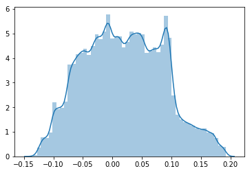

# Applying models on data.


```python
import pandas as pd
import numpy as np
import lightgbm as lgb
import matplotlib.pyplot as plt
from sklearn.preprocessing import StandardScaler
from sklearn.impute import SimpleImputer
from sklearn.metrics import confusion_matrix 
from sklearn.linear_model import LogisticRegression
from lightgbm import LGBMClassifier
from sklearn.calibration import CalibratedClassifierCV
import seaborn as sns
from sklearn.linear_model import LinearRegression
from sklearn.linear_model import SGDRegressor
from sklearn.ensemble import RandomForestClassifier
from sklearn.ensemble import RandomForestRegressor
from sklearn.model_selection import TimeSeriesSplit
from sklearn.model_selection import RandomizedSearchCV
from sklearn.model_selection import GridSearchCV

from xgboost import XGBClassifier

```


```python
traindata=pd.read_csv('train.csv')
```


```python
testdata=pd.read_csv('test.csv')
```


```python
traindata=traindata.iloc[:,1:]
testdata=testdata.iloc[:,1:]
```


```python
traindata.columns
```


    Index(['time', 'assetCode', 'assetName', 'volume', 'close', 'open',
           'returnsClosePrevRaw1', 'returnsOpenPrevRaw1',
           'returnsClosePrevMktres1', 'returnsOpenPrevMktres1',
           'returnsClosePrevRaw10', 'returnsOpenPrevRaw10',
           'returnsClosePrevMktres10', 'returnsOpenPrevMktres10',
           'returnsOpenNextMktres10', 'universe', 'urgency', 'bodySize',
           'companyCount', 'marketCommentary', 'sentenceCount', 'wordCount',
           'relevance', 'sentimentClass', 'sentimentNegative', 'sentimentNeutral',
           'sentimentPositive', 'sentimentWordCount', 'noveltyCount3D',
           'volumeCounts3D', 'headlinelength',
           'returnsClosePrevMktres10_lag_3_median',
           'returnsClosePrevMktres10_lag_3_max',
           'returnsClosePrevMktres10_lag_3_min',
           'returnsClosePrevMktres10_lag_7_median',
           'returnsClosePrevMktres10_lag_7_max',
           'returnsClosePrevMktres10_lag_7_min',
           'returnsClosePrevMktres10_lag_14_median',
           'returnsClosePrevMktres10_lag_14_max',
           'returnsClosePrevMktres10_lag_14_min',
           'returnsClosePrevRaw10_lag_3_median', 'returnsClosePrevRaw10_lag_3_max',
           'returnsClosePrevRaw10_lag_3_min', 'returnsClosePrevRaw10_lag_7_median',
           'returnsClosePrevRaw10_lag_7_max', 'returnsClosePrevRaw10_lag_7_min',
           'returnsClosePrevRaw10_lag_14_median',
           'returnsClosePrevRaw10_lag_14_max', 'returnsClosePrevRaw10_lag_14_min',
           'open_lag_3_median', 'open_lag_3_max', 'open_lag_3_min',
           'open_lag_7_median', 'open_lag_7_max', 'open_lag_7_min',
           'open_lag_14_median', 'open_lag_14_max', 'open_lag_14_min',
           'close_lag_3_median', 'close_lag_3_max', 'close_lag_3_min',
           'close_lag_7_median', 'close_lag_7_max', 'close_lag_7_min',
           'close_lag_14_median', 'close_lag_14_max', 'close_lag_14_min',
           'closeopentovolume', 'meanvolume', 'meanclose', 'stdclose', 'dayofweek',
           'quarter', 'month', 'year', 'close_30EMA', 'close_26EMA', 'close_12EMA',
           'MACD', 'MA_7MA', 'MA_7MA_std', 'MA_7MA_BB_high', 'MA_7MA_BB_low',
           'RSI', 'beta', 'sin_quarter', 'sin_dayofweek', 'sin_month'],
          dtype='object')


```python
traindata['time']=pd.to_datetime(traindata['time'], format='%Y-%m-%d')
testdata['time']=pd.to_datetime(testdata['time'], format='%Y-%m-%d')
```


```python
universe_test = testdata['universe']
time_test = testdata['time']
universe_train=traindata['universe']
time_train=traindata['time']
y_train=(traindata.returnsOpenNextMktres10>=0).astype('int')
y_test=(testdata.returnsOpenNextMktres10>=0).astype('int')
y_train1=traindata.returnsOpenNextMktres10
y_test1=testdata.returnsOpenNextMktres10
```

## Removing news data


```python
cols=['volume','returnsClosePrevRaw1', 'returnsOpenPrevRaw1',
       'returnsClosePrevMktres1', 'returnsOpenPrevMktres1',
       'returnsClosePrevRaw10', 'returnsOpenPrevRaw10',
       'returnsClosePrevMktres10', 'returnsOpenPrevMktres10',
       'returnsClosePrevMktres10_lag_3_median',
       'returnsClosePrevMktres10_lag_3_max',
       'returnsClosePrevMktres10_lag_3_min',
       'returnsClosePrevMktres10_lag_7_median',
       'returnsClosePrevMktres10_lag_7_max',
       'returnsClosePrevMktres10_lag_7_min',
       'returnsClosePrevMktres10_lag_14_median',
       'returnsClosePrevMktres10_lag_14_max',
       'returnsClosePrevMktres10_lag_14_min',
       'returnsClosePrevRaw10_lag_3_median', 'returnsClosePrevRaw10_lag_3_max',
       'returnsClosePrevRaw10_lag_3_min', 'returnsClosePrevRaw10_lag_7_median',
       'returnsClosePrevRaw10_lag_7_max', 'returnsClosePrevRaw10_lag_7_min',
       'returnsClosePrevRaw10_lag_14_median',
       'returnsClosePrevRaw10_lag_14_max', 'returnsClosePrevRaw10_lag_14_min',
       'open_lag_3_median', 'open_lag_3_max', 'open_lag_3_min',
       'open_lag_7_median', 'open_lag_7_max', 'open_lag_7_min',
       'open_lag_14_median', 'open_lag_14_max', 'open_lag_14_min',
       'close_lag_3_median', 'close_lag_3_max', 'close_lag_3_min',
       'close_lag_7_median', 'close_lag_7_max', 'close_lag_7_min',
       'close_lag_14_median', 'close_lag_14_max', 'close_lag_14_min',
       'closeopentovolume', 'meanvolume', 'meanclose', 'stdclose','close_30EMA', 'close_26EMA', 'close_12EMA',
       'MACD', 'MA_7MA', 'MA_7MA_std', 'MA_7MA_BB_high', 'MA_7MA_BB_low',
       'RSI', 'beta', 'sin_quarter', 'sin_dayofweek', 'sin_month','year']
X_train=traindata[cols]
X_test=testdata[cols]
```


```python
corr = X_train.corr()

mask = np.zeros_like(corr, dtype=np.bool)
mask[np.triu_indices_from(mask)] = True

f, ax = plt.subplots(figsize=(11, 9))
cmap = sns.diverging_palette(220, 10, as_cmap=True)
sns.heatmap(corr, mask=mask, cmap=cmap, vmax=.3, center=0,
            square=True, linewidths=.5, cbar_kws={"shrink": .5})
```


    <matplotlib.axes._subplots.AxesSubplot at 0x1ea4062aac8>


## Defining custom metric functions


```python
def sigma_score(pred,valid_data):
    pred=np.clip(pred,-1,1)
    if(len(pred)==len(y_test)):
        df_time = time_test.factorize()[0]
        universe=universe_test
        labels=y_test1*universe
    elif(len(pred)==len(y_train)):
        df_time = time_train.factorize()[0]
        universe=universe_train
        labels=y_train1*universe
    x_t = pred * labels
    x_t_sum = x_t.groupby(df_time).sum()
    score = x_t_sum.mean() / x_t_sum.std()
    return 'sigma_score', score, True
def sigma_score_2(preds, valid_data):
    preds=preds*2-1
    if(len(preds)==len(y_train)):
        df_time= time_train.factorize()[0]
        labels=y_train1
        x_t = preds*labels*universe_train
#    df_time = valid_data.params['extra_time']
#    labels = valid_data.get_label()
    elif(len(preds)==len(y_test)):
        df_time= time_test.factorize()[0]
        labels=y_test1
        x_t = preds*labels*universe_test
        
   # labels=y_test
 #   preds=pd.DataFrame(preds).clip(-1,1).values
  #  preds=preds.reshape(len(preds), )
#    assert len(labels) == len(df_time)
    #  * df_valid['universe'] -> Here we take out the 'universe' term because we already keep only those equals to 1.
    
    # Here we take advantage of the fact that `labels` (used to calculate `x_t`)
    # is a pd.Series and call `group_by`
    x_t_sum = x_t.groupby(df_time).sum()
    score = x_t_sum.mean() / x_t_sum.std()

    return 'sigma_score', score, True

```

## Time series split


```python
tscv = TimeSeriesSplit(n_splits=2)
```

# Classifiers

## Logistic regression


```python
model=LogisticRegression()
model.fit(X_train,y_train)
```

    C:\Users\chinn\Anaconda3\lib\site-packages\sklearn\linear_model\logistic.py:433: FutureWarning: Default solver will be changed to 'lbfgs' in 0.22. Specify a solver to silence this warning.
      FutureWarning)


    LogisticRegression(C=1.0, class_weight=None, dual=False, fit_intercept=True,
              intercept_scaling=1, max_iter=100, multi_class='warn',
              n_jobs=None, penalty='l2', random_state=None, solver='warn',
              tol=0.0001, verbose=0, warm_start=False)


```python
y_pred=model.predict_proba(X_test)
sigma_score(y_pred[:,1]*2-1,y_test1.values)
```


    ('sigma_score', 0.37416417744774055, True)


```python
clf = LogisticRegression()

param_grid = { 
    'C': [0.001,0.01,0.1,1,10],
    'penalty':['l2']
   }

rfc = RandomizedSearchCV(estimator=clf, param_distributions =param_grid, cv= tscv,n_jobs=-1,scoring ='neg_log_loss')
rfc.fit(X_train, y_train)

```


```python
y_pred=clf.predict_proba(X_test)
y_pred=y_pred[:,1]*2-1
sigma_score(y_pred,y_test1)
```

## Random forest


```python
clf = RandomForestClassifier(n_jobs=-1)
model=clf.fit(X_train,y_train)
```

    C:\Users\chinn\Anaconda3\lib\site-packages\sklearn\ensemble\forest.py:246: FutureWarning: The default value of n_estimators will change from 10 in version 0.20 to 100 in 0.22.
      "10 in version 0.20 to 100 in 0.22.", FutureWarning)


```python
y_pred=clf.predict_proba(X_test)
y_pred=y_pred[:,1]*2-1
sigma_score(y_pred,y_test1)
```


    ('sigma_score', 0.3750540242407995, True)


## Calibrated on RF


```python
from sklearn.calibration import CalibratedClassifierCV
calibrated_clf = CalibratedClassifierCV(model, method='sigmoid', cv=tscv)
calibrated_clf.fit(X_train, y_train)
```


    CalibratedClassifierCV(base_estimator=RandomForestClassifier(bootstrap=True, class_weight=None, criterion='gini',
                max_depth=None, max_features='auto', max_leaf_nodes=None,
                min_impurity_decrease=0.0, min_impurity_split=None,
                min_samples_leaf=1, min_samples_split=2,
                min_weight_fraction_leaf=0.0, n_estimators=10, n_jobs=-1,
                oob_score=False, random_state=None, verbose=0,
                warm_start=False),
                cv=TimeSeriesSplit(max_train_size=None, n_splits=2),
                method='sigmoid')


```python
Ytrainpred=calibrated_clf.predict_proba(X_train)
```


```python
Ytestpred=calibrated_clf.predict_proba(X_test)
```


```python
ytrainpred=Ytrainpred[:,1]
ytestpred=Ytestpred[:,1]
```


```python
sigma_score(ytrainpred*2-1,y_train1.values)
```


    ('sigma_score', 1.1045316341808502, True)


```python
sigma_score(ytestpred*2-1,y_train1.values)
```


    ('sigma_score', 0.4862011486445091, True)


```python
feature_importances = pd.DataFrame(clf.feature_importances_,
                                   index = X_train.columns,
                                    columns=['importance']).sort_values('importance',ascending=False)
```


```python
feature_importances.tail()
```


<div>
<style scoped>
    .dataframe tbody tr th:only-of-type {
        vertical-align: middle;
    }

    .dataframe tbody tr th {
        vertical-align: top;
    }

    .dataframe thead th {
        text-align: right;
    }
</style>
<table border="1" class="dataframe">
  <thead>
    <tr style="text-align: right;">
      <th></th>
      <th>importance</th>
    </tr>
  </thead>
  <tbody>
    <tr>
      <th>sin_dayofweek</th>
      <td>0.006310</td>
    </tr>
    <tr>
      <th>sin_quarter</th>
      <td>0.003783</td>
    </tr>
    <tr>
      <th>stdclose</th>
      <td>0.000000</td>
    </tr>
    <tr>
      <th>meanclose</th>
      <td>0.000000</td>
    </tr>
    <tr>
      <th>meanvolume</th>
      <td>0.000000</td>
    </tr>
  </tbody>
</table>
</div>


## Grid search on RF


```python
clf = RandomForestClassifier(n_jobs=-1)

param_grid = { 
    'n_estimators': [100,200,300,500],
    'max_depth' : [4,5,6,7,8],
}

rfc = RandomizedSearchCV(estimator=clf, param_distributions =param_grid, cv= tscv,n_jobs=-1,scoring ='neg_log_loss')
rfc.fit(X_train, y_train)

```


    RandomizedSearchCV(cv=TimeSeriesSplit(max_train_size=None, n_splits=2),
              error_score='raise-deprecating',
              estimator=RandomForestClassifier(bootstrap=True, class_weight=None, criterion='gini',
                max_depth=None, max_features='auto', max_leaf_nodes=None,
                min_impurity_decrease=0.0, min_impurity_split=None,
                min_samples_leaf=1, min_samples_split=2,
                min_weight_fraction_leaf=0.0, n_estimators='warn', n_jobs=-1,
                oob_score=False, random_state=None, verbose=0,
                warm_start=False),
              fit_params=None, iid='warn', n_iter=10, n_jobs=-1,
              param_distributions={'n_estimators': [100, 200, 300, 500], 'max_depth': [4, 5, 6, 7, 8]},
              pre_dispatch='2*n_jobs', random_state=None, refit=True,
              return_train_score='warn', scoring='neg_log_loss', verbose=0)


```python
rfc.best_params_
```


    {'n_estimators': 300, 'max_depth': 8}


```python
y_pred=rfc.predict_proba(X_train)*2-1
```


```python
y_pred=y_pred[:,1]
```


```python
sigma_score(y_pred,y_train1)
```


    ('sigma_score', 0.7134924265006625, True)


```python
y_pred=rfc.predict_proba(X_test)*2-1
sigma_score(y_pred[:,1],y_test1)
```


    ('sigma_score', 0.5346658390165596, True)


```python
sns.distplot(y_pred[:,1])
```

    C:\Users\chinn\Anaconda3\lib\site-packages\scipy\stats\stats.py:1713: FutureWarning: Using a non-tuple sequence for multidimensional indexing is deprecated; use `arr[tuple(seq)]` instead of `arr[seq]`. In the future this will be interpreted as an array index, `arr[np.array(seq)]`, which will result either in an error or a different result.
      return np.add.reduce(sorted[indexer] * weights, axis=axis) / sumval


    <matplotlib.axes._subplots.AxesSubplot at 0x1ea4b178550>


```python
confusion_matrix(y_test,y_pred[:,1]>=0)
```


    array([[173933, 189148],
           [136749, 217843]], dtype=int64)


# Calibrated on tuned model


```python
from sklearn.calibration import CalibratedClassifierCV
clf = RandomForestClassifier(n_estimators=300,max_depth=7)
calibrated_clf = CalibratedClassifierCV(clf, method='sigmoid', cv=tscv)
calibrated_clf.fit(X_train, y_train)
```


    CalibratedClassifierCV(base_estimator=RandomForestClassifier(bootstrap=True, class_weight=None, criterion='gini',
                max_depth=7, max_features='auto', max_leaf_nodes=None,
                min_impurity_decrease=0.0, min_impurity_split=None,
                min_samples_leaf=1, min_samples_split=2,
                min_weight_fraction_leaf=0.0, n_estimators=300, n_jobs=None,
                oob_score=False, random_state=None, verbose=0,
                warm_start=False),
                cv=TimeSeriesSplit(max_train_size=None, n_splits=2),
                method='sigmoid')


```python
y_pred=calibrated_clf.predict_proba(X_test)
```


```python
sigma_score(y_pred[:,1]*2-1,y_test1)
```


    ('sigma_score', 0.5485461670781893, True)


```python
y_pred=calibrated_clf.predict_proba(X_train)
sigma_score(y_pred[:,1]*2-1,y_train1)
```


    ('sigma_score', 0.6121033369983073, True)


```python
y_pred=y_pred[:,1]>=0
```


```python
confusion_matrix(y_train,y_pred)
```


    array([[      0, 1280993],
           [      0, 1341474]], dtype=int64)


```python
y_pred=calibrated_clf.predict_proba(X_train)

```


```python
y_pred=y_pred[:,1]*2-1
```


```python
sns.distplot(y_pred)
```


    <matplotlib.axes._subplots.AxesSubplot at 0x1f8569cdd30>


```python
train_cols = X_train.columns.tolist()
# Note: y data is expected to be a pandas Series, as we will use its group_by function in `sigma_score`
dtrain = lgb.Dataset(X_train.values, y_train,feature_name=train_cols,free_raw_data=False)
dvalid = lgb.Dataset(X_test.values, y_test,feature_name=train_cols, free_raw_data=False)
```


```python
params = {'boosting_type': 'gbdt',
          'max_depth' : -1,
          'objective': 'binary',
          'nthread': 3, # Updated from nthread
          'num_leaves': 64,
          'learning_rate': 0.05,
          'max_bin': 512,
          'subsample_for_bin': 200,
          'subsample': 1,
          'subsample_freq': 1,
          'colsample_bytree': 0.8,
          'reg_alpha': 5,
          'reg_lambda': 10,
          'min_split_gain': 0.5,
          'min_child_weight': 1,
          'min_child_samples': 5,
          'scale_pos_weight': 1,
          'num_class' : 1,
          'metric' : 'binary_error'}

# Create parameters to search
gridParams = {
    'learning_rate': [0.005],
    'n_estimators': [40,150],
    'num_leaves': [6,8,12],
    'boosting_type' : ['gbdt'],
    'objective' : ['binary'],
    'random_state' : [501], # Updated from 'seed'
    'colsample_bytree' : [0.65, 0.66],
    'subsample' : [0.7,0.75],
    'reg_alpha' : [1,1.2],
    'reg_lambda' : [1,1.2,1.4],
    }

# Create classifier to use. Note that parameters have to be input manually
# not as a dict!
evals_result = {}

mdl = lgb.LGBMClassifier(boosting_type= 'gbdt',
          objective = 'binary',
          n_jobs = 3, 
          silent = False,
          max_depth = params['max_depth'],
          max_bin = params['max_bin'],
          subsample_for_bin = params['subsample_for_bin'],
          subsample = params['subsample'],
          subsample_freq = params['subsample_freq'],
          min_split_gain = params['min_split_gain'],
          min_child_weight = params['min_child_weight'],
          min_child_samples = params['min_child_samples'],
          scale_pos_weight = params['scale_pos_weight'])

# To view the default model params:
mdl.get_params().keys()

# Create the grid
grid = RandomizedSearchCV(mdl, gridParams,
                    verbose=0,
                    cv=tscv,
                    n_jobs=2,scoring='neg_log_loss')
# Run the grid
grid.fit(X_train,y_train)

# Print the best parameters found
print(grid.best_params_)
print(grid.best_score_)
```

    {'subsample': 0.75, 'reg_lambda': 1.2, 'reg_alpha': 1, 'random_state': 501, 'objective': 'binary', 'num_leaves': 12, 'n_estimators': 150, 'learning_rate': 0.005, 'colsample_bytree': 0.66, 'boosting_type': 'gbdt'}
    -0.6895867716593379


```python
x_1 = [0.19000424246380565, 2452, 212, 328, 202]

params_1 = {
        'task': 'train',
        'boosting_type': 'gbdt',
        'objective': 'binary',
        'learning_rate': 0.005,
        'num_iteration': 500,
        'n_estimators':150,
        'colsample_bytree': 0.66, 
         'subsample': 0.75,
        'verbose': 1,
         'metric':None,
    'reg_lambda': 1.2,
    'reg_alpha': 1,
    'random_state': 501,
    'objective': 'binary',
    'num_leaves': 12
    }


gbm_1 = lgb.train(params_1,
        dtrain,
        num_boost_round=1000,
        valid_sets=dvalid,
        feval=sigma_score_2,
        early_stopping_rounds=30,
        verbose_eval=25
        )

```

    C:\Users\chinn\Anaconda3\lib\site-packages\lightgbm\engine.py:113: UserWarning: Found `num_iteration` in params. Will use it instead of argument
      warnings.warn("Found `{}` in params. Will use it instead of argument".format(alias))


    Training until validation scores don't improve for 30 rounds.
    [25]	valid_0's binary_logloss: 0.692633	valid_0's sigma_score: 0.0795633
    [50]	valid_0's binary_logloss: 0.691774	valid_0's sigma_score: 0.273122
    [75]	valid_0's binary_logloss: 0.691024	valid_0's sigma_score: 0.397076
    [100]	valid_0's binary_logloss: 0.690331	valid_0's sigma_score: 0.477671
    [125]	valid_0's binary_logloss: 0.689849	valid_0's sigma_score: 0.52121
    [150]	valid_0's binary_logloss: 0.689309	valid_0's sigma_score: 0.551341
    [175]	valid_0's binary_logloss: 0.688996	valid_0's sigma_score: 0.562054
    [200]	valid_0's binary_logloss: 0.688644	valid_0's sigma_score: 0.572705
    [225]	valid_0's binary_logloss: 0.688447	valid_0's sigma_score: 0.573533
    [250]	valid_0's binary_logloss: 0.688145	valid_0's sigma_score: 0.579904
    [275]	valid_0's binary_logloss: 0.687972	valid_0's sigma_score: 0.579298
    Early stopping, best iteration is:
    [254]	valid_0's binary_logloss: 0.688098	valid_0's sigma_score: 0.580737


```python
plt.figure(figsize=(40,20))
lgb.plot_importance(gbm_1,max_num_features=15)
plt.show()
```


    <Figure size 2880x1440 with 0 Axes>


```python
y_pred=gbm_1.predict(X_train)
```


```python
sigma_score(y_pred*2-1,y_train1)
```


    ('sigma_score', 0.6859160729981825, True)


```python
y_pred=gbm_1.predict(X_test)
```


```python
sigma_score(y_pred*2-1,y_test1)
```


    ('sigma_score', 0.5807365552305024, True)


```python
sns.distplot(y_pred*2-1)
```


    <matplotlib.axes._subplots.AxesSubplot at 0x1f8875b84e0>





```python
clf = lgb.LGBMClassifier(task= 'train',
        boosting_type= 'gbdt',
        objective='binary',
        learning_rate= 0.005,
        num_iteration= 500,
        n_estimators=150,
        colsample_bytree= 0.66, 
        subsample= 0.75,
        verbose =1,
         reg_lambda= 1.2,
    reg_alpha= 1,
    random_state= 501,
    num_leaves= 12
)
```


```python
calibrated_clf = CalibratedClassifierCV(clf, method='isotonic', cv=tscv)
calibrated_clf.fit(X_train, y_train)
```

    C:\Users\chinn\Anaconda3\lib\site-packages\lightgbm\engine.py:113: UserWarning: Found `num_iteration` in params. Will use it instead of argument
      warnings.warn("Found `{}` in params. Will use it instead of argument".format(alias))
    C:\Users\chinn\Anaconda3\lib\site-packages\lightgbm\engine.py:113: UserWarning: Found `num_iteration` in params. Will use it instead of argument
      warnings.warn("Found `{}` in params. Will use it instead of argument".format(alias))


    CalibratedClassifierCV(base_estimator=LGBMClassifier(boosting_type='gbdt', class_weight=None, colsample_bytree=0.66,
            importance_type='split', learning_rate=0.005, max_depth=-1,
            min_child_samples=20, min_child_weight=0.001, min_split_gain=0.0,
            n_estimators=150, n_jobs=-1, num_iteration=500, num_leaves=12,
            objective='binary', random_state=501, reg_alpha=1, reg_lambda=1.2,
            silent=True, subsample=0.75, subsample_for_bin=200000,
            subsample_freq=0, task='train', verbose=1),
                cv=TimeSeriesSplit(max_train_size=None, n_splits=2),
                method='isotonic')


```python
Ytrainpred=calibrated_clf.predict_proba(X_train)
```


```python
Ytestpred=calibrated_clf.predict_proba(X_test)
```


```python
ytrainpred=Ytrainpred[:,1]
ytestpred=Ytestpred[:,1]
```


```python
sigma_score(ytrainpred*2-1,y_train1.values)
```


    ('sigma_score', 0.6237107583636623, True)


```python
sigma_score(ytestpred*2-1,y_train1.values)
```


    ('sigma_score', 0.5677100719773357, True)


```python
xgb = XGBClassifier(learning_rate=0.1, n_estimators=300, objective='binary:logistic',
                    silent=True, nthread=2)
```


```python
model=xgb.fit(X_train,y_train)
```


```python
y_pred=xgb.predict_proba(X_test)
```


```python
sigma_score(y_pred[:,1]*2-1,y_test1)
```


    ('sigma_score', 0.48366598850149906, True)


```python
y_pred=xgb.predict_proba(X_train)
sigma_score(y_pred[:,1]*2-1,y_train1)
```


    ('sigma_score', 0.8113740249829478, True)


```python
y_pred=y_pred[:,1]>=0
```


```python
confusion_matrix(y_train,y_pred)
```


    array([[601906, 679087],
           [447189, 894285]], dtype=int64)


```python
xgb = XGBClassifier(objective='binary:logistic')
```


```python
clf = RandomizedSearchCV(xgb,{'max_depth': [2,4,6],
                    'n_estimators': [50,100,200]}, 
                    verbose=1, 
                    scoring='neg_log_loss',
                   cv= tscv,n_jobs=-1
                     )

clf.fit(X_train,y_train)
clf.best_score_, clf.best_params_
```

    C:\Users\chinn\Anaconda3\lib\site-packages\sklearn\model_selection\_search.py:271: UserWarning: The total space of parameters 9 is smaller than n_iter=10. Running 9 iterations. For exhaustive searches, use GridSearchCV.
      % (grid_size, self.n_iter, grid_size), UserWarning)
    [Parallel(n_jobs=-1)]: Using backend LokyBackend with 4 concurrent workers.


    Fitting 2 folds for each of 9 candidates, totalling 18 fits


    [Parallel(n_jobs=-1)]: Done  18 out of  18 | elapsed: 167.0min finished


    (-0.6870596950771145, {'n_estimators': 50, 'max_depth': 2})


```python
y_pred=clf.predict_proba(X_test)
```


```python
sigma_score(y_pred[:,1]*2-1,y_test1)
```


    ('sigma_score', 0.5466463282705594, True)


```python
y_pred=clf.predict_proba(X_train)
sigma_score(y_pred[:,1]*2-1,y_train1)
```


    ('sigma_score', 0.6633845835678877, True)


```python
y_pred=y_pred[:,1]>=0
```


```python
confusion_matrix(y_train,y_pred)
```


    array([[      0, 1280993],
           [      0, 1341474]], dtype=int64)


# Calibrated on XG BOOST


```python
xgb = XGBClassifier(objective='binary:logistic',n_estimators=50,max_depth=2)
```


```python
from sklearn.calibration import CalibratedClassifierCV
calibrated_clf = CalibratedClassifierCV(xgb, method='sigmoid', cv=tscv)
calibrated_clf.fit(X_train, y_train)
```


    CalibratedClassifierCV(base_estimator=XGBClassifier(base_score=0.5, booster='gbtree', colsample_bylevel=1,
           colsample_bytree=1, gamma=0, learning_rate=0.1, max_delta_step=0,
           max_depth=2, min_child_weight=1, missing=None, n_estimators=50,
           n_jobs=1, nthread=None, objective='binary:logistic', random_state=0,
           reg_alpha=0, reg_lambda=1, scale_pos_weight=1, seed=None,
           silent=True, subsample=1),
                cv=TimeSeriesSplit(max_train_size=None, n_splits=2),
                method='sigmoid')


```python
Ytrainpred=calibrated_clf.predict_proba(X_train)
```


```python
Ytestpred=calibrated_clf.predict_proba(X_test)
```


```python
ytrainpred=Ytrainpred[:,1]
ytestpred=Ytestpred[:,1]
```


```python
sigma_score(ytrainpred*2-1,y_train1.values)
```


    ('sigma_score', 0.5896574335387855, True)


```python
sigma_score(ytestpred*2-1,y_test1.values)
```


    ('sigma_score', 0.549996122565269, True)


# Using regression


```python
train_cols = X_train.columns.tolist()

# Note: y data is expected to be a pandas Series, as we will use its group_by function in `sigma_score`
dtrain = lgb.Dataset(X_train.values, y_train1,feature_name=train_cols, free_raw_data=False)
dvalid = lgb.Dataset(X_test.values, y_test1,feature_name=train_cols,free_raw_data=False)
```


```python
lgb_params = dict(
    objective = 'regression_l1',
    learning_rate = 0.005,
    bagging_fraction = 0.75,
    bagging_freq = 2,
    feature_fraction = 0.5,
    num_iteration= 500,
    n_estimators=150,
    colsample_bytree= 0.66, 
    subsample= 0.75,
    verbose =1,
    reg_lambda= 1.2,
    reg_alpha= 1,
    random_state= 501,
    num_leaves= 12,
    lambda_l1 = 0.5,
    lambda_l2 = 1.0,
    metric = 'None', # This will ignore the loss objetive and use sigma_score instead,
    seed = 0 # Change for better luck! :)
)
```


```python
evals_result = {}
m = lgb.train(lgb_params, dtrain, num_boost_round=1000, valid_sets=(dtrain,dvalid), valid_names=('train','valid'), verbose_eval=25, feval=sigma_score, evals_result=evals_result)
df_result = pd.DataFrame(evals_result['valid'])
```

    C:\Users\chinn\Anaconda3\lib\site-packages\lightgbm\engine.py:113: UserWarning: Found `num_iteration` in params. Will use it instead of argument
      warnings.warn("Found `{}` in params. Will use it instead of argument".format(alias))


    [25]	train's sigma_score: 0.418809	valid's sigma_score: 0.117999
    [50]	train's sigma_score: 0.568597	valid's sigma_score: 0.307166
    [75]	train's sigma_score: 0.620927	valid's sigma_score: 0.421572
    [100]	train's sigma_score: 0.635875	valid's sigma_score: 0.482216
    [125]	train's sigma_score: 0.636294	valid's sigma_score: 0.512729
    [150]	train's sigma_score: 0.638908	valid's sigma_score: 0.531243
    [175]	train's sigma_score: 0.636937	valid's sigma_score: 0.5422
    [200]	train's sigma_score: 0.637198	valid's sigma_score: 0.547239
    [225]	train's sigma_score: 0.635802	valid's sigma_score: 0.551443
    [250]	train's sigma_score: 0.632717	valid's sigma_score: 0.554628
    [275]	train's sigma_score: 0.633287	valid's sigma_score: 0.554167
    [300]	train's sigma_score: 0.634656	valid's sigma_score: 0.556521
    [325]	train's sigma_score: 0.63648	valid's sigma_score: 0.556715
    [350]	train's sigma_score: 0.637532	valid's sigma_score: 0.55786
    [375]	train's sigma_score: 0.636781	valid's sigma_score: 0.558729
    [400]	train's sigma_score: 0.637117	valid's sigma_score: 0.558295
    [425]	train's sigma_score: 0.637578	valid's sigma_score: 0.558153
    [450]	train's sigma_score: 0.638075	valid's sigma_score: 0.558225
    [475]	train's sigma_score: 0.637123	valid's sigma_score: 0.558062
    [500]	train's sigma_score: 0.636048	valid's sigma_score: 0.557664


```python
y_pred=m.predict(X_test)
```


```python
sns.distplot(y_pred)
```


    <matplotlib.axes._subplots.AxesSubplot at 0x1f88893d978>


```python
fig, ax = plt.subplots(1, 2, figsize=(14, 14))
lgb.plot_importance(m, ax=ax[0])
lgb.plot_importance(m, ax=ax[1], importance_type='gain')
fig.tight_layout()
```


```python
clf = RandomForestRegressor(n_estimators=200, max_depth=5,random_state=0,n_jobs=-1)
```


```python
model=clf.fit(X_train,y_train1)
```


```python
y_pred=model.predict(X_test)
```


```python
sigma_score(y_pred,y_test1)
```


    ('sigma_score', 0.3476250043396745, True)


```python
feature_importances = pd.DataFrame(clf.feature_importances_,
                                   index = X_train.columns,
                                    columns=['importance']).sort_values('importance',ascending=False)

feature_importances.head()
```


<div>
<style scoped>
    .dataframe tbody tr th:only-of-type {
        vertical-align: middle;
    }

    .dataframe tbody tr th {
        vertical-align: top;
    }

    .dataframe thead th {
        text-align: right;
    }
</style>
<table border="1" class="dataframe">
  <thead>
    <tr style="text-align: right;">
      <th></th>
      <th>importance</th>
    </tr>
  </thead>
  <tbody>
    <tr>
      <th>returnsClosePrevMktres10_lag_14_min</th>
      <td>0.267275</td>
    </tr>
    <tr>
      <th>close_30EMA</th>
      <td>0.132671</td>
    </tr>
    <tr>
      <th>close_26EMA</th>
      <td>0.131267</td>
    </tr>
    <tr>
      <th>returnsOpenPrevMktres1</th>
      <td>0.044182</td>
    </tr>
    <tr>
      <th>returnsOpenPrevRaw10</th>
      <td>0.037511</td>
    </tr>
  </tbody>
</table>
</div>


```python
#model = RandomForestRegressor()
#param_grid = { 
#    'n_estimators': [100,250,500],
#    'max_depth' : [3,5,7],
#}
#rfc = GridSearchCV(estimator=model, param_distributions =param_grid, cv= tscv,n_jobs=2)
#rfc.fit(X_train, y_train)
```

    C:\Users\chinn\Anaconda3\lib\site-packages\sklearn\model_selection\_search.py:271: UserWarning: The total space of parameters 9 is smaller than n_iter=10. Running 9 iterations. For exhaustive searches, use GridSearchCV.
      % (grid_size, self.n_iter, grid_size), UserWarning)


```python
#rfc.best_params_
```


```python
#y_pred=rfc.predict(X_test)
```


```python
#sns.distplot(y_pred)
```


```python
#sigma_score(y_pred,y_train1)
```
