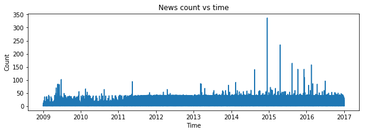
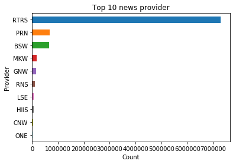
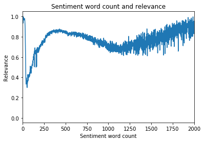
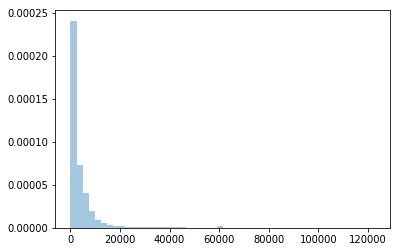

```python
import pandas as pd
import numpy as np
import matplotlib.pyplot as plt
import seaborn as sns
import datetime
```


```python
news_data=pd.read_csv('newsdata.csv')
```


```python
news_data.head()
```


<div>
<style scoped>
    .dataframe tbody tr th:only-of-type {
        vertical-align: middle;
    }

    .dataframe tbody tr th {
        vertical-align: top;
    }

    .dataframe thead th {
        text-align: right;
    }
</style>
<table border="1" class="dataframe">
  <thead>
    <tr style="text-align: right;">
      <th></th>
      <th>Unnamed: 0</th>
      <th>time</th>
      <th>sourceTimestamp</th>
      <th>firstCreated</th>
      <th>sourceId</th>
      <th>headline</th>
      <th>urgency</th>
      <th>takeSequence</th>
      <th>provider</th>
      <th>subjects</th>
      <th>...</th>
      <th>noveltyCount12H</th>
      <th>noveltyCount24H</th>
      <th>noveltyCount3D</th>
      <th>noveltyCount5D</th>
      <th>noveltyCount7D</th>
      <th>volumeCounts12H</th>
      <th>volumeCounts24H</th>
      <th>volumeCounts3D</th>
      <th>volumeCounts5D</th>
      <th>volumeCounts7D</th>
    </tr>
  </thead>
  <tbody>
    <tr>
      <th>0</th>
      <td>0</td>
      <td>2007-01-01 04:29:32+00:00</td>
      <td>2007-01-01 04:29:32+00:00</td>
      <td>2007-01-01 04:29:32+00:00</td>
      <td>e58c6279551b85cf</td>
      <td>China's Daqing pumps 43.41 mln tonnes of oil i...</td>
      <td>3</td>
      <td>1</td>
      <td>RTRS</td>
      <td>{'ENR', 'ASIA', 'CN', 'NGS', 'EMRG', 'RTRS', '...</td>
      <td>...</td>
      <td>0</td>
      <td>0</td>
      <td>0</td>
      <td>0</td>
      <td>0</td>
      <td>0</td>
      <td>0</td>
      <td>3</td>
      <td>6</td>
      <td>7</td>
    </tr>
    <tr>
      <th>1</th>
      <td>1</td>
      <td>2007-01-01 07:03:35+00:00</td>
      <td>2007-01-01 07:03:34+00:00</td>
      <td>2007-01-01 07:03:34+00:00</td>
      <td>5a31c4327427f63f</td>
      <td>FEATURE-In kidnapping, finesse works best</td>
      <td>3</td>
      <td>1</td>
      <td>RTRS</td>
      <td>{'FEA', 'CA', 'LATAM', 'MX', 'INS', 'ASIA', 'I...</td>
      <td>...</td>
      <td>1</td>
      <td>1</td>
      <td>1</td>
      <td>1</td>
      <td>1</td>
      <td>1</td>
      <td>1</td>
      <td>3</td>
      <td>3</td>
      <td>3</td>
    </tr>
    <tr>
      <th>2</th>
      <td>2</td>
      <td>2007-01-01 11:29:56+00:00</td>
      <td>2007-01-01 11:29:56+00:00</td>
      <td>2007-01-01 11:29:56+00:00</td>
      <td>1cefd27a40fabdfe</td>
      <td>PRESS DIGEST - Wall Street Journal - Jan 1</td>
      <td>3</td>
      <td>1</td>
      <td>RTRS</td>
      <td>{'RET', 'ENR', 'ID', 'BG', 'US', 'PRESS', 'IQ'...</td>
      <td>...</td>
      <td>0</td>
      <td>0</td>
      <td>0</td>
      <td>0</td>
      <td>0</td>
      <td>0</td>
      <td>0</td>
      <td>5</td>
      <td>11</td>
      <td>17</td>
    </tr>
    <tr>
      <th>3</th>
      <td>3</td>
      <td>2007-01-01 12:08:37+00:00</td>
      <td>2007-01-01 12:08:37+00:00</td>
      <td>2007-01-01 12:08:37+00:00</td>
      <td>23768af19dc69992</td>
      <td>PRESS DIGEST - New York Times - Jan 1</td>
      <td>3</td>
      <td>1</td>
      <td>RTRS</td>
      <td>{'FUND', 'FIN', 'CA', 'SFWR', 'INS', 'PUB', 'B...</td>
      <td>...</td>
      <td>0</td>
      <td>0</td>
      <td>0</td>
      <td>0</td>
      <td>0</td>
      <td>0</td>
      <td>0</td>
      <td>5</td>
      <td>13</td>
      <td>15</td>
    </tr>
    <tr>
      <th>4</th>
      <td>4</td>
      <td>2007-01-01 12:08:37+00:00</td>
      <td>2007-01-01 12:08:37+00:00</td>
      <td>2007-01-01 12:08:37+00:00</td>
      <td>23768af19dc69992</td>
      <td>PRESS DIGEST - New York Times - Jan 1</td>
      <td>3</td>
      <td>1</td>
      <td>RTRS</td>
      <td>{'FUND', 'FIN', 'CA', 'SFWR', 'INS', 'PUB', 'B...</td>
      <td>...</td>
      <td>0</td>
      <td>0</td>
      <td>0</td>
      <td>0</td>
      <td>0</td>
      <td>0</td>
      <td>0</td>
      <td>0</td>
      <td>0</td>
      <td>0</td>
    </tr>
  </tbody>
</table>
<p>5 rows × 36 columns</p>
</div>


```python
news_data=news_data.iloc[:,1:]
```


```python
news_data.shape
```


    (9328750, 35)


```python
news_data.isnull().sum()
```


    time                          0
    sourceTimestamp               0
    firstCreated                  0
    sourceId                      0
    headline                  73960
    urgency                       0
    takeSequence                  0
    provider                      0
    subjects                      0
    audiences                     0
    bodySize                      0
    companyCount                  0
    headlineTag             6341993
    marketCommentary              0
    sentenceCount                 0
    wordCount                     0
    assetCodes                    0
    assetName                     0
    firstMentionSentence          0
    relevance                     0
    sentimentClass                0
    sentimentNegative             0
    sentimentNeutral              0
    sentimentPositive             0
    sentimentWordCount            0
    noveltyCount12H               0
    noveltyCount24H               0
    noveltyCount3D                0
    noveltyCount5D                0
    noveltyCount7D                0
    volumeCounts12H               0
    volumeCounts24H               0
    volumeCounts3D                0
    volumeCounts5D                0
    volumeCounts7D                0
    dtype: int64


```python
news_data.nunique()
```


    time                    5245343
    sourceTimestamp         5228340
    firstCreated            3441535
    sourceId                6340206
    headline                5532378
    urgency                       3
    takeSequence                 97
    provider                     30
    subjects                1733963
    audiences                 88488
    bodySize                  61200
    companyCount                 43
    headlineTag                 162
    marketCommentary              2
    sentenceCount               669
    wordCount                 10365
    assetCodes                10691
    assetName                  8902
    firstMentionSentence        516
    relevance                 28412
    sentimentClass                3
    sentimentNegative       1321080
    sentimentNeutral         582507
    sentimentPositive       1025372
    sentimentWordCount         6493
    noveltyCount12H             501
    noveltyCount24H             501
    noveltyCount3D              501
    noveltyCount5D              501
    noveltyCount7D              501
    volumeCounts12H            2565
    volumeCounts24H            2570
    volumeCounts3D             2587
    volumeCounts5D             2598
    volumeCounts7D             2928
    dtype: int64


```python
news_data.info()
```

    <class 'pandas.core.frame.DataFrame'>
    RangeIndex: 9328750 entries, 0 to 9328749
    Data columns (total 35 columns):
    time                    object
    sourceTimestamp         object
    firstCreated            object
    sourceId                object
    headline                object
    urgency                 int64
    takeSequence            int64
    provider                object
    subjects                object
    audiences               object
    bodySize                int64
    companyCount            int64
    headlineTag             object
    marketCommentary        bool
    sentenceCount           int64
    wordCount               int64
    assetCodes              object
    assetName               object
    firstMentionSentence    int64
    relevance               float64
    sentimentClass          int64
    sentimentNegative       float64
    sentimentNeutral        float64
    sentimentPositive       float64
    sentimentWordCount      int64
    noveltyCount12H         int64
    noveltyCount24H         int64
    noveltyCount3D          int64
    noveltyCount5D          int64
    noveltyCount7D          int64
    volumeCounts12H         int64
    volumeCounts24H         int64
    volumeCounts3D          int64
    volumeCounts5D          int64
    volumeCounts7D          int64
    dtypes: bool(1), float64(4), int64(19), object(11)
    memory usage: 2.4+ GB


### Let's change the datatype of variables to make them more functionable and reduce the memory usage.


```python
for columnname in news_data.columns:
    if news_data[columnname].dtype=='float64':
        news_data[columnname]=news_data[columnname].astype('float32')
    elif news_data[columnname].dtype=='int64':
        news_data[columnname]=news_data[columnname].astype('int32')
news_data['urgency']=news_data['urgency'].astype('int8')
news_data['provider']=news_data['provider'].astype('category')
news_data['subjects']=news_data['subjects'].astype('category')
news_data['audiences']=news_data['audiences'].astype('category')

```


```python
news_data['time'] =  pd.to_datetime(news_data['time'], format='%Y-%m-%d %H:%M:%S+00:00')
news_data['sourceTimestamp'] =  pd.to_datetime(news_data['sourceTimestamp'], format='%Y-%m-%d %H:%M:%S+00:00')
news_data['firstCreated'] =  pd.to_datetime(news_data['firstCreated'], format='%Y-%m-%d %H:%M:%S+00:00')
```


```python
news_data.info()
```

    <class 'pandas.core.frame.DataFrame'>
    RangeIndex: 9328750 entries, 0 to 9328749
    Data columns (total 35 columns):
    time                    datetime64[ns]
    sourceTimestamp         datetime64[ns]
    firstCreated            datetime64[ns]
    sourceId                object
    headline                object
    urgency                 int8
    takeSequence            int32
    provider                category
    subjects                category
    audiences               category
    bodySize                int32
    companyCount            int32
    headlineTag             object
    marketCommentary        bool
    sentenceCount           int32
    wordCount               int32
    assetCodes              object
    assetName               object
    firstMentionSentence    int32
    relevance               float32
    sentimentClass          int32
    sentimentNegative       float32
    sentimentNeutral        float32
    sentimentPositive       float32
    sentimentWordCount      int32
    noveltyCount12H         int32
    noveltyCount24H         int32
    noveltyCount3D          int32
    noveltyCount5D          int32
    noveltyCount7D          int32
    volumeCounts12H         int32
    volumeCounts24H         int32
    volumeCounts3D          int32
    volumeCounts5D          int32
    volumeCounts7D          int32
    dtypes: bool(1), category(3), datetime64[ns](3), float32(4), int32(18), int8(1), object(5)
    memory usage: 1.5+ GB


```python
news_data=news_data[news_data.time>datetime.date(2009, 1, 1)]
```

    C:\Users\chinn\Anaconda3\lib\site-packages\ipykernel_launcher.py:1: FutureWarning: Comparing Series of datetimes with 'datetime.date'.  Currently, the
    'datetime.date' is coerced to a datetime. In the future pandas will
    not coerce, and a TypeError will be raised. To retain the current
    behavior, convert the 'datetime.date' to a datetime with
    'pd.Timestamp'.
      """Entry point for launching an IPython kernel.


```python
100-news_data.shape[0]*100/9328750
```


    16.306514806378132


```python
news_data.head(2)
```


<div>
<style scoped>
    .dataframe tbody tr th:only-of-type {
        vertical-align: middle;
    }

    .dataframe tbody tr th {
        vertical-align: top;
    }

    .dataframe thead th {
        text-align: right;
    }
</style>
<table border="1" class="dataframe">
  <thead>
    <tr style="text-align: right;">
      <th></th>
      <th>time</th>
      <th>sourceTimestamp</th>
      <th>firstCreated</th>
      <th>sourceId</th>
      <th>headline</th>
      <th>urgency</th>
      <th>takeSequence</th>
      <th>provider</th>
      <th>subjects</th>
      <th>audiences</th>
      <th>...</th>
      <th>noveltyCount12H</th>
      <th>noveltyCount24H</th>
      <th>noveltyCount3D</th>
      <th>noveltyCount5D</th>
      <th>noveltyCount7D</th>
      <th>volumeCounts12H</th>
      <th>volumeCounts24H</th>
      <th>volumeCounts3D</th>
      <th>volumeCounts5D</th>
      <th>volumeCounts7D</th>
    </tr>
  </thead>
  <tbody>
    <tr>
      <th>1521194</th>
      <td>2009-01-01 00:25:02</td>
      <td>2009-01-01 00:25:01</td>
      <td>2009-01-01 00:25:01</td>
      <td>6bf957cb4d7b0ce1</td>
      <td>Churchill Downs Incorporated, KHBPA, KTA Reach...</td>
      <td>3</td>
      <td>1</td>
      <td>BSW</td>
      <td>{'ENTS', 'EQUE', 'CYCS', 'NEWR', 'LEI', 'RELX'...</td>
      <td>{'BSW', 'CNR'}</td>
      <td>...</td>
      <td>0</td>
      <td>0</td>
      <td>0</td>
      <td>0</td>
      <td>0</td>
      <td>0</td>
      <td>0</td>
      <td>0</td>
      <td>0</td>
      <td>0</td>
    </tr>
    <tr>
      <th>1521195</th>
      <td>2009-01-01 00:25:03</td>
      <td>2009-01-01 00:25:01</td>
      <td>2009-01-01 00:25:01</td>
      <td>aceb69df2660a6f5</td>
      <td>Corgi International Limited Announces Financia...</td>
      <td>3</td>
      <td>1</td>
      <td>BSW</td>
      <td>{'CYCP', 'RET', 'CYCS', 'ASIA', 'HK', 'NEWR', ...</td>
      <td>{'BSW', 'CNR', 'CNRA'}</td>
      <td>...</td>
      <td>0</td>
      <td>0</td>
      <td>0</td>
      <td>0</td>
      <td>0</td>
      <td>0</td>
      <td>0</td>
      <td>0</td>
      <td>0</td>
      <td>0</td>
    </tr>
  </tbody>
</table>
<p>2 rows × 35 columns</p>
</div>


```python
news_data['urgency'].value_counts()
```


    3    6162567
    1    3166158
    2         25
    Name: urgency, dtype: int64


```python
news_data.headline[news_data['urgency']==1].head(1).values
```


    array(["INDIA'S HERO HONDA <HROH.BO> DEC VEHICLE SALES 252,462  UNITS VS 245,104 YEAR AGO "],
          dtype=object)


```python
news_data.headline[news_data['urgency']==2].head(1).values
```


    array(['BRIEF-Terrapin 3 Acquisition Corporation to buy Yatra Online, Inc.<TRTL.O>'],
          dtype=object)


```python
news_data.headline[news_data['urgency']==3].head(1).values
```


    array(["China's Daqing pumps 43.41 mln tonnes of oil in 06"], dtype=object)


```python
news_data.assetCodes[news_data['urgency']==3].head(1).values
```


    array(["{'0857.HK', '0857.F', '0857.DE', 'PTR.N'}"], dtype=object)


```python
news_data.takeSequence.value_counts()[:10]
```


    1     6747890
    2      831166
    3      465806
    4      310821
    5      222402
    6      163805
    7      124725
    8       96287
    9       74009
    10      56180
    Name: takeSequence, dtype: int64


```python
news_data[['sentimentClass','sentimentNegative', 'sentimentNeutral','sentimentPositive']].head()
```


<div>
<style scoped>
    .dataframe tbody tr th:only-of-type {
        vertical-align: middle;
    }

    .dataframe tbody tr th {
        vertical-align: top;
    }

    .dataframe thead th {
        text-align: right;
    }
</style>
<table border="1" class="dataframe">
  <thead>
    <tr style="text-align: right;">
      <th></th>
      <th>sentimentClass</th>
      <th>sentimentNegative</th>
      <th>sentimentNeutral</th>
      <th>sentimentPositive</th>
    </tr>
  </thead>
  <tbody>
    <tr>
      <th>0</th>
      <td>-1</td>
      <td>0.500739</td>
      <td>0.419327</td>
      <td>0.079934</td>
    </tr>
    <tr>
      <th>1</th>
      <td>-1</td>
      <td>0.600082</td>
      <td>0.345853</td>
      <td>0.054064</td>
    </tr>
    <tr>
      <th>2</th>
      <td>-1</td>
      <td>0.450049</td>
      <td>0.295671</td>
      <td>0.254280</td>
    </tr>
    <tr>
      <th>3</th>
      <td>-1</td>
      <td>0.752917</td>
      <td>0.162715</td>
      <td>0.084368</td>
    </tr>
    <tr>
      <th>4</th>
      <td>-1</td>
      <td>0.699274</td>
      <td>0.209360</td>
      <td>0.091366</td>
    </tr>
  </tbody>
</table>
</div>


```python
    # Barplot on negative, neutral and positive columns.
news_data[['sentimentNegative', 'sentimentNeutral','sentimentPositive']].mean().plot(kind='bar')
plt.title("News positivity chart")
plt.show()
```


```python
news_data['delay_time']=news_data['time']-news_data['firstCreated']
```


```python
news_data['time']=news_data['time'].dt.date
```


```python
def plot_vs_time(data_frame, column, calculation='mean', span=10):
    if calculation == 'mean':
        group_temp = data_frame.groupby('time')[column].mean().reset_index()
    if calculation == 'count':
        group_temp = data_frame.groupby('time')[column].count().reset_index()
    if calculation == 'nunique':
        group_temp = data_frame.groupby('time')[column].nunique().reset_index()
    fig = plt.figure(figsize=(10,3))
    plt.plot(group_temp['time'], group_temp[column])
    plt.xlabel('Time')
    plt.ylabel(column)
    plt.title('%s versus time' %column)
```


```python
plot_vs_time(news_data, 'sourceId', calculation='count', span=10)
plt.title('News count vs time')
plt.ylabel('Count')
```


    Text(0, 0.5, 'Count')





```python
provider_count = news_data.groupby('provider')['sourceId'].count()
```


```python
provider_sort = provider_count.sort_values(ascending= False)
provider_sort[:10].plot.barh()
plt.xlabel('Count')
plt.ylabel('Provider')
plt.title('Top 10 news provider')
plt.gca().invert_yaxis()
del provider_count
```





```python
sentimentWordRatio = news_data.groupby('sentimentWordCount')['relevance'].mean()
plt.plot(sentimentWordRatio)
plt.xlim(0,2000)
plt.ylabel('Relevance')
plt.xlabel('Sentiment word count')
plt.title('Sentiment word count and relevance')
del sentimentWordRatio
```





```python
for i, j in zip([-1, 0, 1], ['negative', 'neutral', 'positive']):
    df_sentiment = news_data.loc[news_data['sentimentClass'] == i, 'assetName']
    print(f'Top mentioned companies for {j} sentiment are:')
    print(df_sentiment.value_counts().head(5))
    print('')
```

    Top mentioned companies for negative sentiment are:
    JPMorgan Chase & Co        24262
    Apple Inc                  24148
    Bank of America Corp       23007
    Citigroup Inc              22421
    Goldman Sachs Group Inc    20570
    Name: assetName, dtype: int64
    
    Top mentioned companies for neutral sentiment are:
    HSBC Holdings PLC    20799
    Barclays PLC         15133
    Deutsche Bank AG     14840
    Credit Suisse AG     14632
    Apple Inc            11921
    Name: assetName, dtype: int64
    
    Top mentioned companies for positive sentiment are:
    Apple Inc                20533
    Barclays PLC             19561
    General Electric Co      16555
    Royal Dutch Shell PLC    16369
    Boeing Co                15289
    Name: assetName, dtype: int64
    


```python
news_data['headline']=news_data['headline'].fillna('')
```


```python
news_data['headline'].map(len).mean()
```


    77.71627344075407


```python
news_data['headline'].map(len).max()
```


    272


```python
news_data['headline'].map(len).min()
```


    0


```python
news_data[news_data.headline.map(len)==0]
```


<div>
<style scoped>
    .dataframe tbody tr th:only-of-type {
        vertical-align: middle;
    }

    .dataframe tbody tr th {
        vertical-align: top;
    }

    .dataframe thead th {
        text-align: right;
    }
</style>
<table border="1" class="dataframe">
  <thead>
    <tr style="text-align: right;">
      <th></th>
      <th>time</th>
      <th>sourceTimestamp</th>
      <th>firstCreated</th>
      <th>sourceId</th>
      <th>headline</th>
      <th>urgency</th>
      <th>takeSequence</th>
      <th>provider</th>
      <th>subjects</th>
      <th>audiences</th>
      <th>...</th>
      <th>noveltyCount24H</th>
      <th>noveltyCount3D</th>
      <th>noveltyCount5D</th>
      <th>noveltyCount7D</th>
      <th>volumeCounts12H</th>
      <th>volumeCounts24H</th>
      <th>volumeCounts3D</th>
      <th>volumeCounts5D</th>
      <th>volumeCounts7D</th>
      <th>delay_time</th>
    </tr>
  </thead>
  <tbody>
    <tr>
      <th>1521402</th>
      <td>2009-01-02 11:11:26</td>
      <td>2009-01-02 11:11:26</td>
      <td>2009-01-02 11:10:18</td>
      <td>f704b7195d2630f4</td>
      <td></td>
      <td>3</td>
      <td>1</td>
      <td>RTRS</td>
      <td>{'FINS', 'US', 'BNK', 'RTRS', 'BSVC', 'RCH', '...</td>
      <td>{'E', 'PSC', 'NAW', 'U'}</td>
      <td>...</td>
      <td>0</td>
      <td>0</td>
      <td>0</td>
      <td>0</td>
      <td>1</td>
      <td>1</td>
      <td>1</td>
      <td>1</td>
      <td>1</td>
      <td>00:01:08</td>
    </tr>
    <tr>
      <th>1521447</th>
      <td>2009-01-02 12:29:28</td>
      <td>2009-01-02 12:29:28</td>
      <td>2009-01-02 12:29:11</td>
      <td>a2b08707144a2e70</td>
      <td></td>
      <td>3</td>
      <td>1</td>
      <td>RTRS</td>
      <td>{'CHEM', 'BMAT', 'US', 'COMC', 'CHE', 'RCH', '...</td>
      <td>{'E', 'PSC', 'NAW', 'U'}</td>
      <td>...</td>
      <td>0</td>
      <td>0</td>
      <td>0</td>
      <td>0</td>
      <td>1</td>
      <td>1</td>
      <td>56</td>
      <td>176</td>
      <td>176</td>
      <td>00:00:17</td>
    </tr>
    <tr>
      <th>1521462</th>
      <td>2009-01-02 12:53:00</td>
      <td>2009-01-02 12:53:00</td>
      <td>2009-01-02 12:50:38</td>
      <td>905209eb39d3b19c</td>
      <td></td>
      <td>3</td>
      <td>1</td>
      <td>RTRS</td>
      <td>{'EUROPE', 'ELC', 'WEU', 'TECH', 'US', 'SEMI',...</td>
      <td>{'UKI', 'PSC', 'U', 'NAW', 'E'}</td>
      <td>...</td>
      <td>0</td>
      <td>0</td>
      <td>0</td>
      <td>0</td>
      <td>2</td>
      <td>2</td>
      <td>2</td>
      <td>2</td>
      <td>2</td>
      <td>00:02:22</td>
    </tr>
    <tr>
      <th>1521463</th>
      <td>2009-01-02 12:53:00</td>
      <td>2009-01-02 12:53:00</td>
      <td>2009-01-02 12:50:38</td>
      <td>905209eb39d3b19c</td>
      <td></td>
      <td>3</td>
      <td>1</td>
      <td>RTRS</td>
      <td>{'EUROPE', 'ELC', 'WEU', 'TECH', 'US', 'SEMI',...</td>
      <td>{'UKI', 'PSC', 'U', 'NAW', 'E'}</td>
      <td>...</td>
      <td>0</td>
      <td>0</td>
      <td>0</td>
      <td>0</td>
      <td>1</td>
      <td>1</td>
      <td>1</td>
      <td>1</td>
      <td>1</td>
      <td>00:02:22</td>
    </tr>
    <tr>
      <th>1521601</th>
      <td>2009-01-02 14:36:07</td>
      <td>2009-01-02 14:36:07</td>
      <td>2009-01-02 14:35:38</td>
      <td>a5db1545921197df</td>
      <td></td>
      <td>3</td>
      <td>1</td>
      <td>RTRS</td>
      <td>{'SWIT', 'US', 'TECH', 'SOFW', 'RTRS', 'RCH', ...</td>
      <td>{'E', 'PSC', 'NAW', 'U'}</td>
      <td>...</td>
      <td>0</td>
      <td>0</td>
      <td>0</td>
      <td>0</td>
      <td>1</td>
      <td>1</td>
      <td>1</td>
      <td>1</td>
      <td>1</td>
      <td>00:00:29</td>
    </tr>
    <tr>
      <th>1521602</th>
      <td>2009-01-02 14:38:22</td>
      <td>2009-01-02 14:38:22</td>
      <td>2009-01-02 14:37:48</td>
      <td>7ca50e16d4a0ca9a</td>
      <td></td>
      <td>3</td>
      <td>1</td>
      <td>RTRS</td>
      <td>{'CMSS', 'MAC', 'INDS', 'US', 'ENVS', 'ISER', ...</td>
      <td>{'E', 'PSC', 'NAW', 'U'}</td>
      <td>...</td>
      <td>0</td>
      <td>0</td>
      <td>0</td>
      <td>0</td>
      <td>1</td>
      <td>1</td>
      <td>5</td>
      <td>5</td>
      <td>5</td>
      <td>00:00:34</td>
    </tr>
    <tr>
      <th>1522405</th>
      <td>2009-01-05 06:17:11</td>
      <td>2009-01-05 06:17:11</td>
      <td>2009-01-05 06:16:54</td>
      <td>c0ae3e6cd77ab29e</td>
      <td></td>
      <td>3</td>
      <td>1</td>
      <td>RTRS</td>
      <td>{'EUROPE', 'WEU', 'CH', 'FINS', 'INVS', 'BNK',...</td>
      <td>{'E', 'PSC'}</td>
      <td>...</td>
      <td>0</td>
      <td>0</td>
      <td>0</td>
      <td>0</td>
      <td>3</td>
      <td>3</td>
      <td>3</td>
      <td>20</td>
      <td>36</td>
      <td>00:00:17</td>
    </tr>
    <tr>
      <th>1522480</th>
      <td>2009-01-05 08:33:19</td>
      <td>2009-01-05 08:33:19</td>
      <td>2009-01-05 08:09:04</td>
      <td>15202c85fcd07c00</td>
      <td></td>
      <td>3</td>
      <td>1</td>
      <td>RTRS</td>
      <td>{'EUROPE', 'GB', 'MEMI', 'WEU', 'BMAT', 'MINE'...</td>
      <td>{'UKI', 'E', 'PSC'}</td>
      <td>...</td>
      <td>0</td>
      <td>0</td>
      <td>0</td>
      <td>0</td>
      <td>2</td>
      <td>2</td>
      <td>2</td>
      <td>6</td>
      <td>22</td>
      <td>00:24:15</td>
    </tr>
    <tr>
      <th>1522491</th>
      <td>2009-01-05 09:08:24</td>
      <td>2009-01-05 09:08:24</td>
      <td>2009-01-05 09:07:58</td>
      <td>2e2ec98f85fe15e2</td>
      <td></td>
      <td>3</td>
      <td>1</td>
      <td>RTRS</td>
      <td>{'EUROPE', 'WEU', 'FINS', 'BNK', 'RTRS', 'BSVC...</td>
      <td>{'UKI', 'E', 'PSC', 'U'}</td>
      <td>...</td>
      <td>0</td>
      <td>0</td>
      <td>0</td>
      <td>0</td>
      <td>7</td>
      <td>8</td>
      <td>14</td>
      <td>28</td>
      <td>39</td>
      <td>00:00:26</td>
    </tr>
    <tr>
      <th>1522619</th>
      <td>2009-01-05 11:28:38</td>
      <td>2009-01-05 11:28:38</td>
      <td>2009-01-05 11:28:08</td>
      <td>47506cf9f09aebd4</td>
      <td></td>
      <td>3</td>
      <td>1</td>
      <td>RTRS</td>
      <td>{'FINS', 'US', 'BNK', 'RTRS', 'BSVC', 'RCH', '...</td>
      <td>{'E', 'PSC', 'NAW', 'U'}</td>
      <td>...</td>
      <td>0</td>
      <td>0</td>
      <td>0</td>
      <td>0</td>
      <td>1</td>
      <td>1</td>
      <td>8</td>
      <td>8</td>
      <td>10</td>
      <td>00:00:30</td>
    </tr>
    <tr>
      <th>1522620</th>
      <td>2009-01-05 11:28:53</td>
      <td>2009-01-05 11:28:53</td>
      <td>2009-01-05 10:55:18</td>
      <td>da281f1d5d756c9f</td>
      <td></td>
      <td>3</td>
      <td>1</td>
      <td>RTRS</td>
      <td>{'WLES', 'US', 'TCOM', 'TEL', 'RTRS', 'RCH', '...</td>
      <td>{'E', 'PSC', 'NAW', 'U'}</td>
      <td>...</td>
      <td>0</td>
      <td>0</td>
      <td>0</td>
      <td>0</td>
      <td>2</td>
      <td>2</td>
      <td>2</td>
      <td>3</td>
      <td>3</td>
      <td>00:33:35</td>
    </tr>
    <tr>
      <th>1522621</th>
      <td>2009-01-05 11:29:08</td>
      <td>2009-01-05 11:29:08</td>
      <td>2009-01-05 11:25:09</td>
      <td>e52777aa6e613cb0</td>
      <td></td>
      <td>3</td>
      <td>1</td>
      <td>RTRS</td>
      <td>{'PHAD', 'HECA', 'US', 'CHE', 'RCH', 'RTRS', '...</td>
      <td>{'E', 'PSC', 'NAW', 'U'}</td>
      <td>...</td>
      <td>0</td>
      <td>0</td>
      <td>0</td>
      <td>0</td>
      <td>1</td>
      <td>1</td>
      <td>1</td>
      <td>1</td>
      <td>1</td>
      <td>00:03:59</td>
    </tr>
    <tr>
      <th>1522622</th>
      <td>2009-01-05 11:29:23</td>
      <td>2009-01-05 11:29:23</td>
      <td>2009-01-05 11:25:53</td>
      <td>f068551abd8b14c5</td>
      <td></td>
      <td>3</td>
      <td>1</td>
      <td>RTRS</td>
      <td>{'MACH', 'INDS', 'INDG', 'APL', 'US', 'RTRS', ...</td>
      <td>{'E', 'PSC', 'NAW', 'U'}</td>
      <td>...</td>
      <td>0</td>
      <td>0</td>
      <td>0</td>
      <td>0</td>
      <td>1</td>
      <td>1</td>
      <td>1</td>
      <td>1</td>
      <td>1</td>
      <td>00:03:30</td>
    </tr>
    <tr>
      <th>1522623</th>
      <td>2009-01-05 11:29:36</td>
      <td>2009-01-05 11:29:36</td>
      <td>2009-01-05 11:26:32</td>
      <td>8696504dd5f62925</td>
      <td></td>
      <td>3</td>
      <td>1</td>
      <td>RTRS</td>
      <td>{'CMSS', 'BUS', 'BSUP', 'INDS', 'US', 'ISER', ...</td>
      <td>{'E', 'PSC', 'NAW', 'U'}</td>
      <td>...</td>
      <td>0</td>
      <td>0</td>
      <td>0</td>
      <td>0</td>
      <td>1</td>
      <td>1</td>
      <td>1</td>
      <td>1</td>
      <td>1</td>
      <td>00:03:04</td>
    </tr>
    <tr>
      <th>1522654</th>
      <td>2009-01-05 11:48:37</td>
      <td>2009-01-05 11:48:37</td>
      <td>2009-01-05 11:48:21</td>
      <td>6fd2d146ece5f914</td>
      <td></td>
      <td>3</td>
      <td>1</td>
      <td>RTRS</td>
      <td>{'BIOT', 'HECA', 'DRU', 'US', 'RTRS', 'RCH', '...</td>
      <td>{'E', 'PSC', 'NAW', 'U'}</td>
      <td>...</td>
      <td>0</td>
      <td>0</td>
      <td>0</td>
      <td>0</td>
      <td>1</td>
      <td>1</td>
      <td>1</td>
      <td>1</td>
      <td>1</td>
      <td>00:00:16</td>
    </tr>
    <tr>
      <th>1522657</th>
      <td>2009-01-05 11:58:00</td>
      <td>2009-01-05 11:58:00</td>
      <td>2009-01-05 11:56:22</td>
      <td>e21d042a26117ecf</td>
      <td></td>
      <td>3</td>
      <td>1</td>
      <td>RTRS</td>
      <td>{'SPEC', 'CHEM', 'BMAT', 'US', 'CHE', 'RCH', '...</td>
      <td>{'E', 'PSC', 'NAW', 'U'}</td>
      <td>...</td>
      <td>0</td>
      <td>0</td>
      <td>0</td>
      <td>0</td>
      <td>1</td>
      <td>1</td>
      <td>1</td>
      <td>1</td>
      <td>1</td>
      <td>00:01:38</td>
    </tr>
    <tr>
      <th>1522775</th>
      <td>2009-01-05 12:26:27</td>
      <td>2009-01-05 12:26:27</td>
      <td>2009-01-05 12:22:32</td>
      <td>ca9c0f30a00488b0</td>
      <td></td>
      <td>3</td>
      <td>1</td>
      <td>RTRS</td>
      <td>{'BIOT', 'HECA', 'DRU', 'US', 'CHE', 'RCH', 'R...</td>
      <td>{'E', 'PSC', 'NAW', 'U'}</td>
      <td>...</td>
      <td>0</td>
      <td>0</td>
      <td>0</td>
      <td>0</td>
      <td>1</td>
      <td>1</td>
      <td>1</td>
      <td>1</td>
      <td>1</td>
      <td>00:03:55</td>
    </tr>
    <tr>
      <th>1522785</th>
      <td>2009-01-05 12:31:35</td>
      <td>2009-01-05 12:31:35</td>
      <td>2009-01-05 12:30:22</td>
      <td>fdca736d395e2267</td>
      <td></td>
      <td>3</td>
      <td>1</td>
      <td>RTRS</td>
      <td>{'ENT', 'PHON', 'WLES', 'US', 'TCOM', 'TEL', '...</td>
      <td>{'E', 'PSC', 'NAW', 'U'}</td>
      <td>...</td>
      <td>0</td>
      <td>0</td>
      <td>0</td>
      <td>0</td>
      <td>2</td>
      <td>2</td>
      <td>2</td>
      <td>2</td>
      <td>3</td>
      <td>00:01:13</td>
    </tr>
    <tr>
      <th>1522786</th>
      <td>2009-01-05 12:31:35</td>
      <td>2009-01-05 12:31:35</td>
      <td>2009-01-05 12:30:22</td>
      <td>fdca736d395e2267</td>
      <td></td>
      <td>3</td>
      <td>1</td>
      <td>RTRS</td>
      <td>{'ENT', 'PHON', 'WLES', 'US', 'TCOM', 'TEL', '...</td>
      <td>{'E', 'PSC', 'NAW', 'U'}</td>
      <td>...</td>
      <td>0</td>
      <td>0</td>
      <td>0</td>
      <td>0</td>
      <td>1</td>
      <td>1</td>
      <td>3</td>
      <td>19</td>
      <td>31</td>
      <td>00:01:13</td>
    </tr>
    <tr>
      <th>1522902</th>
      <td>2009-01-05 13:08:52</td>
      <td>2009-01-05 13:08:52</td>
      <td>2009-01-05 13:08:36</td>
      <td>9176994e470abcd4</td>
      <td></td>
      <td>3</td>
      <td>1</td>
      <td>RTRS</td>
      <td>{'SWIT', 'ITSE', 'BUS', 'US', 'TECH', 'RTRS', ...</td>
      <td>{'E', 'PSC', 'NAW', 'U'}</td>
      <td>...</td>
      <td>0</td>
      <td>0</td>
      <td>0</td>
      <td>0</td>
      <td>1</td>
      <td>1</td>
      <td>1</td>
      <td>2</td>
      <td>2</td>
      <td>00:00:16</td>
    </tr>
    <tr>
      <th>1522903</th>
      <td>2009-01-05 13:09:34</td>
      <td>2009-01-05 13:09:34</td>
      <td>2009-01-05 13:08:46</td>
      <td>16f5391544a74d3f</td>
      <td></td>
      <td>3</td>
      <td>1</td>
      <td>RTRS</td>
      <td>{'LEN', 'TECH', 'US', 'SEMI', 'CHPT', 'RTRS', ...</td>
      <td>{'E', 'PSC', 'NAW', 'U'}</td>
      <td>...</td>
      <td>0</td>
      <td>0</td>
      <td>0</td>
      <td>0</td>
      <td>1</td>
      <td>1</td>
      <td>1</td>
      <td>1</td>
      <td>1</td>
      <td>00:00:48</td>
    </tr>
    <tr>
      <th>1522904</th>
      <td>2009-01-05 13:09:44</td>
      <td>2009-01-05 13:09:44</td>
      <td>2009-01-05 13:08:26</td>
      <td>3c711535ae44784c</td>
      <td></td>
      <td>3</td>
      <td>1</td>
      <td>RTRS</td>
      <td>{'LEN', 'TECH', 'US', 'SEMI', 'CHPT', 'RTRS', ...</td>
      <td>{'E', 'PSC', 'NAW', 'U'}</td>
      <td>...</td>
      <td>0</td>
      <td>0</td>
      <td>0</td>
      <td>0</td>
      <td>1</td>
      <td>1</td>
      <td>1</td>
      <td>1</td>
      <td>1</td>
      <td>00:01:18</td>
    </tr>
    <tr>
      <th>1522906</th>
      <td>2009-01-05 13:11:27</td>
      <td>2009-01-05 13:11:27</td>
      <td>2009-01-05 13:06:29</td>
      <td>475b7ebf1dcb330a</td>
      <td></td>
      <td>3</td>
      <td>1</td>
      <td>RTRS</td>
      <td>{'FIN', 'INVT', 'FINS', 'US', 'RTRS', 'RCH', '...</td>
      <td>{'E', 'PSC', 'NAW', 'U'}</td>
      <td>...</td>
      <td>0</td>
      <td>0</td>
      <td>0</td>
      <td>0</td>
      <td>1</td>
      <td>1</td>
      <td>1</td>
      <td>16</td>
      <td>16</td>
      <td>00:04:58</td>
    </tr>
    <tr>
      <th>1522910</th>
      <td>2009-01-05 13:13:47</td>
      <td>2009-01-05 13:13:47</td>
      <td>2009-01-05 13:08:03</td>
      <td>a4043c683b6ed121</td>
      <td></td>
      <td>3</td>
      <td>1</td>
      <td>RTRS</td>
      <td>{'FOOD', 'FOBE', 'BEV', 'FOD', 'US', 'RTRS', '...</td>
      <td>{'E', 'PSC', 'NAW', 'U'}</td>
      <td>...</td>
      <td>0</td>
      <td>0</td>
      <td>0</td>
      <td>0</td>
      <td>1</td>
      <td>1</td>
      <td>1</td>
      <td>1</td>
      <td>1</td>
      <td>00:05:44</td>
    </tr>
    <tr>
      <th>1522915</th>
      <td>2009-01-05 13:20:43</td>
      <td>2009-01-05 13:20:43</td>
      <td>2009-01-05 13:20:18</td>
      <td>419634edaaf034bc</td>
      <td></td>
      <td>3</td>
      <td>1</td>
      <td>RTRS</td>
      <td>{'SWIT', 'BUS', 'US', 'TECH', 'SOFW', 'RTRS', ...</td>
      <td>{'E', 'PSC', 'NAW', 'U'}</td>
      <td>...</td>
      <td>0</td>
      <td>0</td>
      <td>0</td>
      <td>0</td>
      <td>1</td>
      <td>1</td>
      <td>1</td>
      <td>4</td>
      <td>4</td>
      <td>00:00:25</td>
    </tr>
    <tr>
      <th>1522916</th>
      <td>2009-01-05 13:20:55</td>
      <td>2009-01-05 13:20:55</td>
      <td>2009-01-05 13:19:18</td>
      <td>5dcec274008b4723</td>
      <td></td>
      <td>3</td>
      <td>1</td>
      <td>RTRS</td>
      <td>{'HECA', 'DRU', 'PHAG', 'US', 'RTRS', 'RCH', '...</td>
      <td>{'E', 'PSC', 'NAW', 'U'}</td>
      <td>...</td>
      <td>0</td>
      <td>0</td>
      <td>0</td>
      <td>0</td>
      <td>1</td>
      <td>1</td>
      <td>1</td>
      <td>1</td>
      <td>1</td>
      <td>00:01:37</td>
    </tr>
    <tr>
      <th>1522925</th>
      <td>2009-01-05 13:25:54</td>
      <td>2009-01-05 13:25:54</td>
      <td>2009-01-05 13:25:10</td>
      <td>a1e9e0e197098aef</td>
      <td></td>
      <td>3</td>
      <td>1</td>
      <td>RTRS</td>
      <td>{'RET', 'CYCS', 'SHOP', 'US', 'DEPT', 'RTRS', ...</td>
      <td>{'E', 'PSC', 'NAW', 'U'}</td>
      <td>...</td>
      <td>0</td>
      <td>0</td>
      <td>0</td>
      <td>0</td>
      <td>2</td>
      <td>3</td>
      <td>4</td>
      <td>4</td>
      <td>4</td>
      <td>00:00:44</td>
    </tr>
    <tr>
      <th>1522926</th>
      <td>2009-01-05 13:26:33</td>
      <td>2009-01-05 13:26:33</td>
      <td>2009-01-05 13:26:18</td>
      <td>f067c0bdca248b4a</td>
      <td></td>
      <td>3</td>
      <td>1</td>
      <td>RTRS</td>
      <td>{'RETE', 'RET', 'CYCS', 'SHOP', 'US', 'RTRS', ...</td>
      <td>{'E', 'PSC', 'NAW', 'U'}</td>
      <td>...</td>
      <td>0</td>
      <td>0</td>
      <td>0</td>
      <td>0</td>
      <td>1</td>
      <td>1</td>
      <td>1</td>
      <td>1</td>
      <td>1</td>
      <td>00:00:15</td>
    </tr>
    <tr>
      <th>1522959</th>
      <td>2009-01-05 13:31:19</td>
      <td>2009-01-05 13:31:19</td>
      <td>2009-01-05 13:27:45</td>
      <td>f02704fe2c2e805b</td>
      <td></td>
      <td>3</td>
      <td>1</td>
      <td>RTRS</td>
      <td>{'FUND', 'MTG', 'BANK', 'DBT', 'RESF', 'BACT',...</td>
      <td>{'T', 'PSC', 'U', 'D', 'M', 'NAW', 'E', 'NAT'}</td>
      <td>...</td>
      <td>0</td>
      <td>0</td>
      <td>0</td>
      <td>0</td>
      <td>10</td>
      <td>10</td>
      <td>14</td>
      <td>58</td>
      <td>67</td>
      <td>00:03:34</td>
    </tr>
    <tr>
      <th>1523020</th>
      <td>2009-01-05 13:38:53</td>
      <td>2009-01-05 13:38:53</td>
      <td>2009-01-05 13:38:26</td>
      <td>1d012ec7114973bb</td>
      <td></td>
      <td>3</td>
      <td>1</td>
      <td>RTRS</td>
      <td>{'RET', 'RETS', 'CYCS', 'SHOP', 'US', 'RTRS', ...</td>
      <td>{'E', 'PSC', 'NAW', 'U'}</td>
      <td>...</td>
      <td>0</td>
      <td>0</td>
      <td>0</td>
      <td>0</td>
      <td>1</td>
      <td>1</td>
      <td>10</td>
      <td>10</td>
      <td>11</td>
      <td>00:00:27</td>
    </tr>
    <tr>
      <th>...</th>
      <td>...</td>
      <td>...</td>
      <td>...</td>
      <td>...</td>
      <td>...</td>
      <td>...</td>
      <td>...</td>
      <td>...</td>
      <td>...</td>
      <td>...</td>
      <td>...</td>
      <td>...</td>
      <td>...</td>
      <td>...</td>
      <td>...</td>
      <td>...</td>
      <td>...</td>
      <td>...</td>
      <td>...</td>
      <td>...</td>
      <td>...</td>
    </tr>
    <tr>
      <th>6053506</th>
      <td>2013-10-23 16:23:49</td>
      <td>2013-10-23 16:23:48</td>
      <td>2013-10-23 16:23:48</td>
      <td>0b0f170e7621edd0</td>
      <td></td>
      <td>3</td>
      <td>1</td>
      <td>MKW</td>
      <td>{'LEN', 'FINS', 'US', 'BNK', 'CMPNY', 'AMERS',...</td>
      <td>{'CNR', 'MKW'}</td>
      <td>...</td>
      <td>0</td>
      <td>0</td>
      <td>0</td>
      <td>0</td>
      <td>0</td>
      <td>0</td>
      <td>0</td>
      <td>1</td>
      <td>1</td>
      <td>00:00:01</td>
    </tr>
    <tr>
      <th>6076071</th>
      <td>2013-10-29 21:58:10</td>
      <td>2013-10-29 21:58:09</td>
      <td>2013-10-29 21:58:09</td>
      <td>7150eb23d9d0c955</td>
      <td></td>
      <td>3</td>
      <td>1</td>
      <td>MKW</td>
      <td>{'RET', 'CYCS', 'RETA', 'SHOP', 'US', 'RSPC', ...</td>
      <td>{'CNR', 'MKW'}</td>
      <td>...</td>
      <td>0</td>
      <td>0</td>
      <td>0</td>
      <td>1</td>
      <td>0</td>
      <td>0</td>
      <td>0</td>
      <td>1</td>
      <td>2</td>
      <td>00:00:01</td>
    </tr>
    <tr>
      <th>6076081</th>
      <td>2013-10-29 21:59:06</td>
      <td>2013-10-29 21:59:06</td>
      <td>2013-10-29 21:59:06</td>
      <td>d6e7741677893d7c</td>
      <td></td>
      <td>3</td>
      <td>1</td>
      <td>MKW</td>
      <td>{'HPRD', 'HECA', 'HLTH', 'US', 'CMPNY', 'AMED'...</td>
      <td>{'CNR', 'MKW'}</td>
      <td>...</td>
      <td>0</td>
      <td>0</td>
      <td>0</td>
      <td>0</td>
      <td>0</td>
      <td>0</td>
      <td>0</td>
      <td>0</td>
      <td>2</td>
      <td>00:00:00</td>
    </tr>
    <tr>
      <th>6076206</th>
      <td>2013-10-29 22:32:52</td>
      <td>2013-10-29 22:32:52</td>
      <td>2013-10-29 22:32:52</td>
      <td>ef38f016d04280f1</td>
      <td></td>
      <td>3</td>
      <td>1</td>
      <td>MKW</td>
      <td>{'RET', 'CYCS', 'RGEN', 'SHOP', 'US', 'DEPT', ...</td>
      <td>{'CNR', 'MKW'}</td>
      <td>...</td>
      <td>0</td>
      <td>0</td>
      <td>0</td>
      <td>0</td>
      <td>5</td>
      <td>5</td>
      <td>13</td>
      <td>21</td>
      <td>23</td>
      <td>00:00:00</td>
    </tr>
    <tr>
      <th>6086754</th>
      <td>2013-10-31 19:00:50</td>
      <td>2013-10-31 19:00:50</td>
      <td>2013-10-31 19:00:50</td>
      <td>8ac30d9256e5c9a9</td>
      <td></td>
      <td>3</td>
      <td>1</td>
      <td>MKW</td>
      <td>{'US', 'AMERS', 'LEN'}</td>
      <td>{'CNR', 'MKW'}</td>
      <td>...</td>
      <td>4</td>
      <td>5</td>
      <td>5</td>
      <td>5</td>
      <td>3</td>
      <td>7</td>
      <td>13</td>
      <td>14</td>
      <td>17</td>
      <td>00:00:00</td>
    </tr>
    <tr>
      <th>6147648</th>
      <td>2013-11-19 03:00:00</td>
      <td>2013-11-19 03:00:00</td>
      <td>2013-11-19 03:00:00</td>
      <td>574cba1408fba1a1</td>
      <td></td>
      <td>3</td>
      <td>1</td>
      <td>MKW</td>
      <td>{'CYCP', 'CYCS', 'HBLD', 'BLD', 'US', 'CONS', ...</td>
      <td>{'CNR', 'MKW'}</td>
      <td>...</td>
      <td>0</td>
      <td>0</td>
      <td>0</td>
      <td>0</td>
      <td>2</td>
      <td>3</td>
      <td>3</td>
      <td>37</td>
      <td>37</td>
      <td>00:00:00</td>
    </tr>
    <tr>
      <th>6155144</th>
      <td>2013-11-21 03:00:00</td>
      <td>2013-11-21 03:00:00</td>
      <td>2013-11-21 03:00:00</td>
      <td>17e644fa418bc053</td>
      <td></td>
      <td>3</td>
      <td>1</td>
      <td>MKW</td>
      <td>{'LEN', 'FINS', 'COFS', 'US', 'CMPNY', 'BNK', ...</td>
      <td>{'CNR', 'MKW'}</td>
      <td>...</td>
      <td>0</td>
      <td>0</td>
      <td>0</td>
      <td>0</td>
      <td>3</td>
      <td>3</td>
      <td>3</td>
      <td>3</td>
      <td>11</td>
      <td>00:00:00</td>
    </tr>
    <tr>
      <th>6161193</th>
      <td>2013-11-22 16:34:47</td>
      <td>2013-11-22 16:34:47</td>
      <td>2013-11-22 16:34:47</td>
      <td>1e7fe1b2d97a6bc5</td>
      <td></td>
      <td>3</td>
      <td>1</td>
      <td>MKW</td>
      <td>{'CYCP', 'CYCS', 'HBLD', 'BLD', 'US', 'CONS', ...</td>
      <td>{'CNR', 'MKW'}</td>
      <td>...</td>
      <td>1</td>
      <td>1</td>
      <td>3</td>
      <td>3</td>
      <td>0</td>
      <td>2</td>
      <td>4</td>
      <td>9</td>
      <td>12</td>
      <td>00:00:00</td>
    </tr>
    <tr>
      <th>6162343</th>
      <td>2013-11-23 03:00:00</td>
      <td>2013-11-23 03:00:00</td>
      <td>2013-11-23 03:00:00</td>
      <td>075905b30ad8de69</td>
      <td></td>
      <td>3</td>
      <td>1</td>
      <td>MKW</td>
      <td>{'CYCS', 'US', 'ADVT', 'CMPNY', 'MDIA', 'CCOS'...</td>
      <td>{'CNR', 'MKW'}</td>
      <td>...</td>
      <td>0</td>
      <td>0</td>
      <td>0</td>
      <td>0</td>
      <td>2</td>
      <td>2</td>
      <td>3</td>
      <td>4</td>
      <td>4</td>
      <td>00:00:00</td>
    </tr>
    <tr>
      <th>6162345</th>
      <td>2013-11-23 03:00:00</td>
      <td>2013-11-23 03:00:00</td>
      <td>2013-11-23 03:00:00</td>
      <td>d4317379cfaf8855</td>
      <td></td>
      <td>3</td>
      <td>1</td>
      <td>MKW</td>
      <td>{'SWIT', 'ITSE', 'OFCE', 'COMP', 'TECH', 'US',...</td>
      <td>{'CNR', 'MKW'}</td>
      <td>...</td>
      <td>0</td>
      <td>0</td>
      <td>0</td>
      <td>0</td>
      <td>1</td>
      <td>1</td>
      <td>5</td>
      <td>6</td>
      <td>6</td>
      <td>00:00:00</td>
    </tr>
    <tr>
      <th>6172086</th>
      <td>2013-11-28 03:00:00</td>
      <td>2013-11-28 03:00:00</td>
      <td>2013-11-28 03:00:00</td>
      <td>1f04e8520c872acf</td>
      <td></td>
      <td>3</td>
      <td>1</td>
      <td>MKW</td>
      <td>{'COMP', 'TECH', 'US', 'CMPNY', 'TEEQ', 'AMERS...</td>
      <td>{'CNR', 'MKW'}</td>
      <td>...</td>
      <td>0</td>
      <td>0</td>
      <td>0</td>
      <td>0</td>
      <td>2</td>
      <td>2</td>
      <td>4</td>
      <td>5</td>
      <td>40</td>
      <td>00:00:00</td>
    </tr>
    <tr>
      <th>6174051</th>
      <td>2013-11-29 18:00:00</td>
      <td>2013-11-29 18:00:00</td>
      <td>2013-11-29 18:00:00</td>
      <td>bdf1e56e37848a92</td>
      <td></td>
      <td>3</td>
      <td>1</td>
      <td>MKW</td>
      <td>{'TRAN', 'SHP', 'INDS', 'US', 'SHIP', 'CMPNY',...</td>
      <td>{'CNR', 'MKW'}</td>
      <td>...</td>
      <td>0</td>
      <td>0</td>
      <td>0</td>
      <td>0</td>
      <td>0</td>
      <td>0</td>
      <td>0</td>
      <td>8</td>
      <td>8</td>
      <td>00:00:00</td>
    </tr>
    <tr>
      <th>6176722</th>
      <td>2013-12-02 16:26:54</td>
      <td>2013-12-02 16:26:53</td>
      <td>2013-12-02 16:26:53</td>
      <td>4ebdd3421cebf68c</td>
      <td></td>
      <td>3</td>
      <td>1</td>
      <td>MKW</td>
      <td>{'CYCS', 'US', 'ADVT', 'CMPNY', 'MDIA', 'CCOS'...</td>
      <td>{'CNR', 'MKW'}</td>
      <td>...</td>
      <td>0</td>
      <td>0</td>
      <td>2</td>
      <td>2</td>
      <td>0</td>
      <td>0</td>
      <td>0</td>
      <td>5</td>
      <td>5</td>
      <td>00:00:01</td>
    </tr>
    <tr>
      <th>6176727</th>
      <td>2013-12-02 16:27:58</td>
      <td>2013-12-02 16:27:58</td>
      <td>2013-12-02 16:27:58</td>
      <td>47162aed09e8a7ba</td>
      <td></td>
      <td>3</td>
      <td>1</td>
      <td>MKW</td>
      <td>{'COMP', 'TECH', 'US', 'CMPNY', 'TEEQ', 'AMERS...</td>
      <td>{'CNR', 'MKW'}</td>
      <td>...</td>
      <td>0</td>
      <td>0</td>
      <td>2</td>
      <td>2</td>
      <td>0</td>
      <td>0</td>
      <td>0</td>
      <td>4</td>
      <td>6</td>
      <td>00:00:00</td>
    </tr>
    <tr>
      <th>6176949</th>
      <td>2013-12-02 17:40:40</td>
      <td>2013-12-02 17:40:40</td>
      <td>2013-12-02 17:40:40</td>
      <td>b63075dbf8bb4965</td>
      <td></td>
      <td>3</td>
      <td>1</td>
      <td>MKW</td>
      <td>{'ENTS', 'RORA', 'TRAN', 'CYCS', 'INDS', 'LEI'...</td>
      <td>{'CNR', 'MKW'}</td>
      <td>...</td>
      <td>0</td>
      <td>0</td>
      <td>0</td>
      <td>0</td>
      <td>0</td>
      <td>0</td>
      <td>0</td>
      <td>1</td>
      <td>6</td>
      <td>00:00:00</td>
    </tr>
    <tr>
      <th>6177589</th>
      <td>2013-12-02 21:05:06</td>
      <td>2013-12-02 21:05:05</td>
      <td>2013-12-02 21:05:05</td>
      <td>81ebd3761914804c</td>
      <td></td>
      <td>3</td>
      <td>1</td>
      <td>MKW</td>
      <td>{'HECA', 'PHMR', 'MRCH', 'DRU', 'US', 'CMPNY',...</td>
      <td>{'CNR', 'MKW'}</td>
      <td>...</td>
      <td>0</td>
      <td>0</td>
      <td>0</td>
      <td>0</td>
      <td>0</td>
      <td>0</td>
      <td>0</td>
      <td>0</td>
      <td>1</td>
      <td>00:00:01</td>
    </tr>
    <tr>
      <th>6185072</th>
      <td>2013-12-04 18:18:11</td>
      <td>2013-12-04 18:18:11</td>
      <td>2013-12-04 18:18:11</td>
      <td>ebeb9de2a1b6d774</td>
      <td></td>
      <td>3</td>
      <td>1</td>
      <td>MKW</td>
      <td>{'FIN', 'WLES', 'FINS', 'US', 'TCOM', 'CMPNY',...</td>
      <td>{'CNR', 'MKW'}</td>
      <td>...</td>
      <td>0</td>
      <td>0</td>
      <td>0</td>
      <td>0</td>
      <td>0</td>
      <td>0</td>
      <td>0</td>
      <td>0</td>
      <td>4</td>
      <td>00:00:00</td>
    </tr>
    <tr>
      <th>6206146</th>
      <td>2013-12-12 17:28:23</td>
      <td>2013-12-12 17:28:23</td>
      <td>2013-12-12 17:28:23</td>
      <td>17350a38692ccab6</td>
      <td></td>
      <td>3</td>
      <td>1</td>
      <td>MKW</td>
      <td>{'HECA', 'PHMR', 'MRCH', 'DRU', 'INDS', 'US', ...</td>
      <td>{'CNR', 'MKW'}</td>
      <td>...</td>
      <td>0</td>
      <td>0</td>
      <td>0</td>
      <td>0</td>
      <td>0</td>
      <td>0</td>
      <td>2</td>
      <td>2</td>
      <td>3</td>
      <td>00:00:00</td>
    </tr>
    <tr>
      <th>6218155</th>
      <td>2013-12-17 23:22:56</td>
      <td>2013-12-17 23:22:56</td>
      <td>2013-12-17 23:22:56</td>
      <td>5476f3c69374adee</td>
      <td></td>
      <td>3</td>
      <td>1</td>
      <td>MKW</td>
      <td>{'MACH', 'MIN', 'ELCO', 'BMAT', 'INDS', 'INDG'...</td>
      <td>{'CNR', 'MKW'}</td>
      <td>...</td>
      <td>0</td>
      <td>0</td>
      <td>0</td>
      <td>1</td>
      <td>0</td>
      <td>0</td>
      <td>0</td>
      <td>2</td>
      <td>3</td>
      <td>00:00:00</td>
    </tr>
    <tr>
      <th>6218343</th>
      <td>2013-12-18 03:00:00</td>
      <td>2013-12-18 03:00:00</td>
      <td>2013-12-18 03:00:00</td>
      <td>6a24362c5897933e</td>
      <td></td>
      <td>3</td>
      <td>1</td>
      <td>MKW</td>
      <td>{'MACH', 'MIN', 'ELCO', 'BMAT', 'INDS', 'INDG'...</td>
      <td>{'CNR', 'MKW'}</td>
      <td>...</td>
      <td>0</td>
      <td>0</td>
      <td>0</td>
      <td>0</td>
      <td>2</td>
      <td>2</td>
      <td>2</td>
      <td>4</td>
      <td>5</td>
      <td>00:00:00</td>
    </tr>
    <tr>
      <th>6228369</th>
      <td>2013-12-20 18:20:02</td>
      <td>2013-12-20 18:20:02</td>
      <td>2013-12-20 18:20:02</td>
      <td>bbe40e19969a0a85</td>
      <td></td>
      <td>3</td>
      <td>1</td>
      <td>MKW</td>
      <td>{'OILG', 'ENR', 'OGTR', 'ENER', 'US', 'ELG', '...</td>
      <td>{'CNR', 'MKW'}</td>
      <td>...</td>
      <td>0</td>
      <td>0</td>
      <td>0</td>
      <td>0</td>
      <td>0</td>
      <td>7</td>
      <td>9</td>
      <td>12</td>
      <td>12</td>
      <td>00:00:00</td>
    </tr>
    <tr>
      <th>6232636</th>
      <td>2013-12-24 17:02:16</td>
      <td>2013-12-24 17:02:16</td>
      <td>2013-12-24 17:02:16</td>
      <td>f2c906e76c605240</td>
      <td></td>
      <td>3</td>
      <td>1</td>
      <td>MKW</td>
      <td>{'CMSS', 'CYCS', 'BUS', 'BSUP', 'INDS', 'US', ...</td>
      <td>{'CNR', 'MKW'}</td>
      <td>...</td>
      <td>0</td>
      <td>0</td>
      <td>0</td>
      <td>0</td>
      <td>0</td>
      <td>0</td>
      <td>0</td>
      <td>0</td>
      <td>0</td>
      <td>00:00:00</td>
    </tr>
    <tr>
      <th>6232637</th>
      <td>2013-12-24 17:02:16</td>
      <td>2013-12-24 17:02:16</td>
      <td>2013-12-24 17:02:16</td>
      <td>f2c906e76c605240</td>
      <td></td>
      <td>3</td>
      <td>1</td>
      <td>MKW</td>
      <td>{'CMSS', 'CYCS', 'BUS', 'BSUP', 'INDS', 'US', ...</td>
      <td>{'CNR', 'MKW'}</td>
      <td>...</td>
      <td>0</td>
      <td>0</td>
      <td>0</td>
      <td>0</td>
      <td>0</td>
      <td>0</td>
      <td>0</td>
      <td>5</td>
      <td>12</td>
      <td>00:00:00</td>
    </tr>
    <tr>
      <th>6232771</th>
      <td>2013-12-24 20:24:53</td>
      <td>2013-12-24 20:24:53</td>
      <td>2013-12-24 20:24:53</td>
      <td>6d5044b14207ed0b</td>
      <td></td>
      <td>3</td>
      <td>1</td>
      <td>MKW</td>
      <td>{'CHEM', 'HECA', 'PHMR', 'MRCH', 'BMAT', 'DRU'...</td>
      <td>{'CNR', 'MKW'}</td>
      <td>...</td>
      <td>0</td>
      <td>0</td>
      <td>0</td>
      <td>0</td>
      <td>0</td>
      <td>0</td>
      <td>0</td>
      <td>0</td>
      <td>0</td>
      <td>00:00:00</td>
    </tr>
    <tr>
      <th>6232778</th>
      <td>2013-12-24 20:30:02</td>
      <td>2013-12-24 20:30:02</td>
      <td>2013-12-24 20:30:02</td>
      <td>d80acc871f6ef6cf</td>
      <td></td>
      <td>3</td>
      <td>1</td>
      <td>MKW</td>
      <td>{'AUTO', 'CYCS', 'US', 'AUT', 'CMPNY', 'CARM',...</td>
      <td>{'CNR', 'MKW'}</td>
      <td>...</td>
      <td>0</td>
      <td>0</td>
      <td>2</td>
      <td>2</td>
      <td>4</td>
      <td>5</td>
      <td>8</td>
      <td>11</td>
      <td>30</td>
      <td>00:00:00</td>
    </tr>
    <tr>
      <th>6249966</th>
      <td>2014-01-08 12:00:02</td>
      <td>2014-01-08 12:00:01</td>
      <td>2014-01-08 12:00:01</td>
      <td>2c23550af6de94ef</td>
      <td></td>
      <td>3</td>
      <td>1</td>
      <td>MKW</td>
      <td>{'CMSS', 'BUS', 'INVT', 'BSUP', 'INDS', 'FINS'...</td>
      <td>{'CNR', 'MKW'}</td>
      <td>...</td>
      <td>1</td>
      <td>1</td>
      <td>1</td>
      <td>1</td>
      <td>1</td>
      <td>1</td>
      <td>1</td>
      <td>1</td>
      <td>1</td>
      <td>00:00:01</td>
    </tr>
    <tr>
      <th>6251660</th>
      <td>2014-01-08 16:35:28</td>
      <td>2014-01-08 16:35:28</td>
      <td>2014-01-08 16:35:28</td>
      <td>b8619613aecff939</td>
      <td></td>
      <td>3</td>
      <td>1</td>
      <td>MKW</td>
      <td>{'SWIT', 'ITSE', 'TECH', 'US', 'CMPNY', 'AMERS...</td>
      <td>{'CNR', 'MKW'}</td>
      <td>...</td>
      <td>0</td>
      <td>1</td>
      <td>1</td>
      <td>2</td>
      <td>0</td>
      <td>0</td>
      <td>1</td>
      <td>1</td>
      <td>3</td>
      <td>00:00:00</td>
    </tr>
    <tr>
      <th>6281987</th>
      <td>2014-01-17 18:33:26</td>
      <td>2014-01-17 18:33:25</td>
      <td>2014-01-17 18:33:25</td>
      <td>872e13f65f358130</td>
      <td></td>
      <td>3</td>
      <td>1</td>
      <td>MKW</td>
      <td>{'MACH', 'STEE', 'MIN', 'BMAT', 'INDS', 'INDG'...</td>
      <td>{'CNR', 'MKW'}</td>
      <td>...</td>
      <td>0</td>
      <td>0</td>
      <td>1</td>
      <td>1</td>
      <td>1</td>
      <td>1</td>
      <td>2</td>
      <td>5</td>
      <td>6</td>
      <td>00:00:01</td>
    </tr>
    <tr>
      <th>6283977</th>
      <td>2014-01-20 15:51:35</td>
      <td>2014-01-20 15:51:35</td>
      <td>2014-01-20 15:51:35</td>
      <td>14ba0663fd91df60</td>
      <td></td>
      <td>3</td>
      <td>1</td>
      <td>MKW</td>
      <td>{'MEDQ', 'HPRD', 'INS', 'HECA', 'INSR', 'PHMR'...</td>
      <td>{'CNR', 'MKW'}</td>
      <td>...</td>
      <td>0</td>
      <td>0</td>
      <td>0</td>
      <td>0</td>
      <td>0</td>
      <td>0</td>
      <td>0</td>
      <td>2</td>
      <td>9</td>
      <td>00:00:00</td>
    </tr>
    <tr>
      <th>6291391</th>
      <td>2014-01-22 18:30:00</td>
      <td>2014-01-22 18:30:00</td>
      <td>2014-01-22 18:30:00</td>
      <td>ca018b238c26789a</td>
      <td></td>
      <td>3</td>
      <td>1</td>
      <td>MKW</td>
      <td>{'LEN', 'FINS', 'US', 'BNK', 'CMPNY', 'AMERS',...</td>
      <td>{'CNR', 'MKW'}</td>
      <td>...</td>
      <td>0</td>
      <td>0</td>
      <td>0</td>
      <td>0</td>
      <td>0</td>
      <td>0</td>
      <td>0</td>
      <td>0</td>
      <td>0</td>
      <td>00:00:00</td>
    </tr>
  </tbody>
</table>
<p>37530 rows × 36 columns</p>
</div>


```python
news_data[news_data.headline.map(len)==272]
```


<div>
<style scoped>
    .dataframe tbody tr th:only-of-type {
        vertical-align: middle;
    }

    .dataframe tbody tr th {
        vertical-align: top;
    }

    .dataframe thead th {
        text-align: right;
    }
</style>
<table border="1" class="dataframe">
  <thead>
    <tr style="text-align: right;">
      <th></th>
      <th>time</th>
      <th>sourceTimestamp</th>
      <th>firstCreated</th>
      <th>sourceId</th>
      <th>headline</th>
      <th>urgency</th>
      <th>takeSequence</th>
      <th>provider</th>
      <th>subjects</th>
      <th>audiences</th>
      <th>...</th>
      <th>noveltyCount24H</th>
      <th>noveltyCount3D</th>
      <th>noveltyCount5D</th>
      <th>noveltyCount7D</th>
      <th>volumeCounts12H</th>
      <th>volumeCounts24H</th>
      <th>volumeCounts3D</th>
      <th>volumeCounts5D</th>
      <th>volumeCounts7D</th>
      <th>delay_time</th>
    </tr>
  </thead>
  <tbody>
    <tr>
      <th>3086030</th>
      <td>2010-10-27 15:48:01</td>
      <td>2010-10-27 15:48:01</td>
      <td>2010-10-27 15:48:01</td>
      <td>3511350c6faaed0a</td>
      <td>PRESS RELEASE - CHICAGO-BASED \\"JAM THEATRICA...</td>
      <td>1</td>
      <td>1</td>
      <td>RTRS</td>
      <td>{'RORA', 'TRAN', 'RRLF', 'INDS', 'US', 'RTRS',...</td>
      <td>{'E', 'U'}</td>
      <td>...</td>
      <td>0</td>
      <td>0</td>
      <td>0</td>
      <td>0</td>
      <td>7</td>
      <td>7</td>
      <td>7</td>
      <td>7</td>
      <td>7</td>
      <td>0 days</td>
    </tr>
    <tr>
      <th>3086404</th>
      <td>2010-10-27 17:59:00</td>
      <td>2010-10-27 17:59:00</td>
      <td>2010-10-27 17:59:00</td>
      <td>d19099a829f8c69d</td>
      <td>PRESS RELEASE - CHICAGO-BASED \\"JAM THEATRICA...</td>
      <td>1</td>
      <td>1</td>
      <td>RTRS</td>
      <td>{'RORA', 'TRAN', 'RRLF', 'INDS', 'US', 'RTRS',...</td>
      <td>{'E', 'U'}</td>
      <td>...</td>
      <td>0</td>
      <td>0</td>
      <td>0</td>
      <td>0</td>
      <td>8</td>
      <td>8</td>
      <td>8</td>
      <td>8</td>
      <td>8</td>
      <td>0 days</td>
    </tr>
  </tbody>
</table>
<p>2 rows × 36 columns</p>
</div>


```python
sns.distplot(news_data.headline.map(len))
```

    C:\Users\chinn\Anaconda3\lib\site-packages\scipy\stats\stats.py:1713: FutureWarning: Using a non-tuple sequence for multidimensional indexing is deprecated; use `arr[tuple(seq)]` instead of `arr[seq]`. In the future this will be interpreted as an array index, `arr[np.array(seq)]`, which will result either in an error or a different result.
      return np.add.reduce(sorted[indexer] * weights, axis=axis) / sumval


    <matplotlib.axes._subplots.AxesSubplot at 0x2190e9a45c0>


```python
news_data.bodySize.min()
```


    0


```python
news_data.bodySize.max()
```


    122770


```python
sns.distplot(news_data.bodySize)
```

    
    KeyboardInterrupt
    





```python
news_data[news_data.companyCount==news_data.companyCount.max()].head()
```


<div>
<style scoped>
    .dataframe tbody tr th:only-of-type {
        vertical-align: middle;
    }

    .dataframe tbody tr th {
        vertical-align: top;
    }

    .dataframe thead th {
        text-align: right;
    }
</style>
<table border="1" class="dataframe">
  <thead>
    <tr style="text-align: right;">
      <th></th>
      <th>time</th>
      <th>sourceTimestamp</th>
      <th>firstCreated</th>
      <th>sourceId</th>
      <th>headline</th>
      <th>urgency</th>
      <th>takeSequence</th>
      <th>provider</th>
      <th>subjects</th>
      <th>audiences</th>
      <th>...</th>
      <th>noveltyCount24H</th>
      <th>noveltyCount3D</th>
      <th>noveltyCount5D</th>
      <th>noveltyCount7D</th>
      <th>volumeCounts12H</th>
      <th>volumeCounts24H</th>
      <th>volumeCounts3D</th>
      <th>volumeCounts5D</th>
      <th>volumeCounts7D</th>
      <th>delay_time</th>
    </tr>
  </thead>
  <tbody>
    <tr>
      <th>5951141</th>
      <td>2013-09-12</td>
      <td>2013-09-12 10:13:18</td>
      <td>2013-09-12 10:13:18</td>
      <td>d6de134f025a1ace</td>
      <td>U.S. RESEARCH ROUNDUP: MasterCard, Morgan Stan...</td>
      <td>3</td>
      <td>1</td>
      <td>RTRS</td>
      <td>{'BLR', 'PPRO', 'INVB', 'FOBE', 'RUBB', 'HECA'...</td>
      <td>{'E', 'PSC', 'NAW', 'U'}</td>
      <td>...</td>
      <td>0</td>
      <td>0</td>
      <td>0</td>
      <td>0</td>
      <td>4</td>
      <td>4</td>
      <td>4</td>
      <td>4</td>
      <td>4</td>
      <td>00:00:01</td>
    </tr>
    <tr>
      <th>5951142</th>
      <td>2013-09-12</td>
      <td>2013-09-12 10:13:18</td>
      <td>2013-09-12 10:13:18</td>
      <td>d6de134f025a1ace</td>
      <td>U.S. RESEARCH ROUNDUP: MasterCard, Morgan Stan...</td>
      <td>3</td>
      <td>1</td>
      <td>RTRS</td>
      <td>{'BLR', 'PPRO', 'INVB', 'FOBE', 'RUBB', 'HECA'...</td>
      <td>{'E', 'PSC', 'NAW', 'U'}</td>
      <td>...</td>
      <td>0</td>
      <td>0</td>
      <td>0</td>
      <td>0</td>
      <td>19</td>
      <td>19</td>
      <td>26</td>
      <td>26</td>
      <td>26</td>
      <td>00:00:01</td>
    </tr>
    <tr>
      <th>5951143</th>
      <td>2013-09-12</td>
      <td>2013-09-12 10:13:18</td>
      <td>2013-09-12 10:13:18</td>
      <td>d6de134f025a1ace</td>
      <td>U.S. RESEARCH ROUNDUP: MasterCard, Morgan Stan...</td>
      <td>3</td>
      <td>1</td>
      <td>RTRS</td>
      <td>{'BLR', 'PPRO', 'INVB', 'FOBE', 'RUBB', 'HECA'...</td>
      <td>{'E', 'PSC', 'NAW', 'U'}</td>
      <td>...</td>
      <td>0</td>
      <td>0</td>
      <td>0</td>
      <td>0</td>
      <td>3</td>
      <td>3</td>
      <td>10</td>
      <td>10</td>
      <td>10</td>
      <td>00:00:01</td>
    </tr>
    <tr>
      <th>5951144</th>
      <td>2013-09-12</td>
      <td>2013-09-12 10:13:18</td>
      <td>2013-09-12 10:13:18</td>
      <td>d6de134f025a1ace</td>
      <td>U.S. RESEARCH ROUNDUP: MasterCard, Morgan Stan...</td>
      <td>3</td>
      <td>1</td>
      <td>RTRS</td>
      <td>{'BLR', 'PPRO', 'INVB', 'FOBE', 'RUBB', 'HECA'...</td>
      <td>{'E', 'PSC', 'NAW', 'U'}</td>
      <td>...</td>
      <td>1</td>
      <td>1</td>
      <td>1</td>
      <td>1</td>
      <td>3</td>
      <td>6</td>
      <td>6</td>
      <td>6</td>
      <td>6</td>
      <td>00:00:01</td>
    </tr>
    <tr>
      <th>5951145</th>
      <td>2013-09-12</td>
      <td>2013-09-12 10:13:18</td>
      <td>2013-09-12 10:13:18</td>
      <td>d6de134f025a1ace</td>
      <td>U.S. RESEARCH ROUNDUP: MasterCard, Morgan Stan...</td>
      <td>3</td>
      <td>1</td>
      <td>RTRS</td>
      <td>{'BLR', 'PPRO', 'INVB', 'FOBE', 'RUBB', 'HECA'...</td>
      <td>{'E', 'PSC', 'NAW', 'U'}</td>
      <td>...</td>
      <td>3</td>
      <td>3</td>
      <td>3</td>
      <td>3</td>
      <td>3</td>
      <td>7</td>
      <td>23</td>
      <td>23</td>
      <td>24</td>
      <td>00:00:01</td>
    </tr>
  </tbody>
</table>
<p>5 rows × 36 columns</p>
</div>


```python
news_data['subjects'].head()
```


    1521194    {'ENTS', 'EQUE', 'CYCS', 'NEWR', 'LEI', 'RELX'...
    1521195    {'CYCP', 'RET', 'CYCS', 'ASIA', 'HK', 'NEWR', ...
    1521196    {'COEN', 'INDS', 'SG', 'RTRS', 'EMRG', 'AUTO',...
    1521197    {'COEN', 'INDS', 'SG', 'RTRS', 'EMRG', 'AUTO',...
    1521198    {'FUND', 'AUTO', 'CYCS', 'DBT', 'NEWS', 'WASH'...
    Name: subjects, dtype: category
    Categories (1733963, object): [{'AAA', 'ABS', 'BANK', 'DBT', 'CEEU', 'WEU', '..., {'AAA', 'ABS', 'DBT', 'CEEU', 'WEU', 'CH', 'LE..., {'AAA', 'ABS', 'DBT', 'DE', 'CEEU', 'WEU', 'CD..., {'AAA', 'AFR', 'DBT', 'WEU', 'ZA', 'IGD', 'LEN..., ..., {'ZNC', 'MEMI', 'ASIA', 'BASMTL', 'MIN', 'COM'..., {'ZNC', 'MEMI', 'AU', 'ASIA', 'COM', 'BASMTL',..., {'ZNC', 'MEMI', 'AU', 'ASIA', 'COM', 'BASMTL',..., {'ZNC', 'RTRS', 'MCE', 'ASIA', 'COM', 'BASMTL'...]


```python
news_data['subjects'] = news_data['subjects'].apply(lambda x: x[1:-1].replace("'", ""))
```


```python
news_data['subjects']=news_data['subjects'].str.split(",")
```


```python
columns_corr = ['urgency', 'takeSequence', 'companyCount','marketCommentary','sentenceCount',\
           'firstMentionSentence','relevance','sentimentClass','sentimentWordCount','noveltyCount24H',\
           'noveltyCount3D', 'noveltyCount5D', 'noveltyCount7D','volumeCounts24H','volumeCounts3D','volumeCounts5D','volumeCounts7D']
colormap = plt.cm.RdBu
plt.figure(figsize=(18,15))
sns.heatmap(news_data[columns_corr].astype(float).corr(), linewidths=0.1, vmax=1.0, vmin=-1., square=True, cmap=colormap, linecolor='white', annot=True)
plt.title('Pair-wise correlation')
```


    Text(0.5, 1.0, 'Pair-wise correlation')


```python
news_data['headlinelength']=news_data['headline'].map(len)
```


```python
dropfeatures=['sourceTimestamp','firstCreated','sourceId','headline','takeSequence','provider','subjects','audiences','headlineTag','volumeCounts7D','volumeCounts5D','volumeCounts24H','noveltyCount7D','noveltyCount5D','noveltyCount24H']
```


```python
news_data.drop(dropfeatures, axis=1, inplace=True)
```


```python
news_data.to_csv('newsdatapreprocessed.csv')
```
