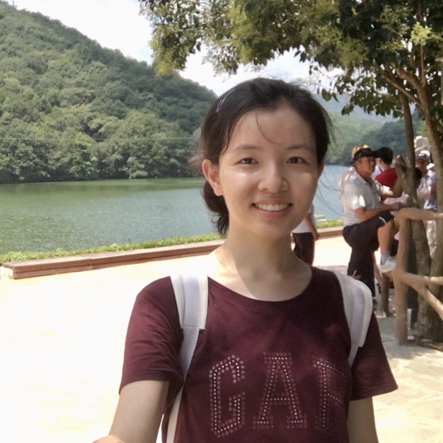

# Hi, I'm Jingxuan.

I'm an applicant for the MFE program at Berkeley Haas. My areas of interest include Deep Neural Networks, NLP-based trading strategies, pension fund management, and biotechnology.

Prior to attending Berkeley, I completed my undergraduate studies at Tsinghua University School of Economics and Management (THU SEM). For more information, please see my [CV](CV/CV_Jingxuan_Wang.pdf).

In my spare time, I am dedicated to volunteering activities and enjoy long-distance cycling. I also have a passion for spicy food.

You can reach me at [jx-wang19@tsinghua.org.cn](mailto:[jx-wang19@tsinghua.org.cn](mailto:jx-wang19@tsinghua.org.cn)).